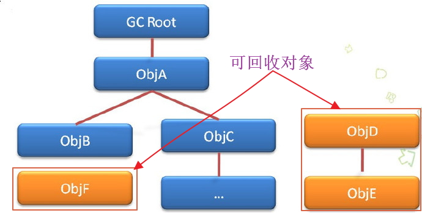
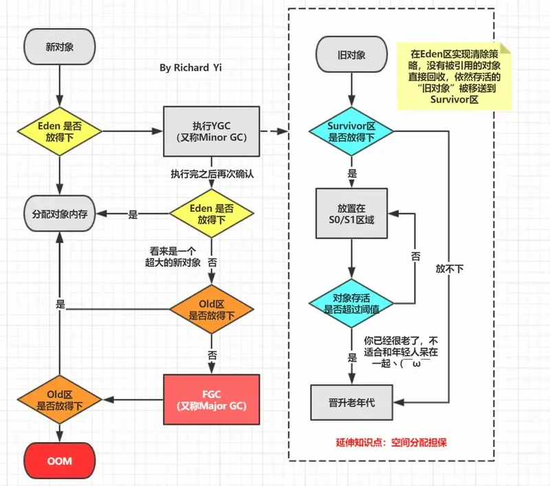
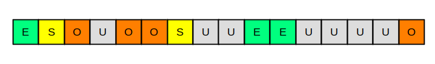

# JVM 垃圾回收机制

## 一、垃圾回收机制的意义

【重点】JVM 内存模型一共包括 5 个部分：Java堆和方法区、虚拟机栈和本地方法栈和程序计数器 。**<font color="red">总的来说，Java堆 和方法区是垃圾回收的主要对象，特别是Java堆</font>**。而虚拟机栈、本地方法栈以及程序计数器属于线程私有的，只存在于线程的生命周期内，线程结束之后就会消失，因此不需要对这三个区域进行垃圾回收。

实际上，【重点 Java 中的内存管理可以归结为自动化地解决了两个问题：**<font color="red">给对象分配内存以及回收分配给对象的内存</font>**】，而且这两个问题针对的内存区域就是 JVM 内存模型中的堆区。另外，我们知道垃圾回收机制是Java语言一个显著的特点，其可以有效的防止内存泄露、保证内存的有效使用，从而使得Java程序员在编写程序的时候不再需要考虑内存管理问题。Java 垃圾回收机制要考虑的问题很复杂，本文阐述了其三个核心问题，包括：

- **<font color="red">如何确定一个对象是否可以被回收？</font>**(两种经典算法: 引用计数法 和 可达性分析算法)
- **<font color="red">什么时候回收？</font>**（堆的新生代、老年代、永久代的垃圾回收时机，MinorGC 和 FullGC）
- **<font color="red">如何回收？</font>**(三种经典垃圾回收算法(标记清除算法、复制算法、标记整理算法)及分代收集算法 和 七种垃圾收集器)

在探讨 Java 垃圾回收机制之前，我们首先应该记住一个单词：Stop-the-World。【重点】Stop-the-world 意味着 JVM 由于 **<font color="red">要执行 GC 而停止了应用程序的执行，并且这种情形会在任何一种 GC 算法中发生</font>**。当 Stop-the-world 发生时，除了 GC 所需的线程以外，所有线程都处于等待状态直到 GC 任务完成。事实上，GC 优化很多时候就是指减少 Stop-the-world 发生的时间，从而使系统具有 **<font color="red">高吞吐 、低停顿</font>** 的特点。

## 二、如何确定一个对象是否可以被回收

### 1.引用计数算法：判断对象的引用数量

引用计数算法是通过判断对象的引用数量来决定对象是否可以被回收。

【重点】**<font color="red">在这种方法中，堆中的每个对象都有一个引用计数器。当一个对象被创建时，引用计数器的数量为 0，然后该对象被分配给一个引用时，该对象的引用计数加 1。当一个引用失效之后（比如引用被设置为一个新值）时，对象的引用计数器就减 1。当引用计数器变为 0 时，对象实例可以被当作垃圾回收</font>**。

【重点】引用计数算法很难解决对象之间相互循环引用的问题，所以 Java 虚拟机不使用引用计数算法。如下面的程序和示意图所示，对象 objA 和 objB 之间的引用计数永远不可能为 0，那么这两个对象就永远不能被回收。

<div align="center">
    
</div>

```java{.line-numbers}
public class ReferenceCountingGC {

    public Object instance = null;

    public static void testGC(){
        ReferenceCountingGC objA = new ReferenceCountingGC ();
        ReferenceCountingGC objB = new ReferenceCountingGC ();

        // 对象之间相互循环引用，对象objA和objB之间的引用计数永远不可能为 0
        objB.instance = objA;
        objA.instance = objB;

        objA = null;
        objB = null;
        System.gc();
    }
} 
```

上述代码最后面两句将 objA 和 objB 赋值为 null，也就是说 objA 和 objB 指向的对象已经不可能再被访问，但是由于它们互相引用对方，导致它们的引用计数器都不为 0，那么垃圾收集器就永远不会回收它们。

### 2.可达性分析算法：判断对象的引用链是否可达

【重点】可达性分析算法是以 GC Roots 为起点进行搜索，可达的对象都是存活的，不可达的对象可以被回收。

可达性分析算法是从离散数学中的图论引入的，程序把所有的引用关系看作一张图，以名为 “GC Roots” 的对象作为起始点，从这些节点开始向下搜索，**<font color="red">搜索所走过的路径称为引用链（Reference Chain）。当一个对象与 GC Roots 没有任何引用链相连（用图论的话来说就是从 GC Roots 到这个对象不可达）时，则证明此对象是不可用的</font>**，如下图所示。

在 Java 中，可作为 GC Root 的对象包括以下几种：

- 虚拟机栈(栈帧中的局部变量表)中引用的对象；
- 方法区中类静态属性引用的对象；
- 方法区中常量引用的对象；
- 本地方法栈中引用的对象；

<div align="center">
    
</div>

### 3.Java 中的引用

Java 对引用的概念进行了扩充，将引用分为强引用（Strong Reference）、软引用（Soft Reference）、弱引用（Weak Reference）、虚引用（Phantom Reference）4 种，这 4 种引用强度依次逐渐减弱。这样子设计的原因主要是为了描述这样一类对象：当内存空间还足够时，则能保留在内存之中；如果内存空间在进行垃圾收集后还是非常紧张，则可以抛弃这些对象。很多系统的缓存功能都符合这样的应用场景。

对不同的引用类型，JVM 在进行 GC 时会有着不同的执行策略。

#### 3.1 强引用（Strong Reference）

```java{.line-numbers}
MyClass obj = new MyClass(); // 强引用
```

只要强引用存在，垃圾收集器永远不会回收被引用的对象，即使抛出内存溢出的 OOM 异常。但是，如果我们错误地保持了强引用，比如：赋值给了 static 变量，那么对象在很长一段时间内不会被回收，会产生内存泄漏。

#### 3.2 软引用（Soft Reference）

【重点】软引用是一种相对强引用弱化一些的引用，只有当 JVM 认为内存不足时，才会去试图回收软引用指向的对象。比如 JVM 会确保在抛出 OutOfMemoryError 之前，清理软引用指向的对象。软引用通常用来实现内存敏感的缓存，如果还有空闲内存，就可以暂时保留缓存，当内存不足时清理掉，这样就保证了使用缓存的同时，不会耗尽内存：

```java{.line-numbers}
SoftReference<MyClass> softReference = new SoftReference<>(new MyClass()); 
```

#### 3.3 弱引用（Weak Reference）

【重点】弱引用的强度比软引用更弱一些。当 JVM 进行垃圾回收时，无论内存是否充足，都会回收只被弱引用关联的对象。

```java{.line-numbers}
WeakReference<MyClass> weakReference = new WeakReference<>(new MyClass()); 
```

#### 3.4 虚引用（Phantom References）

【重点】虚引用是最弱的一种引用关系。一个对象是否有虚引用的存在，完全不会对其生存时间构成影响，也无法通过虚引用来取得一个对象实例。为一个对象设置虚引用一般是为了能在这个对象被收集器回收时收到一个系统通知。

```java{.line-numbers}
PhantomReference<MyClass> phantomReference = new PhantomReference<>(new MyClass(), new ReferenceQueue<>()); 
```

### 4.方法区的回收

**<font color="red">方法区主要存放永久代对象，因此回收主要是对常量池的回收和对类的卸载</font>**。为了避免内存溢出，**<font color="red">在大量使用反射和动态代理的场景都需要虚拟机具备类卸载功能</font>**。而永久代对象的回收率比新生代低很多，所以在方法区上进行回收性价比不高。

类的卸载条件很多，需要满足以下三个条件，并且满足了条件也不一定会被卸载：

- 该类所有的实例都已经被回收，此时堆中不存在该类的任何实例。
- 加载该类的 ClassLoader 已经被回收。
- 该类对应的 Class 对象没有在任何地方被引用，也就无法在任何地方通过反射访问该类方法。

## 三、垃圾收集算法

### 1.标记清除算法

【重点】标记-清除算法分为标记和清除两个阶段。该算法首先从根集合进行扫描，对存活的对象标记。标记完毕后，再扫描整个空间中未被标记的对象并进行回收，如下图所示。

<div align="center">
    
</div>

标记-清除算法的主要不足有两个：

- **效率问题**：标记和清除两个过程的效率都不高;
- **空间问题**：标记-清除算法不需要进行对象的移动，并且仅对不存活的对象进行处理，因此标记清除之后会产生大量不连续的内存碎片，空间碎片太多可能会导致以后在程序运行过程中需要分配较大对象时，无法找到足够的连续内存而不得不提前触发另一次垃圾收集动作。

<div align="center">
    
</div>

### 2.复制算法

【重点】**<font color="red">复制算法将内存分为大小相等的两块，每次只使用其中的一块。当这一块的内存用完了，就将还存活着的对象复制到另外一块上面，然后再把已使用过的内存空间一次清理掉。这种算法适用于对象存活率低的场景，比如新生代</font>**。这样实现简单，运行高效。该算法示意图如下所示：

<div align="center">
    
</div>

这种算法的缺点是会浪费一部分内存空间，同时当存活的对象比较多时，对象内存的复制可能会消耗比较多的性能。

事实上，现在商用的虚拟机都采用这种算法来回收新生代。因为研究发现，**<font color="red">新生代中每次回收时基本上只有 10% 左右的对象存活，所以需要复制的对象很少，效率还不错</font>**。正如在 JVM  内存模型中介绍的那样，实践中会将新生代内存分为一块较大的 Eden 空间和两块较小的 Survivor 空间 (如下图所示)，**<font color="red">每次使用 Eden 和其中一块 Survivor</font>**。当回收时，将 Eden 和 Survivor 中还存活着的对象一次地复制到另外一块 Survivor 空间上，最后清理掉 Eden 和刚才用过的 Survivor 空间。HotSpot 虚拟机默认 Eden 和 Survivor 的大小比例是 8:1，也就是每次新生代中可用内存空间为整个新生代容量的 90% (80%+10% )，只有 10% 的内存会被“浪费”。

<div align="center">
    
</div>

#### 2.1 内存分配担保

当然，98% 的对象可回收只是一般场景下的数据，我们没有办法保证每次回收都只有不多于 10% 的对象存活，当 Survivor 空间不够用时，需要依赖其他内存（这里指老年代）进行分配担保（Handle Promotion）。内存的分配担保就好比我们去银行借款，如果我们信誉很好，在 98% 的情况下都能按时偿还，于是银行可能会默认我们下一次也能按时按量地偿还贷款，只需要有一个担保人能保证如果我不能还款时，可以从他的账户扣钱，那银行就认为没有风险了。

**<font color="red">内存的分配担保也一样，如果另外一块 Survivor 空间没有足够空间存放上一次新生代收集下来的存活对象时，这些对象将直接通过分配担保机制进入老年代</font>**。

<div align="center">
    
</div>

### 3.标记整理算法

【重点】复制收集算法在对象存活率较高时就要进行较多的复制操作，效率将会变低。更关键的是，为了应对被使用的内存中所有对象都 100% 存活的极端情况，就需要分配额外的空间，所以在老年代一般不能直接选用复制收集算法。

【重点】**<font color="red">标记整理算法的标记也是从根结点开始扫描，对存活对象进行标记，然后让所有存活的对象都向一端移动，然后直接清理掉端边界以外的内存，该垃圾回收算法适用于对象存活率高的场景（老年代），其作用原理如下图所示</font>**。

<div align="center">
    
</div>

标记整理算法与标记清除算法最显著的区别是：标记清除算法不进行对象的移动，并且仅对不存活的对象进行处理；而标记整理算法会将所有的存活对象移动到一端，并对不存活对象进行处理，因此其不会产生内存碎片。标记整理算法的作用示意图如下：

<div align="center">
    
</div>

### 4.分代收集算法

对于一个大型的系统，当创建的对象和方法变量比较多时，堆内存中的对象也会比较多，如果逐一分析对象是否该回收，那么势必造成效率低下。分代收集算法是基于这样一个事实：不同对象的生命周期(存活情况)是不一样的，而不同生命周期的对象位于堆中不同的区域，因此对堆中不同区域采用不同的策略进行回收可以提高 JVM 的执行效率。

当代商用虚拟机使用的都是分代收集算法：新生代对象存活率低，就采用复制算法；老年代存活率高，就用标记清除算法或者标记整理算法。Java 堆内存一般可以分为新生代、老年代和永久代三个模块，如下图所示：

<div align="center">
    
</div>

#### 4.1 新生代（Young Generation）

**<font color="red">新生代的目标就是尽可能快速的收集掉那些生命周期短的对象，一般情况下，所有新生成的对象首先都是放在新生代的</font>**。新生代内存按照 8:1:1 的比例分为一个 eden 区和两个 survivor (survivor0，survivor1) 区，大部分对象在 eden 区中生成。在进行垃圾回收时，将 eden 区和 survivor0 区存活对象复制到 survivor1 区，然后清空 eden 和这个 survivor0 区，此时 survivor0 区是空的，然后交换 survivor0 区和 survivor1 区的角色（即下次垃圾回收时会扫描 eden 区和 survivor1 区），即保持 survivor0 区为空，如此往复。特别地，当 survivor1 区也不足以存放 eden 区和 survivor0 区的存活对象时，就将存活对象直接存放到老年代。如果老年代也满了，就会触发一次 FullGC，也就是新生代、老年代都进行回收。注意，新生代发生的 GC 也叫做 MinorGC，MinorGC 发生频率比较高，不一定等 eden 区满了才触发。

#### 4.2 老年代

**<font color="red">老年代存放的都是一些生命周期较长的对象，就像上面所叙述的那样，在新生代中经历了 N 次垃圾回收后仍然存活的对象就会被放到老年代中</font>**。此外，老年代的内存也比新生代大很多 (大概比例是 1:2)，当老年代满时会触发 Major GC(Full GC)，老年代对象存活时间比较长，因此 FullGC 发生的频率比较低。

#### 4.3 永久代

**<font color="red">永久代主要用于存放常量池和类数据等</font>**。永久代对垃圾回收没有显著影响，但是有些应用可能动态生成或者调用一些 class，例如使用反射、动态代理、CGLib 等 bytecode 框架时，在这种时候需要设置一个比较大的永久代空间来存放这些运行过程中新增的类。

### 5.小结

<div align="center">
    
</div>

由于对象进行了分代处理，因此垃圾回收区域、时间也不一样。垃圾回收有两种类型，Minor GC 和 Full GC。

- Minor GC：对新生代进行回收，不会影响到年老代。因为新生代的 Java 对象大多死亡频繁，所以 Minor GC 非常频繁，一般在这里使用速度快、效率高的算法，使垃圾回收能尽快完成。
- Full GC：对整个堆进行回收，包括新生代和老年代。由于 Full GC 需要对整个堆进行回收，所以比 Minor GC 要慢，因此应该尽可能减少 Full GC 的次数，导致 Full GC 的原因包括：**<font color="red">老年代被写满、永久代（Perm）被写满和 **`System.gc()`** 被显式调用等</font>**。

下面这张图总结了 JVM 中的内存分配流程：

<div align="center">
    
</div>

## 四、垃圾收集器

首先要认识到的一个重要方面是，对于大多数 JVM，需要两种不同的 GC 算法，一种用于清理新生代，另一种用于清理老年代。意思就是说，在 JVM 中你通常会看到两种垃圾收集器组合使用。下图是 JVM 中所有的收集器（Java 8），其中有连线的就是可以组合的。垃圾收集器还可以进行如下分类：

- 单线程和多线程：单线程指的是垃圾收集器只使用一个线程，而多线程使用多个线程进行垃圾收集。
- 串行与并行：串行指的是垃圾收集器与用户程序交替执行，这意味着在执行垃圾收集的时候需要停顿用户程序；并行指的是垃圾收集器和用户程序同时执行。**<font color="red">除了 CMS 和 G1 之外，其它垃圾收集器都是以串行的方式执行</font>**。

<div align="center">
    
</div>

为了减小复杂性，快速记忆，我这边直接给出比较常用的几种组合。其他的要么是已经废弃了要么就是在现实情况下不实用的。

<div align="center">
    
</div>

接下去我们开始具体介绍上各个垃圾收集器。这里需要提一下的是，我这边是将垃圾收集器分成以下几类来讲述的：

- Serial GC
- Parallel GC
- Concurrent Mark and Sweep （CMS）
- G1 - Garbage First

下面我们先对 7 个垃圾收集器进行一个简单介绍：

- Serial 收集器（复制算法): 新生代单线程收集器，标记和清理都是单线程，简单高效。并且在进行垃圾收集时，需要暂停用户线程，串行执行。
- ParNew 收集器 (复制算法): 新生代并行收集器，实际上是 Serial 收集器的多线程版本，在多核 CPU 环境下有着比 Serial 更好的表现，垃圾收集时也需要暂停用户线程，串行执行；
- Parallel Scavenge 收集器 (复制算法): 新生代并行收集器，垃圾收集需要暂停用户线程，也就是串行收集，但是收集时可以使用多线程进行垃圾收集。另外追求高吞吐量，高效利用 CPU。吞吐量 = 用户线程时间/(用户线程时间+GC线程时间)，我们可以通设置一些虚拟机参数来控制吞吐量和垃圾回收最大停顿时间；
- Serial Old 收集器 (标记-整理算法): 老年代单线程收集器，Serial 收集器的老年代版本，垃圾收集需要暂停用户线程，串行执行；
- Parallel Old 收集器 (标记-整理算法)： 老年代并行收集器，吞吐量优先，Parallel Scavenge收集器的老年代版本，同样垃圾收集也需要暂停用户线程，串行执行；
- CMS (Concurrent Mark Sweep) 收集器（标记-清除算法）: 老年代收集器，**<font color="red">追求最短 GC 回收停顿时间，垃圾收集时，分为 4 个阶段：初始标记(STW)、并发标记、最终标记(STW)以及并发清除。在并发标记和并发清除阶段可以和用户线程同时执行</font>**。
- G1 (Garbage First) 收集器 (标记-整理算法): Java 堆并行收集器，G1 收集器是 JDK1.7 提供的一个新收集器，G1 收集器基于“标记-整理”算法实现，也就是说不会产生内存碎片。此外，G1收集器不同于之前的收集器的一个重要特点是：G1回收的范围是整个Java堆(包括新生代，老年代)，而前六种收集器回收的范围仅限于新生代或老年代。分为 4 个阶段：初始标记(STW)、并发标记、最终标记(STW)和清除回收(STW)。在并发标记阶段可以和用户线程同时执行，但是和 CMS 不同的是，在清除回收阶段需要暂停用户线程。这个原因可能是因为 G1 收集器采用标记整理算法，也就是会移动对象的地址，这时用户线程继续执行的话可能出错，所以在清除回收阶段需要暂停用户线程。另外，G1 收集器需要考虑的是在垃圾回收时避免全堆扫描的问题，所以使用了 remembered set 这个结构记录了哪些区域 Region 引用了当前 Region 中的对象。 remembered set 是一个 hash table，key 就是别的 Region 起始地址，然后 value 是一个集合，集合中的元素是卡表 card table 的下标 index。

### 1.串行收集器

【重点】**<font color="red">Serial 可以理解成串行。串行收集器有Serial 和 Serial Old 两种，它们的唯一区别就是：Serial 工作在新生代，使用“复制”算法，Serial Old 工作在老年代，使用“标志-整理”算法</font>**。“串行”的意义不仅仅是指它进行垃圾收集时，需要暂停其它所有线程，直到垃圾收集结束。另外， Serial 和 Serila Old 垃圾收集器都是使用单线程来进行垃圾收集。

<div align="center">
    
</div>

虽然新的收集器很多，但是串行收集器仍有其适合的场景。迄今为止，它依然是 HotSpot 虚拟机运行在客户端模式下的默认新生代收集器，有着优于其他收集器的地方：

- 对于内存资源受限的环境，它是所有收集器里额外内存消耗最小的；
- 没有线程交互的开销，Serial 收集器可以很好地专注于收集垃圾，把用户线程都停掉。（这里实际上也是一个时间换空间的概念）；

通过 JVM 参数 **`-XX:+UseSerialGC`** 可以使用串行垃圾回收器。

### 2.并行收集器

按照程序发展的思路，单线程处理之后，下一步很自然就到了多线程并行处理的时代。并行收集器是多线程的收集器，在多核 CPU 下能够很好的提高收集性能。

<div align="center">
    
</div>

这里我们会介绍：

- ParNew: ParNew 收集器就是 Serial 收集器的多线程版本，**<font color="red">基于“复制”算法对新生代进行收集，其他方面完全一样</font>**，在 JDK9 之后差不多退出历史舞台，只能配合 CMS 在 JVM 中发挥作用。
- Parallel Scavenge: Parallel Scavenge 收集器和 ParNew 收集器类似，基于“复制”算法对新生代进行收集，但前者更关注可控制的吞吐量，并且能够通过 **`-XX:+UseAdaptiveSizePolicy`** 打开垃圾收集自适应调节策略的开关。CMS 收集器与 Parallel Scavenge 收集器不能配合工作的一个原因是：Parallel Scavenge 收集器内部并没有按照分代收集的框架进行设计垃圾回收，在之后的 G1 收集器也同样没有按照分代回收的框架设计。Parallel Scavenge 收集器的特别之处在于它与其它收集器的关注点不一样，其它垃圾收集器关注如何最大限度地减少 STW 的时间，**<font color="red">而 Parallel Scavenge 关注的是如何达到一个可控制的吞吐量（Throughput），由于与吞吐量关系密切，所以也被称作“吞吐量优先收集器”</font>**。
- Parallel Old: Parallel Old 就是 Parallel Scavenge 收集器的老年代版本，基于“标记-整理”算法实现对老年代进行收集。

#### 2.1 ParNew 收集器

**<font color="red">ParNew 收集器除了支持多线程并行收集之外，其他与 Serial 收集器相比并没有太多创新之处</font>**，但它却是不少运行在服务端模式下的 HotSpot 虚拟机，其中有一个与功能、性能无关但其实很重要的原因是：除了 Serial 收集器外，目前只有它能与 CMS 收集器配合工作。

#### 2.2 Parallel Scavenge 收集器

**<font color="red">Parallel Scavenge 收集器与 ParNew 收集器类似，也是使用复制算法的并行的多线程新生代收集器。但 Parallel Scavenge 收集器关注可控制的吞吐量（Throughput）</font>**。吞吐量是指 CPU 用于运行用户代码的时间与 CPU 总消耗时间的比值，即吞吐量 = 运行用户代码时间 /（ 运行用户代码时间 + 垃圾收集时间 ）。Parallel Scavenge 收集器提供了几个参数用于精确控制吞吐量和停顿时间，比如垃圾收集的最大停顿时间和吞吐量的值：

<div align="center">
    
</div>

#### 2.3 Parallel Old 收集器

Parallel Old 是 Parallel Scavenge 收集器的老年代版本，多线程，基于“标记-整理”算法。这个收集器是在 JDK 1.6 中才开始提供的。Parallel Scavenge 和 Parallel Old 收集器的组合更适用于注重吞吐量以及 CPU 资源敏感的场合。

### 3.CMS 收集器

**<font color="red">CMS (Concurrent Mark Sweep，并发标记清除) 收集器是以获取最短回收停顿时间为目标的收集器（追求低停顿），它使得用户线程和 GC 线程并发执行</font>**，因此在垃圾收集过程中用户也不会感到明显的卡顿。从名字就可以知道，CMS 是基于“标记- 清除”算法实现的。它的工作过程相对于上面几种收集器来说，就会复杂一点。整个过程分为以下四步：

1. 初始标记（CMS initial mark）：主要是标记 GC Root 开始的下级（注：仅下一级）对象，这个过程会 STW，但是跟 GC Root 直接关联的下级对象不会很多，因此这个过程其实很快。
2. 并发标记 (CMS concurrent mark)：根据上一步的结果，继续向下标识所有关联的对象，直到这条链上的最尽头。这个过程是多线程的，虽然耗时理论上会比较长，但是其它工作线程并不会阻塞，没有 STW。
3. 最终标记（CMS remark）：顾名思义，就是要再标记一次。为啥还要再标记一次？因为第 2 步并没有阻塞其它工作线程，其它线程在标识过程中，很有可能会产生新的垃圾。

> 这里举一个很形象的例子：
> 就比如你和你的小伙伴（多个 GC 线程）给一条长走廊打算卫生，从一头打扫到另一头。当你们打扫到走廊另一头的时候，可能有同学（用户线程）丢了新的垃圾。所以，为了打扫干净走廊，需要你示意所有的同学（用户线程）别再丢了（进入 STW 阶段），然后你和小伙伴迅速把刚刚的新垃圾收走。当然，因为刚才已经收过一遍垃圾，所以这次收集新产生的垃圾，用不了多长时间（即：STW 时间不会很长）。

4. 并发清除（CMS Concurrent Sweep）

<div align="center">
    
</div>

为什么 CMS 要使用“标记- 清除”算法呢？刚才我们不是提到过“标记- 清除”算法，会留下很多内存碎片吗？确实，但是也没办法，如果换成“标记 - 整理”算法，把垃圾清理后，剩下的对象也顺便整理，会导致这些对象的内存地址发生变化，别忘了，此时其它线程还在工作，如果引用的对象地址变了，就天下大乱了。另外，由于最后一步并发清除时，并不阻塞其它线程，所以还有一个副作用，在清理的过程中，仍然可能会有新垃圾对象产生，只能等到下一轮 GC，才会被清理掉。

CMS 收集器有如下缺点：

1. 对处理器资源特别敏感，由于是并发执行，所以 CMS 收集器工作时会占用一部分 CPU 资源而导致用户程序变慢，降低总吞吐量，建议具有四核处理器以上的服务器使用 CMS 收集器。
2. CMS 无法清除浮动垃圾，有可能出现 Concurrent Mode Failure 失败而导致另一次 STW 的 Full GC 产生。**<font color="red">由于并发清理过程中用户线程与 GC 线程并发执行，就一定会产生新的垃圾对象</font>**，但是无法在本次 GC 中处理这些垃圾对象，**<font color="red">不得不推迟到下一次 GC 中处理，这些垃圾对象就称为“浮动垃圾”</font>**。
3. 基于标记- 清除算法会导致内存碎片不断增多，在分配大对象时有可能会提前触发一次 Full GC。所以 CMS 提供两个参数可供开发者指定在每次 Full GC 时进行碎片整理，由于碎片整理需要移动对象，所以是无法并发收集的。

### 4.Garbage First 收集器

#### 4.1 G1 收集器简介

鉴于 CMS 的一些不足之外，比如: **<font color="red">内存碎片化，STW 时间虽然已经改善了很多，但是仍然有提升空间</font>**。G1 就横空出世了，它对于堆区的内存划思路很新颖，有点算法中分治法“分而治之”的味道。具体什么意思呢，让我们继续看下去。G1 将连续的 Java 堆划分为多个大小相等的独立区域（Region），每一个 Region 都可以根据需要，扮演新生代的 Eden 空间、Survivor 空间，或者老年代空间。每个 Region 的大小可以通过参数 **`-XX:G1HeapRegionSize`** 设定，取值范围为 1MB～32MB，且应为 2 的 N 次幂。

<div align="center">
    
</div>

认识了 G1 中的内存规划之后，我们就可以理解为什么它叫做"Garbage First"。所有的垃圾回收，都是基于 region 的。

【重点】G1 根据各个 Region 回收所获得的空间大小以及回收所需时间等指标在后台维护一个优先列表，每次根据允许的收集时间，优先回收价值最大（垃圾）的 Region，从而可以避免在整个 Java 堆中进行全区域的垃圾收集。这也是 "Garbage First" 得名的由来。

**<font color="red">G1 从整体来看是基于“标记- 整理”算法实现的收集器，但从局部（两个 Region 之间）上看又是基于“复制”算法实现</font>**，无论如何，这两种算法都意味着 G1 运作期间不会产生内存空间碎片，垃圾收集完成之后能提供规整的可用内存。这种特性有利于程序长时间运行，在程序为大对象分配内存时不容易因无法找到连续内存空间而提前触发下一次 GC。

#### 4.2 记忆集（RememberedSet）和卡表（Card Table）

G1 的思路理解起来似乎很容易，但是其中的实现细节却没那么简单。比如，把 Java 堆分为多个 Region 后，垃圾收集是否就真的能以 Region 为单位进行了？因为需要考虑到 Region 不可能是孤立的。一个对象分配在某个 Region 中，它并非只能被本 Region 中的其它对象引用，而是可以与整个 Java 堆任意的对象发生引用关系。那么在做可达性分析判断对象是否存活的时候，难道要扫描整个 Java 堆才能确定谁引用了当前 Region 中的对象？在以前的分代收集中，也同样存在这个问题，新生代的规模一般都比老年代要小许多，新生代的收集也比老年代要频繁许多，如果回收新生代的同时也不得不同时扫描老年代的话，那么 Minor GC 的效率可能下降不少。

G1 GC则是在 card table 之上再加了一层结构来构成 points-into RSet。在 G1 收集器中，Region 之间的对象引用以及其他收集器中的新生代与老年代之间的对象引用，虚拟机都是使用 Remembered Set 来避免全堆扫描的。G1 中的每个 Region 都有一个与之对应的 Remembered Set 用来记录谁引用了当前 Region 中的对象。虚拟机发现程序在对 Reference 类型的数据进行写操作时，会产生一个 Write Barrier 暂时中断写操作，检查 Reference 引用的对象是否处于不同的 Region 之中（在分代的例子中就是检查是否老年代中的对象引用了新生代中的对象），如果是，便通过 Card Table 把 Reference 信息记录到被引用对象所属的 Region 的 Remembered Set 之中。当进行内存回收时，在 GC 根结点的枚举范围中加入 Remembered Set 即可保证不对全堆扫描也不会有遗漏。

每个 region 会记录下到底哪些别的 region 有指向自己的指针，而这些指针分别在哪些 card 的范围内。 这个 Rset 其实是一个 hash table，key 是别的 region 的起始地址，value 是一个集合，里面的元素是 card table 的 index。 举例来说，如果 region A 的Rset 里有一项的 key 是 region B，value 里有 index 为 1 的 card，它的意思就是 region B 的一个 card 里有引用指向 region A。所以对 region A 来说，该 Rset 记录的是 points-into 的关系；

Rset 记录了其他 Region 中的对象引用本 Region 中对象的关系，属于 points-into 结构（谁引用了我的对象）。RSet的价值在于使得垃圾收集器不需要扫描整个堆找到谁引用了当前分区中的对象，只需要扫描RSet即可。如下图所示，Region1 和 Region3 中的对象都引用了Region2中的对象，因此在 Region2 的 Rset 中记录了这两个引用：

<div align="center">
    
</div>

同时，JVM 将每一个内存区域 Region 划分为固定大小的 Card，这里可以类比物理内存上 page 的概念。卡表（Card Table）最简单的形式可以只是一个字节数组，数组中的每一个元素都对应着 Region 中一块特定大小的内存块，整个内存块被称为“卡页”（Card Page）。HotSpot 中卡页大小为 512 字节。如果卡表标识内存区域的起始地址是 0x0000 的话，数组的第 0、1、2 号元素，分别对应了地址范围 0x0000 ~ 0x01FF、0x0200 ~ 0x03FF、0x0400 ~ 0x05FF 的卡页内存块，如下图所示。

<div align="center">
    
</div>

#### 4.3 G1 收集器的步骤

G1 的运作步骤：

1. 初始标记（Initial Marking）：Stop The World，仅使用一条初始标记线程对所有与 GC Roots 直接关联的对象进行标记。
2. 并发标记（Concurrent Marking）：使用一条标记线程与用户线程并发执行。此过程从上一步标记的对象继续对堆中的对象进行可达性分析，找出存活的对象，速度很慢。
3. 最终标记（Final Marking）：为了修正在并发标记期间因用户程序继续运作而导致标记产生变动的那一部分标记记录，虚拟机将这段时间变化记录在线程的 Remembered Set Logs 里面，最终标记阶段需要把 Remembered Set Logs 的数据合并到 Remembered Set 中。这阶段需要停顿线程，但是可 **<font color="red">并行</font>** 执行。
4. 清除回收（Live Data Counting and Evacuation）：回收废弃对象，此时也要 Stop The World，并使用多条筛选回收线程 **<font color="red">并发</font>** 执行。（还会更新 Region 的统计数据，对各个 Region 的回收价值和成本进行排序）。

<div align="center">
    
</div>

从上述阶段的描述可以看出，G1 收集器除了并发标记外，其余阶段也是要完全暂停用户线程的，换言之，它并非纯粹地追求低延迟，官方给它设定的目标是在延迟可控的情况下获得尽可能高的吞吐量。

#### 4.4 G1 收集器总结

G1 其实是 Garbage First 的意思，是优先处理那些垃圾多的内存块的意思。在大的理念上，它还是遵循 JVM 的内存分代假设(其实叫假设不准确，这是从实际 Java 应用的内存使用观察得到的结论):

90% 的对象熬不过第一次垃圾回收，而老的对象( 经历了好几次垃圾回收的对象) 则有 98% 的概率会一直活下来。基于这个分代假设，一般的垃圾回收器把内存分成三类: Eden(E), Suvivor(S) 和 Old(O), 其中 Eden 和 Survivor 都属于年轻代，Old 属于老年代，新对象始终分配在 Eden 里面，熬过一次垃圾回收的对象就被移动到 Survisor 区了，经过数次垃圾回收之后还活着的对象会被移动到 old 区。

跟其它垃圾回收器不一样的是：G1 虽然也把内存分成了这三大类，但是在 G1 里面这三大类不是泾渭分明的三大块内存，G1 把内存划分成很多小块, 每个小块会被标记为 E/S/O 中的一个，可以前面一个是 Eden 后面一个就变成 Survivor 了。

<div align="center">
    
</div>

这么做给 G1 带来了很大的好处，由于把三块内存变成了几百块内存，内存块的粒度变小了，从而可以垃圾回收工作更彻底的并行化。G1 的另一个显著特点他能够让用户设置应用的暂停时间，为什么 G1 能做到这一点呢？也许你已经注意到了，**<font color="red">G1 回收的第 4 步，它是“选择一些内存块”，而不是整代内存来回收</font>**，这是 G1 跟其它 GC 非常不同的一点，其它 GC 每次回收都会回收整个 Generation 的内存 (Eden, Old), 而回收内存所需的时间就取决于内存的大小，以及实际垃圾的多少，所以垃圾回收时间是不可控的；**<font color="red">而 G1 每次并不会回收整代内存，到底回收多少内存就看用户配置的暂停时间，配置的时间短就少回收点，配置的时间长就多回收点，伸缩自如</font>**。

因此 G1 收集器优点如下所示：

- 空间整合：整体来看是基于“标记 - 整理”算法实现的收集器，从局部（两个 Region 之间）上来看是基于“复制”算法实现的，这意味着运行期间不会产生内存空间碎片。
- 可预测的停顿：能让使用者明确指定垃圾收集的暂停时间，因为 G1 在进行垃圾回收的时候，会选择一些内存块而不是对整代进行垃圾回收，用户配置的时间长一些回收的内存就多一些，配置的时间少回收的内存就少一点。
- 并发：可以像 CMS 收集器一样，允许垃圾收集线程和应用线程并行执行，来缩短 Stop-The-World 的停顿时间。

## 五、内存分配与回收策略

### 1.内存分配策略

1. **<font color="red">对象优先在 Eden 分配，当 Eden 区没有足够空间进行分配时，虚拟机将发起一次 MinorGC</font>**。
2. **<font color="red">大对象直接进入老年代</font>**。所谓的大对象是指，需要大量连续内存空间的 Java 对象，最典型的大对象就是那种很长的字符串以及数组。**`-XX:PretenureSizeThreshold`**，大于此值的对象直接在老年代分配，避免在 Eden 区和 Survivor 区之间的大量内存复制。
3. **<font color="red">长期存活的对象将进入老年代</font>**。当对象在新生代中经历过一定次数（默认为 15）的 Minor GC 后，就会被晋升到老年代中。
4. **<font color="red">动态对象年龄判定</font>**。为了更好地适应不同程序的内存状况，虚拟机并不是永远地要求对象年龄必须达到了阈值（MaxTenuringThreshold） 才能晋升老年代，如果在 Survivor 空间中相同年龄所有对象大小的总和大于 Survivor 空间的一半，年龄大于或等于该年龄的对象就可以直接进入老年代，无须等到 MaxTenuringThreshold 中要求的年龄。
5. 空间分配担保：在发生 Minor GC 之前，虚拟机先检查老年代最大可用的连续空间是否大于新生代所有对象总空间，如果条件成立的话，那么 Minor GC 可以确认是安全的。如果不成立的话虚拟机会查看 **`HandlePromotionFailure`** 设置值是否允许担保失败，如果允许那么就会继续检查老年代最大可用的连续空间是否大于历次晋升到老年代对象的平均大小，如果大于，将尝试着进行一次 Minor GC；如果小于，或者 **`HandlePromotionFailure`** 设置不允许冒险，那么就要进行一次 Full GC。

### 2.Full GC 的触发条件

1. 调用 **`System.gc()`**：只是建议虚拟机执行 Full GC，但是虚拟机不一定真正去执行。不建议使用这种方式，而是让虚拟机管理内存。
2. 老年代空间不足：老年代空间不足的常见场景为前文所讲的大对象直接进入老年代、长期存活的对象进入老年代等。为了避免以上原因引起的 Full GC，应当尽量不要创建过大的对象以及数组。除此之外，可以通过 -Xmn 虚拟机参数调大新生代的大小，让对象尽量在新生代被回收掉，不进入老年代。还可以通过 **`-XX:MaxTenuringThreshold`** 调大对象进入老年代的年龄，让对象在新生代多存活一段时间。
3. 空间分配担保失败：使用复制算法的 Minor GC 需要老年代的内存空间作担保，如果担保失败会执行一次 Full GC。
4. JDK 1.7 及以前的永久代空间不足：在 JDK 1.7 及以前，HotSpot 虚拟机中的方法区是用永久代实现的，永久代中存放的为一些 Class 的信息、常量、静态变量等数据。当系统中要加载的类、反射的类和调用的方法较多时，永久代可能会被占满，在未配置为采用 CMS GC 的情况下也会执行 Full GC。如果经过 Full GC 仍然回收不了，那么虚拟机会抛出 **`java.lang.OutOfMemoryError`**。为避免以上原因引起的 Full GC，可采用的方法为增大永久代空间或转为使用 CMS GC。