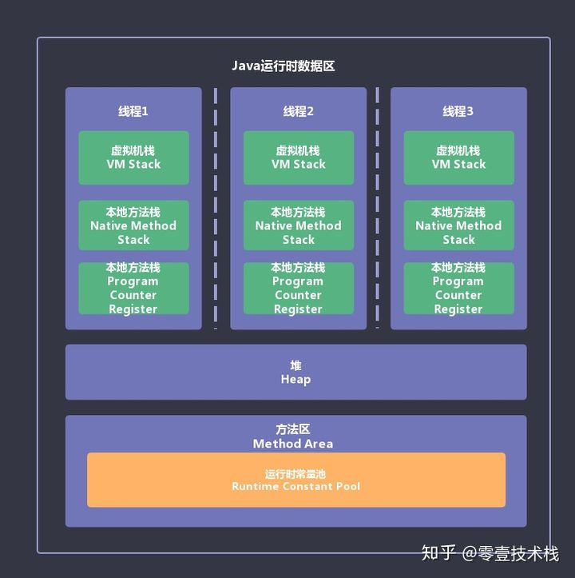
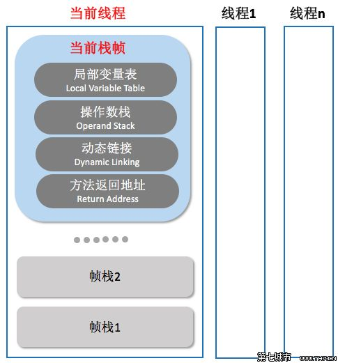
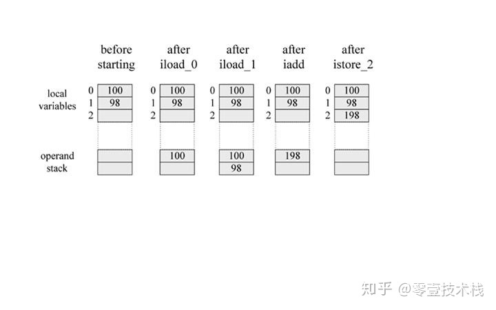
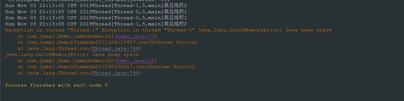

# JVM 内存管理概述

Java 虚拟机执行 Java 程序的过程中，会把所管理的内存划分为若干不同的数据区域。堆和方法区随着虚拟机进程的启动而存在，虚拟机栈、本地方法栈、程序计数器伴随着用户线程的启动和结束而创建和销毁。JVM 内存区域也称为 Java 运行时数据区域。其中包括：程序计数器、虚拟机栈、本地方法栈、堆、方法区等。程序计数器、虚拟机栈、本地方法栈属于每个线程私有的；堆和方法区属于线程共享访问的。

<div align="center">
    
</div>

## 1.程序计数器

**<font color="red">程序计数器用来指示当前线程执行的字节码的行号（如果执行的是本地方法则为空），只占用一小块内存空间</font>**。

- 由于 Java 虚拟机的多线程是通过线程轮流切换并分配处理器执行时间的方式来实现的，在任何一个确定的时刻，一个处理器（对于多核处理器来说是一个内核）都只会执行一条线程中的指令。
- 为了线程切换后能恢复到正确的执行位置，每条线程都需要有一个独立的程序计数器，各条线程之间计数器互不影响，独立存储，我们称这类内存区域为“线程私有”的内存。
- 此内存区域是唯一一个在 Java 虚拟机规范中没有规定任何 **`OutOfMemoryError`** 情况的区域

## 2.Java 虚拟机栈

**<font color="red">每个 Java 方法在执行的同时会创建一个栈帧用来存储局部变量表、操作数栈、动态链接以及方法返回地址等信息。从方法调用直至执行完成的过程，就对应一个栈帧在 Java 虚拟机栈中入栈和出栈的过程。栈帧是线程本地的私有数据，不可能在一个栈帧中引用另外一个线程的栈帧</font>**。

一个线程中方法的调用链可能会很长，很多方法都同时处于执行状态。**<font color="red">对于 JVM 执行引擎来说，在活动线程中，只有位于 JVM 虚拟机栈栈顶的元素才是有效的，即称为当前栈帧</font>**，与这个栈帧相关连的方法称为当前方法，定义这个方法的类叫做当前类。执行引擎运行的所有字节码指令都只针对当前栈帧进行操作。如果当前方法调用了其他方法，或者当前方法执行结束，那这个方法的栈帧就不再是当前栈帧了。

调用新的方法时，新的栈帧也会随之创建。并且随着程序控制权转移到新方法，新的栈帧成为了当前栈帧。方法返回之际，原栈帧会返回方法的执行结果给之前的栈帧(返回给方法调用者)，随后虚拟机将会丢弃此栈帧。

注意：在 Java 虚拟机规范中，对这个区域规定了两种异常。

- 如果当前线程请求的栈深度大于虚拟机栈所允许的深度，将会抛出 StackOverflowError 异常（在虚拟机栈不允许动态扩展的情况下）
- 如果虚拟机栈扩展时无法申请到足够的内存空间，就会抛出 OutOfMemoryError 异常。

在概念模型上，典型的栈帧结构如下：

<div align="center">
    
</div>

关于「栈帧」，我们在看看《Java 虚拟机规范》中的描述：栈帧是用来存储数据和部分过程结果的数据结构，同时也用来处理动态连接、方法返回值和异常分派。栈帧随着方法调用而创建，随着方法结束而销毁——无论方法正常完成还是异常完成都算作方法结束。栈帧的存储空间由创建它的线程分配在 Java 虚拟机栈之中，每一个栈帧都有自己的本地变量表( 局部变量表)、操作数栈和指向当前方法所属的类的运行时常量池的引用。

### 2.1 局部变量表

局部变量表 (Local Variable Table) 是一组变量存储空间，用于存放方法参数和方法内定义的局部变量。局部变量表的容量以变量槽 (Variable Slot) 为最小单位。Java 虚拟机规范并没有定义一个槽所应该占用内存空间的大小，但是规定了一个槽应该可以存放一个 32 位以内的数据类型。

在 Java 程序编译为 Class 文件时，就确定了该方法所需分配的局部变量表的最大容量。(最大 Slot 数量)，并且写入到了方法的 Code 属性中的 **`max_locals`** 数据项中。局部变量表在编译期间分配内存空间，可以存放编译期的各种变量类型：

1. 基本数据类型：boolean, byte, char, short, int, float, long, double 等 8 种；
2. 对象引用类型：reference，指向对象起始地址的引用指针；
3. 返回地址类型：returnAddress，返回地址的类型；

变量槽 (Variable Slot)：变量槽是局部变量表的最小单位，规定大小为 32 位。对于 64 位的 long 和 double 变量而言，虚拟机会为其分配两个连续的 Slot 空间。

### 2.2 操作数栈

**<font color="red">操作数栈 (Operand Stack) 同局部变量表一样，操作数栈的最大深度也在编译的时候确定，并且被写入到方法的 Code 属性的 **`max_stacks`** 数据项中</font>**。Java 虚拟机的解释执行引擎被称为基于栈的执行引擎 ，其中所指的栈就是指－操作数栈。 

操作数栈的每一个元素可以是任意 Java 数据类型，32 位的数据类型占一个栈容量，64 位的数据类型占 2 个栈容量, 且在方法执行的任意时刻，操作数栈的深度都不会超过 **`max_stacks`** 中设置的最大值。

当一个方法刚刚开始执行时，其操作数栈是空的，随着方法执行和字节码指令的执行，会从局部变量表或对象实例的字段中复制常量或变量写入到操作数栈，再随着计算的进行将栈中元素出栈到局部变量表或者返回给方法调用者，也就是出栈/ 入栈操作。一个完整的方法执行期间往往包含多个这样出栈/ 入栈的过程。

和局部变量表不同的是，它不是通过索引来访问，而是通过标准的栈操作 — 压栈和出栈来访问。比如，如果某个指令把一个值压入到操作数栈中，稍后另一个指令就可以弹出这个值来使用。虚拟机把操作数栈作为它的工作区——大多数指令都要从这里弹出数据，执行运算，然后把结果压回操作数栈。

```c{.line-numbers}
begin
iload_0    // push the int in local variable 0 onto the stack
iload_1    // push the int in local variable 1 onto the stack
iadd       // pop two ints, add them, push result
istore_2   // pop int, store into local variable 2
end
```

在这个字节码序列里，前两个指令 **`iload_0`** 和 **`iload_1`** 将存储在局部变量表中索引为 0 和 1 的整数压入操作数栈中，其后 iadd 指令从操作数栈中弹出那两个整数相加，再将结果压入操作数栈。第四条指令 **`istore_2`** 则从操作数栈中弹出结果，并把它存储到局部变量表索引为 2 的位置。

下图详细表述了这个过程中局部变量表和操作数栈的状态变化(图中没有使用的局部变量表和操作数栈区域以空白表示)：

<div align="center">
    
</div>

### 2.3 动态链接

在一个 class 文件中，一个方法要调用其他方法，需要将这些方法的符号引用转化为直接引用（方法在内存地址中的直接地址），而符号引用存在于方法区中的运行时常量池。Java 虚拟机栈中，每个栈帧都包含一个指向运行时常量池中该栈所属方法的符号引用，持有这个引用的目的是为了支持方法调用过程中的动态连接(Dynamic Linking)。

这些符号引用一部分会在类加载阶段或者第一次使用时就直接转化为直接引用，这类转化称为静态解析。另一部分将在每次运行期间转化为直接引用，这类转化称为动态连接。

在方法返回后都需要返回到调用者的位置，程序才能继续执行，方法返回时可能需要恢复它的上层方法执行状态。因此可以执行的操作有：恢复上层方法的局部变量表和操作数栈，把返回值 (如果有的话) 压入调用者的操作数栈中，调整 PC 计数器的值指向方法调用指令后的下一条指令。

### 2.4 方法返回地址

当一个方法开始执行时，可能有两种方式退出该方法：正常完成出口，异常完成出口。

正常完成出口是指方法正常完成并退出，没有抛出任何异常。如果当前方法正常完成，则根据当前方法返回的字节码指令，这时有可能会有返回值传递给方法调用者(调用它的方法)，或者无返回值。具体是否有返回值以及返回值的数据类型将根据该方法返回的字节码指令确定。

**<font color="red">在方法返回后都需要返回到调用者的位置，程序才能继续执行</font>**，方法返回时可能需要恢复它的上层方法执行状态。因此可以执行的操作有：恢复上层方法的局部变量表和操作数栈，把返回值(如果有的话)压入调用者的操作数栈中，调整 PC 计数器的值指向方法调用指令后的下一条指令。

## 3.本地方法栈

本地方法栈与虚拟机栈所发挥的作用非常相似，它们之间的区别是虚拟机栈为虚拟机执行 Java 方法服务，而本地方法栈则为虚拟机使用到的本地方法服务，这些本地方法一般使用其它语言编写的。虚拟机栈和本地方法栈一样，可能抛出的异常类型存在以下两种：

- 如果现场请求的栈深度大于虚拟机所允许的最大深度，将抛出 StackOverflowError 异常。
- 如果虚拟机在扩展栈时无法申请到足够的内存空间，可能会抛出 OutOfMemoryError 异常。

## 4.Java 堆

所有对象都在这里分配内存，是垃圾收集的主要区域（"GC 堆"）。现代的垃圾收集器基本都是采用分代收集算法，**<font color="red">其主要的思想是针对不同类型的对象采取不同的垃圾回收算法</font>**。可以将堆分成两块：新生代（Young Generation）和老年代（Old Generation）。**<font color="red">堆不需要连续内存，并且堆可以动态增加其内存，增加失败会抛出 OutOfMemoryError 异常</font>**。可以通过 **`-Xms`** 和 **`-Xmx`** 这两个虚拟机参数来指定一个程序的堆内存大小，第一个参数设置初始值，第二个参数设置最大值。请看下图：

<div align="center">
    
</div>

我们可以将 Java 堆划分为新生代和老年代两个大模块，在新生代中，我们又可以进一步分为 Eden 空间、From Survivor 空间（s0）、To Survivor 空间（s1），新生代一般用于存放刚刚创建的对象，老年代存放的是经过多次 Minor GC 仍然存活的对象或者是一些大对象。上面就是 Java 堆的具体结构，我们也知道 Java 堆中的各空间大小，我们是可以动态控制的，这个在图中我也进行了简单的标注，下面我们一起来详细的了解一下这三个参数：

- **`-Xms`**：JVM 启动时申请的初始 Heap 值，默认为操作系统物理内存的 1/64，例如 **`-Xms20m`**
- **`-Xmx`**：JVM 可申请的最大 Heap 值，默认值为物理内存的 1/4，例如 **`-Xmx20m`**，我们最好将 **`-Xms`** 和 **`-Xmx`** 设为相同值，避免每次垃圾回收完成后 JVM 重新分配内存；
- **`-Xmn`**：设置新生代的内存大小，**`-Xmn`** 是将 NewSize 与 MaxNewSize 设为一致，我们也可以分别设置这两个参数

在 Java 堆中会发生 OOM 异常，当我们的 Java 堆内没有足够的空间去完成实例分配时，并且堆也无法扩展，将会抛出我们常见的 OutOfMemoryError 异常，如下图所示：

<div align="center">
    
</div>

- 对于大多数应用来说，Java 堆是 Java 虚拟机所管理的内存中最大的一块；
- Java 堆是垃圾收集器管理的主要区域，也被称为 GC堆；
- Java 堆可以处于物理上不连续的内存空间中，只要逻辑上是连续的即可，就像磁盘空间一样；
- 从内存分配的角度来看，线程共享的 Java 堆中可能划分出多个线程私有的分配缓冲区（TLAB）；
- 如果在堆中没有内存完成实例分配，并且堆也无法再扩展时，将会抛出 OutOfMemoryError 异常；

Java 堆用于存储对象实例，只要不断地创建对象，并且保证 GC Roots 到对象之间有可达路径来避免垃圾回收机制清除这些对象，那么在对象数量到达最大堆的容量限制后就会产生内存溢出异常。Java 堆内存的 OOM 异常是实际应用中常见的内存溢出异常情况。当出现 Java 堆内存溢出时，可能有两种情况，第一种是内存泄漏，第二种是不存在内存泄漏。

- 如果是内存泄漏，可进一步通过工具查看泄露对象到 GC Roots 的引用链。于是就能找到泄露对象的类型信息及 GC Roots 引用链的信息，就可以比较准确地定位出泄露代码的位置。
- 如果不存在泄露，就是内存中的对象确实都还必须存活着，那就应当检查虚拟机的堆参数（**`-Xmx`** 与 **`-Xms`**），与机器物理内存对比看是否还可以调大，从代码上检查是否存在某些对象生命周期过长、持有状态时间过长的情况，尝试减少程序运行期的内存消耗。

## 5.方法区

**<font color="red">方法区（Method Area）与 Java 堆一样，是各个线程共享的内存区域</font>**。用于存放已被加载的类的元数据、常量、静态变量、即时编译器编译后的代码等数据。和堆一样可以动态扩展，动态扩展失败一样会抛出 OutOfMemoryError 异常。对这块区域进行垃圾回收的主要目标是对常量池的回收和对类的卸载，但是一般比较难实现。

上面都是 Java 虚拟机中的规范，来看看具体的实现，拿我们常用的 HotSpot 虚拟机来说，在 JDK1.8 之前，方法区也被称作为永久代，这个方法区会发生我们常见的 **`java.lang.OutOfMemoryError: PermGen space`** 异常，我们也可以通过启动参数来控制方法区的大小：

- **`-XX:PermSize`**: 设置最小空间；
- **`-XX:MaxPermSize`**: 设置最大空间；

绝大部分 Java 程序员应该都见过 **`java.lang.OutOfMemoryError: PermGen space`** 这个异常。这里的 PermGen space 其实指的就是方法区。不过方法区和 PermGen space 又有着本质的区别。**<font color="red">方法区是 JVM 的规范，而永久代则是 JVM 规范的一种实现，并且只有 HotSpot 才有 PermGen space</font>**。而对于其他类型的虚拟机，如 JRockit（Oracle）、J9（IBM） 并没有 PermGen space。**<font color="red">由于方法区主要存储类的相关信息，所以对于动态生成类比较多的情况容易出现永久代的内存溢出</font>**。最典型的场景就是，在 jsp 页面比较多的情况，容易出现永久代内存溢出。

移除永久代的工作从 JDK1.7 就开始了，在 JDK1.8 中，永久代就被彻底移除了。存储在永久代的部分数据就已经转移到了 Java Heap 或者是 Native Heap，譬如符号引用(Symbols) 转移到了 native heap；字面量(interned strings) 转移到了 java heap，也就是 **`String.intern`** 方法如果生成新的常量的会，之前会保存到永久代中，现在会保存到 java 堆中；类的静态变量 (class statics) 转移到了 java heap。另外一部分数据（即类的元数据）则保存到了元空间中，如方法、字段、类、包的描述信息，这些信息可以用于创建文档、执行编译时检查。总结一下就是永久代中的数据部分被转移到堆中，另外一部分转移到了元空间中。

元空间的本质和永久代类似，都是对 JVM 规范中方法区的实现。不过元空间与永久代之间最大的区别在于：**<font color="red">元空间并不在虚拟机中，而是使用本地内存</font>**。因此，默认情况下，元空间的大小仅受本地内存限制，但可以通过 **`-XX:MetaspaceSize`** 和 **`-XX:MaxMetaspaceSize`** 参数来指定元空间的大小。

使用元空间的原因如下所示：

- 类及方法的信息等比较难确定其大小，因此对于永久代的大小指定比较困难，太小容易出现永久代溢出，太大则容易导致老年代溢出。
- 永久代里面的常量池都移到堆里面，只保存元数据，从而让 Full GC 不再关心方法区，元空间有单独的元空间虚拟机执行内存分配与垃圾回收。
- 元空间使用直接内存，理论上系统内存有多大，元空间就可以有多大，不存在 OOM。

总结如下：

- Java 虚拟机规范对方法区的限制非常宽松，除了和 Java 堆一样不需要连续的内存和可以选择固定大小或者可扩展外，还可以选择不实现垃圾收集；
- 这区域的内存回收目标主要是针对常量池的回收和对类型的卸载；
- 当方法区无法满足内存分配需求时，将抛出 OutOfMemoryError 异常；

### 5.1 运行时常量池

运行时常量池是方法区的一部分。Class 文件中的常量池（编译器生成的字面量和符号引用），这部分内容将在类加载后会被放入到运行时常量池中存放。运行时常量池相对于 Class 文件常量池的一个重要特征是具备动态性，**<font color="red">Java 语言并不要求常量一定只有编译期才能产生</font>**（也就是并非预置入 Class 文件中常量池的内容才能进入方法区运行时常量池），**<font color="red">运行期间也可能将新的常量放入池中，这种特性被开发人员利用得比较多的便是 String 类的 **`intern()`** 方法</font>**。

当常量池无法再申请到内存时会抛出 OutOfMemoryError 异常。在 OutOfMemoryError 后面跟随的提示信息时 PermGen space。

## 6.直接内存

- 直接内存并不是虚拟机运行时数据区的一部分，也不是 Java 虚拟机规范中定义的内存区域。但是这部分内存也被频繁地使用，而且也可能导致 OutOfMemoryError 异常出现。
- NIO 类，一种基于通道与缓冲区的 I/O 方式，它可以使用 Native 函数库直接分配堆外内存，然后通过一个存储在 Java 堆中的 DirectByteBuffer 对象作为这块内存的引用进行操作。这样能在一些场景中显著提高性能，因为避免了在 Java 堆和 Native 堆中来回复制数据。
- 本机直接内存的分配不会受到 Java 堆大小的限制，但是，既然是内存，肯定还是会受到本机总内存（包括 RAM 以及 SWAP 区或者分页文件）大小以及处理器寻址空间的限制。
- 由 DirectMemory 导致的内存溢出，一个明显的特征是在 Heap Dump 文件中不会看见明显的异常，如果我们发现 OOM 之后 Dump 文件很小，而程序中有直接或间接使用了 NIO，那就可以考虑检查一下是不是这方面的原因。
   