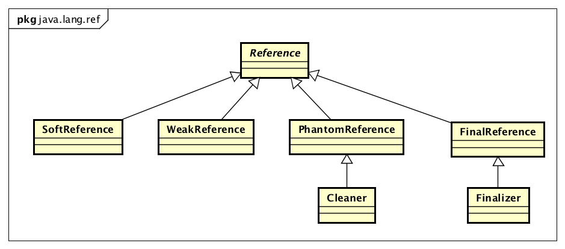
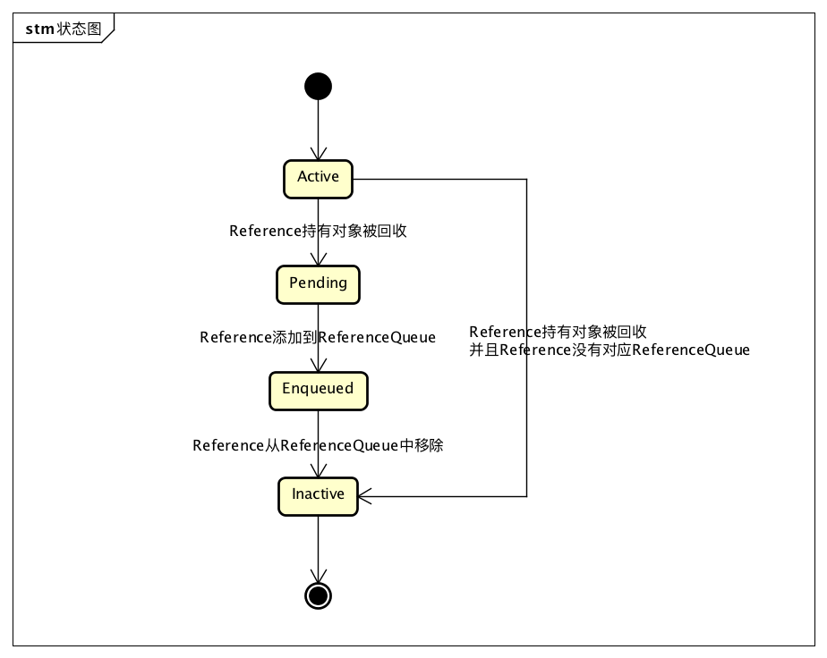
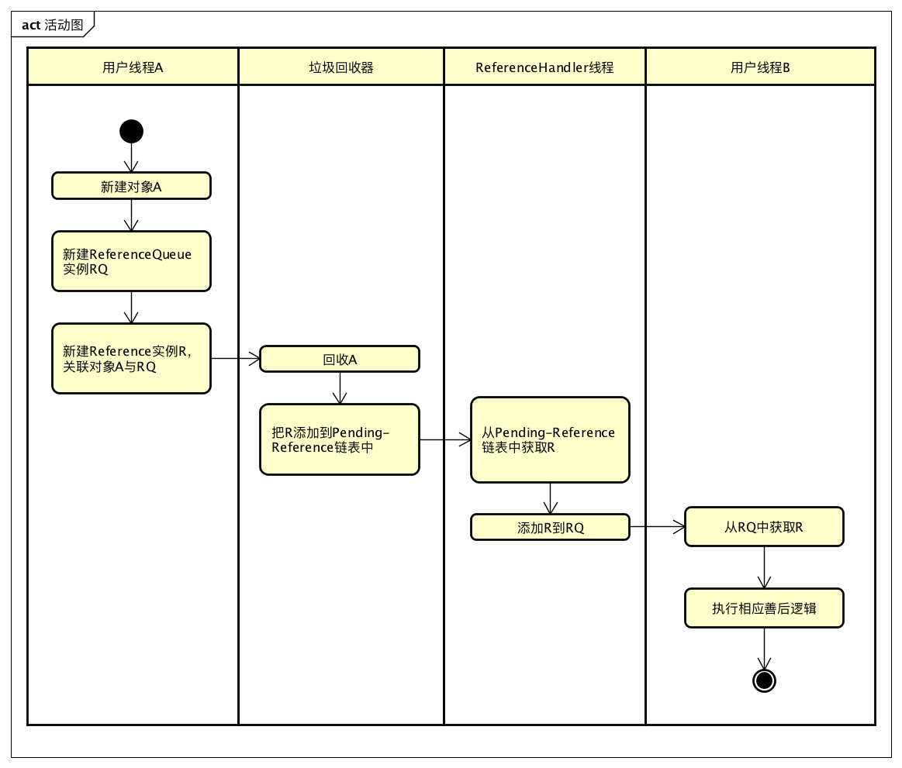

# Java 四种引用类型详解

## 1.Java 中的四种引用

四种引用中，软引用、若引用、虚引用都需要相关类来创建。创建的时候都需要传递一个对象，有时候甚至还需要传递一个引用队列（ReferenceQueue）。通过引用的 get 方法获取真正的对象（虚引用 PhantomReference 对 get 方法进行了重写，始终返回 null）。

### 1.1 StrongReference (强引用)

强引用就是我们一般在程序中引用一个对象的方式：

```java{.line-numbers}
Object obj = new Object();
```

Obj 就是一个强引用。垃圾回收器绝不会回收它，当内存空间不足，Java 虚拟机宁愿抛出 OutOfMemoryError 错误，使程序异常终止，也不会靠回收具有强引用的对象来解决内存不足的问题。

### 1.2 SoftReference (软引用)

软引用的创建要借助于 **`java.lang.ref`** 包下的 SoftReferenc 类。如果一个对象只具有软引用，**<font color="red">则内存空间足够，垃圾回收器就不会回收它；如果内存空间不足了，就会回收这些对象的内存</font>**。只要垃圾回收器没有回收它，该对象就可以被程序使用。软引用可以和一个引用队列（ReferenceQueue）联合使用，如果软引用所引用的对象被垃圾回收器回收，Java 虚拟机就会把这个软引用对象本身加入到与之关联的引用队列中。

```java{.line-numbers}
package javalearning;
 
import java.lang.ref.SoftReference;
/*
 * 虚拟机参数配置
 * -Xms256m
 * -Xmx1024m
*/
public class SoftReferenceDemo {
    public static void main(String[] args){
         
        /*软引用对象中指向了一个长度为300000000个元素的整形数组*/
        SoftReference<int[]> softReference = 
                new SoftReference<int[]>(new int[300000000]);
         
        /*主动调用一次 gc,由于此时 JVM 的内存够用，此时 softReference 引用的对象未被回收*/
        System.gc();
        System.out.println(softReference.get());
         
        /* 消耗内存, 会导致一次自动的 gc, 此时 JVM 的内存不够用
         *就回收 softReference 对象中指向的数组对象*/
        int[] strongReference = new int[100000000];
         
        System.out.println(softReference.get());
    }
} 
```

我们应该注意到，上面的代码中名为 softReference 的引用指向了一个 SoftReference 对象，这个指向还是一个强引用类型。而 SoftReference 对象中指向 int 类型数组的引用就是一个软引用类型了。运行结果如下：

```java{.line-numbers}
[I@2a139a55
null 
```

### 1.3 WeakReference (弱引用)

弱引用的创建要借助于 java.lang.ref 包下的 WeakReferenc 类。弱引用与软引用的区别在于：只具有弱引用的对象拥有更短暂的生命周期。**<font color="red">在垃圾回收器线程扫描它所管辖的内存区域的过程中，一旦发现了只具有弱引用的对象，不管当前内存空间足够与否，都会回收它的内存</font>**。由于垃圾回收器是一个优先级很低的线程，因此不一定会很快发现那些被弱引用指向的对象。

弱引用可以和一个引用队列（ReferenceQueue）联合使用，如果弱引用所引用的对象被垃圾回收，Java 虚拟机就会把这个弱引用对象本身加入到与之关联的引用队列中。

```java{.line-numbers}
package javalearning;
 
import java.lang.ref.WeakReference;
 
public class WeakReferenceDemo {
    public static void main(String[] args){
 
        /*若引用对象中指向了一个长度为1000个元素的整形数组*/
        WeakReference<String[]> weakReference = 
                new WeakReference<String[]>(new String[1000]);
         
        /*未执行gc,目前仅被弱引用指向的对象还未被回收，所以结果不是null*/     
        System.out.println(weakReference.get());
         
        /*执行一次gc,即使目前JVM的内存够用,但还是回收仅被弱引用指向的对象*/
        System.gc();
        System.out.println(weakReference.get());
    }
} 
```

同理，上面的代码中名为 weakReference 的引用指向了一个 WeakReference 对象，这个指向还是一个强引用类型。而 WeakReference 对象中指向 String 类型数组的引用就是一个弱引用类型了。运行结果如下：

```java{.line-numbers}
[Ljava.lang.String;@2a139a55
null 
```

### 1.4 PhantomReference (虚引用)

虚引用顾名思义，就是形同虚设，与其他几种引用都不同，虚引用并不会决定对象的生命周期。**<font color="red">如果一个对象仅持有虚引用，那么它就和没有任何引用一样，在任何时候都可能被垃圾回收器回收</font>**。

**<font color="red">虚引用主要用来跟踪对象被垃圾回收器回收的活动（比如说在 gc 回收虚引用所指向的对象时，执行一些自定义的操作）</font>**。虚引用与软引用和弱引用的一个区别在于：虚引用必须和引用队列 （ReferenceQueue）联合使用。当垃圾回收器准备回收一个对象时，如果发现它还有虚引用，就会在回收对象的内存之前，把这个虚引用对象加入到与之关联的引用队列中。

```java{.line-numbers}
ReferenceQueue queue = new ReferenceQueue ();
PhantomReference pr = new PhantomReference (object, queue);  
```

程序可以通过判断引用队列中是否已经加入了虚引用，来了解被引用的对象是否将要被垃圾回收。**<font color="red">如果程序发现某个虚引用已经被加入到引用队列，那么就可以在所引用的对象的内存被回收之前采取必要的行动</font>**。

### 1.5 ReferenceQueue（引用队列）简介

当 gc（垃圾回收线程）准备回收一个对象时，如果发现它还仅有软引用( 或弱引用，或虚引用) 指向它，就会在回收该对象之前，把这个软引用（或弱引用，或虚引用）加入到与之关联的引用队列（ReferenceQueue）中。如果一个软引用（或弱引用，或虚引用）对象本身在引用队列中，就说明该引用对象所指向的对象马上要被回收了。

当软引用（或弱引用，或虚引用）对象所指向的对象被回收了，那么这个引用对象本身就没有价值了，如果程序中存在大量的这类对象（注意，我们创建的软引用、弱引用、虚引用对象本身是个强引用，不会自动被 gc 回收），就会浪费内存。因此我们这就可以手动回收位于引用队列中的引用对象本身。

除了上面代码展示的创建引用对象的方式。软、弱、虚引用的创建还有另一种方式，即在创建引用的同时关联一个引用队列。

```java{.line-numbers}
SoftReference(T referent, ReferenceQueue<? super T> q)
WeakReference(T referent, ReferenceQueue<? super T> q) 
PhantomReference(T referent, ReferenceQueue<? super T> q) 
```

## 2.Reference 类源码解读

### 2.1 Reference 总体结构

Reference 类是所有引用类型的基类，Java 提供了具体引用类型的具体实现：

<div align="center">
    
</div>

- SoftReference：软引用，堆内存不足时，垃圾回收器会回收对应引用；
- WeakReference：弱引用，每次垃圾回收都会回收其引用；
- PhantomReference：虚引用，对引用无影响，只用于获取对象被回收的通知；
- FinalReference：Java 用于实现 finalization 的一个内部类；

因为默认的引用就是强引用，所以没有强引用的 Reference 实现类。

### 2.2 Reference 核心

Java 的多种引用类型实现，不是通过扩展语法实现的，而是利用类实现的，Reference 类表示一个引用，其核心代码就是一个成员变量 reference：

```java{.line-numbers}
public abstract class Reference<T> {
	private T referent; // 会被GC特殊对待
    
    // 获取Reference管理的对象
    public T get() {
        return this.referent;
    }
    
    // ...
} 
```

**<font color="red">如果 JVM 没有对这个变量做特殊处理，referent 依然只是一个普通的强引用</font>**，之所以会出现不同的引用类型，是因为 JVM 垃圾回收器硬编码识别 SoftReference，WeakReference，PhantomReference 等这些具体的类，对其 referent 变量进行特殊对待，才有了不同的引用类型的效果。上文提到了 Reference 及其子类有两大功能：

- 实现特定的引用类型；
- 用户可以对象被回收后得到通知；

第一个功能已经解释过了，第二个功能是如何做到的呢？

一种思路是在新建一个 Reference 实例是，添加一个回调，当 **`java.lang.ref.Reference#referent`** 被回收时，JVM 调用该回调，这种思路比较符合一般的通知模型，但是对于引用与垃圾回收这种底层场景来说，会导致实现复杂，性能不高的问题，比如需要考虑在什么线程中执行这个回调，回调执行阻塞怎么办等等。

所以 Reference 使用了一种更加原始的方式来做通知，就是把引用对象被回收的 Reference 添加到一个队列中，用户后续自己去从队列中获取并使用。理解了设计后对应到代码上就好理解了，Reference 有一个 queue 成员变量，用于存储引用对象被回收的 Reference 实例：

```java{.line-numbers}
public abstract class Reference<T> {
    // 会被GC特殊对待
	private T referent; 
    // reference被回收后，当前Reference实例会被添加到这个队列中
    volatile ReferenceQueue<? super T> queue;
    
    // 只传入reference的构造函数，意味着用户只需要特殊的引用类型，不关心对象何时被GC
    Reference(T referent) {
        this(referent, null);
    }
	
    // 传入referent和ReferenceQueue的构造函数，reference被回收后，会添加到queue中
    Reference(T referent, ReferenceQueue<? super T> queue) {
        this.referent = referent;
        this.queue = (queue == null) ? ReferenceQueue.NULL : queue;
    }
    
    // ...
} 
```

### 2.3 Reference 状态

Reference 对象是有状态的。一共有 4 种状态：

- Active：新创建的实例所处的状态。如果实例的可达性处于不可达的状态，垃圾回收器会切换实例的状态为 Pending 或者 Inactive。如果 Reference 注册了 ReferenceQueue，则会切换为 Pending，并且 Reference 会加入 Pending-Reference 链表中，如果没有注册 ReferenceQueue，会切换为 Inactive；
- Pending：在 pending-Reference 链表中的 Reference 的状态，这些 Reference 等待被加入 ReferenceQueue 中；
- Enqueued：在 ReferenceQueue 队列中的 Reference 的状态，如果 Reference 从队列中移除，会进入 Inactive 状态；
- Inactive：Reference 的最终状态；

Reference 对象的 4 中状态转换如下：


<div align="center">
    
</div>

除了上文提到的 ReferenceQueue，这里出现了一个新的数据结构：pending-Reference。这个链表是用来干什么的呢？上文提到了，reference 引用的对象被回收后，该 Reference 实例会被添加到 ReferenceQueue 中，但是这个不是垃圾回收器来做的，这个操作还是有一定逻辑的，如果垃圾回收器还需要执行这个操作，会降低其效率。从另外一方面想，Reference 实例会被添加到 ReferenceQueue 中的实效性要求不高，所以也没必要在回收时立马加入 ReferenceQueue。

所以垃圾回收器做的是一个更轻量级的操作：把 Reference 添加到 pending-Reference 链表中。Reference 对象中有一个 pending 成员变量，是静态变量，它就是这个 pending-Reference 链表的头结点。要组成链表，还需要一个指针，指向下一个节点，这个对应的是 **`java.lang.ref.Reference#discovered`** 这个成员变量。

可以看一下代码：

```java{.line-numbers}
public abstract class Reference<T> {
    // 会被GC特殊对待
    private T referent; 
    
    // referent所引用的对象被回收后，当前Reference实例会被添加到这个队列中
    volatile ReferenceQueue<? super T> queue; 
 	
    // 全局唯一的pending-Reference列表
    private static Reference<Object> pending = null;
    
    // Reference为Pending：在pending列表中的下一个元素，如果没有为null
    // 其他状态：NULL
    transient private Reference<T> discovered;  /* used by VM */
    // ...
} 
```

### 2.4 ReferenceHandler 线程

通过上文的讨论，我们知道一个 Reference 实例化后状态为 Active，其引用的对象被回收后，垃圾回收器将其加入到 pending-Reference 链表，然后等待加入 ReferenceQueue。那么加入到 ReferenceQueue 这个过程是如何实现的呢？这个过程不能对垃圾回收器产生影响，所以不能在垃圾回收线程中执行，也就需要一个独立的线程来负责。这个线程就是 ReferenceHandler，它定义在 Reference 类中：

```java{.line-numbers}
// 用于控制垃圾回收器操作与Pending状态的Reference入队操作不冲突执行的全局锁
// 垃圾回收器开始一轮垃圾回收前要获取此锁
// 所以所有占用这个锁的代码必须尽快完成，不能生成新对象，也不能调用用户代码
static private class Lock { };
private static Lock lock = new Lock();

private static class ReferenceHandler extends Thread {

    ReferenceHandler(ThreadGroup g, String name) {
        super(g, name);
    }

    public void run() {
        // 这个线程一直执行
        for (;;) {
            Reference<Object> r;
            // 获取锁，避免与垃圾回收器同时操作
            synchronized (lock) {
                // 判断pending-Reference链表是否有数据
                if (pending != null) {
                    // 如果有Pending Reference，从列表中取出
                    r = pending;
                    pending = r.discovered;
                    r.discovered = null;
                } else {
                    try {
                        try {
                            lock.wait();
                        } catch (OutOfMemoryError x) { }
                    } catch (InterruptedException x) { }
                    continue;
                }
            }

            // 如果Reference是Cleaner，调用其clean方法
            // 这与Cleaner机制有关系，Cleaner为PhantomReference类型的子类，此类在释放DirectByteBuffer的堆外内存时用到
            if (r instanceof Cleaner) {
                ((Cleaner)r).clean();
                continue;
            }

            // 把Reference添加到关联的ReferenceQueue中
            // 如果Reference构造时没有关联ReferenceQueue，会关联ReferenceQueue.NULL，这里就不会进行入队操作了
            ReferenceQueue<Object> q = r.queue;
            if (q != ReferenceQueue.NULL) q.enqueue(r);
        }
    }
} 
```

ReferenceHandler 线程是在 Reference 的 static 块中启动的：

```java{.line-numbers}
static {
    // 获取system ThreadGroup
    ThreadGroup tg = Thread.currentThread().getThreadGroup();
    for (ThreadGroup tgn = tg;
         tgn != null;
         tg = tgn, tgn = tg.getParent());
    Thread handler = new ReferenceHandler(tg, "Reference Handler");

    // ReferenceHandler线程有最高优先级
    handler.setPriority(Thread.MAX_PRIORITY);
    handler.setDaemon(true);
    handler.start();
} 
```

综上，ReferenceHandler 是一个最高优先级的线程，其逻辑是从 Pending-Reference 链表中取出 Reference，添加到其关联的 Reference-Queue 中。

### 2.5 ReferenceQueue

Reference-Queue 也是一个链表：

```java{.line-numbers}
public class ReferenceQueue<T> {
    private volatile Reference<? extends T> head = null;
    // ...
} 

// ReferenceQueue中的这个锁用于保护链表队列在多线程环境下的正确性
static private class Lock { };
private Lock lock = new Lock();

boolean enqueue(Reference<? extends T> r) { /* Called only by Reference class */
    synchronized (lock) {
		// 判断Reference是否需要入队
        ReferenceQueue<?> queue = r.queue;
        if ((queue == NULL) || (queue == ENQUEUED)) {
            return false;
        }
        assert queue == this;
        
        // Reference入队后，其queue变量设置为ENQUEUED
        r.queue = ENQUEUED;
        // Reference的next变量指向ReferenceQueue中下一个元素
        r.next = (head == null) ? r : head;
        head = r;
        queueLength++;
        if (r instanceof FinalReference) {
            sun.misc.VM.addFinalRefCount(1);
        }
        lock.notifyAll();
        return true;
    }
} 
```

通过上面的代码，可以知道 **`java.lang.ref.Reference#next`** 的用途了：

```java{.line-numbers}
public abstract class Reference<T> {
    /* 
     *  next:指向ReferenceQueue中的下一个元素，如果没有，指向this
     */
    Reference next;
    
    // ...
} 
```

### 2.6 总结

在 java 中有四种类型的引用：

- 强引用：jvm 中的垃圾回收器在任何时候（哪怕是内存不足，抛出 OOE 异常）都不会对其所引用的对象进行回收
- 软引用：当 jvm 中内存充足的时候，垃圾收集器不会对其进行垃圾回收；当 jvm 中内存不充足时，就会对其进行垃圾回收，适用于构建一种内存敏感的缓存
- 弱引用：当 jvm 中的垃圾收集器进行垃圾回收时，不管内存是否足够，在碰到了弱引用对象的时候，都会对其进行垃圾回收
- 虚引用：虚引用的存在不会对其引用的对象的生存周期有任何影响，虚引用必须和引用队列一起使用，用于追踪对象的垃圾回收情况。当虚引用引用的对象在被垃圾回收之前，虚引用本身就会被放入到引用队列 ReferenceQueue 中

一个使用 **`Reference+ReferenceQueue`** 的完整流程如下：

<div align="center">
    
</div>