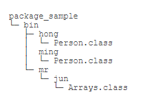
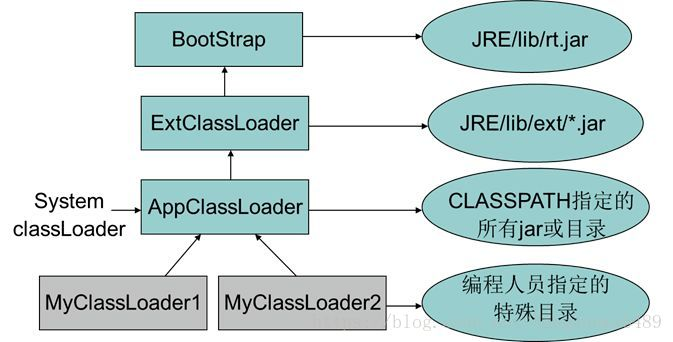

# 一、classpath 和 jar

## 1.1 classpath

在 Java 中，我们经常听到 classpath 这个东西。网上有很多关于“如何设置 classpath”的文章，但大部分设置都不靠谱。到底什么是 classpath？classpath 是 JVM 用到的一个环境变量，它用来指示 JVM 如何搜索 class。因为 Java 是编译型语言，源码文件是 `.java`，而编译后的 `.class` 文件才是真正可以被 JVM 执行的字节码。因此，JVM 需要知道，如果要加载一个 `abc.xyz.Hello` 的类，应该去哪搜索对应的 `Hello.class` 文件。所以，classpath 就是一组目录的集合，它设置的搜索路径与操作系统相关。例如，在 Windows 系统上，用 `;` 分隔，带空格的目录用 `""` 括起来，可能长这样：

```java{.line-numbers}
C:\work\project1\bin;C:\shared;"D:\My Documents\project1\bin"
```

在 Linux 系统上，用 `:` 分隔，可能长这样：

```java{.line-numbers}
/usr/shared:/usr/local/bin:/home/liaoxuefeng/bin
```

现在我们假设 classpath 是 `.;C:\work\project1\bin;C:\shared`，当 JVM 在加载 `abc.xyz.Hello` 这个类时，会依次查找：

- `<当前目录>\abc\xyz\Hello.class`
- `C:\work\project1\bin\abc\xyz\Hello.class`
- `C:\shared\abc\xyz\Hello.class`

注意到 `.` 代表当前目录。如果 JVM 在某个路径下找到了对应的 class 文件，就不再往后继续搜索。如果所有路径下都没有找到，就报错。

classpath 的设定方法有两种：

- 在系统环境变量中设置 classpath 环境变量，不推荐；
- 在启动 JVM 时设置 classpath 变量，推荐。

我们强烈不推荐在系统环境变量中设置 classpath，那样会污染整个系统环境。在启动 JVM 时设置 classpath 才是推荐的做法。实际上就是给 java 命令传入 `-classpath` 或 `-cp` 参数：

```java{.line-numbers}
java -classpath .;C:\work\project1\bin;C:\shared abc.xyz.Hello
```

或者使用 `-cp` 的简写：

```java{.line-numbers}
java -cp .;C:\work\project1\bin;C:\shared abc.xyz.Hello
```

没有设置系统环境变量，也没有传入 `-cp` 参数，那么 JVM 默认的 classpath 为 `.`，即当前目录：

```java{.line-numbers}
java abc.xyz.Hello
```

上述命令告诉 JVM 只在当前目录搜索 `Hello.class`。在 IDE 中运行 Java 程序，IDE 自动传入的 `-cp` 参数是当前工程的 bin 目录和引入的 jar 包。通常，我们在自己编写的 class 中，会引用 Java 核心库的 class，例如，String、ArrayList 等。这些 class 应该上哪去找？有很多“如何设置 classpath”的文章会告诉你把 JVM 自带的 `rt.jar` 放入 classpath，但事实上，根本不需要告诉 JVM 如何去 Java 核心库查找 class，JVM 怎么可能笨到连自己的核心库在哪都不知道？

不要把任何 Java 核心库添加到 classpath 中！JVM 根本不依赖 classpath 加载核心库！更好的做法是，不要设置 classpath！默认的当前目录 `.` 对于绝大多数情况都够用了。

## 1.2 jar 包

如果有很多 `.class` 文件，散落在各层目录中，肯定不便于管理。如果能把目录打一个包，变成一个文件，就方便多了。jar 包就是用来干这个事的，它可以把 package 组织的目录层级，以及各个目录下的所有文件（包括 `.class` 文件和其他文件）都打成一个 jar 文件，这样一来，无论是备份，还是发给客户，就简单多了。

jar 包实际上就是一个 zip 格式的压缩文件，而 jar 包相当于目录。如果我们要执行一个 jar 包的 class，就可以把 jar 包放到 classpath 中：

```java{.line-numbers}
java -cp ./hello.jar abc.xyz.Hello
```

这样 JVM 会自动在 `hello.jar` 文件里去搜索某个类。那么问题来了：如何创建 jar 包？

因为 jar 包就是 zip 包，所以，直接在资源管理器中，找到正确的目录，点击右键，在弹出的快捷菜单中选择“发送到”，“压缩(zipped)文件夹”，就制作了一个 zip 文件。然后，把后缀从 `.zip` 改为 `.jar`，一个 jar 包就创建成功。

假设编译输出的目录结构是这样：

<div align="center">
     
</div>

jar 包还可以包含一个特殊的 `/META-INF/MANIFEST.MF` 文件，`MANIFEST.MF` 是纯文本，可以指定 `Main-Class` 和其它信息。JVM 会自动读取这个 `MANIFEST.MF` 文件，如果存在 `Main-Class`，我们就不必在命令行指定启动的类名，而是用更方便的命令：

```java{.line-numbers}
java -jar hello.jar
```

jar 包还可以包含其它 jar 包，这个时候，就需要在 `MANIFEST.MF` 文件里配置 classpath 了。在大型项目中，不可能手动编写 `MANIFEST.MF` 文件，再手动创建 zip 包。Java 社区提供了大量的开源构建工具，例如 Maven，可以非常方便地创建 jar 包。

# 二、破坏双亲委派模型

## 1 ClassLoader 的作用

ClassLoader 的第一个作用是将 class 文件加载到 JVM 中，第二个作用是确认每个类应该哪一个类加载器加载。第二个作用也用于判断 JVM 运行时的两个类是否相等。影响的判断方法有 `equals()`、`isAssignableFrom()`、`isInstance()` 以及 `instanceof` 关键字，这一点在后文中会举例说明。

类加载的触发可以分为隐式加载和显式加载，其中，隐式加载的情况分为以下 4 种：

1. 遇到 new、getstatic、putstatic、invokestatic 这 4 条字节码指令时
2. 对类进行反射调用时
3. 当初始化一个类时，如果其父类还没有初始化，优先加载其父类并初始化
4. 虚拟机启动时，需指定一个包含 main 函数的主类，优先加载并初始化这个主类

显式加载包括以下 3 种情况：

1. 通过 ClassLoader 的 loadClass 方法
2. 通过 `Class.forName`
3. 通过 ClassLoader 的 findClass 方法

并且，在 JDK1.8 之前加载的类存放在方法区中，而从 JDK8 到现在为止，会加载到元数据区。

## 2 双亲委派模型

类的加载器可以分为以下三类：

### 2.1 启动类加载器（Bootstrap ClassLoader）

负责将所有存放在 `<JAVA_HOME>\lib` 目录中的，或者被 `-Xbootclasspath` 参数所指定路径中，并且可以被虚拟机识别的（仅按照文件名识别，如 `rt.jar`，名字不符合的类库即使放在 lib 目录中也不会被加载）类库加载到虚拟机内存中，启动类记载器无法被 java 程序直接引用

### 2.2 扩展类加载器（Extension ClassLoader）

由 `sum.misc.Launcher&ExtClassLoader` 实现，负责加载 `<JAVA_HOME>\lib\ext\` 目录中的，或者被 `java.ext.dirs` 系统变量所指定的路径中所有的类库，开发者可以直接使用扩展类加载器。

### 2.3 应用程序类加载器（Application ClassLoader）

由 `sum.misc.Launcher&AppClassLoader` 实现，由于这个类记载器是 ClassLoader 中的 `getSystemClassLoader()` 方法方法的返回值，所以一般称为系统类记载器，它负责加载用户类路径（ClassPath）上所指定的类库，开发者可以直接使用这个类加载器。通常是程序默认类加载器。

应用程序都是由这 3 种类加载器互相配合进行加载的，如有必要，还可加入自定义的类加载器，类加载器的模型如下图：

<div align="center">
     
</div>

如图展示的层次关系，称为类加载器的双亲委派模型，双亲委派模型要求除了顶层的启动类加载器外，其余的类加载器都应当有自己的父类加载器。类加载器之间的父子关系一般不会以继承关系实现，而是以组合关系复用父类加载器的代码，它不是一个强制性的模型，是 java 设计者推荐给开发者的一种类加载器实现方式。

## 3 双亲委派模型的工作方式

**<font color="red">如果一个类加载器收到了类加载请求，它首先不会自己去尝试加载这个类，而是把这个请求委派给父类加载器去完成，每一个层次的类加载器都是如此，因此所有的加载请求，都应该传送到顶层的启动类记载器，只有当父加载器反馈自己无法完成这个记载请求（它的搜索范围中没有找到所需的类），子加载器才会尝试自己去加载</font>**。

## 4 主要价值

【重点】采用双亲委派模型，一个显而易见的好处，java 类随着它的类加载器一起具备了一种带有优先级的层次关系，并且解决了 java 中基础类统一的关系。

例如类 `java.lang.Object`，存放在 `<JAVA_HOME>\lib\rt.jar`，无论哪一个类加载器要加载这个类，最终都是委派给处于模型最顶端的启动类加载器进行加载，因此 Object 类在程序的各种类加载器环境中都是同一个类。相反，如果没有双亲委派模型，由各个类加载器去自行加载的话，如果用户编写了一个 `java.lang.Object` 的类，并放在程序的 ClassPath 中，那系统中将会出现多个不同的 Object 类，java 类型体系中最基本的行为也无法保证。

**<font color="red">判断两个类是否相等，只有这两个类是由同一个类加载器加载的前提下才有意义，否则，即使来自于同一个 class 文件，被同一个虚拟机加载，只要加载它们的类加载器不同，那这两个类就必定不相等</font>**。

## 5 双亲委派模型的缺陷

双亲委派模型很好的解决了各个类记载器的基础类统一问题（越基础的类由越上层的类加载器加载），基础类之所以称为基础，是因为它们总是作为被用户调用的 API，但如果基础类又要回调用户的代码，那该怎么办呢。假定 `A` 作为 `B` 的 `parent`，`A` 加载的类 对 `B` 是可见的；然而 `B` 加载的类 对 `A` 却是不可见的。这是由 `classloader` 加载模型中的可见性(`visibility`)决定的。可见性原则允许子类加载器查看父 `ClassLoader` 加载的所有类，但父类加载器看不到子类加载器的类。

<div align="center">
     
</div>

## 6 双亲委派模型不适用的场景

### 6.1 SPI 机制

破坏双亲委派模型的一个常用的场景就是 SPI 机制，SPI 的全名为 `Service Provider Interface`，主要是应用于厂商自定义组件或插件中。在 `java.util.ServiceLoader` 的文档里有比较详细的介绍。

简单的总结下 java SPI 机制的思想：我们系统里抽象的各个模块，往往有很多不同的实现方案，比如日志模块、xml 解析模块、jdbc 模块等方案，这些不同的实现方案不由 jdk 提供，而是由各厂商提供。面向的对象的设计里，我们一般推荐模块之间基于接口编程，模块之间不对实现类进行硬编码。一旦代码里涉及具体的实现类，就违反了可拔插的原则，如果需要替换一种实现，就需要修改代码。为了实现在模块装配的时候能不在程序里动态指明，这就需要一种服务发现机制。Java SPI 就是提供这样的一个机制：为某个接口寻找服务实现的机制。有点类似 IOC 的思想

常见的 SPI 有 JDBC、JNDI、JAXP 等，这些 SPI 的接口由核心类库提供，却由第三方实现，这样就存在以下三个问题：

- **<font color="red">SPI 的接口是 Java 核心库的一部分，由 BootstrapClassLoader 加载</font>**；并且接口的调用逻辑也是在核心库
- **<font color="red">SPI 实现的 Java 类一般是由 AppClassLoader 来加载的</font>**。SPI 的实现类一般是由各厂商提供的，所以不可能再 jdk 的核心库也就是 `/lib` 目录下
- 根据 ClassLoader 加载模型中的可见性原则，BootstrapClassLoader 是无法找到 SPI 的实现类的，因为它只加载 Java 的核心库。它也不能将加载任务委派给 `AppClassLoader`，因为它是最顶层的类加载器。也就是说，双亲委派模型并不能解决这个问题。

如 `java.sql.Driver` 是最为典型的 SPI 接口，`java.sql.DriverManager` 通过扫包的方式拿到指定的实现类，完成 DriverManager 的初始化。问题来了，根据双亲委派的可见性原则，启动类加载器加载的 DriverManager 是不可能拿到系统应用类加载器加载的实现类。

### 6.2 ContextClassLoader

为了解决这个问题，java 设计团队引入了一个不太优雅的设计：线程上下文类加载器（`Thread Context ClassLoader`）。这个类加载器可以通过 `java.lang.Thread` 类的 `setContextClassLoader()` 方法进行设置，如果创建线程时还未设置，它将会从父线程中继承一个，如果在应用程序的全局范围内都没有设置过的话，那这个类加载器默认就是应用程序类加载器 AppClassLoader。

ContextClassLoader 是一种与线程相关的类加载器，类似 ThreadLocal，每个线程对应一个上下文类加载器。在实际使用时一般都用下面的经典结构：

```java{.line-numbers}
ClassLoader targetClassLoader = null;// 外部参数

ClassLoader contextClassLoader = Thread.currentThread().getContextClassLoader();
try {
    Thread.currentThread().setContextClassLoader(targetClassLoader);
    // TODO
} catch (Exception e) {
    e.printStackTrace();
}
finally {
    Thread.currentThread().setContextClassLoader(contextClassLoader);
}
```

上面代码做的事情如下：

- 首先获取当前线程的线程上下文类加载器并保存到方法栈，然后将外部传递的类加载器设置为当前线程上下文类加载器
- `doSomething` 则可以利用新设置的类加载器做一些事情
- 最后在设置当前线程上下文类加载器为老的类加载器

### 6.3 SPI 使用 ContextClassLoader

Java 在核心类库中定义了许多接口，并且还给出了针对这些接口的调用逻辑，然而并未给出实现。开发者要做的就是定制一个实现类，在 `META-INF/services` 中注册实现类信息，以供核心类库使用。在核心类库使用 SPI 接口时，传递的类加载器使用线程上下文类加载器，就可以成功的加载到 SPI 实现的类（被线程上下文类加载器加载的类，能够被核心类库的调用方调用，且实现类不是通过双亲委派模型的方式加载，而是直接用传递的线程上下文类加载器加载）。

下面来看一下 ServiceLoader 的 load 方法源码：

```java{.line-numbers}
public static <S> ServiceLoader<S> load(Class<S> service,
                                        ClassLoader loader) {
    return new ServiceLoader<>(service, loader);
}

public static <S> ServiceLoader<S> load(Class<S> service) {
    // 获取当前线程上下文加载器,这里是APPClassLoader
    ClassLoader cl = Thread.currentThread().getContextClassLoader();
    return ServiceLoader.load(service, cl);
}
```

上述代码获得了线程上下文加载器(其实就是 AppClassLoader)，并将该类加载器传递到下面的 ServiceLoader 类的构造方法 loader 成员变量中：

```java{.line-numbers}
private ServiceLoader(Class<S> svc, ClassLoader cl) {
    service = Objects.requireNonNull(svc, "Service interface cannot be null");
    loader = (cl == null) ? ClassLoader.getSystemClassLoader() : cl;
    acc = (System.getSecurityManager() != null) ? AccessController.getContext() : null;
    reload();
}
```

上述 loader 变量什么时候使用的?看一下下面的代码:

```java{.line-numbers}
public S next() {
    if (acc == null) {
        return nextService();
    } else {
        PrivilegedAction<S> action = new PrivilegedAction<S>() {
            public S run() {
                return nextService();
            }
        };
        return AccessController.doPrivileged(action, acc);
    }
}
```

```java{.line-numbers}
private S nextService() {
    if (!hasNextService())
        throw new NoSuchElementException();
    String cn = nextName;
    nextName = null;
    Class<?> c = null;
    try {
        // 使用loader类加载器加载
        // 至于cn怎么来的,可以参照next()方法
        c = Class.forName(cn, false, loader);
    } catch (ClassNotFoundException x) {
        fail(service,
             "Provider " + cn + " not found");
    }
    if (!service.isAssignableFrom(c)) {
        fail(service,
             "Provider " + cn  + " not a subtype");
    }
    try {
        S p = service.cast(c.newInstance());
        providers.put(cn, p);
        return p;
    } catch (Throwable x) {
        fail(service,
             "Provider " + cn + " could not be instantiated",
             x);
    }
    throw new Error();          // This cannot happen
}
```

到目前为止：ContextClassLoader 的作用都是为了破坏 Java 类加载委托机制，JDBC 规范定义了一个 JDBC 接口，然后使用 SPI 机制提供的一个叫做 ServiceLoader 的 Java 核心 API(`rt.jar` 里面提供)用来扫描服务实现类，服务实现者提供的 jar，比如 MySQL 驱动则是放到我们的 classpath 下面。从上文知道默认线程上下文类加载器就是 AppClassLoader，所以例子里面没有显示在调用 ServiceLoader 前设置线程上下文类加载器为 `AppClassLoader`，`ServiceLoader` 内部则获取当前线程上下文类加载器(这里为 AppClassLoader)来加载服务实现者的类，这里加载了 classpath 下的 MySQL 的驱动实现。

### 6.4 总结

【重点】为什么说 Java SPI 的设计会违反双亲委派原则呢？

- 首先双亲委派原则本身并非 JVM 强制模型。
- Java 在核心类库中，定义了许多接口，并给出了针对这些接口的调用逻辑，但未给出接口实现。核心类库由启动类加载器加载。
- 接口的实现类交由开发者实现，然而实现类不会被启动类加载器所加载，基于双亲委派的可见性原则，SPI 调用方无法拿到实现类。
- SPI `Serviceloader` 通过线程上下文获取能够加载实现类的 classloader，一般情况下是 application classloader，绕过了双亲委派模型的层级限制，逻辑上打破了双亲委派原则。
