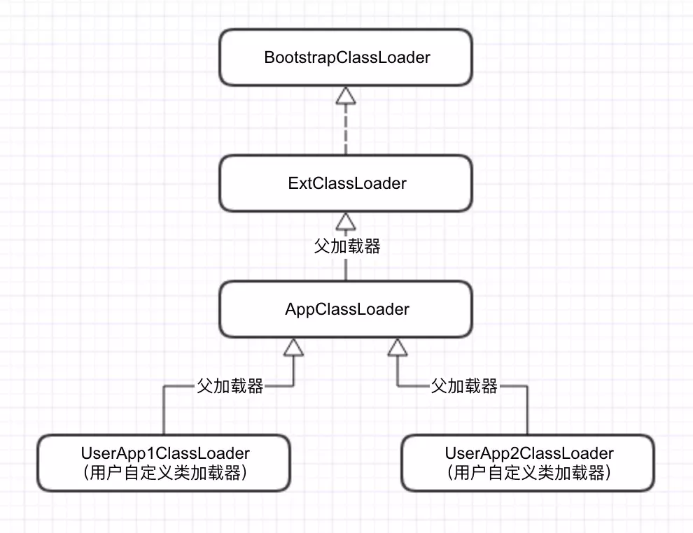
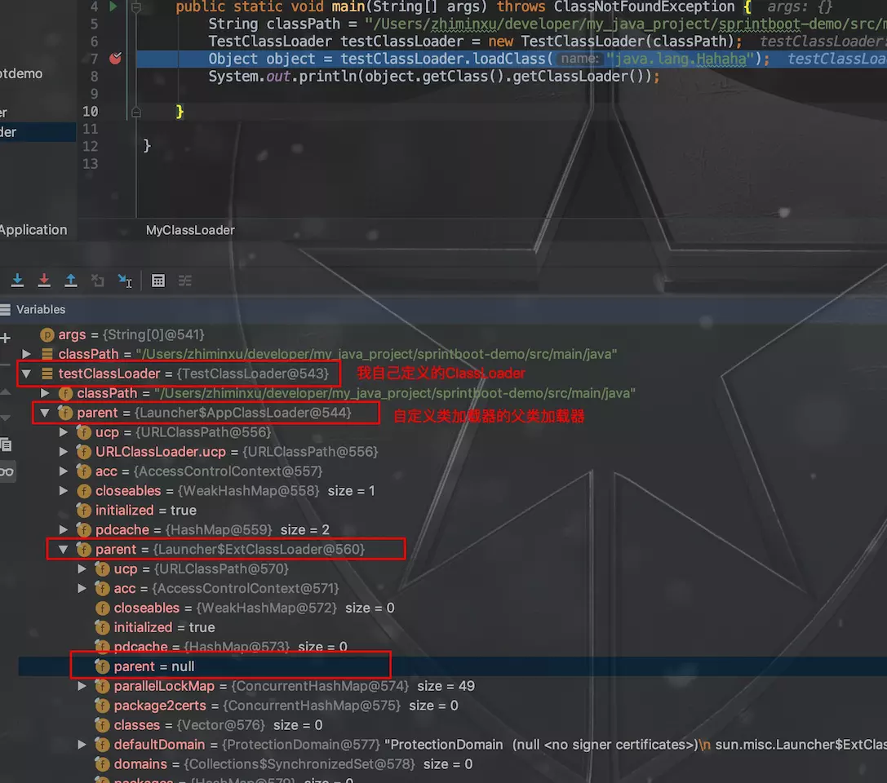
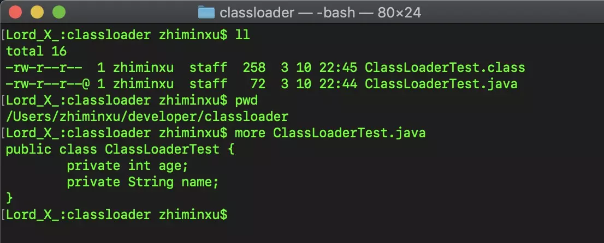
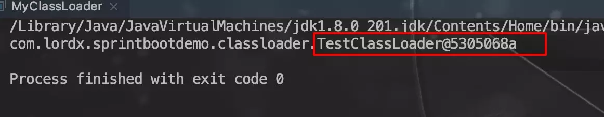
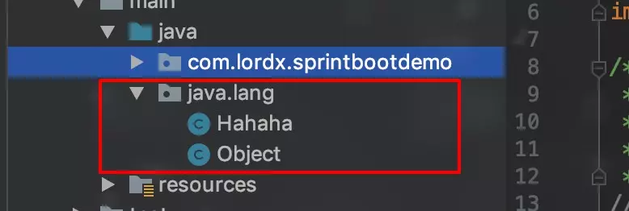
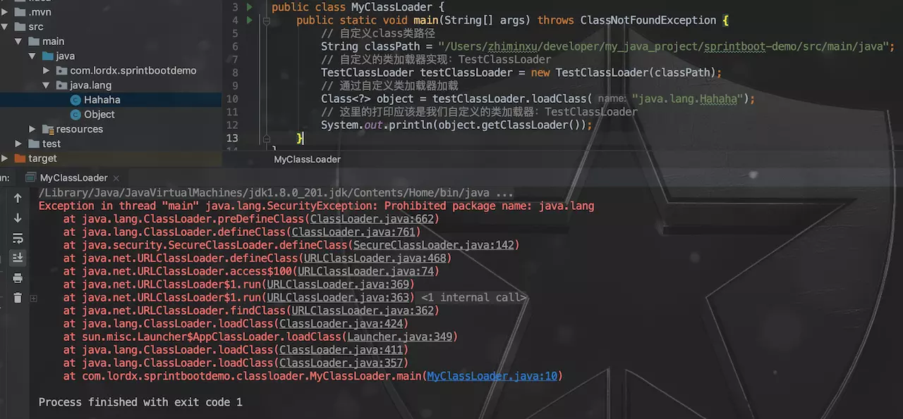

# 类加载器原理分析

本文分析了双亲委派模型的实现原理，并通过代码示例说明了什么时候需要实现自己的类加载器以及如何实现自己的类加载器。本文的内容和代码都基于 jdk1.8。

## 1.ClassLoader 的作用

ClassLoader 用于将 class 文件加载到 JVM 中，另外一个作用是确认每个类应该哪一个类加载器加载。第二个作用也用于判断 JVM 运行时的两个类是否相等。影响的判断方法有 **`equals()`**、**`isAssignableFrom()`**、**`isInstance()`** 以及 instanceof 关键字，这一点在后文中会举例说明。类加载的触发可以分为隐式加载和显式加载，其中，隐式加载的情况分为以下 4 种：

1. 遇到 **`new`**、**`getstatic`**、**`putstatic`**、**`invokestatic`** 这 4 条字节码指令时；
2. 对类进行反射调用时；
3. 当初始化一个类时，如果其父类还没有初始化，优先加载其父类并初始化；
4. 虚拟机启动时，需指定一个包含 main 函数的主类，优先加载并初始化这个主类；

显式加载包括以下 3 种情况：

1. 通过 ClassLoader 的 loadClass 方法
2. 通过 Class.forName
3. 通过 ClassLoader 的 findClass 方法

并且，在 JDK1.8 之前加载的类存放在方法区中，而从 JDK8 到现在为止，会加载到元数据区。

## 2.ClassLoader 的种类

整个 JVM 平台提供三类 ClassLoader。分别为：Bootstrap ClassLoader、ExtClassLoader 和 AppClassLoader。

- Bootstrap ClassLoader：加载 JVM 自身工作需要的类，它由 JVM 自己实现。它会加载 **`$JAVA_HOME/jre/lib`** 下的文件
- ExtClassLoader：它是 JVM 的一部分，由 **`sun.misc.LauncherExtClassLoader`** 实现，他会加载 **`JAVA_HOME/jre/lib/ext`** 目录中的文件（或由 **`System.getProperty("java.ext.dirs")`** 所指定的文件）
- AppClassLoader：系统类加载器，我们工作中接触最多的也是这个类加载器，它由 **`sun.misc.Launcher$AppClassLoader`** 实现。它加载 **`System.getProperty("java.class.path")`** 指定目录下的文件，也就是我们通常说的 classpath 路径。

## 3.双亲委派模型

### 3.1 双亲委派模型的原理

从 JDK1.2 之后，类加载器引入了双亲委派模型，其模型图如下：

<div align="center">
    
</div>

其中，两个用户自定义类加载器的父加载器是 AppClassLoader，AppClassLoader 的父加载器是 ExtClassLoader，ExtClassLoader 是没有父类加载器的，在代码中，ExtClassLoader 的父类加载器为 null。BootstrapClassLoader 也并没有子类，因为他完全由 JVM 实现。

双亲委派模型的原理是：当一个类加载器接收到类加载请求时，首先会请求其父类加载器加载，每一层都是如此，当父类加载器无法找到这个类时（根据类的全限定名称），子类加载器才会尝试自己去加载。为了说明这个继承关系，我这里实现了一个自己的类加载器，名为 TestClassLoader，在类加载器中，用 parent 字段来表示当前加载器的父类加载器，其定义如下：

```java{.line-numbers}
public abstract class ClassLoader {
...
    // The parent class loader for delegation
    // Note: VM hardcoded the offset of this field, thus all new fields
    // must be added *after* it.
    private final ClassLoader parent;
...
} 
```

然后通过 debug 来看一下这个结构，如下图：

<div align="center">
    
</div>

这里的第一个红框是我自己定义的类加载器，对应上图的最下层部分；第二个框是自定义类加载器的父类加载器，可以看到是 AppClassLoader；第三个框是 AppClassLoader 的父类加载器，是 ExtClassLaoder；第四个框是 ExtClassLoader 的父类加载器，是 null。

### 3.2 双亲委派模型解决的问题

双亲委派模型是 JDK1.2 之后引入的。根据双亲委派模型原理，可以试想，没有双亲委派模型时，如果用户自己写了一个全限定名为 **`java.lang.Object`** 的类，并用自己的类加载器去加载，同时 BootstrapClassLoader 加载了 **`rt.jar`** 包中的 JDK 本身的 **`java.lang.Object`**，这样内存中就存在两份 Object 类了，此时就会出现很多问题，例如根据全限定名无法定位到具体的类。

有了双亲委派模型后，所有的类加载操作都会优先委派给父类加载器，这样一来，即使用户自定义了一个 **`java.lang.Object`**，但由于 BootstrapClassLoader 已经检测到自己加载了这个类，用户自定义的类加载器就不会再重复加载了。

所以，双亲委派模型能够保证类在内存中的唯一性。

### 3.3 双亲委派模型实现原理

下面从源码的角度看一下双亲委派模型的实现。JVM 在加载一个 class 时会先调用 classloader 的 loadClassInternal 方法，该方法源码如下：

```java{.line-numbers}
// This method is invoked by the virtual machine to load a class.
private Class<?> loadClassInternal(String name)
    throws ClassNotFoundException
{
    // For backward compatibility, explicitly lock on 'this' when
    // the current class loader is not parallel capable.
    if (parallelLockMap == null) {
        synchronized (this) {
             return loadClass(name);
        }
    } else {
        return loadClass(name);
    }
} 
```

该方法里面做的事儿就是调用了 loadClass 方法，loadClass 方法的实现如下：

```java{.line-numbers}
protected Class<?> loadClass(String name, boolean resolve)
    throws ClassNotFoundException
{
    synchronized (getClassLoadingLock(name)) {
        // First, check if the class has already been loaded
        // 先查看这个类是否已经被自己加载了
        Class<?> c = findLoadedClass(name);
        if (c == null) {
            long t0 = System.nanoTime();
            try {
                // 如果有父类加载器，先委派给父类加载器来加载
                if (parent != null) {
                    c = parent.loadClass(name, false);
                } else {
                    // 如果父类加载器为 null，说明 ExtClassLoader 也没有找到目标类，则调用 BootstrapClassLoader 来查找
                    c = findBootstrapClassOrNull(name);
                }
            } catch (ClassNotFoundException e) {
                // ClassNotFoundException thrown if class not found
                // from the non-null parent class loader
            }
            // 如果都没有找到，调用 findClass 方法，尝试自己加载这个类
            if (c == null) {
                // If still not found, then invoke findClass in order
                // to find the class.
                long t1 = System.nanoTime();
                c = findClass(name);

                // this is the defining class loader; record the stats
                sun.misc.PerfCounter.getParentDelegationTime().addTime(t1 - t0);
                sun.misc.PerfCounter.getFindClassTime().addElapsedTimeFrom(t1);
                sun.misc.PerfCounter.getFindClasses().increment();
            }
        }
        if (resolve) {
            resolveClass(c);
        }
        return c;
    }
} 
```

源码中已经给出了几个关键步骤的说明。代码中调用 BootstrapClassLoader 的地方实际是调用的 native 方法。由此可见，双亲委派模型实现的核心就是这个 loadClass 方法。

## 4.实现自己的类加载器

为了能够完全掌控类的加载过程，我们的定制类加载器需要直接从 ClassLoader 继承。首先我们来介绍一下 ClassLoader 类中和热替换有关的的一些重要方法。

- **`findLoadedClass`**: 每个类加载器都维护有自己的一份已加载类名字空间，其中不能出现两个同名的类。凡是通过该类加载器加载的类，无论是直接的还是间接的，都保存在自己的名字空间中，该方法就是在该名字空间中寻找指定的类是否已存在，如果存在就返回给类的引用，否则就返回 null。这里的直接是指，存在于该类加载器的加载路径上并由该加载器完成加载，间接是指，由该类加载器把类的加载工作委托给其他类加载器完成类的实际加载。
- **`getSystemClassLoader`**: Java2 中新增的方法。该方法返回系统使用的 ClassLoader。可以在自己定制的类加载器中通过该方法把一部分工作转交给系统类加载器去处理。
- **`defineClass`**: 该方法是 ClassLoader 中非常重要的一个方法，它接收以字节数组表示的类字节码，并把它转换成 Class 实例，该方法转换一个类的同时，会先要求装载该类的父类以及实现的接口类。
- **`loadClass`**: 加载类的入口方法，调用该方法完成类的显式加载。通过对该方法的重新实现，我们可以完全控制和管理类的加载过程。
- **`resolveClass`**: 链接一个指定的类。这是一个在某些情况下确保类可用的必要方法。

### 4.1 类加载器的作用

为什么要实现自己的类加载器，回答这个问题首先要思考类加载器有什么作用。从上文我们知道 JVM 通过 loadClass 方法来查找类，所以，他的第一个作用也是最重要的：在指定的路径下查找 class 文件（各个类加载器的扫描路径在上文已经给出）。然后，当父类加载器都说没有加载过目标类时，他会尝试自己加载目标类，这就调用了 findClass 方法，可以看一下 findClass 方法的定义：

```java{.line-numbers}
protected Class<?> findClass(String name) throws ClassNotFoundException {
    throw new ClassNotFoundException(name);
} 
```

可以发现他要求返回一个 Class 对象实例，这里我通过一个实现类 **`sun.rmi.rmic.iiop.ClassPathLoader`** 来说明一下 findClass 都干了什么。

```java{.line-numbers}
protected Class findClass(String var1) throws ClassNotFoundException {
    // 从指定路径加载指定名称的class的字节流
    byte[] var2 = this.loadClassData(var1);
    // 通过ClassLoader的defineClass来创建class对象实例
    return this.defineClass(var1, var2, 0, var2.length);
} 
```

他做的事情在注释中已经给出，可以看到，最终是通过 defineClass 方法来实例化 class 对象的。另外可以发现，class 文件字节的获取和处理我们是可以控制的。所以，第二个作用：我们可以在字节流解析这一步做一些自定义的处理。 例如，加解密。接下来，看似还有个 defineClass 可以让我们来做点儿什么，ClassLoader 的实现如下：

```java{.line-numbers}
protected final Class<?> defineClass(String name, byte[] b, int off, int len) throws ClassFormatError
{
    return defineClass(name, b, off, len, null);
}
```

被 final 掉了，没办法覆写，所以这里看似不能做什么事儿了。

总结一下：通过 loadClass 在指定的路径下查找文件。通过 findClass 方法解析 class 字节流，并实例化 class 对象。并且如果自定义的方法不想违背双亲委派模型，则只需要重写 findclass 方法即可，如果想违背双亲委派模型，则还需要重写 loadclass 方法。因此当 JDK 所提供的类加载器不能满足我们的需求时，才需要自己实现类加载器。现有的应用场景为：OSGI、代码的热部署等。另外，根据上述类加载器的作用，可能有以下几个场景需要自己实现类加载器。

- 当需要在自定义的目录中查找 class 文件时（或网络获取）；
- class 被类加载器加载前的加解密（代码加密领域）；

### 4.2 如何实现自己的类加载器

接下来，实现一个在自定义 class 类路径中查找并加载 class 的自定义类加载器。

```java{.line-numbers}
package com.lordx.sprintbootdemo.classloader;

import java.io.ByteArrayOutputStream;
import java.io.File;
import java.io.FileInputStream;
import java.io.InputStream;

/**
 * 自定义ClassLoader
 * 功能：可自定义class文件的扫描路径
 * @author zhiminxu 
 */
// 继承ClassLoader，获取基础功能
public class TestClassLoader extends ClassLoader {

    // 自定义的class扫描路径
    private String classPath;

    public TestClassLoader(String classPath) {
        this.classPath = classPath;
    }

    // 覆写ClassLoader的findClass方法
    protected Class<?> findClass(String name) throws ClassNotFoundException {
        // getDate方法会根据自定义的路径扫描class，并返回class的字节
        byte[] classData = getDate(name);
        if (classData == null) {
            throw new ClassNotFoundException();
        } else {
            // 生成class实例
            return defineClass(name, classData, 0, classData.length);
        }
    }


    private byte[] getDate(String name) {
        // 拼接目标class文件路径
        String path = classPath + File.separatorChar + name.replace('.', File.separatorChar) + ".class";
        try {
            InputStream is = new FileInputStream(path);
            ByteArrayOutputStream stream = new ByteArrayOutputStream();
            byte[] buffer = new byte[2048];
            int num = 0;
            while ((num = is.read(buffer)) != -1) {
                stream.write(buffer, 0 ,num);
            }
            return stream.toByteArray();
        } catch (Exception e) {
            e.printStackTrace();
        }
        return null;
    }
}
```

使用自定义的类加载器：

```java{.line-numbers}
package com.lordx.sprintbootdemo.classloader;

public class MyClassLoader {
    public static void main(String[] args) throws ClassNotFoundException {
        // 自定义class类路径
        String classPath = "/Users/zhiminxu/developer/classloader";
        // 自定义的类加载器实现：TestClassLoader
        TestClassLoader testClassLoader = new TestClassLoader(classPath);
        // 通过自定义类加载器加载
        Class<?> object = testClassLoader.loadClass("ClassLoaderTest");
        // 这里的打印应该是我们自定义的类加载器：TestClassLoader
        System.out.println(object.getClassLoader());
    }
} 
```

实验中的 ClassLoaderTest 类就是一个简单的定义了两个 field 的 Class。如下图所示：

<div align="center">
    
</div>

最终的打印结果如下：

<div align="center">
    
</div>

注意：实验类（ClassLoaderTest）最好不要放在 IDE 的工程目录内，因为 IDE 在 run 的时候会先将工程中的所有类都加载到内存，这样一来这个类就不是自定义类加载器加载的了，而是 AppClassLoader 加载的。

### 4.3 类加载器对相等判断的影响

#### 4.3.1 对 Object.equals() 的影响

还是上面那个自定义类加载器，修改 MyClassLoader 代码：

```java{.line-numbers}
package com.lordx.sprintbootdemo.classloader;

public class MyClassLoader {
    public static void main(String[] args) throws ClassNotFoundException {
        // 自定义class类路径
        String classPath = "/Users/zhiminxu/developer/classloader";
        // 自定义的类加载器实现：TestClassLoader
        TestClassLoader testClassLoader = new TestClassLoader(classPath);
        // 通过自定义类加载器加载
        Class<?> object1 = testClassLoader.loadClass("ClassLoaderTest");
        Class<?> object2 = testClassLoader.loadClass("ClassLoaderTest");
        // object1和object2使用同一个类加载器加载时
        System.out.println(object1.equals(object2));

        // 新定义一个类加载器
        TestClassLoader testClassLoader2 = new TestClassLoader(classPath);
        Class<?> object3 = testClassLoader2.loadClass("ClassLoaderTest");
        // object1和object3使用不同类加载器加载时
        System.out.println(object1.equals(object3));
    }
}
```

打印结果：

```java{.line-numbers}
true

false 
```

equals 方法默认比较的是内存地址，由此可见，不同的类加载器实例都有自己的内存空间，即使类的全限定名相同，但类加载器不同也是不行的。所以，内存中两个类 equals 为 true 的条件是用同一个类加载器实例加载的全限定名相同的两个类实例。

#### 4.3.2.对 instanceof 的影响

修改 TestClassLoader，增加 main 方法来实验，修改后的 TestClassLoader 如下：

```java{.line-numbers}
import java.io.ByteArrayOutputStream;
import java.io.File;
import java.io.FileInputStream;
import java.io.InputStream;

/**
 * 自定义ClassLoader
 * 功能：可自定义class文件的扫描路径
 * @author zhiminxu
 */
// 继承ClassLoader，获取基础功能
public class TestClassLoader extends ClassLoader {

    public static void main(String[] args) throws ClassNotFoundException {
        TestClassLoader testClassLoader = new TestClassLoader("/Users/zhiminxu/developer/classloader");
        Object obj = testClassLoader.loadClass("ClassLoaderTest");
        // obj是testClassLoader加载的，ClassLoaderTest是AppClassLoader加载的，所以这里打印:false
        System.out.println(obj instanceof ClassLoaderTest);
    }

    // 自定义的class扫描路径
    private String classPath;

    public TestClassLoader(String classPath) {
        this.classPath = classPath;
    }

    // 覆写ClassLoader的findClass方法
    protected Class<?> findClass(String name) throws ClassNotFoundException {
        // getDate方法会根据自定义的路径扫描class，并返回class的字节
        byte[] classData = getDate(name);
        if (classData == null) {
            throw new ClassNotFoundException();
        } else {
            // 生成class实例
            return defineClass(name, classData, 0, classData.length);
        }
    }


    private byte[] getDate(String name) {
        // 拼接目标class文件路径
        String path = classPath + File.separatorChar + name.replace('.', File.separatorChar) + ".class";
        try {
            InputStream is = new FileInputStream(path);
            ByteArrayOutputStream stream = new ByteArrayOutputStream();
            byte[] buffer = new byte[2048];
            int num = 0;
            while ((num = is.read(buffer)) != -1) {
                stream.write(buffer, 0 ,num);
            }
            return stream.toByteArray();
        } catch (Exception e) {
            e.printStackTrace();
        }
        return null;
    }
} 
```

打印结果：false

其他的还会影响 Class 的 **`isAssignableFrom()`** 方法和 **`isInstance()`** 方法，原因与上面的相同。

#### 4.3.3 另外的说明

不要尝试自定义 **`java.lang`** 包，并尝试用加载器去加载他们。像下面这样：

<div align="center">
    
</div>

这么干的话，会直接抛出一个异常：

<div align="center">
    
</div>

这个异常是在调用 defineClass 的校验过程抛出的，源码如下：

```java{.line-numbers}
// Note:  Checking logic in java.lang.invoke.MemberName.checkForTypeAlias
// relies on the fact that spoofing is impossible if a class has a name
// of the form "java.*"
if ((name != null) && name.startsWith("java.")) {
    throw new SecurityException
        ("Prohibited package name: " +
         name.substring(0, name.lastIndexOf('.')));
} 
```

## 5.与 ClassLoader 相关的异常

想知道如下几个异常在什么情况下抛出，其实只需要在 ClassLoader 中找到哪里会抛出他，然后在看下相关逻辑即可。

### 5.1.ClassNotFoundException

这个异常，相信大家经常遇到。那么，到底啥原因导致抛出这个异常呢？看一下 ClassLoader 的源码，在 JVM 调用 `loadClassInternal` 的方法中，就会抛出这个异常。其声明如下：

```java{.line-numbers}
 // This method is invoked by the virtual machine to load a class.
 private Class<?> loadClassInternal(String name)
     throws ClassNotFoundException
 {
     // For backward compatibility, explicitly lock on 'this' when
     // the current class loader is not parallel capable.
     if (parallelLockMap == null) {
         synchronized (this) {
              return loadClass(name);
         }
     } else {
         return loadClass(name);
     }
 }
```

这里面 `loadClass` 方法会抛出这个异常，再来看 `loadClass` 方法：

```java{.line-numbers}
public Class<?> loadClass(String name) throws ClassNotFoundException {
    return loadClass(name, false);
}
```

调用了重写的 `loadClass` 方法

```java{.line-numbers}
protected Class<?> loadClass(String name, boolean resolve)
        throws ClassNotFoundException
{
    synchronized (getClassLoadingLock(name)) {
        // First, check if the class has already been loaded
        // 查看 findLoadedClass 的声明，没有抛出这个异常
        Class<?> c = findLoadedClass(name);
        if (c == null) {
            long t0 = System.nanoTime();
            try {
                if (parent != null) {
                    // 这里会抛，但同样是调 loadClass 方法，无需关注
                    c = parent.loadClass(name, false);
                } else {
                    c = findBootstrapClassOrNull(name);
                }
            } catch (ClassNotFoundException e) {
                // catch 住没有抛，因为要在下面尝试自己获取 class
                // ClassNotFoundException thrown if class not found
                // from the non-null parent class loader
            }

            if (c == null) {
                // If still not found, then invoke findClass in order
                // to find the class.
                long t1 = System.nanoTime();
                // 关键：这里会抛
                c = findClass(name);

                // this is the defining class loader; record the stats
                sun.misc.PerfCounter.getParentDelegationTime().addTime(t1 - t0);
                sun.misc.PerfCounter.getFindClassTime().addElapsedTimeFrom(t1);
                sun.misc.PerfCounter.getFindClasses().increment();
            }
        }
        if (resolve) {
            resolveClass(c);
        }
        return c;
    }
}
```

再来看 `findClass` 方法：

```java{.line-numbers}
/**
 * Finds the class with the specified <a href="#name">binary name</a>.
 * This method should be overridden by class loader implementations that
 * follow the delegation model for loading classes, and will be invoked by
 * the {@link #loadClass <tt>loadClass</tt>} method after checking the
 * parent class loader for the requested class.  The default implementation
 * throws a <tt>ClassNotFoundException</tt>.
 *
 * @param  name
 *         The <a href="#name">binary name</a> of the class
 *
 * @return  The resulting <tt>Class</tt> object
 *
 * @throws  ClassNotFoundException
 *          If the class could not be found
 *
 * @since  1.2
 */
protected Class<?> findClass(String name) throws ClassNotFoundException {
    throw new ClassNotFoundException(name);
}
```

果然这里抛出的，注释中抛出这个异常的原因是说：当这个 class 无法被找到时抛出。这也就是为什么在上面自定义的类加载器中，覆写 `findClass` 方法时，如果没有找到 class 要抛出这个异常的原因。至此，这个异常抛出的原因就明确了：在双亲委派模型的所有相关类加载器中，目标类在每个类加载器的扫描路径中都不存在时，会抛出这个异常。

### 5.2.NoClassDefFoundError

这也是个经常会碰到的异常，而且不熟悉的同学可能经常搞不清楚什么时候抛出 `ClassNotFoundException`，什么时候抛出 `NoClassDefFoundError`。我们还是到 ClassLoader 中搜一下这个异常，可以发现在 `defineClass` 方法中可能抛出这个异常，`defineClass` 方法源码如下：

```java{.line-numbers}
/**
 * ... 忽略注释和参数以及返回值的说明，直接看异常声明
 *
 * @throws  ClassFormatError
 *          If the data did not contain a valid class
 *
 * 在这里。由于 NoClassDefFoundError 是 Error 下的，所以不用显示 throws
 * @throws  NoClassDefFoundError
 *          If <tt>name</tt> is not equal to the <a href="#name">binary
 *          name</a> of the class specified by <tt>b</tt>
 *
 * @throws  IndexOutOfBoundsException
 *          If either <tt>off</tt> or <tt>len</tt> is negative, or if
 *          <tt>off+len</tt> is greater than <tt>b.length</tt>.
 *
 * @throws  SecurityException
 *          If an attempt is made to add this class to a package that
 *          contains classes that were signed by a different set of
 *          certificates than this class, or if <tt>name</tt> begins with
 *          "<tt>java.</tt>".
 */
protected final Class<?> defineClass(String name, byte[] b, int off, int len,
                                     ProtectionDomain protectionDomain)
    throws ClassFormatError
{
    protectionDomain = preDefineClass(name, protectionDomain);
    String source = defineClassSourceLocation(protectionDomain);
    Class<?> c = defineClass1(name, b, off, len, protectionDomain, source);
    postDefineClass(c, protectionDomain);
    return c;
}
```

继续追踪里面的方法，可以发现是 `preDefineClass` 方法抛出的，这个方法源码如下：

```java{.line-numbers}
/* Determine protection domain, and check that:
    - not define java.* class,
    - signer of this class matches signers for the rest of the classes in
      package.
 */
private ProtectionDomain preDefineClass(String name,
                                        ProtectionDomain pd)
{
    // 这里显示抛出，可发现是在目标类名校验不通过时抛出的
    if (!checkName(name))
        throw new NoClassDefFoundError("IllegalName: " + name);

    // Note:  Checking logic in java.lang.invoke.MemberName.checkForTypeAlias
    // relies on the fact that spoofing is impossible if a class has a name
    // of the form "java.*"
    if ((name != null) && name.startsWith("java.")) {
        throw new SecurityException
            ("Prohibited package name: " +
             name.substring(0, name.lastIndexOf('.')));
    }
    if (pd == null) {
        pd = defaultDomain;
    }

    if (name != null) checkCerts(name, pd.getCodeSource());

    return pd;
}
```

这个校验的源码如下：

```java{.line-numbers}
// true if the name is null or has the potential to be a valid binary name
private boolean checkName(String name) {
    if ((name == null) || (name.length() == 0))
        return true;
    if ((name.indexOf('/') != -1) || (!VM.allowArraySyntax() && (name.charAt(0) == '[')))
        return false;
    return true;
}
```

所以，这个异常抛出的原因是：类名校验未通过。但这个异常其实不止在 ClassLoader 中抛出，其他地方，例如框架中，web 容器中都有可能抛出，还要具体问题具体分析。


