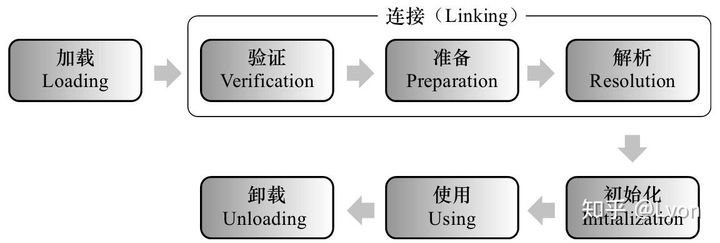
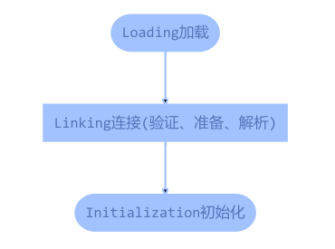
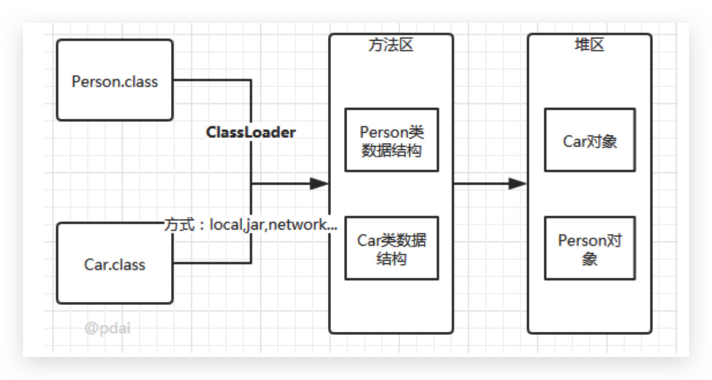
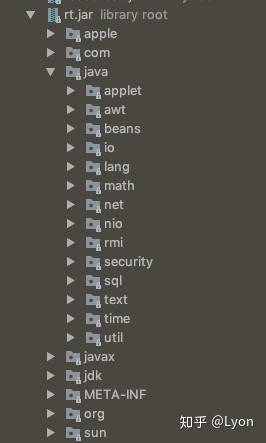
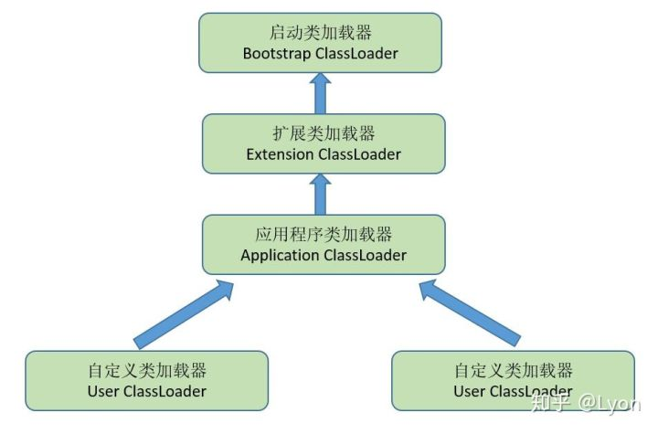

# 类加载机制

## 1.类加载过程

所谓的 JVM 的类加载机制是指 JVM 把描述类的数据从 **`.class`** 文件加载到内存，并对数据进行校验、解析和初始化，最终形成可以被虚拟机直接使用的 Java 类型，这就是 JVM 的类加载机制。Java 语言的动态扩展性很强，其原因就是依赖于 Java 运行期动态加载和动态连接的特性，**<font color="red">动态加载是指我们可以通过预定义的类加载器和自定义的类加载器在运行期从本地、网络或其他地方加载 **`.class`** 文件；动态连接是指在面向接口编程中，在运行时才会指定其实际的实现类</font>**。

### 1.1 概述

类从被加载到虚拟机内存中开始，到卸载出内存为止，它的整个生命周期包括：Loading (加载)、Verification (验证)、Preparation (准备)、Resolution (解析)、Initialization (初始化)、Using (使用) 和 Unloading (卸载) 这 7 个阶段。其中验证、准备、解析这三个部分统称为连接 (Linking)。

<div align="center">
    
</div>

注意：此处的类加载指的是一个 **`.class`** 文件的加载，在 Java 中 **`.class`** 文件可能是一个类，也可能是一个接口。此处都叫做类加载。整个类加载的过程即：**`加载->验证->准备->解析->初始化`**。概括地说即：

<div align="center">
    
</div>

这里需要注意：从类的 **`加载->验证->准备->初始化`**，过程是按顺序依次开始的，但是解析比较特殊。为了支持 java 语言的晚期绑定/动态绑定，有时解析可以在初始化之后才开始。而且，这只是开始顺序，一个阶段通常执行的过程中会激活调用另一个阶段，所以各个阶段只是按照这个顺序开始，而不会等一个阶段完全完成后才进行下一个阶段，各个阶段是交叉混合进行的，所以各阶段并不会严格按照此顺序结束。

### 1.2 Loading 加载

在加载阶段，虚拟机需要完成以下三件事情：

- **<font color="red">通过一个类的全限定名来获取此类的二进制字节流</font>**：一个类的二进制字节流即 **`.class`** 文件，如何获取一个类的 **`.class`** 文件其实可以通过多种方法实现，譬如：从 ZIP 包中读取、从网络传输中获取、运行时计算生成 (动态代理技术)、从数据库中读取等；
- **<font color="red">将这个字节流所代表的的静态存储结构转化为方法区的运行时数据结构</font>**：加载的过程主要由类加载器来完成。类加载器也分为不同种类，具体见下文，除了 JVM 自带的类加载器，用户也可以使用自己定义的类加载器。
- **<font color="red">在内存中生成一个代表这个类的 **`java.lang.Class`** 对象，作为方法区这个类的各种数据的访问入口</font>**：某个类的 **`java.lang.Class`** 对象，即通常所说的一个类的类对象，这个类对象作为程序调用这个类中方法和数据调用的入口。

<div align="center">
    
</div>

在这个阶段，有两点是需要注意的：

- 并没有规定从哪里获取二进制字节流。我们可以从 .class 静态存储文件中获取，也可以从 zip、jar 等包中读取，可以从数据库中读取，也可以从网络中获取，甚至我们自己可以在运行时自动生成。
- 在内存中实例化一个代表此类的 **`java.lang.Class`** 对象之后，并没有规定此 Class 对象是放在 Java 堆中的，**<font color="red">有些虚拟机就会将 Class 对象放到方法区中，比如 HotSpot</font>**。

### 1.3 Verification 验证

验证是连接阶段的第一步，这一阶段的主要目的是 **<font color="red">为了确保 Class 文件的字节流包含的信息符合当前虚拟机的要求</font>**，并且不会危害虚拟机自身的安全。验证阶段是非常重要的，这个阶段是否严谨，直接决定了Java虚拟机是否能够承受恶意代码的攻击，从执行性能的角度上讲，验证阶段的工作量在虚拟机的类加载子系统中又占据了相当大的一部分。

此阶段主要包含如下几个部分的验证：

- JVM 规范校验：验证字节流是否符合 Class 文件格式的规范；例如: 是否以 0xCAFEBABE 开头、主次版本号是否在当前虚拟机的处理范围之内、常量池中的常量是否有不被支持的类型；
- 元数据校验：主要是对类的元数据信息进行语义检查，保证不存在不符合 Java 语义规范的元数据信息；
- 符号引用验证：符号引用验证发生在连接的第三个阶段解析阶段中，主要是保证解析过程可以正确地执行。符号引用验证是类本身引用的其他类的验证，包括：通过一个类的全限定名是否可以找到对应的类，访问的其他类中的字段和方法是否存在，并且访问性是否合适等；

验证阶段是非常重要的，但不是必须的，它对程序运行期没有影响，如果所引用的类经过反复验证，那么可以考虑采用 -Xverifynone 参数来关闭大部分的类验证措施，以缩短虚拟机类加载的时间。

### 1.4 Preaparation 准备

**<font color="red">准备阶段是正式为类变量分配内存并设置类变量初始值的阶段，这些变量使用的内存都将在方法区中进行分配</font>**（此处需注意的是，准备阶段是为类变量分配内存并设置初始值而不是实例变量，类变量属于 class，类变量属于方法区。实例变量将会在对象实例化时随着对象一起被分配在 Java 堆中）。

这个阶段需要注意如下事项：

- 这时候进行内存分配的仅包括类变量（被 static 修饰的变量），而不包括实例变量，实例变量将会在对象实例化时随着对象一起分配在 Java 堆中。
- 这里所设置的初始值通常情况下是数据类型默认的零值(如 0、0L、null、false 等)，而不是被在 Java 代码中被显式地赋予的值。

比如：假设一个类变量的定义为: **`public static int value = 3;`** 那么变量 value 在准备阶段过后的初始值为 0，而不是 3，因为这时候尚未开始执行任何 Java 方法，**<font color="red">而对 value 赋值为 3 的 put static 指令是在程序编译后，存在于类构造器()方法之中的</font>**，所以把 value 赋值为 3 的动作将在初始化阶段才会执行。

- 对基本数据类型来说，对于类变量(static)，如果不显式地对其赋值而直接使用，则系统会为其赋予默认的零值，而对于局部变量来说，在使用前必须显式地为其赋值，否则编译时不通过。
- 对于同时被 static 和 final 修饰的常量，必须在声明的时候就为其显式地赋值，否则编译时不通过；而只被 final 修饰的常量则既可以在声明时显式地为其赋值，也可以在类初始化时显式地为其赋值，总之，在使用前必须为其显式地赋值，系统不会为其赋予默认零值。
- 对于引用数据类型 reference 来说，如数组引用、对象引用等，如果没有对其进行显式地赋值而直接使用，系统都会为其赋予默认的零值，即 null。
- 如果在数组初始化时没有对数组中的各元素赋值，那么其中的元素将根据对应的数据类型而被赋予默认的零值。
如果类字段的字段属性表中存在 ConstantValue 属性，即同时被 final 和 static 修饰，那么在准备阶段变量 value 就会被初始化为 ConstantValue 属性所指定的值。假设上面的类变量 value 被定义为: **`public static final int value = 3;`** 编译时 Javac 将会为 value 生成 ConstantValue 属性，在准备阶段虚拟机就会根据 ConstantValue 的设置将 value 赋值为 3。

### 1.5 Resolution 解析

解析阶段是虚拟机将常量池内的符号引用替换为直接引用的过程。解析主要包括：1.类或接口的解析、2.字段解析、3.类方法解析、4.接口方法解析。符号引用就是一组符号来描述目标，可以是任何字面量，其实也就是在 **`.class`** 常量池中存储的 **`CONSTANT_Class_info`**、**`CONSTANT_Fieldref_info`** 等常量。直接引用就是直接指向目标的指针、相对偏移量或者一个间接定位到目标的句柄。对于解析有以下 2 点需要注意：

- 虚拟机规范中并未规定解析阶段发生的具体时间，只规定了在执行 **`newarray`**、**`new`**、**`putfidle`**、**`putstatic`**、**`getfield`**、**`getstatic`** 等 16 个指令之前，对它们所使用的符号引用进行解析。**<font color="red">所以虚拟机可以在类被加载器加载的时候就进行解析，也可以在执行这几个指令之前才进行解析</font>**。
- 对同一个符号引用进行多次解析是很常见的事，除 **`invokedynamic`** 指令以外，虚拟机实现可以对第一次解析的结果进行缓存，以后解析相同的符号引用时，只要取缓存的结果就可以了。

### 1.6 Initialization 初始化

类初始化阶段是类加载过程的最后一步，到了初始化阶段，才真正开始执行类中定义的 Java 程序代码 (字节码)。初始化对于类来说，就是执行类构造器 **`<clinit>()`** 方法的过程，在类的构造器中会为类变量初始化定义的值，会执行静态代码块中的内容。下面将介绍几点和开发者关系较为紧密的注意点：

1. 类构造器 **`<clinit>()`** 是由编译器自动收集类中出现的类变量、静态代码块中的语句合并产生的，收集的顺序是在源文件中出现的顺序决定的，静态代码块可以访问出现在静态代码块之前的类变量，出现的静态代码块之后的类变量，只可以赋值，但是不能访问，比如如下代码：

```java{.line-numbers}
public class Demo {
    private static String before = "before";
    static {
        after = "after";                    // 赋值合法
        System.out.println(before);         // 访问合法，因为出现在 static{} 之前
        System.out.println(after);          // 访问不合法，因为出现在 static{} 之后
    }
    private static String after;
}
```

2. 对于 **`<clinit>()`** 类构造器来说，在子类的类构造器调用之前，会自动的调用父类的类构造器。因此虚拟机中第一个被调用的 **`<clinit>()`** 方法是 **`java.lang.Object`** 的类构造器。由于父类的类构造器优先于子类的类构造器执行，所以父类中的 **`static{}`** 代码块也优先于子类的 **`static{}`** 执行
3. 类构造器 **`<clinit>()`** 对于类来说并不是必需的，如果一个类中没有类变量，也没有 **`static{}`**，那这个类不会有类构造器 **`<clinit>()`**
虚拟机会保证一个类的 **`<clinit>()`** 方法在多线程环境中被正确地加锁、同步，如果多个线程同时去初始化一个类，那么只有一个线程去执行这个类的类构造器 **`<clinit>()`**，其他线程会被阻塞，直到活动线程执行完类构造器 **`<clinit>()`** 方法。

初始化，对类的静态变量，静态代码块执行初始化操作。主要对类变量进行初始化。在 Java 中对类变量进行初始值设定有两种方式：

- 声明类变量时指定初始值；
- 使用静态代码块为类变量指定初始值；

#### 1.6.1 类初始化的步骤

- 假如这个类还没有被加载和连接，则程序先加载并连接该类；
- 假如该类的直接父类还没有被初始化，则先初始化其直接父类；
- 假如类中有初始化语句，则系统依次执行这些初始化语句；

#### 1.6.2 触发类初始化的时机

只有当对类的主动使用的时候才会导致类的初始化，类的主动使用包括以下 5 种：

- 使用 new 关键字实例化对象的时候。
- 读取或设置一个类型的静态字段（被 final 修饰、已在编译期把结果放入常量池的静态字段除外）的时候，以及调用一个类型的静态方法的时候。
- 使用 **`java.lang.reflect`** 包的方法对类型进行反射调用的时候，如果类型没有进行过初始化，则需要先触发其初始化。
- 当初始化类的时候，如果发现其父类还没有进行过初始化，则需要先触发其父类的初始化。
- 当虚拟机启动时，用户需要指定一个要执行的主类（包含 **`main()`** 方法的那个类），虚拟机会先初始化这个主类。

上面 5 种行为称为对一个类的主动引用，会触发类的初始化。除了上面五种主动引用之外，下面所列举的 6 种引用类的方式都不会触发类的初始化，称为类的被动引用：

- **<font color="red">通过子类引用父类的静态字段，只会触发父类的初始化，而不会触发子类的初始化</font>**。
- 定义对象数组，不会触发该对象所属类的初始化。
- 常量在编译期间会存入调用类的常量池中，本质上并没有直接引用定义常量的类，不会触发定义常量所在的类。
- 通过类名获取 Class 对象，不会触发类的初始化。
- 通过 Class.forName 加载指定类时，如果指定参数 initialize 为 false 时，也不会触发类初始化，其实这个参数是告诉虚拟机，是否要对类进行初始化。
- 通过 ClassLoader 默认的 loadClass 方法，也不会触发初始化动作。

## 2.类加载器

### 2.1 类加载器的作用

虚拟机设计团队把类加载阶段中的"**<font color="red">通过一个类的全限定名来获取描述此类的二进制字节流</font>**"这个动作放到 Java 虚拟机外部去实现。以便让应用程序自己决定如何去获取所需要的类。实现这个动作的代码模块成为"类加载器"。

类加载器作用不仅仅是加载类。因为对于任意一个类，都需要由加载它的类加载器和这个类本身一同确立其在 Java 虚拟机中的唯一性，每一个类加载器都拥有一个独立的类名称空间。说直白点：比较两个类是否“相等”，只有它们是由同一个类加载器加载时，才有意义。对于同一个类，如果由不同类加载器加载，则他们也必然不相等。(相等包括 Class 对象的 equals 方法, **`isAssignableFrom()`** 方法，**`isInstance()`** 方法返回的结果，也包括用 instanceof 关键词判断的情况)。

### 2.2 类加载器的分类

#### 2.2.1 从 Java 虚拟机的角度

- Bootstrap ClassLoader 启动类加载器；
- 其它类加载器；

从 JVM 的角度吗，加载器只分为两类，即 JVM 自身实现的 Bootstrap 启动类加载器，和其他 JVM 以外的所有类加载器。Bootstrap 翻译为根，故也叫根类加载器。

#### 2.2.2 从开发者的角度

从开发者的角度来看，类加载器分为以下 4 种：

- Bootstrap ClassLoader 启动类加载器；
- Extension ClassLoader 扩展类加载器；
- Application ClassLoader 系统类加载器；
- 用户自定义的类加载器；

**（1）启动加载器**

启动类加载器，**<font color="red">加载位于 `/jre/lib` 目录中的或者被参数 `-Xbootclasspath` 所指定的目录下的核心 Java 类库(按照文件名识别，如 `rt.jar`、`tools.jar`，名字不符合的类库即使放在 lib 目录中也不会被加载</font>**)。此类加载器是 Java 虚拟机的一部分，使用 native 代码 (C++) 编写。

<div align="center">
    
</div>

如图所示，rt.jar 这个 jar 包就是 Bootstrap 根类加载器负责加载的，其中包含了 java 各种核心的类如 **`java.lang`**, **`java.io`**, **`java.util`**, **`java.sql`** 等。

**（2）扩展类加载器**

加载位于 **`/jre/lib/ext`** 目录中的或者 **`java.ext.dirs`** 系统变量所指定的路径中的 java 类库。此加载器由 **`sun.misc.Launcher$ExtClassLoader`** 实现。

**（3）系统类加载器**

这个类加载器由 **`sun.misc.Launcher$AppClassLoader`** 来实现。**<font color="red">它负责加载用户类路径 (ClassPath) 上所有的类库</font>**，开发者同样可以直接在代码中使用这个类加载器。**<font color="red">如果应用程序中没有自定义过自己的类加载器，一般情况下这个就是程序中默认的类加载器</font>**。我们的应用程序都是由这3种类加载器互相配合进行加载的，如果有必要，还可以加入自己定义的类加载器。

#### 2.2.3 类加载的三种方式

1. 命令行启动应用时候由 JVM 初始化加载；
2. 通过 **`Class.forName()`** 方法动态加载；
3. 通过 **`ClassLoader.loadClass()`** 方法动态加载；

```java{.line-numbers}
public class loaderTest { 
    public static void main(String[] args) throws ClassNotFoundException { 
        ClassLoader loader = HelloWorld.class.getClassLoader(); 
        System.out.println(loader); 
        // 使用ClassLoader.loadClass()来加载类，不会执行初始化块 
        loader.loadClass("Test2"); 
        // 使用Class.forName()来加载类，默认会执行初始化块 
        // Class.forName("Test2"); 
        // 使用Class.forName()来加载类，并指定ClassLoader，初始化时不执行静态块 
        // Class.forName("Test2", false, loader); 
    } 
}

public class Test2 { 
    static { 
        System.out.println("静态初始化块执行了！"); 
    } 
} 
```

**`Class.forName`** 和 **`ClassLoader.loadClass`** 区别：

- **`Class.forName()`**: 将类的.class 文件加载到 jvm 中之外，还会对类进行解释，执行类中的 static 块；
- **`ClassLoader.loadClass()`**: 只干一件事情，就是将 .class 文件加载到 jvm 中，不会执行 static 中的内容, 只有在 newInstance 才会去执行 static 块。
- **`Class.forName(name, initialize, loader)`** 带参函数也可控制是否加载 static 块。

## 3.双亲委派机制

### 3.1 类加载器之间的关系

应用程序都是由这 3 种类加载器互相配合进行加载的，如果有必要还可以加入自己定义的类加载器。这些类加载器之间的关系如下图所示：

<div align="center">
    
</div>

图中的层次关系，称为类加载器的双亲委派模型。双亲委派模型要求除了顶层的根类加载器以外，其余的类加载器都应该有自己的父类加载器(一般不是以继承实现，而是使用组合关系来复用父加载器的代码)。如果一个类收到类加载请求，它首先请求父类加载器去加载这个类，只有当父类加载器无法完成加载时(其目录搜索范围内没找到需要的类)，子类加载器才会自己去加载。举例如下：

- 当 AppClassLoader 加载一个 class 时，它首先不会自己去尝试加载这个类，而是把类加载请求委派给父类加载器 ExtClassLoader 去完成；
- 当 ExtClassLoader 加载一个 class 时，它首先也不会自己去尝试加载这个类，而是把类加载请求委派给 BootStrapClassLoader 去完成；
- 如果 BootStrapClassLoader 加载失败 (例如在 **`$JAVA_HOME/jre/lib`** 里未查找到该 class)，会使用 ExtClassLoader 来尝试加载；
- 若 ExtClassLoader 也加载失败，则会使用 AppClassLoader 来加载，如果 AppClassLoader 也加载失败，则会报出异常 ClassNotFoundException；

双亲委派代码的实现：

```java{.line-numbers}
public Class<?> loadClass(String name)throws ClassNotFoundException {
    return loadClass(name, false);
}

protected synchronized Class<?> loadClass(String name, boolean resolve)throws ClassNotFoundException {
    // 首先判断该类型是否已经被加载
    Class c = findLoadedClass(name);
    if (c == null) {
        //如果没有被加载，就委托给父类加载或者委派给启动类加载器加载
        try {
            if (parent != null) {
                 //如果存在父类加载器，就委派给父类加载器加载
                c = parent.loadClass(name, false);
            } else {
                //如果不存在父类加载器，就检查是否是由启动类加载器加载的类，通过调用本地方法native Class findBootstrapClass(String name)
                c = findBootstrapClass0(name);
            }
        } catch (ClassNotFoundException e) {
            // 如果父类加载器和启动类加载器都不能完成加载任务，才调用自身的加载功能
            c = findClass(name);
        }
    }
    if (resolve) {
        resolveClass(c);
    }
    return c;
}
```

这段代码的逻辑清晰易懂：先检查请求加载的类型是否已经被加载过，若没有则调用父加载器的 **`loadClass()`** 方法，若父加载器为空则默认使用启动类加载器作为父加载器。假如父类加载器加载失败，抛出 **`ClassNotFoundException`** 异常的话，才调用自己的 **`findClass()`** 方法尝试进行加载。

### 3.2 双亲委派的优势

使用双亲委派模型来组织类加载器之间的关系，有一个显而易见的好处就是 Java 类随着它的类加载器一起具备了一种带有优先级的层次关系。例如类 **`java.lang.Object`** (存放于 **`rt.jar`** 中)，是所有类的父类，所以任意一个类启动类加载时，都需要先加载 Object 类。在类加载器来看，所有的加载 Object 类的请求，都会逐级委托，最后都委托给 Bootstrap 启动类加载器加载，因此 Object 类在程序的各种类加载器环境中都是同一个类。（否则，系统中出现的 Object 类都不尽相同则会出现一片混乱）。

### 3.3 自定义类加载器

通常情况下，我们都是直接使用系统类加载器。但是，有的时候，我们也需要自定义类加载器。比如应用是通过网络来传输 Java 类的字节码，为保证安全性，这些字节码经过了加密处理，这时系统类加载器就无法对其进行加载，这样则需要自定义类加载器来实现。自定义类加载器一般都是继承自 ClassLoader 类，从上面对 loadClass 方法来分析来看，我们只需要重写 findClass 方法即可。下面我们通过一个示例来演示自定义类加载器的流程:

自定义类加载器的核心在于对字节码文件的获取，如果是加密的字节码则需要在该类中对文件进行解密。由于这里只是演示，我并未对 class 文件进行加密，因此没有解密的过程。

```java{.line-numbers}
public class MyClassLoader extends ClassLoader {

    private String root;

    protected Class<?> findClass(String name) throws ClassNotFoundException {
        byte[] classData = loadClassData(name);
        if (classData == null) {
            throw new ClassNotFoundException();
        } else {
            return defineClass(name, classData, 0, classData.length);
        }
    }

    private byte[] loadClassData(String className) {
        String fileName = root + File.separatorChar
                + className.replace('.', File.separatorChar) + ".class";
        try {
            InputStream ins = new FileInputStream(fileName);
            ByteArrayOutputStream baos = new ByteArrayOutputStream();
            int bufferSize = 1024;
            byte[] buffer = new byte[bufferSize];
            int length = 0;
            while ((length = ins.read(buffer)) != -1) {
                baos.write(buffer, 0, length);
            }
            return baos.toByteArray();
        } catch (IOException e) {
            e.printStackTrace();
        }
        return null;
    }

    public String getRoot() {
        return root;
    }

    public void setRoot(String root) {
        this.root = root;
    }

    public static void main(String[] args)  {

        MyClassLoader classLoader = new MyClassLoader();
        classLoader.setRoot("D:\\temp");

        Class<?> testClass = null;
        try {
            testClass = classLoader.loadClass("com.pdai.jvm.classloader.Test2");
            Object object = testClass.newInstance();
            System.out.println(object.getClass().getClassLoader());
        } catch (ClassNotFoundException e) {
            e.printStackTrace();
        } catch (InstantiationException e) {
            e.printStackTrace();
        } catch (IllegalAccessException e) {
            e.printStackTrace();
        }
    }
}
```

## 4.类加载机制理解

### 4.1 第一个例子

```java{.line-numbers}
public class Book {
    public static void main(String[] args) {
        System.out.println("Hello ShuYi.");
    }

    Book() {
        System.out.println("书的构造方法");
        System.out.println("price=" + price +",amount=" + amount);
    }

    {
        System.out.println("书的普通代码块");
    }

    int price = 110;

    static {
        System.out.println("书的静态代码块");
    }

    static int amount = 112;
} 
```

思考一下上面的代码输出什么？结果如下所示：

```java{.line-numbers}
书的静态代码块
Hello ShuYi. 
```

下面我们来简单分析一下，首先根据上面说到的触发初始化的 5 种情况的第 4 种（当虚拟机启动时，用户需要指定一个要执行的主类（包含 **`main()`** 方法的那个类），虚拟机会先初始化这个主类），我们会进行类的初始化。那么类的初始化顺序到底是怎么样的呢？在我们代码中，我们只知道有一个构造方法，**<font color="red">但实际上 Java 代码编译成字节码之后，是没有构造方法的概念的，只有类初始化方法和对象初始化方法</font>**。

对于类初始化方法，类初始化方法。编译器会按照其出现顺序，收集类变量的赋值语句、静态代码块，最终组成类初始化方法。类初始化方法一般在类初始化的时候执行。上面的这个例子，其类初始化方法就是下面这段代码了：

```java{.line-numbers}
static {
    System.out.println("书的静态代码块");
}
static int amount = 112; 
```

对象初始化方法。编译器会按照其出现顺序，**<font color="red">收集成员变量的赋值语句、普通代码块，最后收集构造函数的代码</font>**，最终组成对象初始化方法。对象初始化方法一般在实例化类对象的时候执行。上面这个例子，其对象初始化方法就是下面这段代码了：

```java{.line-numbers}
{
    System.out.println("书的普通代码块");
}
int price = 110;
System.out.println("书的构造方法");
System.out.println("price=" + price +",amount=" + amount); 
```

类初始化方法 和 对象初始化方法 之后，我们再来看这个例子，我们就不难得出上面的答案了。但细心的朋友一定会发现，其实上面的这个例子其实没有执行对象初始化方法。因为我们确实没有进行 Book 类对象的实例化。如果你在 main 方法中增加 **`new Book()`** 语句，你会发现对象的初始化方法执行了。

### 4.2 第二个例子

```java{.line-numbers}
class Grandpa {
    static {
        System.out.println("爷爷在静态代码块");
    }
}
class Father extends Grandpa {
    static {
        System.out.println("爸爸在静态代码块");
    }

    public static int factor = 25;

    public Father() {
        System.out.println("我是爸爸~");
    }
}
class Son extends Father {
    static {
        System.out.println("儿子在静态代码块");
    }

    public Son() {
        System.out.println("我是儿子~");
    }
}
public class InitializationDemo {
    public static void main(String[] args) {
        System.out.println("爸爸的岁数:" + Son.factor);	//入口
    }
} 
```

思考一下，上面的代码最后的输出结果是什么？也许会有人问为什么没有输出「儿子在静态代码块」这个字符串？

**<font color="red">这是因为对于静态字段，只有直接定义这个字段的类才会被初始化（执行静态代码块）</font>**。因此通过其子类来引用父类中定义的静态字段，只会触发父类的初始化而不会触发子类的初始化。

对面上面的这个例子，我们可以从入口开始分析一路分析下去：

- 首先程序到 main 方法这里，使用标准化输出 Son 类中的 factor 类成员变量，但是 Son 类中并没有定义这个类成员变量。于是往父类去找，我们在 Father 类中找到了对应的类成员变量，于是触发了 Father 的初始化。
- 但根据我们上面说到的初始化的 5 种情况中的第 3 种（当初始化一个类的时候，如果发现其父类还没有进行过初始化，则需要先触发其父类的初始化）。我们需要先初始化 Father 类的父类，也就是先初始化 Grandpa 类再初始化 Father 类。于是我们先初始化 Grandpa 类输出：「爷爷在静态代码块」，再初始化 Father 类输出：「爸爸在静态代码块」。

最后，所有父类都初始化完成之后，Son 类才能调用父类的静态变量，从而输出：「爸爸的岁数：25」。


