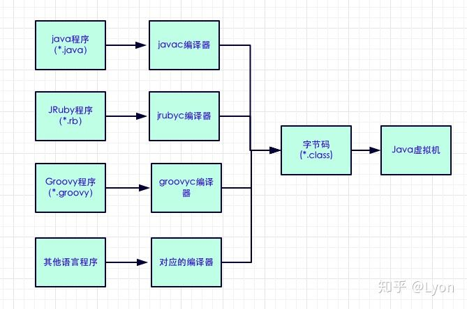
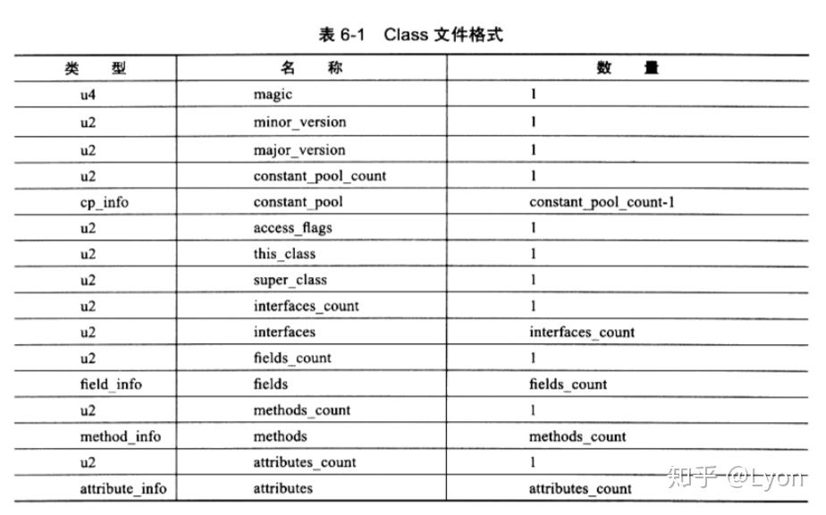
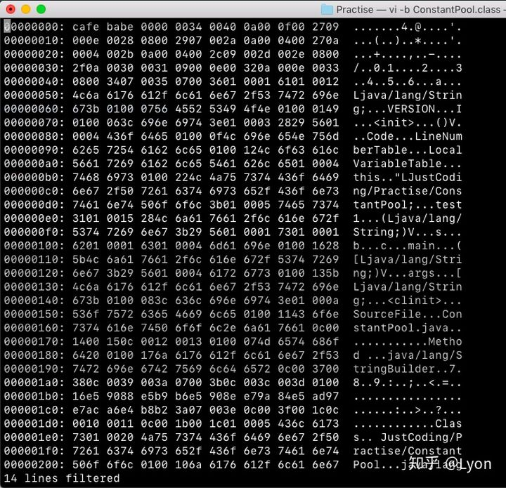
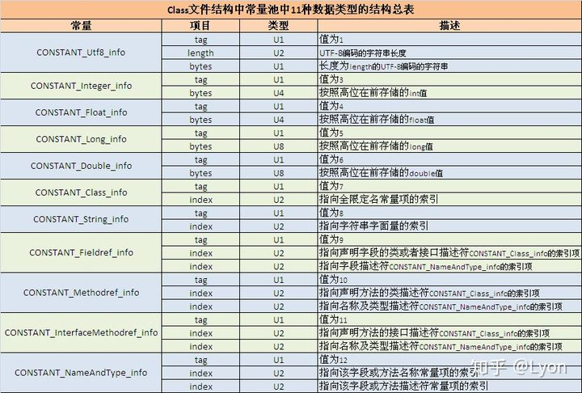
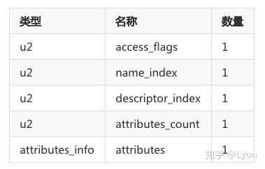
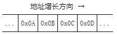
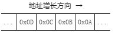

# 类文件结构

## 1.Java 虚拟机和字节码、机器码

在开始之前，先介绍一下 JVM 和字节码、机器码的概念。

### 1.1 JVM 虚拟机

JVM 是 Java Virtual Machine（Java 虚拟机）的缩写，JVM 是一种用于计算设备的规范，它是一个虚构出来的计算机，是通过在实际的计算机上仿真模拟各种计算机功能来实现的。

Java 语言的一个非常重要的特点就是与平台的无关性。而使用 Java 虚拟机是实现这一特点的关键。一般的高级语言如果要在不同的平台上运行，至少需要编译成不同的目标代码。而引入 Java 语言虚拟机后，Java 语言使用 Java 虚拟机屏蔽了与具体平台相关的信息，使得 Java 语言编译程序只需生成在 Java 虚拟机上运行的目标代码( 字节码)，就可以在多种平台上不加修改地运行。Java 虚拟机在执行字节码时，把字节码解释成具体平台上的机器指令( 机器码) 执行。这就是 Java 的能够一次编译，到处运行的原因。

### 1.2 机器码和字节码

首先，我们知道一段程序要想在电脑上运行，必须“翻译”成电脑能够听懂的，由 0，1 组成的二进制代码，这种类型的代码即称为机器码，机器码是计算机可以直接执行的、速度最快的代码。在 Java 中，编写好的程序即通常的 .java 文件需要经过编译器编译成 **`.class`** 文件，这段 **`.class`** 文件是一段包含着虚拟机指令、程序和数据片段的二进制文件，即字节码，为什么叫字节码？因为这种类型的代码以一个字节 8 bit 为最小单位储存。

### 1.3 Java 语言的平台无关性和 JVM 的语言无关性

#### 1.3.1 Java 语言的平台无关性

代码编译的结果从本地机器码转变为字节码，是存储格式发展的一小步，却是编程语言发展的一大步。

为什么这么说呢？作者下面也解释的很明白。因为在虚拟机出现之前，程序要想正确运行在计算机上，首先要将代码编译成二进制本地机器码，而这个过程是和电脑的操作系统 OS、CPU 指令集强相关的，所以可能代码只能在某种特定的平台下运行，而换一个平台或操作系统就无法正确运行了。随着虚拟机的出现，直接将程序编译成机器码，已经不再是唯一的选择了。**<font color="red">越来越多的程序语言选择了与操作系统和机器指令集无关的、平台中立的格式作为程序编译后的存储格式</font>**。Java 就是这样一种语言。一次编写，到处运行于是成立 Java 的宣传口号。

正是虚拟机和字节码 (ByteCode) 构成了平台无关性的基石，从而实现一次编写，到处运行。Java 虚拟机将 .java 文件编译成字节码，而 .class 字节码文件经过 JVM 转化为当前平台下的机器码后再进行程序执行。这样，程序猿就无需重复编写代码来适应不同平台了，而是一套代码处处运行，至于字节码怎样转化成对应平台下的机器码，那就是 Java 虚拟机的事情了。

#### 1.3.2 JVM 的语言无关性

Java 语言通过 JVM 虚拟机和字节码 (ByteCode) 实现了平台无关性，那么语言无关性又是什么意思？其实，在 Java 虚拟机设计之初，作者非常前瞻性的说过：

In the future,we will consider bounded extensions to the Java virtual machine to provide better support for other languages 在未来, 我们会对 java 虚拟机进行适当的拓展，以便更好的支持其他语言运行于 JVM 之上。时至今日，商业机构和开源机构以及在 Java 语言之外发展出一大批在 Java 虚拟机之上运行的语言，如 Groovy,JRuby,Jython,Scala 等等。这些语言通过各自的编译器编译成为 .class 文件，从而可以被 JVM 所执行。

<div align="center">
    
</div>

所以，由于 Java 虚拟机设计之初的定位，以及字节码 (ByteCode) 的存在，使得 JVM 可以执行不同语言下的字节码 .class 文件，从而构成了语言无关性的基础。

## 2.字节码 .class 文件的结构

根据 Java 虚拟机的规定，Class 文件格式采用一种类似于 C 语言结构体的伪结构来存储数据，这种伪结构只有 2 种数据类型：

- 无符号数：u1、u2、u4、u8 分别表 1、2、4、8 字节的无符号数，无符号数用来描述数字、索引引用、数量值、字符串值。
- 表：表则是由无符号数或者其他表作为数据复合而成的数据类型，所有表都习惯以 **`_info`** 结尾。Class 文件本身也是一张表。

当然无论是无符号数还是表，**<font color="red">Class 文件都是以 8 位(8bit)，一个字节为单位存储的</font>**，各个数据项目紧密无间隔排列的二进制流。当数据项长度超过 8 位时，按照高位在前(Big Endian) 的方式分隔成若干个 8 位字节存储。整个 Class 文件实质上就是一张表，其中的数据项由各个子表和无符号数构成。Class 文件的格式如下：

<div align="center">
    
</div>

参照上面的数据结构，Class 文件由 10 个部分组成：

- 魔数
- Class 文件的主次版本号
- 常量池
- 访问标记
- 当前类名
- 父类名
- 继承的接口
- 包含的所有字段的数量 + 字段
- 包含的所有方法的数量 + 方法
- 包含的所有属性的数量 + 属性

此处需要注意的是，由于 class 文件没有任何分隔符号，所有 .class 文件中所有的数据项( 表或无符号数) 都是按照图表中的顺序依次排列好的，所以我们可以在 .class 文件中依照字节的顺序来依次查看对应数据项的详细信息。这里我们以一个 .class 文件为例，看看其具体的字节信息，源码如下：

```java{.line-numbers}
package JustCoding.Practise;

public class ConstantPool {

    private static String a = "Class";

    public int VERSION = 100;

    private static void test1(String s){
        String b = "Method ";
        String c = b + s;
        System.out.println("合并后的字符串:"+c);
    }
    public static void main(String[] args){
        test1(a);
    }
} 
```

用 vim 打开其.class 文件查看其 16 进制文件如下：

<div align="center">
    
</div>

下面我们来依次介绍一下上面的各个部分：

**（1）魔数**

如上图所示，是 **`ConstantPool.class`** 文件的 16 进制表示，前 4 个字节为 **`ca fe ba be`**，这个即为上表中的 magic，magic 译为魔数，在 .class 文件的头 4 个字节, 它的唯一作用是确定这个文件是否是能够被虚拟机识别的 class 文件, 其值是固定的为 **`0xCAFEBABE`** ( 咖啡宝贝)。很多文件都使用魔数来确定文件类型，而不是扩展名（因为扩展名可以任意修改）。

**（2）版本声明 major_version、minor_version**

紧挨着魔数后的第 5、6 两个字节存储的是 **`minor_version`**，即 Java 的次版本号，第 7、8 两个字节是 **`major_version`** 主版本号。可以看见这里次版本号为 **`0x0000`**，主版本号为 **`0x0034`**。每个 Java 版本都有对应的主、次版本号可以查询。例子中的 **`0x0034`** 对应 10 进制的 52，表示 JDK 的主版本号为 1.8。

下面是 JDK 与其对应的版本号关系：

```java{.line-numbers}
JDK 1.8 = 52
JDK 1.7 = 51
JDK 1.6 = 50
JDK 1.5 = 49
JDK 1.4 = 48
JDK 1.3 = 47
JDK 1.2 = 46
JDK 1.1 = 45
```

**（3）常量池计数项 constant_pool_count**

版本声明后，是一个 2 个字节的无符号数 u2 用于标志常量池容量，此处 **`0x0040`**, 等于 10 进制下的 64，表明常量池中有 63 项常量。此处有个小设计，容量计数是从 1 开始而不是从 0 开始，故 64-1=63。

**（4）常量池表 constant_pool**

接着就到了常量池表 **`cp_info`**。接着让我们回顾一下方法区中的运行时常量池。

**<font color="red">运行时常量池 (Runtime Constant Pool) 是 class 文件中每一个类或接口的常量池表 (constant pool table) 的运行时表示形式，属于方法区的一部分</font>**。每一个运行时常量池都在 Java 虚拟机的方法区中分配，在加载类和接口的 class 文件到虚拟机之后，就创建对应的运行时常量池。常量池的作用是存放编译器生成的各种字面量和符号引用。**<font color="red">当虚拟机运行时，就会从常量池获得对应的符号引用，再在类创建或运行时解析、翻译成具体的内存地址</font>**。

字面量 (Literal), 通俗理解就是 Java 中的常量，如文本字符串、声明为 final 的常量值等。符号引用 (Symbolic References) 则是属于编译原理中的概念，包括了下面三类常量：

- 类和接口的全限定名
- 字段的名称和描述符
- 方法的名称和描述符

常量池可以理解为 class 文件中的资源仓库，它是 class 文件结构中与其他项目关联最多的数据类型，也是占用 class 空间最大的一个数据项。因为常量池中常量的数量不是固定的，所以需要 2 字节的无符号 **`u2(constant_pool_count)`** 代表常量池容量计数值，此处有个小设计，容量计数是从 1 开始而不是从 0 开始。常量池中的每一项常量都是一个表。

每个常量项表中第一位是一个 u1 类型的标志位，用于标志常量的类型，具体各个常量表如下图所示 (目前有 14 种类型的常量，表中只列了 11 项)：

<div align="center">
    
</div>

到此，我们来看一下用 **`javap -v ConstantPool.class`** 反编译一下.class 文件来看看字节码的组成情况：

```java{.line-numbers}
Classfile xxx/.../ConstantPool.class
  Last modified 2018年9月20日; size 1063 bytes
  MD5 checksum 024d748f4dc1776164f6c3e8e19cf95b
  Compiled from "ConstantPool.java"
public class JustCoding.Practise.ConstantPool
  minor version: 0
  major version: 52
  flags: (0x0021) ACC_PUBLIC, ACC_SUPER
  this_class: #14                         // JustCoding/Practise/ConstantPool
  super_class: #15                        // java/lang/Object
  interfaces: 0, fields: 2, methods: 4, attributes: 1
Constant pool:
   #1 = Methodref          #15.#39        // java/lang/Object."<init>":()V
   #2 = Fieldref           #14.#40        // JustCoding/Practise/ConstantPool.VERSION:I
   #3 = String             #41            // Method
   #4 = Class              #42            // java/lang/StringBuilder
   #5 = Methodref          #4.#39         // java/lang/StringBuilder."<init>":()V
   #6 = Methodref          #4.#43         // java/lang/StringBuilder.append:(Ljava/lang/String;)Ljava/lang/StringBuilder;
   #7 = Methodref          #4.#44         // java/lang/StringBuilder.toString:()Ljava/lang/String;
   #8 = Fieldref           #45.#46        // java/lang/System.out:Ljava/io/PrintStream;
   #9 = String             #47            // 合并后的字符串:
  #10 = Methodref          #48.#49        // java/io/PrintStream.println:(Ljava/lang/String;)V
  #11 = Fieldref           #14.#50        // JustCoding/Practise/ConstantPool.a:Ljava/lang/String;
  #12 = Methodref          #14.#51        // JustCoding/Practise/ConstantPool.test1:(Ljava/lang/String;)V
  #13 = String             #52            // Class
  #14 = Class              #53            // JustCoding/Practise/ConstantPool
  #15 = Class              #54            // java/lang/Object
  #16 = Utf8               a
  #17 = Utf8               Ljava/lang/String;
  #18 = Utf8               VERSION
  #19 = Utf8               I
  #20 = Utf8               <init>
  #21 = Utf8               ()V
  #22 = Utf8               Code
  #23 = Utf8               LineNumberTable
  #24 = Utf8               LocalVariableTable
  #25 = Utf8               this
  #26 = Utf8               LJustCoding/Practise/ConstantPool;
  #27 = Utf8               test1
  #28 = Utf8               (Ljava/lang/String;)V
  #29 = Utf8               s
  #30 = Utf8               b
  #31 = Utf8               c
  #32 = Utf8               main
  #33 = Utf8               ([Ljava/lang/String;)V
  #34 = Utf8               args
  #35 = Utf8               [Ljava/lang/String;
  #36 = Utf8               <clinit>
  #37 = Utf8               SourceFile
  #38 = Utf8               ConstantPool.java
  #39 = NameAndType        #20:#21        // "<init>":()V
  #40 = NameAndType        #18:#19        // VERSION:I
  #41 = Utf8               Method
  #42 = Utf8               java/lang/StringBuilder
  #43 = NameAndType        #55:#56        // append:(Ljava/lang/String;)Ljava/lang/StringBuilder;
  #44 = NameAndType        #57:#58        // toString:()Ljava/lang/String;
  #45 = Class              #59            // java/lang/System
  #46 = NameAndType        #60:#61        // out:Ljava/io/PrintStream;
  #47 = Utf8               合并后的字符串:
  #48 = Class              #62            // java/io/PrintStream
  #49 = NameAndType        #63:#28        // println:(Ljava/lang/String;)V
  #50 = NameAndType        #16:#17        // a:Ljava/lang/String;
  #51 = NameAndType        #27:#28        // test1:(Ljava/lang/String;)V
  #52 = Utf8               Class
  #53 = Utf8               JustCoding/Practise/ConstantPool
  #54 = Utf8               java/lang/Object
  #55 = Utf8               append
  #56 = Utf8               (Ljava/lang/String;)Ljava/lang/StringBuilder;
  #57 = Utf8               toString
  #58 = Utf8               ()Ljava/lang/String;
  #59 = Utf8               java/lang/System
  #60 = Utf8               out
  #61 = Utf8               Ljava/io/PrintStream;
  #62 = Utf8               java/io/PrintStream
  #63 = Utf8               println
{
  public int VERSION;
    descriptor: I
    flags: (0x0001) ACC_PUBLIC

  public JustCoding.Practise.ConstantPool();
    descriptor: ()V
    flags: (0x0001) ACC_PUBLIC
    Code:
      stack=2, locals=1, args_size=1
         0: aload_0
         1: invokespecial #1                  // Method java/lang/Object."<init>":()V
         4: aload_0
         5: bipush        100
         7: putfield      #2                  // Field VERSION:I
        10: return
      LineNumberTable:
        line 3: 0
        line 7: 4
      LocalVariableTable:
        Start  Length  Slot  Name   Signature
            0      11     0  this   LJustCoding/Practise/ConstantPool;

  public static void main(java.lang.String[]);
     descriptor: ([Ljava/lang/String;)V
     flags: (0x0009) ACC_PUBLIC, ACC_STATIC
     Code:
       stack=1, locals=1, args_size=1
          0: getstatic     #11                 // Field a:Ljava/lang/String;
          3: invokestatic  #12                 // Method test1:(Ljava/lang/String;)V
          6: return
       LineNumberTable:
         line 15: 0
         line 16: 6
       LocalVariableTable:
         Start  Length  Slot  Name   Signature
             0       7     0  args   [Ljava/lang/String;
 
   static {};
     descriptor: ()V
     flags: (0x0008) ACC_STATIC
     Code:
       stack=1, locals=0, args_size=0
          0: ldc           #13                 // String Class
          2: putstatic     #11                 // Field a:Ljava/lang/String;
          5: return
       LineNumberTable:
         line 5: 0
 }
 SourceFile: "ConstantPool.java" 
```

可以看到，**`minor version: 0 major version: 52；Constant pool`** 共有 63 项。和我们之前看 16 进制码时是一一对应的。

**（5）访问标志 access_flags**

在常量池表后面的两个字节代表访问标志，用于标志类或接口层次的访问信息。如:这个 Class 文件是类还是接口？是否是 public? 是否为抽象的 abstract？是否为 final 的等。

**（6）类索引 this_class、父类索引 super_class 和接口索引集合 interfaces**

类索引用于确定此类的全限定名称：**`JustCoding/Practise/ConstantPool`**，父类索引 **`super_class`** 用于确定这个类父类的全限定名：**`java/lang/Object`**。接口索引集合 intefaces 用来描述这个类实现了哪些接口。类索引 **`this_class`**、父类索引 **`super_class`** 都是一个 u2 类型的数据，接口索引集合包含一个 u2 类型的接口计数项 **`intefaces_count`** 和若干个 u2 类型的数据集合。

**（7）字段表集合 fields_count + field_info/方法表集合 methods_count + methods_info**

字段表集合用于描述接口或类中声明的变量。字段 filed 包括类变量、实例变量，但不包括方法内部声明的局部变量。字段表结构如下：

<div align="center">
    
</div>

字段表集合中第一项是 access_flags，需要注意的是，这里的 access_flags 和之前类中的 access_flags 类似，是一个 u2 类型的数据，表示字段/方法访问标记，可以设置 9 个标记位用于标记字段/ 方法是否：**`public、private、protected、static、final、volatile、transient、enum`**，是否由编译器自动产生。

然后是 **`name_index`** 和 **`descriptor_index`**，他们分别代表字段/方法的简单名称以及字段/方法的描述符。方法表集合用于存储此类或接口中包含的方法，表结构和字段表类似。简单名称是指没有类型修饰、没有参数修饰的字段/方法名称。简单名称很好理解，在例子中有：a ,VERSION ,test1。描述符 descriptor 则稍微麻烦点，描述符的作用是用来描述字段的数据类型或者方法参数列表和返回值。例子中描述符有：**`I`**，**`()V`**，**`([Ljava/lang/String;)V`** 这几个。

## 3.大小端

大小端又被称为字节序，在计算机科学领域中，指电脑内存中或在数字通信链路中，组成多字节的字节的排列顺序。在几乎所有的机器上，多字节对象都被存储为连续的字节序列。例如在 C 语言中，一个类型为 int 的变量 x 地址为 **`0x100`**，那么其对应地址表达式 **`&x`** 的值为 **`0x100`**。且 x 的四个字节将被存储在电脑内存的 **`0x100`**, **`0x101`**, **`0x102`**, **`0x103`** 位置。

字节的排列方式有两个通用规则。例如，将一个多位数的低位放在较小的地址处，高位放在较大的地址处，则称小端序；反之则称大端序。在网络应用中，字节序是一个必须被考虑的因素，因为不同机器类型可能采用不同标准的字节序，所以均按照网络标准转化。在哪种字节顺序更合适的问题上，人们表现得非常情绪化，实际上，就像鸡蛋的问题一样，没有技术上的原因来选择字节顺序规则，因此，争论沦为关于社会政治问题的争论，只要选择了一种规则并且始终如一地坚持，其实对于哪种字节排序的选择是任意的。

对于单一的字节（a byte），大部分处理器以相同的顺序处理位元（bit），因此单字节的存放方法和传输方式一般相同。对于多字节数据，如整数（32 位机中一般占 4 字节），在不同的处理器的存放方式主要有两种，以内存中 **`0x0A0B0C0D`** 的存放方式为例，分别有以下几种方式：

### 3.1 大端序

<div align="center">
    
</div>

示例中，最高位字节是 0x0A 存储在最低的内存地址处。下一个字节 0x0B 存在后面的地址处。正类似于十六进制字节从左到右的阅读顺序。

### 3.2 小端序

<div align="center">
    
</div>

最低位字节是 0x0D 存储在最低的内存地址处。后面字节依次存在后面的地址处。

总结如下：

- 大端小端是不同的字节顺序存储方式，统称为字节序；
- 大端模式，是指数据的高字节位保存在内存的低地址中，而数据的低字节位保存在内存的高地址中。这样的存储模式有点儿类似于把数据当作字符串顺序处理：地址由小向大增加，而数据从高位往低位放。和我们从左到右阅读习惯一致。
- 小端模式，是指数据的高字节位保存在内存的高地址中，而数据的低字节位保存在内存的低地址中。这种存储模式将地址的高低和数据位权有效地结合起来，高地址部分权值高，低地址部分权值低，和我们的逻辑方法一致。

### 3.3 通过代码检测大小端

通过将 int 强制类型转换成 char 单字节，判断起始存储位置内容实现。

```java{.line-numbers}
#include <stdio.h>
int main()
{
    int a = 1; //占4 bytes，十六进制可表示为 0x 00 00 00 01
    
     //b相当于取了a的低地址部分 
    char *b =(char *)&a; //占1 byte
    
    if (1 == *b) {//走该case说明a的低字节，被取给到了b，即a的低字节对应a所占内存的低地址，符合小端模式特征
        printf("Little_Endian!\n");
    } else {
        printf("Big_Endian!\n");
    }
    return 0;
} 
```