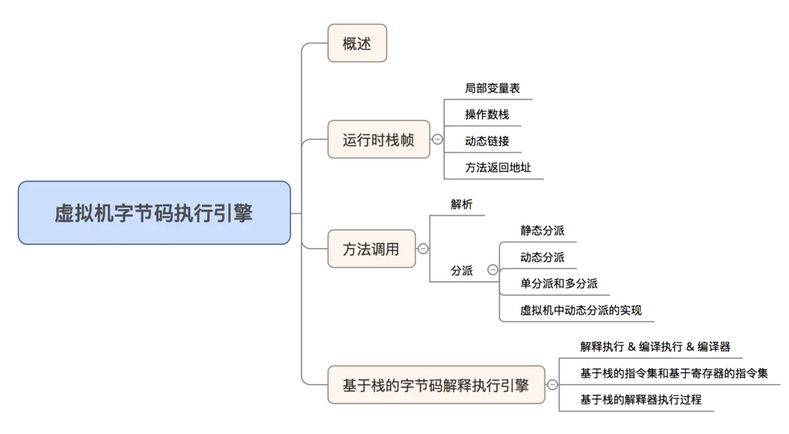
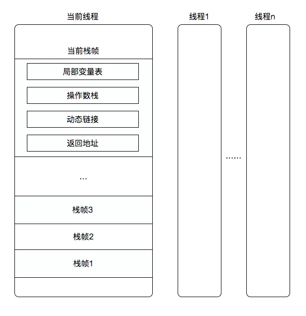
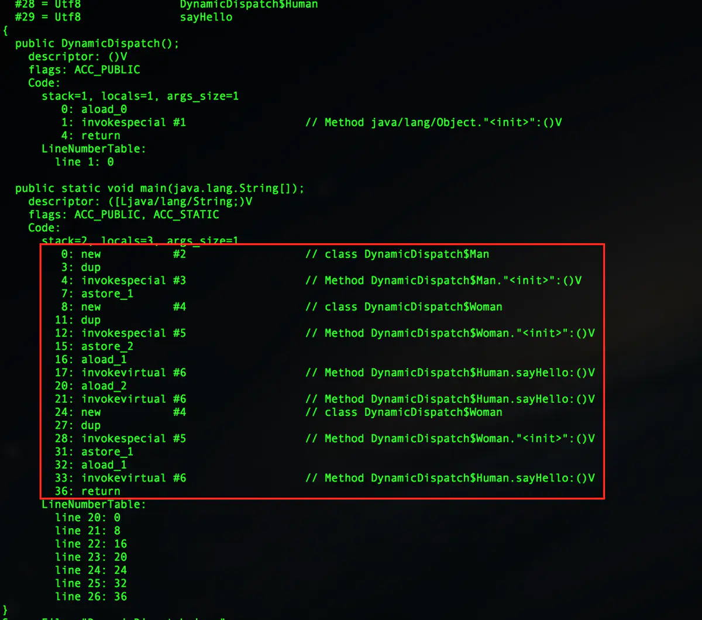
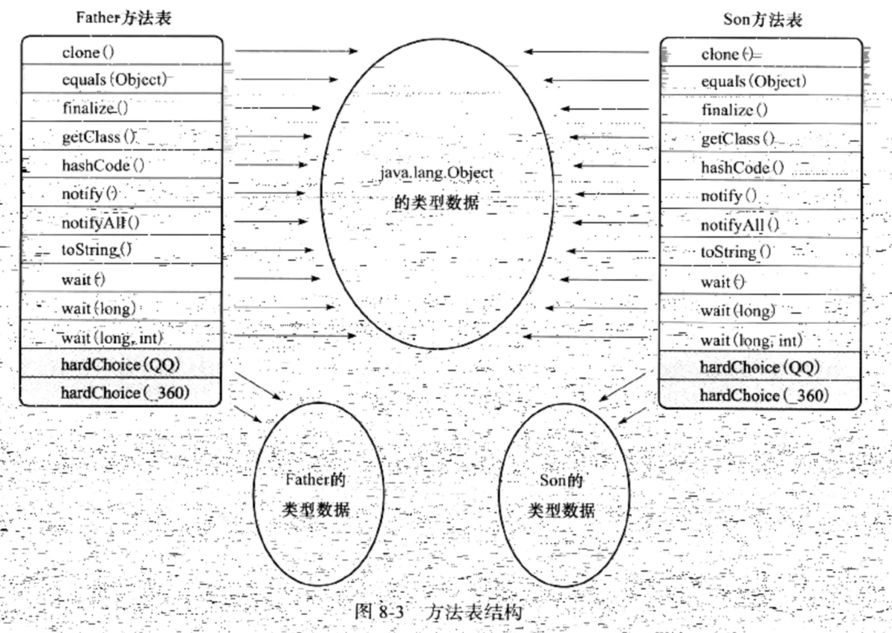

# 虚拟机字节码执行引擎

在前面两篇文章中介绍了 `.class` 文件的结构和虚拟机加载 `.class` 文件的过程，在本篇文章中主要介绍加载进来之后，虚拟机是如何执行字节码的，在程序执行的过程中主要是方法的调用和执行，所以本篇文章中介绍虚拟机是如何调用方法并且执行方法的，文章结构如下：

<div align="center">  </div>

## 一、概述

执行引擎是 Java 虚拟机最核心的组成部分之一。"虚拟机" 是一个相对于 "物理机" 的概念，这两种机器都有代码执行能力，其区别是物理机的执行引擎是直接建立在处理器、硬件、指令集和操作系统层面上的，而虚拟机的执行引擎则是由自己实现的，因此可以自行制定指令集与执行引擎的结构体系，并且能够执行哪些不被硬件直接支持的指令集格式。

**<font color="red">所谓的 "虚拟机字节码执行引擎" 其实就是 `JVM` 根据 `Class` 文件中给出的字节码指令，基于栈解释器的一种执行机制。通俗点来说，也就是 `JVM` 解析字节码指令，输出运行结果的一个过程</font>**。

## 二、运行时栈帧

栈帧（Stack Frame）是用于支持虚拟机进行方法调用和方法执行的数据结构，它是虚拟机运行时数据区中的虚拟机栈（Virtual Machine Stack）的栈元素。栈帧存储了方法的局部变量表、操作数栈、动态连接和方法返回地址等信息。每一个方法从调用开始至执行完成的过程，都对应着一个栈帧在虚拟机栈里面从入栈到出栈的过程。

在编译程序代码的时候，栈帧中需要多大的局部变量表，并且写入到方法表的 `Code` 属性之中，因此一个栈帧需要分配多少内存，不会受到程序运行期变量数据的影响，而仅仅取决于具体的虚拟机实现。一个线程中的方法调用链可能会很长，很多方法都同时处于执行状态。对于执行引擎来说，在活动线程中，只有位于栈顶的栈帧才是有效的，称为当前栈帧（Current Stack Frame），与这个栈帧相关联的方法称为当前方法（Current Method）。执行引擎运行的所有字节码指令都只针对当前栈帧进行操作，在概念模型上，典型的栈帧结构如下图所示：

<div align="center">  </div>

上图可以看出一个线程一个栈，一个栈中包含若干栈帧，栈帧对应一个具体的方法，主要包含四块内容：局部变量表、操作栈、动态链接、返回地址。最上面的栈才是当前要执行的有效栈，称为当前栈帧，关联的方法就是当前方法。接下来详细讲解一下栈帧的局部变量表、操作数栈、动态连接、方法返回地址等各个部分的作用和数据结构。

### 2.1 局部变量表

局部变量表是一组变量值的存储空间，用于存放方法参数和方法内部定义的局部变量。在编译的时候，就在方法的 `Code` 属性的 `max_locals` 数据项中确定了该方法所需要分配的局部变量表的最大容量。

局部变量表的容量以变量槽（Variable Slot，下称 Slot）为最小单位，虚拟机规范中并没有明确指明一个 Slot 应占用的内存空间大小，只是很有导向性地说到每个 Slot 都应该能存储一个 `boolean`、`byte`、`char`、`short`、`int`、`float`、`reference` 或 `returnAddress` 类型的数据，这 8 种数据类型，都可以使用 32 位或更小的物理内存来存放，在 Java 虚拟机的数据类型中，64 位的数据类型只有 `long` 和 `double` 两种，关于这几种局部变量表中的数据有两点需要注意：

- `reference` 数据类型，虚拟机规范并没有明确指明它的长度，也没有明确指明它的数据结构，但是虚拟机通过 `reference` 数据可以做到两点：
  - 通过此 `reference` 引用，可以直接或间接的查找到对象在 Java 堆上的真实地址索引；
  - 通过此 `reference` 引用，可以直接或间接地查找到对象所属数据类型在方法区中存储的类型信息。
- 对于 64 位的 `long` 和 `double` 数据，虚拟机会以高位对齐的方式为其分配两个连续的 Slot 空间。

**<font color="red">在方法执行时，虚拟机是使用局部变量表完成参数变量列表的传递过程</font>**。如果是实例方法，那么局部变量表中的第 0 位索引的 Slot 默认是用于传递方法所属对象实例的引用，在方法中可以通过关键字 `this` 来访问这个隐藏的局部变量，其余参数则按照参数列表的顺序来排列，占用从 1 开始的局部变量 Slot。数表分配完毕后，再跟进方法体内部定义的变量顺序和作用域来分配其余的 Slot。

需要注意的是局部变量并不存在如类变量的 "准备" 阶段，类变量会在类加载的时候经过 "准备" 和 "初始化" 阶段，即使程序员没有为类变量赋予初始值，也还是会在 "准备" 阶段赋予系统的类型默认值，在 "初始化" 阶段给类变量赋予代码中的初始值。但是局部变量不会这样，局部变量表没有 "准备" 阶段，所以需要程序员手动地为局部变量赋予初始值。

### 2.2 操作数栈

操作数栈也常被称为操作栈，它是一个后入先出栈。同局部变量表一样，操作数栈的最大深度也在编译时期就写入到方法表的 `Code` 属性的 `max_stacks` 数据项中。操作数栈的每一个元素可以是可以是任意 Java 数据类型，包括 `long` 和 `double`，32 位数据类型所占的栈容量为 1，64 位数据类型所占的栈容量为 2。

在一个方法刚开始执行的时候，操作数栈是空的，随着方法的执行，会有各种字节码往操作数栈中写入和提取内容，也就是出栈 / 入栈操作。Java 虚拟机的解释执行引擎称为 "基于栈的执行引擎"，其中所指的 "栈" 就是操作数栈。

### 2.3 动态链接

在 `Class` 文件的常量池中存有大量的符号引用，字节码中的方法调用指令就以常量池中符号引用为参数。**<font color="red">这些符号引用一部分会在类加载阶段或第一次使用的时候转化为直接引用，这种转化称为静态解析</font>**。另外一部分将在每一次的运行期期间转化为直接引用，这部分称为动态连接。

### 2.4 方法的返回地址

在一个方法被执行后，有两种方式退出这个方法：正常完成出口和异常完成出口。

- 正常完成出口：当执行引擎遇到任意一个方法返回的字节码指令，这时候可能会有返回值传递给上层的方法调用者，是否有返回值和返回值的类型将根据遇到何种方法返回指令来决定。
- 异常完成出口：在方法执行的过程中如果遇到了异常，并且这个异常没有在方法体内得到处理，无论是 Java 虚拟机内部产生的异常，还是在代码中使用 `throw` 字节码指令产生的异常，只要在本方法的异常表中没有搜索到匹配的异常处理器，就会导致方法退出。

方法退出时，需要返回到方法被调用的位置，程序才能继续执行。方法正常退出时，调用者的 `PC` 计数器的值可以作为返回地址，栈帧中之前很可能会保存这个计数器值；而方法异常退出时，返回地址是要通过异常处理器表来确定的，栈帧中一般不会保存这部分信息。方法退出的过程实际上等同于把当前栈帧出栈，因此退出时可能执行的操作有：**<font color="red">恢复上层方法的局部变量表和操作数栈，把返回值（如果有的话）压入调用者栈帧的操作数栈中，调整 `PC` 计数器的值以指向方法调用指令后面的一条指令等</font>**。

## 三、方法调用

方法调用即指确认调用哪个方法的过程，并不是指执行方法的过程。Java 的编译并不包含传统编译过程中的连接步骤，所以在 `.java` 代码编译成 `.class` 文件之后，在 `.class` 文件中存储的是方法的符号引用（方法在常量池中的符号），并不是方法的直接引用（方法在内存布局中的入口地址），所以需要在加载或运行阶段才会确认目标方法的直接引用。

### 3.1 解析

有几种方法的调用，在加载阶段就可以确认该方法的直接引用，前提是在程序真正运行之前就确定了需要调用哪一个方法，并且这个方法的调用版本在运行期是不可变的。换句话说，调用目标在程序代码写好、编译器进行编译时就必须确定下来。这类方法的调用称为解析。

有四种方法是进行的方法的解析：静态方法、私有方法、实例构造器、父类方法，这四类方法称为非虚方法，与之对应的就是虚方法（`final` 方法除外），调用这四类方法的字节码指令是：`invokestatic`、`invokespecial` 指令，也就是说被 `invokestatic`、`invokespecial` 字节码调用的方法，在类加载的解析阶段就可以通过方法的符号引用确认方法的直接引用。在 Java 字节码中，还有几种调用方法的字节码指令如下：

- `invokestatic`：调用静态方法。
- `invokespecial`：调用实例构造器方法 `<init>`、私有方法、父类方法。
- `invokevirtual`：调用所有的虚方法。
- `invokeinterface`：调用接口方法，会在运行时确认一个实现此接口的对象。
- `invokedynamic`：先在运行时动态解析出调用点限定符所引用的方法，然后再执行该方法。

被 `final` 关键字修饰的方法，在字节码中是被 `invokevirtual` 指令调用的，但是被 `final` 修饰的方法无法被重载或重写，所以只有一个方法，在加载阶段就可以确认调用哪个方法，所以也是一种非虚方法，方法调用时走的也是解析流程。

### 3.2 分派

解析调用是一个静态的过程，在加载阶段就可以确认目标方法的直接引用。不过分派调用有可能是静态的，也有可能是动态的。在讲解本节中的分派的过程中，会揭示一些 Java 中的多态性在 Java 虚拟机层面的基本体现，如 "重载" 和 "重写" 在 Java 虚拟机中是如何实现的。

#### 3.2.1 静态分派

先看如下一个静态分派的代码示例：

```java {.line-numbers}
public class StaticDispatch {

    static abstract class Human {
    }

    static class Man extends Human {
    }

    static class Woman extends Human {
    }

    public void sayHello(Human guy) {
        System.out.println("hello, guy");
    }

    public void sayHello(Man guy) {
        System.out.println("hello, man");
    }

    public void sayHello(Woman guy) {
        System.out.println("hello, woman");
    }

    public static void main(String[] args) {
        Human man = new Man();
        Human woman = new Woman();
        StaticDispatch dispatch = new StaticDispatch();
        dispatch.sayHello(man);
        dispatch.sayHello(woman);
    }
}
```

有 Java 开发经验的开发者都会知道，上面代码是一个方法重载的示例代码，其输出结果如下所示：

```text
hello, guy
hello, guy
```

有人就问了，为什么会调用参数类型是 `Human` 的方法，而不执行方法参数是 `Man` 和 `Woman` 的方法呢？接下来我们就来分析一下，在分析之前，我们先定义两个重要的概念：变量的静态类型和实际类型，假如有如下代码：

```java {.line-numbers}
Human man = new Man();
```

- 静态类型：是指对象 man 的 `Human` 类型，静态类型本身是不会发送变化的，在编译期间就可以确定一个变量的静态类型。
- 实际类型：是指对象 man 的 `Man` 类型，实际类型在编译期间是不可确定的，只有在运行期才可确定。

如下代码所示：

```java {.line-numbers}
// 实际类型变化
Human man = new Man();
man = new Woman();

// 静态类型变化
dispatch.sayHello((Man) man);
dispatch.sayHello((Woman) man);
```

所以第一段代码中，方法接收者是 `StaticDispatch` 对象，虽然两个变量的实际类型不同，但是静态类型是相同的都是 `Human`。**<font color="red">虚拟机（准确地说是编译器）在实现重载时是通过参数的静态类型而不是实际类型做出判定的</font>**。并且在编译阶段，变量的静态类型是可以确定的，所以编译器会根据变量的静态类型决定使用哪个重载方法。所有依赖静态类型定位目标方法的分派动作称为静态分派，静态分派典型的应用就是方法的重载。静态分派发生在编译阶段，所以方法的静态分派动作是由编译器执行的。

#### 3.2.2 动态分派

动态分派和 Java 语言中的 "方法重写" 有着密切的联系，还是看如下的一个例子：

```java {.line-numbers}
public class DynamicDispatch {

    static abstract class Human {
        abstract void sayHello();
    }

    static class Man extends Human {
        void sayHello() {
            System.out.println("hello, man");
        }
    }

    static class Woman extends Human {
        void sayHello() {
            System.out.println("hello, woman");
        }
    }

    public static void main(String[] args) {
        Human man = new Man();
        Human woman = new Woman();
        man.sayHello();
        woman.sayHello();
        man = new Woman();
        man.sayHello();
    }
}
```

输出结果如下所示：

```text
hello, man
hello, woman
hello, woman
```

上面的输出结果不会出乎人的预料，从之前的静态分派中，我们可以知道，在这个例子中，不是根据对象的静态类型判断的，而是根据对象的实际类型判断的，那在 Java 虚拟机中是如何根据实例类型来判断的呢？我们使用 `javap` 命令得到上面 `main()` 方法的字节码如下所示：

<div align="center">  </div>

从上图中，我们可以看到 `main()` 方法的字节码指令执行过程：

- 0 ~ 7 句是调用 `Man` 类的实例构造器创建一个 `Man` 类的对象，并将对象的引用压入到局部变量表的第 1 个 Slot 中；
- 8 ~ 15 句是调用 `Woman` 类的实例构造器创建一个 `Woman` 类的对象，并将对象的引用压入到局部变量表的第 2 个 Slot 中；
- 16 ~ 17 句是将第 1 个 Slot 中的变量（也就是 man）加载到局部变量表中，并调用 `sayHello()` 方法，关键的就是第 17 句指令 `invokevirtual`。

虽然第 17 句指令调用的常量池中的 `Human.sayHello()` 方法，但是最终执行的却是 `Man.sayHello()` 方法，这就要从 `invokevirtual` 指令的多态查找说起，`invokevirtual` 的查找过程如下所示：

- 找到操作数栈顶的引用所指的对象的实际类型，记做 C。
- 在类型 C 中查找与常量中的描述符和简单名称相同的方法，如果找到则进行访问权限的判断，如果通过则返回这个方法的直接引用，查找结束；如果权限不通过，则返回 `java.lang.IllegalAccessError` 的异常。
- 如果在 C 中没有找到描述符和简单名称都符合的方法，则按照继承关系从下往上依次在 C 的父类中进行查找和验证过程。
- 如果最终还是没有找到该方法，则抛出 `java.lang.AbstractMethodError` 的异常。

在上述 `invokevirtual` 查找方法的过程中，最重要的就是第一步，根据对象的引用确定对象的实际类型，这个就是方法重写的本质。如上所述，在运行期内，根据对象的实际类型确定方法执行版本的分派过程叫做动态分派。

所以总结如下：

- 静态分派：根据对象的静态类型定位目标方法被称为静态分派，静态分派典型的应用就是方法的重载。
- 动态分派：根据对象的实际类型确定方法执行版本过程叫做动态分派，而动态分派的典型应用就是方法的重写。

#### 3.2.3 虚拟机动态分派的实现

虚拟机中的动态分派是十分频繁的动作，并且是在运行时在类方法元数据中进行搜索的，因此基于性能的考虑，虚拟机会采用各种优化手段优化动态分派的过程，最常见的 "稳定优化" 的手段就是为类在方法区中建立一个虚方法表，使用虚方法表索引来代替元数据以提高性能。

<div align="center">  </div>

上图就是一个虚方法表，`Father`、`Son`、`Object` 三个类在方法区中都有一个自己的虚方法表，如果子类中实现了父类的方法，那么在子类的虚方法表中该方法就指向子类实现的该方法的入口地址，如果子类中没有重写父类中的方法，那么在子类的虚方法表中，该方法的索引就指向父类的虚方法表中的方法的入口地址。有两点需要注意：

- 为了程序实现上的方便，一个具有相同签名的方法，在子类的方法表和父类的方法表中应该具有相同的索引，这样在类型变化的时候，只需要改变查找方法的虚方法表即可。
- **<font color="red">虚方法表是在类加载的连接阶段实现的，类的变量初始化完成之后，就会初始化该类的虚方法表</font>**。
