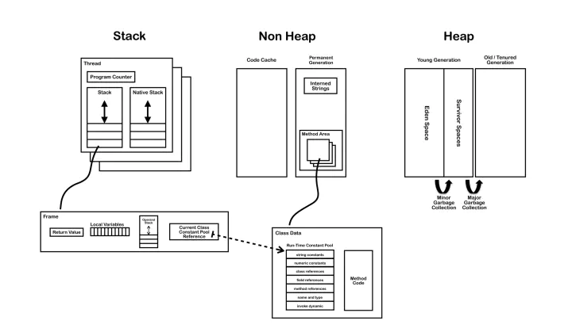
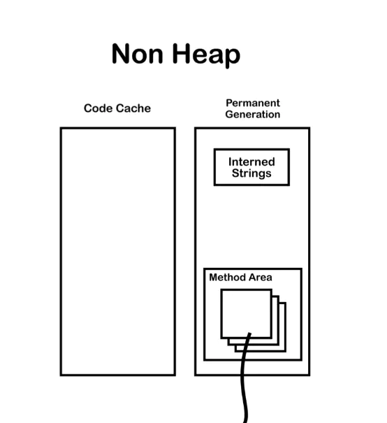

# 虚拟机之常量池详解

## 一、JVM 有几种常量池

主要分为：Class 文件常量池、运行时常量池，当然还有全局字符串常量池，以及基本类型包装类对象常量池。

### 1 Class 文件常量池

阅读过《深入理解 Java 虚拟机》这本书第 6 章内容的小伙伴肯定知道，Class 文件是一组以 8 位字节为单位的二进制数据流，在 java 代码的编译期间，我们编写的 .java 文件就被编译为 .class 文件格式的二进制数据存放在磁盘中，其中就包括 class 文件常量池。Class 文件中存在常量池（非运行时常量池），其在编译阶段就已经确定；JVM 规范对 Class 文件结构有着严格的规范，必须符合此规范的 class 文件才会被 JVM 认可和装载。

为了方便说明，我们这里先写一个很简单的类：

```java {.line-numbers}
class JavaBean{
    private int value = 1;
    public String s = "abc";
    public final static int f = 0x101;

    public void setValue(int v){
        final int temp = 3;
        this.value = temp + v;
    }

    public int getValue(){
        return value;
    }
}
```

通过 javah 命令编译之后，用 `javap -v` 命令查看编译后的文件：

```java {.line-numbers}
class JavaBasicKnowledge.JavaBean
  minor version: 0
  major version: 52
  flags: ACC_SUPER
Constant pool:
   #1 = Methodref          #6.#29         // java/lang/Object."<init>":()V
   #2 = Fieldref           #5.#30         // JavaBasicKnowledge/JavaBean.value:I
   #3 = String             #31            // abc
   #4 = Fieldref           #5.#32         // JavaBasicKnowledge/JavaBean.s:Ljava/lang/String;
   #5 = Class              #33            // JavaBasicKnowledge/JavaBean
   #6 = Class              #34            // java/lang/Object
   #7 = Utf8               value
   #8 = Utf8               I
   #9 = Utf8               s
  #10 = Utf8               Ljava/lang/String;
  #11 = Utf8               f
  #12 = Utf8               ConstantValue
  #13 = Integer            257
  #14 = Utf8               <init>
  #15 = Utf8               ()V
  #16 = Utf8               Code
  #17 = Utf8               LineNumberTable
  #18 = Utf8               LocalVariableTable
  #19 = Utf8               this
  #20 = Utf8               LJavaBasicKnowledge/JavaBean;
  #21 = Utf8               setValue
  #22 = Utf8               (I)V
  #23 = Utf8               v
  #24 = Utf8               temp
  #25 = Utf8               getValue
  #26 = Utf8               ()I
  #27 = Utf8               SourceFile
  #28 = Utf8               StringConstantPool.java
  #29 = NameAndType        #14:#15        // "<init>":()V
  #30 = NameAndType        #7:#8          // value:I
  #31 = Utf8               abc
  #32 = NameAndType        #9:#10         // s:Ljava/lang/String;
  #33 = Utf8               JavaBasicKnowledge/JavaBean
  #34 = Utf8               java/lang/Object
```

可以看到这个命令之后我们得到了该 class 文件的版本号、常量池、已经编译后的字节码指令（处于篇幅原因这里省略），下面我们会对照这个 class 文件来讲解。这里我们需要说明一下，既然是常量池，那么其中个存放的肯定是 "常量"，那么什么是 "常量" 呢？class 文件常量池主要存放两大常量：字面量和符号引用。

#### 1.1 字面量

字面量接近于 java 语言层面的常量概念，主要包括：

- 文本字符串，也就是我们经常声明的：`public String s = "abc";` 中的 "abc"：

```java {.line-numbers}
#9 = Utf8               s
#3 = String             #31            // abc
#31 = Utf8              abc
```

- 用 final 修饰的成员变量，包括静态变量、实例变量和局部变量：

```java {.line-numbers}
#11 = Utf8               f
#12 = Utf8               ConstantValue
#13 = Integer            257
```

这里需要说明的一点，上面说的存在于常量池的字面量，指的是数据的值，也就是 abc 和 `0x101(257)`，通过上面对常量池的观察可知这两个字面量是确实存在于常量池的。而对于基本类型数据（甚至是方法中的局部变量），也就是上面的 `private int value = 1;` 常量池中只保留了他的的字段描述符 I 和字段的名称 value，他们的字面量不会存在于常量池。

#### 1.2 符号引用

符号引用主要设涉及编译原理方面的概念，包括下面三类常量：

- 类和接口的全限定名，也就是 `Ljava/lang/String;` 这样，将类名中原来的 "." 替换为 "/" 得到的，主要用于在运行时解析得到类的直接引用，像上面：

```java {.line-numbers}
#5 = Class              #33            // JavaBasicKnowledge/JavaBean
#33 = Utf8               JavaBasicKnowledge/JavaBean
```

- 字段的名称和描述符，字段也就是类或者接口中声明的变量，包括类级别变量（static）和实例级的变量

```java {.line-numbers}
#4 = Fieldref           #5.#32         // JavaBasicKnowledge/JavaBean.value:I
#5 = Class              #33            // JavaBasicKnowledge/JavaBean
#32 = NameAndType       #7:#8          // value:I

#7 = Utf8               value
#8 = Utf8               I

//这两个是局部变量，值保留字段名称
#23 = Utf8               v
#24 = Utf8               temp
```

- 方法的名称和描述符，方法的描述符类似于 JNI 动态注册时的 "方法签名"，也就是参数类型+返回值类型：

```java {.line-numbers}
#21 = Utf8               setValue
#22 = Utf8               (I)V

#25 = Utf8               getValue
#26 = Utf8               ()I
```

### 2 运行时常量池

运行时常量池是方法区的一部分，所以也是全局共享的。我们知道，jvm 在执行某个类的时候，必须经过加载、连接（验证,准备,解析）、初始化，在第一步的加载阶段，虚拟机需要完成下面 3 件事情：

- 通过一个类的 "全限定名" 来获取此类的二进制字节流；
- 将这个字节流所代表的静态储存结构转化为方法区的运行时数据结构；
- 在内存中生成一个类代表这类的 `java.lang.Class` 对象，作为方法区这个类的各种数据访问的入口；

这里需要说明的一点是，类对象和普通的实例对象是不同的，类对象是在类加载的时候生成的，普通的实例对象一般是在调用 new 之后创建。上面第二条，将 class 字节流代表的静态储存结构转化为方法区的运行时数据结构，其中就包含了 class 文件常量池进入运行时常量池的过程。这里需要强调一下，不同的类共用一个运行时常量池，同时在进入运行时常量池的过程中，多个 class 文件中常量池中相同的字符串只会存在一份在运行时常量池中，这也是一种优化。

运行时常量池的作用是存储 Java class 文件常量池中的符号信息。运行时常量池 中保存着一些 class 文件中描述的符号引用，同时在类加载的 "解析阶段" 还会将这些符号引用所翻译出来的直接引用（直接指向实例对象的指针）存储在 运行时常量池 中。

运行时常量池相对于 class 常量池一大特征就是其具有动态性，Java 规范并不要求常量只能在运行时才产生，也就是说运行时常量池中的内容并不全部来自 class 常量池，class 常量池并非运行时常量池的唯一数据输入口；在运行时可以通过代码生成常量并将其放入运行时常量池中，这种特性被用的较多的是 `String.intern()`。

## 二、全局字符串常量池

### 1 Java 中创建字符串对象的两种方式

这个问题我想大家一定非常清楚了吧，一般有如下两种：

- `String s0 ="hellow";`
- `String s1=new String ("hellow");`

第一种我们之前已经见过了，这种方式声明的字面量 hellow 是在编译期就已经确定的，它会直接进入 class 文件常量池中；当运行期间在全局字符串常量池中会保存它的一个引用，实际上最终还是要在堆上创建一个 "hellow" 对象，这个后面会讲。

第二种方式方式使用了 `new String()`，也就是调用了 String 类的构造函数，我们知道 new 指令是创建一个类的实例对象并完成加载初始化的，因此这个字符串对象是在运行期才能确定的，创建的字符串对象是在堆内存上。 因此此时调用 `System.out.println(s0 == s1);` 返回的肯定是 false，因此 == 符号比较的是两边元素的地址，s1 和 s0 都存在于堆上，但是地址肯定不相同。

下面我们来看看几个非常常见的题目：

```java {.line-numbers}
String s1 = "Hello";
String s2 = "Hello";
String s3 = "Hel" + "lo";
String s4 = "Hel" + new String("lo");
String s5 = new String("Hello");
String s7 = "H";
String s8 = "ello";
String s9 = s7 + s8;

System.out.println(s1 == s2);  // true
System.out.println(s1 == s3);  // true
System.out.println(s1 == s4);  // false
System.out.println(s1 == s9);  // false
```

#### 1.1 s1 == s2

这个对比第一部分常量池的讲解应该很好理解，因为字面量 "Hello" 在运行时会进入字符串常量池，JDK1.7 以前，同时同一份字面量只会保留一份，所有引用都指向这一份字符串，自然引用的地址也就相同了。

#### 1.2 s1 == s3

这个主要牵扯 String "+" 号编译器优化的问题，s3 虽然是动态拼接出来的字符串，但是所有参与拼接的部分都是已知的字面量，在编译期间，这种拼接会被优化，编译器直接帮你拼好，因此 `String s3 = "Hel" + "lo";` 在 class 文件中被优化成 `String s3 = "Hello";`，所以 s1 == s3 成立。

```java {.line-numbers}
public static void main(java.lang.String[]);
    descriptor: ([Ljava/lang/String;)V
    flags: ACC_PUBLIC, ACC_STATIC
    Code:
      stack=3, locals=3, args_size=1
         0: ldc           #2                  // String Hello
         2: astore_1
         3: ldc           #2                  // String Hello
         5: astore_2
         6: getstatic     #3                  // Field java/lang/System.out:Ljava/io/PrintStream;
         9: aload_1
        10: aload_2
        11: if_acmpne     18
        14: iconst_1
        15: goto          19
        18: iconst_0
        19: invokevirtual #4                  // Method java/io/PrintStream.println:(Z)V
        22: return
```

通过查看编译后的方法代码，可以看到这里加入操作数栈的 ldc 指令有两次，都是 "Hello"，没有出现 "Hel" 或者 "lo"，同时这两个 "Hello" 指向常量池的通过一个地址，都是 #2，因此常量池中也只存在一个 "Hello" 字面量。

#### 1.3 s1 != s4

通过字节码可以看到这次确实出现了 "String Hel" 和 "String lo"，原因上面我们也说过，这是因为 `new String("lo")` 在堆中 new 了一个 String 对象出来，而 "Hel" 字面量是通过另一种操作在堆中创建的对象，这两个在堆中不同地方创建的对象是通过 `StringBuilder.append` 方法拼接出来的，并且最终会调用 `StringBuilder.toString` 方法输出（最终输出的也是 "Hello"），这些通过上面字节码的分析都可以看得出来，我们来看看 `StringBuilder.toString` 方法：

```java {.line-numbers}
@Override
    public String toString() {
        // Create a copy, don't share the array
        return new String(value, 0, count);
    }
```

可以看到，这个最终是拼接出来的一个 String 对象，也就是说，s4 指向的一个经过 StringBuilder 拼接之后的 String 对象，而 s1 指向的是另一个对象，这两个对象的地址当然是不同的了。

#### 1.4 s1 != s9

从编译之后的字节码来看，这和 1.3 中的情况是相同的，都是通过 `StringBuilder.append` 拼接后 `toString` 输出的全新对象，至于这个对象被分配到哪里去了，我们也不知道。

### 2 String s1 = "Hello"，到底有没有在堆中创建对象？

为了说明全局字符串常量池的概念，必须拿出下面这幅图：

<div align="center">  </div>

这张图中，可以看到，方法区实际上是在一块叫 "非堆" 的区域包含——可以简单粗略的理解为非堆中包含了永生代，而永生代中又包含了方法区和字符串常量池，我们放大一下，一遍大家看的更清楚些：

<div align="center">  </div>

其中的 Interned String 就是全局共享的 "字符串常量池（String Pool）"，和运行时常量池不是一个概念。但我们在代码中申明 `String s1 = "Hello";` 这句代码后，在类加载的过程中，类的 class 文件的信息会被解析到内存的方法区里。class 文件里常量池里大部分数据会被加载到 "运行时常量池"，包括 String 的字面量；但同时 "Hello" 字符串的一个引用会被存到同样在 "非堆" 区域的 "字符串常量池" 中，而 "Hello" 本体还是和所有对象一样，创建在 Java 堆中。

当主线程开始创建 s1 时，虚拟机会先去字符串池中找是否有 `equals("Hello")` 的 String，如果相等就把在字符串池中 "Hello" 的引用复制给 s1；如果找不到相等的字符串，就会在堆中新建一个对象，同时把引用驻留在字符串池，再把引用赋给 str。当用字面量赋值的方法创建字符串时，无论创建多少次，只要字符串的值相同，它们所指向的都是堆中的同一个对象。

### 3 字符串常量池的本质

看到这里，是时候引出字符串常量池的概念了：字符串常量池是 JVM 所维护的一个字符串实例的引用表，在 HotSpot VM 中，它是一个叫做 StringTable 的全局表。在字符串常量池中维护的是字符串实例的引用，底层 C++ 实现就是一个 Hashtable。这些被维护的引用所指的字符串实例，被称作 "被驻留的字符串" 或 "interned string" 或通常所说的 "进入了字符串常量池的字符串"。

再强调一遍：运行时常量池在方法区（Non-heap），而 JDK1.7 后，字符串常量池被移到了 heap 区，因此两者根本就不是一个概念。
