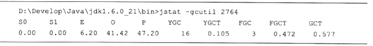
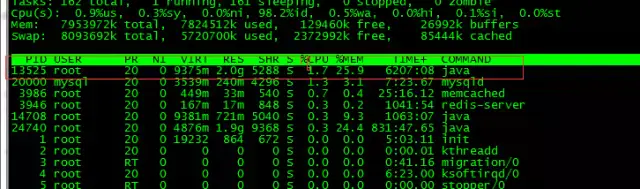
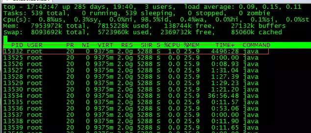
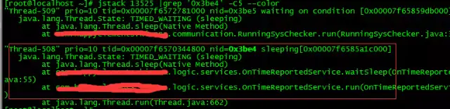
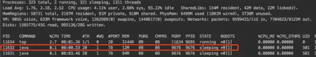
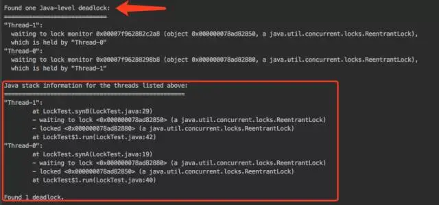
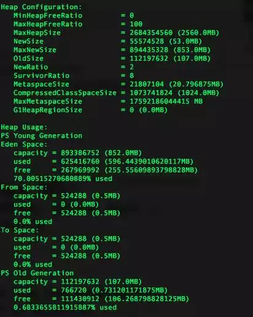
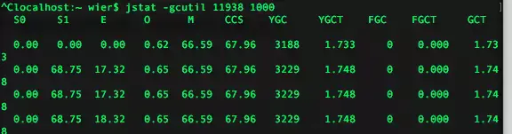
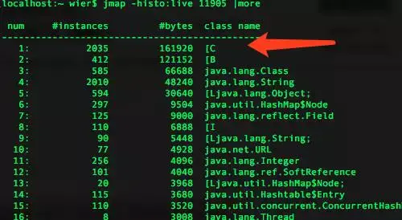

# 虚拟机性能监控工具

## 1 简介

给一个系统定位问题的时候，知识、经验是关键基础，数据是依据，工具是运用知识处理数据的手段。这里说的数据包括：运行日志、异常堆栈、`GC` 日志、线程快照、堆转储快照等。经常使用适当的虚拟机监控和分析工具可以加快我们分析数据、定位解决问题的速度。Sun 公司提供的 `JDK` 监控和故障处理工具如下：

- `jps`：`JVM Process Status Tool`，显式指定系统内所有的 `HotSpot` 虚拟机进程
- `jstat`：`JVM Statistics Monitoring Tool`，用于收集 `HotSpot` 虚拟机各方面的运行数据，比如内存、垃圾收集、类加载
- `jinfo`：`Configuration info for Java`，显示虚拟机的各种参数信息
- `jmap`：`Memory Map for Java`，生成虚拟机的内存转储快照（heapdump 文件）
- `jhat`：`JVM Heap Dump Browser`，用于分析 heapdump 文件，它会建立一个 `HTTP/HTML` 服务器，让用户可以在浏览器上查看分析结果
- `jstack`：用于显示虚拟机中各个线程的堆栈快照

## 2 JPS

`jps`（`JVM Process Status Tool`），它的功能与 ps 命令类似，可以列出正在运行的虚拟机进程，并显示虚拟机执行主类（`Main Class`，`main()` 函数所在的类）名称以及这些进程的本地虚拟机唯一 ID（`Local Virtual Machine Identifier`，`LVMID`），类似于 `ps -ef | grep java` 的功能。这小家伙虽然不大，功能又单一。但可以说基本你用其他命令都得先用它，来查询到 `LVMID` 来确定要监控的是哪个虚拟机进程。

命令格式：

```java {.line-numbers}
jps [ options ] [ hostid ]
```

- `options`：选项，参数，不同的参数可以输出需要的信息；
- `hostid`：远程查看；

选项列表：

- `-q`：只输出进程 id，忽略主类的内容；
- `-l`：输出主类全名，或者执行 JAR 包则输出路径；
- `-m`：输出虚拟机进程启动时传递给主类 `main()` 函数的参数；
- `-v`：输出虚拟机进程启动时的 JVM 参数；

### 2.1 jps -q

只列出进程 id：

```java {.line-numbers}
E:\itstack\git\github.com\interview>jps -q
104928
111552
26852
96276
59000
8460
76188
```

### 2.2 jps -l

输出当前运行类的全称

```java {.line-numbers}
E:\itstack\git\github.com\interview>jps -l
111552 org/netbeans/Main
26852
96276 org.jetbrains.jps.cmdline.Launcher
59000
62184 sun.tools.jps.Jps
8460 org/netbeans/Main
76188 sun.tools.jstatd.Jstatd
```

### 2.3 jps -m

列出传给 `main()` 函数的参数

```java {.line-numbers}
E:\itstack\git\github.com\interview>jps -m
111552 Main --branding visualvm --cachedir C:\Users\xiaofuge\AppData\Local\VisualVM\Cache/8u131 --openid 3041391569375200
26852
96276 Launcher C:/Program Files/JetBrains/IntelliJ IDEA 2019.3.1/plugins/java/lib/javac2.jar;C:/Program Files/JetBrains/IntelliJ IDEA 2019.3.1/plugins/java/lib/aether-api-1.1.0.jar;C:/Program Files/JetBrains/IntelliJ IDEA 2019.3.1/lib/jna-platform.jar;C:/Program Fi
les/JetBrains/IntelliJ IDEA 2019.3.1/lib/guava-27.1-jre.jar;C:/Program Files/JetBrains/IntelliJ IDEA 2019.3.1/lib/httpclient-4.5.10.jar;C:/Program Files/JetBrains/IntelliJ IDEA 2019.3.1/lib/forms-1.1-preview.jar;C:/Program Files/JetBrains/IntelliJ IDEA 2019.3.1/plu
gins/java/lib/aether-connector-basic-1.1.0.jar;C:/Program Files/JetBrains/IntelliJ IDEA 2019.3.1/plugins/java/lib/maven-model-builder-3.3.9.jar;C:/Program Files/JetBrains/IntelliJ IDEA 2019.3.1/lib/jps-model.jar;C:/Program Files/JetBrains/IntelliJ IDEA 2019.3.1/plu
gins/java/lib/maven-model-3.3.9.jar;C:/Program Files/JetBrains/IntelliJ IDEA 2019.3.1/plugins/java/lib/aether-impl-1.1.0.jar;C:/Program Files/JetBrains/IntelliJ IDEA 2019.3.1/lib/gson-2.8.5.jar;C:/Program File
59000
16844 Jps -m
8460 Main --branding visualvm --cachedir C:\Users\xiaofuge\AppData\Local\VisualVM\Cache/8u131 --openid 3041414336579200
76188 Jstatd
```

### 2.4 jps -v

输出虚拟机进程启动时 `JVM` 参数 `[-Xms24m -Xmx256m]`

```java {.line-numbers}
E:\itstack\git\github.com\interview>jps -v
111552 Main -Xms24m -Xmx256m -Dsun.jvmstat.perdata.syncWaitMs=10000 -Dsun.java2d.noddraw=true -Dsun.java2d.d3d=false -Dnetbeans.keyring.no.master=true -Dplugin.manager.install.global=false --add-exports=java.desktop/sun.awt=ALL-UNNAMED --add-exports=jdk.jvmstat/sun
.jvmstat.monitor.event=ALL-UNNAMED --add-exports=jdk.jvmstat/sun.jvmstat.monitor=ALL-UNNAMED --add-exports=java.desktop/sun.swing=ALL-UNNAMED --add-exports=jdk.attach/sun.tools.attach=ALL-UNNAMED --add-modules=java.activation -XX:+IgnoreUnrecognizedVMOptions -Djdk.
home=C:/Program Files/Java/jdk1.8.0_161 -Dnetbeans.home=C:\Program Files\Java\jdk1.8.0_161\lib\visualvm\platform -Dnetbeans.user=C:\Users\xiaofuge1\AppData\Roaming\VisualVM\8u131 -Dnetbeans.default_userdir_root=C:\Users\xiaofuge1\AppData\Roaming\VisualVM -XX:+H
eapDumpOnOutOfMemoryError -XX:HeapDumpPath=C:\Users\xiaofuge1\AppData\Roaming\VisualVM\8u131\var\log\heapdump.hprof -Dsun.awt.keepWorkingSetOnMinimize=true -Dnetbeans.dirs=C:\Program Files\Java\jdk1.8.0_161\lib\visualvm\visualvm;C:\Program
59000 -Dfile.encoding=UTF-8 -Xms128m -Xmx1024m -XX:MaxPermSize=256m
76188 Jstatd -Denv.class.path=.;C:\Program Files\Java\jre1.8.0_161\lib;C:\Program Files\Java\jre1.8.0_161\lib\tool.jar; -Dapplication.home=C:\Program Files\Java\jdk1.8.0_161 -Xms8m -Djava.security.policy=jstatd.all.policy
```

## 3 JINFO

`jinfo` 命令用来查看和调整 JVM 中的各项参数。使用 `jps` 命令的 `-v` 参数可以查看虚拟机启动时显式指定的参数列表，但如果想知道未被显式指定的参数的系统默认参数值，除了去找资料外，就只能使用 `jinfo` 的 `-flag` 选项进行查询了。`jinfo` 还可以使用 `-sysprops` 选项把虚拟机进程的 `System.getProperties` 内容打印出来。

命令格式：

```java {.line-numbers}
jinfo [ option ] pid
```

使用方式：

```java {.line-numbers}
E:\itstack\git\github.com\interview>jinfo -flag MetaspaceSize 111552
-XX:MetaspaceSize=21807104

E:\itstack\git\github.com\interview>jinfo -flag MaxMetaspaceSize 111552
-XX:MaxMetaspaceSize=18446744073709486080

E:\itstack\git\github.com\interview>jinfo -flag HeapDumpPath 111552
-XX:HeapDumpPath=C:\Users\xiaofuge\AppData\Roaming\VisualVM\8u131\var\log\heapdump.hprof
```

各种 `JVM` 参数你都可以去查询，这样更加方便地只把你要的显示出来。

## 4 JSTAT

`jstat`（`JVM Statistics Monitoring Tool`），用于监视虚拟机各种运行状态信息。它可以查看本地或者远程虚拟机进程中，类加载、内存、垃圾收集、即时编译等运行时数据。

`jstat` 的命令格式为：

```java {.line-numbers}
jstat [ option vmid [ interval [s|ms] [count] ] ]
```

对于命令格式中的 `VMID` 和 `LVMID` 需要特别说明一下：如果是本地虚拟机进程，`VMID` 和 `LVMID` 是一致的，如果是远程虚拟机进程，那么 `VMID` 的格式应当是：

```java {.line-numbers}
[protocol:][//]lvmid[@hostname[:port]/servername]
```

参数 `interval` 和 `count` 代表查询间隔和次数，如果省略这两个参数，说明只查询一次。假设需要每 250 毫秒查询一次进程 2764 垃圾收集状况，一共查询 20 次，那命令应当是：

```java {.line-numbers}
jstat -gc 2764 250 20
```

选项 `option` 代表着用户希望查询的虚拟机信息，主要分为 3 类：类装载、垃圾收集和运行期编译状况。最常用的就是 `-gcutil`，表示监视 Java 堆情况，包括 `Eden` 区、2 个 `Survivor` 区、老年代、永久代或者 `jdk1.8` 元空间等，容量、已用空间、垃圾收集时间合计等信息，不过输出的时候是已经使用空间占总空间的百分比。使用示例如下所示：

<div align="center">  </div>

查询结果表明：这台服务器的新生代 `Eden` 区（`E`，表示 `Eden`）使用了 6.2% 的空间，两个 Survivor 区（S0、S1，表示 Survivor0、Survivor1）里面都是空的，老年代（`O`，表示 `Old`）和永久代（`P`，表示 `Permanent`）则分别使用了 41.42% 和 47.20% 的空间，程序运行以来共发生 `Minor GC`（`YGC`，表示 `Young GC`）16 次，总耗时 0.105 秒，发生 `Full GC`（`FGC`，表示 `Full GC`）3 次，Full GC 总耗时（FGCT，表示 Full GC Time）为 0.472 秒，所有 GC 总耗时（`GCT`，表示 `GC Time`）为 0.577 秒。

## 5 JMAP

jmap（Memory Map for Java），用于生成堆转储快照（heapdump 文件）。jmap 的作用除了获取堆转储快照，还可以查询 finalize 执行队列、Java 堆和方法区的详细信息，如空间使用率，以及当前使用的是哪种收集器。

命令格式：

```java {.line-numbers}
jmap [ option ] pid
```

- `option`：选项参数
- `pid`：需要打印配置信息的进程 ID
- `executable`：产生核心 dump 的 Java 可执行文件
- `core`：需要打印配置信息的核心文件
- `server-id`：可选的唯一 id，如果相同的远程主机上运行了多台调试服务器，用此选项参数标识服务器
- `remote server IP or hostname`：远程调试服务器的 IP 地址或主机名

举例说明，`jmap -heap` 打印堆的详细信息：

```java {.line-numbers}
E:\itstack\git\github.com\interview>jmap -heap 111552
Attaching to process ID 111552, please wait...
Debugger attached successfully.
Server compiler detected.
JVM version is 25.161-b12

using thread-local object allocation.
Parallel GC with 8 thread(s)

Heap Configuration:
   MinHeapFreeRatio         = 0
   MaxHeapFreeRatio         = 100
   MaxHeapSize              = 268435456 (256.0MB)
   NewSize                  = 8388608 (8.0MB)
   MaxNewSize               = 89128960 (85.0MB)
   OldSize                  = 16777216 (16.0MB)
   NewRatio                 = 2
   SurvivorRatio            = 8
   MetaspaceSize            = 21807104 (20.796875MB)
   CompressedClassSpaceSize = 1073741824 (1024.0MB)
   MaxMetaspaceSize         = 17592186044415 MB
   G1HeapRegionSize         = 0 (0.0MB)
```

这里提另外一个工具，Sun `JDK` 提供了 `jhat`（`JVM Heap Analysis Tool`）命令与 `jmap` 搭配使用，来分析 `jmap` 生成的堆转储快照。`jhat` 内置了一个微型的 `HTTP/HTML` 服务器，生成 dump 文件的分析结果后，可以在浏览器中查看。不过实事求是地说，这个 `jhat` 很少被直接使用。

## 6 JSTACK

jstack（Stack Trace for Java），用于生成虚拟机当前时刻的线程快照（threaddump、javacore）。线程快照就是当前虚拟机内每一条线程正在执行的方法堆栈的集合，生成线程快照的目的通常是定位线程出现长时间停顿的原因，如：线程死锁、死循环、请求外部资源耗时较长导致挂起等。线程出现停顿时通过 `jstack` 来查看各个线程的调用堆栈，就可以获得没有响应的线程在搞什么鬼。

命令格式：

```java {.line-numbers}
jstack [ option ] vmid
```

- `F`：当正常输出的请求不被响应时，强制输出线程堆栈
- `l`：除了堆栈外，显示关于锁的附加信息
- `m`：如果调用的是本地方法的话，可以显示 c/c++ 的堆栈

```java {.line-numbers}
E:\itstack\git\github.com\interview>jstack 111552
2021-01-10 23:15:03
Full thread dump Java HotSpot(TM) 64-Bit Server VM (25.161-b12 mixed mode):

"Inactive RequestProcessor thread [Was:StdErr Flush/org.netbeans.core.startup.logging.PrintStreamLogger]" #59 daemon prio=1 os_prio=-2 tid=0x000000001983a800 nid=0x688 in Object.wait() [0x0000000017fbf000]
   java.lang.Thread.State: TIMED_WAITING (on object monitor)
        at java.lang.Object.wait(Native Method)
        at org.openide.util.RequestProcessor$Processor.run(RequestProcessor.java:1939)
        - locked <0x00000000fab31d88> (a java.lang.Object)
```

## 7 应用

### 7.1 CPU 飙升

在线上有时候某个时刻，可能会出现应用某个时刻突然 cpu 飙升的问题。对此我们应该熟悉一些指令，快速排查对应代码。

#### 1 找到最耗 CPU 的进程

```java {.line-numbers}
指令：top
```

<div align="center">  </div>

#### 2 找到该进程下最耗费 CPU 的线程

```java {.line-numbers}
指令：top -Hp pid
```

<div align="center">  </div>

#### 3 转换进制

```java {.line-numbers}
printf "%x\n" 15332 // 转换 16 进制（转换后为 0x3be4）
```

#### 4 过滤指定线程，打印堆栈信息

指令：

```java {.line-numbers}
jstack pid | grep 'threadPid' -C5 --color // pid 是进程的编号，而 threadPid 则是进程下的线程的编号
jstack 13525 | grep '0x3be4' -C5 --color // 打印进程堆栈，并通过线程 id，过滤得到线程堆栈信息。
```

<div align="center">  </div>

可以看到是一个上报程序，占用过多 cpu 了（以上例子只为示例，本身耗费 cpu 并不高）。

### 7.2 线程死锁

有时候部署场景会有线程死锁的问题发生，但又不常见。此时我们采用 `jstack` 查看一下。比如说我们现在已经有一个线程死锁的程序，导致某些操作 waiting 中。

#### 1 查找 java 的进程 id

```java {.line-numbers}
指令：top 或者 jps
```

<div align="center">  </div>

#### 2 查看 java 进程的线程快照信息

```java {.line-numbers}
指令：jstack -l pid
```

<div align="center">  </div>

从输出信息可以看到，有一个线程死锁发生，并且指出了那行代码出现的。如此可以快速排查问题。

### 7.3 OOM 内存泄漏

Java 堆内的 `OOM` 异常是实际应用中常见的内存溢出异常。一般我们都是先通过内存映射分析工具（比如 `MAT`）对 dump 出来的堆转存快照进行分析，确认内存中对象是否出现问题。当然了出现 `OOM` 的原因有很多，并非是堆中申请资源不足一种情况。还有可能是申请太多资源没有释放，或者是频繁申请，系统资源耗尽。针对这些情况需要一一排查。

`OOM` 的 2 种情况：

1. 申请资源（内存）过小，不够用
2. 申请资源太多，没有释放导致资源耗尽，比如申请过多的线程和内存等

#### 1 排查申请申请资源问题

```java {.line-numbers}
指令：jmap -heap 11869
```

查看新生代，老生代堆内存的分配大小以及使用情况，看是否本身分配过小。

<div align="center">  </div>

#### 2 排查 gc

特别是 `fgc` 情况下，各个分代内存情况。

```java {.line-numbers}
指令：jstat -gcutil 11938 1000 // 每秒输出一次 gc 的分代内存分配情况，以及 gc 时间
```

<div align="center">  </div>

查找最费内存的情况：

```java {.line-numbers}
指令：jmap -histo:live 11869 | more
```

<div align="center">  </div>

上述输出信息中，最大内存对象才 161kb，属于正常范围。如果某个对象占用空间很大，比如超过了 100Mb，应该着重分析，为何没有释放。
