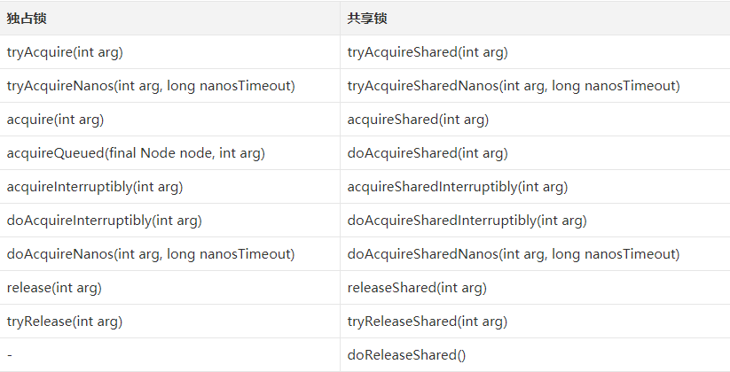

# AQS 源码分析之共享锁的获取和释放

## 1.前言

前面两篇我们以 ReentrantLock 为例了解了 AQS 独占锁的获取与释放，本篇我们来看看共享锁。由于 AQS 对于共享锁与独占锁的实现框架比较类似，因此如果你搞定了前面的独占锁模式，则共享锁也就很容易弄懂了。

## 2.共享锁与独占锁的区别

共享锁与独占锁最大的区别在于，独占锁是独占的，排他的，因此在独占锁中有一个 exclusiveOwnerThread 属性，用来记录当前持有锁的线程。**<font color="red">当独占锁已经被某个线程持有时，其他线程只能等待它被释放后，才能去争锁，并且同一时刻只有一个线程能争锁成功</font>**。而对于共享锁而言，由于锁是可以被共享的，因此它可以被多个线程同时持有。换句话说，如果一个线程成功获取了共享锁，那么其他等待在这个共享锁上的线程就也可以尝试去获取锁，并且极有可能获取成功。共享锁的实现和独占锁是对应的，我们可以从下面这张表中看出：

<div align="center">
    
</div>

可以看出，除了最后一个属于共享锁的 **`doReleaseShared()`** 方法没有对应外，其他的方法，独占锁和共享锁都是一一对应的。事实上，其实与 **`doReleaseShared()`** 对应的独占锁的方法应当是 **`unparkSuccessor(h)`**，只是 **`doReleaseShared()`** 逻辑不仅仅包含了 **`unparkSuccessor(h)`**，还包含了其他操作，这一点我们下面分析源码的时候再看。另外，尤其需要注意的是，**<font color="red">在独占锁模式中，我们只有在获取了独占锁的节点释放锁时，才会唤醒后继节点</font>**——这是合理的，因为独占锁只能被一个线程持有，如果它还没有被释放，就没有必要去唤醒它的后继节点。

然而，在共享锁模式下，当一个节点获取到了共享锁，我们在获取成功后就可以唤醒后继节点了，而不需要等到该节点释放锁的时候，**<font color="red">这是因为共享锁可以被多个线程同时持有，一个锁获取到了，则后继的节点都可以直接来获取</font>**。因此，在共享锁模式下，在获取锁和释放锁结束时，都会唤醒后继节点。 这一点也是 **`doReleaseShared()`** 方法与 **`unparkSuccessor(h)`** 方法无法直接对应的根本原因所在。

## 3.获取共享锁的实现

与获取独占锁的实现不同的关键在于，共享锁允许多个线程持有。如果需要使用 AQS 中共享锁，在实现 tryAcquireShared 方法时需要注意：

- 返回负数表示获取失败
- 返回 0 表示成功，但是后继争用线程不会成功
- 返回正数表示获取成功，并且后继争用线程也可能成功。

下面来看一下具体的代码实现：

```java{.line-numbers}
public final void acquireShared(int arg) {
    if (tryAcquireShared(arg) < 0)
        doAcquireShared(arg);
}

private void doAcquireShared(int arg) {
    final Node node = addWaiter(Node.SHARED);
    boolean failed = true;
    try {
        boolean interrupted = false;
        for (;;) {
            final Node p = node.predecessor();
            if (p == head) {
                int r = tryAcquireShared(arg);
                // 一旦共享获取成功，设置新的头结点，并且唤醒后继线程
                if (r >= 0) {
                    setHeadAndPropagate(node, r);
                    p.next = null; // help GC
                    if (interrupted)
                        selfInterrupt();
                    failed = false;
                    return;
                }
            }
            if (shouldParkAfterFailedAcquire(p, node) &&
                parkAndCheckInterrupt())
                interrupted = true;
        }
    } finally {
        if (failed)
            cancelAcquire(node);
    }
}

/**
 * 这个函数做的事情有两件:
 * 1. 在获取共享锁成功后，设置head节点
 * 2. 根据调用tryAcquireShared返回的状态(也就是propagate变量)以及节点本身的等待状态来判断是否要需要唤醒后继线程。
 */
private void setHeadAndPropagate(Node node, int propagate) {
    // 把当前的head封闭在方法栈上，用以下面的条件检查。
    Node h = head;
    setHead(node);
    /*
     * propagate是tryAcquireShared的返回值，这是决定是否传播唤醒的依据之一。
     * h.waitStatus为SIGNAL或者PROPAGATE时也根据node的下一个节点共享来决定是否传播唤醒，
     * 这里为什么不能只用propagate > 0来决定是否可以传播在本文下面的思考问题中有相关讲述。
     */
    if (propagate > 0 || h == null || h.waitStatus < 0 ||
        (h = head) == null || h.waitStatus < 0) {
        Node s = node.next;
        if (s == null || s.isShared())
            doReleaseShared();
    }
}

/**
 * 这是共享锁中的核心唤醒函数，主要做的事情就是唤醒下一个线程或者设置传播状态。
 * 后继线程被唤醒后，会尝试获取共享锁，如果成功之后，则又会调用setHeadAndPropagate,将唤醒传播下去。
 * 这个函数的作用是保障在acquire和release存在竞争的情况下，保证队列中处于等待状态的节点能够有办法被唤醒。
 */
private void doReleaseShared() {
    /*
     * 以下的循环做的事情就是，在队列存在后继线程的情况下，唤醒后继线程；
     * 或者由于多线程同时释放共享锁由于处在中间过程，读到head节点等待状态为0的情况下，
     * 虽然不能unparkSuccessor，但为了保证唤醒能够正确稳固传递下去，设置节点状态为PROPAGATE。
     * 这样的话获取锁的线程在执行setHeadAndPropagate时可以读到PROPAGATE，从而由获取锁的线程去释放后继等待线程。
     */
    for (;;) {
        Node h = head;
        // 如果队列中存在后继线程。
        if (h != null && h != tail) {
            int ws = h.waitStatus;
            if (ws == Node.SIGNAL) {
                if (!compareAndSetWaitStatus(h, Node.SIGNAL, 0))
                    continue;
                unparkSuccessor(h);
            }
            // 如果h节点的状态为0，需要设置为PROPAGATE用以保证唤醒的传播。
            else if (ws == 0 &&
                     !compareAndSetWaitStatus(h, 0, Node.PROPAGATE))
                continue;
        }
        // 检查h是否仍然是head，如果不是的话需要再进行循环。
        if (h == head)
            break;
    }
} 
```

## 4.释放共享锁的实现

释放共享锁与获取共享锁的代码共享了 doReleaseShared，用于实现唤醒的传播。

```java{.line-numbers}
public final boolean releaseShared(int arg) {
    if (tryReleaseShared(arg)) {
        // doReleaseShared 的实现上面获取共享锁已经介绍
        doReleaseShared();
        return true;
    }
    return false;
}
```

从中，我们可以看出，共享锁的获取和释放都会涉及到 doReleaseShared，也就是后继线程的唤醒。关于 PROPAGATE 状态的必要性，后文会作进一步介绍。

## 5.PROPAGATE 状态存在的意义

在 **`setHeadAndPropagate`** 中我们可以看到如下的一段代码:

```java{.line-numbers}
if (propagate > 0 || h == null || h.waitStatus < 0 ||
    (h = head) == null || h.waitStatus < 0) {
    Node s = node.next;
    if (s == null || s.isShared())
       doReleaseShared();
} 
```

为什么不只是用 propagate > 0 来判断呢? **<font color="red">我们知道目前 AQS 代码中设置 `Node.PROPAGATE` 状态就是为了此处可以读取到 `h.waitStatus < 0`（`PROPAGATE` 值为 -3）</font>**。如果这里可以只用 propagate > 0 来判断，是否 PROPAGATE 状态都没有存在的必要了？在 Doug Lea 的 JSR 166 repository 上，我找到了 PROPAGATE 最早被引入的那一版。可以看到 Revision1.73 中，PROPAGATE 状态被引入用以修复 bug 6801020, 让我们来看看这个 bug：

```java{.line-numbers}
import java.util.concurrent.Semaphore;

public class TestSemaphore {

   private static Semaphore sem = new Semaphore(0);

   private static class Thread1 extends Thread {
       @Override
       public void run() {
           sem.acquireUninterruptibly();
       }
   }

   private static class Thread2 extends Thread {
       @Override
       public void run() {
           sem.release();
       }
   }

   public static void main(String[] args) throws InterruptedException {
       for (int i = 0; i < 10000000; i++) {
           Thread t1 = new Thread1();
           Thread t2 = new Thread1();
           Thread t3 = new Thread2();
           Thread t4 = new Thread2();
           t1.start();
           t2.start();
           t3.start();
           t4.start();
           t1.join();
           t2.join();
           t3.join();
           t4.join();
           System.out.println(i);
       }
   }
} 
```

很显然，这段程序一定能执行结束的，但是会偶现线程 hang 住的问题。当时的 AQS 中 **`setHeadAndPropagate`** 是这样的：

<div align="center">
    
</div>

以上是 bug 6801020 修复点的对比，左边为修复之前的版本，右边为引入 **`PROPAGATE`** 修复之后的版本。从左边可以看到原先的 **`setHeadAndPropagate`** 相比目前版本要简单很多，**<font color="red">而 `releaseShared` 的实现也与 release 基本雷同</font>**：

```java{.line-numbers}
public final boolean releaseShared(int arg) {
    if (tryReleaseShared(arg)) {
        Node h = head;
        if (h != null && h.waitStatus != 0)
            unparkSuccessor(h);
        return true;
    }
    return false;
} 
```

这也正是本问题的核心：为什么仅仅用调用的 tryAcquireShared 得到的返回值来判断是否需要唤醒不行呢？让我们来分析一下上面的程序：

上面的程序循环中做的事情就是放出 4 个线程，其中 2 个线程用于获取信号量，另外 2 个用于释放信号量。每次循环主线程会等待所有子线程执行完毕。出现 bug 也就是线程 hang 住的问题就在于两个获取信号量的线程有一个会没办法被唤醒，队列就死掉了。

在 AQS 的共享锁中，一个被 park 的线程，不考虑线程中断和前驱节点取消的情况，有两种情况可以被 unpark：一种是其他线程释放信号量，调用 unparkSuccessor；另一种是其他线程获取共享锁时通过传播机制来唤醒后继节点。我们假设某次循环中队列里排队的节点为情况为：**<font color="red">`head -> t1` 的 `node -> t2` 的 node (也就是 tail)</font>**

信号量释放的顺序为 t3 先释放，t4 后释放：

- 时刻 1: t3 调用 releaseShared，调用了 **`unparkSuccessor(h)`**，head 的等待状态从-1 变为 0
- 时刻 2: t1 由于 t3 释放了信号量，被 t3 唤醒，调用 **`Semaphore.NonfairSync`** 的 tryAcquireShared，返回值为 0
- 时刻 3: t4 调用 releaseShared，读到此时 **`h.waitStatus`** 为 0( 此时读到的 head 和时刻 1 中为同一个 head)，不满足条件，因此不会调用 **`unparkSuccessor(h)`**
- 时刻 4: t1 获取信号量成功，调用 **`setHeadAndPropagate`** 时，因为不满足 propagate > 0（时刻 2 的返回值也就是 propagate==0），从而不会唤醒后继节点

这就好比是一个精巧的多米诺骨牌最终由于设计的失误导致动力无法传递下去，至此 AQS 中的同步队列宣告死亡。那么引入 PROPAGATE 是怎么解决问题的呢？引入之后，调用 releaseShared 方法不再简单粗暴地直接 unparkSuccessor，而是将传播行为抽了一个 doReleaseShared 方法出来。

再看上面的那种情况：

- 时刻 1：t3 调用 **`releaseShared -> doReleaseShared -> unparkSuccessor`**，完了之后 head 的等待状态为 0
- 时刻 2：t1 由于 t3 释放了信号量，被 t3 唤醒，调用 **`Semaphore.NonfairSync`** 的 tryAcquireShared，返回值为 0
- 时刻 3：t4 调用 releaseShared, 读到此时 **`h.waitStatus`** 为 0 (此时读到的 head 和时刻 1 中为同一个 head)，将等待状态置为 PROPAGATE
- 时刻 4：t1 获取信号量成功，调用 setHeadAndPropagate 时，可以读到 **`h.waitStatus < 0`**，从而可以接下来调用 doReleaseShared 唤醒 t2

也就是说，上面会产生线程 hang 住 bug 的 case 在引入 PROPAGATE 后可以被规避掉。**<font color="red">在 `PROPAGATE` 引入之前，之所以可能会出现线程 hang 住的情况，就是在于 `releaseShared` 有竞争的情况下，可能会有队列中处于等待状态的节点因为 t3 线程运行完成释放而被唤醒，比如 t1，t1 被唤醒后获取到锁，但如果此时还没调用 `setHead` 设置好 head，又有新线程释放锁，这里是 t4，但是 t4 读到老的 head 状态为 0 导致 t4 只是释放但不唤醒它的后续节点。最终后一个等待线程 t2 既没有被释放线程 (t4) 唤醒，也没有被持锁线程 (t1) 唤醒</font>**。

所以，仅仅靠 **`tryAcquireShared`** 的返回值来决定是否要将唤醒传递下去是不充分的。

## 6.总结

- 共享锁的调用框架和独占锁很相似，它们最大的不同在于获取锁的逻辑——共享锁可以被多个线程同时持有，而独占锁同一时刻只能被一个线程持有。
- 由于共享锁同一时刻可以被多个线程持有，**<font color="red">因此当头节点获取到共享锁时，可以立即唤醒后继节点来争锁，而不必等到释放锁的时候</font>**。因此，共享锁触发唤醒后继节点的行为可能有两处，一处在当前节点成功获得共享锁后，一处在当前节点释放共享锁后。

获取共享锁的流程是：首先调用 **`tryAcquireShared`** 方法尝试去获取锁，如果返回的值大于等于 0，表示获取成功，接下来直接返回。否则的话，就调用 **`doAcquireShared`**，首先将等待的线程包装成一个 Node，放入到同步队列中，接着和独占锁一样，不断自旋来尝试获取锁。如果此 Node 节点的前驱节点为 head，并且获取共享锁成功，就会设置此 Node 为新的 head 结点，并且尝试唤醒此 Node 的后续节点。如果没有获取共享锁成功，则同样将此 Node 之前的节点设置为 SIGNAL，然后阻塞，直到发生中断或者被唤醒。