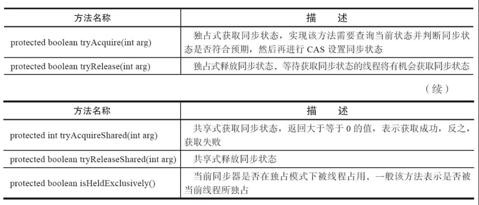
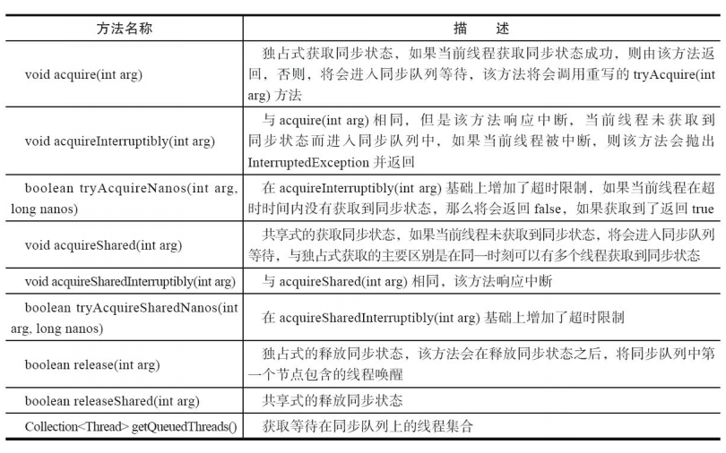
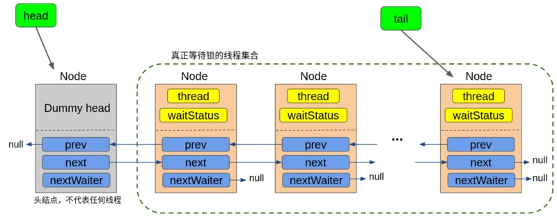
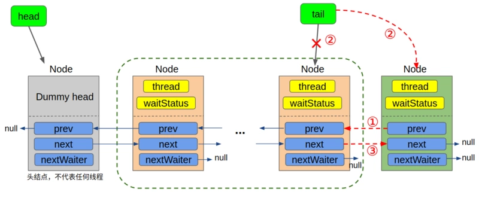
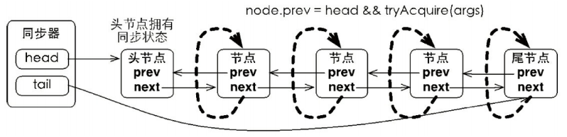
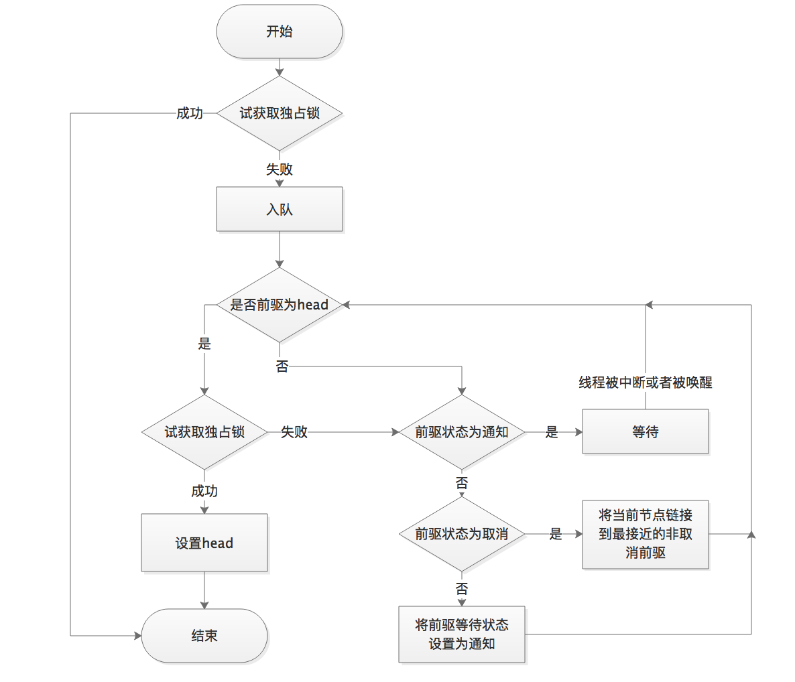

# AQS 源码解析之独占锁的获取

## 1.前言

### 1.1 队列同步器简介

队列同步器 AbstractQueuedSynchronizer（以下简称同步器），是用来构建锁或者其他同步组件的基础框架，它使用了一个 int 成员变量表示同步状态，通过内置的 FIFO 队列来完成资源获取线程的排队工作，并发包的作者（Doug Lea）期望它能够成为实现大部分同步需求的基础。

同步器的主要使用方式是继承，子类通过继承同步器并实现它的抽象方法来管理同步状态，在抽象方法的实现过程中免不了要对同步状态进行更改，这时就需要使用同步器提供的 3 个方法（**`getState()`**、**`setState(int newState)`** 和 **`compareAndSetState(int expect,int update)`**）来进行操作，因为它们能够保证状态的改变是安全的。

子类推荐被定义为自定义同步组件的静态内部类，同步器自身没有实现任何同步接口，它仅仅是定义了若干同步状态获取和释放的方法来供自定义同步组件使用，同步器既可以支持独占式地获取同步状态，也可以支持共享式地获取同步状态，这样就可以方便实现不同类型的同步组件（ReentrantLock、ReentrantReadWriteLock 和 CountDownLatch 等）。

同步器是实现锁（也可以是任意同步组件）的关键，在锁的实现中聚合同步器，利用同步器实现锁的语义。可以这样理解二者之间的关系：锁是面向使用者的，它定义了使用者与锁交互的接口（比如可以允许两个线程并行访问），隐藏了实现细节；同步器面向的是锁的实现者，它简化了锁的实现方式，屏蔽了同步状态管理、线程的排队、等待与唤醒等底层操作。锁和同步器很好地隔离了使用者和实现者所需关注的领域。

### 1.2 队列同步器的接口与示例

同步器的设计是基于模板方法模式的，也就是说，使用者需要继承同步器并重写指定的方法，随后将同步器组合在自定义同步组件的实现中，并调用同步器提供的模板方法，而这些模板方法将会调用使用者重写的方法。重写同步器指定的方法时，需要使用同步器提供的如下 3 个方法来访问或修改同步状态。

- **`getState()`**：获取当前同步状态。
- **`setState(int newState)`**：设置当前同步状态。
- **`compareAndSetState(int expect,int update)`**：使用 CAS 设置当前状态，该方法能够保证状态设置的原子性。

同步器 AQS 可重写的方法如下：

<div align="center">
    
</div>

实现自定义同步组件时，将会调用同步器提供的模板方法，这些（部分）模板方法与描述如下所示：

<div align="center">
    
</div>

同步器提供的模板方法基本上分为3类：独占式获取与释放同步状态、共享式获取与释放同步状态和查询同步队列中的等待线程情况。自定义同步组件将使用同步器提供的模板方法来实现自己的同步语义。只有掌握了同步器的工作原理才能更加深入地理解并发包中其他的并发组件，所以下面通过一个独占锁的示例来深入了解一下同步器的工作原理。

### 1.3 同步器使用实例

只有掌握了同步器的工作原理才能更加深入地理解并发包中其他的并发组件，所以下面通过一个独占锁的示例来深入了解一下同步器的工作原理。顾名思义，独占锁就是在同一时刻只能有一个线程获取到锁，而其他获取锁的线程只能处于同步队列中等待，只有获取锁的线程释放了锁，后继的线程才能够获取锁。

```java{.line-numbers}
class Mutex implements Lock {
    // 静态内部类，自定义同步器
    private static class Sync extends AbstractQueuedSynchronizer {
        // 是否处于占用状态
        protected boolean isHeldExclusively() {
            return getState() == 1;
        }
        // 当状态为0的时候获取锁
        public boolean tryAcquire(int acquires) {
            if (compareAndSetState(0, 1)) {
                setExclusiveOwnerThread(Thread.currentThread());
                return true;
            }
            return false;
        }
        // 释放锁，将状态设置为0
        protected boolean tryRelease(int releases) {
            if (getState() == 0) throw new
                    IllegalMonitorStateException();
            setExclusiveOwnerThread(null);
            setState(0);
            return true;
        }
        // 返回一个Condition，每个condition都包含了一个condition队列
        Condition newCondition() { return new ConditionObject(); }
    }
    // 仅需要将操作代理到Sync上即可
    private final Sync sync = new Sync();
    public void lock() { sync.acquire(1); }
    public boolean tryLock() { return sync.tryAcquire(1); }
    public void unlock() { sync.release(1); }
    public Condition newCondition() { return sync.newCondition(); }
    public boolean isLocked() { return sync.isHeldExclusively(); }
    public boolean hasQueuedThreads() { return sync.hasQueuedThreads(); }
    public void lockInterruptibly() throws InterruptedException {
        sync.acquireInterruptibly(1);
    }
    public boolean tryLock(long timeout, TimeUnit unit) throws InterruptedException {
        return sync.tryAcquireNanos(1, unit.toNanos(timeout));
    }
} 
```

上述示例中，独占锁 Mutex 是一个自定义同步组件，它在同一时刻只允许一个线程占有锁。Mutex 中定义了一个静态内部类，该内部类继承了同步器并实现了独占式获取和释放同步状态。在 **`tryAcquire(int acquires)`** 方法中，如果经过 CAS 设置成功（同步状态设置为 1），则代表获取了同步状态，而在 **`tryRelease(int releases)`** 方法中只是将同步状态重置为 0。用户使用 Mutex 时并不会直接和内部同步器的实现打交道，而是调用 Mutex 提供的方法，在 Mutex 的实现中，以获取锁的 **`lock()`** 方法为例，只需要在方法实现中调用同步器的模板方法 **`acquire(int args)`** 即可，当前线程调用该方法获取同步状态失败后会被加入到同步队列中等待，这样就大大降低了实现一个可靠自定义同步组件的门槛。

## 2.Java 并发工具类的三板斧

在开始看 AQS 源码之前，我们先来了解以下java并发工具的设计套路，我把它总结成三板斧：状态，队列，CAS:

- 状态：一般是一个 state 属性，它基本是整个工具的核心，通常整个工具都是在设置和修改状态，很多方法的操作都依赖于当前状态是什么。由于状态是全局共享的，一般会被设置成 volatile 类型，以保证其修改的可见性；
- 队列：队列通常是一个等待的集合，大多数以链表的形式实现。队列采用的是悲观锁的思想，表示当前所等待的资源，状态或者条件短时间内可能无法满足。因此，它会将当前线程包装成某种类型的数据结构，扔到一个等待队列中，当一定条件满足后，再从等待队列中取出。
- CAS：CAS 操作是最轻量的并发处理，通常我们对于状态的修改都会用到 CAS 操作，因为状态可能被多个线程同时修改，CAS 操作保证了同一个时刻，只有一个线程能修改成功，从而保证了线程安全，CAS 操作基本是由 Unsafe 工具类的 **`compareAndSwapXXX`** 来实现的；**<font color="red">CAS 采用的是乐观锁的思想，因此常常伴随着自旋，如果发现当前无法成功地执行 CAS，则不断重试，直到成功为止，自旋的的表现形式通常是一个死循环 for(;;)</font>**。

## 3.AQS 核心实现

上面我们已经总结了 java 并发编程的套路，下面我们就以这个套路为切入点来分析 AQS 的实现。

### 3.1 状态

首先是找状态。在 AQS 中，状态是由 state 属性来表示的，不出所料，它是 volatile 类型的：

```java{.line-numbers}
private volatile int state;
```

该属性的值即表示了锁的状态，state 为 0 表示锁没有被占用，state 大于 0 表示当前已经有线程持有该锁，**<font color="red">这里之所以说大于 0 而不说等于 1 是因为可能存在可重入的情况。你可以把 state 变量当做是当前持有该锁的线程数量</font>**。由于本篇我们分析的是独占锁，同一时刻，锁只能被一个线程所持有。通过 state 变量是否为0，我们可以分辨当前锁是否被占用，但光知道锁是不是被占用是不够的，我们并不知道占用锁的线程是哪一个。在 AQS 中，我们将通过 **`exclusiveOwnerThread`** 属性，**`exclusiveOwnerThread`** 属性的值即为当前持有锁的线程。

```java{.line-numbers}
private transient Thread exclusiveOwnerThread; // 继承 自AbstractOwnableSynchronizer
```

### 3.2 队列

接着我们来看队列，AQS 中，队列的实现是一个双向链表，被称为 sync queue，它表示所有等待锁的线程的集合。我们前面说过，在并发编程中使用队列通常是将当前线程包装成某种类型的数据结构扔到同步队列中，我们先来看看队列中的每一个节点是怎么个结构，Node 的属性只有 4 类：

```java{.line-numbers}
// 节点所代表的线程
volatile Thread thread;

// 双向链表，每个节点需要保存自己的前驱节点和后继节点的引用
volatile Node prev;
volatile Node next;

// 线程所处的等待锁的状态，初始化时，该值为0
volatile int waitStatus;
static final int CANCELLED =  1;
static final int SIGNAL    = -1;
static final int CONDITION = -2;
static final int PROPAGATE = -3;

// 该属性用于条件队列或者共享锁
Node nextWaiter
```

注意，在这个 Node 类中也有一个状态变量 waitStatus，它表示了当前 Node 所代表的线程的等待锁的状态，**<font color="red">在独占锁模式下，我们只需要关注 CANCELLED SIGNAL 两种状态即可。这里还有一个 nextWaiter 属性，它在独占锁模式下永远为 null，仅仅起到一个标记作用</font>**，没有实际意义。说完队列中的节点，我们接着说回这个 sync queue，AQS 是怎么使用这个队列的呢，既然是双向链表，操纵它自然只需要一个头结点和一个尾节点：

```java{.line-numbers}
// 头结点，不代表任何线程，是一个哑结点
private transient volatile Node head;

// 尾节点，每一个请求锁的线程会加到队尾
private transient volatile Node tail
```

到这里，我们就了解到了这个 sync queue 的全貌：

<div align="center">
    
</div>

不过这里有一点我们提前说一下，在 AQS 中的队列是一个 CLH 队列，**<font color="red">它的 head 节点永远是一个哑结点（dummy node）, 它不代表任何线程（某些情况下可以看做是代表了当前持有锁的线程），因此 head 所指向的 Node 的 thread 属性永远是 null。只有从次头节点往后的所有节点才代表了所有等待锁的线程</font>**。也就是说，在当前线程没有抢到锁被包装成 Node 扔到队列中时，即使队列是空的，它也会排在第二个，我们会在它的前面新建一个 dummy 节点( 具体的代码我们在后面分析源码时再详细讲)。为了便于描述，下文中我们把除去 head 节点的队列称作是同步队列，在这个队列中的节点才代表了所有等待锁的线程：

在继续往下之前我们再对着上图总结一下 Node 节点各个参数的含义：

- **`thread`**：表示当前 Node 所代表的线程；
- **`waitStatus`**：**<font color="red">表示节点所处的等待状态，独占锁模式下只需关注三种状态：`SIGNAL CANCELLED` 初始态(0)</font>**；
- **`prev next`**：节点的前驱和后继；
- **`nextWaiter`**：进作为标记，值永远为 null，表示当前处于独占锁模式；

## 4.CAS 操作

前面我们提到过，CAS 操作大对数是用来改变状态的，在 AQS 中也不例外。我们一般在静态代码块中初始化需要 CAS 操作的属性的偏移量：

```java{.line-numbers}
private static final Unsafe unsafe = Unsafe.getUnsafe();
    private static final long stateOffset;
    private static final long headOffset;
    private static final long tailOffset;
    private static final long waitStatusOffset;
    private static final long nextOffset;

    static {
        try {
            stateOffset = unsafe.objectFieldOffset
                (AbstractQueuedSynchronizer.class.getDeclaredField("state"));
            headOffset = unsafe.objectFieldOffset
                (AbstractQueuedSynchronizer.class.getDeclaredField("head"));
            tailOffset = unsafe.objectFieldOffset
                (AbstractQueuedSynchronizer.class.getDeclaredField("tail"));
            waitStatusOffset = unsafe.objectFieldOffset
                (Node.class.getDeclaredField("waitStatus"));
            nextOffset = unsafe.objectFieldOffset
                (Node.class.getDeclaredField("next"));

        } catch (Exception ex) { throw new Error(ex); }
    } 
```

从这个静态代码块中我们也可以看出，CAS 操作主要针对 5 个属性，包括 AQS 的3个属性 state,head 和 tail, 以及 Node 对象的两个属性 waitStatus 和 next。**<font color="red">说明这 5 个属性基本是会被多个线程同时访问的</font>**。

## 5.AQS 核心属性

前面我们以 java 并发编程工具类的“三板斧”为切入点分析了 AQS 的状态，队列和 CAS 操作，对这个工具类有了初步的认识。接下来，我们就要开始进入源码分析了。在进入正式的分析之前，我们先来总结下 AQS 核心属性：

**（1）锁相关的属性有两个：**

```java{.line-numbers}
private volatile int state; // 锁的状态
private transient Thread exclusiveOwnerThread;  // 当前持有锁的线程，注意这个属性是从AbstractOwnableSynchronizer继承而来 
```

**（2）sync queue 相关的属性有两个：**

```java{.line-numbers}
private transient volatile Node head; // 队头，为dummy node
private transient volatile Node tail; // 队尾，新入队的节 
```

**（3）队列中的 Node 中需要关注的属性有三组：**

```java{.line-numbers}
// 节点所代表的线程
volatile Thread thread;

// 双向链表，每个节点需要保存自己的前驱节点和后继节点的引用
volatile Node prev;
volatile Node next;
 
// 线程所处的等待锁的状态，初始化时，该值为0
volatile int waitStatus;
static final int CANCELLED = 1;
static final int SIGNAL = -1 
```

## 6.Example: FairSync in ReentrantLock

同步器的主要使用方式是继承，子类通过继承同步器并实现它的抽象方法来管理同步状态，在抽象方法的实现过程中免不了要对同步状态进行更改，这时就需要使用同步器提供的 3 个方法（**`getState()`**、**`setState(int newState)`** 和 **`compareAndSetState(int expect,int update)`**）来进行操作，因为它们能够保证对状态的改变是安全的。

同步器（AQS）子类推荐被定义为自定义同步组件的静态内部类，同步器自身没有实现任何同步接口，它仅仅是定义了若干同步状态获取和释放的方法来供自定义同步组件使用，同步器既可以支持独占式地获取同步状态，也可以支持共享式地获取同步状态，这样就可以方便实现不同类型的同步组件（ReentrantLock、ReentrantReadWriteLock 和 CountDownLatch 等）。

**<font color="red">前面已经提到, AQS大多数情况下都是通过继承来使用的, 子类通过覆写 tryAcquire 来实现自己的获取锁的逻辑</font>**。

### 6.1 Acquire

acquire 定义在AQS类中，描述了获取锁的流程:

```java{.line-numbers}
public final void acquire(int arg) {
    if (!tryAcquire(arg) && acquireQueued(addWaiter(Node.EXCLUSIVE), arg))
        selfInterrupt();
}
```

可以看出, 该方法中涉及了四个方法的调用:

- **`tryAcquire(arg)`**：该方法由继承 AQS 的子类实现, 为获取锁的具体逻辑。
- **`addWaiter(Node mode)`**：该方法由 AQS 实现, 负责在获取锁失败后调用, 将当前请求锁的线程包装成 Node 添加到同步队列的尾部，并返回这个 Node。
- **`acquireQueued(final Node node, int arg)`**：该方法由 AQS 实现,这个方法比较复杂, 主要对上面刚加入队列的 Node 不断尝试以下两种操作之一:
    - 在前驱节点就是 head 节点的时候，继续尝试获取锁；
    - 将当前线程挂起，使 CPU 不再调度它；
- **`selfInterrupt()`**：该方法由 AQS 实现, 用于中断当前线程。由于在整个抢锁过程中，我们都是不响应中断的。那如果在抢锁的过程中发生了中断怎么办呢，总不能假装没看见呀。**<font color="red">AQS 的做法简单的记录有没有有发生过中断，如果返回的时候发现曾经发生过中断，则在退出 acquire 方法之前，就调用 selfInterrupt 自我中断一下</font>**，就好像将这个发生在抢锁过程中的中断“推迟”到抢锁结束以后再发生一样。

从上面的简单介绍中可以看出，除了获取锁的逻辑 **`tryAcquire(arg)`** 由子类实现外, 其余方法均由 AQS 实现。其中，selfInterrupt 方法的代码如下：

```java{.line-numbers}
static void selfInterrupt() {
     Thread.currentThread().interrupt();
} 
```

### 6.2 tryAcquire

tryAcquire 获取锁的逻辑其实很简单——判断当前锁有没有被占用：

1. 如果锁没有被占用, 尝试以公平的方式获取锁；
2. 如果锁已经被占用, 检查是不是锁重入；

获取锁成功返回 true, 失败则返回 false，下面是 ReentrantLock 的 tryAcquire 方法源代码：

```java{.line-numbers}
protected final boolean tryAcquire(int acquires) {
      final Thread current = Thread.currentThread();
      // 首先获取当前锁的状态
      int c = getState();

      // c=0 说明当前锁是avaiable的, 没有被任何线程占用, 可以尝试获取
      // 因为是实现公平锁, 所以在抢占之前首先看看队列中有没有排在自己前面的Node
      // 如果没有人在排队, 则通过CAS方式获取锁, 就可以直接退出了
      if (c == 0) {
            if (!hasQueuedPredecessors()
            /* 为了阅读方便, hasQueuedPredecessors源码就直接贴在这里了, 这个方法的本质实际上是检测自己是不是head节点的后继节点，
             * 即处在阻塞队列第一位的节点
             * public final boolean hasQueuedPredecessors() {
             *     Node t = tail;
             *     Node h = head;
             *     Node s;
             *     return h != t && ((s = h.next) == null || s.thread != Thread.currentThread());
             * }
            */
            && compareAndSetState(0, acquires)) {
                setExclusiveOwnerThread(current); // 将当前线程设置为占用锁的线程
                return true;
            }
      }

      // 如果 c>0 说明锁已经被占用了
      // 对于可重入锁, 这个时候检查占用锁的线程是不是就是当前线程,是的话,说明已经拿到了锁, 直接重入就行
      else if (current == getExclusiveOwnerThread()) {
            int nextc = c + acquires;
            if (nextc < 0)
                    throw new Error("Maximum lock count exceeded");
            setState(nextc);
            /* setState方法如下：
             * protected final void setState(int newState) {
             *      state = newState;
             * }
             */
            return true;
      }

      // 到这里说明有人占用了锁, 并且占用锁的不是当前线程, 则获取锁失败
      return false;
}
```

从这里可以看出，获取锁其实主要就是干一件事：将 state 的状态通过 CAS 操作由 0 改写成 1。由于是 CAS 操作，必然是只有一个线程能执行成功。则执行成功的线程即获取了锁，在这之后，才有权利将 **`exclusiveOwnerThread`** 的值设成自己。另外对于可重入锁，如果当前线程已经是获取了锁的线程了，它还要注意增加锁的重入次数。

值得一提的是，这里修改 state 状态的操作，一个用了 CAS 方法 compareAndSetState，一个用了普通的 setState 方法。这是因为用 CAS 操作时，当前线程还没有获得锁，所以可能存在多线程同时在竞争锁的情况；**<font color="red">而调用 setState 方法时，是在当前线程已经是持有锁的情况下，因此对 state 的修改是安全的，只需要普通的方法就可以了</font>**。

### 6.3 addWaiter

如果执行到此方法, 说明前面尝试获取锁的 tryAcquire 已经失败了, 既然获取锁已经失败了, 就要将当前线程包装成 Node，加到等待锁的队列中去, 因为是 FIFO 队列, 所以自然是直接加在队尾。方法调用为：

```java{.line-numbers}
addWaiter(Node.EXCLUSIVE)

private Node addWaiter(Node mode) {
        // 将当前线程包装成 Node
        Node node = new Node(Thread.currentThread(), mode);
        // 这里我们用注释的形式把 Node 的构造函数贴出来
        // 因为传入的 mode 值为 Node.EXCLUSIVE，所以节点的 nextWaiter 属性被设为 null
        /*
         * static final Node EXCLUSIVE = null;
         *
         * Node(Thread thread, Node mode) {     // Used by addWaiter
         *      this.nextWaiter = mode;
         *      this.thread = thread;
         * }
         */
        Node pred = tail;
        // 如果队列不为空, 则用 CAS 方式将当前节点设为尾节点
        if (pred != null) {
                node.prev = pred;
                if (compareAndSetTail(pred, node)) {
                        pred.next = node;
                        return node;
                }
        }

        // 代码会执行到这里, 只有两种情况:
        //    1. 队列为空
        //    2. CAS 失败
        // 注意, 这里是并发条件下, 所以什么都有可能发生, 尤其注意 CAS 失败后也会来到这里
        enq(node); //将节点插入队列
        return node;
}
```

可见，每一个处于独占锁模式下的节点，它的 nextWaiter 一定是 null。**<font color="red">在这个方法中，我们首先会尝试直接入队（失败则会调用后面的 enq 方法）</font>**，但是因为目前是在并发条件下，所以有可能同一时刻，有多个线程都在尝试入队，导致 compareAndSetTail(pred, node) 操作失败——因为有可能其他线程已经成为了新的尾节点，导致尾节点不再是我们之前看到的那个 pred 了。如果入队失败了，接下来我们就需要调用 enq(node) 方法，**<font color="red">在该方法中我们将通过自旋 + CAS 的方式，一定确保当前节点入队</font>**。

### 6.4 Enq

能执行到这个方法，说明当前线程获取锁已经失败了，我们已经把它包装成一个 Node，准备把它扔到等待队列中去，但是在这一步又失败了。这个失败的原因可能是以下两种之一：

1. 等待队列现在是空的，没有线程在等待。
2. 其他线程在当前线程入队的过程中率先完成了入队，导致尾节点的值已经改变了，CAS 操作失败

在该方法中, **<font color="red">我们使用了死循环，即以自旋方式将节点插入队列，如果失败则不停的尝试，直到成功为止</font>**，另外，该方法也负责在队列为空时，初始化队列，这也说明，队列是延时初始化的 (lazily initialized)：

```java{.line-numbers}
private Node enq(final Node node) {
    for (;;) {
        Node t = tail;
        // 如果是空队列, 首先进行初始化
        // 这里也可以看出, 队列不是在构造的时候初始化的, 而是延迟到需要用的时候再初始化, 以提升性能
        if (t == null) { 
            // 注意，初始化时使用new Node()方法新建了一个dummy节点
            if (compareAndSetHead(new Node()))
                    tail = head; // 这里仅仅是将尾节点指向dummy节点，并没有返回
        } else {
            // 到这里说明队列已经不是空的了, 这个时候再继续尝试将节点加到队尾
            node.prev = t;
            if (compareAndSetTail(t, node)) {
                    t.next = node;
                    return t;
            }
        }
    }    
}
```

这里尤其要注意的是，**<font color="red">当队列为空时，我们初始化队列并没有使用当前传进来的节点，而是：新建了一个空节点。在新建完空的头节点之后，我们并没有立即返回，而是将尾节点指向当前的头节点，然后进入下一轮循环</font>**。在下一轮循环中，尾节点已经不为 null 了，此时再将我们包装了当前线程的 Node 加到这个空节点后面。这就意味着，在这个等待队列中，头结点是一个“哑节点”，它不代表任何等待的线程。 

## 6.5 尾分叉

在继续往下之前，我们先分析 enq 方法中一个比较有趣的现象，我把它叫做尾分叉。我们回到 enq 方法中的 else 代码块，着重看将当前节点设置成尾节点的操作：与将大象放到冰箱里需要三步一样，将一个节点 node 添加到 sync queue 的末尾也需要三步：

1. 设置 node 的前驱节点为当前的尾节点：**`node.prev = t`**
2. 修改 tail 属性，使它指向当前节点：**`compareAndSetTail(t, node)`**
3. 修改原来的尾节点，使它的 next 指向当前节点：**`t.next = node`**

<div align="center">
    
</div>

但是需要注意的，这里的三步并不是一个原子操作，第一步很容易成功；而第二步由于是一个 CAS 操作，在并发条件下有可能失败，第三步只有在第二步成功的条件下才执行。这里的 CAS 保证了同一时刻只有一个节点能成为尾节点，其他节点将失败，失败后将回到for循环中继续重试。

所以，当有大量的线程在同时入队的时候，同一时刻，只有一个线程能完整地完成这三步，而其他线程只能完成第一步，于是就出现了尾分叉：

注意，这里第三步是在第二步执行成功后才执行的，这就意味着，有可能即使我们已经完成了第二步，将新的节点设置成了尾节点，此时原来旧的尾节点的 next 值可能还是 null (因为还没有来的及执行第三步)，所以如果此时有线程恰巧从头节点开始向后遍历整个链表，则它是遍历不到新加进来的尾节点的，但是这显然是不合理的，因为现在的 tail 已经指向了新的尾节点。 

另一方面，当我们完成了第二步之后，第一步一定是完成了的（prev 一定指向先前的 tail 节点），**<font color="red">所以如果我们从尾节点开始向前遍历，已经可以遍历到所有的节点。这也就是为什么我们在 AQS 相关的源码中，有时候常常会出现从尾节点开始逆向遍历链表——因为一个节点要能入队，则它的 prev 属性一定是有值的，但是它的 next 属性可能暂时还没有值</font>**。至于那些“分叉”的入队失败的其他节点，在下一轮的循环中，它们的 prev 属性会重新指向新的尾节点，继续尝试新的 CAS 操作，最终，所有节点都会通过自旋不断的尝试入队，直到成功为止。

至此，我们就完成了 **`addWaiter(Node.EXCLUSIVE)`** 方法的完整的分析，该方法并不设计到任何关于锁的操作，它就是解决了并发条件下的节点入队问题。具体来说就是该方法保证了将当前线程包装成 Node 节点加入到等待队列的队尾，如果队列为空，则会新建一个哑节点作为头节点，再将当前节点接在头节点的后面。**`addWaiter(Node.EXCLUSIVE)`** 方法最终返回了代表了当前线程的 Node 节点，在返回的那一刻，这个节点必然是当时的 **`sync queue`** 的尾节点。

我们再回到获取锁的逻辑中：

```java{.line-numbers}
public final void acquire(int arg) {
    if (!tryAcquire(arg) && acquireQueued(addWaiter(Node.EXCLUSIVE), arg))
        selfInterrupt();
}
```

当 **`addWaiter(Node.EXCLUSIVE)`** 执行完毕后，节点现在已经被成功添加到 sync queue 中了，接下来将执行 acquireQueued 方法。

### 6.6 acquireQueued

节点进入同步队列之后，就进入了一个自旋的过程，每个节点（或者说每个线程）都在自省地观察，当条件满足，获取到了同步状态，就可以从这个自旋过程中退出，否则依旧留在这个自旋过程中（并会阻塞节点的线程）。该方法是最复杂的一个方法, 也是最难啃的骨头, 看代码之前首先简单的说明几点:

1. 能执行到该方法, 说明 addWaiter 方法已经成功将包装了当前 Thread 的节点添加到了等待队列的队尾；
2. 该方法中将再次尝试去获取锁；
3. 在再次尝试获取锁失败后, 判断是否需要把当前线程挂起；

为什么前面获取锁失败了, 这里还要再次尝试获取锁呢? 首先, 这里再次尝试获取锁是基于一定的条件的, 即: 当前节点的前驱节点就是 HEAD 节点。因为我们知道，head 节点就是个哑节点，它不代表任何线程，或者代表了持有锁的线程，**<font color="red">如果当前节点的前驱节点就是 head 节点，那就说明当前节点已经是排在整个等待队列最前面的了</font>**。

```java{.line-numbers}
final boolean acquireQueued(final Node node, int arg) {
    boolean failed = true;
    try {
        boolean interrupted = false;
        for (;;) {
            final Node p = node.predecessor();
            // 在当前节点的前驱就是 HEAD 节点时, 再次尝试获取锁
            if (p == head && tryAcquire(arg)) {
                setHead(node);
                p.next = null; // help GC
                failed = false;
                return interrupted;
            }
            // 在获取锁失败后, 判断是否需要把当前线程挂起, parkAndCheckInterrupt 用来会判断当前线程是否被中断过, 返回 true 表明被中断过，返回 false 表明没有没有被中断过
            if (shouldParkAfterFailedAcquire(p, node) && parkAndCheckInterrupt())
                interrupted = true;
        }
    } finally {
        if (failed)
            cancelAcquire(node);
    }
}
```

首先我们获取尾节点的前驱节点（因为上一步中返回的就是尾节点，并且这个节点就是代表了当前线程的 Node）。如果前驱节点就是 head 节点，那说明当前线程已经排在了队列的最前面，所以这里我们再试着去获取锁。如果这一次获取成功了，即 tryAcquire 方法返回了true, 则我们将进入if代码块，调用 setHead 方法：

```java{.line-numbers}
private void setHead(Node node) {
    head = node;    
    node.thread = null;
    node.prev = null;
}
```

这个方法将 head 指向传进来的 node,并且将 node 的 thread 和 prev 属性置为 null, 如下图所示：

可以看出，这个方法的本质是丢弃原来的 head，将 head 指向已经获得了锁的 node。但是接着又将该 node 的 thread 属性置为 null 了，这某种意义上导致了这个新的 head 节点又成为了一个哑节点，它不代表任何线程。为什么要这样做呢，**<font color="red">因为在 tryAcquire 调用成功后，exclusiveOwnerThread 属性就已经记录了当前获取锁的线程了，此处没有必要再记录。这某种程度上就是将当前线程从等待队列里面拿出来了，是一个变相的出队操作</font>**。

parkAndCheckInterrupt 用来会判断当前线程是否被中断过, 返回 true 表明被中断过，返回 false 表明没有没有被中断过。最终 acquireQueued 方法的返回值也就是线程在阻塞- 唤醒竞争锁期间，是否被中断过，如果被中断了，那么调用 selfInterrupt 方法，将线程的中断状态设置为 true，方便上层程序进行处理。

### 6.7 shouldParkAfterFailedAcquire

```java{.line-numbers}
private static boolean shouldParkAfterFailedAcquire(AbstractQueuedSynchronizer.Node pred, AbstractQueuedSynchronizer.Node node) {
    int ws = pred.waitStatus;
    if (ws == AbstractQueuedSynchronizer.Node.SIGNAL)
        /*
         * This node has already set status asking a release
         * to signal it, so it can safely park.
         */
        return true;
    if (ws > 0) {
        /*
         * Predecessor was cancelled. Skip over predecessors and
         * indicate retry.
         */
        do {
            node.prev = pred = pred.prev;
        } while (pred.waitStatus > 0);
        pred.next = node;
    } else {
        /*
         * waitStatus must be 0 or PROPAGATE.  Indicate that we
         * need a signal, but don't park yet.  Caller will need to
         * retry to make sure it cannot acquire before parking.
         */
        compareAndSetWaitStatus(pred, ws, AbstractQueuedSynchronizer.Node.SIGNAL);
    }
    return false;
} 
```

- 如果当前节点的前一个结点的状态为 SIGNAL，那么直接返回
- 如果当前节点的前一个节点的状态为 **`CANCELLED（ws > 0)`**，那么将当前节点连接到最近的状态不为 CANCELLED 的结点
- 将当前结点的前驱结点的状态设置为 SIGNAL

## 7.总结

1. AQS 中用 state 属性表示锁，如果能成功将 state 属性通过 CAS 操作从 0 设置成 1 即获取了锁
2. **<font color="red">获取了锁的线程才能将 **`exclusiveOwnerThread`** 设置成自己</font>**
3. addWaiter 负责将当前等待锁的线程包装成 Node，并成功地添加到队列的末尾，这一点是由它调用的 enq 方法保证的，enq 方法同时还负责在队列为空时初始化队列
4. **`acquireQueued`** 方法用于在 Node 成功入队后，继续尝试获取锁（取决于 Node 的前驱节点是不是 head），或者将线程挂起
5. **`shouldParkAfterFailedAcquire`** 方法用于保证当前线程的前驱节点的 waitStatus 属性值为 SIGNAL, 从而保证了自己挂起后，前驱节点会负责在合适的时候唤醒自己
6. **`parkAndCheckInterrupt`** 方法用于挂起当前线程，并检查中断状态
7. 如果最终成功获取了锁，线程会从 lock() 方法返回，继续往下执行；否则，线程会阻塞等待

在 **`acquireQueued(final Node node,int arg)`** 方法中，当前线程在“死循环”中尝试获取同步状态，而只有前驱节点是头节点才能够尝试获取同步状态，这是为什么？原因有两个，如下。

- 头节点是成功获取到同步状态的节点，而头节点的线程释放了同步状态之后，将会唤醒其后继节点，后继节点的线程被唤醒后需要检查自己的前驱节点是否是头节点。
- 维护同步队列的 FIFO 原则。该方法中，节点自旋获取同步状态的行为如下图所示。

<div align="center">
    
</div>

在上图中，由于非首节点线程前驱节点出队或者被中断而从等待状态返回，随后检查自己的前驱是否是头节点，如果是则尝试获取同步状态。可以看到节点和节点之间在循环检查的过程中基本不相互通信，而是简单地判断自己的前驱是否为头节点，这样就使得节点的释放规则符合 FIFO，并且也便于对过早通知的处理（过早通知是指前驱节点不是头节点的线程由于中断而被唤醒）。

AQS 中获取独占锁的流程如下：

Acquire 的逻辑如下：首先尝试获取同步状态，成功的话则返回，否则就会生成一个节点并且加入到同步队列的尾部。在同步队列中，每一个结点不断自旋进行如下检测，如果当前节点的前一个节点为首节点，并且当前节点成功获取到了同步状态，则成功返回，**<font color="red">返回之后，如果检测到此线程在同步队列中竞争锁的过程中被中断过，就补上这次中断</font>**。如果不是的话，直到将当前节点的前驱节点状态设置为 SIGNAL，才能阻塞。然后直到当前线程被中断或者前驱节点释放同步状态，再进入循环，尝试获取同步状态。

<div align="center">
    
</div>