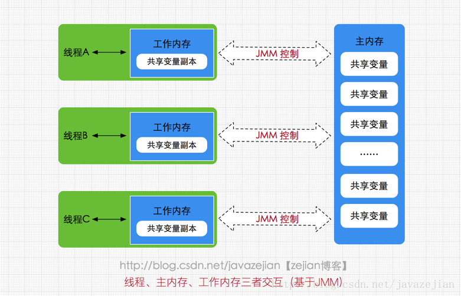
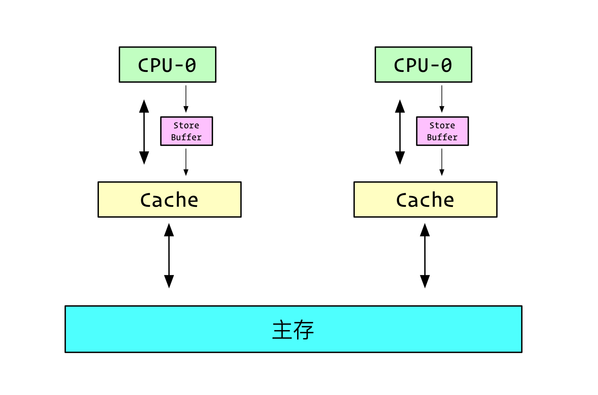
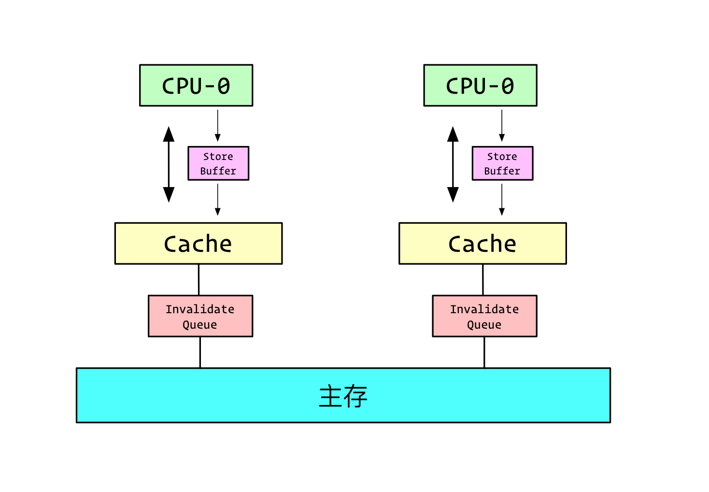

# Java 内存模型

## 0.前言

Java 内存模型包括主内存和工作内存，其中主内存是共享的，每一个线程都可以访问，而工作内存是每一个线程私有的，保存了线程的本地变量信息。然后并发编程中有 3 个概念，分别叫做原子性、有序性和可见性。其中 synchronized 和 lock 用于保证原子性，而 volatile 和 synchronized 都可以用来保证可见性，最后有序性，JMM 提供了部分有序性，也就是 happens-before 原则，这个原则里面的先后次序不通过同步操作就可以得到保证。有序性是 CPU 不一定按照我们所写的顺序来执行指令，编译器和 CPU 会对指令进行重排序，但是程序重排序之后的结果和单线程串行执行的结果相同。

**<font color="red">另外 volatile 语义包括两个，一个是禁止指令重排序，第二个是保证了内存可见性</font>**。原理就是写 volatile 变量时，直接将 store buffer 中的变量值写入到缓存中，然后由于 MESI 协议，修改刷入缓存就对其他 CPU 可见了。读 volatile 变量时，会优先处理 invalidateQueue 中的无效请求，如果有缓存行失效了，那么就从主内存中拉取最新值到缓存中。

## 1.Java 内存模型概述

Java 内存模型(即 Java Memory Model，简称 JMM)本身是一种抽象的概念，并不真实存在，它描述的是一组规则或规范。由于 JVM 运行程序的实体是线程，**<font color="red">而每个线程创建时 JVM 都会为其创建一个工作内存(有些地方称为栈空间)，用于存储线程私有的数据，而主内存是共享内存区域，所有线程都可以访问</font>**。

线程对变量的操作(读取赋值等)必须在工作内存中进行，首先要将变量从主内存拷贝的自己的工作内存，然后对变量进行操作，操作完成后再将变量写回主内存，不能直接操作主内存中的变量。前面说过，工作内存是每个线程的私有数据区域，因此不同的线程间无法访问对方的工作内存，线程间的通信(传值)必须通过主内存来完成，其简要访问过程如下图:

<div align="center">
    
</div>

需要注意的是，JMM 与 Java 内存区域的划分是不同的概念层次，JMM 是围绕原子性，有序性、可见性展开的(稍后会分析)。JMM 与 Java 内存区域唯一相似点，都存在共享数据区域和私有数据区域，**<font color="red">在 JMM 中主内存属于共享数据区域，从某个程度上讲应该包括了堆和方法区，而工作内存为线程私有数据区域，从某个程度上讲则应该包括程序计数器、虚拟机栈以及本地方法栈</font>**。或许在某些地方，我们可能会看见主内存被描述为堆内存，工作内存被称为线程栈，实际上他们表达的都是同一个含义。关于 JMM 中的主内存和工作内存说明如下：

- 主内存：主要存储的是 Java 实例对象，所有线程创建的实例对象都存放在主内存中，不管该实例对象是成员变量还是方法中的本地变量(也称局部变量)，当然也包括了共享的类信息、常量、静态变量。由于是共享数据区域，多条线程对同一个变量进行访问可能会发现线程安全问题。
- 工作内存：主要存储当前方法的所有本地变量信息，每个线程只能访问自己的工作内存，即线程中的本地变量对其它线程是不可见的。当然也包括了程序计数器、相关 Native 方法的信息。注意由于工作内存是每个线程的私有数据，线程间无法相互访问工作内存，因此存储在工作内存的数据不存在线程安全问题。

为了解决类似上述的问题，JVM 定义了一组规则，通过这组规则来决定一个线程对共享变量的写入何时对另一个线程可见，这组规则也称为 Java 内存模型（即JMM），JMM 是围绕着程序执行的原子性、有序性、可见性展开的，下面我们看看这三个特性。

## 2.并发编程三大概念

这里我们先来了解几个概念，即原子性、可见性、有序性，最后再阐明 JMM 是如何保证这3个特性。

- 原子性：即一个操作或者多个操作，要么全部执行并且不被打断，要么就都不执行。个人理解，严格的原子性的操作，其他线程获取操作的变量时，只能获取操作前的变量值和操作后的变量值，不能获取到操作过程中的中间值，在操作过程中其他操作需要获取变量值，需要进入阻塞状态等待操作结束。
- 可见性：当一个线程修改了共享变量的值，其它线程会马上知道这个修改。
- 有序性：为了优化程序性能，编译器运行时会对代码指令进行重排，重排过程中会遵循 as-if-serial 语义，即不影响单线程的运行结果。指令重排可以方便多个处理器并行处理指令。

## 3.JMM 提供的解决方案

在理解了原子性，可见性以及有序性问题后，看看 JMM 是如何保证的，在 Java 内存模型中都提供一套解决方案供 Java 工程师在开发过程使用。

- 原子性问题：
  -  JVM 自身提供的对基本数据类型读写操作的原子性；
  -  对于方法级别或者代码块级别的原子性操作，可以使用 synchronized 关键字或者重入锁 (ReentrantLock) 保证程序执行的原子性；
- 可见性问题：可以使用 synchronized 关键字或者 volatile 关键字解决，它们都可以使一个线程修改后的变量立即对其他线程可见。**<font color="red">synchronized 规定，线程在加锁时，先清空工作内存→在主内存中拷贝最新变量的副本到工作内存→执行完代码→将更改后的共享变量的值刷新到主内存中→释放互斥锁</font>**。
- 有序性问题：则可以利用 volatile 关键字解决，因为 volatile 的另外一个作用就是禁止重排序优化。另外，Java 内存模型具备一些先天的“有序性"，即 happens-before 原则，这个原则中的先后次序不需要通过任何手段就可以得到保证。如果两个操作的执行次序无法从 happens-before 原则推导出来，那么它们就不能保证它们的有序性，虚拟机可以随意地对它们进行重排序。

### 3.1 理解 JMM 中的 happens-before 原则

happens-before 原则内容如下：

- 程序顺序原则：即在一个线程内必须保证语义串行性，也就是说按照代码顺序执行。
- **<font color="red">锁规则：解锁 (unlock) 操作必然发生在后续的同一个锁的加锁 (lock) 之前</font>**，也就是说，如果对于一个锁解锁后，再加锁，那么加锁的动作必须在解锁动作之后(同一个锁)。
- **<font color="red">volatile 规则：volatile 变量的写，先发生于读，这保证了 volatile 变量的可见性</font>**，任何时刻，不同的线程总是能够看到该变量的最新值。
- **<font color="red">start 规则：如果线程 A 执行操作 `ThreadB.start()`（启动线程B），那么 A 线程的 `ThreadB.start()` 操作 happens-before 于线程 B 中的任意操作</font>**。
- join 规则：如果线程 A 执行 **`ThreadB.join()`** 并成功返回，那么线程B中的任意操作 happens-before 于线程 A 从 **`ThreadB.join()`** 操作成功返回。
- 传递性：A 先于 B ，B 先于 C 那么 A 必然先于 C

### 3.2 volatile 内存语义

volatile 在并发编程中很常见，但也容易被滥用，现在我们就进一步分析 volatile 关键字的语义。volatile 是 Java 虚拟机提供的轻量级的同步机制。volatile 关键字有如下两个作用：

- 保证被 volatile 修饰的共享变量对所有线程总数可见的，也就是当一个线程修改了一个被 volatile 修饰共享变量的值，新值总数可以被其他线程立即得知。
- 禁止指令重排序优化。

### 3.3 volatile 的可见性

关于 volatile 的可见性作用，对 volatile 变量的所有写操作总是能立刻反应到其他线程中，但是对于 volatile 变量运算操作在多线程环境并不保证安全性，如下：

```java{.line-numbers}
public class VolatileVisibility {
    public static volatile int i =0;
    public static void increase(){
        i++;
    }
}
```

可以使用 volatile 修饰变量达到线程安全的目的，如下：

```java{.line-numbers}
public class VolatileSafe {

    volatile boolean close;
    
    public void close(){
        close=true;
    }
    
    public void doWork(){
        while (!close){
                System.out.println("safe....");
        }
    }
}
```

由于对于 boolean 变量 close 值的修改属于原子性操作，因此可以通过使用 volatile 修饰变量 close，使用该变量对其他线程立即可见，从而达到线程安全的目的。

### 3.4 volatile 禁止重排优化

volatile 关键字另一个作用就是禁止指令重排优化，从而避免多线程环境下程序出现乱序执行的现象，下面看一个非常典型的禁止重排优化的例子DCL，如下：

```java{.line-numbers}
public class DoubleCheckLock {

    private static DoubleCheckLock instance;
    
    private DoubleCheckLock(){}
    
    public static DoubleCheckLock getInstance(){
        // 第一次检测
        if (instance==null){
            // 同步
            synchronized (DoubleCheckLock.class){
                if (instance == null){
                    // 多线程环境下可能会出现问题的地方
                    instance = new DoubleCheckLock();
                }
            }
        }
        return instance;
    }
}
```

上述代码一个经典的单例的双重检测的代码，这段代码在单线程环境下并没有什么问题，但如果在多线程环境下就可以出现线程安全问题。因为 **`instance = new DoubleCheckLock();`** 可以分为以下 3 步完成(伪代码)。

```java{.line-numbers}
memory = allocate(); // 1.分配对象内存空间
instance(memory);    // 2.初始化对象
instance = memory;   // 3.设置 instance 指向刚分配的内存地址，此时 instance！=null
```

由于步骤 1 和步骤 2 间可能会重排序，如下：

```java{.line-numbers}
memory = allocate(); // 1.分配对象内存空间
instance = memory;   // 3.设置 instance 指向刚分配的内存地址，此时 instance！=null，但是对象还没有初始化完成！
instance(memory);    // 2.初始化对象
```

由于步骤 2 和步骤 3 不存在数据依赖关系，而且无论重排前还是重排后程序的执行结果在单线程中并没有改变，因此这种重排优化是允许的。但是指令重排只会保证串行语义的执行的一致性(单线程)，但并不会关心多线程间的语义一致性。所以当一条线程执行完重排指令的第 3 步（设置内存地址给 instance），而另外一条线程恰好访问 instance 变量的时候，虽然 instance 不为 null，但是 instance 实例未必已初始化完成，会造成错误。那么该如何解决呢，很简单，我们使用 volatile 禁止 instance 变量被执行指令重排优化即可。

### 3.5 volatile 实现原理

#### 3.5.1 Store Buffer 和 invalidateQueue

首先我们要知道，Cache 其实是分块的，类似于磁盘的分页，Cache 的每一块叫一个 CacheLine，对于 Cache 的基本操作都是以 CacheLine 为基本单位。另外在多核 CPU 中，CPU 之间可以互发 6 种消息，其中两种为：

- invalidate：请求中包含需要失效的数据地址，当收到 invalidate 请求后，核心必须要删除这部分数据地址；
- invalidate Ack：当核心删除 invalidate 请求的数据地址后，发送 Ack 给来源的 CPU；

MESI 协议保证了每个缓存中使用的共享变量的副本是一致的。它核心的思想是：当 CPU 写数据时，如果发现操作的变量是共享变量，即在其他 CPU 中也存在该变量的副本，会发出信号通知其他 CPU 将该变量的缓存行置为无效状态，因此当其他 CPU 需要读取这个变量时，发现自己缓存中缓存该变量的缓存行是无效的，那么它就会从内存重新读取。

有了 MESI 协议，Cache 还是派的上用场，但是每次写入都得通知其他的核心，同时接收到其他核心的响应，必然会拖慢很多的性能。比如说，当 CPU0 想要修改a的值，这个时候他并不能直接修改 a 的值，他需要发 invalidate 消息给其他的 CPU， Invalidate 这部分 CacheLine，等所有的 CPU 返回 Ack 的时候，他才能修改。这部分时间 CPU 属于 Stall 状态。所以就加上了一个 Store Buffer，把修改好的变量的值写入到 Store Buffer 中，就去干其他事情，接着等到收到 Ack 消息之后，则再将 Store Buffer 中的变量值写入到缓存中。

<div align="center">
    
</div>

接收到 invalidate 请求后，CPU 也得放下手中的活，把 CacheLine 删除发送 Ack 才能继续。所以引入了 invalidateQueue，将 invalidate 请求写入到这个其中并且立马返回 ack，再择机把失效的 CacheLine 移除。

<div align="center">
    
</div>

#### 3.5.2 原理

针对一般的 CPU 架构：

- 读屏障本质是拉取（acquire，即拉取别人的版本）别的 CPU 的修改，让当前 CPU 缓存里该变量成为最新值。实质是将 **`invalidateQueue`** 中的无效化请求应用到缓存行；
- 写屏障本质是将自己 **`storeBuffer`** 中的修改刷入（release，即发布自己的版本）缓存，其实就是让变量的修改对其他 CPU 可见；

java 的 volatile 只是一层加强：

- 对 volatile 变量的读会在读之前加上一个 FULL_BARRIAR，可以理解成是读+写屏障。目的是先看下 **`invalidateQueue`** 是不是有对该变量的无效请求，如果有则将该缓存行变成无效状态，这样一来如果 **`storeBuffer`** 里有对该变量的修改，则会因为缓存行无效，而去发送 read 请求到总线上，从主内存中读取最新的版本，然后在此基础上修改或者其它操作。
- 对 volatile 变量的写就简单了，单纯是把 **`storeBuffer`** 里的修改刷入缓存，因为 MESI 保证了缓存一致性，所以修改刷入缓存就对其他 CPU 可见了。其它博客中所说的 lock 指令将 **`storebuffer`** 内容刷到缓存，因为 mesi，各 cpu 缓存一致，所以即可对其他 cpu 可见。

综上，volatile 所保证的就是：

- 读取变量的时候，优先处理失效队列 **`invalidQueue`**；
- 写入变量的时候，优先将 **`storeBuffer`** 中的值刷新到缓存中；