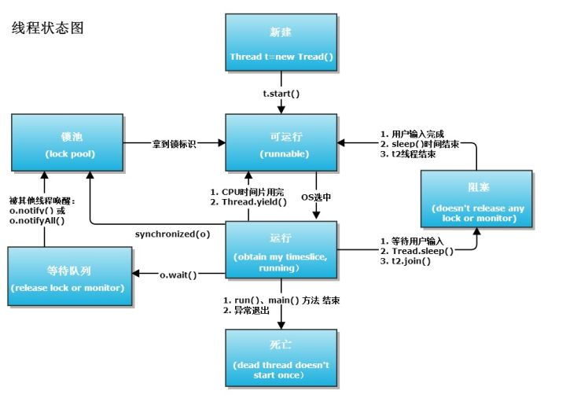

# Java 多线程

## 1.扩展 `java.lang.Thread` 类

这里继承 Thread 类的方法是比较常用的一种，如果说你只是想起一条线程。没有什么其它特殊的要求，那么可以使用 Thread。

```java{.line-numbers}
package com.multithread.learning;
/**
 *@functon 多线程学习
 *@author 林炳文
 *@time 2015.3.9
 */
class Thread1 extends Thread{
    private String name;

    public Thread1(String name) {
          this.name=name;
    }

    public void run() {
        for (int i = 0; i < 5; i++) {
            System.out.println(name + "运行  :  " + i);
            try {
                sleep((int) Math.random() * 10);
            } catch (InterruptedException e) {
                e.printStackTrace();
            }
        }
    }
}

public class Main {
    public static void main(String[] args) {
        Thread1 mTh1=new Thread1("A");
        Thread1 mTh2=new Thread1("B");
        mTh1.start();
        mTh2.start();
    }
}
```

输出：

```java{.line-numbers}
A运行  :  0
B运行  :  0
A运行  :  1
A运行  :  2
A运行  :  3
A运行  :  4
B运行  :  1
B运行  :  2
B运行  :  3
B运行  :  4
```

程序启动运行 main 时候，java 虚拟机启动一个进程，主线程 main 在 main() 调用时候被创建。随着调用 Thread1 类的两个对象的 start 方法，另外两个线程也启动了，这样，整个应用就在多线程下运行。注意 start() 方法的调用后并不是立即执行多线程代码，而是使得该线程变为可运行态（Runnable），什么时候运行是由操作系统决定的。

从程序运行的结果可以发现，多线程程序是乱序执行。因此，只有乱序执行的代码才有必要设计为多线程。**`Thread.sleep()`** 方法调用目的是不让当前线程独自霸占该进程所获取的 CPU 资源，以留出一定时间给其他线程执行的机会。实际上所有的多线程代码执行顺序都是不确定的，每次执行的结果都是随机的。

## 2.实现 `java.lang.Runnable` 接口

采用 Runnable 也是非常常见的一种，我们只需要重写 run 方法即可。下面也来看个实例。

```java{.line-numbers}
package com.multithread.runnable;
class Thread2 implements Runnable{
    private String name;

    public Thread2(String name) {
        this.name=name;
    }

    @Override
    public void run() {
        for (int i = 0; i < 5; i++) {
            System.out.println(name + "运行  :  " + i);
            try {
                Thread.sleep((int) Math.random() * 10);
            } catch (InterruptedException e) {
                e.printStackTrace();
            }
        }
    }
}

public class Main {

    public static void main(String[] args) {
        new Thread(new Thread2("C")).start();
        new Thread(new Thread2("D")).start();
    }

}
```

输出：

```java{.line-numbers}
C运行  :  0
D运行  :  0
D运行  :  1
C运行  :  1
D运行  :  2
C运行  :  2
D运行  :  3
C运行  :  3
D运行  :  4
C运行  :  4
```

Thread2 类通过实现 Runnable 接口，使得该类有了多线程类的特征。run 方法是多线程程序的一个约定。所有的多线程代码都在 run 方法里面。在启动的多线程的时候，需要先通过 Thread 类的构造方法 **`Thread(Runnable target)`** 构造出对象，然后调用 Thread 对象的 **`start()`** 方法来运行多线程代码。实际上所有的多线程代码都是通过运行 Thread 的 **`start()`** 方法来运行的。

## 3.Thread 和 Runnable 的区别

如果一个类继承 Thread，则不适合资源共享。但是如果实现了 Runable 接口的话，则很容易的实现资源共享。实现 Runnable 接口比继承 Thread 类所具有的优势如下：

1. 适合多个相同的程序代码的线程去处理同一个资源
2. 可以避免 java 中的单继承的限制
3. 增加程序的健壮性，代码可以被多个线程共享，代码和数据独立
4. 线程池只能放入实现 Runable 或 callable 类线程，不能直接放入继承 Thread 的类

值得注意的是：main 方法其实也是一个线程。在 java 中所以的线程都是同时启动的，至于什么时候，哪个先执行，完全看谁先得到 CPU 的资源。**<font color="red">在 java 中，每次程序运行至少启动2个线程。一个是 main 线程，一个是垃圾收集线程</font>**。

## 4.线程的状态转换

<div align="center">
    
</div>

1. 新建状态（New）：新创建了一个线程对象。
2. 就绪状态（Runnable）：线程对象创建后，其他线程调用了该对象的 start() 方法。该状态的线程位于可运行线程池中，变得可运行，等待获取 CPU 的使用权。
3. 运行状态（Running）：就绪状态的线程获取了 CPU，执行程序代码。
4. 阻塞状态（Blocked）：阻塞状态是线程因为某种原因放弃 CPU 使用权，暂时停止运行。直到线程进入就绪状态，才有机会转到运行状态。阻塞的情况分三种：
   - 等待阻塞：运行的线程执行 wait() 方法，JVM 会把该线程放入等待池中。(wait 会释放持有的锁)。
   - 同步阻塞：运行的线程在获取对象的同步锁时，若该同步锁被别的线程占用，则 JVM 会把该线程放入锁池中。
   - 其他阻塞：运行的线程执行 **`sleep()`** 或 **`join()`** 方法，或者发出了 I/O 请求时，JVM 会把该线程置为阻塞状态。当 **`sleep()`** 时间结束、**`join()`** 等待线程终止或者超时、或者 I/O 处理完毕时，线程重新转入就绪状态。（注意, sleep 是不会释放持有的锁）。
5. 死亡状态（Dead）：线程执行完了或者因异常退出了 **`run()`** 方法，该线程结束生命周期。

## 5.线程常用函数说明

### 5.1.线程的优先级

Java 线程有优先级，优先级高的线程会获得较多的运行机会。Java 线程的优先级用整数表示，取值范围是 1~10，Thread 类有以下三个静态常量：

- **`static int MAX_PRIORITY`**：线程可以具有的最高优先级，取值为 10。
- **`static int MIN_PRIORITY`**：线程可以具有的最低优先级，取值为 1。
- **`static int NORM_PRIORITY`**：分配给线程的默认优先级，取值为 5。

Thread 类的 **`setPriority()`** 和 **`getPriority()`** 方法分别用来设置和获取线程的优先级。每个线程都有默认的优先级。主线程的默认优先级为 **`Thread.NORM_PRIORITY`**。线程的优先级有继承关系，比如 A 线程中创建了 B 线程，那么 B 将和 A 具有相同的优先级。JVM 提供了 10 个线程优先级，但与常见的操作系统都不能很好的映射。如果希望程序能移植到各个操作系统中，应该仅仅使用 Thread 类中的三个静态常量作为优先级，这样能保证同样的优先级采用了同样的调度方式。

### 5.2 join 方法

join 是 Thread 类的一个方法，启动线程后直接调用，即 **`join()`** 的作用是：“等待该线程终止”，这里需要理解的就是该线程是指的主线程等待子线程的终止。也就是在子线程调用了 **`join()`** 方法后面的代码，只有等到子线程结束了才能执行。

为什么我们需要 **`join()`** 方法呢？这是因为在很多情况下，主线程生成并起动了子线程，如果子线程里要进行大量的耗时的运算，主线程往往将于子线程之前结束，但是如果主线程处理完其他的事务后，需要用到子线程的处理结果，也就是主线程需要等待子线程执行完成之后再结束，这个时候就要用到 **`join()`** 方法了。

下面的代码是不加 **`join()`** 方法的情况：

```java{.line-numbers}
package com.multithread.join;

class Thread1 extends Thread{
    private String name;
    public Thread1(String name) {
        super(name);
        this.name=name;
    }

    public void run() {
        System.out.println(Thread.currentThread().getName() + " 线程运行开始!");
        for (int i = 0; i < 5; i++) {
            System.out.println("子线程"+name + "运行 : " + i);
            try {
                sleep((int) Math.random() * 10);
            } catch (InterruptedException e) {
                e.printStackTrace();
            }
        }
        System.out.println(Thread.currentThread().getName() + " 线程运行结束!");
    }
}

public class Main {
    public static void main(String[] args) {
        System.out.println(Thread.currentThread().getName()+"主线程运行开始!");
        Thread1 mTh1=new Thread1("A");
        Thread1 mTh2=new Thread1("B");
        mTh1.start();
        mTh2.start();
        System.out.println(Thread.currentThread().getName()+ "主线程运行结束!");
    }
}
```

输出的结果为：

```java{.line-numbers}
main主线程运行开始!
main主线程运行结束!
B 线程运行开始!
子线程B运行 : 0
A 线程运行开始!
子线程A运行 : 0
子线程B运行 : 1
子线程A运行 : 1
子线程A运行 : 2
子线程A运行 : 3
子线程A运行 : 4
A 线程运行结束!
子线程B运行 : 2
子线程B运行 : 3
子线程B运行 : 4
```

下面的代码是加了 **`join()`** 方法的情况：

```java{.line-numbers}
public class Main {

    public static void main(String[] args) {
        System.out.println(Thread.currentThread().getName()+"主线程运行开始!");
        Thread1 mTh1=new Thread1("A");
        Thread1 mTh2=new Thread1("B");

        mTh1.start();
        mTh2.start();

        try {
            mTh1.join();
        } catch (InterruptedException e) {
            e.printStackTrace();
        }
        try {
            mTh2.join();
        } catch (InterruptedException e) {
            e.printStackTrace();
        }

        System.out.println(Thread.currentThread().getName()+ "主线程运行结束!");
    }

}
```

运行的结果为：

```java{.line-numbers}
main主线程运行开始!
A 线程运行开始!
子线程A运行 : 0
B 线程运行开始!
子线程B运行 : 0
子线程A运行 : 1
子线程B运行 : 1
子线程A运行 : 2
子线程B运行 : 2
子线程A运行 : 3
子线程B运行 : 3
子线程A运行 : 4
子线程B运行 : 4
A 线程运行结束!
B 线程运行结束!
```

### 5.3 yield 方法

Thread.yield() 方法作用是：暂停当前正在执行的线程对象，并执行其他线程。**<font color="red">yield() 应该做的是让当前运行线程回到就绪状态，以允许其他线程获得运行机会</font>**。因此，使用 yield() 的目的是让相同优先级的线程之间能适当的轮转执行。但是，实际中无法保证 yield() 达到让步目的，因为让步的线程还有可能被线程调度程序再次选中。

结论：yield() 从未导致线程转到等待/睡眠/阻塞状态。在大多数情况下，yield() 将导致线程从运行状态转到就绪状态，但有可能没有效果。可看上面的图。

sleep() 和 yield() 的区别：

- **`sleep()`** 使当前线程进入停滞状态，所以执行 **`sleep()`** 的线程在指定的时间内肯定不会被执行；
- **`yield()`** 只是使当前线程重新回到就绪状态，所以执行 **`yield()`** 的线程有可能在进入到就绪状态后马上又被执行;

另外，sleep 方法允许较低优先级的线程获得运行机会，但 yield()  方法执行时，当前线程仍处在可运行状态，所以，不可能让出较低优先级的线程时获得 CPU 占有权。在一个运行系统中，如果较高优先级的线程没有调用 sleep 方法，又没有受到 I\O 阻塞，那么，较低优先级线程只能等待所有较高优先级的线程运行结束，才有机会运行。

### 5.4 wait 和 notify 方法

wait() 方法与 notify() 必须要与 **`synchronized(resource)`** 一起使用。也就是 wait 与 notify 针对已经获取了 resource 锁的线程进行操作，从语法角度来说就是 **`Obj.wait()`**，Obj.notify 必须在 **`synchronized(Obj){...}`** 语句块内。

- **`A.wait()`** 线程主动释放 CPU 控制权，主动释放 A 对象锁，同时本线程进入等待队列休眠等待，直到有其它线程调用 A 对象的 **`notify()`** 唤醒该线程，但是唤醒之后，该线程还不能立即执行，该线程必须和其它线程竞争获取到 A 对象锁，才能继续运行。并且 A.wait 方法必须在 **`synchronized(A)`** 代码块中执行，通过这种方式来获取对象 A 中的锁。
- **`A.notify()`** 就是对 A 对象锁的释放操作，同样，A.notify 方法也必须在 **`synchronized(A)`** 代码块中执行。当执行 notify 方法后，当前线程并不会立即释放锁，而是等到退出 synchronized 代码块之后才会真正释放 A 对象锁。

因此，我们可以发现，wait 和 notify 方法均可释放对象的锁，但 wait 同时释放 CPU 控制权，即它后面的代码停止执行，线程进入阻塞状态，而 notify 方法是在相应的 synchronized(){} 语句块执行结束，再自动释放锁。释放锁后，JVM 会在等待 resoure 的线程中选取一线程，赋予其对象锁，唤醒线程，继续执行。这样就提供了在线程间同步、唤醒的操作。

**`Thread.sleep()`** 与 **`Object.wait()`** 二者都可以暂停当前线程，释放 CPU 控制权，主要的区别在于 **`Object.wait()`** 在释放 CPU 同时，释放了对象锁的控制，而在同步块中的 **`Thread.sleep()`** 方法并不释放锁，仅释放 CPU 控制权。

**<font color="red">1）notify 方法的注释如下所示：</font>**

Wakes up a single thread that is waiting on this object's monitor. If any threads are waiting on this object, one of them is chosen to be awakened. The choice is arbitrary and occurs at the discretion of the implementation. A thread waits on an object's monitor by calling one of the methods. The awakened thread will not be able to proceed until the current thread relinquishes the lock on this object. The awakened thread will compete in the usual manner with any other threads that might be actively competing to synchronize on this object; 

For example, the awakened thread enjoys no reliable privilege or disadvantage in being the next thread to lock this object. This method should only be called by a thread that is the owner of this object's monitor. A thread becomes the owner of the object's monitor in one of three ways:

By executing a synchronized instance method of that object.
By executing the body of a {@code synchronized} statement that synchronizes on the object.
For objects of typeClass, by executing a synchronized static method of that class.

Only one thread at a time can own an object's monitor.

**<font color="red">2）wait 方法的注释如下所示：</font>**

Causes the current thread to wait until another thread invokes the java.lang.Object#notify() method or the java.lang.Object#notifyAll() method for this object. In other words, this method behaves exactly as if it simply performs the call wait(0). The current thread must own this object's monitor. The thread releases ownership of this monitor and waits until another thread notifies threads waiting on this object's monitor to wake up either through a call to the notify method or the notifyAll method. The thread then waits until it can re-obtain ownership of the monitor and resumes execution.

As in the one argument version, interrupts and spurious wakeups are possible, and this method should always be used in a loop:

```java{.line-numbers}
synchronized (obj) {
     while (&lt;condition does not hold&gt;)
          obj.wait();
          ... // Perform action appropriate to condition
}
```

This method should only be called by a thread that is the owner of this object's monitor. See the notify method for a description of the ways in which a thread can become the owner of a monitor.

为什么 wait 方法和 notify 方法需要在 synchronized 代码块中执行？首先从上面的注释可以看出，调用 A.wait 和 A.notify 方法的前提是能够获取到对象 A 的对象锁，否则的话，就会抛出 IllegalMonitorStateException 异常。但是为什么需要这么设计？这是因为 **`wait()`** 操作的调用必然是在等待某种条件的成立， 而条件的成立必然是由其他的线程来完成的。 所以实际上，我们调用 **`wait()`** 的时候， 实际上希望达到如下的效果：

```java{.line-numbers}
// 线程 A 的代码
while(!condition){ // 不能使用 if , 因为存在一些特殊情况， 使得线程没有收到 notify 时也能退出等待状态
    wait();
}
// do something


// 线程 B 的代码
if(!condition){ 
    // do something ...
    condition = true;
    notify();
} 
```

现在考虑，如果 wait() 和 notify() 的操作没有相应的同步机制， 则会发生如下情况：

-**`【线程A】`** 进入了 while 循环后（通过了 !condition 判断条件，但尚未执行 wait 方法）, CPU 时间片耗尽，CPU 开始执行线程B的代码
-**`【线程B】`** 执行完毕了 **`condition = true; notify();`** 的操作，此时 **`【线程A】`** 的 wait()操作尚未被执行，notify() 操作没有产生任何效果
-**`【线程A】`** 执行 wait() 操作，进入等待状态，如果没有额外的 **`notify()`** 操作，该线程将持续在 **`condition = true`** 的情形下，持续处于等待状态得不到执行。

由此看出，在使用 wait() 和 notify() 这种会挂起线程的操作时，我们需要一种同步机制保证，condition 的检查与 wait() 操作，以及 condition 的更新与 notify() 是互斥的。更改之后的结果如下所示，A 线程在进入到 synchronized 代码块并且调用 wait 方法释放掉 obj 对象锁之前，B 线程不可能会调用 notify 方法。A 线程在释放掉对象锁进入到阻塞状态之后，B 线程进入同步代码块执行，调用 notify 方法唤醒 A 线程，然后在退出同步代码块之后释放掉 obj 对象锁。这时 A 线程才能获取到对象锁重新执行，判断 condition 条件退出代码块。

```java{.line-numbers}
synchronized(obj) {
    while(!condition) {
        obj.wait();
    }
}


synchronized(obj) {
    if(!condition) {
        condition = true;
        obj.notify();
    }
}
```

### 5.5 wait 和 sleep 的区别

1. 每个对象都有一个锁来控制同步访问，synchronized 关键字可以和对象的锁交互，来实现同步方法或同步块。**`sleep()`** 方法正在执行的线程主动让出 CPU（然后 CPU 就可以去执行其他任务），在 sleep 指定时间后 CPU 再回到该线程继续往下执行(注意：sleep 方法只让出了 CPU，而并不会释放同步资源锁)；**`wait()`** 方法则是指当前线程让自己暂时退让出同步资源锁，以便其他正在等待该资源的线程得到该资源进而运行，只有调用了 **`notify()`** 方法，之前调用 **`wait()`** 的线程才会解除 wait 状态，可以去参与竞争同步资源锁，进而得到执行。（注意：notify 的作用相当于叫醒睡着的人，而并不会给他分配任务，就是说 notify 只是让之前调用 wait 的线程有权利重新参与线程的调度）；
2. **`sleep()`** 方法可以在任何地方使用；**`wait()`** 方法则只能在同步方法或同步块中使用；
3. **`sleep()`** 是线程线程类（Thread）的方法，调用会暂停此线程指定的时间，但监控依然保持，不会释放对象锁，到时间自动恢复；**`wait()`** 是 Object 的方法，调用会放弃对象锁，进入等待队列，待调用 notify()/notifyAll() 唤醒指定的线程或者所有线程，才会进入锁池，再次通过竞争获得对象锁之后才会进入运行状态；

## 6.线程中断

在 Java 中没有办法立即停止一条线程，然而停止线程却显得尤为重要，如取消一个耗时操作。因此，Java 提供了一种用于停止线程的机制——中断。

- 中断只是一种协作机制，Java 没有给中断增加任何语法，中断的过程完全需要程序员自己实现。若要中断一个线程，你需要手动调用该线程对象的 interrupt 方法，该方法也仅仅是将线程对象的中断标识设成 true；接着你需要自己写代码不断地检测当前线程的标识位；如果为 true，表示别的线程要求这条线程中断，此时究竟该做什么需要你自己写代码实现；
- **<font color="red">每个线程对象中都有一个标识，用于表示线程是否被中断；该标识位为 true 表示中断，为 false 表示未中断</font>**；
- 通过调用线程对象的 interrupt 方法将该线程的标识位设为 true；可以在别的线程中调用，也可以在自己的线程中调用；

### 6.1 中断的相关方法

- **`public void interrupt()`**：将调用者线程的中断状态设为 true；
- **`public boolean isInterrupted()`**：判断调用者线程的中断状态；
- **`public static boolean interrupted`**：只能通过 **`Thread.interrupted()`** 调用。**<font color="red">它会做两步操作，第一步是返回当前线程的中断状态，第二步是将当前的线程的中断标识设置为 false，也就是清除线程的中断状态</font>**；

### 6.2 如何使用中断？

要使用中断，首先需要在可能会发生中断的线程中不断监听中断状态，一旦发生中断，就执行相应的中断处理代码。 当需要中断线程时，调用该线程对象的 interrupt 函数即可。

**1）设置中断监听**

```java{.line-numbers}
Thread t1 = new Thread( new Runnable(){
    public void run(){
        // 若未发生中断，就正常执行任务
        while(!Thread.currentThread.isInterrupted()){
            // 正常任务代码……
        }

        // 中断的处理代码……
        doSomething();
    }
} ).start(); 
```

正常的任务代码被封装在 while 循环中，每次执行完一遍任务代码就检查一下中断状态；一旦发生中断，则跳过 while 循环，直接执行后面的中断处理代码。

**2）触发中断**

```java{.line-numbers}
t1.interrupt(); 
```

上述代码执行后会将 t1 对象的中断状态设为 true，此时 t1 线程的正常任务代码执行完成后，进入下一次 while 循环前 **`Thread.currentThread.isInterrupted()`** 的结果为 true，此时退出循环，执行循环后面的中断处理代码。

### 6.3 如何安全地停止线程

stop 函数停止线程过于暴力，它会立即停止线程，不给任何资源释放的余地，下面介绍两种安全停止线程的方法。

#### 6.3.1 循环标记变量

自定义一个共享的 boolean 类型变量，表示当前线程是否需要中断。

- 中断标识

```java{.line-numbers}
volatile boolean interrupted = false; 
```

- 任务执行函数

```java{.line-numbers}
Thread t1 = new Thread( new Runnable(){
    public void run(){
        while(!interrupted){
            // 正常任务代码……
        }
        // 中断处理代码……
        // 可以在这里进行资源的释放等操作……
    }
}); 
```

- 中断函数

```java{.line-numbers}
Thread t2 = new Thread( new Runnable(){
    public void run(){
        interrupted = true;
    }
} ); 
```

#### 6.3.2 循环中断状态

中断标识是由线程对象提供，无需自己定义。

- 任务执行函数

```java{.line-numbers}
Thread t1 = new Thread( new Runnable(){
    public void run(){
        while(!Thread.currentThread.isInterrupted()){
            // 正常任务代码……
        }
        // 中断处理代码……
        // 可以在这里进行资源的释放等操作……
    }
} ); 
```

- 中断函数

```java{.line-numbers}
t1.interrupt(); 
```

上述两种方法本质一样，都是通过循环查看一个共享标记来判断线程是否需要中断，他们的区别在于：第一种方法的标识位是我们自己设定的，而第二种方法的标识位是 Java 提供的。除此之外，他们的实现方法是一样的。上述两种方法之所以较为安全，是因为一条线程发出终止信号后，接收线程并不会立即停止，而是将本次循环的任务执行完，再跳出循环停止线程。此外，程序员又可以在跳出循环后添加额外的代码进行收尾工作。

### 6.4 如何处理中断？

上文都在介绍如何获取中断状态，那么当我们捕获到中断状态后，究竟如何处理呢？

- Java 类库中提供的一些可能会发生阻塞的方法都会抛 InterruptedException 异常，如：BlockingQueue#put、BlockingQueue#take、Object#wait、Thread#sleep。
- 当你在某一条线程中调用这些方法时，这个方法可能会被阻塞很长时间，你可以在别的线程中调用当前线程对象的 interrupt 方法触发这些函数抛出 **`InterruptedException`** 异常。当一个函数抛出 **`InterruptedException`** 异常时，表示这个方法阻塞的时间太久了，别人不想等它执行结束了。
- 当你的捕获到一个 **`InterruptedException`** 异常后，亦可以处理它，或者向上抛出。**<font color="red">抛出时要注意当你捕获到 `InterruptedException` 异常后，当前线程的中断状态已经被修改为 false (表示线程未被中断)</font>**；此时你若能够处理中断，则不用理会该值；但如果你继续向上抛 **`InterruptedException`** 异常，你需要再次调用 interrupt 方法，将当前线程的中断状态设为 true。
- 注意：绝对不能“吞掉中断”！即捕获了 **`InterruptedException`** 而不作任何处理。这样违背了中断机制的规则，别人想让你线程中断，然而你自己不处理，也不将中断请求告诉调用者，调用者一直以为没有中断请求。