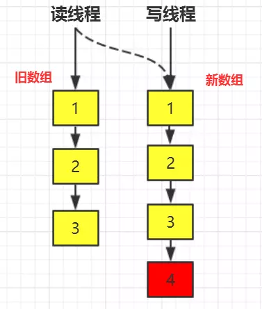

# CopyOnWriteArrayList 解析

## 1 ArrayList 线程不安全

java 学习者都清楚 ArrayList 并不是线程安全的，我们先来看看 ArrayList 中 add 方法的源码：

```java{.line-numbers}
public boolean add(E e) {
    ensureCapacityInternal(size + 1);
    elementData[size++] = e;
    return true;
} 
```

ArrayList 的不安全主要体现在两个方面：

**<font color="red">1.第一个线程不安全的方面</font>**

```java{.line-numbers}
elementData[size++] = e; 
```

不是一个原子操作，是分两步执行的。

```java{.line-numbers}
elementData[size] = e;
size++; 
```

单线程执行这段代码完全没问题，可是到多线程环境下可能就有问题了。可能一个线程会覆盖另一个线程的值。

**<font color="red">2.第二个线程不安全的方面</font>**

ArrayList 默认数组大小为 10。假设现在已经添加进去 9 个元素了，size = 9。

- 线程 A 执行完 add 函数中的ensureCapacityInternal(size + 1)挂起了。
- 线程 B 开始执行，校验数组容量发现不需要扩容。于是把 "b" 放在了下标为 9 的位置，且 size 自增 1。此时 size = 10。
- 线程 A 接着执行，尝试把 "a" 放在下标为 10 的位置，因为 size = 10。但因为数组还没有扩容，最大的下标才为 9，所以会抛出数组越界异常 ArrayIndexOutOfBoundsException

## 2.CopyOnWriteArrayList 的简介

java 学习者都清楚 ArrayList 并不是线程安全的，**<font color="red">读线程在读取 ArrayList 的时候如果有写线程在写数据，基于 fast-fail 机制，会抛出 `ConcurrentModificationException` 异常，也就是说 ArrayList 并不是一个线程安全的容器</font>**，当然您可以用 Vector,或者使用 Collections 的静态方法将 ArrayList 包装成一个线程安全的类，但是这些方式都是采用 java 关键字 synchronzied 对方法进行修饰，利用独占式锁来保证线程安全的。但是，由于独占式锁在同一时刻只有一个线程能够获取到对象监视器，很显然这种方式效率并不是太高。

回到业务场景中，有很多业务往往是读多写少的，比如系统配置的信息，除了在初始进行系统配置的时候需要写入数据，其他大部分时刻其他模块之后对系统信息只需要进行读取，又比如白名单，黑名单等配置，只需要读取名单配置然后检测当前用户是否在该配置范围以内。类似的还有很多业务场景，它们都是属于读多写少的场景。如果在这种情况用到上述的方法，使用 Vector,Collections 转换的这些方式是不合理的，因为尽管多个读线程从同一个数据容器中读取数据，但是读线程对数据容器的数据并不会发生发生修改。

很自然而然的我们会联想到 ReenTrantReadWriteLock，通过读写分离的思想，使得读读之间不会阻塞，无疑如果一个 list 能够做到被多个读线程读取的话，性能会大大提升不少。但是，如果仅仅是将 list 通过读写锁（ReentrantReadWriteLock）进行再一次封装的话，由于读写锁的特性，当写锁被写线程获取后，读写线程都会被阻塞。如果仅仅使用读写锁对 list 进行封装的话，这里仍然存在读线程在读数据的时候被阻塞的情况，如果想 list 的读效率更高的话，这里就是我们的突破口，如果我们保证读线程无论什么时候都不被阻塞，效率岂不是会更高？

Doug Lea 大师就为我们提供 CopyOnWriteArrayList 容器可以保证线程安全，保证读读之间在任何时候都不会被阻塞，CopyOnWriteArrayList 也被广泛应用于很多业务场景之中，CopyOnWriteArrayList 值得被我们好好认识一番。

## 3.COW 的设计思想

回到上面所说的，如果简单的使用读写锁的话，在写锁被获取之后，读写线程被阻塞，只有当写锁被释放后读线程才有机会获取到锁从而读到最新的数据，**<font color="red">站在读线程的角度来看，即读线程任何时候都是获取到最新的数据，满足数据实时性</font>**。既然我们说到要进行优化，必然有 trade-off,我们就可以牺牲数据实时性满足数据的最终一致性即可。而 CopyOnWriteArrayList 就是通过 Copy-On-Write(COW)，即写时复制的思想来通过延时更新的策略来实现数据的最终一致性，并且能够保证读线程间不阻塞。

COW 通俗的理解是当我们往一个容器添加元素的时候，不直接往当前容器添加，而是先将当前容器进行 Copy，复制出一个新的容器，然后新的容器里添加元素，添加完元素之后，再将原容器的引用指向新的容器。对 CopyOnWrite 容器进行并发的读的时候，不需要加锁，因为当前容器不会添加任何元素。**<font color="red">所以 CopyOnWrite 容器也是一种读写分离的思想，延时更新的策略是通过在写的时候针对的是不同的数据容器来实现的，放弃数据实时性达到数据的最终一致性</font>**。

## 4.CopyOnWriteArrayList 的实现原理

现在我们来通过看源码的方式来理解 CopyOnWriteArrayList，实际上 CopyOnWriteArrayList 内部维护的就是一个数组：

```java{.line-numbers}
/** The array, accessed only via getArray/setArray. */
private transient volatile Object[] array; 
```

并且该数组引用是被 volatile 修饰，注意这里仅仅是修饰的是数组引用。关于 volatile 很重要的一条性质是它能够够保证可见性。对 list 来说，我们自然而然最关心的就是读写的时候，分别为 get 和 add 方法的实现。

### 4.1 get 方法实现原理

```java{.line-numbers}
public E get(int index) {
    return get(getArray(), index);
}
/**
 * Gets the array.  Non-private so as to also be accessible
 * from CopyOnWriteArraySet class.
 */
final Object[] getArray() {
    return array;
}
private E get(Object[] a, int index) {
    return (E) a[index];
} 
```

可以看出来 get 方法实现非常简单，几乎就是一个“单线程”程序，没有对多线程添加任何的线程安全控制，也没有加锁也没有 CAS 操作等等，原因是，所有的读线程只是会读取数据容器中的数据，并不会进行修改。

### 4.2 add 方法实现原理

再来看下如何进行添加数据的？add 方法的源码为：

```java{.line-numbers}
public boolean add(E e) {
    final ReentrantLock lock = this.lock;
    //1. 使用Lock,保证写线程在同一时刻只有一个
    lock.lock();
    try {
        //2. 获取旧数组引用
        Object[] elements = getArray();
        int len = elements.length;
        //3. 创建新的数组，并将旧数组的数据复制到新数组中
        Object[] newElements = Arrays.copyOf(elements, len + 1);
        //4. 往新数组中添加新的数据
        newElements[len] = e;
        //5. 将旧数组引用指向新的数组
        setArray(newElements);
        return true;
    } finally {
        lock.unlock();
    }
} 
```

add 方法的逻辑也比较容易理解，请看上面的注释。需要注意这么几点：

- 采用 ReentrantLock，保证同一时刻只有一个写线程正在进行数组的复制，否则的话内存中会有多份被复制的数据；
- 前面说过数组引用是 volatile 修饰的，因此将旧的数组引用指向新的数组，根据 volatile 的 happens-before 规则，写线程对数组引用的修改对读线程是可见的。
- 由于在写数据的时候，是在新的数组中插入数据的，从而保证读写是在两个不同的数据容器中进行操作。

## 5.总结

### 5.1 COW 和读写锁的异同

我们知道 COW 和读写锁都是通过读写分离的思想实现的，但两者还是有些不同，可以进行比较：

- 相同点：1. 两者都是通过读写分离的思想实现；2.读线程间是互不阻塞的；
- 不同点：对读线程而言，为了实现数据实时性，在写锁被获取后，读线程会等待或者当读锁被获取后，写线程会等待，从而解决“脏读”等问题。也就是说如果使用读写锁依然会出现读线程阻塞等待的情况。**<font color="red">而 COW 则牺牲数据实时性而保证数据最终一致性，即读线程对数据的更新是延时感知的，因此读线程不会存在等待的情况</font>**；

对这一点从文字上还是很难理解，我们来通过 debug 看一下，add 方法核心代码为：

```java{.line-numbers}
Object[] elements = getArray();
int len = elements.length;
Object[] newElements = Arrays.copyOf(elements, len + 1);
newElements[len] = e;
setArray(newElements); 
```

假设 COW 的变化如下图所示：

<div align="center">
    
</div>

数组中已有数据 1,2,3，现在写线程想往数组中添加数据 4，我们在第 5 行处打上断点，让写线程暂停。读线程依然会“不受影响”的能从数组中读取数据，可是还是只能读到 1,2,3。**<font color="red">如果读线程能够立即读到新添加的数据的话就叫做能保证数据实时性</font>**。当对第 5 行的断点放开后，读线程才能感知到数据变化，读到完整的数据 1,2,3,4，而保证 **<font color="red">数据最终一致性</font>**，尽管有可能中间间隔了好几秒才感知到。

### 5.2 COW 的缺点

CopyOnWrite 容器有很多优点，但是同时也存在两个问题，即内存占用问题和数据一致性问题。所以在开发的时候需要注意一下。

- 内存占用问题：因为 CopyOnWrite 的写时复制机制，所以在进行写操作的时候，内存里会同时驻扎两个对 象的内存，旧的对象和新写入的对象（注意:在复制的时候只是复制容器里的引用，只是在写的时候会创建新对象添加到新容器里，而旧容器的对象还在使用，所以有两份对象内存）。如果这些对象占用的内存比较大，比 如说 200M 左右，那么再写入 100M 数据进去，内存就会占用 300M，那么这个时候很有可能造成频繁的 minor GC 和 major GC。
- 数据一致性问题：CopyOnWrite 容器只能保证数据的最终一致性，不能保证数据的实时一致性。所以如果你希望写入的的数据，马上能读到，请不要使用 CopyOnWrite 容器。