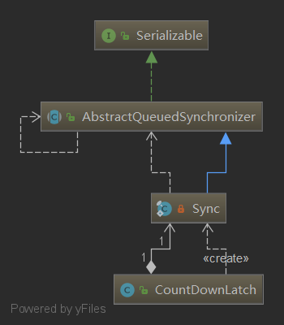

# CountDownLatch 详解

## 一、CountDownLatch 的用法

CountDownLatch 是 jdk1.5 开始 concurrent 包里提供的，并发编程工具类。这个类能够使一个线程等待其他线程完成各自的工作后再执行，可用于多线程的并发执行。例如，**<font color="red">应用程序的主线程希望在多个网络请求线程并发执行完后，刷新页面，避免串行请求导致网络请求耗时长</font>**。

CountDownLatch 的主要使用步骤是：

1. 初始化，指定线程个数，**`CountDownLatch latch = new CountDownLatch(3);`** 参数 3 代表线程的总数
2. 每个线程执行后执行 **`latch.countDown();`**，代表一个线程执行完成，待完成的线程数减 1。
3. 在线程添加 **`latch.await();`**，阻塞该线程，等待其他子线程完成，也就是等待 CountDownLatch 中的参数被减为 0。

CountDownLatch 的使用例子如下：

```java{.line-numbers}
package com.example.zzh.myapplication;

import java.util.concurrent.CountDownLatch;

public class CountDownLatchDemo {

    public static void main(String[] args) throws InterruptedException {
        // Let us create task that is going to
        // wait for four threads before it starts
        CountDownLatch latch = new CountDownLatch(3);

        long start = System.currentTimeMillis();

        // Let us create four worker
        // threads and start them.
        WorkerThread first = new WorkerThread(1000, latch, "worker-1");
        WorkerThread second = new WorkerThread(2000, latch, "worker-2");
        WorkerThread third = new WorkerThread(3000, latch, "worker-3");

        first.start();
        second.start();
        third.start();

        // The main task waits for four threads
        latch.await();

        // Main thread has started
        System.out.println(Thread.currentThread().getName() + " has finished. Spend Time = " + (System.currentTimeMillis() - start));
    }

    // A class to represent threads for which
    // the main thread waits.
    static class WorkerThread extends Thread {

        private int delay;
        private CountDownLatch latch;

        public WorkerThread(int delay, CountDownLatch latch, String name) {
            super(name);
            this.delay = delay;
            this.latch = latch;
        }

        @Override
        public void run() {
            try {
                Thread.sleep(delay);
                latch.countDown();
                System.out.println(Thread.currentThread().getName() + " finished");
            } catch (InterruptedException e) {
                e.printStackTrace();
            }
        }
    }

} 
```

运行结果如下：

```java{.line-numbers}
worker-1 finished
worker-2 finished
worker-3 finished
main has finished. Spend Time = 3006 
```

## 二、CountDownLatch 解析

### 1 什么是 AQS（AbstractQueuedSynchronizer）

深入 CountDownLatch 源码，需要了解 AQS（AbstractQueuedSynchronizer），因为 CountDownLatch 的底层原理是通过 AQS（AbstractQueuedSynchronizer）里面的共享锁来实现的。AQS 即队列同步器。它是构建锁或者其他同步组件的基础框架，JUC 并发包的作者（Doug Lea）期望它能够成为实现大部分同步需求的基础。它是 JUC 并发包中的核心基础组件。

AQS 解决了实现同步器时涉及当的大量细节问题，例如获取同步状态、FIFO 同步队列。基于 AQS 来构建同步器可以带来很多好处。它不仅能够极大地减少实现工作，而且也不必处理在多个位置上发生的竞争问题。AQS 使用一个 int 类型的成员变量 state 来表示同步状态，当 state > 0 时表示已经获取了锁，当 state = 0 时表示释放了锁。它提供了三个方法（getState()、setState(int newState)、compareAndSetState(int expect,int update)）来对同步状态 state 进行操作，当然 AQS 可以确保对 state 的操作是安全的。

AQS 通过内置的 FIFO 同步队列来完成资源获取线程的排队工作，如果当前线程获取同步状态失败（锁）时，AQS 则会将当前线程以及等待状态等信息构造成一个节点（Node）并将其加入同步队列，同时会阻塞当前线程，当同步状态释放时，则会把节点中的线程唤醒，使其再次尝试获取同步状态。

AQS 的使用方式是继承，子类通过继承同步器并实现它的抽象方法来管理同步状态。AQS 提供了独占锁和共享锁必须实现的方法。共享锁是一种乐观锁，它放宽了加锁策略，允许多个执行读操作的线程同时访问共享资源。对应的是独占锁，是一种悲观锁，如果某个只读线程获取锁，则其他读线程都只能等待，这样就限制了不必要的并发性，因为读操作并不会影响数据的一致性。

在 AQS 中，共享锁获取锁，节点模式则为 Node.SHARED。独占锁获取锁时，设置节点模式为 Node.EXCLUSIVE。

### 2 CountDownLatch 的类结构

<div align="center">
    
</div>

CountDownLatch 中只包含了 Sync 一个内部类，它没有公平/非公平模式，所以它算是一个比较简单的同步器了。这里还要注意一点，CountDownLatch 没有实现 Serializable 接口，所以它不是可序列化的。

### 3.源码分析

#### 3.1 内部类 Sync

```java{.line-numbers}
private static final class Sync extends AbstractQueuedSynchronizer {
    private static final long serialVersionUID = 4982264981922014374L;
    
    // 传入初始次数
    Sync(int count) {
        setState(count);
    }
    // 获取还剩的次数
    int getCount() {
        return getState();
    }
    // 尝试获取共享锁
    protected int tryAcquireShared(int acquires) {
        // 注意，这里 state 等于 0 的时候返回的是 1，也就是说 count 减为 0 的时候获取总是成功
        // state 不等于 0 的时候返回的是 -1，也就是 count 不为 0 的时候总是要排队
        return (getState() == 0) ? 1 : -1;
    }
    // 尝试释放锁
    protected boolean tryReleaseShared(int releases) {
        for (;;) {
            // state 的值
            int c = getState();
            // 等于 0 了，则无法再释放了
            if (c == 0)
                return false;
            // 将 count 的值减 1
            int nextc = c-1;
            // 原子更新 state 的值
            if (compareAndSetState(c, nextc))
                // 减为 0 的时候返回 true，这时会唤醒后面排队的线程
                return nextc == 0;
        }
    }
} 
```

Sync 重写了 tryAcquireShared() 和 tryReleaseShared() 方法。

#### 3.2 构造方法

```java{.line-numbers}
public CountDownLatch(int count) {
    if (count < 0) throw new IllegalArgumentException("count < 0");
    this.sync = new Sync(count);
} 
```

构造方法需要传入一个 count 也就是初始次数。

#### 3.3 await 方法

```java{.line-numbers}
// java.util.concurrent.CountDownLatch.await()
public void await() throws InterruptedException {
    // 调用 AQS 的 acquireSharedInterruptibly() 方法
    sync.acquireSharedInterruptibly(1);
}
// java.util.concurrent.locks.AbstractQueuedSynchronizer.acquireSharedInterruptibly()
public final void acquireSharedInterruptibly(int arg)
        throws InterruptedException {
    if (Thread.interrupted())
        throw new InterruptedException();
    // 尝试获取锁，如果失败则排队
    if (tryAcquireShared(arg) < 0)
        doAcquireSharedInterruptibly(arg);
} 
```

**`await()`** 方法是等待其它线程完成的方法，它会先尝试获取一下共享锁，如果失败则进入 AQS 的队列中排队等待被唤醒。根据上面 Sync 的源码，我们知道，state 不等于 0 的时候 **`tryAcquireShared()`** 返回的是 -1，也就是说 count 未减到 0 的时候所有调用 **`await()`** 方法的线程都要排队。

#### 3.4 countDown() 方法

```java{.line-numbers}
// java.util.concurrent.CountDownLatch.countDown()
public void countDown() {
    // 调用 AQS 的释放共享锁方法
    sync.releaseShared(1);
}
// java.util.concurrent.locks.AbstractQueuedSynchronizer.releaseShared()
public final boolean releaseShared(int arg) {
    // 尝试释放共享锁，如果成功了，就唤醒排队的线程
    if (tryReleaseShared(arg)) {
        doReleaseShared();
        return true;
    }
    return false;
} 
```

**`countDown()`** 方法，会释放一个共享锁，也就是 count 的次数会减 1。根据上面 Sync 的源码，我们知道，**`tryReleaseShared()`** 每次会把 count 的次数减 1，当其减为 0 的时候返回 true，这时候才会唤醒等待的线程。注意，**`doReleaseShared()`** 是唤醒等待的线程。

## 三、总结

- CountDownLatch 表示 **<font color="red">允许一个或多个线程等待其它线程的操作执行完毕后再执行后续的操作</font>**；
- CountDownLatch 使用 AQS 的共享锁机制实现；
- CountDownLatch 初始化的时候需要传入次数 count；
- 每次调用 await() 方法的时候会尝试获取锁，**<font color="red">这里的获取锁其实是检查 AQS 的 state 变量的值是否为 0</font>**，如果获取不到的话，就进入阻塞状态。
- 每次调用 countDown() 方法 count 的次数减 1，当 count 的值（也就是 state 的值）减为 0 的时候会唤醒排队着的线程（这些线程调用 await() 进入队列）；

1. CountDownLatch 的初始次数是否可以调整？

答：前面我们学习 Semaphore 的时候发现，它的许可次数是可以随时调整的，那么，CountDownLatch 的初始次数能随时调整吗？答案是不能的，它没有提供修改（增加或减少）次数的方法，除非使用反射作弊。

2. CountDownLatch 为什么使用共享锁？

答：前面我们分析 ReentrantReadWriteLock 的时候学习过 AQS 的共享锁模式，比如当前锁是由一个线程获取为共享锁，那么这时候所有需要获取共享锁的线程都要进入 AQS 队列中进行排队，当这个共享锁释放的时候，会一个接着一个地唤醒这些连续的排队的等待获取共享锁的线程，注意，这里的用语是“一个接着一个地唤醒”，也就是说这些等待获取共享锁的线程不是一次性唤醒的。

说到这里，是不是很明白了？因为 CountDownLatch 的 await() 多个线程可以调用多次，**<font color="red">当调用多次的时候这些线程都要进入 AQS 队列中排队，当 count 次数减为 0 的时候，它们都需要被唤醒，继续执行任务</font>**，如果使用互斥锁则不行，互斥锁在多个线程之间是互斥的，一次只能唤醒一个，不能保证当 count 减为 0 的时候这些调用了 await() 方法等待的线程都被唤醒。
