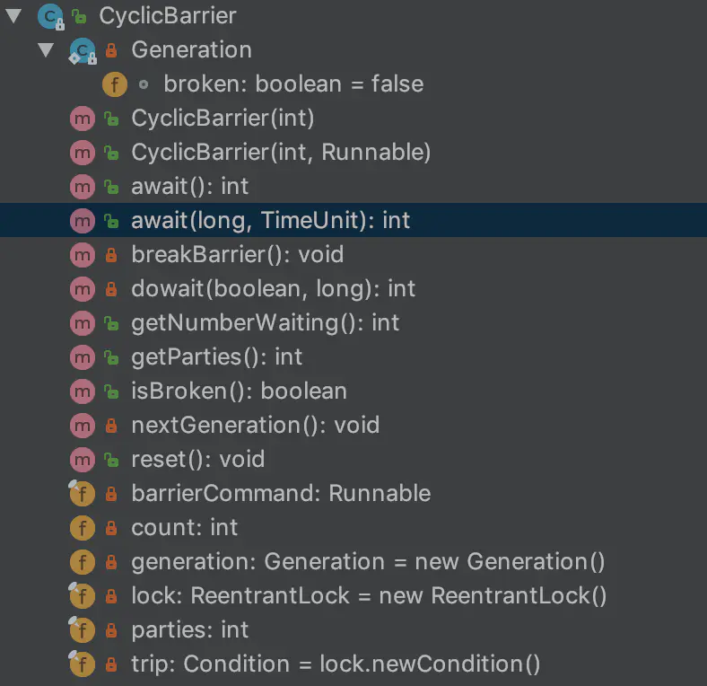
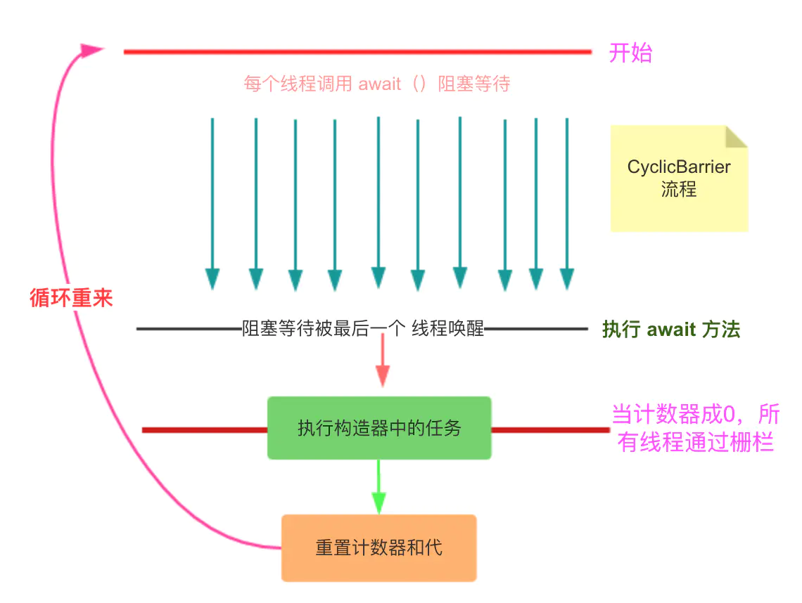

# CyclicBarrier 详解

## 1.前言

在之前的介绍 CountDownLatch 的文章中，CountDown 可以实现多个线程协调，在所有指定线程完成后，主线程才执行任务。但是，CountDownLatch 有个缺陷，这点 JDK 的文档中也说了：他只能使用一次。在有些场合，似乎有些浪费，需要不停的创建 CountDownLatch 实例，JDK  在 CountDownLatch 的文档中向我们介绍了 CyclicBarrier——循环栅栏。

## 2.CyclicBarrier 使用示例

```java{.line-numbers}
public class CyclicBarrierDemo {

    public static void main(String[] args) {
        int N = 4;
        CyclicBarrier barrier  = new CyclicBarrier(N, new Runnable() {
            @Override
            public void run() {
                System.out.println("所有线程写入完毕，继续处理其他任务...");
            }
        });

        for(int i=0;i<N;i++) {
            new Writer(barrier).start();
        }
    }
    static class Writer extends Thread{
        private CyclicBarrier cyclicBarrier;
        public Writer(CyclicBarrier cyclicBarrier) {
            this.cyclicBarrier = cyclicBarrier;
        }

        @Override
        public void run() {
            System.out.println("线程"+Thread.currentThread().getName()+"正在写入数据...");
            try {
                Thread.sleep(new Random().nextInt(5000));      //以睡眠来模拟写入数据操作
                System.out.println("线程"+Thread.currentThread().getName()+"写入数据完毕，等待其他线程写入完毕");

                cyclicBarrier.await();
            } catch (InterruptedException e) {
                e.printStackTrace();
            }catch(BrokenBarrierException e){
                e.printStackTrace();
            }
        }
    }

} 
```

运行的结果如下：

```java{.line-numbers}
线程Thread-0正在写入数据...
线程Thread-1正在写入数据...
线程Thread-2正在写入数据...
线程Thread-3正在写入数据...
线程Thread-1写入数据完毕，等待其他线程写入完毕
线程Thread-3写入数据完毕，等待其他线程写入完毕
线程Thread-0写入数据完毕，等待其他线程写入完毕
线程Thread-2写入数据完毕，等待其他线程写入完毕
所有线程写入完毕，继续处理其他任务...

Process finished with exit code 0 
```

## 3.源码分析

<div align="center">
    
</div>

有一个我们常用的方法 await，还有一个内部类，Generation ，仅有一个参数，有什么作用呢？在 CyclicBarrier 中，有一个 “代” 的概念，因为 CyclicBarrier 是可以复用的，那么每次所有的线程通过了栅栏，就表示一代过去了。为什么需要这个呢？后面我们看源码的时候在细说。再看看构造方法，有 2 个构造方法：

```java{.line-numbers}
public CyclicBarrier(int parties) {
    this(parties, null);
}

public CyclicBarrier(int parties, Runnable barrierAction) {
    if (parties <= 0) throw new IllegalArgumentException();
    this.parties = parties;
    this.count = parties;
    this.barrierCommand = barrierAction;
} 
```

如果使用 CyclicBarrier 就知道了，**<font color="red">CyclicBarrier 支持在所有线程通过栅栏的时候，执行一个线程的任务</font>**。parties 属性就是线程的数量，这个数量用来控制什么时候释放打开栅栏，让所有线程通过。好了，CyclicBarrier 的最重要的方法就是 await 方法，当执行了这样一个方法，就像是树立了一个栅栏，将线程挡住了，只有所有的线程都到了这个栅栏上，栅栏才会打开。看看这个方法的实现。

### 3.1 await 方法的实现

```java{.line-numbers}
public int await() throws InterruptedException, BrokenBarrierException {
        try {
            return dowait(false, 0L);
        } catch (TimeoutException toe) {
            throw new Error(toe); // cannot happen
        }
    } 

private int dowait(boolean timed, long nanos)
    throws InterruptedException, BrokenBarrierException,
           TimeoutException {
    final ReentrantLock lock = this.lock;
    // 锁住
    lock.lock();
    try {
        // 当前代
        final Generation g = generation;
        // 如果这代损坏了，抛出异常
        if (g.broken)
            throw new BrokenBarrierException();

        // 如果线程中断了，抛出异常
        if (Thread.interrupted()) {
            // 将损坏状态设置为 true
            // 并通知其他阻塞在此栅栏上的线程
            breakBarrier();
            throw new InterruptedException();
        }
        // 获取下标    
        int index = --count;
        // 如果是 0 ,说明到头了
        if (index == 0) {  // tripped
            boolean ranAction = false;
            try {
                final Runnable command = barrierCommand;
                // 执行栅栏任务
                if (command != null)
                    command.run();
                ranAction = true;
                // 更新一代,将 count 重置,将 generation 重置.
                // 唤醒之前等待的线程
                nextGeneration();
                // 结束
                return 0;
            } finally {
                // 如果执行栅栏任务的时候失败了,就将栅栏失效
                if (!ranAction)
                    breakBarrier();
            }
        }

        for (;;) {
            try {
                // 如果没有时间限制,则直接等待,直到被唤醒
                if (!timed)
                    trip.await();
                // 如果有时间限制,则等待指定时间
                else if (nanos > 0L)
                    nanos = trip.awaitNanos(nanos);
            } catch (InterruptedException ie) {
                // g == generation >> 当前代
                // !g.broken >>> 没有损坏
                if (g == generation && ! g.broken) {
                    // 和之前处理线程中断一样，首先让栅栏失效，接着抛出中断异常
                    breakBarrier();
                    throw ie;
                } else {
                    // 上面条件不满足,说明这个线程不是这代的.
                    // 就不会影响当前这代栅栏执行逻辑.所以,就打个标记就好了
                    Thread.currentThread().interrupt();
                }
            }
            // 当有任何一个线程中断了,会调用 breakBarrier 方法.
            // 就会唤醒其他的线程,其他线程醒来后,也要抛出异常
            if (g.broken)
                throw new BrokenBarrierException();
            // g != generation >>> 正常换代了
            // 一切正常,返回当前线程所在栅栏的下标
            if (g != generation)
                return index;
            // 如果有时间限制,且时间小于等于0,销毁栅栏,并抛出异常
            if (timed && nanos <= 0L) {
                breakBarrier();
                throw new TimeoutException();
            }
        }
    } finally {
        lock.unlock();
    }
}
```

### 3.2 breakBarrier 代码实现

```java{.line-numbers}
private void breakBarrier() {
     generation.broken = true;
     count = parties;
     trip.signalAll();
} 
```

### 3.3 nextGeneration 代码实现

```java{.line-numbers}
private void nextGeneration() {
     // signal completion of last generation
     trip.signalAll();
     // set up next generation
     count = parties;
     generation = new Generation();
} 
```

代码虽然长，但整体逻辑还是很简单的。总结一下该方法吧：

1. 首先，**<font color="red">每个 CyclicBarrier 都有一个 Lock，想执行 await 方法，就必须获得这把锁</font>**。所以，CyclicBarrier 在并发情况下的性能是不高的。
2. 一些线程中断的判断，注意，CyclicBarrier 中，**<font color="red">只要有一个线程中断了，其余的线程也会抛出中断异常。并且，这个 CyclicBarrier 就不能再次使用了</font>**。因为在刚执行 dowait 方法时，会有一个 g.broken 的判断，然后在方法的 for 循环中也有一个g.broken 的判断(线程被唤醒之后需要判断栅栏是否被破坏)，如果这两个判断为真，则线程不会在继续执行下去，直接抛出 BrokenBarrierException 异常。
3. 每次线程调用一次 await 方法，表示这个线程到了栅栏这里了，那么就将计数器减一。如果计数器到 0 了，表示这是这一代最后一个线程到达栅栏，就尝试执行我们构造方法中传入的 Runnable 任务。最后，将代更新，计数器重置，并唤醒所有之前等待在栅栏上的线程（即调用 nextGeneration 方法）。
4. 如果不是最后一个线程到达栅栏了，就使用 Condition 的 await 方法阻塞线程。如果等待过程中，线程中断了，就抛出异常。
5. 当有一个线程中断了，也会调用 breakBarrier 方法唤醒其他线程，那么其它线程被唤醒之后就需要判断 broken 状态。
6. 如果这个线程被假唤醒了，那么 g 肯定等于 generation，这个时候就不能 return 了，而是继续循环阻塞。反之，如果是当前 CyclicBarrier 唤醒的，就返回线程在 CyclicBarrier 的下标。完成了一次冲过栅栏的过程。

## 4.总结

**<font color="red">从 await 方法看，CyclicBarrier 还是比较简单的，JDK 的思路就是：设置一个计数器，线程每调用一次计数器，就减一，并使用 Condition 阻塞线程。当计数器是 0 的时候，就唤醒所有线程，然后重置计数器，并尝试执行构造函数中传入的 Runnable 任务。由于 CyclicBarrier 是可重复执行的，所以，当计数器变为  0 之后就需要重置计数器</font>**。

总而言之，CyclicBarrier 是依靠一个计数器实现的，内部有一个 count 变量，每次调用都会减一。当一次完整的栅栏活动结束后，计数器重置，这样，就可以重复利用了。而他和 CountDownLatch 的区别在于，CountDownLatch 只能使用一次就 over 了，CyclicBarrier 能使用多次，可以说功能类似，CyclicBarrier 更强大一点。并且 CyclicBarrier 携带了一个在栅栏处可以执行的任务。更加灵活。

下面来一张图，说说 CyclicBarrier 的流程。和 CountDownLatch 类似：

<div align="center">
    
</div>

## 5.CyclicBarrier 和 CountDownLatch 的区别

在网上看到很多人对于 CountDownLatch 和 CyclicBarrier 的区别简单理解为 CountDownLatch 是一次性的，而 CyclicBarrier 在重置之后还可以继续使用。那如果只是这么简单的话，我觉得 CyclicBarrier 简单命名为 ResetableCountDownLatch 好了，显然不是的。我的理解是，要从他们的设计目的去看这两个类。javadoc 里面的描述是这样的：

>**<font color="red">CountDownLatch: A synchronization aid that allows one or more threads to wait until a set of operations being performed in other threads completes.</font>**
>**<font color="red">CyclicBarrier : A synchronization aid that allows a set of threads to all wait for each other to reach a common barrier point.</font>**
    
我的理解是 CountDownLatch : 一个线程(或者多个)， 等待另外 N 个线程完成某个事情之后才能够继续执行。 CyclicBarrier : N 个线程相互等待，其中任何一个线程没有完成的话，所有的线程都必须等待。这样应该就清楚一点了，对于 CountDownLatch 来说，重点是那个“一个线程”, 是它在等待， 而另外那N的线程在把“某个事情”做完之后等待的线程才可以继续执行。而对于 CyclicBarrier 来说，重点是那 N 个线程，他们之间任何一个没有完成，所有的线程都必须等待。