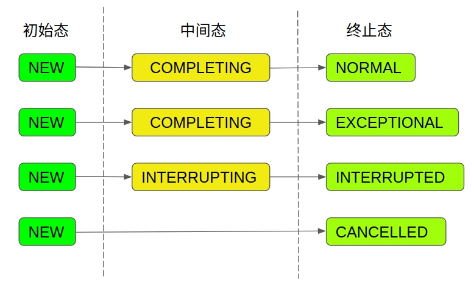
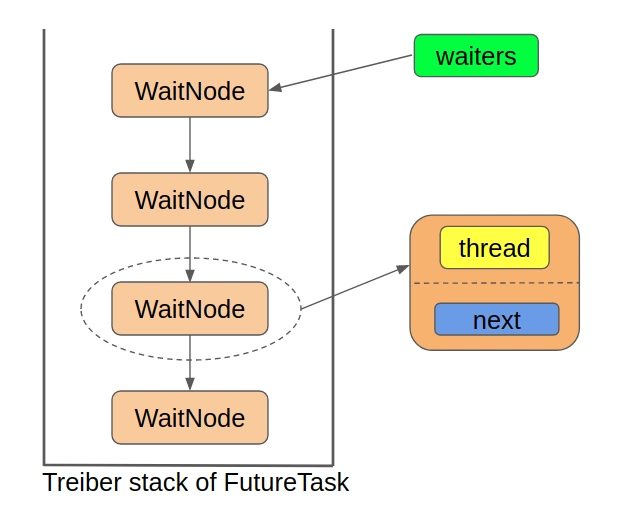
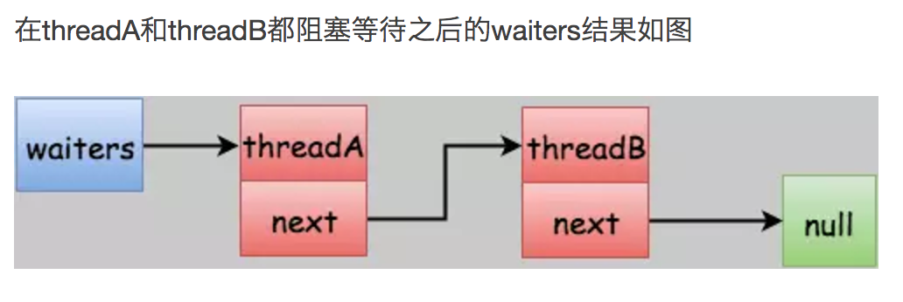
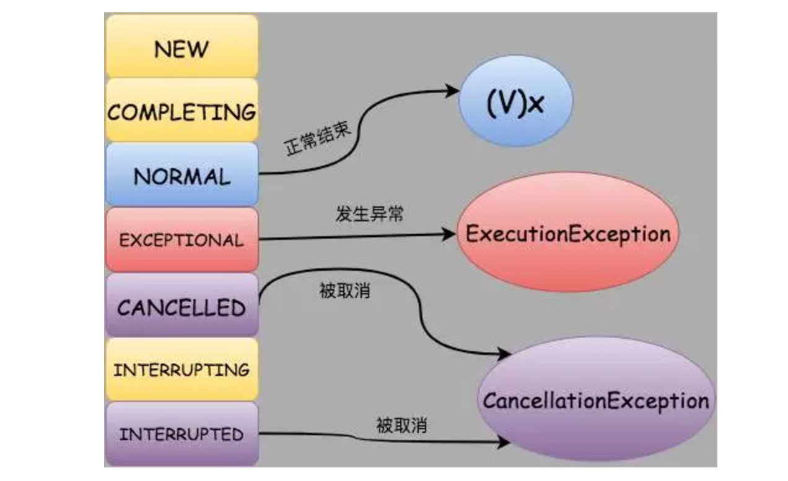

# FutureTask 详解

## 1.前言

在深入分析源码之前，我们再来拎一下 FutureTask 到底是干嘛的。人如其名，FutureTask 包含了 Future 和 Task 两部分。

我们上一篇说过，FutureTask 实现了 RunnableFuture 接口，即 Runnable 接口和 Future 接口。**<font color="red">其中 Runnable 接口对应了 FutureTask 名字中的 Task，代表 FutureTask 本质上也是表征了一个任务。而 Future 接口就对应了 FutureTask 名字中的 Future，表示了我们对于这个任务可以执行某些操作</font>**，例如，判断任务是否执行完毕，获取任务的执行结果，取消任务的执行等。

所以简单来说，FutureTask 本质上就是一个"Task"，**<font color="red">我们可以把它当做简单的 Runnable 对象来使用。但是它又同时实现了 Future 接口，因此我们可以对它所代表的"Task" 进行额外的控制操作</font>**。

## 2.Java 并发工具类的三板斧

关于 Java 并发工具类的三板斧，我们在分析 AQS 源码的时候已经说过了, 即：状态，队列，CAS。以这三个方面为切入点来看源码，有助于我们快速的看清 FutureTask 的概貌：

### 2.1 状态

首先是找状态。在 FutureTask 中，状态是由 state 属性来表示的，不出所料，它是 volatile 类型的，确保了不同线程对它修改的可见性：

```java{.line-numbers}
private volatile int state;
private static final int NEW          = 0;
private static final int COMPLETING   = 1;
private static final int NORMAL       = 2;
private static final int EXCEPTIONAL  = 3;
private static final int CANCELLED    = 4;
private static final int INTERRUPTING = 5;
private static final int INTERRUPTED  = 6; 
```

state 属性是贯穿整个 FutureTask 的最核心的属性，该属性的值代表了任务在运行过程中的状态，随着任务的执行，状态将不断地进行转变，从上面的定义中可以看出，总共有 7 种状态：包括了 1 个初始态，2 个中间态和 4 个终止态。虽说状态有这么多，但是状态的转换路径却只有四种：

<div align="center">
    
</div>

- 任务的初始状态都是NEW, 这一点是构造函数保证的，我们后面分析构造函数的时候再讲；
- 任务的终止状态有4种：
  - **`NORMAL`**：任务正常执行完毕
  - **`EXCEPTIONAL`**：任务执行过程中发生异常
  - **`CANCELLED`**：任务被取消
  - **`INTERRUPTED`**：任务被中断
- 任务的中间状态有 2 种：
  - **`COMPLETING`**：正在设置任务结果
  - **`INTERRUPTING`**：正在中断运行任务的线程

值得一提的是，任务的中间状态是一个瞬态，它非常的短暂。而且任务的中间态并不代表任务正在执行，而是任务已经执行完了，正在设置最终的返回结果，所以可以这么说：**<font color="red">只要 state 不处于 NEW 状态，就说明任务已经执行完毕</font>**。注意，这里的执行完毕是指传入的 Callable 对象的 call 方法执行完毕，或者抛出了异常。所以这里的 COMPLETING 的名字显得有点迷惑性，它并不意味着任务正在执行中，而意味着 call 方法已经执行完毕，正在设置任务执行的结果。

而将一个任务的状态设置成终止态只有三种方法：

- set
- setException
- Cancel

### 2.2 队列

接着我们来看队列，在 FutureTask 中，队列的实现是一个单向链表，它表示所有等待特定任务执行完毕的线程的集合。我们知道，FutureTask 实现了 Future 接口，可以获取“Task”的执行结果，那么如果获取结果时，任务还没有执行完毕怎么办呢？那么获取结果的线程就会在一个等待队列中挂起，直到任务执行完毕被唤醒。

我们前面说过，在并发编程中使用队列通常是将当前线程包装成某种类型的数据结构扔到等待队列中，我们先来看看队列中的每一个节点是怎么个结构：

```java{.line-numbers}
static final class WaitNode {
    volatile Thread thread;
    volatile WaitNode next;
    WaitNode() { thread = Thread.currentThread(); }
} 
```

可见，它只包含了一个记录线程的 thread 属性和指向下一个节点的 next 属性。

值得一提的是，FutureTask 中的这个单向链表是当做栈来使用的，确切来说是当做 Treiber 栈来使用的，不了解 Treiber 栈是个啥的可以简单的把它当做是一个线程安全的栈，它使用 CAS 来完成入栈出栈操作。**<font color="red">为啥要使用一个线程安全的栈呢，因为同一时刻可能有多个线程都在获取任务的执行结果，如果任务还在执行过程中，则这些线程就要被包装成 WaitNode 扔到 Treiber 栈的栈顶，即完成入栈操作</font>**，这样就有可能出现多个线程同时入栈的情况，因此需要使用 CAS 操作保证入栈的线程安全，对于出栈的情况也是同理。

由于 FutureTask 中的队列本质上是一个 Treiber 栈，那么使用这个队列就只需要一个指向栈顶节点的指针就行了，在 FutureTask 中，就是 waiters 属性：

```java{.line-numbers}
/** Treiber stack of waiting threads */
private volatile WaitNode waiters; 
```

事实上，它就是整个单向链表的头节点。综上，FutureTask 中所使用的队列的结构如下：

<div align="center">
    
</div>

### 2.3 CAS 操作

CAS 操作大多数是用来改变状态的，在 FutureTask 中也不例外。我们一般在静态代码块中初始化需要 CAS 操作的属性的偏移量：

```java{.line-numbers}
// Unsafe mechanics
private static final sun.misc.Unsafe UNSAFE;
private static final long stateOffset;
private static final long runnerOffset;
private static final long waitersOffset;
static {
    try {
        UNSAFE = sun.misc.Unsafe.getUnsafe();
        Class<?> k = FutureTask.class;
        stateOffset = UNSAFE.objectFieldOffset(k.getDeclaredField("state"));
        runnerOffset = UNSAFE.objectFieldOffset(k.getDeclaredField("runner"));
        waitersOffset = UNSAFE.objectFieldOffset(k.getDeclaredField("waiters"));
    } catch (Exception e) {
        throw new Error(e);
    }
} 
```

从这个静态代码块中我们也可以看出，**<font color="red">CAS 操作主要针对 3 个属性，包括 state、runner 和 waiters，说明这 3 个属性基本是会被多个线程同时访问的</font>**。其中 state 属性代表了任务的状态，waiters 属性代表了指向栈顶节点的指针，这两个我们上面已经分析过了。runner 属性代表了执行 FutureTask 中的“Task”的线程。为什么需要一个属性来记录执行任务的线程呢？这是为了中断或者取消任务做准备的，只有知道了执行任务的线程是谁，我们才能去中断它。

## 3.核心属性

接下来，我们就要开始进入源码分析了。首先我们先来看看 FutureTask 的几个核心属性：

```java{.line-numbers}
private volatile int state;
/** The underlying callable; nulled out after running */
private Callable<V> callable;
/** The result to return or exception to throw from get() */
private Object outcome; // non-volatile, protected by state reads/writes
/** The thread running the callable; CASed during run() */
private volatile Thread runner;
/** Treiber stack of waiting threads */
private volatile WaitNode waiters; 
```

关于 state waiters runner 三个属性我们上面已经解释过了。剩下的 callable 属性代表了要执行的任务本身，即 FutureTask 中的“Task”部分，为 Callable 类型。outcome 属性代表了任务的执行结果或者抛出的异常，为 Object 类型，也就是说 outcome 可以是任意类型的对象，所以当我们将正常的执行结果返回给调用者时，需要进行强制类型转换，返回由 Callable 定义的 V 类型。这 5 个属性综合起来就完成了整个 FutureTask 的工作。

## 4.构造函数

介绍完核心属性之后，我们来看看 FutureTask 的构造函数:

```java{.line-numbers}
public FutureTask(Callable<V> callable) {
    if (callable == null)
        throw new NullPointerException();
    this.callable = callable;
    this.state = NEW;       // ensure visibility of callable
} 

public FutureTask(Runnable runnable, V result) {
    this.callable = Executors.callable(runnable, result);
    this.state = NEW;       // ensure visibility of callable
} 
```

FutureTask 共有 2 个构造函数，这 2 个构造函数一个是直接传入 Callable 对象, 一个是传入一个 Runnable 对象和一个指定的 result, 然后通过 Executors 工具类将它适配成 callable 对象, 所以这两个构造函数的本质是一样的:

- 用传入的参数初始化 callable 成员变量；
- 将 FutureTask 的状态设为 NEW；

## 5.接口实现

FutureTask 实现了 RunnableFuture 接口，因此，它必须实现 Runnable 和 Future 接口的所有方法。

### 5.1 Runnable 接口实现

要实现 Runnable 接口, 就得覆写 run 方法, 我们看看 FutureTask 的 run 方法干了点啥：

```java{.line-numbers}
public void run() {
    if (state != NEW || !UNSAFE.compareAndSwapObject(this, runnerOffset, null, Thread.currentThread()))
        return;
    try {
        Callable<V> c = callable;
        if (c != null && state == NEW) {
            V result;
            boolean ran;
            try {
                result = c.call();
                ran = true;
            } catch (Throwable ex) {
                result = null;
                ran = false;
                setException(ex);
            }
            if (ran)
                set(result);
        }
    } finally {
        // runner must be non-null until state is settled to
        // prevent concurrent calls to run()
        runner = null;
        // state must be re-read after nulling runner to prevent
        // leaked interrupts
        int s = state;
        if (s >= INTERRUPTING)
            handlePossibleCancellationInterrupt(s);
    }
} 
```

首先我们看到，在 run 方法的一开始，就检查当前状态是不是 New, 并且使用 CAS 操作将 runner 属性设置位当前线程，即记录执行任务的线程。**<font color="red">可见，runner 属性是在运行时被初始化的</font>**。接下来，我们就调用 Callable 对象的 call 方法来执行任务，如果任务执行成功，就使用 set(result) 设置结果，否则，用 setException(ex) 设置抛出的异常。

我们先来看看 set(result) 方法：

```java{.line-numbers}
protected void set(V v) {
    if (UNSAFE.compareAndSwapInt(this, stateOffset, NEW, COMPLETING)) {
        outcome = v;
        UNSAFE.putOrderedInt(this, stateOffset, NORMAL); // final state
        finishCompletion();
    }
} 
```

这个方法一开始通过 CAS 操作将 state 属性由原来的 NEW 状态修改为 **`COMPLETING`** 状态，我们在一开始介绍 state 状态的时候说过，**`COMPLETING`** 是一个非常短暂的中间态，表示正在设置执行的结果。状态设置成功后，我们就把任务执行结果赋值给 outcome, 然后直接把 state 状态设置成 **`NORMAL`**。在这之后，我们调用了 **`finishCompletion()`** 来完成执行结果的设置。接下来我们再来看看发生了异常的版本 **`setException(ex)`**：

```java{.line-numbers}
protected void setException(Throwable t) {
    if (UNSAFE.compareAndSwapInt(this, stateOffset, NEW, COMPLETING)) {
        outcome = t;
        UNSAFE.putOrderedInt(this, stateOffset, EXCEPTIONAL); // final state
        finishCompletion();
    }
} 
```

可见，除了将 outcome 属性赋值为异常对象，以及将 state 的终止状态修改为 EXCEPTIONAL，其余都和 set 方法类似。在方法的最后，都调用了 **`finishCompletion()`** 来完成执行结果的设置。那么我们就来看看 **`finishCompletion()`** 干了点啥：

```java{.line-numbers}
private void finishCompletion() {
    // assert state > COMPLETING;
    for (WaitNode q; (q = waiters) != null;) {
        if (UNSAFE.compareAndSwapObject(this, waitersOffset, q, null)) {
            for (;;) {
                Thread t = q.thread;
                if (t != null) {
                    q.thread = null;
                    LockSupport.unpark(t);
                }
                WaitNode next = q.next;
                if (next == null)
                    break;
                q.next = null; // unlink to help gc
                q = next;
            }
            break;
        }
    }

    done();

    callable = null;        // to reduce footprint
} 
```

这个方法事实上完成了一个“善后”工作。我们先来看看 if 条件语句中的 CAS 操作：

```java{.line-numbers}
UNSAFE.compareAndSwapObject(this, waitersOffset, q, null) 
```

该方法是将 waiters 属性的值由原值设置为 null, 我们知道，waiters 属性指向了 Treiber 栈的栈顶节点，可以说是代表了整个 Treiber 栈，将该值设为 null 的目的就是清空整个栈。如果设置不成功，则 if 语句块不会被执行，又进行下一轮 for 循环，而下一轮 for 循环的判断条件又是 waiters!=null ，由此我们知道，虽然最外层的 for 循环乍一看好像是什么遍历节点的操作，其实只是为了确保 waiters 属性被成功设置成 null，本质上相当于一个自旋操作。

将 waiters 属性设置成 null 以后，接下了 for (;;) 死循环才是真正的遍历节点，可以看出，循环内部就是一个普通的遍历链表的操作，我们前面讲属性的时候说过，Treiber 栈里面存放的 WaitNode 代表了当前等待任务执行结束的线程，这个循环的作用也正是遍历链表中所有等待的线程，并唤醒他们。

在 run 方法中，还有最后的 finally 块：

```java{.line-numbers}
finally {
    // runner must be non-null until state is settled to
    // prevent concurrent calls to run()
    runner = null;
    // state must be re-read after nulling runner to prevent
    // leaked interrupts
    int s = state;
    if (s >= INTERRUPTING)
        handlePossibleCancellationInterrupt(s);
} 
```

在 finally 块中，我们将 runner 属性置为 null，并且检查有没有遗漏的中断，如果发现 s >= INTERRUPTING, 说明执行任务的线程有可能被中断了，因为 s >= INTERRUPTING 只有两种可能，state 状态为 INTERRUPTING 和 INTERRUPTED。

有的同学可能就要问了，咱前面已经执行过的 set 方法或者 setException 方法不是已经将 state 状态设置成 NORMAL 或者 EXCEPTIONAL 了吗？怎么会出现 INTERRUPTING 或者 INTERRUPTED 状态呢？别忘了，**<font color="red">咱们在多线程的环境中，在当前线程执行 run 方法的同时，有可能其他线程取消了任务的执行，此时其他线程就可能对 state 状态进行改写</font>**。关于任务取消的操作，我们后面讲 Future 接口的实现的时候再讲，回到现在的问题，我们来看看 **`handlePossibleCancellationInterrupt`** 方法干了点啥：

```java{.line-numbers}
/**
 * Ensures that any interrupt from a possible cancel(true) is only
 * delivered to a task while in run or runAndReset.
 */
private void handlePossibleCancellationInterrupt(int s) {
    // It is possible for our interrupter to stall before getting a
    // chance to interrupt us.  Let's spin-wait patiently.
    if (s == INTERRUPTING)
        while (state == INTERRUPTING)
            Thread.yield(); // wait out pending interrupt
} 
```

可见该方法是一个自旋操作，如果当前的 state 状态是 INTERRUPTING，我们在原地自旋，直到 state 状态转换成终止态。至此，run 方法的分析就真的结束了。我们来总结一下，run 方法重点做了以下几件事：

1. 将 runner 属性设置成当前正在执行 run 方法的线程
2. 调用 callable 成员变量的 call 方法来执行任务
3. 设置执行结果 outcome, 如果执行成功, 则 outcome 保存的就是执行结果；如果执行过程中发生了异常, 则 outcome 中保存的就是异常，**<font color="red">设置结果之前，先将 state 状态设为中间态</font>**
4. 对 outcome 的赋值完成后，设置 state 状态为终止态 (NORMAL 或者 EXCEPTIONAL)
5. 唤醒 Treiber 栈中所有等待的线程
6. 善后清理 (waiters, callable，runner 设为 null)
7. 检查是否有遗漏的中断，如果有，等待中断状态完成

### 5.2 Future 接口实现

Future 接口一共定义了 5 个方法，我们一个个来看：

**`1.cancel(boolean mayInterruptIfRunning)` 方法源码分析**

既然上面在分析 run 方法的最后，我们提到了任务可能被别的线程取消，那我们就趁热打铁，看看怎么取消一个任务的执行：

```java{.line-numbers}
public boolean cancel(boolean mayInterruptIfRunning) {
    if (!(state == NEW && UNSAFE.compareAndSwapInt(this, stateOffset, NEW, mayInterruptIfRunning ? INTERRUPTING : CANCELLED)))
        return false;
    try {    // in case call to interrupt throws exception
        if (mayInterruptIfRunning) {
            try {
                Thread t = runner;
                if (t != null)
                    t.interrupt();
            } finally { // final state
                UNSAFE.putOrderedInt(this, stateOffset, INTERRUPTED);
            }
        }
    } finally {
        finishCompletion();
    }
    return true;
} 
```

首先，对于“任务已经执行完成了或者任务已经被取消过了，则 cancel 操作一定是失败的 (返回 false)”这两条，是通过简单的判断 state 值是否为 NEW 实现的，因为我们前面说过了，只要 state 不为 NEW，说明任务已经执行完毕了。从代码中可以看出，只要 state 不为 NEW，则直接返回 false。

如果 state 还是 NEW 状态，我们再往下看：

```java{.line-numbers}
UNSAFE.compareAndSwapInt(this, stateOffset, NEW, mayInterruptIfRunning ? INTERRUPTING : CANCELLED) 
```

这一段是根据 **`mayInterruptIfRunning`** 的值将 state 的状态由 NEW 设置成 **`INTERRUPTING`** 或者 **`CANCELLED`**，当这一操作也成功之后，就可以执行后面的 try 语句了，但无论怎么，该方法最后都返回了 true。我们再接着看 try 块干了点啥：

```java{.line-numbers}
try {    // in case call to interrupt throws exception
    if (mayInterruptIfRunning) {
        try {
            Thread t = runner;
            if (t != null)
                t.interrupt();
        } finally { // final state
            UNSAFE.putOrderedInt(this, stateOffset, INTERRUPTED);
        }
    }
} finally {
    finishCompletion();
} 
```

我们知道，runner 属性中存放的是当前正在执行任务的线程，因此，这个 try 块的目的就是中断当前正在执行任务的线程，最后将 state 的状态设为 INTERRUPTED，当然，中断操作完成后，还需要通过 **`finishCompletion()`** 来唤醒所有在 Treiber 栈中等待的线程。

我们现在总结一下，cancel 方法实际上完成以下两种状态转换之一：

- **`NEW -> CANCELLED`** (对应于 mayInterruptIfRunning=false)
- **`NEW -> INTERRUPTING -> INTERRUPTED`** (对应于 mayInterruptIfRunning=true)

对于第一条路径，虽说 cancel 方法最终返回了 true，但它只是简单的把 state 状态设为 CANCELLED，并不会中断线程的执行。但是这样带来的后果是，**<font color="red">任务即使执行完毕了，也无法设置任务的执行结果</font>**，因为前面分析 run 方法的时候我们知道，设置任务结果有一个中间态，而这个中间态的设置，是以当前 state 状态为 NEW 为前提的。

对于第二条路径，则会中断执行任务的线程。虽然第二条路径中断了当前正在执行的线程，但是，响不响应这个中断是由执行任务的线程自己决定的，更具体的说，这取决于 c.call() 方法内部是否对中断进行了响应，是否将中断异常抛出。如果 c.call 方法抛出异常，就会进入到 catch 语句块。

然而，值得一提的是，即使这里进入了 **`catch (Throwable ex){}`** 代码块，**`setException(ex)`** 的操作一定是失败的，因为在我们取消任务执行的线程中，我们已经先把 state 状态设为 INTERRUPTING 了，而 **`setException(ex)`** 的操作要求设置前线程的状态为 NEW。

那读者可能会问了，既然这个 **`setException(ex)`** 的操作一定是失败的，那放在这里有什么用呢？**<font color="red">事实上，这个 **`setException(ex)`** 是用来处理任务自己在正常执行过程中产生的异常的</font>**，在我们没有主动去 cancel 任务时，任务的 state 状态在执行过程中就会始终是 NEW，如果任务此时自己发生了异常，则这个异常就会被 **`setException(ex)`** 方法成功的记录到 outcome 中。

反正无论如何，run 方法最终都会进入 finally 块，而这时候它会发现 s >= INTERRUPTING，如果检测发现 s = INTERRUPTING，说明 cancel 方法还没有执行到中断当前线程的地方，那就等待它将 state 状态设置成 INTERRUPTED。到这里，对 cancel 方法的分析就和上面对 run 方法的分析对接上了。

**2.`get()` 方法源码分析**

最后我们来看看获取执行结果的 get 方法，先来看看无参的版本：

```java{.line-numbers}
public V get() throws InterruptedException, ExecutionException {
    int s = state;
    if (s <= COMPLETING)
        s = awaitDone(false, 0L);
    return report(s);
} 
```

该方法其实很简单，当任务还没有执行完毕或者正在设置执行结果时，我们就使用 awaitDone 方法等待任务进入终止态，注意，awaitDone 的返回值是任务的状态，而不是任务的结果。任务进入终止态之后，我们就根据任务的执行结果来返回计算结果或者抛出异常。我们先来看看等待任务完成的 awaitDone 方法，该方法是获取任务结果最核心的方法，它完成了获取结果，挂起线程，响应中断等诸多操作：

```java{.line-numbers}
private int awaitDone(boolean timed, long nanos)
        throws InterruptedException {
    // 计算等待截止时间
    final long deadline = timed ? System.nanoTime() + nanos : 0L;
    WaitNode q = null;
    boolean queued = false;
    for (;;) {
        // 1. 判断阻塞线程是否被中断,如果被中断则在等待队列中删除该节点并抛出InterruptedException异常
        if (Thread.interrupted()) {
            removeWaiter(q);
            throw new InterruptedException();
        }
        // 2. 获取当前状态，如果状态大于COMPLETING
        // 说明任务已经结束(要么正常结束NORMAL，要么异常结束EXCEPTIONAL，要么被取消CANCELLED、INTERRUPTED)
        // 则把thread显示置空，并返回结果
        int s = state;
        if (s > COMPLETING) {
            if (q != null)
                q.thread = null;
            return s;
        }
        // 3. 如果状态处于中间状态COMPLETING
        // 表示任务已经结束但是任务执行线程还没来得及给outcome赋值
        // 这个时候让出执行权让其他线程优先执行
        else if (s == COMPLETING) // cannot time out yet
            Thread.yield();
        // 4. 如果等待节点为空，则构造一个等待节点
        else if (q == null)
            q = new WaitNode();
        // 5. 如果还没有入队列，则把当前节点加入waiters首节点并替换原来waiters
        else if (!queued)
            queued = UNSAFE.compareAndSwapObject(this, waitersOffset,
                    q.next = waiters, q);
        else if (timed) {
            // 如果需要等待特定时间，则先计算要等待的时间
            // 如果已经超时，则删除对应节点并返回对应的状态
            nanos = deadline - System.nanoTime();
            if (nanos <= 0L) {
                removeWaiter(q);
                return state;
            }
            // 6. 阻塞等待特定时间
            LockSupport.parkNanos(this, nanos);
        }
        else
            // 6. 阻塞等待直到被其他线程唤醒
            LockSupport.park(this);
    }
} 
```

**`awaitDone()`** 中有个死循环，每一次循环都会：

- 判断调用 **`get()`** 的线程是否被其他线程中断，如果是的话则在等待队列中删除对应节点然后抛出 InterruptedException 异常。
- 获取任务当前状态，如果当前任务状态大于 COMPLETING 则表示任务执行完成，则把 thread 字段置 null 并返回结果。
- 如果任务处于 COMPLETING 状态，则表示任务已经处理完成 (正常执行完成或者执行出现异常)，但是执行结果或者异常原因还没有保存到 outcome 字段中。这个时候调用线程让出执行权让其他线程优先执行。
- 如果等待节点为空，则构造一个等待节点 WaitNode。
- 如果第四步中新建的节点还没如队列，则 CAS 的把该节点加入 waiters 队列的首节点。
- 阻塞等待。

假设当前 **`state=NEW`** 且 waiters 为 NULL，也就是说还没有任何一个线程调用 get() 获取执行结果，这个时候有两个线程 threadA 和 threadB 先后调用 **`get()`** 来获取执行结果。再假设这两个线程在加入阻塞队列进行阻塞等待之前任务都没有执行完成且 threadA 和 threadB 都没有被中断的情况下（**<font color="red">因为如果 threadA 和 threadB 在进行阻塞等待结果之前任务就执行完成或线程本身被中断的话，`awaitDone()` 就执行结束返回了</font>**），执行过程是这样的，以 threadA 为例：

- 第一轮 for 循环，执行的逻辑是 **`q == null`**, 所以这时候会新建一个节点 q。第一轮循环结束。
- 第二轮 for 循环，执行的逻辑是 !queue，这个时候会把第一轮循环中生成的节点的 netx 指针指向 waiters，然后 CAS 的把节点 q 替换 waiters。也就是把新生成的节点添加到 waiters 链表的首节点。如果替换成功，queued=true。第二轮循环结束。
- 第三轮 for 循环，进行阻塞等待。要么阻塞特定时间，要么一直阻塞知道被其他线程唤醒。

<div align="center">
    
</div>

**3.`report()` 方法源码实现**

**`report()`** 方法用在 **`get()`** 方法中，作用是把不同的任务状态映射成任务执行结果：

```java{.line-numbers}
private V report(int s) throws ExecutionException {
    Object x = outcome;
    // 1. 任务正常执行完成，返回任务执行结果
    if (s == NORMAL)
        return (V)x;
    // 2. 任务被取消，抛出CancellationException异常
    if (s >= CANCELLED)
        throw new CancellationException();
    // 3. 其他状态，抛出执行异常ExecutionException
    throw new ExecutionException((Throwable)x);
} 
```

<div align="center">
    
</div>

如果任务处于 **`NEW`**、**`COMPLETING`** 和 **`INTERRUPTING`** 这三种状态的时候是执行不到 **`report()`** 方法的，所以没必要对这三种状态进行转换。