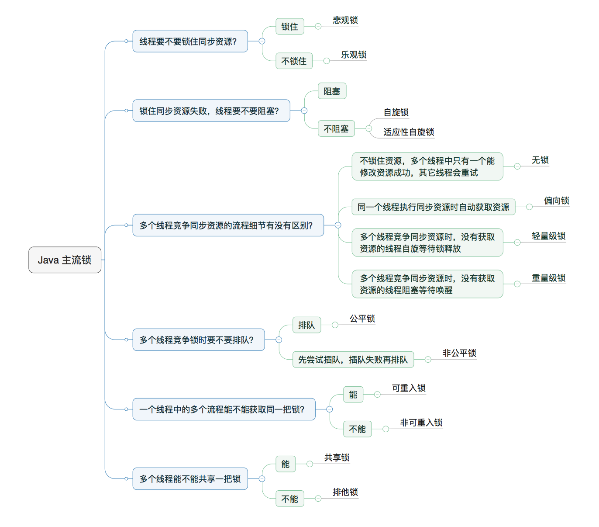
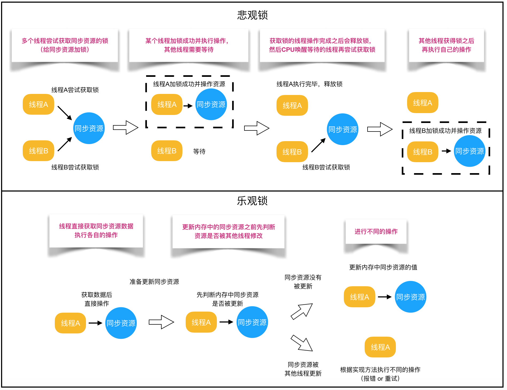
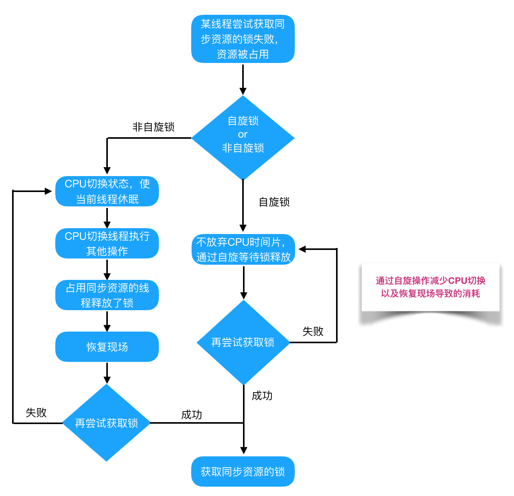
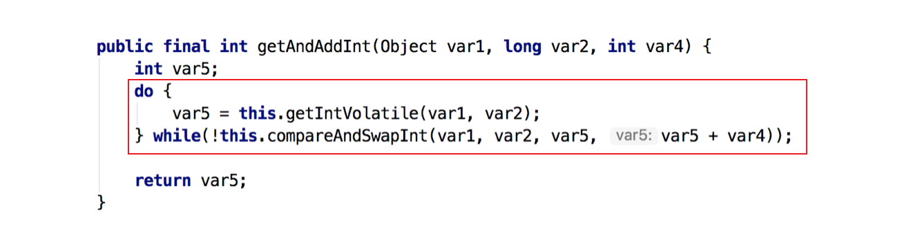
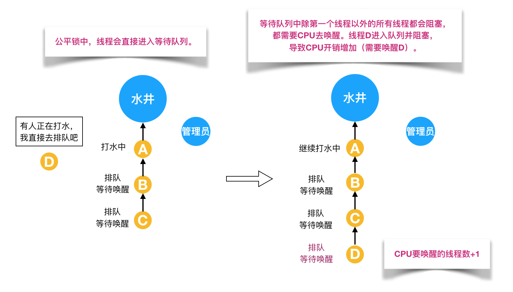
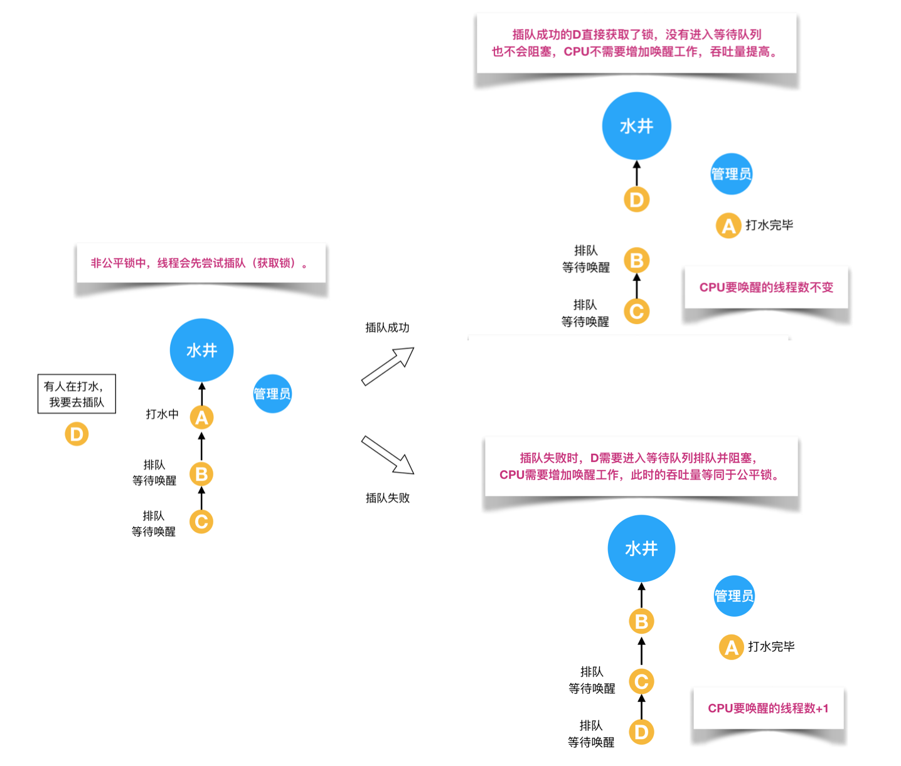
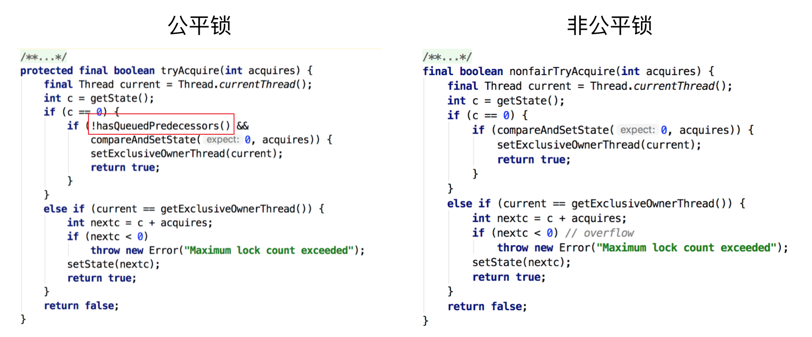
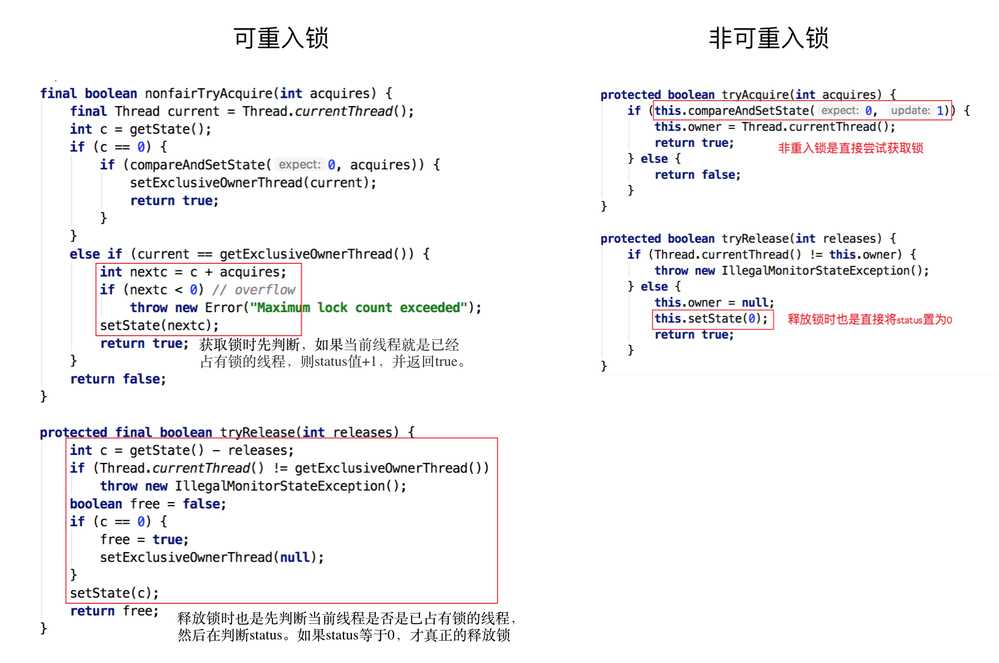
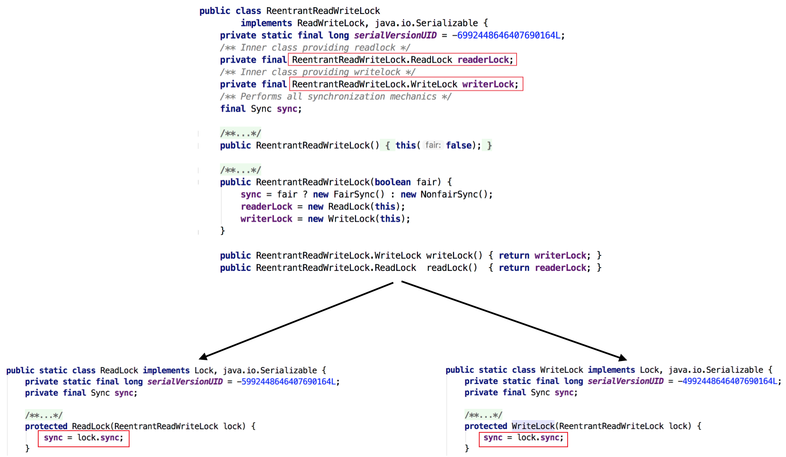

# Java 锁详解

## 1.锁的类型

java 提供了种类丰富的锁，每种锁因其特性的不同，在适当的场景下能够展现出非常高的效率。本文旨在对锁相关源码（本文中的源码来自 JDK 8 和 Netty 3.10.6）、使用场景进行举例，为读者介绍主流锁的知识点，以及不同的锁的适用场景。java 中往往是按照是否含有某一特性来定义锁，我们通过特性将锁进行分组归类，再使用对比的方式进行介绍，帮助大家更快捷的理解相关知识。下面给出本文内容的总体分类目录：

<div align="center">
    
</div>

## 2.乐观锁和悲观锁

乐观锁与悲观锁是一种广义上的概念，体现了看待线程同步的不同角度。在Java和数据库中都有此概念对应的实际应用。先说概念。对于同一个数据的并发操作，有以下两种认知：

- **<font color="red">悲观锁认为自己在使用数据的时候一定有别的线程来修改数据，因此在获取数据的时候会先加锁</font>**，确保数据不会被别的线程修改。Java 中，synchronized 关键字和 Lock 的实现类都是悲观锁。
- **<font color="red">乐观锁认为自己在使用数据时不会有别的线程修改数据，所以不会添加锁</font>**，只是在更新数据的时候去判断之前有没有别的线程更新了这个数据。如果这个数据没有被更新，当前线程将自己修改的数据成功写入。如果数据已经被其他线程更新，则根据不同的实现方式执行不同的操作（例如报错或者自动重试）。

乐观锁在 Java 中是通过使用无锁编程来实现，最常采用的是 CAS 算法，Java 原子类中的递增操作就通过CAS自旋实现的。

<div align="center">
    
</div>

光说概念有些抽象，我们来看下乐观锁和悲观锁的调用方式示例：

```java{.line-numbers}
// ------------------------- 悲观锁的调用方式 -------------------------
// synchronized
public synchronized void testMethod() {
  // 操作同步资源
}
// ReentrantLock
private ReentrantLock lock = new ReentrantLock(); // 需要保证多个线程使用的是同一个锁
public void modifyPublicResources() {
  lock.lock();
  // 操作同步资源
  lock.unlock();
}

// ------------------------- 乐观锁的调用方式 -------------------------
private AtomicInteger atomicInteger = new AtomicInteger();  // 需要保证多个线程使用的是同一个AtomicInteger
atomicInteger.incrementAndGet(); //执行自增1 
```

通过调用方式示例，我们可以发现 **<font color="red">悲观锁基本都是在显式的锁定之后再操作同步资源，而乐观锁则直接去操作同步资源</font>**。那么，为何乐观锁能够做到不锁定同步资源也可以正确的实现线程同步呢？我们通过介绍乐观锁的主要实现方式 “CAS” 的技术原理来为大家解惑。CAS 全称 Compare And Swap（比较与交换），是一种无锁算法。在不使用锁（没有线程被阻塞）的情况下实现多线程之间的变量同步。**`java.util.concurrent`** 包中的原子类就是通过 CAS 来实现了乐观锁。

CAS 算法涉及到三个操作数：

- 需要读写的内存值 V。
- 进行比较的值 A。
- 要写入的新值 B。

当且仅当 V 的值等于 A 时，CAS 通过原子方式用新值 B 来更新 V 的值（“比较+ 更新”整体是一个原子操作），否则不会执行任何操作。一般情况下，“更新”是一个不断重试的操作。之前提到 **`java.util.concurrent`** 包中的原子类，就是通过 CAS 来实现了乐观锁，那么我们进入原子类 AtomicInteger 的源码，看一下 AtomicInteger 中 incrementAndGet 方法的定义：

```java{.line-numbers}
// ------------------------- JDK 8 -------------------------
// AtomicInteger 自增方法
public final int incrementAndGet() {
  return unsafe.getAndAddInt(this, valueOffset, 1) + 1;
}

// Unsafe.class
public final int getAndAddInt(Object var1, long var2, int var4) {
  int var5;
  do {
      var5 = this.getIntVolatile(var1, var2);
  } while(!this.compareAndSwapInt(var1, var2, var5, var5 + var4));
  return var5;
}

// ------------------------- OpenJDK 8 -------------------------
// Unsafe.java
public final int getAndAddInt(Object o, long offset, int delta) {
   int v;
   do {
       v = getIntVolatile(o, offset);
   } while (!compareAndSwapInt(o, offset, v, v + delta));
   return v;
} 
```

根据 OpenJDK 8 的源码我们可以看出，**`getAndAddInt()`** 循环获取给定对象 o 中的偏移量处的值 v，然后判断内存值是否等于 v。如果相等则将内存值设置为 v + delta，否则返回 false，继续循环进行重试，直到设置成功才能退出循环，并且将旧值返回。整个“比较+ 更新”操作封装在 **`compareAndSwapInt()`** 中，在 JNI 里是借助于一个 CPU 指令完成的，属于原子操作，可以保证多个线程都能够看到同一个变量的修改值。

## 3.自旋锁和适应性自旋

在介绍自旋锁前，我们需要介绍一些前提知识来帮助大家明白自旋锁的概念。**<font color="red">阻塞或唤醒一个 java 线程需要操作系统内核态和用户态的切换来完成，这种状态转换需要耗费处理器时间</font>**。如果同步代码块中的内容过于简单，状态转换消耗的时间有可能比用户代码执行的时间还要长。如果物理机器有多个处理器，能够让两个或以上的线程同时并行执行，我们就可以让后面那个请求锁的线程不放弃 CPU 的执行时间，看看持有锁的线程是否很快就会释放锁。

而为了让当前线程“稍等一下”，我们需让当前线程进行自旋，如果在自旋完成后，前面锁定同步资源的线程已经释放了锁，那么当前线程就可以不必阻塞而是直接获取同步资源，从而避免切换线程的开销。这就是自旋锁。

<div align="center">
    
</div>

自旋锁本身是有缺点的，它不能代替阻塞。自旋等待虽然避免了线程切换的开销，但它要占用处理器时间。如果锁被占用的时间很短，自旋等待的效果就会非常好。反之，如果锁被占用的时间很长，那么自旋的线程只会白浪费处理器资源。所以，自旋等待的时间必须要有一定的限度，如果自旋超过了限定次数（默认是 10 次，可以使用 -XX:PreBlockSpin 来更改）没有成功获得锁，就应当挂起线程。

自旋锁的实现原理同样也是 CAS，AtomicInteger 中调用 unsafe 进行自增操作的源码中的 do-while 循环就是一个自旋操作，如果修改数值失败则通过循环来执行自旋，直至修改成功。

<div align="center">
    
</div>

自旋锁在 JDK1.4.2 中引入，使用 -XX:+UseSpinning 来开启。JDK 6 中变为默认开启，并且引入了自适应的自旋锁（适应性自旋锁）。自适应意味着自旋的时间（次数）不再固定，而是由前一次在同一个锁上的自旋时间及锁的拥有者的状态来决定。如果在同一个锁对象上，自旋等待刚刚成功获得过锁，并且持有锁的线程正在运行中，那么虚拟机就会认为这次自旋也是很有可能再次成功，进而它将允许自旋等待持续相对更长的时间。如果对于某个锁，自旋很少成功获得过，那在以后尝试获取这个锁时将可能省略掉自旋过程，直接阻塞线程，避免浪费处理器资源。

## 4.公平锁和非公平锁

**<font color="red">公平锁是指多个线程按照申请锁的顺序来获取锁，线程直接进入队列中排队，队列中的第一个线程才能获得锁</font>**。公平锁的优点和缺点如下所示：

- 优点：锁的线程不会饿死。
- 缺点：是整体吞吐效率相对非公平锁要低。

**<font color="red">非公平锁是多个线程加锁时直接尝试获取锁，获取不到才会到等待队列的队尾等待</font>**。但如果此时锁刚好可用，那么这个线程可以无需阻塞直接获取到锁，所以非公平锁有可能出现后申请锁的线程先获取锁的场景。非公平锁的优点和缺点：

- 优点：整体的吞吐效率高。
- 缺点是处于等待队列中的线程可能会饿死，或者等很久才会获得锁。

直接用语言描述可能有点抽象，这里作者用从别处看到的一个例子来讲述一下公平锁和非公平锁。

<div align="center">
    
</div>

如上图所示，假设有一口水井，有管理员看守，管理员有一把锁，只有拿到锁的人才能够打水，打完水要把锁还给管理员。每个过来打水的人都要管理员的允许并拿到锁之后才能去打水，如果前面有人正在打水，那么这个想要打水的人就必须排队。管理员会查看下一个要去打水的人是不是队伍里排最前面的人，如果是的话，才会给你锁让你去打水；如果你不是排第一的人，就必须去队尾排队，这就是公平锁。

但是对于非公平锁，管理员对打水的人没有要求。即使等待队伍里有排队等待的人，但如果在上一个人刚打完水把锁还给管理员而且管理员还没有允许等待队伍里下一个人去打水时，刚好来了一个插队的人，这个插队的人是可以直接从管理员那里拿到锁去打水，不需要排队，原本排队等待的人只能继续等待。如下图所示：

<div align="center">
    
</div>

根据代码可知，ReentrantLock 里面有一个内部类 Sync，Sync 继承 AQS（AbstractQueuedSynchronizer），添加锁和释放锁的大部分操作实际上都是在 Sync 中实现的。它有公平锁 FairSync 和非公平锁 NonfairSync 两个子类。ReentrantLock 默认使用非公平锁，也可以通过构造器来显示的指定使用公平锁。下面我们来看一下公平锁与非公平锁的加锁方法的源码:

<div align="center">
    
</div>

通过上图中的源代码对比，我们可以明显的看出公平锁与非公平锁的 lock() 方法唯一的区别就在于公平锁在获取同步状态时多了一个限制条件：**`hasQueuedPredecessors()`**。再进入 **`hasQueuedPredecessors()`**，可以看到该方法主要做一件事情：主要是判断当前线程是否位于同步队列中的第一个。如果是则返回 true，否则返回 false。

## 5.可重入锁和不可重入锁

可重入锁又名递归锁，是指在同一个线程在外层方法获取锁的时候，再进入该线程的内层方法会自动获取锁（前提锁对象得是同一个对象或者 class），不会因为之前已经获取过还没释放而阻塞。Java 中 ReentrantLock 和 synchronized 都是可重入锁，可重入锁的一个优点是可一定程度避免死锁。下面用示例代码来进行分析：

```java{.line-numbers}
public class Widget {
    public synchronized void doSomething() {
        System.out.println("方法1执行...");
        doOthers();
    }

    public synchronized void doOthers() {
        System.out.println("方法2执行...");
    }
} 
```

在上面的代码中，类中的两个方法都是被内置锁 synchronized 修饰的，doSomething() 方法中调用 **`doOthers()`** 方法。因为内置锁是可重入的，所以同一个线程在调用 **`doOthers()`** 时可以直接获得当前对象的锁，进入 **`doOthers()`** 进行操作。如果是一个不可重入锁，那么当前线程在调用 **`doOthers()`** 之前需要将执行 **`doSomething()`** 时获取当前对象的锁释放掉，实际上该对象锁已被当前线程所持有，且无法释放。所以此时会出现死锁。

之前我们说过 ReentrantLock 和 synchronized 都是重入锁，那么我们通过重入锁 ReentrantLock 以及非可重入锁 NonReentrantLock 的源码来对比分析一下为什么非可重入锁在重复调用同步资源时会出现死锁。首先 ReentrantLock 和 NonReentrantLock 都继承父类 AQS，其父类 AQS 中维护了一个同步状态 status 来计数重入次数，status 初始值为 0。

当线程尝试获取锁时，可重入锁先尝试获取并更新 status 值，如果 status == 0 表示没有其他线程在执行同步代码，则把 status 置为 1，当前线程开始执行。如果 status != 0，则判断当前线程是否是获取到这个锁的线程，如果是的话执行 status+1，且当前线程可以再次获取锁。而非可重入锁是直接去获取并尝试更新当前 status 的值，如果 status != 0 的话会导致其获取锁失败，当前线程阻塞。

释放锁时，可重入锁同样先获取当前 status 的值，在当前线程是持有锁的线程的前提下。如果 status-1 == 0，则表示当前线程所有重复获取锁的操作都已经执行完毕，然后该线程才会真正释放锁。而非可重入锁则是在确定当前线程是持有锁的线程之后，直接将 status 置为 0，将锁释放。

<div align="center">
    
</div>

## 6.独享锁和共享锁

独享锁和共享锁同样是一种概念。我们先介绍一下具体的概念，然后通过 ReentrantLock 和 ReentrantReadWriteLock 的源码来介绍独享锁和共享锁。

- 独享锁也叫排他锁，是指该锁一次只能被一个线程所持有。如果线程 T 对数据 A 加上排它锁后，则其他线程不能再对 A 加任何类型的锁。获得排它锁的线程即能读数据又能修改数据。JDK 中的 synchronized 和 JUC 中 Lock 的实现类就是互斥锁。
- 共享锁是指该锁可被多个线程所持有。如果线程 T 对数据 A 加上共享锁后，则其他线程只能对 A 再加共享锁，不能加排它锁。获得共享锁的线程只能读数据，不能修改数据。

独享锁与共享锁也是通过 AQS 来实现的，通过实现不同的方法，来实现独享或者共享。下图为 ReentrantReadWriteLock 的部分源码：

<div align="center">
    
</div>

我们看到 ReentrantReadWriteLock 有两把锁：ReadLock 和 WriteLock，由词知意，一个读锁一个写锁，合称“读写锁”。再进一步观察可以发现 ReadLock 和 WriteLock 是靠内部类 Sync 实现的锁。Sync 是 AQS 的一个子类，这种结构在 CountDownLatch、ReentrantLock、Semaphore 里面也都存在。

在 ReentrantReadWriteLock 里面，读锁和写锁的锁主体都是 Sync，但读锁和写锁的加锁方式不一样。读锁是共享锁，写锁是独享锁。读锁的共享锁可保证并发读非常高效，而读写、写读、写写的过程互斥，因为读锁和写锁是分离的。所以 ReentrantReadWriteLock 的并发性相比一般的互斥锁有了很大提升。