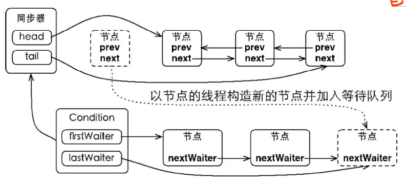

# Lock 和 Condition 详解

## 1.前言

前面几篇我们学习了 synchronized 同步代码块，了解了 java 的内置锁，并学习了监视器锁的 wait/notify 机制。在大多数情况下，内置锁都能很好的工作，但它在功能上存在一些局限性，例如无法实现非阻塞结构的加锁规则等。为了拓展同步代码块中的监视器锁，java 1.5 开始，出现了 lock 接口，它实现了可定时、可轮询与可中断的锁获取操作，公平队列，以及非块结构的锁。

与内置锁不同，Lock 是一种显式锁，它更加“危险”，因为在程序离开被锁保护的代码块时，不会像监视器锁那样自动释放，需要我们手动释放锁。**<font color="red">所以，在我们使用 lock 锁时，一定要记得：在 finally 块中调用 `lock.unlock()` 手动释放锁</font>**。

## 2.Lock 接口

```java{.line-numbers}
public interface Lock {
    void lock();
    void lockInterruptibly() throws InterruptedException;
    
    boolean tryLock();
    boolean tryLock(long time, TimeUnit unit) throws InterruptedException;

    void unlock();
    
    Condition newCondition();
} 
```

典型的使用方式：

```java{.line-numbers}
Lock l = ...;
l.lock();
try {
    // access the resource protected by this lock
} finally {
    l.unlock();
} 
```

### 2.1 锁的获取

Lock 接口定义了四种获取锁的方式，下面我们一个个来看：

- **`lock()`**：**<font color="red">阻塞式获取，在没有获取到锁时，当前线程将会休眠，不会参与线程调度，直到获取到锁为止，获取锁的过程中不响应中断</font>**。
- **`lockInterruptibly()`**：阻塞式获取，并且可中断，在 InterruptedException 抛出后，当前线程的中断标志位将会被清除
- **`tryLock()`**：非阻塞式获取，从名字中也可以看出，try 就是试一试的意思，无论成功与否，该方法都是立即返回的。**<font color="red">相比前面两种阻塞式获取的方式，该方法是有返回值的，获取锁成功了则返回 true，获取锁失败了则返回 false</font>**。
- **`tryLock(long time, TimeUnit unit)`**：带超时机制，并且可中断，如果可以获取到锁，则立即返回 true，如果获取不到锁，则当前线程将会休眠，不会参与线程调度，在 InterruptedException 抛出后，当前线程的中断标志位将会被清除，如果超时时间到了，当前线程还没有获得锁，则会直接返回 false (注意，这里并没有抛出超时异常)。 这里把四种锁的获取方式总结如下：

<div align="center">
    
</div>

### 2.2 锁的释放

相对于锁的获取，锁的释放的方法就简单的多，只有一个

```java{.line-numbers}
void unlock();
```

值得注意的是，只有拥有的锁的线程才能释放锁，并且，必须显式地释放锁，这一点和离开同步代码块就自动被释放的监视器锁是不同的。

### 2.3 newCondition

Lock 接口还定义了一个 newCondition 方法：

```java{.line-numbers}
Condition newCondition();
```

该方法将创建一个绑定在当前 Lock 对象上的 Condition 对象，这说明 Condition 对象和 Lock 对象是对应的，一个 Lock 对象可以创建多个 Condition 对象，它们是一对多的关系。

## 3.Condition 接口

上面我们说道，Lock 接口中定义了 newCondition 方法，它返回一个关联在当前 Lock 对象上的 Condition 对象，下面我们来看看这个 Condition 对象是个啥。每一个新工具的出现总是为了解决一定的问题，Condition 接口的出现也不例外。如果说 Lock 接口的出现是为了拓展现有的监视器锁，那么 Condition 接口的出现就是为了拓展同步代码块中的 wait, notify 机制。

### 3.1 Condition 的 await/signal 机制

既然前面说了 Condition 接口的出现是为了拓展现有的 wait/notify 机制，那我们就先来看看现有的 wait/notify 机制有哪些方法：

```java{.line-numbers}
public class Object {
    public final void wait() throws InterruptedException {
            wait(0);
    }
    public final native void wait(long timeout) throws InterruptedException;
    public final void wait(long timeout, int nanos) throws InterruptedException {
            // 这里省略方法的实现
    }
    public final native void notify();
    public final native void notifyAll();
}
```

接下来我们再看看 Condition 接口有哪些方法：

<div align="center">
    
</div>

任意一个 Java 对象，都拥有一组监视器方法（定义在 java.lang.Object 上），主要包括 **`wait()`**、**`wait(long timeout)`**、**`notify()`** 以及 **`notifyAll()`** 方法，这些方法与 synchronized 同步关键字配合，可以实现等待/通知模式。Condition 接口也提供了类似 Object 的监视器方法，与 Lock 配合可以实现等待/通知模式，但是这两者在使用方式以及功能特性上还是有差别的。

### 3.2 Condition 接口与示例

Condition 定义了等待/通知两种类型的方法，当前线程调用这些方法时，需要提前获取到 Condition 对象关联的锁。Condition 对象是由 Lock 对象（调用 Lock 对象的 newCondition() 方法）创建出来的，换句话说，Condition 是依赖 Lock 对象的。Condition的使用方式比较简单，需要注意在调用方法前获取锁，使用方式如下所示：

```java{.line-numbers}
Lock lock = new ReentrantLock();
Condition condition = lock.newCondition();
public void conditionWait() throws InterruptedException {
    lock.lock();
    try {
        condition.await();
    } finally {
        lock.unlock();
    }
}
public void conditionSignal() throws InterruptedException {
    lock.lock();
    try {
        condition.signal();
    } finally {
        lock.unlock();
    }
} 
```

如示例所示，一般都会将 Condition 对象作为成员变量。**<font color="red">当调用 await() 方法后，当前线程会释放锁并在此等待</font>**，而其他线程调用 Condition 对象的 signal() 方法，通知当前线程后，**<font color="red">并且如果当前线程获取了锁</font>**，才会从 await() 方法返回。

### 3.3 Condition 的实现分析

ConditionObject 是同步器 AbstractQueuedSynchronizer 的内部类，因为 Condition 的操作需要获取相关联的锁，所以作为同步器的内部类也较为合理。**<font color="red">每个 Condition 对象都包含着一个队列（以下称为等待队列），该队列是 Condition 对象实现等待/通知功能的关键</font>**。下面将分析 Condition 的实现，主要包括：等待队列、等待和通知，下面提到的 Condition 如果不加说明均指的是 ConditionObject。

#### 3.3.1 等待队列

等待队列是一个 FIFO 的队列，在队列中的每个节点都包含了一个线程引用，该线程就是在 Condition 对象上等待的线程，如果一个线程调用了 Condition.await() 方法，那么该线程将会释放锁、构造成节点加入等待队列并进入等待状态。事实上，节点的定义复用了同步器中节点的定义，**<font color="red">也就是说，同步队列和等待队列中节点类型都是同步器的静态内部类 `AbstractQueuedSynchronizer.Node`</font>**。

一个 Condition 包含一个等待队列，Condition 拥有首节点（firstWaiter）和尾节点（lastWaiter）。当前线程调用 Condition.await() 方法，将会以当前线程构造节点，并将节点从尾部加入等待队列，等待队列的基本结构如下图所示：

<div align="center">
    
</div>

如图所示，Condition 拥有首尾节点的引用，而新增节点只需要将原有的尾节点 nextWaiter 指向它，并且更新尾节点即可。上述节点引用更新的过程并没有使用 CAS 保证，原因在于调用 await() 方法的线程必定是获取了锁的线程，也就是说该过程是由锁来保证线程安全的。 在 Object 的监视器模型上，一个对象拥有一个同步队列和等待队列，而并发包中的 Lock（更确切地说是同步器）拥有一个同步队列和多个等待队列（一个 Lock 可以创建多个 Condition 对象），其对应关系如下图所示：

<div align="center">
    
</div>

#### 3.3.2 等待

调用 Condition 的 await() 方法（或者以 await 开头的方法），会使当前线程进入等待队列并释放锁，同时线程状态变为等待状态。如果从队列（同步队列和等待队列）的角度看 await() 方法，**<font color="red">当调用 await() 方法时，相当于同步队列的首节点（获取了锁的节点）移动到 Condition 的等待队列中</font>**。当从 await() 方法返回时，当前线程一定获取了 Condition 相关联的锁。

调用该方法的线程是成功获取了锁的线程，也就是同步队列中的首节点，该方法会将当前线程构造成节点并加入等待队列中，然后释放同步状态，唤醒同步队列中的后继节点，然后当前线程会进入等待状态。如果从队列的角度去看，当前线程加入 Condition 的等待队列，该过程如下图所示：

<div align="center">
    
</div>

#### 3.3.3 通知

调用 Condition 的 **`signal()`** 方法，将会唤醒在等待队列中等待时间最长的节点（首节点），在唤醒节点之前，会将节点移到同步队列中。节点从等待队列移动到同步队列的过程如下图所示：

<div align="center">
    
</div>

通过调用同步器的 enq(Node node) 方法，等待队列中的头节点线程安全地移动到同步队列。**<font color="red">当节点移动到同步队列后，当前线程再使用 LockSupport 唤醒该节点的线程。被唤醒后的线程，将从 `await()` 方法中的 while 循环中退出（`isOnSyncQueue(Node node)` 方法返回 true，节点已经在同步队列中），进而调用同步器的 `acquireQueued()` 方法加入到获取同步状态的竞争中。成功获取同步状态（或者说锁）之后，被唤醒的线程将从先前调用的 `await()` 方法返回</font>**，此时该线程已经成功地获取了锁。

Condition 的 **`signalAll()`** 方法，相当于对等待队列中的每个节点均执行一次 **`signal()`** 方法，效果就是将等待队列中所有节点全部移动到同步队列中，并唤醒每个节点的线程。