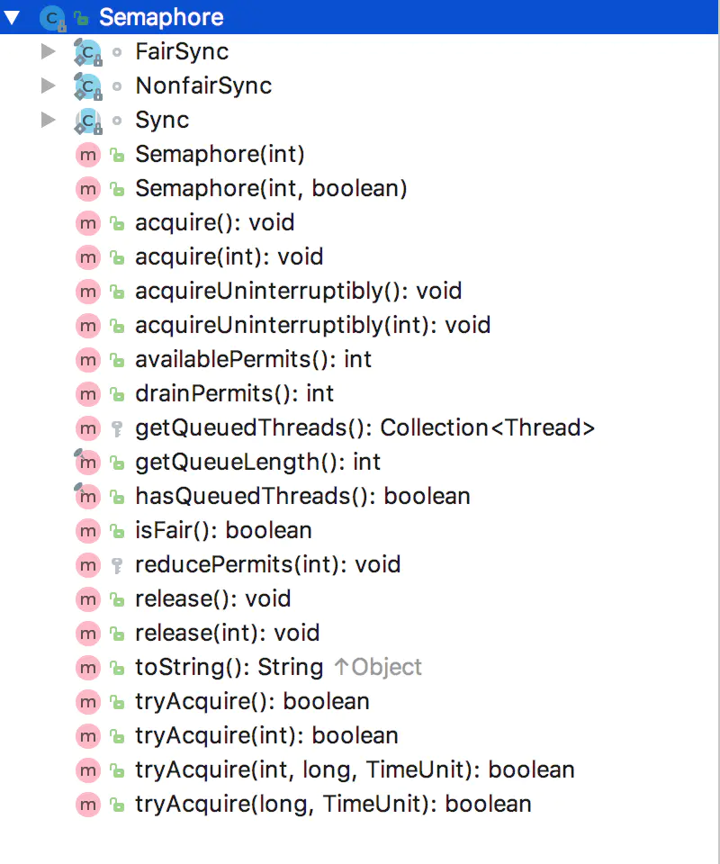
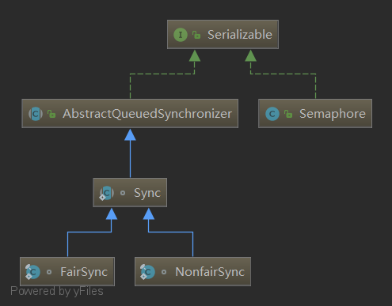

# Semaphore 详解

## 1.前言

Semaphore 实现为一种基于计数的信号量，Semaphore 管理着一组虚拟的许可集合，这种许可可以作为某种凭证，来管理资源，在一些资源有限的场景下很有实用性，比如数据库连接，应用可初始化一组数据库连接，然后通过使用 Semaphore 来管理获取连接的许可，任何线程想要获得一个连接必须首先获得一个许可，然后再凭这个许可获得一个连接，这个许可将持续到这个线程归还了连接。在使用上，任何一个线程都需要通过 acquire 来获得一个 Semaphore 许可，这个操作可能会阻塞线程直到成功获得一个许可，因为资源是有限的，所以许可也是有限的，没有获得资源就需要阻塞等待其他线程归还 Semaphore，而归还 Semaphore 操作通过 release 方法来进行，release 会唤醒一个等待在 Semaphore 上的一个线程来尝试获得许可。如果想要达到一种互斥的效果，比如任何时刻只能有一个线程获得许可，那么就可以初始化 Semaphore 的数量为 1，一个线程获得这个 Semaphore 之后，任何到来的通过 acquire 来尝试获得许可的线程都会被阻塞直到这个持有 Semaphore 的线程调用了 release 方法来释放 Semaphore。

在实现上，Semaphore 借助了线程同步框架 AQS，AQS 的分析可以参考文章 Java 同步框架 AbstractQueuedSynchronizer，同样借助了 AQS 来实现的是 java 中的可重入锁的实现，同样你可以在文章 Java 可重入锁详解中找到 java 中可重入锁的分析总结文档。在这些文章中已经分析过如何通过 AQS 来实现锁的语义，本文将继续分析 AQS 的应用实例，Semaphore 作为一种线程间同步机制是非常轻量级的方案，所以学习和掌握 Semaphore 是有必要的。

## 2.信号量 Semaphore

Semaphore 的实现借助了同步框架 AQS，下面的图片展示了 Semaphore 的代码结构，Semaphore 使用一个内部类 Sync 来实现，而 Sync 继承了 AQS 来实现，Sync 有两个子类，分别对应着公平模式和非公平模式的 Semaphore，下文中会分析两者的实现细节。

<div align="center">
    
</div>

下面是 Semaphore 的类结构：

<div align="center">
    
</div>

## 3.源码分析

### 3.1 内部 Sync 类的源代码

```java{.line-numbers}
abstract static class Sync extends AbstractQueuedSynchronizer {
    private static final long serialVersionUID = 1192457210091910933L;
    // 构造方法，传入许可次数，放入state中
    Sync(int permits) {
        setState(permits);
    }
    // 获取许可次数
    final int getPermits() {
        return getState();
    }
    // 非公平模式尝试获取许可
    final int nonfairTryAcquireShared(int acquires) {
        for (;;) {
            // 看看还有几个许可
            int available = getState();
            // 减去这次需要获取的许可还剩下几个许可
            int remaining = available - acquires;
            // 如果剩余许可小于0了则直接返回
            // 如果剩余许可不小于0，则尝试原子更新state的值，成功了返回剩余许可
            if (remaining < 0 ||
                compareAndSetState(available, remaining))
                return remaining;
        }
    }
    // 释放许可
    protected final boolean tryReleaseShared(int releases) {
        for (;;) {
            // 看看还有几个许可
            int current = getState();
            // 加上这次释放的许可
            int next = current + releases;
            // 检测溢出
            if (next < current) // overflow
                throw new Error("Maximum permit count exceeded");
            // 如果原子更新state的值成功，就说明释放许可成功，则返回true
            if (compareAndSetState(current, next))
                return true;
        }
    }
    // 减少许可
    final void reducePermits(int reductions) {
        for (;;) {
            // 看看还有几个许可
            int current = getState();
            // 减去将要减少的许可
            int next = current - reductions;
            // 检测举出
            if (next > current) // underflow
                throw new Error("Permit count underflow");
            // 原子更新state的值，成功了返回true
            if (compareAndSetState(current, next))
                return;
        }
    }
    // 销毁许可
    final int drainPermits() {
        for (;;) {
            // 看看还有几个许可
            int current = getState();
            // 如果为0，直接返回
            // 如果不为0，把state原子更新为0
            if (current == 0 || compareAndSetState(current, 0))
                return current;
        }
    }
} 
```

通过 Sync 的几个实现方法，我们获取到以下几点信息：

- 许可数量是在构造方法时传入的；
- 许可数量存放在状态变量 state 中；
- 尝试获取一个许可的时候，则 state 的值减 1；
- 当 state 的值为 0 的时候，则无法再获取许可；
- 释放一个许可的时候，则 state 的值加 1；
- 许可的个数可以动态改变；

### 3.2 内部 NonFairSync 源代码

```java{.line-numbers}
static final class NonfairSync extends Sync {
    private static final long serialVersionUID = -2694183684443567898L;
    // 构造方法，调用父类的构造方法
    NonfairSync(int permits) {
        super(permits);
    }
    // 尝试获取许可，调用父类的nonfairTryAcquireShared()方法
    protected int tryAcquireShared(int acquires) {
        return nonfairTryAcquireShared(acquires);
    }
} 
```

非公平模式下，直接调用父类的 nonfairTryAcquireShared() 尝试获取许可。

### 3.3 内部 FairSync 源代码

```java{.line-numbers}
static final class FairSync extends Sync {
    private static final long serialVersionUID = 2014338818796000944L;
    // 构造方法，调用父类的构造方法
    FairSync(int permits) {
        super(permits);
    }
    // 尝试获取许可
    protected int tryAcquireShared(int acquires) {
        for (;;) {
            // 公平模式需要检测是否前面有排队的
            // 如果有排队的直接返回失败
            if (hasQueuedPredecessors())
                return -1;
            // 没有排队的再尝试更新state的值
            int available = getState();
            int remaining = available - acquires;
            if (remaining < 0 ||
                compareAndSetState(available, remaining))
                return remaining;
        }
    }
} 
```

公平模式下，先检测前面是否有排队的，如果有排队的则获取许可失败，进入队列排队，否则尝试原子更新 state 的值。hasQueuedPredecessors 方法表示的是是否有线程在等待许可，如果已经有线程在等待了，那么直接返回-1 代表获取许可失败，否则再去获取，获取许可就是通过 compareAndSetState 方法来更新 state 的值。**<font color="red">非公平模式和公平模式的区别在于公平模式会考虑是否已经有线程在等待，而非公平模式会快速去竞争，不会考虑是否有线程在前面等待</font>**。

下面来分析一下上面分析的两个方法是如何被调用的，上文中提到，我们是通过使用 acquire 方法来获得一个许可的，下面是 Semaphore 的 acquire 方法：

```java{.line-numbers}

public void acquire() throws InterruptedException {
    sync.acquireSharedInterruptibly(1);
}

public final void acquireSharedInterruptibly(int arg)
        throws InterruptedException {
    if (Thread.interrupted())
        throw new InterruptedException();
    if (tryAcquireShared(arg) < 0)
        doAcquireSharedInterruptibly(arg);
}
```

acquire 方法调用了 AQS 基类的 acquireSharedInterruptibly 方法，而 acquireSharedInterruptibly 方法调用了其子类的 tryAcquireShared 方法，对应了公平模式和非公平模式下的 tryAcquireShared 方法。上面分析了获取许可的方法 acquire，下面再来分析一下归还许可的方法 release：

```java{.line-numbers}
public void release() {
    sync.releaseShared(1);
}

public final boolean releaseShared(int arg) {
    if (tryReleaseShared(arg)) {
        doReleaseShared();
        return true;
    }
    return false;
}    

protected final boolean tryReleaseShared(int releases) {
    for (;;) {
        int current = getState();
        int next = current + releases;
        if (next < current) // overflow
            throw new Error("Maximum permit count exceeded");
        if (compareAndSetState(current, next))
            return true;
    }
} 
```

获取许可是通过减少 state 来完成的，而归还许可则是通过增加 state 来完成的，AQS 通过维护一个共享变量 state 来实现多线程同步。

