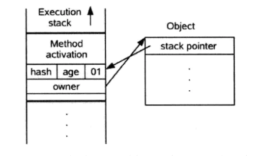

# Synchronized 详解

## 一、Synchronized 使用

### 1.简介

在 Java 中，关键字 synchronized 可以保证在同一个时刻，只有一个线程可以执行某个方法或者某个代码块(主要是对方法或者代码块中存在共享数据的操作)，同时我们还应该注意到 synchronized 另外一个重要的作用，**<font color="red">`synchronized` 可保证一个线程的变化(主要是共享数据的变化)被其他线程所看到</font>**（保证可见性，完全可以替代 volatile 功能），这点确实也是很重要的。

### 2.Synchronized 三种应用方式

Synchronized 关键字最主要有以下3种应用方式，下面分别介绍：

- 修饰实例方法，作用于当前实例加锁，进入同步代码前要获得当前实例的锁；
- 修饰静态方法，作用于当前类对象加锁，进入同步代码前要获得当前类对象的锁；
- 修饰代码块，指定加锁对象，对给定对象加锁，进入同步代码块前要获得给定对象的锁；

### 3.Synchronized 作用于实例方法

所谓的实例对象锁就是用 synchronized 修饰实例对象中的实例方法，注意是实例方法不包括静态方法，如下：

```java{.line-numbers}
public class AccountingSync implements Runnable{
    // 共享资源(临界资源)
    static int i=0;

    /**
     * synchronized 修饰实例方法
     */
    public synchronized void increase(){
        i++;
    }
    @Override
    public void run() {
        for(int j=0;j<1000000;j++){
            increase();
        }
    }
    public static void main(String[] args) throws InterruptedException {
        AccountingSync instance=new AccountingSync();
        Thread t1=new Thread(instance);
        Thread t2=new Thread(instance);
        t1.start();
        t2.start();
        t1.join();
        t2.join();
        System.out.println(i);
    }
    /**
     * 输出结果:
     * 2000000
     */
} 
```

上述代码中，我们开启两个线程操作同一个共享资源即变量 i，由于 i++; 操作并不具备原子性，该操作是先读取值，原来的值加上 1，然后写回一个新值，分三步完成，如果第二个线程在第一个线程读取旧值和写回新值期间读取 i 的域值，那么第二个线程就会与第一个线程一起看到同一个值，并执行相同值的加 1 操作，这也就造成了线程安全失败，因此对于 increase 方法必须使用 synchronized 修饰，以便保证线程安全。

此时我们应该注意到 synchronized 修饰的是实例方法 increase，在这样的情况下，当前线程的锁便是实例对象 instance，注意 Java 中的线程同步锁可以是任意对象。从代码执行结果来看确实是正确的，倘若我们没有使用 synchronized 关键字，其最终输出结果就很可能小于 2000000，这便是 synchronized 关键字的作用。这里我们还需要意识到，**<font color="red">当一个线程正在访问一个对象的 synchronized 实例方法，那么其他线程不能访问该对象的其他 synchronized 方法，毕竟一个对象只有一把锁，当一个线程获取了该对象的锁之后，其他线程无法获取该对象的锁，所以无法访问该对象的其他 synchronized 实例方法</font>**，但是其他线程还是可以访问该实例对象的其他非 synchronized 方法。

当然如果是一个线程 A 需要访问实例对象 obj1 的 synchronized 方法 f1( 当前对象锁是 obj1)，另一个线程 B 需要访问实例对象 obj2 的 synchronized 方法 f2( 当前对象锁是 obj2)，这样是允许的，因为两个实例对象锁并不同相同，此时如果两个线程操作数据并非共享的，线程安全是有保障的，遗憾的是如果两个线程操作的是共享数据，那么线程安全就有可能无法保证了，如下代码将演示出该现象：

```java{.line-numbers}
public class AccountingSyncBad implements Runnable{
    static int i=0;
    public synchronized void increase(){
        i++;
    }
    @Override
    public void run() {
        for(int j=0;j<1000000;j++){
            increase();
        }
    }
    public static void main(String[] args) throws InterruptedException {
        // new 新实例
        Thread t1=new Thread(new AccountingSyncBad());
        // new 新实例
        Thread t2=new Thread(new AccountingSyncBad());
        t1.start();
        t2.start();
        // join 含义:当前线程 A 等待 thread 线程终止之后才能从 thread.join() 返回
        t1.join();
        t2.join();
        System.out.println(i);
    }
} 
```

上述代码与前面不同的是我们同时创建了两个新实例 AccountingSyncBad，然后启动两个不同的线程对共享变量 i 进行操作，但很遗憾操作结果是 1452317 而不是期望结果 2000000，因为上述代码犯了严重的错误，虽然我们使用synchronized修饰了 increase 方法，但却 new 了两个不同的实例对象，这也就意味着存在着两个不同的实例对象锁，因此 t1 和 t2 都会进入各自的对象锁，也就是说 t1 和 t2 线程使用的是不同的锁，因此线程安全是无法保证的。解决这种困境的的方式是将 synchronized 作用于静态的 increase 方法，这样的话，对象锁就当前类对象，由于无论创建多少个实例对象，但对于的类对象只有一个，所有在这样的情况下对象锁就是唯一的。

### 4.Synchronized 作用于静态方法

当 synchronized 作用于静态方法时，其锁就是当前类的 class 对象锁。由于静态成员不专属于任何一个实例对象，是类成员，因此通过 class 对象锁可以控制静态成员的并发操作。**<font color="red">需要注意的是如果一个线程 A 调用一个实例对象的非 static synchronized 方法，而线程 B 需要调用这个实例对象所属类的静态 synchronized 方法，是允许的，不会发生互斥现象</font>**，因为访问静态 synchronized 方法占用的锁是当前类的 class 对象，而访问非静态 synchronized 方法占用的锁是当前实例对象锁，看如下代码：

```java{.line-numbers}
public class AccountingSyncClass implements Runnable{
    static int i=0;

    /**
     * 作用于静态方法,锁是当前 class 对象, 也就是
     * AccountingSyncClass 类对应的 class 对象
     */
    public static synchronized void increase(){
        i++;
    }

    /**
     * 非静态,访问时锁不一样不会发生互斥
     */
    public synchronized void increase4Obj(){
        i++;
    }

    @Override
    public void run() {
        for(int j=0;j<1000000;j++){
            increase();
        }
    }
    public static void main(String[] args) throws InterruptedException {
        // new 新实例
        Thread t1=new Thread(new AccountingSyncClass());
        // new 新实例
        Thread t2=new Thread(new AccountingSyncClass());
        // 启动线程
        t1.start();t2.start();

        t1.join();t2.join();
        System.out.println(i);
    }
} 
```

### 5.Synchronized 同步代码块

除了使用关键字修饰实例方法和静态方法外，还可以使用同步代码块，在某些情况下，我们编写的方法体可能比较大，同时存在一些比较耗时的操作，而需要同步的代码又只有一小部分，如果直接对整个方法进行同步操作，可能会得不偿失，此时我们可以使用同步代码块的方式对需要同步的代码进行包裹，这样就无需对整个方法进行同步操作了，同步代码块的使用示例如下：

```java{.line-numbers}
public class AccountingSync implements Runnable{
    static AccountingSync instance=new AccountingSync();
    static int i=0;
    @Override
    public void run() {
        // 省略其他耗时操作....
        // 使用同步代码块对变量 i 进行同步操作,锁对象为 instance
        synchronized(instance){
            for(int j=0;j<1000000;j++){
                 i++;
            }
        }
    }
    public static void main(String[] args) throws InterruptedException {
        Thread t1=new Thread(instance);
        Thread t2=new Thread(instance);
        t1.start();t2.start();
        t1.join();t2.join();
        System.out.println(i);
    }
} 
```

从代码看出，将 synchronized 作用于一个给定的实例对象 instance，即当前实例对象就是锁对象，每次当线程进入 synchronized 包裹的代码块时就会要求当前线程持有 instance 实例对象锁。当然除了 instance 作为对象外，我们还可以使用 this 对象(代表当前实例)或者当前类的 class 对象作为锁，如下代码：

```java{.line-numbers}
//this,当前实例对象锁
synchronized(this){
    for(int j=0;j<1000000;j++){
        i++;
    }
}

//class对象锁
synchronized(AccountingSync.class){
    for(int j=0;j<1000000;j++){
        i++;
    }
} 
```

### 6.Synchronized 底层语义原理

Java 虚拟机中的同步 (Synchronization) 基于进入和退出管程 (Monitor) 对象实现， 无论是显式同步 (有明确的 monitorenter 和 monitorexit 指令, 即同步代码块) 还是隐式同步都是如此。在 Java 语言中，同步用的最多的地方可能是被 synchronized 修饰的同步方法。同步方法 并不是由 monitorenter 和 monitorexit 指令来实现同步的，而是由方法调用指令读取运行时常量池中方法的 ACC_SYNCHRONIZED 标志来隐式实现的，关于这点，稍后详细分析。下面先来了解一个概念 Java 对象头，这对深入理解synchronized 实现原理非常关键。

在 JVM 中，对象在内存中的布局分为三块区域：对象头、实例数据和对齐填充。如下：

<div align="center">
    
</div>

其中，对象头 Mark Word 的结构如下：

<div align="center">
    
</div>

其中轻量级锁和偏向锁是 Java 6 对 synchronized 锁进行优化后新增加的，稍后我们会简要分析。这里我们主要分析一下重量级锁也就是通常说 synchronized 的对象锁，锁标识位为 10，**<font color="red">其中指针指向的是 monitor 对象。每个对象都存在着一个 monitor 与之关联，当一个 monitor 被某个线程持有后，它便处于锁定状态</font>**。

由此看来，monitor 对象存在于每个 Java 对象的对象头中(存储的指针的指向)，synchronized 锁便是通过这种方式获取锁的，也是为什么Java中任意对象可以作为锁的原因。

### 7.Synchronized 代码块底层原理

现在我们重新定义一个 synchronized 修饰的同步代码块，在代码块中操作共享变量 i，如下：

```java{.line-numbers}
public class SyncCodeBlock {
   public int i;
   public void syncTask(){
       //同步代码库
       synchronized (this){
           i++;
       }
   }
} 
```

编译上述代码并使用 javap 反编译后得到字节码如下(这里我们省略一部分没有必要的信息)：

```java{.line-numbers}
Classfile /Users/zejian/Downloads/Java8_Action/src/main/java/com/zejian/concurrencys/SyncCodeBlock.class
  Last modified 2017-6-2; size 426 bytes
  MD5 checksum c80bc322c87b312de760942820b4fed5
  Compiled from "SyncCodeBlock.java"
public class com.zejian.concurrencys.SyncCodeBlock
  minor version: 0
  major version: 52
  flags: ACC_PUBLIC, ACC_SUPER
Constant pool:
  //........省略常量池中数据
  //构造函数
  public com.zejian.concurrencys.SyncCodeBlock();
    descriptor: ()V
    flags: ACC_PUBLIC
    Code:
      stack=1, locals=1, args_size=1
         0: aload_0
         1: invokespecial #1                  // Method java/lang/Object."<init>":()V
         4: return
      LineNumberTable:
        line 7: 0
  //===========主要看看syncTask方法实现================
  public void syncTask();
    descriptor: ()V
    flags: ACC_PUBLIC
    Code:
      stack=3, locals=3, args_size=1
         0: aload_0
         1: dup
         2: astore_1
         3: monitorenter  //注意此处，进入同步方法
         4: aload_0
         5: dup
         6: getfield      #2             // Field i:I
         9: iconst_1
        10: iadd
        11: putfield      #2            // Field i:I
        14: aload_1
        15: monitorexit   //注意此处，退出同步方法
        16: goto          24
        19: astore_2
        20: aload_1
        21: monitorexit //注意此处，退出同步方法
        22: aload_2
        23: athrow
        24: return
      Exception table:
      //省略其他字节码.......
}
SourceFile: "SyncCodeBlock.java" 
```

从字节码中可知同步语句块的实现使用的是 monitorenter 和 monitorexit 指令，其中 monitorenter 指令指向同步代码块的开始位置，monitorexit 指令则指明同步代码块的结束位置。当执行 monitorenter 指令时，当前线程将试图获取 objectref (即对象锁) 所对应的 monitor 的持有权，当 objectref 的 monitor 的进入计数器为 0，那线程可以成功取得 monitor，并将计数器值设置为 1，取锁成功。如果当前线程已经拥有 objectref 的 monitor 的持有权，那它可以重入这个 monitor (关于重入性稍后会分析)，重入时计数器的值也会加 1。

倘若其他线程已经拥有 objectref 的 monitor 的所有权，那当前线程将被阻塞，直到正在执行线程执行完毕，即 monitorexit 指令被执行，执行线程将释放 monitor(锁)并设置计数器值为0 ，其他线程将有机会持有 monitor 。值得注意的是编译器将会确保无论方法通过何种方式完成，方法中调用过的每条 monitorenter 指令都有执行其对应 monitorexit 指令，而无论这个方法是正常结束还是异常结束。为了保证在方法异常完成时 monitorenter 和 monitorexit 指令依然可以正确配对执行，编译器会自动产生一个异常处理器，这个异常处理器声明可处理所有的异常，它的目的就是用来执行 monitorexit 指令。从字节码中也可以看出多了一个 monitorexit 指令，它就是异常结束时被执行的释放 monitor 的指令。

### 8.synchronized 方法底层原理

方法级的同步是隐式，即无需通过字节码指令来控制的，它实现在方法调用和返回操作之中。**<font color="red">当方法调用时，调用指令将会检查方法的 ACC_SYNCHRONIZED 访问标志是否被设置，如果设置了，执行线程将先持有 monitor（管程）， 然后再执行方法，最后再方法完成(无论是正常完成还是非正常完成)时释放 monitor</font>**。在方法执行期间，执行线程持有了 monitor，其他任何线程都无法再获得同一个 monitor。如果一个同步方法执行期间抛 出了异常，并且在方法内部无法处理此异常，那这个同步方法所持有的 monitor 将在异常抛到同步方法之外时自动释放。下面我们看看字节码层面如何实现：

```java{.line-numbers}
public class SyncMethod {

   public int i;

   public synchronized void syncTask(){
           i++;
   }
} 
```

使用 javap 反编译后的字节码如下：

```java{.line-numbers}
Classfile /Users/zejian/Downloads/Java8_Action/src/main/java/com/zejian/concurrencys/SyncMethod.class
  Last modified 2017-6-2; size 308 bytes
  MD5 checksum f34075a8c059ea65e4cc2fa610e0cd94
  Compiled from "SyncMethod.java"
public class com.zejian.concurrencys.SyncMethod
  minor version: 0
  major version: 52
  flags: ACC_PUBLIC, ACC_SUPER
Constant pool;

   //省略没必要的字节码
  //==================syncTask方法======================
  public synchronized void syncTask();
    descriptor: ()V
    //方法标识ACC_PUBLIC代表public修饰，ACC_SYNCHRONIZED指明该方法为同步方法
    flags: ACC_PUBLIC, ACC_SYNCHRONIZED
    Code:
      stack=3, locals=1, args_size=1
         0: aload_0
         1: dup
         2: getfield      #2                  // Field i:I
         5: iconst_1
         6: iadd
         7: putfield      #2                  // Field i:I
        10: return
      LineNumberTable:
        line 12: 0
        line 13: 10
}
SourceFile: "SyncMethod.java" 
```

从字节码中可以看出，synchronized 修饰的方法并没有 monitorenter 指令和 monitorexit 指令，取得代之的确实是 ACC_SYNCHRONIZED 标识，该标识指明了该方法是一个同步方法。这便是 synchronized 锁在同步代码块和同步方法上实现的基本原理。

### 9.Synchronized 锁重入

从互斥锁的设计上来说，当一个线程试图操作一个由其他线程持有的对象锁的临界资源时，将会处于阻塞状态，但当一个线程再次请求自己持有对象锁的临界资源时，这种情况属于重入锁，请求将会成功，在 java 中 synchronized 是可重入的。因此在一个线程调用 synchronized 方法的同时在其方法体内部调用该对象另一个 synchronized 方法，也就是说一个线程得到一个对象锁后再次请求该对象锁，是允许的，这就是 synchronized 的可重入性。如下：

```java{.line-numbers}
public class AccountingSync implements Runnable{
    static AccountingSync instance=new AccountingSync();
    static int i=0;
    static int j=0;
    @Override
    public void run() {
        for(int j=0;j<1000000;j++){

            // this,当前实例对象锁
            synchronized(this){
                i++;
                increase();// synchronized 的可重入性
            }
        }
    }

    public synchronized void increase(){
        j++;
    }


    public static void main(String[] args) throws InterruptedException {
        Thread t1=new Thread(instance);
        Thread t2=new Thread(instance);
        t1.start();t2.start();
        t1.join();t2.join();
        System.out.println(i);
    }
} 
```

正如代码所演示的，在获取当前实例对象锁后进入 synchronized 代码块执行同步代码，并在代码块中调用了当前实例对象的另外一个 synchronized 方法，再次请求当前实例锁时，将被允许，进而执行方法体代码，这就是重入锁最直接的体现。注意由于 synchronized 是基于 monitor 实现的，因此每次重入，monitor 中的计数器仍会加 1。

## 二、Synchronized 锁优化

早期，synchronized 属于重量级锁，效率低下，因为监视器锁 (monitor lock) 是依赖于底层的操作系统的阻塞原语来实现的，而操作系统实现线程之间的切换时需要从用户态转换到核心态，这个状态之间的转换需要相对比较长的时间，时间成本相对较高，这也是为什么早期的 synchronized 效率低的原因。庆幸的是在 Java 6 之后 Java 官方对从 JVM 层面对 synchronized 较大优化，所以现在的 synchronized 锁效率也优化得很不错了，Java 6 之后，为了减少获得锁和释放锁所带来的性能消耗，引入了偏向锁、轻量级锁和自旋锁等概念，接下来我们将简单了解一下 Java 官方在 JVM 层面对 synchronized 锁的优化。

其实，对于 synchronized 的锁优化和 JVM 中的垃圾收集比较像， 就是对于不同的线程竞争情况使用不同的锁策略。当没有线程竞争的时候，也就是经常是同一个线程来获取锁，那么只会在第一次通过 CAS 的方式将锁对象的 Mark Word 中的线程 id 值设置为当前线程的线程 id，之后当前线程再进入的话，就不需要再进行 CAS 操作。然后当线程竞争有点激烈的时候，就会把锁升级为轻量级锁，当一个线程获取到轻量级锁之后，另外一个线程想要获取轻量级锁的话，就会通过【自旋+CAS】的方式来获取锁。如果自旋超过一定次数还没有获取到锁，那么就说明现在锁的竞争很激烈，将这个锁升级成重量级锁，挂起当前线程。等待持有这个重量级锁的线程释放锁和唤醒。

### 1.Synchronized 锁的几种形式

#### 1.1 重量级锁

传统的锁（也就是下文要说的重量级锁）依赖于系统的同步函数，在 linux 上使用 mutex 互斥锁。之所以称它为重量级锁，监视器锁(monitor lock)是依赖于底层的操作系统的阻塞原语来实现的，而操作系统实现线程之间的切换时需要从用户态转换到核心态，这种状态转换需要耗费处理器很多时间，对于简单同步块，可能状态转换时间比用户代码执行时间还要长。

#### 1.2 轻量级锁

轻量级锁是 JDK6 引入的，它的轻量是相较于通过系统互斥量实现的传统锁，轻量锁并不是用来取代重量级锁的，而是在没有大量线程竞争的情况下，减少系统互斥量的使用，降低性能的损耗。**<font color="red">轻量级锁是通过 CAS（Compare And Swap）机制实现的，从而避免用户态与核心态的转换</font>**。

#### 1.3 偏向锁

偏向锁也是 JDK6 引入的，它存在的依据是“大多数情况下，锁不仅不存在多线程竞争，而且总是由同一线程多次获得”。它是通过记录第一次进入同步块的线程 id 来实现的，**<font color="red">如果下一个要进入同步块的线程与记录的线程 id 相同，则说明这个锁由此线程占有，可以直接进入到同步块，不用执行 CAS</font>**。如果说轻量锁是为了消除系统互斥量带来的性能损耗，那么偏向锁就是为了消除 CAS 带来的性能损耗，使之在无竞争的情况下消除整个同步，性能无限接近非同步。

在JDK 1.6之前，synchronized 只有传统的锁机制，因此给开发者留下了 synchronized 关键字相比于其他同步机制性能不好的印象。在看这几种锁机制的实现前，我们先来了解下对象头，它是实现多种锁机制的基础。

### 2.对象头

因为在 Java 中任意对象都可以用作锁，因此必定要有一个映射关系，存储该对象以及其对应的锁信息（比如当前哪个线程持有锁，哪些线程在等待）。一种很直观的方法是，用一个全局 map，来存储这个映射关系，但这样会有一些问题：需要对 map 做线程安全保障；另外当同步对象较多时，该 map 可能会占用比较多的内存。

所以最好的办法是将这个映射关系存储在对象头中，因为对象头本身也有一些 hashcode、GC 相关的数据，所以如果能将锁信息与这些信息共存在对象头中就好了。在 JVM 中，对象在内存中除了本身的数据外还会有个对象头，**<font color="red">对于普通对象而言，其对象头中有两类信息：mark word 和类型指针</font>**。另外对于数组而言还会有一份记录数组长度的数据。

类型指针是指向该对象所属类对象的指针，mark word 用于存储对象的 HashCode、GC 分代年龄、锁状态等信息。在 32 位系统上 mark word 长度为 32 字节，64 位系统上长度为 64 字节。为了能在有限的空间里存储下更多的数据，其存储格式是不固定的，在32位系统上各状态的格式如下：

<div align="center">
    
</div>

可以看到锁信息也是存在于对象的 mark word 中的。当对象状态为偏向锁（biasable）时，mark word 存储的是偏向的线程 ID；**<font color="red">当状态为轻量级锁（lightweight locked）时，mark word 存储的是指向线程栈中 Lock Record 的指针；当状态为重量级锁（inflated）时，指向堆中的 monitor 对象的指针</font>**。

### 3.偏向锁

偏向锁的目的是消除数据在无竞争情况下的同步原语，进一步提高程序的运行性能。如果说轻量级锁是在少量竞争的情况下使用 CAS 操作去消除同步使用的互斥量，那么偏向锁就是在无竞争的情况下把整个同步都消除掉，连 CAS 操作都不用做了。偏向锁默认是开启的，也可以关闭。偏向锁"偏"，就是"偏心"的"偏"，它的意思是这个锁会偏向于第一个获得它的程序，如果在接下来的执行过程中，该锁没有被其他的线程获取，则持有偏向锁的线程将永远不需要再进行同步。

获取锁的过程：

- 检查 Mark Word 是否为偏向锁的状态，即偏向锁标志位是否为 1，如果是的话，即表示处于偏向锁状态，否则为 0 则表示处于无锁状态。
  - 如果处于无锁状态，那就使用 CAS 操作将 Mark Word 中的线程 id 设置为当前线程的 id，如果设置成功则执行代码块，否则执行偏向锁撤销。
  - 如果处于偏向锁的状态，则检查 Mark Word 储存的线程 ID 是否为当前线程 ID：
    - 如果是则执行同步块
    - 如果不是，则通过 CAS 操作去修改线程 ID 修改成本线程的 ID，如果修改成功则执行同步代码块，否则执行偏向锁撤销。

偏向锁的释放采用了一种只有竞争才会释放锁的机制，线程是不会主动去释放偏向锁，需要等待其他线程来竞争这个锁的时候，才会去释放锁。**<font color="red">在执行偏向锁撤销的时候，先等待全局安全点 (在这个是时间点上没有字节码正在执行)</font>**。暂停拥有偏向锁的线程，然后检查原持有偏向锁的线程状态：

- 如果原持有偏向锁的线程未退出代码块，那么就将偏向锁升级为轻量级锁；
- 如果原持有偏向锁的线程退出了代码块，原持有偏向锁的线程释放锁，然后允许其他线程竞争，重新进入上面获取锁的过程；

### 4.轻量级锁

所谓轻量级锁是相对于使用底层操作系统 mutex 互斥原语实现同步的重量级锁而言的，因为轻量级锁同步的实现是基于对象头的 Mark Word。那么轻量级锁是怎么使用对象头来实现同步的呢，我们看看具体实现过程。

获取锁过程：

1. 在线程进入同步方法、同步块的时候，如果同步对象锁状态为轻量级锁状态。虚拟机首先将在当前线程的栈帧中建立一个名为锁记录 (Lock Recored) 的空间，用于储存锁对象目前的 Mark Word 的拷贝(官方把这份拷贝加了个Displaced 前缀，即 Displaced Mark Word)。

<div align="center">
    
</div>

2. 将对象头的 Mark Word 拷贝到线程的锁记录(Lock Recored)中。
3. 拷贝成功后，虚拟机将使用 CAS 操作尝试将对象的 Mark Word 更新为指向生成的 Lock Record 的指针。如果这个更新成功了，则执行步骤4，否则执行步骤5。
4. 更新成功，这个线程就拥有了该对象的轻量级锁。

<div align="center">
    
</div>

5. 更新失败，则说明这个锁对象已经被其它线程抢占了。进行自旋执行步骤 3，如果多次自旋结束仍然没有获得锁，轻量级锁就需要膨胀为重量级锁，锁标志位状态值变为 "10"，Mark Word 中储存就是指向 monitor 对象的指针，**<font color="red">当前线程以及后面等待锁的线程也要进入阻塞状态</font>**。

<div align="center">
    
</div>

释放锁的过程，使用 CAS 操作将对象当前的 Mark Word 和线程中复制的 Displaced Mark Word 替换回来(依据 Mark Word 中锁记录指针是否还指向本线程的锁记录)：

- 如果替换成功，整个同步过程就完成了，恢复到无锁的状态。
- 如果替换失败，说明有其他线程尝试获取该锁(此时锁已膨胀为重量级锁)，那就要在释放锁的同时，唤醒被挂起的线程。

### 5.其他优化

#### 5.1.适应性自旋 

自旋锁：互斥同步时，挂起和恢复线程都需要切换到内核态完成，这对性能并发带来了不少的压力。同时在许多应用上，共享数据的锁定状态只会持续很短的一段时间，为了这段较短的时间而去挂起和恢复线程并不值得。那么如果有多个线程同时并行执行，可以让后面请求锁的线程通过自旋（CPU忙循环执行空指令）的方式稍等一会儿，看看持有锁的线程是否会很快的释放锁，这样就不需要放弃 CPU 的执行时间了。

适应性自旋：在轻量级锁获取过程中，线程执行 CAS 操作失败时，需要通过自旋来获取重量级锁。如果锁被占用的时间比较短，那么自旋等待的效果就会比较好，而如果锁占用的时间很长，自旋的线程则会白白浪费 CPU 资源。解决这个问题的最简答的办法就是：指定自旋的次数，如果在限定次数内还没获取到锁（例如10次），就按传统的方式挂起线程进入阻塞状态。JDK1.6 之后引入了自适应性自旋的方式，如果在同一锁对象上，一线程自旋等待刚刚成功获得锁，并且持有锁的线程正在运行中，那么 JVM 会认为这次自旋也有可能再次成功获得锁，进而允许自旋等待相对更长的时间（例如100次）。另一方面，如果某个锁自旋很少成功获得，那么以后要获得这个锁时将省略自旋过程，以避免浪费 CPU。

#### 5.2.锁消除

锁消除就是编译器运行时，对一些被检测到不可能存在共享数据竞争的锁进行消除。如果判断一段代码中，堆上的数据不会逃逸出去从而被其他线程访问到，则可以把他们当做栈上的数据对待，认为它们是线程私有的，不必要加锁。

```java{.line-numbers}
public String concatString(String s1, String s2, String s3) {
    StringBuffer sb = new StringBuffer();
    sb.append("a");
    sb.append("b");
    sb.append("c");
    return sb.toString();
} 
```

在 **`StringBuffer.append()`** 方法中有一个同步代码块，锁就是sb对象，但 sb 的所有引用不会逃逸到 concatString() 方法外部，其他线程无法访问它。因此这里有锁，但是在即时编译之后，会被安全的消除掉，忽略掉同步而直接执行了。

#### 5.3.锁粗化

锁粗化就是 JVM 检测到一串零碎的操作都对同一个对象加锁，则会把加锁同步的范围粗化到整个操作序列的外部。**<font color="red">以上述 `concatString()` 方法为例，内部的 `StringBuffer.append()` 每次都会加锁，将会锁粗化，在第一次 `append()` 前至 最后一个 `append()` 后只需要加一次锁就可以了</font>**。

### 6.总结

锁主要存在4种状态，级别从低到高依次是：无锁状态、偏向锁状态、轻量级锁状态和重量级锁状态，这几个状态会随着竞争的情况逐渐升级，这几个锁只有重量级锁是需要使用操作系统底层 mutex 互斥原语来实现，其他的锁都是使用对象头来实现的。需要注意锁可以升级，但是不可以降级。

<div align="center">
    
</div>

三种锁的优缺点比较如下：

<div align="center">
    
</div>

最后，锁升级的过程如下所示：

<div align="center">
    
</div>