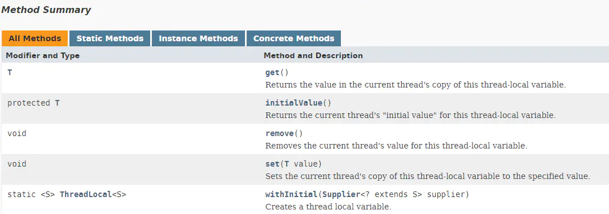
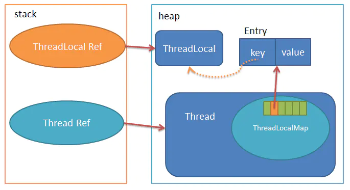
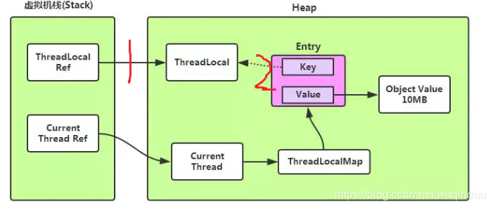

# ThreadLocal 解析

## 1.ThreadLocal 的作用

**<font color="red">ThreadLocal 的作用是提供线程内的局部变量，就是在各线程内部创建一个变量的副本</font>**，相比于使用各种锁机制访问变量，ThreadLocal 的思想就是用空间换时间，使各线程都能访问属于自己这一份的变量副本，变量值不互相干扰，减少同一个线程内的多个函数或者组件之间一些公共变量传递的复杂度。

## 2.ThreadLocal 的使用

查看官方文档，可知 ThreadLocal 包含以下方法：

<div align="center">
    
</div>

其中 get 函数用来获取与当前线程关联的 ThreadLocal 对应的值（每个 ThreadLocal 只对应一个变量），如果当前线程没有该 ThreadLocal 的值，则调用 initialValue 函数获取初始值返回，initialValue 是 protected 类型的，所以一般我们使用时需要继承重写该函数，给出初始值。而 set 函数是用来设置当前线程的该 ThreadLocal 对应的变量值，remove 函数用来删除 ThreadLocal 对应的变量值，在某些情况下需要手动调用，防止内存泄露。

### 2.1 代码示例

将需要被多线程访问的属性使用 ThreadLocal 变量来定义; 下面以网上多数举例的 DBConnectionFactory 类为例来举例：

```java{.line-numbers}
public static class DBConnectionFactory {
    final static ThreadPoolExecutor poolExecutor = new ThreadPoolExecutor(5, 5, 1, TimeUnit.MINUTES, new LinkedBlockingQueue<>());
    
    private static final ThreadLocal<Connection> dbConnectionLocal = new ThreadLocal<Connection>() {
        @Override
        protected Connection initialValue() {
            try {
                return DriverManager.getConnection("", "", "");
            } catch (SQLException e) {
                e.printStackTrace();
            }
            return null;
        }
    };
    
    public Connection getConnection() {
        return dbConnectionLocal.get();
    }
    
    public static void main(String[] args) throws InterruptedException {
        Thread.sleep(5000 * 4);
        for (int i = 0; i < 50; ++i) {
            poolExecutor.execute(new Runnable() {
                public void run() {
                    System.out.println("use local connection" + dbConnectionLocal.get());
                    dbConnectionLocal.remove();
                }
            });
        }
        System.out.println("pool execute over");
    }
} 
```

这样在 Client 获取 Connection 的时候, 每个线程获取到的 Connection 都是该线程独有的, 做到 Connection 的线程隔离; 所以并不存在线程安全问题。

## 3.ThreadLocal 源码剖析

看了 ThreadLocal 的基本使用，读者一定想知道 ThreadLocal 内部是如何实现的？本文主要的内容就是基于 Java1.8 的代码带你剖析 ThreadLocal 的内部实现。首先看下面这幅图：

<div align="center">
    
</div>

我们可以看出每个 Thread 维护一个 ThreadLocalMap，存储在 ThreadLocalMap 内的就是一个以 Entry 为元素的 table 数组，Entry 就是一个 key-value 结构，key 为 ThreadLocal，value 为存储的值。类比 HashMap 的实现，其实就是每个线程借助于一个哈希表，存储线程独立的值。我们可以看看 Entry 的定义：

```java{.line-numbers}
static class Entry extends WeakReference<ThreadLocal<?>> {
    /** The value associated with this ThreadLocal. */
    Object value;

    Entry(ThreadLocal<?> k, Object v) {
        super(k);
        value = v;
    }
} 
```

这里 ThreadLocal 和 key 之间的线是虚线，因为 Entry 是继承了 WeakReference 实现的，当 ThreadLocal Ref 销毁时，指向堆中 ThreadLocal 实例的唯一一条强引用消失了，只有 Entry 有一条指向 ThreadLocal 实例的弱引用，假设你知道弱引用的特性，那么这里 ThreadLocal 实例是可以被 GC 掉的。这时 Entry 里的 key 为 null 了，那么直到线程结束前，Entry 中的 value 都是无法回收的，这里可能产生内存泄露，后面会说如何解决。

知道大概的数据结构后，我们来探究一下 ThreadLocal 具体几个方法的实现：

### 3.1 get 方法

#### 3.1.1 get 方法

```java{.line-numbers}
public T get() {
    Thread t = Thread.currentThread();
    ThreadLocalMap map = getMap(t);
    if (map != null) {
        ThreadLocalMap.Entry e = map.getEntry(this);
        if (e != null) {
            @SuppressWarnings("unchecked")
            T result = (T)e.value;
            return result;
        }
    }
    return setInitialValue();
} 
```

直接看代码，可以分析主要有以下几步：

- 获取当前的 Thread 对象，通过 getMap 获取当前线程 Thread 内的 ThreadLocalMap
- 如果 map 已经存在，以当前的 ThreadLocal 为键，获取 Entry 对象，并从从 Entry 中取出值
- 否则，调用 setInitialValue 进行初始化。

下面再看看上面具体提到的几个函数：

#### 3.1.2 getMap

```java{.line-numbers}
ThreadLocalMap getMap(Thread t) {
       return t.threadLocals;
} 
```

getMap 很简单，就是返回线程中 ThreadLocalMap，跳到 Thread 源码里看，ThreadLocalMap 是这么定义的：

```java{.line-numbers}
ThreadLocal.ThreadLocalMap threadLocals = null;
```

所以每个线程中都有一个 ThreadLocalMap 对象，并且 ThreadLocalMap 类还是定义在 ThreadLocal 类里面的。我们前面已经说过 ThreadLocalMap 中的 Entry 定义，下面为了先介绍 ThreadLocalMap 的定义我们把 setInitialValue 放在前面说。

#### 3.1.3 setInitialValue

```java{.line-numbers}
private T setInitialValue() {
    T value = initialValue();
    Thread t = Thread.currentThread();
    ThreadLocalMap map = getMap(t);
    if (map != null)
        map.set(this, value);
    else
        createMap(t, value);
    return value;
} 
```

**`setInititialValue`** 在 Map 不存在的时候调用

1. 首先是调用 **`initialValue`** 生成一个初始的 value 值，深入 **`initialValue`** 函数，我们可知它就是返回一个 null，一般需要我们重写这个 **`initialValue`** 函数；
2. 然后还是在 get 一下 Map，如果 map 存在，则直接 map.set，这个函数会放在后文说；
3. 如果不存在则会调用 createMap 创建 **`ThreadLocalMap`**，这里正好可以先说明下 **`ThreadLocalMap`** 了；

#### 3.1.4 ThreadLocalMap

createMap 方法的定义很简单：

```java{.line-numbers}
void createMap(Thread t, T firstValue) {
    t.threadLocals = new ThreadLocalMap(this, firstValue);
} 
```

就是调用 **`ThreadLocalMap`** 的构造函数生成一个 map，下面我们看看 **`ThreadLocalMap`** 的定义：

```java{.line-numbers}
static class ThreadLocalMap {
    static class Entry extends WeakReference<ThreadLocal<?>> {
        /** The value associated with this ThreadLocal. */
        Object value;

        Entry(ThreadLocal<?> k, Object v) {
            super(k);
            value = v;
        }
    }

    /**
     * The initial capacity -- MUST be a power of two.
     */
    private static final int INITIAL_CAPACITY = 16;

    /**
     * The table, resized as necessary.
     * table.length MUST always be a power of two.
     */
    private Entry[] table;

    /**
     * The number of entries in the table.
     */
    private int size = 0;

    /**
     * The next size value at which to resize.
     */
    private int threshold; // Default to 0

    /**
     * Set the resize threshold to maintain at worst a 2/3 load factor.
     */
    private void setThreshold(int len) {
        threshold = len * 2 / 3;
    }

    /**
     * Increment i modulo len.
     */
    private static int nextIndex(int i, int len) {
        return ((i + 1 < len) ? i + 1 : 0);
    }

    /**
     * Decrement i modulo len.
     */
    private static int prevIndex(int i, int len) {
        return ((i - 1 >= 0) ? i - 1 : len - 1);
    }
}
```

ThreadLocalMap 被定义为一个静态类，上面是包含的主要成员：

1. 首先是 Entry 的定义，前面已经说过；
2. 初始的容量为 **`INITIAL_CAPACITY = 16`**；
3. 主要数据结构就是一个 Entry 的数组 table；
4. size 用于记录 Map 中实际存在的 entry 个数；
5. threshold 是扩容上限，当 size 到达 threashold 时，需要 resize 整个 Map，threshold 的初始值为 **`len * 2 / 3`**；

而 ThreadLocalMap 的构造函数如下：

```java{.line-numbers}
ThreadLocalMap(ThreadLocal<?> firstKey, Object firstValue) {
    table = new Entry[INITIAL_CAPACITY];
    int i = firstKey.threadLocalHashCode & (INITIAL_CAPACITY - 1);
    table[i] = new Entry(firstKey, firstValue);
    size = 1;
    setThreshold(INITIAL_CAPACITY);
} 
```

就是使用 **`firstKey`** 和 **`firstValue`** 创建一个 Entry，计算好索引 i，然后把创建好的 Entry 插入 table 中的 i 位置，再设置好 size 和 threshold。最后说 get 函数完成实质性功能的 getEntry 函数：

#### 3.1.5 map.getEntry

```java{.line-numbers}
private Entry getEntry(ThreadLocal<?> key) {
    int i = key.threadLocalHashCode & (table.length - 1);
    Entry e = table[i];
    if (e != null && e.get() == key)
        return e;
    else
        return getEntryAfterMiss(key, i, e);
} 
```

1. 首先是计算索引位置 i，通过计算 key 的 **`hash%(table.length-1)`** 得出；
2. 根据获取 Entry，如果 Entry 存在且 Entry 的 key 恰巧等于 ThreadLocal，那么直接返回 Entry 对象；
3. 否则，也就是在此位置上找不到对应的 Entry，那么就调用 **`getEntryAfterMiss`**。

### 3.2 Set 方法

#### 3.2.1 set 方法

我们在 get 方法的循环查找那里也大概描述了 set 方法的思想，即开放地址法,下面看具体代码：

```java{.line-numbers}
public void set(T value) {
    Thread t = Thread.currentThread();
    ThreadLocalMap map = getMap(t);
    if (map != null)
        map.set(this, value);
    else
        createMap(t, value);
} 
```

首先也是获取当前线程，根据线程获取到 ThreadLocalMap，若是有 ThreadLocalMap，则调用 **`map.set(ThreadLocal<?> key, Object value)`**，若是没有则调用 createMap 创建。

#### 3.2.2 map.set 方法

```java{.line-numbers}
private void set(ThreadLocal<?> key, Object value) {
    Entry[] tab = table;
    int len = tab.length;
    int i = key.threadLocalHashCode & (len-1);
    
    for (Entry e = tab[i];
         e != null;
         e = tab[i = nextIndex(i, len)]) {
        ThreadLocal<?> k = e.get();
    
        if (k == key) {
            e.value = value;
            return;
        }
    
        if (k == null) {
            replaceStaleEntry(key, value, i);
            return;
        }
    }

    tab[i] = new Entry(key, value);
    int sz = ++size;
    if (!cleanSomeSlots(i, sz) && sz >= threshold)
        rehash();
} 
```

看上面这段代码：

1. 首先还是根据 key 计算出位置 i，然后查找 i 位置上的 Entry
2. 若是 Entry 已经存在并且 key 等于传入的 key，那么这时候直接给这个 Entry 赋新的 value 值。
3. 若是 Entry 存在，但是 key 为 null，则调用 replaceStaleEntry 来更换这个 key 为空的 Entry
4. 不断循环检测，直到遇到为 null 的地方，这时候要是还没在循环过程中 return，那么就在这个 null 的位置新建一个 Entry，并且插入，同时 size 增加 1。
5. 最后调用 cleanSomeSlots，这个函数就不细说了，你只要知道内部还是调用了上面提到的 expungeStaleEntry 函数清理 key 为 null 的 Entry，同时对不为空的 Entry 进行 rehash 就行了。cleanSomeSlots 最后返回是否清理了 Entry，接下来再判断 sz>thresgold，达到的话就会调用 rehash() 函数。

### 3.3 remove 方法

最后一个需要探究的就是 remove 函数，它用于在 map 中移除一个不用的 Entry。也是先计算出 hash 值，若是第一次没有命中，就循环直到 null，在此过程中也会调用 expungeStaleEntry 清除空 key 节点。代码如下：

```java{.line-numbers}
private void remove(ThreadLocal<?> key) {
    Entry[] tab = table;
    int len = tab.length;
    int i = key.threadLocalHashCode & (len-1);
    for (Entry e = tab[i];
         e != null;
         e = tab[i = nextIndex(i, len)]) {
         if (e.get() == key) {
            e.clear();
            expungeStaleEntry(i);
            return;
        }
    }
} 
```

## 4.ThreadLocal 内存泄漏

### 4.1 为什么内存泄漏

<div align="center">
    
</div>

ThreadLocal 的实现是这样的：每个Thread 维护一个 ThreadLocalMap 映射表，这个映射表的 key 是 ThreadLocal实例本身，value 是真正需要存储的 Object。**<font color="red">也就是说 `ThreadLocal` 本身并不存储值，它只是作为一个 key 来让线程从 `ThreadLocalMap` 获取 value</font>**。值得注意的是图中的虚线，表示 ThreadLocalMap 是使用 ThreadLocal 的弱引用作为 Key 的，弱引用的对象在 GC 时会被回收。

### 4.2 ThreadLocal 什么情况下被回收

ThreadLocal 在 ThreadLocalMap 中是以一个弱引用身份被 Entry 中的 Key 引用，当 GC 发生时，ThreadLocal 会不会被回收？这里就用到引用的知识点了。在 java 的四种引用讲过。当一个对象被强引用指向时(这里指可达)。垃圾回收器不会回收他。例如：

```java{.line-numbers}
ThreadLocal threadlocal1 = new ThreadLocal();
threadlocal1.set("测试"); 
```

ThreadLocal 对象此时有两种索引指向的。

- 强引用：threadlocal1 对应图中【1】；
- 弱引用：Entry 中的 Key（WeakReference<threadlocal1>）对应图中的【2】；

所以 GC 发生时，堆内 ThreadLocal 对象不会被回收。但是当我们把 threadlocal1 = null; 断开强引用时，此时 ThreadLocal 对象只有一个弱引用，那么 GC 发生时，ThreadLocal 对象被回收了，Entry 变成了一个 key 为 null 的 Entry。也叫脏 Entry。

特点是：

- key 为 null，value 不能被应用程序访问到，因为我们已经没有引用到这个 Key 对应的 ThreadLocal 对应的引用了；
- **`Thread Ref -> Thread -> ThreaLocalMap -> Entry -> value`** 链存在，当前线程迟迟不结束（例如线程池中的核心线程），但不能被使用（也就是无法调用 get、set 和 remove 方法），成了脏数据，造成了内存泄漏；

看上去好像真是弱引用造成的内存泄漏。

### 4.3 为啥使用弱引用

那换做强引用分析：ThreadLocal 对象被两个强引用指向：

- 强引用： threadlocal1
- 强引用： Entry.key

当我们断开程序中的强引用 threadlocal1 时。**<font color="red">ThreadLocal 对象仍然被强引用 Entry.key 指向，不会回收，这就造成，ThreadLocal 对象与 value 都成为了脏数据</font>**。对比这两种情况: 不管软引用还是强引用，都可能出现内存泄漏问题，弱引用反而将内存泄漏的程度降低。并且我们可以利用弱引用的 Entry 会有 key 为 null 这个特征，可以识别哪些是不用的数据，进行清理操作，弱引用反而提高了 ThreadLocal 的安全性。事实上当调用 ThreadLocal 的 get(),set(),reomve() 方法，都会清除掉线程 ThreadLocalMap 中所有 Entry 中 Key 为 null 的 Value，并将整个 Entry 设置为 null，利于下次内存回收。

### 4.4 泄漏的真正原因

所以：ThreadLocal 内存泄漏的真正原因：

**<font color="red">ThreadLocalMap 的生命周期跟 Thread 一样长</font>**，如果线程不被关闭，例如线程池中的核心线程；**<font color="red">并且使用完没有调用 remove 及时清理，或者不再调用 get()、set() 方法对脏 Entry 进行清理</font>**。这才是造成内存泄漏的真正原因。

### 4.5 ThreadLocal 的最佳实践

综合上面的分析，我们可以理解 ThreadLocal 内存泄漏的前因后果，那么怎么避免内存泄漏呢？每次使用完 ThreadLocal，都调用它的 remove() 方法，清除数据。在使用线程池的情况下，没有及时清理 ThreadLocal，不仅是内存泄漏的问题，更严重的是可能导致业务逻辑出现问题。所以，使用 ThreadLocal 就跟加锁完要解锁一样，用完就清理。


## 5.总结

### 5.1 哈希冲突

解决哈希冲突有以下四种方法：

**1.开放地址方法**

- 线性探测：按顺序决定值时，如果某数据的值已经存在，则在原来值的基础上往后加一个单位，直至不发生哈希冲突。　
- 再平方探测：按顺序决定值时，如果某数据的值已经存在，则在原来值的基础上先加 1 的平方个单位，若仍然存在则减 1 的平方个单位。随之是 2 的平方，3 的平方等等。直至不发生哈希冲突。
- 伪随机探测：按顺序决定值时，如果某数据已经存在，通过随机函数随机生成一个数，在原来值的基础上加上随机数，直至不发生哈希冲突。

**2.链式地址法（HashMap 的哈希冲突解决方法）**

对于相同的值，使用链表进行连接。使用数组存储每一个链表。优点如下所示：

- 拉链法处理冲突简单，且无堆积现象，即非同义词决不会发生冲突，因此平均查找长度较短；
- 由于拉链法中各链表上的结点空间是动态申请的，故它更适合于造表前无法确定表长的情况；
- 开放定址法为减少冲突，要求装填因子 $α$ 较小，故当结点规模较大时会浪费很多空间。而拉链法中可取 $α≥1$，且结点较大时，拉链法中增加的指针域可忽略不计，因此节省空间；
- 在用拉链法构造的散列表中，删除结点的操作易于实现。只要简单地删去链表上相应的结点即可。

缺点：指针占用较大空间时，会造成空间浪费，若空间用于增大散列表规模进而提高开放地址法的效率。

**3.建立公共溢出区**

建立公共溢出区存储所有哈希冲突的数据。

**4.再哈希法**

对于冲突的哈希值再次进行哈希处理，直至没有哈希冲突。

而在 ThreadLocal 中的 ThreadLocalMap 属性中，使用开放地址法解决哈希冲突（具体来说是线性探测法来解决哈希冲突）。

### 5.2 ThreadLocal 原理简述

ThreadLocal 的实现是这样的：每个Thread 维护一个 ThreadLocalMap 映射表，这个映射表的 key 是 ThreadLocal 实例本身，value 是真正需要存储的 Object。**<font color="red">也就是说 ThreadLocal 本身并不存储值，它只是作为一个 key 来让线程从 ThreadLocalMap 获取 value</font>**。

当我们在某一个线程 t 中，去调用 ThreadLocal 的 get 方法时，我们会以这个 ThreadLocal 为 key 到 t 线程的 ThreadLocalMap 中去查找，是否存在一个 entry，其 key 为当前的 ThreadLocal 对象：

- 如果存在的话，就直接返回这个 entry 的 value 值；
- 如果不存在 key 的话，就根据 initialValue 方法获取到对应的 value 值，并且把这一对 key & value 保存到 ThreadLocalMap 中
- 如果连 ThreadLocalMap 都不存在的话，就会先创建一个 ThreadLocalMap，并且把这个映射表保存到线程 t 中，然后根据 initialValue 方法获取到对应的 value 值，并且把这一对 key & value 保存到 ThreadLocalMap 中。

当我们在线程 t 中，调用 ThreadLocal 的 set 方法时，也会先获取到线程 t 中的 TheadLocalMap 对象，然后以当前 ThreadLocal 作为 key，然后把 key & value 保存到 ThreadLocalMap 中。从 get/set 方法可以看出，之所以 ThreadLocal 可以起到在各线程内部创建一个变量的副本的作用，就是因为在线程 t 的内部，有一个 ThreadLocalMap 映射表，保存了 ThreadLocal -> value 的映射，ThreadLocal 本身只是作为一个 key 来获取 value 值。

### 5.3 内存泄漏

在 ThreadLocalMap 的 entry 对象中，不管 Key 采用强引用还是弱引用，都会产生内存泄漏问题，也就是在程序中没有对于 ThreadLocal 的引用（将上面的 ThreadLocalRef 设置为 null），value 也就不能被应用程序访问到，因为我们已经没有引用到这个 Key 对应的 ThreadLocal 了。内存泄漏的真正原因是 ThreadLocalMap 和 Thread 的生命周期一样长。但是弱引用反而将内存泄漏的程度降低。并且我们可以利用弱引用的 Entry 会有 key 为 null 这个特征，可以识别哪些是不用的数据，进行清理操作，弱引用反而提高了 ThreadLocal 的安全性。事实上当调用 ThreadLocal 的 get(),set(),reomve() 方法，都会清除掉线程 ThreadLocalMap中所有 Entry 中 Key 为 null 的 Value，并将整个 Entry 设置为 null，利于下次内存回收。

综合上面的分析，我们可以理解 ThreadLocal 内存泄漏的前因后果，那么怎么避免内存泄漏呢？**<font color="red">每次使用完 ThreadLocal，都调用它的 remove() 方法，清除数据</font>**。在使用线程池的情况下，没有及时清理 ThreadLocal，不仅是内存泄漏的问题，更严重的是可能导致业务逻辑出现问题。所以，使用 ThreadLocal 就跟加锁完要解锁一样，用完就清理。