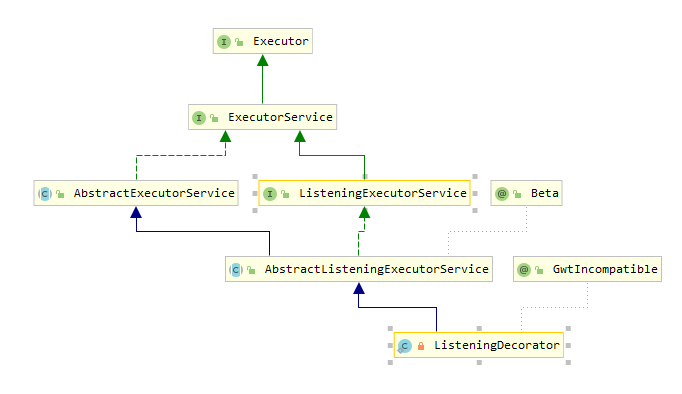

# ListenableFuture 源码分析

## 1.简介

JDK 原生的 Future 已经提供了异步操作，但是不能直接回调。guava 对 Future 进行了增强，核心接口就是 ListenableFuture。如果已经开始使用了 jdk8，可以直接学习使用原生的 CompletableFuture，这是 jdk 从 guava 中吸收了精华新增的类。

ListenableFuture 继承了 Future，额外新增了一个方法，Listener 是任务结束后的回调方法，executor 是执行回调方法的执行器( 通常是线程池)。guava 中对 Future 的增强就是在 addListener 这个方法上进行了各种各样的封装，所以 addListener 是核心方法。

```java{.line-numbers}
public interface ListenableFuture<V> extends Future<V> {
    void addListener(Runnable listener, Executor executor);
} 
```

所以说，ListenableFuture 相比于普通的 Future 来说，本质上只是增加了回调函数。

## 2.使用示例

```java{.line-numbers}
public class ListenableFutureTest {
    public static void main(String[] args) {
        testListenFuture();
    }

    public static void testListenFuture() {
        System.out.println("主线程start");
        ListeningExecutorService pool = MoreExecutors.listeningDecorator(Executors.newFixedThreadPool(5));

        Task task1 = new Task();
        task1.args = "task1";
        Task task2 = new Task();
        task2.args = "task2";
        ListenableFuture<String> future = pool.submit(task1);
        ListenableFuture<String> future2 = pool.submit(task2);

        future2.addListener(() -> System.out.println("addListener 不能带返回值"), pool);

        /**
         * FutureCallBack接口可以对每个任务的成功或失败单独做出响应
         */
        FutureCallback<String> futureCallback = new FutureCallback<String>() {
            @Override
            public void onSuccess(String result) {
                System.out.println("Futures.addCallback 能带返回值：" + result);
            }
            @Override
            public void onFailure(Throwable t) {
                System.out.println("出错,业务回滚或补偿");
            }
        };

        //为任务绑定回调接口
        Futures.addCallback(future, futureCallback, pool);
        System.out.println("主线程end");
    }
}

class Task implements Callable<String> {
    String args;
    @Override
    public String call() throws Exception {
        Thread.sleep(1000);
        System.out.println("任务：" + args);
        return "dong";
    }
} 
```

在上面的代码中，future2.addListener 和 Futures.addCallback 都是注册回调的方法，在本质上是一样的，对于 Futures.addCallback，也是把 FutureCallback 对象封装成一个 Listener，然后调用 addListener 方法，从而添加到 future 中的 Listener 链表里面。

## 3.源码分析

在上面的示例代码中，首先将 ThreadPoolExecutor 封装成一个 MoreExecutors.listeningDecorator，源码如下：

```java{.line-numbers}
private static class ListeningDecorator extends AbstractListeningExecutorService {

    private final ExecutorService delegate;
    
    //MoreExecutors.listeningDecorator就是包装了一下ThreadPoolExecutor，目的是为了使用ListenableFuture
    //这里的delegate其实就是ThreadPoolExecutor
    ListeningDecorator(ExecutorService delegate) {
        this.delegate = checkNotNull(delegate);
    }
    
    //重写了execute，不过还是直接调用ThreadPoolExecutor里面的execute
    @Override
    public final void execute(Runnable command) {
        delegate.execute(command);
    }
} 
```

ListeningDecorator 的继承关系结构如下所示：

<div align="center">
    
</div>

这里的 delegate 就是 ThreadPoolExecutor，另外虽然还重写了 execute，不过还是直接调用 ThreadPoolExecutor 里面的 execute。这样一个执行器就被 new 出来了，现在需要往里面放任务了。

接下来就是调用 submit 方法，往线程池中去提交任务了。由于 ListeningDecorator 继承了 AbstractListeningExecutorService 类，因此，会调用其父类的 submit 方法：

```java{.line-numbers}
//在Test中，pool.submit(task1)，往线程池中提交任务时，就会调用下面的submit方法，
//然后调用父类的submit方法
//class:AbstractListeningExecutorService
@Override
public <T> ListenableFuture<T> submit(Callable<T> task) {
    return (ListenableFuture<T>) super.submit(task);
} 
```

接着调用 AbstractExecutorService 中的 submit 方法：

```java{.line-numbers}
public <T> Future<T> submit(Callable<T> task) {
    if (task == null) throw new NullPointerException();
    RunnableFuture<T> ftask = newTaskFor(task);
    execute(ftask);
    return ftask;
} 
```

在上面的 submit 方法中，会调用我们在 AbstractListeningExecutorService 中重写的 newTaskFor 方法：

```java{.line-numbers}
//调用TrustedListenableFutureTask类中的静态create方法，返回一个实现了RunnableFuture
//接口的TrustedListenableFutureTask类对象，放入到线程池中去执行
//class:AbstractListeningExecutorService
@Override
protected final <T> RunnableFuture<T> newTaskFor(Callable<T> callable) {
    return TrustedListenableFutureTask.create(callable);
} 

/**
 * 在AbstractExecutorService#submit方法中，会通过newTaskFor创建一个TrustedListenableFutureTask类对象，放入到
 * 线程池中去执行，接着会调用TrustedListenableFutureTask#run方法。由于this.task具体是一个TrustedFutureInterruptibleTask
 * 类对象，因此会接着调用InterruptibleTask中的run方法
 */
static class TrustedListenableFutureTask<V> extends AbstractFuture.TrustedFuture<V> implements RunnableFuture<V> {

    static <V> TrustedListenableFutureTask<V> create(Callable<V> callable) {
        return new TrustedListenableFutureTask<V>(callable);
    }

    //省略代码

    private TrustedFutureInterruptibleTask task;

    TrustedListenableFutureTask(Callable<V> callable) {
        this.task = new TrustedFutureInterruptibleTask(callable);
    }

    @Override
    public void run() {
        TrustedFutureInterruptibleTask localTask = task;
        if (localTask != null) {
            //由于TrustedFutureInterruptibleTask是InterruptibleTask的子类，故localTask.run
            //会调用InterruptibleTask中的run方法。
            localTask.run();
        }
    }

    @GwtIncompatible("Interruption not supported")
    @Override
    protected final void interruptTask() {
        TrustedFutureInterruptibleTask localTask = task;
        if (localTask != null) {
            localTask.interruptTask();
        }
    }

    @WeakOuter
    private final class TrustedFutureInterruptibleTask extends InterruptibleTask {
        private final Callable<V> callable;

        TrustedFutureInterruptibleTask(Callable<V> callable) {
            this.callable = checkNotNull(callable);
        }

        @Override
        void runInterruptibly() {
            //Ensure we haven't been cancelled or already run.
            if (!isDone()) {
                try {
                    //调用
                    set(callable.call());
                } catch (Throwable t) {
                    setException(t);
                }
            }
        }

        @Override
        boolean wasInterrupted() {
            return TrustedListenableFutureTask.this.wasInterrupted();
        }
    }
} 
```

newTaskFor 创建了并返回了一个 TrustedListenableFutureTask 类型的对象。在其构造函数里面初始化了一个 **<font color="red">_TrustedFutureInterruptibleTask_</font>** 类型的对象，赋值给了 task，并且将我们定义的 Callable 对象保存到了 **<font color="red">_TrustedFutureInterruptibleTask_</font>** 类中（此 Callable 是我们真正定义要执行的任务）。当 TrustedListenableFutureTask 放入到线程池中去执行时，调用其 run 方法：

```java{.line-numbers}
@Override
public void run() {
    TrustedFutureInterruptibleTask localTask = task;
    if (localTask != null) {
        //由于TrustedFutureInterruptibleTask是InterruptibleTask的子类，故localTask.run
        //会调用InterruptibleTask中的run方法。
        localTask.run();
    }
} 
```

由于前面所说的 task 为 **<font color="red">_TrustedFutureInterruptibleTask_</font>** 类型，所以线程池会接着去调用 **<font color="red">_TrustedFutureInterruptibleTask_</font>** 中的 run 方法：

```java{.line-numbers}
abstract class InterruptibleTask implements Runnable {
    private static final AtomicReferenceFieldUpdater<InterruptibleTask, Thread> RUNNER = newUpdater(
            InterruptibleTask.class, Thread.class, "runner");
    
    @Override
    public final void run() {
        if (!RUNNER.compareAndSet(this, null, Thread.currentThread())) {
            return; // someone else has run or is running.
        }
        try {
            // 会调用TrustedFutureInterruptibleTask中的runInterruptibly方法
            runInterruptibly();
        } finally {
            if (wasInterrupted()) {
                while (!doneInterrupting) {
                    Thread.yield();
                }
            }
        }
    }
}
```

接着，由于默认的 this 还是 **<font color="red">_TrustedFutureInterruptibleTask_</font>** 类型的对象，因此会继续调用 **<font color="red">_TrustedFutureInterruptibleTask_</font>** 中的 runInterruptibly 方法。在此 runInterruptibly 方法中，会真正调用我们所定义的 Callable 中的 call 方法（其中包含了我们要求线程池执行的任务）。然后调用 AbstractFuture 中的 set 方法：

```java{.line-numbers}
public static abstract class AbstractFuture<V> implements ListenableFuture<V> {

    protected boolean set(@Nullable V value) {
        //value是调用我们所定义的Callable的call方法所返回的结果值
        Object valueToSet = value == null ? NULL : value;
        //使用ATOMIC_HELPER原子的将结果值设置到AbstractFuture类对象的value属性中
        if (ATOMIC_HELPER.casValue(this, null, valueToSet)) {
            complete();
            return true;
        }
        return false;
    }
    
    //在这里执行完所有的回调函数
    private void complete() {
        for (Waiter currentWaiter = clearWaiters(); currentWaiter != null; currentWaiter = currentWaiter.next) {
            currentWaiter.unpark();
        }
        //We need to reverse the list to handle buggy listeners that depend on
        //ordering.
        Listener currentListener = clearListeners();
        Listener reversedList = null;
        while (currentListener != null) {
            Listener tmp = currentListener;
            currentListener = currentListener.next;
            tmp.next = reversedList;
            reversedList = tmp;
        }
        for (; reversedList != null; reversedList = reversedList.next) {
            executeListener(reversedList.task, reversedList.executor);
        }
    
        done();
    }
    
    void done() {
    }
    
    //这里就是调用执行器的execute方法，相当于给线程池扔一个任务，毕竟回调函数也是一个任务
    private static void executeListener(Runnable runnable, Executor executor) {
        try {
            executor.execute(runnable);
        } catch (RuntimeException e) {
            log.log(Level.SEVERE,
                    "RuntimeException while executing runnable " + runnable + " with executor " + executor, e);
        }
    }
}
```

在 set 方法中，将我们 Callable 中 call 方法的返回值设置到 AbstractFuture 类对象的 value 属性中保存起来（这里的 AbstractFuture 类对象其实就是 TrustedListenableFutureTask 类对象，因为 AbstractFuture 是 TrustedListenableFutureTask 的父类）。接着调用 complete 方法，执行注册在此 TrustedListenableFutureTask 类对象中的 Listener 链表中的 Listener（注意，前面我们注册的 FutureCallback 对象也被封装成一个 Listener，保存在此 Listener 链表中）。

接下来再说一下 addListener，其实就是给任务增加一个回调函数。这里调用的是 TrustedListenableFutureTask 的 addListener，实际上调用的是父类 AbstractFuture 的 addListener：

```java{.line-numbers}
//由于TrustedListenableFutureTask继承了AbstractFuture，每一个Task都会有一个Listener链表，
//用来保存注册在此Task上的Listener。因此调用addListener时，其实就是将这个Listener添加到Task的Listener
//链表中。
//class:AbstractFuture
public void addListener(Runnable listener, Executor executor) {
    checkNotNull(listener, "Runnable was null.");
    checkNotNull(executor, "Executor was null.");
    Listener oldHead = listeners;

    //如果任务Task还没有被执行完，那么就把Listener保存到Listener链表中，并且这个链表的头结点就是
    //新创建的Listener。为什么要用链表？因为一个任务可以有多个Listener
    if (oldHead != Listener.TOMBSTONE) {
        Listener newNode = new Listener(listener, executor);
        do {
            newNode.next = oldHead;
            if (ATOMIC_HELPER.casListeners(this, oldHead, newNode)) {
                return;
            }
            oldHead = listeners; // re-read
        } while (oldHead != Listener.TOMBSTONE);
    }

    //如果执行到这里，就表明Listener.TOMBSTONE已经被设置好了，也就是说任务Task已经被执行完了，所以回调Listener
    executeListener(listener, executor);
} 
```

在 addListener 中，如果任务已经完成了，就直接将此 Listener 放入到线程池中去执行。因为前面我们知道，当一个任务执行结束的时候，就会执行 Listener 链表中的所有的 Listener，因此可能已经执行完了，所以这里必须要直接执行。至于为什么要用链表呢？因为一个任务可以有多个回调函数。

再来看看 Futures.addCallback：

```java{.line-numbers}
//class:Futures
public static <V> void addCallback(final ListenableFuture<V> future, final FutureCallback<? super V> callback,
        Executor executor) {
    Preconditions.checkNotNull(callback);
    Runnable callbackListener = new Runnable() {
        @Override
        public void run() {
            final V value;
            try {
                value = getUninterruptibly(future);
            } catch (ExecutionException e) {
                callback.onFailure(e.getCause());
                return;
            } catch (RuntimeException e) {
                callback.onFailure(e);
                return;
            } catch (Error e) {
                callback.onFailure(e);
                return;
            }
            callback.onSuccess(value);
        }
    };
    //这里会先把FutureCallback包装成一个Listener（封装的目的就是为了拿到任务执行的返回值），然后添加到这里的
    //future（其实也就是前面的TrustedListenableFutureTask）的Listener链表中。
    future.addListener(callbackListener, executor);
} 
```

在底层实现的时候，还是将其封装成了一个 Listener（其实就是一个实现了 Runnable 接口的对象）。而封装的目的就是要拿到任务的返回值，而其中的 getUninterruptibly 方法则会阻塞等待任务在线程池中执行完成，设置好结果值。

```java{.line-numbers}
//class:Uninterruptibles
public static <V> V getUninterruptibly(Future<V> future) throws ExecutionException {
    boolean interrupted = false;
    try {
        while (true) {
            try {
                return future.get();
            } catch (InterruptedException e) {
                interrupted = true;
            }
        }
    } finally {
        if (interrupted) {
            Thread.currentThread().interrupt();
        }
    }
} 
```

## 4.总结

总结一下 ListenableFuture 的运行流程，首先 MoreExectuors.listeningDecorator 会对传入的线程池 ThreadPoolExectuor 进行封装。然后向线程池提交任务，还是会放入到前面的 ThreadPoolExecutor 中去执行，并返回一个自定义的 TrustedListenableFutureTask，它实现了 RunnableFuture 接口，所以既可以当做 Runnable 使用，传入到线程池中去执行，又可以返回作为 Future 来获取到执行的结果。

然后我们可以在这个 TrustedListenableFutureTask 对象上注册多个 Listener，这些 Listener 会被组织成一个链表结构。**<font color="red">注意 Futures.addCallback 中的 FutureCallback 对象也会被封装成 Listener 对象，然后添加到 TrustedListenableFutureTask 对应的 Listener 链表中</font>**。

在线程池执行 TrustedListenableFutureTask 中的 run 方法完毕时，就会去回调 TrustedListenableFutureTask 对象中 Listener 链表中的各个 Listener。