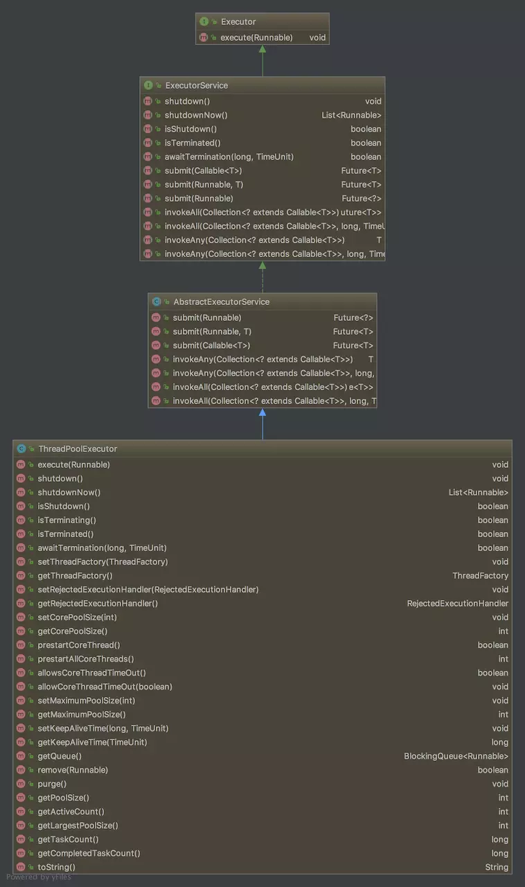
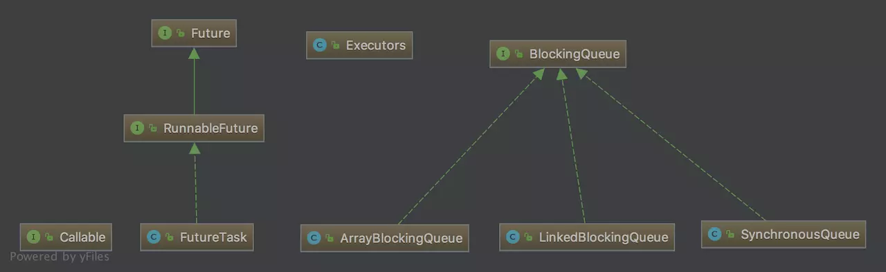
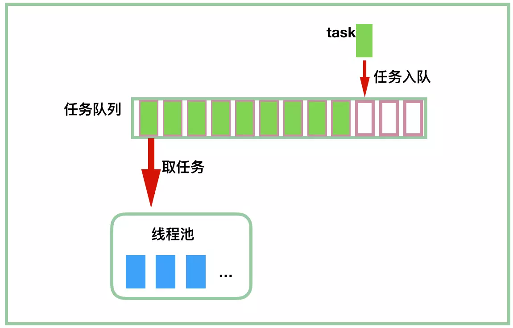

# 深度解读线程池源码实现

## 1.总览

下图是 java 线程池几个相关类的继承结构：

<div align="center">
    
</div>

先简单说说这个继承结构，Executor 位于最顶层，也是最简单的，就一个 execute(Runnable runnable) 接口方法定义。ExecutorService 也是接口，在 Executor 接口的基础上添加了很多的接口方法，所以一般来说我们会使用这个接口。然后再下来一层是 AbstractExecutorService，从名字我们就知道，这是抽象类，这里实现了非常有用的一些方法供子类直接使用，之后我们再细说。然后才到我们的重点部分 ThreadPoolExecutor 类，这个类提供了关于线程池所需的非常丰富的功能。另外，我们还涉及到下图中的这些类：

<div align="center">
    
</div>

**<font color="red">同在并发包中的 Executors 类，类名中带字母 s，我们猜到这个是工具类，里面的方法都是静态方法</font>**，如以下我们最常用的用于生成 ThreadPoolExecutor 的实例的一些方法：

```java{.line-numbers}
public static ExecutorService newCachedThreadPool() {
    return new ThreadPoolExecutor(0, Integer.MAX_VALUE,
                                  60L, TimeUnit.SECONDS,
                                  new SynchronousQueue<Runnable>());
}
public static ExecutorService newFixedThreadPool(int nThreads) {
    return new ThreadPoolExecutor(nThreads, nThreads,
                                  0L, TimeUnit.MILLISECONDS,
                                  new LinkedBlockingQueue<Runnable>());
} 
```

另外，由于线程池支持获取线程执行的结果，所以，引入了 Future 接口，RunnableFuture 继承自此接口，然后我们最需要关心的就是它的实现类 FutureTask。到这里，记住这个概念，在线程池的使用过程中，我们是往线程池提交任务（task），使用过线程池的都知道，我们提交的每个任务是实现了 Runnable/Callable 接口的，**<font color="red">其实就是先将 Runnable/Callable 的任务包装成 FutureTask，然后再提交到线程池</font>**。这样，读者才能比较容易记住 FutureTask 这个类名：它首先是一个任务（Task），然后具有 Future 接口的语义，即可以在将来（Future）得到执行的结果。

当然，线程池中的 BlockingQueue 也是非常重要的概念，**<font color="red">如果线程数达到 corePoolSize，我们的每个任务会提交到等待队列中，等待线程池中的线程来取任务并执行</font>**。这里的 BlockingQueue 通常我们使用其实现类 LinkedBlockingQueue、ArrayBlockingQueue 和 SynchronousQueue，每个实现类都有不同的特征，使用场景之后会慢慢分析。

## 2.Executor 接口

```java{.line-numbers}
/* 
 * @since 1.5
 * @author Doug Lea
 */
public interface Executor {
    void execute(Runnable command);
} 
```

我们可以看到 Executor 接口非常简单，就一个 void execute(Runnable command) 方法，代表提交一个任务。为了让大家理解 java 线程池的整个设计方案，我会按照 Doug Lea 的设计思路来多说一些相关的东西。我们经常这样启动一个线程：

```java{.line-numbers}
new Thread(new Runnable(){
  // do something
}).start(); 
```

用了线程池 Executor 后就可以像下面这么使用：

```java{.line-numbers}
Executor executor = anExecutor;
executor.execute(new RunnableTask1());
executor.execute(new RunnableTask2()); 
```

接下来我们要介绍的是继承自 Executor 接口的 ExecutorService 接口，这个接口提供了比较丰富的功能，也是我们最常使用到的接口。

## 3.ExecutorService 接口

一般我们定义一个线程池的时候，往往都是使用这个接口：

```java{.line-numbers}
ExecutorService executor = Executors.newFixOrCachedThreadPool(args...); 
```

因为这个接口中定义的一系列方法大部分情况下已经可以满足我们的需要了。那么我们简单初略地来看一下这个接口中都有哪些方法：

```java{.line-numbers}
public interface ExecutorService extends Executor {
    // 关闭线程池，已提交的任务继续执行，不接受继续提交新任务
    void shutdown();
    // 关闭线程池，尝试停止正在执行的所有任务，不接受继续提交新任务
    // 它和前面的方法相比，加了一个单词 “now”，区别在于它会去停止当前正在进行的任务，也就是调用每一个 worker 线程的中断方法
    List<Runnable> shutdownNow();
    // 线程池是否已关闭
    boolean isShutdown();
    // 如果调用了 shutdown() 或 shutdownNow() 方法后，所有任务结束了，那么返回 true
    // 这个方法必须在调用 shutdown 或 shutdownNow 方法之后调用才会返回 true
    boolean isTerminated();
    // 等待所有任务完成，并设置超时时间
    // 我们这么理解，实际应用中是，先调用 shutdown 或 shutdownNow，
    // 然后再调这个方法等待所有的线程真正地完成，返回值意味着有没有超时
    boolean awaitTermination(long timeout, TimeUnit unit) throws InterruptedException;
    // 提交一个 Callable 任务
    <T> Future<T> submit(Callable<T> task);
    // 提交一个 Runnable 任务，第二个参数将会放到 FutureTask 中，作为返回值，
    // 因为 Runnable 的 run 方法本身并不返回任何东西
    <T> Future<T> submit(Runnable task, T result);
    // 提交一个 Runnable 任务
    Future<?> submit(Runnable task);
    // 执行所有任务，返回 Future 类型的一个 list
    <T> List<Future<T>> invokeAll(Collection<? extends Callable<T>> tasks) throws InterruptedException;
    // 也是执行所有任务，但是这里设置了超时时间
    <T> List<Future<T>> invokeAll(Collection<? extends Callable<T>> tasks, long timeout, TimeUnit unit) throws InterruptedException;
    // 只有其中的一个任务结束了，就可以返回，返回执行完的那个任务的结果
    <T> T invokeAny(Collection<? extends Callable<T>> tasks) throws InterruptedException, ExecutionException;
  
    // 同上一个方法，只有其中的一个任务结束了，就可以返回，返回执行完的那个任务的结果，
    // 不过这个带超时，超过指定的时间，抛出 TimeoutException 异常
    <T> T invokeAny(Collection<? extends Callable<T>> tasks, long timeout, TimeUnit unit) throws InterruptedException, ExecutionException, TimeoutException;
} 
```

这些方法都很好理解，一个简单的线程池主要就是这些功能，**<font color="red">能提交任务，能获取结果，能关闭线程池</font>**，这也是为什么我们经常用这个接口的原因。

## 4.FutureTask

在继续往下层介绍 ExecutorService 的实现类之前，我们先来说说相关的类 FutureTask。

1. **`Future -> RunnableFuture -> FutureTask`**
2. **`Runnable -> RunnableFuture`**
3. FutureTask 通过 RunnableFuture 间接实现了 Runnable 接口
4. 所以通过 submit 方法传入的每个 Runnable/Callable 接口通常都先包装成 FutureTask，在 FutureTask 内部，会将 Runnable 再包装成 Callable 接口对象然后保存到 FutureTask 的 Callable 属性中（Callable 是直接保存到 FutureTask 属性中）。最后调用 FutureTask 的 run 方法时，会直接调用 Callable 属性的 call 方法。封装成 FutureTask 对象后，调用 **`executor.execute(Runnable command)`** 将其提交给线程池
5. 也可以直接通过 **`execute(Runnable command)`** 方法传入实现了 Runnable 接口的对象进行执行

我们知道，Runnable 的 void run() 方法是没有返回值的，所以，通常，如果我们需要的话，会在 submit 中指定第二个参数作为返回值：

```java{.line-numbers}
<T> Future<T> submit(Runnable task, T result); 
```

其实到时候在 FutureTask 类的内部会通过这两个参数，将其包装成 Callable。Callable 也是因为线程池的需要，所以才有了这个接口。它和 Runnable 的区别在于 run() 没有返回值，而 Callable 的 call() 方法有返回值，同时，如果运行出现异常，call() 方法会抛出异常。

```java{.line-numbers}
public interface Callable<V> {
    V call() throws Exception;
} 
```

下面，我们来看看 ExecutorService 的抽象实现 AbstractExecutorService 。

## 5.AbstractExecutorService

AbstractExecutorService 抽象类派生自 ExecutorService 接口，然后在其基础上实现了几个实用的方法，这些方法提供给子类进行调用。

这个抽象类实现了 invokeAny 方法和 invokeAll 方法，这里的两个 newTaskFor 方法也比较有用，用于将任务包装成 FutureTask。定义于最上层接口 Executor中的 void execute(Runnable command) 由于不需要获取结果，不会进行 FutureTask 的包装。**<font color="red">需要获取结果（FutureTask），用 submit 方法，不需要获取结果，可以用 execute 方法</font>**。下面，我将一行一行源码地来分析这个类，跟着源码来看看其实现吧：

```java{.line-numbers}
public abstract class AbstractExecutorService implements ExecutorService {
    // RunnableFuture 是用于获取执行结果的，我们常用它的子类 FutureTask
    // 下面两个 newTaskFor 方法用于将我们的任务包装成 FutureTask 提交到线程池中执行
    protected <T> RunnableFuture<T> newTaskFor(Runnable runnable, T value) {
        return new FutureTask<T>(runnable, value);
    }
    protected <T> RunnableFuture<T> newTaskFor(Callable<T> callable) {
        return new FutureTask<T>(callable);
    }
    // 提交任务
    public Future<?> submit(Runnable task) {
        if (task == null) throw new NullPointerException();
        // 1. 将任务包装成 FutureTask
        RunnableFuture<Void> ftask = newTaskFor(task, null);
        // 2. 交给执行器执行，execute 方法由具体的子类来实现
        // 前面也说了，FutureTask 间接实现了Runnable 接口。
        execute(ftask);
        return ftask;
    }
    public <T> Future<T> submit(Runnable task, T result) {
        if (task == null) throw new NullPointerException();
        // 1. 将任务包装成 FutureTask
        RunnableFuture<T> ftask = newTaskFor(task, result);
        // 2. 交给执行器执行
        execute(ftask);
        return ftask;
    }
  
    public <T> Future<T> submit(Callable<T> task) {
        if (task == null) throw new NullPointerException();
        // 1. 将任务包装成 FutureTask
        RunnableFuture<T> ftask = newTaskFor(task);
        // 2. 交给执行器执行
        execute(ftask);
        return ftask;
    }
} 
```

从上面的代码可以看出，不管是实现了 Callable 还是 Runnable 接口的任务，都会被封装成 FutureTask 类型的任务，然后在 runWorker 方法中调用这些 FutureTask 任务的 run 方法。不过实现了 Callable 或者 Runnable 接口的任务在传入 FutureTask 的构造函数中，都被封装成了 Callable 类型的任务，然后在 FutureTask 的 run 方法中调用其 Callable 任务的 call 方法。

到这里，我们发现，这个抽象类包装了一些基本的方法，**<font color="red">可是像 submit、invokeAny、invokeAll 等方法，它们都没有真正开启线程来执行任务</font>**，它们都只是在方法内部调用了 execute 方法，所以最重要的 execute(Runnable runnable) 方法还没出现，需要等具体执行器来实现这个最重要的部分，这里我们要说的就是 ThreadPoolExecutor 类了。

## 6.ThreadPoolExecutor

ThreadPoolExecutor 是 JDK 中的线程池实现，这个类实现了一个线程池需要的各个方法，它实现了任务提交、线程管理、监控等等方法。我们可以基于它来进行业务上的扩展，以实现我们需要的其他功能，比如执行定时任务的类 ScheduledThreadPoolExecutor 就继承自 ThreadPoolExecutor。首先，我们来看看线程池实现中的几个概念和处理流程。

我们先回顾下提交任务的几个方法：

```java{.line-numbers}
public Future<?> submit(Runnable task) {
    if (task == null) throw new NullPointerException();
    RunnableFuture<Void> ftask = newTaskFor(task, null);
    execute(ftask);
    return ftask;
}
public <T> Future<T> submit(Runnable task, T result) {
    if (task == null) throw new NullPointerException();
    RunnableFuture<T> ftask = newTaskFor(task, result);
    execute(ftask);
    return ftask;
}
public <T> Future<T> submit(Callable<T> task) {
    if (task == null) throw new NullPointerException();
    RunnableFuture<T> ftask = newTaskFor(task);
    execute(ftask);
    return ftask;
} 
```

一个最基本的概念是，submit 方法中，参数是 Runnable 类型或者 Callable 类型，这个参数不是用于 **`new Thread(runnable).start()`** 中的，**<font color="red">此处的 Runnable/Callable 参数不是用于启动线程的，这里指的是任务</font>**，任务要做的事情定义在 run() 方法里面或 Callable 中的 call() 方法里面。初学者往往会搞混这个，因为 Runnable 总是在各个地方出现，经常把一个 Runnable 包到另一个 Runnable 中。请把它想象成有个 Task 接口，这个接口里面有一个 run() 方法（我想作者只是不想因为这个再定义一个完全可以用 Runnable 来代替的接口，Callable 的出现，完全是因为 Runnable 不能满足需要）。

我们回过神来继续往下看，我画了一个简单的示意图来描述线程池中的一些主要的构件：

<div align="center">
    
</div>

当然，上图没有考虑队列是否有界，提交任务时队列满了怎么办？什么情况下会创建新的线程？提交任务时线程池满了怎么办？空闲线程怎么关掉？这些问题下面我们会一一解决。我们经常会使用 Executors 这个工具类来快速构造一个线程池，对于初学者而言，这种工具类是很有用的，开发者不需要关注太多的细节，只要知道自己需要一个线程池，仅仅提供必需的参数就可以了，其他参数都采用作者提供的默认值。

```java{.line-numbers}
public static ExecutorService newFixedThreadPool(int nThreads) {
    return new ThreadPoolExecutor(nThreads, nThreads,
                                  0L, TimeUnit.MILLISECONDS,
                                  new LinkedBlockingQueue<Runnable>());
}
public static ExecutorService newCachedThreadPool() {
    return new ThreadPoolExecutor(0, Integer.MAX_VALUE,
                                  60L, TimeUnit.SECONDS,
                                  new SynchronousQueue<Runnable>());
} 
```

这里先不说有什么区别，它们最终都会导向这个构造方法：

```java{.line-numbers}
public ThreadPoolExecutor(int corePoolSize,
                          int maximumPoolSize,
                          long keepAliveTime,
                          TimeUnit unit,
                          BlockingQueue<Runnable> workQueue,
                          ThreadFactory threadFactory,
                          RejectedExecutionHandler handler) {
    if (corePoolSize < 0 ||
        maximumPoolSize <= 0 ||
        maximumPoolSize < corePoolSize ||
        keepAliveTime < 0)
        throw new IllegalArgumentException();
    // 这几个参数都是必须要有的
    if (workQueue == null || threadFactory == null || handler == null)
        throw new NullPointerException();
  
    this.corePoolSize = corePoolSize;
    this.maximumPoolSize = maximumPoolSize;
    this.workQueue = workQueue;
    this.keepAliveTime = unit.toNanos(keepAliveTime);
    this.threadFactory = threadFactory;
    this.handler = handler;
} 
```

基本上，上面的构造方法中列出了我们最需要关心的几个属性了，下面逐个介绍下构造方法中出现的这几个属性：

- corePoolSize：核心线程数
- maximumPoolSize：​最大线程数，线程池允许创建的最大线程数
- workQueue：任务队列，BlockingQueue 接口的某个实现（常使用 ArrayBlockingQueue 和 LinkedBlockingQueue）
- keepAliveTime：空闲线程的保活时间，**<font color="red">如果某线程的空闲时间超过这个值都没有任务给它做，那么可以被关闭了</font>**。注意这个值并不会对所有线程起作用，如果线程池中的线程数少于等于核心线程数 corePoolSize，那么这些线程不会因为空闲太长时间而被关闭，当然，也可以通过调用 **`allowCoreThreadTimeOut(true)`** 使核心线程数内的线程也可以被回收
- threadFactory：用于生成线程，一般我们可以用默认的就可以了。通常，我们可以通过它将我们的线程的名字设置得比较可读一些，如 Message-Thread-1， Message-Thread-2 类似这样。
- handler：当线程池已经满了，但是又有新的任务提交的时候，该采取什么策略由这个来指定。有几种方式可供选择，像抛出异常、直接拒绝然后返回等，也可以自己实现相应的接口实现自己的逻辑，这个之后再说。

除了上面几个属性外，我们再看看其他重要的属性。Doug Lea 采用一个 32 位的整数来存放线程池的状态和当前池中的线程数，**<font color="red">其中高 3 位用于存放线程池状态，低 29 位表示线程数（即使只有 29 位，也已经不小了，大概 500 多万）</font>**。我们知道，java 语言在整数编码上是统一的，都是采用补码的形式，下面是简单的移位操作和布尔操作，都是挺简单的。

```java{.line-numbers}
private final AtomicInteger ctl = new AtomicInteger(ctlOf(RUNNING, 0));
// 这里 COUNT_BITS 设置为 29(32-3)，意味着前三位用于存放线程状态，后29位用于存放线程数
// 很多初学者很喜欢在自己的代码中写很多 29 这种数字，或者某个特殊的字符串，然后分布在各个地方，这是非常糟糕的
private static final int COUNT_BITS = Integer.SIZE - 3;
// CAPACITY为：000 11111111111111111111111111111
// 这里得到的线程池的最大线程数是 2^29-1=536860911
// 以我们现在计算机的实际情况，这个数量还是够用的
private static final int CAPACITY   = (1 << COUNT_BITS) - 1;
// 我们说了，线程池的状态存放在高 3 位中
// 运算结果为 111跟29个0：111 00000000000000000000000000000
private static final int RUNNING    = -1 << COUNT_BITS;
// 000 00000000000000000000000000000
private static final int SHUTDOWN   =  0 << COUNT_BITS;
// 001 00000000000000000000000000000
private static final int STOP       =  1 << COUNT_BITS;
// 010 00000000000000000000000000000
private static final int TIDYING    =  2 << COUNT_BITS;
// 011 00000000000000000000000000000
private static final int TERMINATED =  3 << COUNT_BITS;
// 将整数 c 的低 29 位修改为 0，就得到了线程池的状态
private static int runStateOf(int c)     { return c & ~CAPACITY; }
// 将整数 c 的高 3 为修改为 0，就得到了线程池中的线程数
private static int workerCountOf(int c)  { return c & CAPACITY; }
private static int ctlOf(int rs, int wc) { return rs | wc; }
/*
 * Bit field accessors that don't require unpacking ctl.
 * These depend on the bit layout and on workerCount being never negative.
 */
private static boolean runStateLessThan(int c, int s) {
    return c < s;
}
private static boolean runStateAtLeast(int c, int s) {
    return c >= s;
}
private static boolean isRunning(int c) {
    return c < SHUTDOWN;
} 
```

上面就是对一个整数的简单的位操作，几个操作方法将会在后面的源码中一直出现，所以读者最好把方法名字和其代表的功能记住，看源码的时候也就不需要来来回回翻了。在这里，介绍下线程池中的各个状态和状态变化的转换过程：

- RUNNING：这个没什么好说的，这是最正常的状态：接受新的任务，处理等待队列中的任务
- SHUTDOWN：不接受新的任务提交，但是会继续处理等待队列中的任务
- STOP：不接受新的任务提交，中断正在执行任务的线程，即调用线程池中每一个 worker 线程的 interrupt 方法，尝试使 worker 线程停止执行任务。但是具体是否停止还是取决于 worker 线程正在执行的任务中对中断的处理。
- TIDYING：**<font color="red">所有的任务都销毁了，线程的数量变为 0</font>**。线程池的状态在转换为 TIDYING 状态时，会执行钩子方法 terminated()
- TERMINATED：**<font color="red">terminated() 方法结束后，线程池的状态就会变成这个</font>**。terminated 方法是空方法，可以由用户自己继承重写

看了这几种状态的介绍，读者大体也可以猜到十之八九的状态转换了，各个状态的转换过程有以下几种：

- **`RUNNING -> SHUTDOWN`**：当调用了 shutdown() 后，会发生这个状态转换，这也是最重要的
- **`(RUNNING or SHUTDOWN) -> STOP`**：当调用 shutdownNow() 后，会发生这个状态转换，这下要清楚 shutDown() 和 shutDownNow() 的区别了
- **`SHUTDOWN/STOP -> TIDYING`**：当任务队列被清空，并且线程池中的线程全部停止运行之后，会转换为 TIDYING，然后执行钩子方法 terminated()
- **`TIDYING -> TERMINATED`**：这个前面说了，当 terminated() 方法结束后

另外，我们还要看看一个内部类 Worker，因为 Doug Lea 把线程池中的线程包装成了一个个 Worker，翻译成工人，就是线程池中做任务的线程。所以到这里，我们知道任务是 Runnable（内部叫 task 或 command），线程是 Worker。Worker 这里又用到了抽象类 AbstractQueuedSynchronizer。题外话，AQS 在并发中真的是到处出现，而且非常容易使用，写少量的代码就能实现自己需要的同步方式。

```java{.line-numbers}
private final class Worker
    extends AbstractQueuedSynchronizer
    implements Runnable
{
    private static final long serialVersionUID = 6138294804551838833L;
    // 这个是真正的线程，任务靠你啦
    final Thread thread;
    
    // 前面说了，这里的 Runnable 是任务。为什么叫 firstTask？因为在创建线程的时候，如果同时指定了
    // 这个线程起来以后需要执行的第一个任务，那么第一个任务就是存放在这里的(线程可不止执行这一个任务)
    // 当然了，也可以为 null，这样线程起来了，自己到任务队列（BlockingQueue）中取任务（getTask 方法）就行了
    Runnable firstTask;
    
    // 用于存放此线程完成的任务数，注意了，这里用了 volatile，保证可见性
    volatile long completedTasks;
	// Worker 只有这一个构造方法，传入 firstTask，也可以传 null
    Worker(Runnable firstTask) {
        setState(-1); // inhibit interrupts until runWorker
        this.firstTask = firstTask;
        // 调用 ThreadFactory 来创建一个新的线程
        this.thread = getThreadFactory().newThread(this);
    }
    // 这里调用了外部类的 runWorker 方法
    public void run() {
        runWorker(this);
    }
	...// 其他几个方法没什么好看的，就是用 AQS 操作，来获取这个线程的执行权，用了独占锁
} 
```

