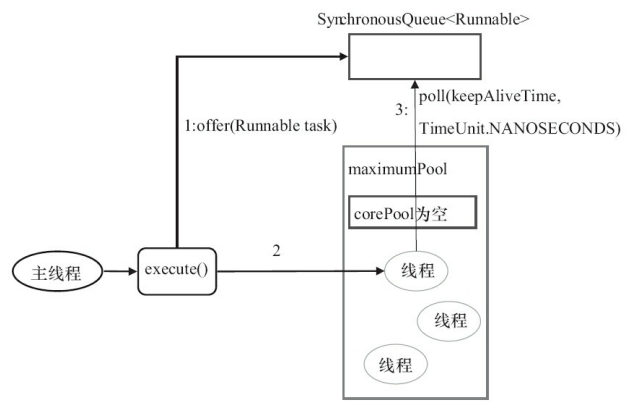
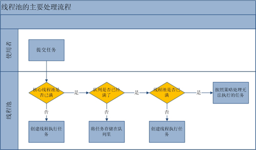

# 深度解读线程池源码实现之二

## 7.Executors

这节其实也不是分析 Executors 这个类，因为它仅仅是工具类，它的所有方法都是 static 的。

### 1 FixedThreadPool

```java{.line-numbers}
public static ExecutorService newFixedThreadPool(int nThreads) {
    return new ThreadPoolExecutor(nThreads, nThreads,
                                  0L, TimeUnit.MILLISECONDS,
                                  new LinkedBlockingQueue<Runnable>());
} 
```

FixedThreadPool 的 corePoolSize 和 maximumPoolSize 都被设置为创建 FixedThreadPool 时指定的参数 nThreads，意味着线程池中的线程数不会超过 nThreads。当线程池中的线程数大于 corePoolSize 时，keepAliveTime 为多余的空闲线程等待新任务的最长时间，超过这个时间后多余的线程将被终止。这里把 keepAliveTime 设置为 0L，意味着多余的空闲线程会被立即终止。

FixedThreadPool 的 **`execute()`** 方法的运行流程如下：

1. 如果当前运行的线程数少于 corePoolSize，则创建新线程来执行任务。
2. 在线程池完成预热之后（当前运行的线程数等于 corePoolSize），将任务加入 LinkedBlockingQueue。
3. 线程执行完 1 中的任务后，会在循环中反复从 LinkedBlockingQueue 获取任务来执行。

FixedThreadPool 使用无界队列 LinkedBlockingQueue 作为线程池的工作队列（队列的容量为 **`Integer.MAX_VALUE`**）。使用无界队列作为工作队列会对线程池带来如下影响：

1. 当线程池中的线程数达到 corePoolSize 后，新任务将在无界队列中等待，因此线程池中的线程数不会超过 corePoolSize。 
2. **<font color="red">由于 1，使用无界队列时 `maximumPoolSize` 将是一个无效参数</font>**。 
3. **<font color="red">由于 1 和 2，使用无界队列时 `keepAliveTime` 将是一个无效参数</font>**。这是由于线程数目 <= corePoolSize 时，即使线程空闲也不会关闭掉线程（除非 allowCoreThreadTimeOut 为 true），所以超时时间 KeepAliveTime 是一个无效参数。
4. 由于使用无界队列，运行中的 FixedThreadPool（未执行方法 **`shutdown()`** 或 **`shutdownNow()`**）不会拒绝任务，即不会调用 **`RejectedExecutionHandler.rejectedExecution`** 方法，因为任务总是可以添加到任务队列中。

最大线程数设置为与核心线程数相等，此时 keepAliveTime 设置为 0（因为这里它是没用的，即使不为 0 也不会关闭 corePoolSize 内的空闲线程），任务队列采用 **`LinkedBlockingQueue`**，无界队列。过程分析：刚开始，每提交一个任务都创建一个 worker，**<font color="red">当 worker 的数量达到 nThreads 后，不再创建新的线程，而是把任务提交到 `LinkedBlockingQueue` 中，而且之后线程数始终为 nThreads，所以叫做 FixedThreadPool</font>**。

### 2.SingleThreadExecutor

```java{.line-numbers}
public static ExecutorService newSingleThreadExecutor() {
    return new FinalizableDelegatedExecutorService
        (new ThreadPoolExecutor(1, 1,
                                0L, TimeUnit.MILLISECONDS,
                                new LinkedBlockingQueue<Runnable>()));
} 
```

这个更简单，和上面的一样，只要设置线程数为 1 就可以了。**`SingleThreadExecutor`** 的 corePoolSize 和 maximumPoolSize 被设置为 1。其他参数与 FixedThreadPool 相同。**`SingleThreadExecutor`** 使用无界队列 LinkedBlockingQueue 作为线程池的工作队列（队列的容量为 **`Integer.MAX_VALUE`**）。**`SingleThreadExecutor`** 使用无界队列作为工作队列对线程池带来的影响与 FixedThreadPool 相同。**`SingleThreadExecutor`** 可以看成是 FixedThreadPool 的一种特殊情况。

### 3.CachedThreadPool

```java{.line-numbers}
public static ExecutorService newCachedThreadPool() {
    return new ThreadPoolExecutor(0, Integer.MAX_VALUE,
                                  60L, TimeUnit.SECONDS,
                                  new SynchronousQueue<Runnable>());
} 
```

CachedThreadPool 是一个会根据需要创建新线程的线程池，同时可以复用之前创建的线程（如果这个线程当前没有任务）。

CachedThreadPool 的 corePoolSize 被设置为 0，即 corePool 为空；maximumPoolSize 被设置为 **`Integer.MAX_VALUE`**，即 maximumPool 是无界的。这里把 keepAliveTime 设置为 60L，意味着 **`CachedThreadPool`** 中的空闲线程（**<font color="red">根据前面 corePoolSize 和 maximumPoolSize 两个参数，这里的空闲线程指的是线程池中的所有线程，而不仅仅适用于核心线程</font>**）等待新任务的最长时间为60秒，空闲线程超过60秒后将会被终止。

FixedThreadPool 和 SingleThreadExecutor 使用无界队列 LinkedBlockingQueue 作为线程池的工作队列。CachedThreadPool 使用没有容量的 SynchronousQueue 作为线程池的工作队列，但 CachedThreadPool 的 maximumPool 是无界的。这意味着，如果主线程提交任务的速度高于线程处理任务的速度时，CachedThreadPool 会不断创建新线程。极端情况下，CachedThreadPool 会因为创建过多线程而耗尽 CPU 和内存资源。**<font color="red">在 SynchronousQueue 中，poll 和 offer 操作不会阻塞（除非人为设置一个等待时间），如果从队列中取出/插入元素成功，那么返回 true，否则如果没有其它线程来进行配对的话，直接返回 false。而对于 SynchronousQueue 来说， take 和 put 操作会一直阻塞，等待有线程来进行配对。在线程池里面一直都是用的是 offer 和 poll 操作</font>**。

CachedThreadPool 的 **`execute()`** 方法的执行示意图如下所示：

<div align="center">
    
</div>

图中的流程如下：

1. 由于 corePoolSize 设置为 0，所以首先执行 **`SynchronousQueue.offer`**，如果当前线程池中有空闲线程正在执行 **`SynchronousQueue.poll`**，那么主线程执行 offer 操作与空闲线程执行的 poll 操作配对成功，主线程把任务交给空闲线程执行，execute() 方法执行完成；否则执行下面的步骤 2) 。
2. 当初始线程池为空，或者线程池中当前没有空闲线程时，将没有线程执行 **`SynchronousQueue.poll`**。这种情况下，步骤1）将失败，也就是会使执行 offer 操作的线程直接返回 false。此时 CachedThreadPool 会创建一个新线程执行任务，execute() 方法执行完成。
3. **<font color="red">在步骤 2）中新创建的线程将任务执行完后，会在 getTask 方法中执行 `SynchronousQueue.poll`</font>**。这个 poll 操作会让空闲线 程最多在 SynchronousQueue 中等待 60 秒钟。如果 60 秒钟内主线程提交了一个新任务（主线程执 行步骤1），那么这个空闲线程将执行主线程提交的新任务；否则，这个空闲线程将会阻塞住，直到空闲时间达到 60s 之后被终止。由于 空闲 60 秒的空闲线程会被终止，因此长时间保持空闲的 CachedThreadPool 不会使用任何资源。

前面提到过，SynchronousQueue 是一个没有容量的阻塞队列。每个插入操作必须等待另一个线程的对应移除操作，反之亦然。CachedThreadPool 使用 SynchronousQueue，把主线程提交的 任务传递给空闲线程执行。

## 8.合理的配置线程

要想合理地配置线程池，就必须首先分析任务特性，可以从以下几个角度来分析。

- 任务的性质：CPU 密集型任务、IO 密集型任务和混合型任务。
- 任务的优先级：高、中和低。
- 任务的执行时间：长、中和短。
- 任务的依赖性：是否依赖其他系统资源，如数据库连接。

性质不同的任务可以用不同规模的线程池分开处理。

1. **<font color="red">CPU 密集型任务应配置尽可能小的线程，如配置 Ncpu+1 个线程的线程池</font>**。因为 CPU 密集型任务使得 CPU 使用率很高，若开过多的线程数，只能增加上下文切换的次数，因此会带来额外的开销。
2. IO 密集型任务线程并不是一直在执行任务，则应配置尽可能多的线程，如 2*Ncpu。这是因为 IO 密集型任务 CPU 使用率并不高，因此在某个线程在等待 IO 的时候让 CPU 去处理别的任务，充分利用 CPU 时间。
3. 混合型的任务，将其处理过程中的 CPU 密集部分和 IO 密集部分分别拆开，即将其拆分成一个 CPU 密集型任务 和一个 IO 密集型任务，只要这两个任务执行的时间相差不是太大，那么分解后执行的吞吐量将高于串行执行的吞吐量。如果这两个任务执行时间相差太大，则没必要进行分解。因为如果划分之后两个任务执行时间相差甚远，那么先执行完的任务就要等后执行完的任务，最终的时间仍然取决于后执行完的任务，而且还要加上任务拆分与合并的开销，得不偿失。

综合上面 3 点，我们可以得出一个结论：**<font color="red">线程等待时间所占比例越高，需要越多线程。线程 CPU 时间所占比例越高，需要越少线程。设置线程池大小的主要目的就是最大化的利用 CPU 时间</font>**，因此线程等待时间所占比例越高（如 IO 密集型任务），就需要在 CPU 空闲时切换让 CPU 去执行其它线程的任务，利用好 CPU 时间，而 CPU 密集型任务由于 CPU 利用率已经很高，就不需要设置太多的线程。 

依赖数据库连接池的任务，因为线程提交 SQL 后需要等待数据库返回结果，等待的时间越长，则 CPU 空闲时间就越长，那么线程数应该设置得越大，这样才能更好地利用CPU。
 
**<font color="red">最后建议使用有界队列。有界队列能增加系统的稳定性和预警能力，可以根据需要设大一点儿，比如几千</font>**。有一次，我们系统里后台任务线程池的队列和线程池全满了，不断抛出抛弃任 务的异常，通过排查发现是数据库出现了问题，导致执行SQL变得非常缓慢，因为后台任务线 程池里的任务全是需要向数据库查询和插入数据的，所以导致线程池里的工作线程全部阻 塞，任务积压在线程池里。如果当时我们设置成无界队列，那么线程池的队列就会越来越多， 有可能会撑满内存，导致整个系统不可用，而不只是后台任务出现问题。当然，我们的系统所 有的任务是用单独的服务器部署的，我们使用不同规模的线程池完成不同类型的任务，但是 出现这样问题时也会影响到其他任务。

### 1 是否使用线程池就一定比使用单线程高效呢？

答案是否定的，比如 Redis 就是单线程的，但它却非常高效，基本操作都能达到十万量级/s。从线程这个角度来看，部分原因在于：

- 多线程带来线程上下文切换开销，单线程就没有这种开销
- 锁

当然 "Redis很快" 更本质的原因在于：**<font color="red">Redis 基本都是内存操作，这种情况下单线程可以很高效地利用 CPU。而多线程适用场景一般是：存在相当比例的 IO 和网络操作</font>**。所以即使有上面的简单估算方法，也许看似合理，但实际上也未必合理，都需要结合系统真实情况（比如是 IO 密集型或者是 CPU 密集型或者是纯内存操作）和硬件环境（CPU、内存、硬盘读写速度、网络状况等）来不断尝试达到一个符合实际的合理估算值。

### 2 实现优先级线程池

在实际的开发中，会将各种不同的异步任务提交到线程池执行，它们有轻重缓急。如果任务量少，一来就有空闲线程处理，那么就不需要特殊处理。如果任务量多，我们希望队列根据任务的优先级有序存储，即优先级高的将会被优先消费。实现的话有两个关键点：

- 线程池的任务队列具备排序功能：**`ThreadPoolExecutor`** 的构造函数有一个 **`BlockingQueue<Runnable> workQueue`** 参数，这个接口有一个实现类 **`PriorityBlockingQueue<E>`**，它的构造函数可以传入一个比较器 Comparator，能够满足要求。
- 提交的任务具备可比性：ThreadPoolExecutor 的 submit、invokeXxx、execute 方法入参都是 Runnable、Callable，均不具备可排序的属性。我们可以弄一个实现类，加一些额外的属性，这样就可以让它们具备可比较性了。

可以通过 **`Runtime.getRuntime().availableProcessors()`** 方法获得当前设备的 CPU 个数。 优先级不同的任务可以使用优先级队列 PriorityBlockingQueue 来处理。它可以让优先级高 的任务先执行。 注意 如果一直有优先级高的任务提交到队列里，那么优先级低的任务可能永远不能执行。 执行时间不同的任务可以交给不同规模的线程池来处理，或者可以使用优先级队列，让执行时间短的任务先执行。

## 9.总结

### 1 线程池的提交方式

线程池的提交方式有 execute 以及 submit 这三种，其中 execute 是定义在 Executor 接口中的方法，定义如下：

```java{.line-numbers}
public interface Executor {
    void execute(Runnable command);
} 
```

而 AbstractExecutorService 类中的 submit 方法有以下三种：

```java{.line-numbers}

public Future<?> submit(Runnable task) {
    if (task == null) throw new NullPointerException();
    RunnableFuture<Void> ftask = newTaskFor(task, null);
    execute(ftask);
    return ftask;
}
public <T> Future<T> submit(Runnable task, T result) {
    if (task == null) throw new NullPointerException();
    RunnableFuture<T> ftask = newTaskFor(task, result);
    execute(ftask);
    return ftask;
}
public <T> Future<T> submit(Callable<T> task) {
    if (task == null) throw new NullPointerException();
    RunnableFuture<T> ftask = newTaskFor(task);
    execute(ftask);
    return ftask;
} 
```

其实 submit()方法就是对 execute() 方法的一种封装, 它内部也是调用 execute()方法来实现任务提交的, 只是因为 submit()方法的返回值是一个 Future 对象, 通过返回的 Future 对象就能获取该任务最终执行的结果。

另外一个最基本的概念是，submit 方法中，参数是 Runnable 类型或者 Callable 类型，这个参数不是用于 **`new Thread(runnable).start()`** 中的，**<font color="red">此处的 `Runnable/Callable` 参数不是用于启动线程的，这里指的是任务</font>**，任务要做的事情定义在 **`run()`** 方法里面或 Callable 中的 **`call()`** 方法里面。初学者往往会搞混这个，因为 Runnable 总是在各个地方出现，经常把一个 Runnable 包到另一个 Runnable 中。请把它想象成有个 Task 接口，这个接口里面有一个 **`run()`** 方法（我想作者只是不想因为这个再定义一个完全可以用 Runnable 来代替的接口，Callable 的出现，完全是因为 Runnable 不能满足需要）。

从上面的代码可以看出，不管是实现了 Callable 还是 Runnable 接口的任务，都会被封装成 FutureTask 类型的任务，然后在 runWorker 方法中调用这些任务的 run 方法（即 FutureTask 的 run 方法）。不过实现了 Callable 还是 Runnable 接口的任务在传入 FutureTask 的构造函数中，都被封装成了 Callable 类型的任务，然后在 FutureTask 的 run 方法中调用其 Callable 任务的 call 方法。

我们先来说说相关的类 FutureTask。

1. **`Future -> RunnableFuture -> FutureTask`**
2. **`Runnable -> RunnableFuture`**
3. FutureTask 通过 RunnableFuture 间接实现了 Runnable 接口
4. 所以每个 **`Runnable/Callable`** 接口通常都先包装成 FutureTask，在 FutureTask 内部，会将 Runnable 再包装成 Callable 接口对象然后保存到 FutureTask 的 Callable 属性中（Callable 是直接保存到 FutureTask 属性中）。最后调用 FutureTask 的 run 方法时，会直接调用 Callable 属性的 call 方法
5. 然后调用 **`executor.execute(Runnable command)`** 将其提交给线程池 

我们知道，Runnable 的 **`void run()`** 方法是没有返回值的，所以，通常，如果我们需要的话，会在 submit 中指定第二个参数作为返回值：

```java{.line-numbers}
<T> Future<T> submit(Runnable task, T result); 
```

其实到时候在 FutureTask 类的内部会通过这两个参数，将其包装成 Callable。Callable 也是因为线程池的需要，所以才有了这个接口。它和 Runnable 的区别在于 **`run()`** 没有返回值，而 Callable 的 **`call()`** 方法有返回值，同时，如果运行出现异常，**`call()`** 方法会抛出异常。

### 2 线程池的参数

#### 2.1 workQueue

workQueue 是一个 BlockingQueue ( 阻塞队列) 的实例，传入的泛型类型是 Runnable. 也就是说，workQueue 是一个内部元素为 Runnable ( 各种任务，通常是异步的任务) 的阻塞队列. 阻塞队列是一种类似于 "生产者- 消费者" 模型的队列. 当队列已满时如果继续向队列中插入元素，该插入操作将被阻塞一直处于等待状态，直到队列中有元素被移除产生空位子后，才有可能执行这次插入操作; 当队列为空时如果继续执行元素的删除或获取操作，该操作同样会被阻塞而进入等待状态，直到队列中又有了该元素后，才有可能执行该操作。

一般来说，队列对新提交的任务有三种常见的处理策略: 

**1.直接切换**

直接切换使用的队列时 SynchronousQueue 队列，这种队列是一个没有数据缓冲的阻塞队列，生产者线程对其的插入操作 put() 必须等待消费者的移除操作 take()，反过来也一样，消费者的移除操作 take() 必须等待生产者线程的插入操作 put()。但是 poll() 和 offer() 就不会阻塞，举例来说就是 offer 的时候如果有消费者在等待那么就会立马满足返回 true，如果没有就会返回 false，不会等待消费者到来。

当提交一个任务到包含这种 SynchronousQueue 队列的线程池以后，线程池会去检测是否有可用的空闲线程来执行该任务，如果没有就直接新建一个线程来执行该任务而不是将该任务先暂存在队列中. “直接切换”的意思就是，处理方式由”将任务暂时存入队列”直接切换为”新建一个线程来处理该任务”. **<font color="red">这种策略适合用来处理多个有相互依赖关系的任务，因为该策略可以避免这些任务因一个没有及时处理而导致依赖于该任务的其他任务也不能及时处理而造成的锁定效果. 因为这种策略的目的是要让几乎每一个新提交的任务都能得到立即处理</font>**，所以这种策略通常要求最大线程数 maximumPoolSizes 是无界的 ( 即: **`Integer.MAX_VALUE`**)。 静态工厂方法 **`Executors.newCachedThreadPool()`** 使用了这个队列。 

**2.使用无界队列**

也就是不预设队列的容量，队列将使用 **`Integer.MAX_VALUE`** 作为其默认容量，例如: 基于链表的阻塞队列 LinkedBlockingQueue. 使用无界队列将使得线程池中 **<font color="red">能够创建的最大线程数就等于核心线程数 corePoolSize，这样线程池的 maximumPoolSize 的数值起不到任何作用</font>**。

如果向这种线程池中提交一个新任务时发现所有核心线程都处于运行状态，那么该任务将被放入无界队列中等待处理. 当要处理的多个任务之间没有任何相互依赖关系时，就适合使用这种队列策略来处理这些任务. 静态工厂方法 **`Executors.newFixedThreadPool()/newSingleThreadExecutor`** 使用了这个队列。 

**3.使用有界队列**

例如: 基于数组的阻塞队列 ArrayBlockingQueue，阻塞队列的大小有上限。

#### 2.2 threadFactory

threadFactory 线程工厂，用于创建线程。如果我们在创建线程池的时候未指定该 threadFactory 参数，线程池则会使用 **`Executors.defaultThreadFactory()`** 方法创建默认的线程工厂。如果我们想要为线程工厂创建的线程设置一些特殊的属性。例如: 设置线程的名字，设置特定的优先级等等，那么 **<font color="red">我们就需要自己去实现 ThreadFactory 接口，并在实现其抽象方法 **`newThread()`** 的时候，使用 Thread 类包含 threadName ( 线程名字) 的那个构造方法就可以指定线程的名字</font>**。然后在创建线程池的时候，将我们自己实现的 ThreadFactory 接口的实现类对象作为 threadFactory 参数的值传递给线程池的构造方法即可。

#### 2.3 handler

以下两个条件满足其中任意一个的时候，如果继续向该线程池中提交新的任务，那么线程池将会调用他内部的 RejectedExecutionHandler 对象(也就是 handler)的 **`rejectedExecution()`** 方法，表示拒绝执行这些新提交的任务:

1. 当 **`线程池处于 >= SHUTDOWN`** (关闭) 状态时 (不论线程池和阻塞队列是否都已满)；
2. 当线程池中的所有线程都处于运行状态（即线程池中的线程数量等于 maximumPoolSize）并且线程池中的阻塞队列已满时；

我们知道了默认情况下线程池是使用抛异常的方式来拒绝新提交的任务的，这种抛异常的方式在线程池中被称为 AbortPolicy. 当然，除了这种 AbortPolicy 方式外，线程池还为我们提供了 CallerRunsPolicy，DiscardPolicy和 DiscardOldestPolicy 的方式，下面我们就来分别简要介绍下这几种方式:

1. AbortPolicy：前面已经介绍过，这是一种直接抛异常的处理方式，抛出 **`RejectedExecutionException`** 异常。如果在 **`ThreadPoolExecutor`** 的构造方法中未指定 **`RejectedExecutionHandler`** 参数，那么线程池将使用他内部预定义的 defaultHandler 这个字段作为该参数的值，而这个 defaultHandler 就是采用的 AbortPolicy 抛异常的方式。这也就解释了为什么在前边的demo例子中，线程池在满足前边提到的两个条件中的任意一个时，都会采取抛异常的方式来拒绝新提交的任务。
2. CallerRunsPolicy：将新提交的任务放在 **`ThreadPoolExecutor.execute()`** 方法所在的那个线程中执行。
3. DiscardPolicy：直接不执行新提交的任务。
4. DiscardOldestPolicy：这种处理方式分为两种情况: 
   1. 当线程池已经关闭 (SHUTDOWN) 时，就不执行这个任务了，这也是 DiscardPolicy 的处理方式；
   2. 当线程池未关闭时, 会将阻塞队列中处于队首 (head) 的那个任务从队列中移除, 然后再将这个新提交的任务加入到该阻塞队列的队尾 (tail) 等待执行；

#### 2.4 ctl

Doug Lea 采用一个 32 位的整数来存放线程池的状态和当前池中的线程数，**<font color="red">其中高 3 位用于存放线程池状态，低 29 位表示线程数</font>**。

#### 2.5 corePoolSize

结合上述注释可知，**<font color="red">`corePoolSize` 字段表示的是线程池中一直存活着的线程的最小数量</font>**，这些一直存活着的线程又被称为核心线程. 默认情况下，核心线程的这个最小数量都是正数，除非调用了 **`allowCoreThreadTimeOut()`** 方法并传递参数为 true，设置允许核心线程因超时而停止(terminated)，在那种情况下，一旦所有的核心线程都先后因超时而停止了，将使得线程池中的核心线程数量最终变为 0，也就是一直存活着的线程数为 0，这将是那种情况下，线程池中核心线程数量的最小值。

默认情况下，核心线程是按需创建并启动的，也就是说，只有当线程池接收到我们提交给他的任务后，他才会去创建并启动一定数量的核心线程来执行这些任务. 如果他没有接收到相关任务，他就不会主动去创建核心线程. 这种默认的核心线程的创建启动机制，有助于降低系统资源的消耗. 变主动为被动，类似于常见的观察者模式。当然这只是系统默认的方式，如果有特殊需求的话，我们也可以通过调用 **`prestartCoreThread()`** 或 **`prestartAllCoreThreads()`** 方法来改变这一机，使得在新任务还未提交到线程池的时候，线程池就已经创建并启动了一个或所有核心线程，并让这些核心线程在池子里等待着新任务的到来。

#### 2.6 maximumPoolSize 

maximumPoolSize 表示线程池内能够容纳线程数量的最大值。如果将线程池的核心线程数 corePoolSize 和 最大线程数 maximumPoolSize 设置为相同的数值 (也就是说，线程池中的所有线程都是核心线程), 那么该线程池就是一个容量固定的线程池. 如果将最大线程数 maximumPoolSize 设置为一个非常大的数值( 例如: **`Integer.MAX_VALUE`**), 那么就相当于允许线程池自己在不同时段去动态调整参与并发的任务总数. 通常情况下, 核心线程数 corePoolSize 和 最大线程数 maximumPoolSize 仅在创建线程池的时候才去进行设定, 但是, 如果在线程池创建完成以后, 你又想去修改这两个字段的值, 你就可以调用 **`setCorePoolSize()`** 和 **`setMaximumPoolSize()`** 方法来分别重新设定核心线程数 corePoolSize 和 最大线程数 maximumPoolSize 的数值。

#### 2.7 keepAliveTime

从注释可知, keepAliveTime 表示空闲线程处于等待状态的超时时间(也即, 等待时间的上限值, 超过该时间后该线程会停止工作). 当总线程数大于 corePoolSize (核心线程数) 并且 allowCoreThreadTimeOut 为 false 时, 这些多出来的非核心线程一旦进入到空闲等待状态, 就开始计算各自的等待时间, 并用这里设定的 keepAliveTime 的数值作为他们的超时时间, 一旦某个非核心线程的等待时间达到了超时时间, 该线程就会停止工作(terminated)。

而核心线程在这种情况下却不会受超时机制的制约, 核心线程即使等待的时间超出了这里设定的 keepAliveTime, 也依然可以继续处于空闲等待状态而不会停止工作. 但是, 如果 allowCoreThreadTimeOut 被设置为 true 并且设置的 keepAliveTime > 0, 那么不论是非核心线程还是核心线程, 都将受超时机制的制约.

所以, 如果要执行的任务相对较多，并且每个任务执行的时间比较短，那么可以为该参数设置一个相对较大的数值，以提高线程的利用率。如果执行的任务相对较少, 线程池使用率相对较低, 那么可以先将该参数设置为一个较小的数值, 通过超时停止的机制来降低系统线程资源的开销, 后续如果发现线程池的使用率逐渐增高以后, 线程池会根据当前提交的任务数自动创建新的线程。

### 3 execute 方法的执行过程

execute() 方法主要分为以下四种情况: 

- 情况 1: 如果线程池内的有效线程数少于核心线程数 corePoolSize，那么就创建并启动一个线程来执行新提交的任务；
- 情况 2: 如果线程池内的有效线程数达到了核心线程数 corePoolSize，并且线程池内的阻塞队列未满，那么就将新提交的任务加入到该阻塞队列中；
- 情况 3: 如果线程池内的有效线程数达到了核心线程数 corePoolSize 但却小于最大线程数 maximumPoolSize，并且线程池内的阻塞队列已满，那么就创建并启动一个非核心线程来执行新提交的任务；
- 情况 4: 如果线程池内的有效线程数达到了最大线程数 maximumPoolSize，并且线程池内的阻塞队列已满，那么就让 **`RejectedExecutionHandler`** 根据它的拒绝策略来处理该任务，默认的处理方式是直接抛异常；

上述四种情况可以使用下面的流程图来描述:

<div align="center">
    
</div>