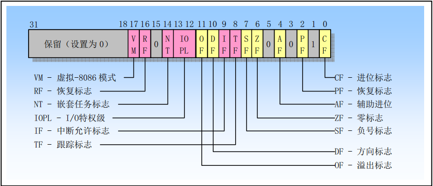

# x86-32 汇编保护模式之一

## 一、8086 系统寄存器和系统指令

为了协助处理器执行初始化和控制系统操作，8086 提供了一个标志寄存器 EFLAGS 和几个系统寄存器，除了一些通用状态标志（如 ZF、CF、OF 等）外，EFLAGS 中还包含几个系统标志。这些系统标志用于控制任务切换、中断处理、指令跟踪以及 I/O 端口访问权限。系统寄存器用于内存管理和控制处理器操作。含有分段和分页处理机制系统表的基地址、控制处理器操作的位标志位。

### 1.标志寄存器

标志寄存器 EFLAGS 中的系统标志和 IOPL 字段用于控制 I/O 访问、可屏蔽硬件中断（IF）、调试（TF）、任务切换（NT）以及虚拟 8086 模式，如下图所示。**通常只允许操作系统代码有权修改这些标志**。EFLAGS 中的其他标志是一些通用标志(进位 CF、奇偶 PF、辅助进位 AF、零标志 ZF、负号 SF、方向 DF、溢出 OF)。我们仅对 EFLAGS 中的系统标志进行说明。

    

#### 1.1 IOPL

