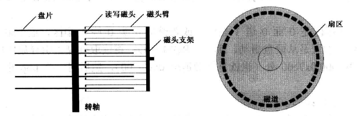
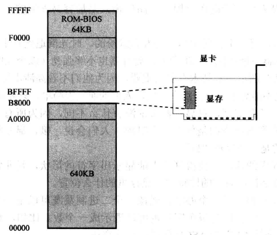
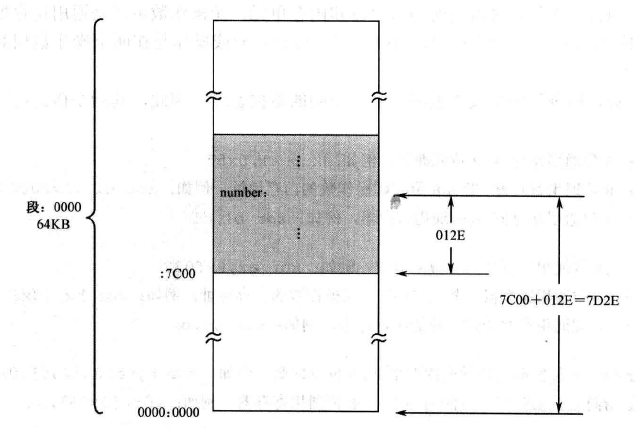

# 汇编实模式之概述

## 一、处理器、内存和指令

### 1.8086 通用寄存器

8086 处理器内部有 8 个 16 位的通用寄存器，分别被命名为 AX、BX、CX、DX、SI、DI、BP、SP。而 AX、BX、CX 和 DX，又各自可以拆分成两个 8 位的寄存器来使用，总共可以提供 8 个 8 位的寄存器 AH、AL、BH、BL、CH、CL、DH 和 DL。

### 2.程序重定位

为了让程序可以在内存中的任何地方正确执行，就只能在编写程序的时候使用相对地址或者逻辑地址了，而不能使用真实的物理地址。当程序加载时，这些相对地址还要根据程序实际被加载的位置重新计算。

### 3.内存分段机制

在采用分段策略之后，一个内存单元的地址可以使用 **`段地址:偏移地址`** 来表示，这也就是逻辑地址。在硬件层面，处理器提供了两个段寄存器，代码段寄存器（code segment, cs）和数据段寄存器（data segment, ds）。一旦处理器遇到一条访问内存的指令，它把指令中指定的内存地址看成是段内的偏移地址，**然后把 DS 中的数据段起始地址和指令中提供的段内偏移相加**，来得到访问内存所需要的物理地址。

ES 是附加段（extra segment）寄存器，当需要在程序中同时使用两个数据段时，DS 指向一个，ES 指向另一个。可以在指令中指定使用 DS 和 ES 中的哪一个，如果没有指定，则默认是使用 DS，SS 是栈段寄存器。

CS 指向代码段的起始地址，IP 则指向段内偏移。CS 和 IP 共同形成逻辑地址，处理器会自动根据当前指令的长度来改变 IP 的值，使它指向下一条指令。

8086 处理器的地址总线有 20 根，段寄存中的地址先左移 1 位，再与偏移地址相加，得到真正的 20 位物理地址。

## 二、计算机的启动过程

### 1.处理器加电

每当处理器加电，或者 **`RESET`** 引脚的电平由低变高时，处理器都会执行一个硬件初始化，以及一个可选的内部自测试（**`Build-in Self-Test，BIST`**），然后将内部所有寄存器的内容初始到一个预置的状态。

对于 Intel 8086 来说，复位将使代码段寄存器（CS）的内容为 **`0xFFFF`**，其他所有寄存器（包括 IP 寄存器）的内容都为 0x0000。在以 Intel 8086 为处理器的系统中，ROM 占据着整个内存空间顶端的 64KB，物理地址范围是 **`0xF0000～0xFFFFF`**，里面固化了开机时要执行的指令；DRAM 占据着较低端的 640KB，地址范围是 **`0x00000～0x9FFFF`**。因此，当处理器加电之后，cs:ip 寄存器指向固化了开机代码的 ROM 内存空间。在物理内存地址为 **`0xFFFF0`** 的地方，是一个跳转指令 **`jmp 0xf000:0xe05b`**，跳转到 ROM 中较低的地址处继续执行。

这块 ROM 芯片中的内容包括很多部分，主要是进行硬件的诊断、检测和初始化。最后，它还负责提供一套软件例程，从外围设备（比如键盘）获取输入数据，或者向外围设备（比如显示器）输出数据。它所提供的软件例程，只包含最基本、最常规的输入和输出功能。正因为如此，这块芯片又叫基本输入输出系统（**`Base Input & Output System，BIOS`**）ROM。

最后 ROM 芯片从外部存储设备（一般是硬盘的主引导扇区）中读取操作系统的自举代码，将计算机的控制权交给操作系统。

### 2.硬盘结构

<div align="center">
    
</div>

每个盘片都有两个磁头（Head），上面一个，下面一个，所以经常用磁头来指代盘面。磁头都有编号，第 1 个盘片，上面的磁头编号为 0，下面的磁头编号为 1；第 2 个盘片，上面的磁头编号为 2，下面的磁头编号为 3。

每个磁头不是单独移动的。相反，它们都通过磁头臂固定在同一个支架上，由步进电动机带动着一起在盘片的中心和边缘之间来回移动。也就是说，它们是同进退的。当盘片高速旋转时，磁头每步进一次，都会从它所在的位置开始，绕着圆心“画”出一个看不见的圆圈，这就是磁道（Track）。因为所有磁头都是同进退的，故每个盘面上的同一条磁道又可以形成一个虚拟的圆柱，称为柱面（Cylinder）。

磁道，或者柱面，也要编号。编号是从盘面最边缘的那条磁道开始，向着圆心的方向，从 0 开始编号。为了加速数据在硬盘上的读写，最好的办法就是尽量不移动磁头。这样，**当 0 面的磁道不足以容纳要写入的数据时，应当把剩余的部分写在 1 面的同一磁道上。如果还写不下，那就继续把剩余的部分写在 2 面的同一磁道上**。磁道还要进一步划分为扇区（Sector）。而且，每个扇区都有一个编号，扇区的编号是从 1 开始的。每个扇区以扇区头开始，然后是 512 个字节的数据区。

**硬盘的第一个扇区是 0 面 0 道 1 扇区，或者说是 0 头 0 柱 1 扇区，这个扇区称为主引导扇区（Main Boot Sector, MBR）**。如果计算机的设置是从硬盘启动，那么，ROM-BIOS 将读取硬盘主引导扇区的内容，将它加载到内存地址 0x0000:0x7c00 处（也就是物理地址 0x07C00），然后用一个 jmp 指令跳到那里接着执行 **`jmp 0x0000:0x7c00`**。**通常，主引导扇区的功能是继续从硬盘的其它部分读取更多的内容加以执行**。一个有效的主引导扇区，最后两个字节为 0x55 和 0xAA。

> 虚拟机磁盘是一个特殊的文件，这样，当一个软件程序在虚拟机里读写硬盘或者光盘时，虚拟机将把它转换成对文件的操作。**`VDI`** 是 **`VirtualBox`** 的虚拟硬盘规范，**`VMDK`** 是 **`VMWare`** 的虚拟硬盘规范。**`VHD`** 是微软的的虚拟硬盘规范。

硬盘的读写是以扇区为最小单位的。无论是要从硬盘读数据，或者向硬盘写数据，至少得是 1 个扇区。一个扇区的尺寸是 512 字节，可以看成一个数据块。所以，硬盘是一个典型的块（Block）设备。

> LBA 模式不考虑扇区的物理位置（磁头号、磁道号），而是把它们全部组织起来统一编号。在这种编址方式下，原先的物理扇区被组织成逻辑扇区，且都有唯一的逻辑扇区号。**LBA 模式中，扇区在编号时，是以柱面为单位的**，先是 0 面 0 道，再是 1 面 0 道，直到把所有盘面上的 0 磁道处理完，再接着处理下一个柱面。为了要加速硬盘的访问，最好尽可能少的移动磁头。

## 三、编写主引导扇区代码

本节编写的主引导扇区代码如下所示，主要的功能为在屏幕上显示 **`Label offset:地址`**。

```c{.line-numbers}
;硬盘主引导扇区代码
;指向文本模式的显示缓冲区
start: mov ax, 0xb800
mov es, ax

;以下显示字符串 "Label offset:"
mov byte [es:0x00], 'L'
;控制字符的显示属性
mov byte [es:0x01], 0x07
mov byte [es:0x02], 'a'
mov byte [es:0x03], 0x07
mov byte [es:0x04], 'b'
mov byte [es:0x05], 0x07
mov byte [es:0x06], 'e'
mov byte [es:0x07], 0x07
mov byte [es:0x08], 'l'
mov byte [es:0x09], 0x07
mov byte [es:0x0a], ' '
mov byte [es:0x0b], 0x07
mov byte [es:0x0c], 'o'
mov byte [es:0x0d], 0x07
mov byte [es:0x0e], 'f'
mov byte [es:0x0f], 0x07
mov byte [es:0x10], 'f'
mov byte [es:0x11], 0x07
mov byte [es:0x12], 's'
mov byte [es:0x13], 0x07
mov byte [es:0x14], 'e'
mov byte [es:0x15], 0x07
mov byte [es:0x16], 't'
mov byte [es:0x17], 0x07
mov byte [es:0x18], ':'
mov byte [es:0x19], 0x07

;取得标号 number 的偏移地址
mov ax, number
mov bx, 10

;设置数据段的基地址
mov cx, cs
mov ds, cx

;求个位上的数字
mov dx, 0
;dx(高 16 位) ax(低 16 位) 除以 bx，最后的结果商在 ax 中，余数在 dx 中
div bx
;保存个位上的数字
mov [0x7c00 + number + 0x00], dl

;求十位上的数字
xor dx, dx
div bx
;保存十位上的数字
mov [0x7c00 + number + 0x01], dl

;求百位上的数字
xor dx, dx
div bx
;保存百位上的数字
mov [0x7c00 + number + 0x02], dl

;求千位上的数字
xor dx, dx
div bx
;保存千位上的数字
mov [0x7c00 + number + 0x03], dl

;求万位上的数字
xor dx, dx
div bx
;保存万位上的数字
mov [0x7c00 + number + 0x04], dl

;以下用十进制显示标号的偏移地址
mov al, [0x7c00 + number + 0x04]
add al, 0x30
mov [es:0x1a], al
mov byte [es:0x1b], 0x04

mov al, [0x7c00 + number + 0x03]
add al, 0x30
mov [es:0x1c], al
mov byte [es:0x1d], 0x04

mov al, [0x7c00 + number + 0x02]
add al, 0x30
mov [es:0x1e], al
mov byte [es:0x1f], 0x04

mov al, [0x7c00 + number + 0x01]
add al, 0x30
mov [es:0x20], al
mov byte [es:0x21], 0x04

mov al, [0x7c00 + number + 0x00]
add al, 0x30
mov [es:0x22], al
mov byte [es:0x23], 0x04

mov byte [es:0x24], 'D'
mov byte [es:0x25], 0x07

;开启无限循环
infi: jmp near infi

number db 0,0,0,0,0
current: times 510 - (current - start) db 0
db 0x55, 0xaa
```

### 1.在屏幕上显示文字

显卡有自己的存储器，称为显示存储器（Video RAM，VRAM），简称显存，要显示的内容都预先写入显存。处理器在内存空间可以直接访问显卡的存储器，把要显示的字符 ASCII 码写入，从而显示字符。下图是文本模式下显存到内存的映射：

<div align="center">
    
</div>

8086 可以访问 1MB 内存。其中，**`0x00000～9FFFF`** 属于常规内存，由内存条提供；**`0xF0000～0xFFFFF`** 由主板上的一个芯片提供，即 ROM-BIOS；中间的空洞，即 **`0xA0000～0xEFFFF`**，传统上，这段地址空间由特定的外围设备来提供，其中 **`0xB8000～0xBFFFF`** 就是留给显卡的，由显卡来显示文本。

### 2.初始化段寄存器

为了访问显存，也需要使用逻辑地址，即 段地址:偏移地址 的形式，在上面 **`0xB8000～0xBFFFF`** 的地址空间中，我们将 **`0xB800`** 看成是显存的段地址，偏移地址范围为 **`0x0000~0x7FFF`**。又由于 ds 是数据段寄存器、cs 是代码段寄存器而 ss 是栈段寄存器，这些段寄存器都有各自的作用，所以这里使用 es 作为显存的段寄存器。

> 注意，不能使用 **`mov 段寄存器, 立即数`** 指令，而必须使用 **`mov 段寄存器, 通用寄存器`** 或者 **`mov 段寄存器，内存单元`**。

### 3.显示字符

对于上述源码中的第 7 行 **`mov byte [es:0x00], 'L'`**，不能改成 **`mov byte [0x00], 'L'`**，**一般情况下，如果没有附加任何指示，段地址默认在段寄存器 ds 中**，因此我们这里使用了段超越前缀 **`es:`**，要求处理器在生成物理地址时，使用段寄存器 ES，而不是默认情况下的 DS。使用方括号围起来，以表明 mov 指令的源操作数是一个地址。

最后，关键字 byte 用来修饰目的操作数，指出本次传送是以字节的方式进行的，否则传送到指定内存单元的立即数既可以是 **`0x4C`**（一个字节），也可以是 **`0x004C`**（一个字）。mov 指令的格式，目的操作数必须是通用寄存器或者内存单元；源操作数可以是和目的操作数具有相同数据宽度的通用寄存器和内存单元，还可以是立即数。

> 如果 mov 指令的目的和源操作数可以反映出操作的数据宽度，那么就不需要添加 byte 和 word 标识。mov 指令的目的操作数不允许为立即数，**并且源操作数和目的操作数不允许同时为内存单元**。

### 4.汇编地址

在源程序的编译阶段，**编译器会把上述源程序整体上作为一个独立的段来处理，并从 0 开始计算和跟踪每一条指令的地址**。因为该地址是在编译期间计算的，故称为汇编地址。汇编地址是在源程序编译期间，编译器为每条指令确定的汇编位置（Assembly Position），也就是每条指令相对于整个程序开头的偏移量，以字节计。当编译后的程序装入物理内存后，它又是该指令在内存段内的偏移地址。当编译好的程序加载到物理内存后，**它在段内的偏移地址和它在编译阶段的汇编地址是相等的**。

下面是汇编程序源码编译之后的结果，从左到右依次为行号、指令的汇编地址、指令编译后的机器码、源程序代码和注释。

```c{.line-numbers}
1                                           ;代码清单 
2                                           ;文件名：c05_mbr.asm
3                                           ;文件说明：硬盘主引导扇区代码
4                                           
5                                           
6 00000000 B800B8                           mov ax,0xb800                 ;指向文本模式的显示缓冲区
7 00000003 8EC0                             mov es,ax
8                                  
9                                           ;以下显示字符串"Label offset:"
10 00000005 26C60600004C                     mov byte [es:0x00],'L'
11 0000000B 26C606010007                     mov byte [es:0x01],0x07
12 00000011 26C606020061                     mov byte [es:0x02],'a'
13 00000017 26C606030007                     mov byte [es:0x03],0x07
14 0000001D 26C606040062                     mov byte [es:0x04],'b'
15 00000023 26C606050007                     mov byte [es:0x05],0x07
16 00000029 26C606060065                     mov byte [es:0x06],'e'
17 0000002F 26C606070007                     mov byte [es:0x07],0x07
18 00000035 26C60608006C                     mov byte [es:0x08],'l'
19 0000003B 26C606090007                     mov byte [es:0x09],0x07
20 00000041 26C6060A0020                     mov byte [es:0x0a],' '
21 00000047 26C6060B0007                     mov byte [es:0x0b],0x07
22 0000004D 26C6060C006F                     mov byte [es:0x0c],"o"
23 00000053 26C6060D0007                     mov byte [es:0x0d],0x07
24 00000059 26C6060E0066                     mov byte [es:0x0e],'f'
25 0000005F 26C6060F0007                     mov byte [es:0x0f],0x07
26 00000065 26C606100066                     mov byte [es:0x10],'f'
27 0000006B 26C606110007                     mov byte [es:0x11],0x07
28 00000071 26C606120073                     mov byte [es:0x12],'s'
29 00000077 26C606130007                     mov byte [es:0x13],0x07
30 0000007D 26C606140065                     mov byte [es:0x14],'e'
31 00000083 26C606150007                     mov byte [es:0x15],0x07
32 00000089 26C606160074                     mov byte [es:0x16],'t'
33 0000008F 26C606170007                     mov byte [es:0x17],0x07
34 00000095 26C60618003A                     mov byte [es:0x18],':'
35 0000009B 26C606190007                     mov byte [es:0x19],0x07
36                                  
37 000000A1 B8[2E01]                         mov ax,number                 ;取得标号number的偏移地址
38 000000A4 BB0A00                           mov bx,10
39                                  
40                                           ;设置数据段的基地址
41 000000A7 8CC9                             mov cx,cs
42 000000A9 8ED9                             mov ds,cx
43                                  
44                                           ;求个位上的数字
45 000000AB BA0000                           mov dx,0
46 000000AE F7F3                             div bx
47 000000B0 8816[2E7D]                       mov [0x7c00+number+0x00],dl   ;保存个位上的数字
48                                  
49                                           ;求十位上的数字
50 000000B4 31D2                             xor dx,dx
51 000000B6 F7F3                             div bx
52 000000B8 8816[2F7D]                       mov [0x7c00+number+0x01],dl   ;保存十位上的数字
53                                  
54                                           ;求百位上的数字
55 000000BC 31D2                             xor dx,dx
56 000000BE F7F3                             div bx
57 000000C0 8816[307D]                       mov [0x7c00+number+0x02],dl   ;保存百位上的数字
58                                  
59                                           ;求千位上的数字
60 000000C4 31D2                             xor dx,dx
61 000000C6 F7F3                             div bx
62 000000C8 8816[317D]                       mov [0x7c00+number+0x03],dl   ;保存千位上的数字
63                                  
64                                           ;求万位上的数字 
65 000000CC 31D2                             xor dx,dx
66 000000CE F7F3                             div bx
67 000000D0 8816[327D]                       mov [0x7c00+number+0x04],dl   ;保存万位上的数字
68                                  
69                                           ;以下用十进制显示标号的偏移地址
70 000000D4 A0[327D]                         mov al,[0x7c00+number+0x04]
71 000000D7 0430                             add al,0x30
72 000000D9 26A21A00                         mov [es:0x1a],al
73 000000DD 26C6061B0004                     mov byte [es:0x1b],0x04
74                                           
75 000000E3 A0[317D]                         mov al,[0x7c00+number+0x03]
76 000000E6 0430                             add al,0x30
77 000000E8 26A21C00                         mov [es:0x1c],al
78 000000EC 26C6061D0004                     mov byte [es:0x1d],0x04
79                                           
80 000000F2 A0[307D]                         mov al,[0x7c00+number+0x02]
81 000000F5 0430                             add al,0x30
82 000000F7 26A21E00                         mov [es:0x1e],al
83 000000FB 26C6061F0004                     mov byte [es:0x1f],0x04
84                                  
85 00000101 A0[2F7D]                         mov al,[0x7c00+number+0x01]
86 00000104 0430                             add al,0x30
87 00000106 26A22000                         mov [es:0x20],al
88 0000010A 26C606210004                     mov byte [es:0x21],0x04
89                                  
90 00000110 A0[2E7D]                         mov al,[0x7c00+number+0x00]
91 00000113 0430                             add al,0x30
92 00000115 26A22200                         mov [es:0x22],al
93 00000119 26C606230004                     mov byte [es:0x23],0x04
94                                           
95 0000011F 26C606240044                     mov byte [es:0x24],'D'
96 00000125 26C606250007                     mov byte [es:0x25],0x07
97                                            
98 0000012B E9FDFF                           infi: jmp near infi     ;无限循环
99                                        
100 0000012E 0000000000                      number db 0,0,0,0,0
101                                    
102 00000133 00<rept>                        times 203 db 0
103 000001FE 55AA                            db 0x55,0xaa
```

### 5.在程序中声明并初始化数据

源代码第 104 行 **`number db 0,0,0,0,0`** 用于声明并初始化这些数据，而标号 number 则代表了这些数据的起始汇编地址。要放在程序中的数据使用 DB 指令来声明（Declare）的，DB 的意思是声明字节（Declare Byte），跟在它后面的操作数都占一个字节的长度。如果要声明超过一个以上的数据，各个操作数之间必须以逗号隔开。

DW（Declare Word）用于声明字数据，DD（Declare Double Word）用于声明双字（两个字）数据，DQ（Declare Quad Word）用于声明四字数据。DB、DW、DD 和 DQ 并不是处理器指令，它只是编译器提供的汇编指令，所以称做伪指令（pseudo Instruction）。

> 和指令不同，对于在程序中声明的数值，在编译阶段，编译器会在它们被声明的汇编地址处原样保留

### 6.分解数的各个数位

上述源代码中第 41 和第 42 行代码如下所示：

```c{.line-numbers}
;设置数据段的基地址
mov cx, cs
mov ds, cx
```

上述两行代码是把数据段和代码段都指向同一个段。**这么做的原因是因为使用 db 声明的数据是和指令代码混在一起的，可以认为是位于代码段中**。尽管在指令中访问 db 声明的数据可以使用段超越前缀 cs:，但习惯上，通过数据段 ds: 来访问它们更自然一些。

有两种类型的除法：

- 第一种类型是用 16 位的二进制数除以 8 位的二进制数。在这种情况下，被除数必须在寄存器 AX 中，必须事先传送到 AX 寄存器里。除数可以由 8 位的通用寄存器或者内存单元提供。指令执行后，商在寄存器 AL 中，余数在寄存器 AH 中；
- 第二种类型是用 32 位的二进制数除以 16 位的二进制数。在这种情况下，因为 16 位的处理器无法直接提供 32 位的被除数，故要求被除数的高 16 位在 DX 中，低 16 位在 AX 中，除数可以由16 位的通用寄存器或者内存单元提供，指令执行后，商在 AX 中，余数在 DX 中；

但是通常来说，在源程序中，指令中的地址部分更常见的形式是使用标号。如下所示：

```c{.line-numbers}
dividnd dw 0x3f0
divisor db 0x3f
......
mov ax, [dividnd]
div byte [divisor]
```

第一条指令将 **`[ds:dividnd]`** 内存单元中的字复制到 ax 寄存器中，然后再除以 **`[ds:divisor]`** 内存单元中的字节。

在代码的第 48 行 **`mov [0x7c00 + number + 0x00], dl`** 代码中，标号 number 所代表的汇编地址，其数值是在源程序编译阶段确定的，而且是相对于整个程序的开头，从 0 开始计算的。但是直接使用 **`[number + 0x00] `** 是不行的，因为主引导扇区代码是被加载到 **`0x0000:0x7C00`** 处的，而非 **`0x0000:0000`**。如下图所示：

<div align="center">
    
</div>

add 指令需要两个操作数，目的操作数可以是 8 位或者 16 位的通用寄存器，或者指向 8 位或者 16 位实际操作数的内存地址；源操作数可以是相同数据宽度的 8 位或者 16 位通用寄存器、指向 8 位或者 16 位实际操作数的内存地址，或者立即数，但不允许两个操作数同时为内存单元。

### 7.使程序进入无限循环

```c{.line-numbers}
;开启无限循环
infi: jmp near infi
```

jmp 是转移指令，用于使处理器脱离当前的执行序列，转移到指定的地方执行，关键字 near 表示目标位置依然在当前代码段内。

jmp 指令有多种格式，最典型地，它的操作数可以是直接给出的段地址和偏移地址，这称为绝对地址。比如：**`jmp 0x5000:0xf0c0`**，处理器执行时，发现操作码为 **`0xEA`**，于是，将指令中给出的段地址传送到段寄存器 CS；将偏移地址传送到指令指针寄存器 IP，从而转移到目标位置处接着执行。

第二种形式，jmp 指令后面跟着标号，这是一个 3 字节指令，操作码是 **`0xE9`**，后跟一个 16 位（两字节）的操作数。但是，该操作数是目标位置相对于当前指令处的偏移量（以字节为单位）。在编译阶段，编译器用标号（目标位置）处的汇编地址减去当前指令的汇编地址，再减去当前指令的长度（3），就得到了 **`jmp near infi`** 指令的实际操作数。所以这种转移指令不是直接跳转到标号地址处，而是一种相对量。

在指令执行阶段，处理器用指令指针寄存器 IP 的内容加上该指令的操作数，再加上该指令的长度（3），就得到了要转移的实际偏移地址，同时 CS 寄存器的内容不变。

举例来说，我们对最开始的源代码进行修改，将第 104 行的 **`infi: jmp near infi`** 改成 **`infi: jmp near start`**。

```c{.line-numbers}
;硬盘主引导扇区代码
;指向文本模式的显示缓冲区
start: mov ax, 0xb800
mov es, ax

//...省略中间代码

;开启无限循环
infi: jmp near start

number db 0,0,0,0,0
current: times 510 - (current - start) db 0
db 0x55, 0xaa
```

我们将上述代码使用 nasm 编译成 lst 文件 **`nasm hello.asm -l hello.lst`**，得到的文件如下所示：

```c{.line-numbers}
 1                                  ;硬盘主引导扇区代码
 2                                  ;指向文本模式的显示缓冲区
 3 00000000 B800B8                  start: mov ax, 0xb800
 4 00000003 8EC0                    mov es, ax
 5                                  // 省略代码....
102                                  
103                                 ;开启无限循环
104 0000012B E9D2FE                 infi: jmp near start
105                                  
106 0000012E 0000000000             number db 0,0,0,0,0
107                                 ;current: times 510 - (current - start) db 0
108 00000133 55AA                   db 0x55, 0xaa
```

首先计算 jmp 指令的操作数**即目标位置 start 处的汇编地址（0x0000）减去当前指令的汇编地址（0x012B），再减去当前指令的长度（3）**，最后得到操作数为 FED2，就是机器指令中的 **`E9 D2 FE`**。接下来，指令执行时，当读取完 jmp 指令时，ip 寄存器的值为 **`0x012E`**，然后加上该操作数为 **`0x10000`**，处理器只使用 16 位的偏移地址，最后得到的实际偏移地址（ip 寄存器的内容）为 **`0x0000`**，回到 start 标号的地址处。

## 四、相同的功能，不同的代码

```c{.line-numbers}
;代码清单6-1
;文件名：c06_mbr.asm
;文件说明：硬盘主引导扇区代码
;创建日期：2023 12-27 17:10 
      
jmp near start
         
mytext db 'L',0x07,'a',0x07,'b',0x07,'e',0x07,'l',0x07,' ',0x07,'o',0x07,\
          'f',0x07,'f',0x07,'s',0x07,'e',0x07,'t',0x07,':',0x07
number db 0,0,0,0,0

start:
       mov ax,0x7c0                   ;设置数据段基地址 
       mov ds,ax
       
       mov ax,0xb800                  ;设置附加段基地址 
       mov es,ax
       
       cld
       mov si, mytext                 ; ds:si  
       mov di, 0                      ; es:di
       mov cx, (number-mytext) / 2    ;实际上等于 13
       rep movsw                      ; si + 2, di + 2, until cx = 0
    
       ;得到标号所代表的偏移地址
       mov ax, number
       
       ;计算各个数位
       mov bx, ax
       mov cx, 5                      ;循环次数 
       mov si, 10                     ;除数 
digit: 
       xor dx, dx
       div si
       mov [bx], dl                   ;保存数位
       inc bx 
       loop digit
       
       ;显示各个数位
       mov bx, number 
       mov si, 4                      
show:
       mov al,[bx+si]
       add al,0x30
       mov ah,0x04
       mov [es:di],ax
       add di,2
       dec si
       jns show
       
       mov word [es:di],0x0744

       jmp near $

times 510-($-$$) db 0
db 0x55,0xaa
```

### 1.段地址的初始化

首先对第 13-14 行代码与第 16-17 行代码进行解释。BIOS 会将主引导扇区加载到物理地址 **`0x07c00`** 处，所以之前访问 number 标号处定义的数据时，会使用 **`[0x7c00+number+0x00]`** 这种指令。但是 Intel 处理器的分段策略还是很灵活的，逻辑地址 **`0x0000:0x7c00`** 对应的物理地址是 **`0x07c00`**，该地址又是段 **`0x07C0`** 的起始地址。因此，这个物理地址其实还对应着另一个逻辑地址 **`0x07c0:0000`**。如下图所示：

<div align="center">
    
</div>

> 即一个物理地址可能会对应多个逻辑地址。

所以我们可以把这 512 字节的区域看成一个单独的段，段的基地址是 **`0x07C0`**，段长 512 字节。注意，该段的最大长度可以为 64KB，但是这里我们只使用 512 字节。所以在第 13-14 行，我们将 0x07c0 传送到了段寄存器 ds 中，第 16-17 行，使附加段寄存器 es 的内容指向显示缓冲区所在的段 0xb800。

### 2.段之间批量的数据传送

接下来需要把 mytext 标号指定的数据区的内容传送到显卡显示缓冲区。这里介绍两个数据传送指令，movsb 和 movsw，它们通常用于把数据从内存中的一个地方批量地传送（复制）到另一个地方，但是，movsb 的传送是以字节为单位的，而 movsw 的传送是以字为单位的。

movsb 和 movsw 指令执行时，**原始数据串的段地址由 ds 指定，偏移地址由 si 指定，简写为 `ds:si`；要传送到的目的地址由 `es:di` 指定**；传送的字节数（movsb）或者字数（movsw）由 cx 指定。除此之外，还需指定传送的方向，**正向传送是指传送操作的方向是从内存区域的低地址端到高地址端；反向传送则正好相反**。正向传送时，每传送一个字节（movsb）或者一个字（movsw），si 和 di 加 1 或者加 2；反向传送时，每传送一个字节（movsb）或者一个字（movsw）时，si 和 di 减去 1 或者减去 2。不管是正向传送还是反向传送，也不管每次传送的是字节还是字，每传送一次，cx 的内容自动减一。

在 8086 处理器中，FLAGS 标志寄存器有两个标志位 ZF 和 DF，DF 用来控制 movsb 和 movsw 传送数据的方向，而 ZF 用来控制指令运算的结果是否为 0（如果为 0 ，则 ZF 被置为 1）。

cld 指令将 DF 标志清零，表示传送是正方向的，std 指令将 DF 标志置为 1，表示反向传送。

单纯的 movsw 只能执行一次，如果希望处理器自动地反复执行，需要加上指令前缀 rep（repeat），意思是 cx 不为零则重复。

### 3.使用循环分解数位

为了分解 number 标号所代表的的汇编地址，使用了循环指令 loop，处理器在执行它的时候会顺序做两件事：

```shell
将寄存器 CX 的内容减一；
如果 CX 的内容不为零，转移到指定的位置处执行，否则顺序执行后面的指令；
```


## 五、比高斯更快地计算

```c{.line-numbers}
;代码清单7-1
;文件名：c07_mbr.asm
;文件说明：硬盘主引导扇区代码
         
jmp near start
message db '1+2+3+...+100='
        
start:
    ;设置数据段的段基地址
    mov ax,0x7c0       
    mov ds,ax

    ;设置附加段基址到显示缓冲区 
    mov ax,0xb800          
    mov es,ax

    ;以下显示字符串 
    mov si,message          
    mov di,0
    mov cx,start - message
@g:
    mov al,[si]
    mov [es:di],al
    inc di
    mov byte [es:di],0x07
    inc di
    inc si
    loop @g

    ;以下计算1到100的和 
    xor ax,ax
    mov cx,1
@f:
    add ax,cx
    inc cx
    cmp cx,100
    jle @f

    ;以下计算累加和的每个数位 
    ;设置堆栈段的段基地址
    xor cx,cx              
    mov ss,cx
    mov sp,cx

    mov bx,10
    xor cx,cx
@d:
    inc cx
    xor dx,dx
    div bx
    or dl,0x30
    push dx
    cmp ax,0
    jne @d

    ;以下显示各个数位 
@a:
    pop dx
    mov [es:di],dl
    inc di
    mov byte [es:di],0x07
    inc di
    loop @a

    jmp near $ 

times 510-($-$$) db 0
db 0x55,0xaa
```

