# 中断和动态时钟显示

## 一、前言

```armasm{.line-numbers}

;============================🔢 header🔢 ========================================
SECTION header vstart=0                     ;定义用户程序头部段 
    program_length  dd program_end          ;程序总长度[0x00]
    
    ;用户程序入口点
    code_entry      dw start                ;偏移地址[0x04]
                    dd section.code.start   ;段地址[0x06] 
    
    realloc_tbl_len dw (header_end-realloc_begin)/4
                                            ;段重定位表项个数[0x0a]
    
    realloc_begin:
    ;段重定位表           
    code_segment    dd section.code.start   ;[0x0c]
    data_segment    dd section.data.start   ;[0x14]
    stack_segment   dd section.stack.start  ;[0x1c]
    
header_end:                
    
;===============================================================================
SECTION code align=16 vstart=0           ;定义代码段（16 字节对齐） 
new_int_0x70:
      push ax
      push bx
      push cx
      push dx
      push es
      
  .w0:                                   
      ;阻断 NMI。当然，通常是不必要的
      ;将索引端口 0x70 中第 7 bit 位置为 1，这样就可以阻止 NMI 中断到达处理器
      mov al,0x0a                        
      or al,0x80                          
      out 0x70,al
      ;读取寄存器 A 中的值
      in al,0x71                         
      ;测试寄存器 A 中第 7 位 UIP
      test al,0x80                       
      ;如果 A 寄存器中第 7 位 UIP 为 1，那么说明正处于更新周期中
      ;不应该对 CMOS RAM 中的日期和时间信息进行访问
      ;正常情况下，访问 CMOS RAM 中的日期和时间，必须等待 RTC 更新周期结束
      ;但是，当前中断处理过程是针对更新周期结束中断的，而当此中断发生时，
      ;本身就说明对CMOS RAM 的访问是安全的
      jnz .w0                              

      ;下面分别读取 CMOS RAM 中的第 0、2、4 号单元，从中读出秒、分、时数据  
      xor al,al
      or al,0x80
      out 0x70,al
      ;读 RTC 当前时间 (秒)
      in al,0x71                         
      push ax

      mov al,2
      or al,0x80
      out 0x70,al
      ;读 RTC 当前时间 (分)
      in al,0x71                         
      push ax

      mov al,4
      or al,0x80
      out 0x70,al
      ;读 RTC 当前时间 (时)
      in al,0x71                         
      push ax

      ;寄存器 C 的索引。且开放 NMI（将 0x70 寄存器的第 7 bit位置 1）
      mov al,0x0c                         
      out 0x70,al
      ;读一下 RTC 的寄存器 C，否则只发生一次中断
      ;此处不考虑闹钟和周期性中断的情况
      in al,0x71                         
                                          
      mov ax,0xb800
      mov es,ax

      pop ax
      call bcd_to_ascii
      ;从屏幕上的 12 行 36 列开始显示
      mov bx,12*160 + 36*2               

      ;显示两位小时数字  
      mov [es:bx],ah
      mov [es:bx+2],al                   

      mov al,':'
      ;显示分隔符 ':'
      mov [es:bx+4],al                   
      ;反转显示属性
      not byte [es:bx+5]                  

      pop ax
      ;寄存器 al 中保存分钟的十位数字和个位数字，分别转换成 ascii 字符
      call bcd_to_ascii
      ;显示两位分钟数字
      mov [es:bx+6],ah
      mov [es:bx+8],al                   

      mov al,':'
      ;显示分隔符':'
      mov [es:bx+10],al                  
      ;反转显示属性
      not byte [es:bx+11]                

      pop ax
      call bcd_to_ascii
      ;显示两位秒数字
      mov [es:bx+12],ah
      mov [es:bx+14],al                  
      
      ;中断结束命令 EOI
      mov al,0x20                        
      ;向从片发送 
      out 0xa0,al                        
      ;向主片发送 
      out 0x20,al                         

      pop es
      pop dx
      pop cx
      pop bx
      pop ax

      iret

;-------------------------------------------------------------------------------
;BCD 码转 ASCII
;输入：AL=bcd 码
;输出：AX=ascii
bcd_to_ascii:                            
                                         
      mov ah,al                          
      ;仅保留低 4 位 
      and al,0x0f                        
      ;转换成 ASCII 
      add al,0x30                         
      
      ;逻辑右移 4 位
      shr ah,4                            
      and ah,0x0f                        
      add ah,0x30

      ret

;-------------------------------------------------------------------------------
start:
        ;在加载器将用户程序加载到内存之后，ds 寄存器的指向用户程序头部 header 的段地址
        ;在加载器执行完 jmp far [0x04] 之后跳转到用户程序的开始执行
        ;因此 cs 段寄存器被初始化为 section.code.start（段地址被加载器重定位过）
        mov ax,[stack_segment]
        mov ss,ax
        mov sp,ss_pointer
        mov ax,[data_segment]
        mov ds,ax

        ;显示两条初始信息，表明程序开始安装中断向量表
        mov bx,init_msg                     
        call put_string
        ;显示安装信息
        mov bx,inst_msg                     
        call put_string

        mov al,0x70
        mov bl,4
        ;计算 0x70 号中断在 IVT（中断向量表）中的偏移地址
        mul bl                             
        mov bx,ax   
        ;IF 被清零，外部中断请求被屏蔽，CPU 不会响应任何外部中断
        ;防止改动期间发生新的 0x70 号中断
        cli                                

        push es
        mov ax,0x0000
        mov es,ax
        ;偏移地址
        mov word [es:bx], new_int_0x70
        ;cs 寄存器的值即 section.code.start（重定位过），即代码段起始处         
        mov word [es:bx+2], cs              
        pop es

        ;RTC 寄存器 B
        mov al,0x0b    
        ;端口 0x70 的最高位（bit 7）是控制 NMI 中断的开关，当其为 0 时，允许 NMI 中断到达处理器，否则为 1 表示不允许到达处理器                    
        ;阻断 NMI 
        or al,0x80                         
        out 0x70,al
        ;设置寄存器 B，禁止周期性中断/闹钟中断，开放更新结束中断，并且更新周期每秒都在正常发生
        mov al,0x12                        
        ;更新结束后中断，更新周期每秒都会正常发生，禁止其它中断，BCD 码，24 小时制  
        out 0x71,al                        

        ;寄存器 C 每次被读取后，所有内容自动清零，如果不读取得话（即相应的位没有清零）同样的中断不会再产生
        mov al,0x0c
        out 0x70,al
        ;读 RTC 寄存器 C，复位未决的中断状态
        in al,0x71                         

        ;读 8259 从片的 IMR 寄存器
        in al,0xa1                 
        ;默认情况下，8259 是不会允许 RTC 中断，所以需要修改从 IMR 寄存器的第 0 bit，将其修改为 0，允许中断   
        ;清除 bit 0 (此位连接 RTC) 
        and al,0xfe                        
        ;写回从 IMR 寄存器
        out 0xa1,al                         

        ;重新开放中断，开始允许接收 RTC 中断
        sti                                 

        ;显示安装完成信息
        mov bx,done_msg                     
        call put_string
        ;显示提示信息
        mov bx,tips_msg                    
        call put_string

        mov cx,0xb800
        mov ds,cx
        ;在整个屏幕的中心显示字符 @
        ;屏幕第12行，35列
        mov byte [12*160 + 33*2],'@'       
            
 .idle:
        ;使 CPU 进入低功耗状态，直到用中断唤醒
        ;处于停机状态的处理器可以被外部中断唤醒并恢复执行，而且会继续执行 hlt 后面的指令
        hlt                                
        ;反转 '@' 字符后面的显示属性
        not byte [12*160 + 33*2+1]          
        jmp .idle

;-------------------------------------------------------------------------------
put_string:                              ;显示串(0结尾)。
                                         ;输入：DS:BX=串地址
         mov cl,[bx]
         or cl,cl                        ;cl=0 ?
         jz .exit                        ;是的，返回主程序 
         call put_char
         inc bx                          ;下一个字符 
         jmp put_string

   .exit:
         ret

;-------------------------------------------------------------------------------
put_char:                                ;显示一个字符
                                         ;输入：cl=字符ascii
         push ax
         push bx
         push cx
         push dx
         push ds
         push es

         ;以下取当前光标位置
         mov dx,0x3d4
         mov al,0x0e
         out dx,al
         mov dx,0x3d5
         in al,dx                        ;高8位 
         mov ah,al

         mov dx,0x3d4
         mov al,0x0f
         out dx,al
         mov dx,0x3d5
         in al,dx                        ;低8位 
         mov bx,ax                       ;BX=代表光标位置的16位数

         cmp cl,0x0d                     ;回车符？
         jnz .put_0a                     ;不是。看看是不是换行等字符 
         mov ax,bx                       ; 
         mov bl,80                       
         div bl
         mul bl
         mov bx,ax
         jmp .set_cursor

 .put_0a:
         cmp cl,0x0a                     ;换行符？
         jnz .put_other                  ;不是，那就正常显示字符 
         add bx,80
         jmp .roll_screen

 .put_other:                             ;正常显示字符
         mov ax,0xb800
         mov es,ax
         shl bx,1
         mov [es:bx],cl

         ;以下将光标位置推进一个字符
         shr bx,1
         add bx,1

 .roll_screen:
         cmp bx,2000                     ;光标超出屏幕？滚屏
         jl .set_cursor

         mov ax,0xb800
         mov ds,ax
         mov es,ax
         cld
         mov si,0xa0
         mov di,0x00
         mov cx,1920
         rep movsw
         mov bx,3840                     ;清除屏幕最底一行
         mov cx,80
 .cls:
         mov word[es:bx],0x0720
         add bx,2
         loop .cls

         mov bx,1920

 .set_cursor:
         mov dx,0x3d4
         mov al,0x0e
         out dx,al
         mov dx,0x3d5
         mov al,bh
         out dx,al
         mov dx,0x3d4
         mov al,0x0f
         out dx,al
         mov dx,0x3d5
         mov al,bl
         out dx,al

         pop es
         pop ds
         pop dx
         pop cx
         pop bx
         pop ax

         ret

;===============================================================================
SECTION data align=16 vstart=0

    init_msg       db 'Starting...',0x0d,0x0a,0
                   
    inst_msg       db 'Installing a new interrupt 70H...',0
    
    done_msg       db 'Done.',0x0d,0x0a,0

    tips_msg       db 'Clock is now working.',0
                   
;===============================================================================
SECTION stack align=16 vstart=0
           
                 resb 256
ss_pointer:
 
;===============================================================================
SECTION program_trail
program_end:
```

## 二、中断技术

### 1.中断概念介绍

中断是 CPU 执行程序时，由于某种事件发生（外部或内部），**引起 CPU 暂时中断正在运行的程序，转去执行一段特殊的服务程序（中断服务程序或中断处理程序）**，以处理该事件，该事件处理完后又返回被中断的程序继续执行，这一过程称为中断。如下图所示：

<div align="center">
    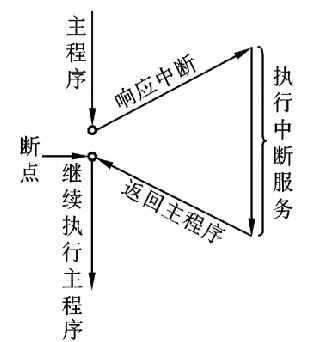
</div>

引起 CPU 中断的事件，发出中断请求的来源就被称为中断源。中断源大致有以下 4 类：**I/O 设备**，键盘，打印机，A/D 转换器，完成自身操作后，向 CPU 发中断申请；**实时时钟**，定时检测与控制，**采用外部时钟电路，编程控制定时间隔，发中断申请**；**故障源**，计算机内设有故障自动检测装置，如发生溢出、存储器读写出错、电源掉电等意外事件，这些装置能使 CPU 中断，进行相应处理；**为调式程序设置的中断源**，断点设置，单步调试等。

能实现中断所需要的软件和硬件统称为中断系统，中断系统的功能包括能响应中断、处理中断和返回；能实现优先权排队；**高级中断源能中断低级的处理（中断嵌套）**。

### 2.中断用途

中断的用途如下所示：

1. 同步操作：**避免了 CPU 不断检测外设状态的过程，提高了 CPU 的利用率**，解决快速 CPU 与慢速外设速度不匹配问题；
2. 实时处理：实现对特殊事件的实时响应。如实时控制中，现场参数在任何时间发出中断请求，CPU 马上相应；
3. 故障处理：电源突跳、运算溢出，不必停机；

中断源向 CPU 发中断请求信号的条件：设置中断请求触发器（IRR）、设置中断屏蔽触发器（IMR）。CPU 响应中断源的条件：**CPU 开中断（即 IF 标志寄存器为 1）、CPU 在现行指令结束后响应中断**。

### 3.中断处理过程

当满足条件，CPU 响应中断申请，中断处理过程如下，其中 1~4 为自动完成，而 5~8 为中断服务程序完成：

1. 标志寄存器保存到堆栈中
2. 关中断 IF=0（禁止接受其它可屏蔽中断请求，避免破坏断点）
3. 保留断点（IP、CS 自动压栈，以备中断处理完后返回断点）
4. 识别中断源，转入相应中断服务程序入口
5. 保护现场
6. 执行中断服务程序
7. 恢复现场
8. iret 返回（断点出栈，标志寄存器的值出栈）

>注意，由于 IF 标志被清除，在中断处理过程中，处理器将不再响应硬件中断。如果希望更高优先级的中断嵌套，可以在编写中断处理程序时，适时用 sti 指令开放中断。iret 指令导致处理器依次从栈中弹出(恢复) IP、CS 和 FLAGS 的原始内容，于是转到主程序接着执行。由于标志寄存器 FLAGS 的内容恢复，所以 IF 标志位也自动恢复，可以接受新的中断。

### 4.中断源分类

8086/8088 配接 8259A 中断控制器，可处理 256 个不同中断，**根据产生的方法不同分为两大类：硬件中断（外部中断）和软件中断（内部中断），硬件中断又可分为可屏蔽中断和非可屏蔽中断**。其中硬件中断由 CPU 外部提出的中断请求，可以实时响应外部设备请求，及时处理外部事件。软件中断（内部中断）由 CPU 执行指令引起的程序中断。微处理器中断结构图如下所示：

<div align="center">
    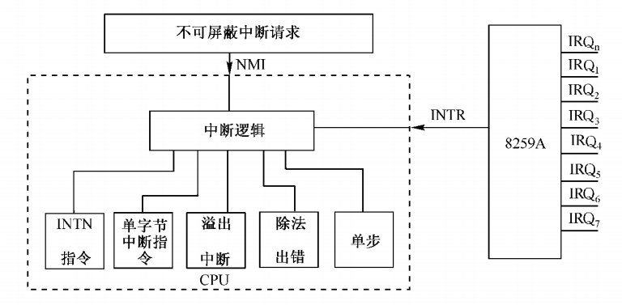
</div>

8086/8088 中断的总体分类如下所示：

<div align="center">
    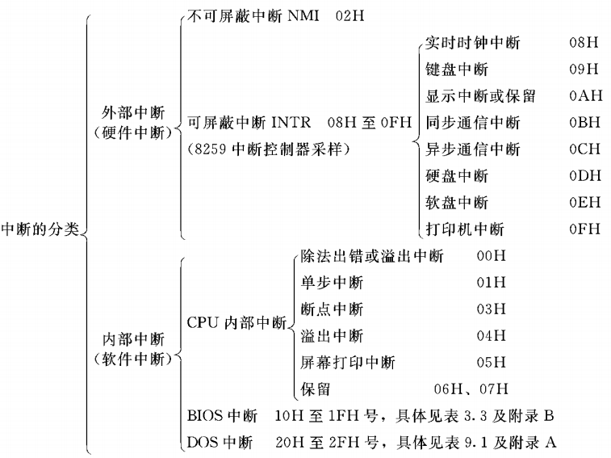
</div>

可屏蔽中断是由用户定义的外部硬件中断，由 INTR 引脚引入（高电平有效），类型号 5-255，**CPU 是否响应可屏蔽中断，取决于 IF 标志寄存器的状态**。当 IF=1 时(开中断)，响应中断，当 IF=0 时(关中断)，禁止中断。STI 命令使 IF=1，开中断，CLI 使 IF=0，关中断。8086/8088 配合 8259A 可管理多个可屏蔽中断。

**非可屏蔽中断由 NMI 引脚引入（上升沿触发），非可屏蔽中断的类型号为 2**，并且不受 IF 标志寄存器的影响，8086/8088 整个系统只有一个非屏蔽中断，一旦出现，CPU 将予以响应，用于紧急故障处理（例:系统掉电处理），优先级高于可屏蔽中断。

>当有任何一个非屏蔽的中断产生时，与非门的输出为高。Intel 处理器规定，NMI 中断信号由 0 跳变到 1 后，至少要维持 4 个以上的时钟周期才算是有效的，才能被识别。

软件中断的适用场景如下：

**1) 处理 CPU 某些错误的中断**

**除法出错的中断类型为 0**，当执行除法指令，发现除数为零或商超出寄存器所表示范围，产生类型为 0 的内部中断(自动进入)，优先级最高的内部中断。**溢出（INTO）的中断类型为 4**，INTO 指令通常跟在算术运算指令之后，进行溢出处理，产生类型 4 的内部中断。

**2) 为调试程序设置的中断**

**单步中断的类型为 1**，当 TF=1 (跟踪标志位)，每执行一条指令，CPU 产生类型 1 内部中断。**断点中断的类型为 3**，设置断点中断指令 INT 3，执行该指令会产生一个中断类型 3 的内部中断，用于软件调式，关键地方设置断点。

**中断指令 INT n 为用户自定义的软件中断**，类型号由程序员编程给定，指出中断入口地址。

可以为所有的中断类型自定义中断处理过程，包括内部中断、硬件中断和软中断。特别是考虑到处理器允许 256 种中断类型，而且大部分都没有被硬件和处理器内部中断占用。最有名的软中断是 BIOS 中断，之所以称为 BIOS 中断，**是因为这些中断功能是在计算机加电之后，BIOS 程序执行期间建立起来的**。即这些中断功能在加载和执行主引导扇区之前，就已经可以使用了。通常，为了区分针对同一硬件的不同功能，使用寄存器 ah 来指定具体的功能编号。举例来说，下面代码用于从键盘读取一个键盘。

```armasm{.line-numbers}
mov ah,0x00     ;从键盘读字符
int 0x16        ;键盘服务，返回时，字符代码在寄存器 al 中
```

在这里，当寄存器 ah 的内容是 0x00 时，执行 int 0x16 后，中断服务例程会监视键盘动作。当它返回时，会在寄存器 al 中存放按键的 ascii 码。

BIOS 会为一些简单的外围设备提供初始化代码和功能调用代码，并填写中断向量表，但也有一些 BIOS 中断是由外部设备接口自己建立的。首先，每个外部设备接口，包括各种板卡，如网卡、显卡、键盘接口电路、硬件控制器等，都有自己的只读存储器 (Read Only Memory, ROM)，这些 ROM 中提供了它自己的功能调用例程，以及本设备的初始化代码。按照规范，前两个单元的内容是 0x55 和 0xAA，第三个单元是本 ROM 中以 512 字节为单位的代码长度;从第四个单元开始，就是实际的 ROM 代码。

在计算机启动期间，BIOS 程序会以 2KB 为单位搜索内存地址 C0000~E0000 之间的区域。当它发现某个区域的头两个字节是 0x55 和 0xAA 时，那意味着该区域有 ROM 代码存在。接着，它对该区域做累加和检查，看结果是否和第三个单元相符。如果相符，就从第四个单元进入。这时，**处理器执行的是硬件自带的程序指令，这些指令初始化外部设备的相关寄存器和工作状态，_最后，填写相关的中断向量表，使它们指向自带的中断处理过程_**。

上述不同中断的优先级为：软件中断（除法错误中断、INT n、溢出中断 INTO）、非屏蔽中断（NMI）、可屏蔽中断（INTR）、单步中断。

### 5.中断向量表

**中断向量（中断矢量）为中断程序的入口地址，即中断服务程序第 1 条指令的 CS 和 IP 值**，每个中断都对应一个中断向量。8086/8088 把 256 个中断程序入口地址建立一张表，称为中断向量表。中断向量表固定存放在 0x0000 段，偏移地址 0x0000-0x03FF 区域，每个中断向量需 4 个存储单元，共占用 256*4=1KB 空间，前两个字节存放中断程序入口地址 IP 值，后两个字节存放 CS 值，中断向量按中断类型号有规则排列。

向量地址:**每个中断程序的入口地址存放的地址或中断向量存放的地址**，向量地址=中断类型号*4。中断向量表示意图如下所示：

<div align="center">
    
</div>

>中断随时可能发生，中断向量表的建立和初始化工作是由 BIOS 在计算机启动时负责完成的。BIOS 为每个中断号填写入口地址，因为它不知道多数中断处理程序的位置，所以，一律将它们指向一个相同的入口地址，在那里，只有一条指令 iret。

### 6.CPU 响应可屏蔽中断的过程

当满足：CPU 执行完当前指令;没有内部中断和非屏蔽中断;CPU 内部 IF=1;有 INTR 申请则 CPU 响应中断，完成下列工作:

CPU 响应 INTR 请求，进入中断响应周期，获取中断类型号，CPU 响应的周期时序如下所示：

<div align="center">
    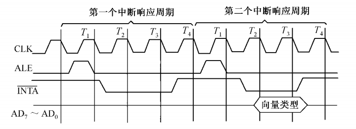
</div>

CPU 对 INTR 中断请求的响应过程是执行两个 INTA（中断响应）总线周期。每个响应周期都由 4 个T状态组成，而且都发出有效的中断响应信号 INTA。在第一个中断响应总线周期内 INTA 信号通知 8259A，中断请求已被接受；**在第二个总线周期内 INTA 信号有效时，8259A 必须把请求服务的那个外设的中断类型码输至 CPU 的数据总线**。CPU 读入中断类型码后，由此调用相应的中断服务程序。

然后执行一个写总线周期，PSW（标志寄存器）入栈，IF=0，TF=0；接着关中断，禁止单步中断执行两个写总线周期，CS，IP 入栈，保存断点；然后执行两个读总线周期，查中断向量表，读前 2 个字节送入 IP 寄存器，读后 2 个字节送入 CS 寄存器（得到中断服务入口地址）。然后转向中断服务程序执行，执行完成后返回 IRET，断点 IP，CS 弹出，PSW 出栈。完整流程图如下所示：

<div align="center">
    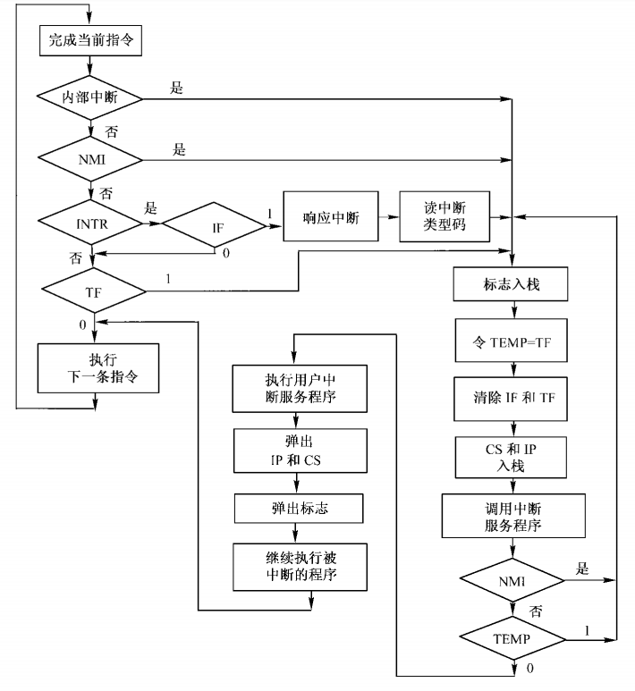
</div>

## 三、8259A 可编程中断控制器

### 1.8259A 的功能

8259A 可编程中断控制器的内部结构如下所示：

<div align="center">
    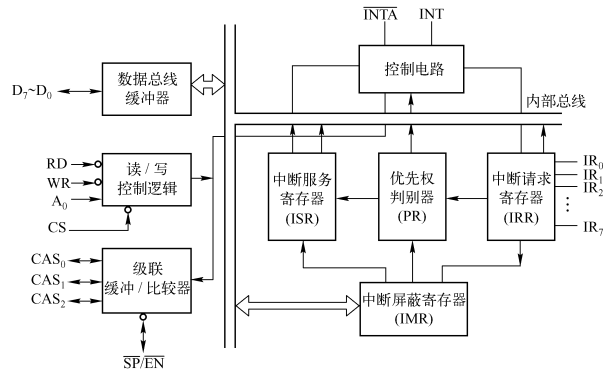
</div>

1 片 8259A 可管理 8 级中断，并对其进行优先级管理，面向 CPU 的专用接口，是辅助 CPU 进行中断管理的。使用 9 片 8259A 组成的主从式中断系统可管理 64 级中断，并对其进行优先级管理，并且可以对任何一级中断源都可单独进行屏蔽，使该级中断请求暂时被挂起，直到取消屏蔽。能自动送出中断类型码，使 CPU 迅速找到中断处理子程序的入口地址。

<div align="center">
    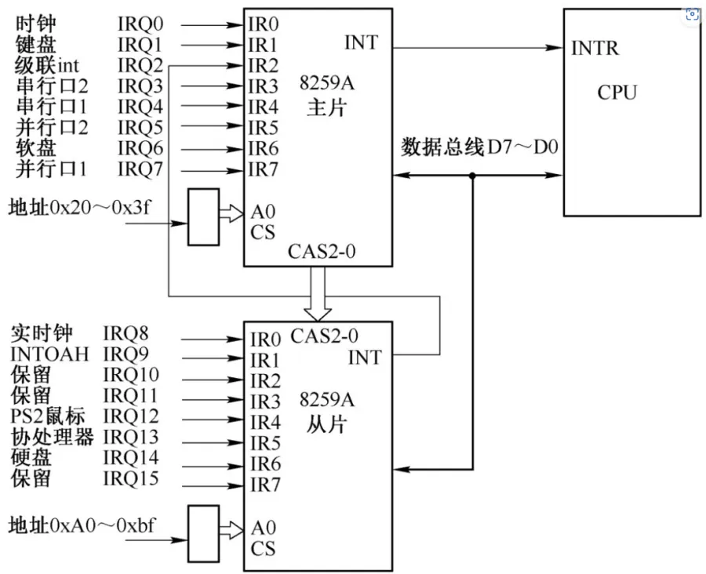
</div>

上图每片 8259A 只有 8 个中断输入引脚，而在个人计算机上使用它，需要两块。如上图所示，第一块 8259A 芯片的代理输出 INT 直接送到处理器的 INTR 引脚，这是主片 (Master)；第二块 8259A 芯片的 INT 输出送到第一块的引脚 2 上，是从片 (Slave)，两块芯片之间形成级联 (Cascade) 关系。8259A 的主片引脚 0 (IR0) 接的是系统定时器/计数器芯片；从片的引脚 0 (IR0) 接的是实时时钟芯片 RTC。

>8259A 芯片是可编程的，**主片的端口号是 0x20 和 0x21，从片的端口号是 0xa0 和 0xa1**，可以通过这些端口访问 8259 芯片，设置它的工作方式，包括 IMR 的内容。

### 2.8259A 结构

8259A 芯片中包含 7 个寄存器，**第一组 4 个寄存器：初始化命令字 ICW1-ICW4**。8259A 工作之前设定，旦设定，工作过程中不变。**第二组 3 个寄存器：操作命令字 OCW1-OCW3**。8259A 工作之后设定，对中断进行管理，可被多次设置。OCW1 也称中断屏蔽寄存器 (IMR)。

**1）数据总线缓冲器**

它是 8259A 与系统数据总线的接口。CPU 对 8259A 的控制字是通过它写入的，8259A 的状态信息是通过它读入 CPU 的，**在中断响应周期，8259A 也是通过它送出中断类型号的**。

**2）读/写逻辑**

是根据 CPU 送来的读/写信号和地址信息，通过数据总线缓冲器有条不紊地完成 CPU 对 8259A 的所有读操作和写操作。它还包含 4 个初始化命令寄存器和 3 个操作命令寄存器，用于存放 4 个初始化命令字 ICW1~ICW4、和3个操作命令字 OCW1~OCW3。

**3）级连缓冲器/比较器**

这个功能部件在级连方式的主从结构中，用来存放和比较系统中各 8259A 的从设备标志（ID）。与此相关的是 3 条连线 CAS0~CAS2 和从片编程/允许缓冲器 SP/EN 线。

**4）中断请求寄存器 (IRR)**

8259A 有 8 条外界中断请求线 IR0~IR7，每一条请求线有 1 个相应的触发器来保存中断请求信号，**哪一根 IR 线上有请求，哪一位触发器就置 1**，8 个触发器组合成 IRR。

**5）正在中断服务寄存器 (ISR)**

该寄存器用来存放当前正在进行服务的中断。当 CPU 正为某个中断源服务时，8259A 则使 ISR 中的相应位置 1，当 ISR 为全 0 时，表示 CPU 正执行主程序，无任何中断服务。**同时把新进入中断请求与当前正在处理的中断进行比较，从而决定哪一个优先级更高**，经中断裁决器向 CPU 发中断请求 INT。

**6）中断屏蔽寄存器(IMR)**

用来存放 CPU 送来的屏蔽信号，**_当它的某一位或某几位为 1 时，则对应的中断请求就被屏蔽_**，即对该中断源的有效请求置之不理。

>中断能否被处理，除了要看 8259 芯片的脸色外，最终的决定权在处理器手中。标志寄存器有一个标志位 IF，这就是中断标志 (Interrupt Flag)。**当 IF 为 0 时，所有从处理器 INTR 引脚来的中断信号都被忽略掉**；当其为 1 时，处理器可以接受和响应中断。IF 标志位可以通过两条指令 cli 和 sti 来改变。这两条指令都没有操作数，cli (CLear Interrupt Flag) 用于清除 IF 标志位，sti (Set Interrupt Flag) 用于置位 IF 标志。

**7）优先权电路**

该电路用来管理和识别各个中断源的优先级别。它根据保存在 IRR 中的各个中断请求位和 IMR 中的中断屏蔽位分析出未屏蔽优先级最高的中断源。同时判别是否可以进入多重中断，即根据 ISR 寄存器判别新产生的中断源的优先级别是否高于正在处理的中断级别。

**8）控制逻辑**

按照编程设置的工作方式管理 8259A 的全部工作。在 IRR 中有未被屏蔽的中断请求时，控制逻辑输出高电平的 INT 信号，向 CPU 申请中断。**在中断响应期间，它允许 ISR 的相应位置位，并发出相应的中断类型码**，通过数据总线缓冲器输出到系统总线上。在中断服务结束时，它按照编程规定的方式对 ISR 进行处理。

### 3.中断响应过程

在 8086/88 系统中 8259A 中断响应过程如下：

1. 当有一条或若干条中断请求线（IR0~IR7）变高时，则使中断请求寄存器 IRR 的相应位置 1；
2. 8259A 接收这些请求，分析它们的优先级，在未屏蔽时向 CPU 发出中断请求信号 INT；
3. 若 CPU 处于开中断状态 (IF=1)，则在当前指令执行完后，发出 $\overline{INTA}$ 中断响应信号；
4. 8259A 接收到第一个 $\overline{INTA}$ 信号，把允许中断的最高优先级的相应 ISR 位置 1，并清除 IRR 中的相应位；
5. CPU 启动第二个 $\overline{INTA}$ 脉冲，8259A 发出中断类型号。如果是自动结束中断 AEOI 方式，$\overline{INTA}$ 脉冲后沿复位 ISR 的相应位；在其他方式中，ISR 相应位要由中断服务程序结束时发出的 EOI 命令（中断结束命令）来复位；

8259A 发送的两个 $\overline{INTA}$ 负脉冲如下所示：

<div align="center">
    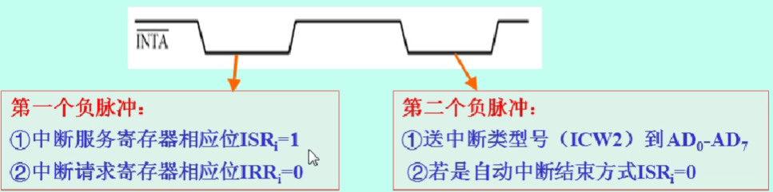
</div>

### 4.嵌套方式

8259A 的嵌套方式有一般全嵌套方式和特殊全嵌套方式之分。8259A 在输人 ICW1 命令后初始化为一般全嵌套方式，但可用 ICW4 命令设置为特殊全嵌套方式。

一般全嵌套方式：在这种方式下，当中断系统正在处理某一级中断时，8259A 只响应高级的中断请求，同级的或低级的中断请求不响应。**一般全嵌套方式适用于单片 8259A 或级连时的从 8259A**。
特殊全嵌套方式：在特殊全嵌套方式下，当处理某一级中断时，如果有同级的中断请求，8259A 也会给予响应。**特殊全嵌套方式适用于 8259A 级连应用时的主片**。

<div align="center">
    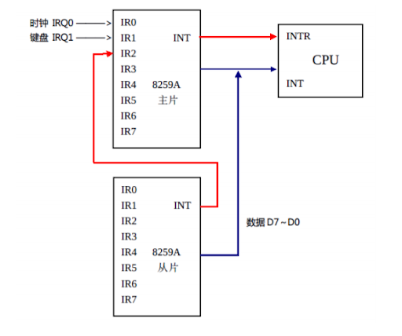
</div>

在 8259A 级连使用时，主片要求工作在特殊全嵌套方式，而从片则工作在一般全嵌套方式。这样，当来自某一从片的中断请求正在处理时，一方面和一般全嵌套方式一样，**对来自主片的优先级较高的其他引脚上的中断请求进行开放**；另一方面，**对来自同一从片的较高优先级的请求也会开放**。对后者，在主片引脚上反映出来是与当前正在处理的中断请求处于同一级的，但从从片内部看，中断请求一定比正在处理的优先级别高。

特殊全嵌套方式不适于8259A单片使用，因为在中断请求频繁时，**可能会造成不必要的同级中断的多重嵌套**，从而引起混乱。另外，在级连时若主片不使用特殊全嵌套而使用一般全嵌套方式，那么，由于此时主片把从片看做一级，**尽管从片内部可以判断输入该片的各中断请求的优先级**，但由于从片的中断请求输出 INT 信号是接在主片的一个中断请求输入信号 IRi 上的，故主片不会对来自从片的由更高优先级的中断源引起的中断请求做出反应。

### 5.优先级循环方式

8259A 有固定优先级方式和优先级自动循环方式。8259A 在输入ICW1 后初始化为固定优先级方式，但在工作期间可用 OCW2 设置成优先级自动循环方式。

优先级固定方式：8259A 在用 ICW1 写入后内部初始化为优先级固定方式，IR0 优先权最高，IR7 优先权最低。
优先级自动循环方式：所谓优先级自动循环是指一个设备得到中断服务后，它的优先级自动降为最低。例如，初始化优先级队列为 IR0，IR1, IR2,...IR7，这时如果 IR4 有请求，响应 IR4 后优先级队列为：IR5, IR6, IR7, IR0,...,IR4。在某些场合，系统内部存在着优先权相同的中断设备，**为了使得各个优先权相同的外设得到 CPU 服务的机会均等**，可以采用优先权自动循环方式。

### 6.中断屏蔽方式

普通屏蔽方式：8259A 内部有一屏蔽寄存器，它的每一位对应个中断请求输入，可通过对 OCW1 (即中断屏蔽寄存器 IMR) 编程进行设置。当某一位为 1 时，对应的某一级中断就受到屏蔽。通过重新设置 OCW1 操作命令字，可随时撤消这些屏敝。

特殊屏蔽方式：**可实现能开放比本级中断源级别低的中断响应**，具体操作为用 OCW1 将屏蔽寄存器中本级中断源对应位置 1，即屏蔽本级中断，为开放较低级中断提供条件。**使当前中断服务寄存器对应位 ISRi=0，真正开放级别较低的中断**。

### 7.中断结束方式

当 8259A 响应某一级中断而为其服务时，中断服务寄存器 ISR 的相应位置 1，当有更高级的中断请求进入时，ISR 的相应位又要置 1，因而 ISR 寄存器中可有多位同时置 l，在中断服务结束时，ISR 中相应位应清 0，以便再次接收同级别的中断。**中断结束的管理就是用不同的方式使 ISR 的相应位清 0，并且确定下面的优先排队**。下面只介绍采用完全嵌套方式时，中断结束的管理方式。

采用完全嵌套方式是指中断嵌套过程中，中断服务寄存器 ISR 的内容在不断变化。例如，8259A 正在为 IR7 的中断请求服务时，ISR 中的 D7 位置 1。此时，有高级中断 IR6 请求服务，若允许为其服务，ISR 中的 D6 位又置 1。假如又有更高级的中断，且为其服务，ISR 中将有对应位置 1。**总之，在完全嵌套方式下，最多可达 8 级中断嵌套，在中断服务结束时，也应按从高到低的次序结束**。每个中断结束，使 ISR 中相应位清 0，待全部嵌套中断均结束后，则 ISR 中每位均为 0。8259A 在完全嵌套情况下，可采用 3 种中断方式。

**1)一般 EOI 方式**

当任何一级中断服务程序结束时，给 8259A 传输一个 EOI 命令，8259A 将 ISR 寄存器中级别最高的置 1 位清 0。这种方式只有在当前结束的中断总是尚未处理完的级别最高的中断时，才能使用这种结束方式。如果在中断服务中修改过中断级别，则不能采用这种方式。

**2)特殊 EOI 方式**

在一般 EOI 方式的基础上，当中断服务程序结束给 8259A 发出 EOI 命令的同时，将当前结束的中断级别也传输给 8259A，这就称为特殊 EOI 方式。在这种情况下，8259A 将 ISR 寄存器中指定级别的相应置 1 位清 0。这种方式适合于任何情况。

**3)自动 EOI 方式**

CPU 进入中断响应总线周期的第二个中断响应信号 $\overline{INTA}$ 结束时，**自动将 ISR 寄存器相应置 1 位清 0。中断结束时，不需要向 8259A 送 EOI 命令**。这是一种最简单的结束方式，但是存在一个明显的缺点：任何一级中断在执行中断服务程序期间，在 8259A 中没有留下任何标志，如果在此过程中出现新的中断请求，**则只要 CPU 允许中断，不管出现的中断级别如何，都将打断正在执行的中断服务而被优先执行**。这显然是不合理的。因此，自动 EOI 方式只能用在一些以预定速率发生中断，且不会发生同级中断互相打断或低级中断打断高级中断的情况下。

## 四、实时时钟、CMOS RAM 和 BCD 编码

在外围设备控制器芯片 ICH 内部，集成了实时时钟电路 (Real Time Clock, RTC) 和两小块由互补金属氧化物 (CMOS) 材料组成的静态存储器 (CMOS RAM)。实时时钟电路负责计时，而日期和时间的数值则存储在这块存储器中。

日期和时间信息是保存在 CMOS RAM 中的，通常有 128 字节，而日期和时间信息只占了小部分容量，其他空间则用于保存整机的配置信息。在下图中，**常规的日期和时间信息占据了CMOS RAM 开始部分的 10 字节**，有年、月、日和时、分、秒，报警的时、分、秒用于产生到时间报警中断。

<div align="center">
    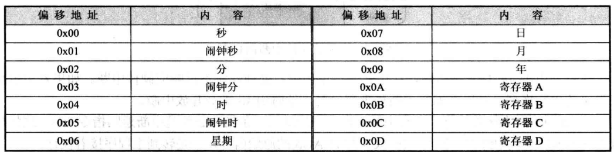
</div>

CMOS RAM 的访问，需要通过两个端口来进行。**0x70 或者 0x74 是索引端口**，用来指定 CMOS RAM 内的单元；**0x71 或者 0x75 是数据端口**，用来读写相应单元里的内容。以下代码用于读取今天是星期几：

```armasm{.line-numbers}
mov al,0x06
out 0x70,al
in al,0x71
```

端口 0x70 的最高位 (bit 7) 是控制 NMI 中断的开关。**当它为 0 时，允许 NMI 中断到达处理器，为 1 时，则阻断所有的 NMI 信号**，其他 7 个比特，即 0~6 位，则实际上用于指定 CMOS RAM 单元的索引号，这种规定直到现在也没有改变。注意 IF 标志寄存器和 IMR 寄存器是对可屏蔽中断（INTR）进行屏蔽操作，而不是非可屏蔽中断 NMI。

<div align="center">
    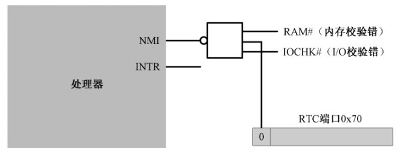
</div>

通常来说，在往端口 0x70 写入索引时，应当先读取 0x70 原先的内容（获取第 7bit 位的原始值），然后将它用于随后的写索引操作中。但是，该端口是只写的，不能用于读出。为了解决这个问题，我们假设 NMI 中断应当始终是允许的，在访问 RTC 时，我们直接关闭 NMI，访问结束后，再打开 NMI，而不管它以前到底是什么样子。

CMOS RAM 中保存的日期和时间，通常是以二进制编码的十进制数 (Binary Coded Decimal, BCD)，这是默认状态。比如十进制数 25，如果采用 BCD 编码的话，则一个字节的高 4 位和低 4 位分别独立地表示一个 0 到 9 之间的数字，因此其 BCD 编码位 0010 0101。

单元 0x0A~0x0D 不是普通的存储单元，而被定义成 4 个寄存器的索引号，也是通过 0x70 和 0x71 这两个端口访问的。这 4 个寄存器用于设置实时时钟电路的参数和工作状态。

## 五、使用 RTC 中断显示动态时钟

现在，我们让 RTC 芯片定期发出一个中断，当这个中断发生的时候，还能执行我们自己编写的代码，来访问 CMOS RAM，在屏幕上显示一个动态走动的时钟。

### 1.初始化 8259A、RTC 和中断向量表

在原代码的第 146~154 行用于初始化栈段和数据段寄存器，然后开始在中断向量表中安装实时时钟中断的入口点。这里需要强调一件事。**当处理器执行任何一条改变栈段寄存器 ss 的指令时，它会在下一条指令执行完期间禁止中断**。

栈段除了有段寄存器，还有栈指针。因此，绝大多数时候，对栈的改变是分两步进行的：先改变段寄存器 ss 的内容，接着又修改栈指针寄存器 sp 的内容。也就是 ss 和 sp 寄存器只有都完成修改后才是有意义的。如果只修改了 ss 寄存器，此时发生了中断，在中断服务程序中调用了 push/pop 指令，后果是不可预料的。

>处理器在设计的时候就规定，当遇到修改段寄存器 ss 的指令时，在这条指令和下一条指令执行完毕期间，禁止中断，以此来保护栈。换句话说，你应该**在修改段寄存器 ss 的指令之后，紧跟着一条修改栈指针 sp 的指令**。

RTC 芯片的中断信号，通向中断控制器 8259A 从片的第 1 个中断引脚 IR0。在计算机启动期间，BIOS 会初始化中断控制器，将主片的中断号设为从 0x08 开始，将从片的中断号设为从 0x70 开始。所以，计算机启动后，RTC 芯片的中断号默认是 0x70。

在第 163~170 行，将中断号 0x70 乘以 4，就是它在中断向量表内的偏移。在修改中断向量表时，需要先用 cli 指令清中断。当表项信息只修改了一部分时，如果发生 0x70 号中断，则会产生不可预料的问题。最后将实时时钟的中断处理程序地址写入到中断向量表中。

RTC 到 8259A 的中断线只有一根，而 RTC 可以产生多种中断。比如闹钟中断、更新结束中断和周期性中断。以上所说的三种中断，我们只要设置一种就可以了。其实，最简单的就是设置更新周期结束中断。每当 RTC 更新了 CMOS RAM 中的日期和时间后，将发出此中断。更新周期每秒进行次，因此该中断也每秒发生一次。

每次当中断实际发生时，可以在程序 (中断处理过程) 中读寄存器 C 的内容来检查中断的原因。比如，每当更新周期结束中断发生时，RTC 就将它的第 4 位置 1。**该寄存器还有一个特点，就是每次读取它后，所有内容自动清零。而且，如果不读取它的话 (换句话说，相应的位没有清零)，同样的中断将不再产生**。

在第 181~196 行，先对 B 寄存器进行设置：更新结束后中断，更新周期每秒都会正常发生，禁止其它中断，BCD 码，24 小时制，然后读取寄存器 C 中的内容，复位未决的中断状态。

RTC 芯片设置完毕后，再来打通它到 8259A 的最后一道屏障。正常情况下，8259A 是不会允许 RTC 中断的，所以，需要修改它内部的中断屏蔽寄存器 IMR。IMR 是一个 8 位寄存器，位 0 对应着中断输入引脚 IR0，位 7 对应着引脚 IR7，相应的位是 0 时，允许中断，为 1 时，关掉中断。通过端口 0xa1 **读取 8259 从片的 IMR 寄存器**，用 and 指令清除第 0 位，其他各位保持原状，然后再写回去。于是，RTC 的中断可以被 8259A 处理了。

### 2.使处理器进入低功耗阶段

RTC 更新周期结束中断的处理过程可以看成另一个程序，是独立的处理过程，它随时都会发生，但和主程序互不相干。hlt 指令使处理器停止执行指令，并处于停机状态，这将降低处理器的功耗。处于停机状态的处理器可以被外部中断唤醒并恢复执行，而且会继续执行 hlt 后面的指令。

所以第 222~228 行，首先让 CPU 进入低功耗模式，如果被外部中断（包括 RTC 中断），那么就反转 @ 字符的显示属性，最后又进入循环进入低功耗阶段。

### 3.实时时钟中断的处理过程

在第 29~44 行，首先阻断 NMI 中断，然后判断 A 寄存器中第 7bit 位（UIP）位是否为 0，如果为 0，说明更新周期在 488 微秒内不会启动，现在访问 CMOS RAM 中的时间、日历和闹钟是安全的；如果为 1，说明正在更新周期中，继续跳转至 w0 进行等待。

正常情况下，访问 CMOS RAM 中的日期和时间，必须等待 RTC 更新周期结束，所以上面第 29~44 行的判断过程是必需的，而这些代码也适用于正常的访问过程。**但是，当前中断处理过程是针对更新周期结束中断的，而当此中断发生时，本身就说明对 CMOS RAM 的访问是安全的**，毕竟留给我们的时间是 999 毫秒，这段时间非常充裕。所以，在这种特定的情况下，上面的代码不是必需的。

第 47~66 行读取时、分、秒的值，并且入栈保存。第 68~73 行，读一下 RTC 的寄存器 C，使得所有中断标志复位。这等于是告诉 RTC，中断已经得到处理，可以继续下一次中断。否则的话，RTC 看到中断未被处理，将不再产生中断信号。其它的中断通过设置寄存器 B 被禁止。

在第 75~110 行，将实时时钟的小时、分钟、秒在屏幕上显示出来。在 8259 芯片内部，有一个中断服务寄存器 (Interrupt Service Register, ISR)，这是一个 8 位寄存器，每一位都对应着一个中断输入引脚。当中断处理过程开始时，8259A 芯片会将相应的位置 1，表明正在服务从该引脚来的中断。

如果允许中断嵌套的话，ISR 还起到中断判优的作用，只有比 ISR 中置 1 的位（正在处理的中断请求）优先级更高的中断源，才会被 CPU 处理。因此，如果在中断服务程序结束时不清除相应的位，下次相同优先级的中断或者优先级更低的中断将得不到处理。

在这种情况下，**需要程序在中断处理过程的结尾，向 8259A 芯片发送中断结束命令 (End Of Interrupt, EOI)，显式地对 8259A 芯片编程来清除该标志**，中断结束命令的代码是 0x20。需要注意的是，如果外部中断是 8259A 主片处理的，那么，EOI 命令仅发送给主片即可，端口号是 0x20；如果外部中断是由从片处理的，那么，EOI 命令既要发往从片(端口号 0xa0)，也要发往主片。

## 六、从键盘读取字符并显示

以下代码的第 37~42 行读取要字符串的字符，然后在屏幕上显示出来，向屏幕上写字符使用的是 BIOS 中断，具体地说就是中断 0x10 的 0x0e 号功能，该功能用于在屏幕上的光标位置处写一个字符，并推进光标位置。第 45~46 行，使用软中断 0x16 从键盘读字符，需要在寄存器 ah 中指定0x00 号功能。该中断返回后，寄存器 al 中为字符的 ascii 码，然后再使用中断 0x10 的 0x0e 号功能，将从键盘读取的字符显示在屏幕上。

```armasm{.line-numbers}
         ;代码清单9-2
         ;文件名：c09_2.asm
         ;文件说明：用于演示BIOS中断的用户程序 
         ;创建日期：2012-3-28 20:35
         
;===============================================================================
SECTION header vstart=0                     ;定义用户程序头部段 
    program_length  dd program_end          ;程序总长度[0x00]
    
    ;用户程序入口点
    code_entry      dw start                ;偏移地址[0x04]
                    dd section.code.start   ;段地址[0x06] 
    
    realloc_tbl_len dw (header_end-realloc_begin)/4
                                            ;段重定位表项个数[0x0a]
    
    realloc_begin:
    ;段重定位表           
    code_segment    dd section.code.start   ;[0x0c]
    data_segment    dd section.data.start   ;[0x14]
    stack_segment   dd section.stack.start  ;[0x1c]
    
header_end:                
    
;===============================================================================
SECTION code align=16 vstart=0           ;定义代码段（16 字节对齐） 
start:
      mov ax,[stack_segment]
      mov ss,ax
      mov sp,ss_pointer
      mov ax,[data_segment]
      mov ds,ax
      
      mov cx,msg_end-message
      mov bx,message
      
 .putc:
      mov ah,0x0e
      mov al,[bx]
      int 0x10
      inc bx
      loop .putc

 .reps:
      mov ah,0x00
      int 0x16
      
      mov ah,0x0e
      mov bl,0x07
      int 0x10

      jmp .reps

;===============================================================================
SECTION data align=16 vstart=0

    message       db 'Hello, friend!',0x0d,0x0a
                  db 'This simple procedure used to demonstrate '
                  db 'the BIOS interrupt.',0x0d,0x0a
                  db 'Please press the keys on the keyboard ->'
    msg_end:
                   
;===============================================================================
SECTION stack align=16 vstart=0
           
                 resb 256
ss_pointer:
 
;===============================================================================
SECTION program_trail
program_end:
```

