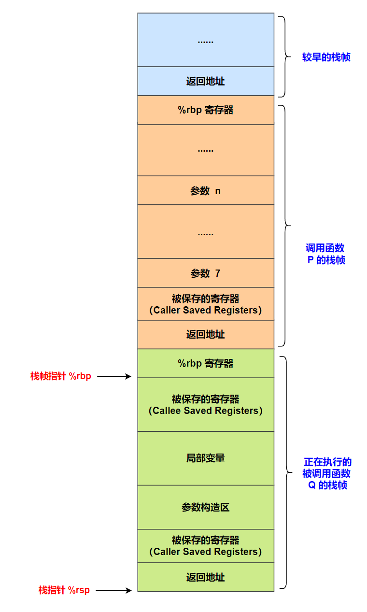

# 程序的机器级表示

## 一、函数调用

### 1.调用约定

A calling convention governs how functions on a particular architecture and operating system interact. This includes rules about includes **<font color="red">how function arguments are placed, where return values go, what registers functions may use, how they may allocate local variables<</font>**, and so forth. Calling conventions ensure that functions compiled by different compilers can interoperate, and they ensure that operating systems can run code from different programming languages and compilers. Some aspects of a calling convention are derived from the instruction set itself, but some are conventional, meaning decided upon by people (for instance, at a convention).

Calling conventions constrain both callers and callees. A caller is a function that calls another function; a callee is a function that was called. **<font color="red">The currently-executing function is a callee, but not a caller</font>**.

For concreteness, we learn the **x86-64 calling conventions** for Linux. These conventions are shared by many OSes, including MacOS (but not Windows), and are officially called the "System V AMD64 ABI."

### 2.栈帧和参数传递

One set of calling convention rules governs how function arguments and return values are passed. **<font color="red">On x86-64 Linux, the first six function arguments are passed in registers %rdi, %rsi, %rdx, %rcx, %r8, and %r9, respectively. The seventh and subsequent arguments are passed on the stack, about which more below，在传递超过 6 个参数时，剩余函数参数从右向左依次压入栈中，如下所示，函数参数中最靠右第 n 个参数最新被压入栈中，而第 7 个参数最后被压入栈中</font>**. %rax 用来保存函数的第一个返回值，%rbx 用来保存函数第二个返回值。

<div align="center">
    <div align="center" style="color: blue; font-size:13px; font-weight:bold">函数栈帧布局示意图</div>
    
</div>

函数栈帧布局示意图如上所示，函数栈帧从高地址往低地址方向增长，System V ABI 使用两个寄存器访问函数栈帧：帧指针 %rbp 和栈指针 %rsp。 帧指针 %rbp 指向当前函数栈帧基址(栈底)，栈指针 %rsp 指向当前函数栈帧栈顶。一般说来，帧指针 %rbp 用来存取函数栈帧上的数据，例如传递进来的函数参数，或者函数的本地局部变量。**System V ABI 要求要求函数栈帧 16 字节对齐，这要求函数栈帧的大小应该是 16 的倍数**。

The full rules more complex than this. You can read them in the AMD64 ABI, section 3.2.3, but they’re quite detailed. Some highlights:

- A structure argument that fits in a single machine word (64 bits/8 bytes) is passed in a single register.例如 **`struct small { char s1, s2; }`**；
- A structure that fits in two to four machine words (16–32 bytes) is passed **in sequential registers**, as if it were multiple arguments. 例如：**`struct medium { long a1, a2; }`**；
- A structure that’s larger than four machine words is always passed on the stack. 例如 **`struct large { long a, b, c, d, e, f, g; }`**；
- Floating point arguments are generally passed in special registers, the “SSE registers,” that we don’t discuss further.
- If the return value takes more than eight bytes, then the caller reserves space for the return value, and passes the address of that space as the first argument of the function. The callee will fill in that space when it returns.

### 3.栈

The stack is named after a data structure, which was sort of named after pancakes. Stack data structures support at least three operations: push adds a new element to the "top" of the stack; pop removes the top element, showing whatever was underneath; and top accesses the top element. Note what’s missing: the data structure does not allow access to elements other than the top. (Which is sort of how stacks of pancakes work.) This restriction can speed up stack implementations.

Like a stack data structure, the stack memory segment is only accessed from the top. The currently running function accesses its local variables; the function’s caller, grand-caller, great-grand-caller, and so forth are dormant until the currently running function returns.

The x86-64 %rsp register is a special-purpose register that defines the current "stack pointer." This holds the address of the current top of the stack. On x86-64, as on many architectures, stacks grow down: a "push" operation adds space for more automatic-lifetime objects by moving the stack pointer down, to a numerically-smaller address, and a "pop" operation recycles space by moving the stack pointer up, to a numerically-larger address. This means that, considered numerically, the "top" of the stack has a smaller address than the "bottom."

This is built in to the architecture by the operation of instructions like pushq, popq, call, and ret. A push instruction pushes a value onto the stack. This both modifies the stack pointer (making it smaller) and modifies the stack segment (by moving data there). For instance, the instruction pushq X means:

```armasm{.line-numbers}
subq $8, %rsp
movq X, (%rsp)
```

And popq X undoes the effect of pushq X. It means:

```armasm{.line-numbers}
movq (%rsp), X
addq $8, %rsp
```

X can be a register or a memory reference.

**<font color="red">The portion of the stack reserved for a function is called that function’s stack frame</font>**. Stack frames are aligned: **<font color="red">x86-64 requires that each stack frame be a multiple of 16 bytes, and when a callq instruction begins execution, the %rsp register must be 16-byte aligned.</font>** This means that every function’s entry %rsp address will be 8 bytes off a multiple of 16. 这是因为，每个函数被调用之前，调用函数需要将返回地址（8 字节）先压入栈中（push）指令，因此在每个函数的入口 %rsp 总是比 16 的倍数少 8 字节。

### 4.返回地址以及 entry、exit 序列

The steps required to call a function are sometimes called the entry sequence and the steps required to return are called the exit sequence. Both caller and callee have responsibilities in each sequence. 以下假设调用函数为 P，被调用函数为 Q.

P 为了调用 Q, 需要执行如下任务进行准备：

- 调用函数 P 将传递给被调用函数 Q 的前 6 个参数保存到相应的寄存器中（%rdi, %rsi, %rdx, %rcx, %r8, and %r9）
- If the callee takes more than six arguments, or if some of its arguments are large, the caller must store the surplus arguments on its stack frame. **<font color="blue">It stores these in increasing order, so that the 7th argument has a smaller address than the 8th argument, and so forth</font>**. The 7th argument must be stored at (%rsp) (that is, the top of the stack) when the caller executes its callq instruction.
- The caller saves any caller-saved registers.
- The caller executes **`callq FUNCTION`**. This has an effect like **`pushq $NEXT_INSTRUCTION_ADDR; jmp FUNCTION`** (or, equivalently, **`subq $8, %rsp; movq $NEXT_INSTRUCTION, (%rsp); jmp FUNCTION`**), where **`NEXT_INSTRUCTION`** is the address of the instruction immediately following callq.

被调用函数 Q 执行如下 enter 序列：

- 被调用函数 Q 执行 **`pushq  %rbp; movq  %rsp, %rbp;`** 序列，使得栈帧指针 %rbp 指向当前正在执行的函数 Q 的栈帧；
- 将 callee-saved 寄存器压入栈中保存，函数 Q 返回之前会从栈中弹出恢复；
- **<font color="red">执行 **`sub %rsp, N`**，为函数 Q 的局部变量划分空间</font>**；

被调用函数 Q 执行如下 exit 序列：

- The callee places its return value in %rax.
- **<font color="red">被调用函数 Q 执行 leave 指令，等价于 **`movq %rbp, %rsp; popq %rbp;`** 指令，使得 %rbp 指向上一个函数（即调用函数 P）的栈帧基地址</font>**.
- 被调用函数 Q 执行 retq 指令，将返回地址弹出到 %rip 寄存器，使得程序转回到调用函数 P 执行。
- The caller then cleans up any space it prepared for arguments and restores caller-saved registers if necessary.

Particularly simple callees don’t need to do much more than return, but most callees will perform more tasks, such as allocating space for local variables and calling functions themselves.

### 5.Caller-saved 寄存器和 Callee-saved 寄存器

寄存器是唯一被所有过程共享的资源，虽然在给定时刻只有一个是活动的，我们仍然必须确保当一个过程 (调用者) 调用另一个过程 (被调用者) 时，被调用者不会覆盖调用者稍后会使用的寄存器值。为此，x86-64 采用了一组统一的寄存器使用惯例，所有的过程 (包括程序库) 都必须遵循。

根据惯例，**<font color="blue">寄存器 %rbx、%rbp 和 %r12~%r15 被划分为被调用者保存寄存器。当过程 P 调用过程 Q 时，Q 必须保存这些寄存器的值，保证它们的值在 Q 返回到 P 时与 Q 被调用时是一样的</font>**。过程 Q 保存一个寄存器的值不变，要么就是根本不去改变它，要么就是把原始值压入栈中，改变寄存器的值，然后在返回前从栈中弹出旧值。压入寄存器的值会在栈帧中创建标号为 "保存的寄存器" 的一部分，如上图中所示。有了这条惯例，P 的代码就能安全地把值存在被调用者保存寄存器中 (当然，要先把之前的值保存到栈上)，调用 Q，然后继续使用寄存器中的值，不用担心值被破坏。

**<font color="red">所有其他的寄存器，除了栈指针 %rsp，都分类为调用者保存寄存器</font>**。这就意味着任何函数都能修改它们。可以这样来理解 "调用者保存" 这个名字: 过程 P 在某个此类寄存器中有局部数据，然后调用过程 Q。因为 Q 可以随意修改这个寄存器，所以在调用之前首先保存好这个数据是 P (调用者) 的责任。

>Callers can simply use callee-saved registers across function calls; in this sense they behave like C++ local variables. Caller-saved registers behave differently: if a caller wants to preserve the value of a caller-saved register across a function call, the caller must explicitly save it before the callq and restore it when the function resumes.

### 6.栈基指针（栈帧指针）

The %rbp register is called the base pointer (and sometimes the frame pointer). For simple functions, **an optimizing compiler generally treats this like any other callee-saved general-purpose register**. However, for more complex functions, %rbp is used in a specific pattern that facilitates debugging.

- The first instruction executed on function entry is pushq %rbp. This saves the caller’s value for %rbp into the callee’s stack. (Since %rbp is callee-saved, the callee must save it.)
- The second instruction is **`movq %rsp, %rbp`**. This saves the current stack pointer in %rbp.

>**<font color="red">This adjusted value of %rbp is the callee’s "frame pointer". The callee will not change this value until it returns</font>**. The frame pointer provides a stable reference point for local variables and caller arguments.
>**<font color="red">Note, also, that the value stored at (%rbp) is the caller’s %rbp</font>**, and the value stored at 8(%rbp) is the return address. This information can be used to trace backwards through callers’ stack frames by functions such as debuggers.

The function ends with **`movq %rbp, %rsp; popq %rbp; retq`**, or, equivalently, **`leave; retq`**. This sequence restores the caller’s %rbp and entry %rsp before returning.

### 7.Red Zone


```c{.line-numbers}
long mult2(long a, long b) {
   long s = a * b;
   return s;
}

void multstore(long x, long y, long* dest) {
   long t = mult2(x, y);
   *dest = t;
}

int main() {
   long d;
   multstore(2, 3, &d);
   d = d + 2;
   return 0;
}  
```

main.c 的程序如上所示，经过 gcc 编译后（**`gcc -Og -S main.c`**，得到的汇编代码如下所示。

```armasm{.line-numbers}
	.file	"main.c"
	.text
	.globl	mult2
	.type	mult2, @function
mult2:
.LFB0:
	.cfi_startproc
	endbr64
	movq	%rdi, %rax
	imulq	%rsi, %rax
	ret
	.cfi_endproc
.LFE0:
	.size	mult2, .-mult2
	.globl	multstore
	.type	multstore, @function
multstore:
.LFB1:
	.cfi_startproc
	endbr64
	pushq	%rbx
	.cfi_def_cfa_offset 16
	.cfi_offset 3, -16
	movq	%rdx, %rbx
	call	mult2
	movq	%rax, (%rbx)
	popq	%rbx
	.cfi_def_cfa_offset 8
	ret
	.cfi_endproc
.LFE1:
	.size	multstore, .-multstore
	.globl	main
	.type	main, @function
main:
.LFB2:
	.cfi_startproc
	endbr64
	subq	$24, %rsp
	.cfi_def_cfa_offset 32
	movq	%fs:40, %rax
	movq	%rax, 8(%rsp)
	xorl	%eax, %eax
	movq	%rsp, %rdx
	movl	$3, %esi
	movl	$2, %edi
	call	multstore
	movq	(%rsp), %rax
	addq	$2, %rax
	movq	%rax, (%rsp)
	movq	8(%rsp), %rax
	subq	%fs:40, %rax
	jne	.L7
	movl	$0, %eax
	addq	$24, %rsp
	.cfi_remember_state
	.cfi_def_cfa_offset 8
	ret
.L7:
	.cfi_restore_state
	call	__stack_chk_fail@PLT
	.cfi_endproc
.LFE2:
	.size	main, .-main
	.ident	"GCC: (Ubuntu 11.4.0-1ubuntu1~22.04) 11.4.0"
	.section	.note.GNU-stack,"",@progbits
	.section	.note.gnu.property,"a"
	.align 8
	.long	1f - 0f
	.long	4f - 1f
	.long	5
0:
	.string	"GNU"
1:
	.align 8
	.long	0xc0000002
	.long	3f - 2f
2:
	.long	0x3
3:
	.align 8
4:
```

首先分析 main 函数，在第 41~42 行，将 canary word 从 **`%fs:40`** 中读出，并且保存到当前 main 函数的栈帧中（%rsp + 8）。**<font color="red">当开启 canary 保护时，程序在运行时会在返回地址之前插入验证信息，当函数返回时会对插入的数据进行验证，看与之前是否相同，以此来判断是否产生了栈溢出</font>**。在函数基本执行完时，程序会把 **`%fs:40`** 中的 canary 值和之前放在栈上的 canary 进行比较，如果发生栈溢出覆盖到了栈中的 canary 而导致 canary 发生了改变则跳到函数 ___stack_chk_fail 直接终止程序。

stack canary 并不能检测到所有的栈溢出问题，只有在满足：攻击者不知当前插入当函数栈中 canary 的值 (无 infoleak) 攻击者只能顺序的覆盖栈中数据，无法跳过 canary 覆盖数据两个前提条件时才能检测到栈溢出, 故其并非一种理论上安全的防御方式，也只能针对顺序覆盖的栈溢出提供一定的缓解。

接下来的 3 条指令分别保存函数 multstore 的参数到寄存器中，根据 System V AMD64 调用约定，6 个以内的参数被依次保存到 **`%rdi, %rsi, %rdx, %rcx, %r8, %r9`** 这 6 个寄存器中，多余的参数保存到栈中。因此 **`multstore(2, 3, &d);`** 函数调用中 2 保存到 %edi 中，3 保存到 %esi 中，将 long 型变量的地址（实际是 %rsp 的地址）保存到 %rdx 中，然后再保存 **`call	multstore`** 指令的下一条指令地址到栈中，接着跳转到 multstore 函数去执行。