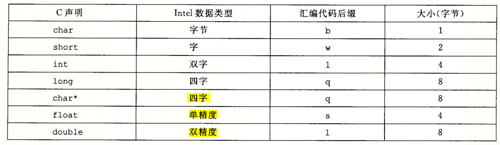
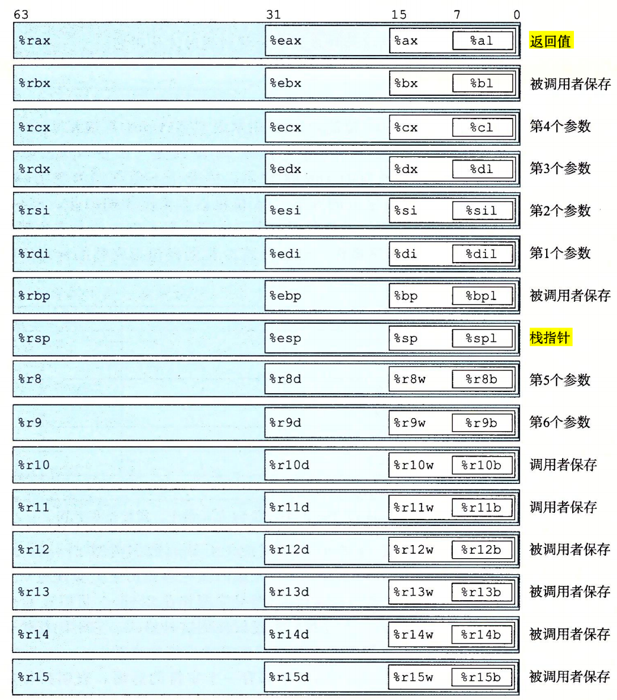
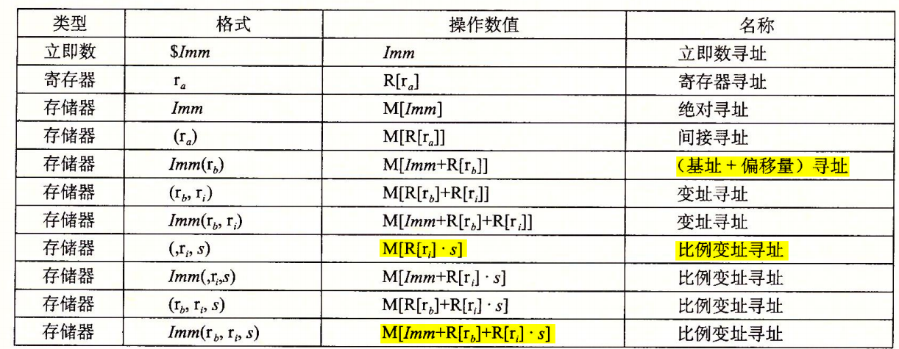
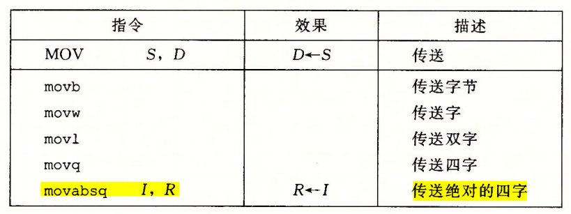
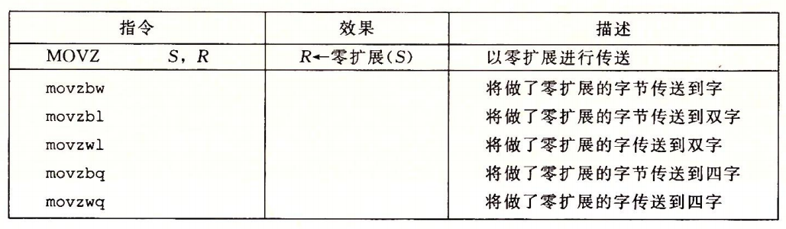
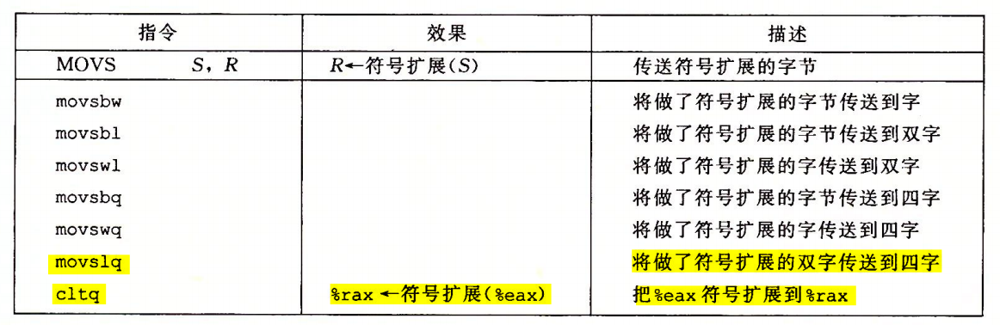
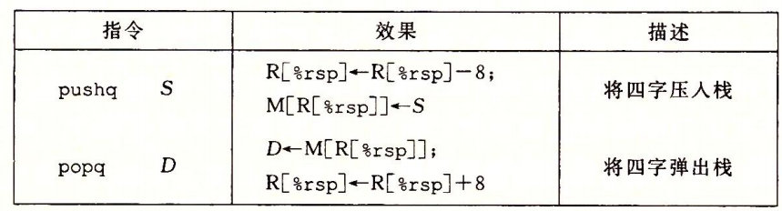
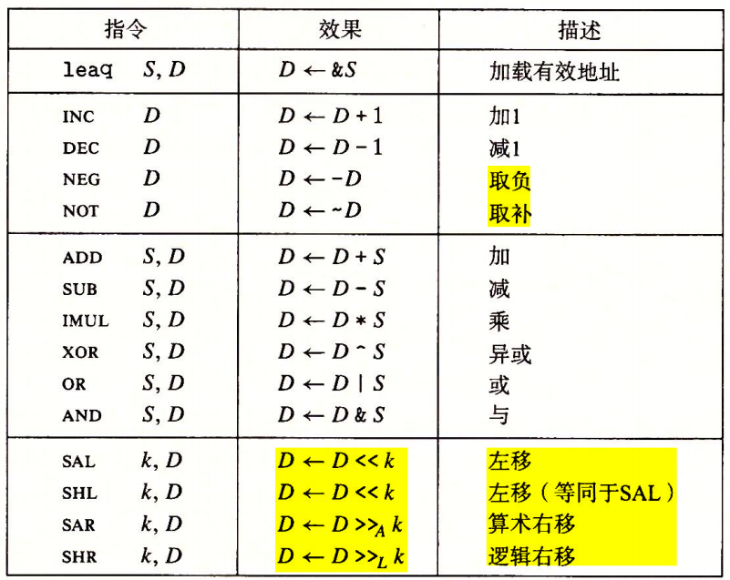
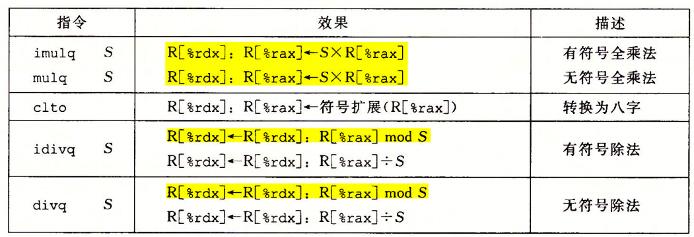

# 程序机器级表示之 x64 汇编之一

## 一、程序编码

计算机执行机器代码，用字节序列编码低级的操作，包括处理数据、管理内存、读写存储设备上的数据，以及利用网络通信。**<font color="red">编译器基于编程语言的规则、目标机器的指令集和操作系统遵循的惯例，经过一系列的阶段生成机器代码</font>**。GCC C 语言编译器以汇编代码的形式产生输出，汇编代码是机器代码的文本表示，给出程序中的每一条指令。然后 GCC 调用汇编器和链接器，根据汇编代码生成可执行的机器代码。

通常情况下，使用现代的优化编译器产生的代码至少与一个熟练的汇编语言程序员手工编写的代码一样有效。最大的优点是，用高级语言编写的程序可以在很多不同的机器上编译和执行，**而汇编代码则是与特定机器密切相关的**。

### 1.程序编码

假设一个 C 程序，有两个文件 p1.c 和 p2.c。我们用 Unix 命令行编译这些代码：

```c{.line-numbers}
linux> gcc -Og -o p p1.c p2.c
```

>-O：是 GCC 的优化选项前缀，表示对生成的代码进行优化；
>-g：此处表示优化的级别专注于调试，方便开发者在调试代码时查看变量值和控制流；
>-O0 、-O1 、-O2 、-O3：编译器的优化选项的 4 个级别，-O0 表示没有优化，-O1 为默认值，-O3 优化级别最高；
>-Og：当代码出现问题，希望调试器能准确映射源代码和执行代码之间的关系。也就是这里所说的会生成符合原始 C 代码整体结构的机器代码；

命令 gcc 指的就是 GCC C 编译器。因为这是 Linux 上默认的编译器，我们也可以简单地用 cc 来启动它。**编译选项 -Og 告诉编译器使用会生成符合原始 C 代码整体结构的机器代码的优化等级**。使用较高级别优化产生的代码会严重变形，以至于产生的机器代码和初始源代码之间的关系非常难以理解。实际中，从得到的程序的性能考虑，较高级别的优化 (例如，以选项-O1 或-O2 指定) 被认为是较好的选择。

实际上 gcc 命令调用了一整套的程序，将源代码转化成可执行代码。首先，**<font color="red">C 预处理器扩展源代码</font>**，插入所有用 #include 命令指定的文件，并扩展所有用 #define 声明指定的宏。**<font color="red">其次编译器产生两个源文件的汇编代码</font>**，名字分别为 p1.s 和 p2.s。接下来，**<font color="red">汇编器会将汇编代码转化成二进制目标代码文件</font>** p1.o 和 p2.o。目标代码是机器代码的一种形式，它包含所有指令的二进制表示，但是还没有填入全局值的地址。**<font color="red">最后，链接器将两个目标代码文件与实现库函数 (例如 printf) 的代码合并</font>**，并产生最终的可执行代码文件 p (由命令行指示符 -o p 指定的)。

#### 1.1 机器级代码

对于机器级编程来说，其中两种抽象尤为重要:

- **第一种是由指令集体系结构或指令集架构 (Instruction Set Architecture，ISA) 来定义机器级程序的格式和行为**，它定义了处理器状态、指令的格式，以及每条指令对状态的影响。大多数 ISA，包括 x86-64，将程序的行为描述成好像每条指令都是按顺序执行的，一条指令结束后，下一条再开始。处理器的硬件远比描述的精细复杂，它们并发地执行许多指令，但是可以采取措施保证整体行为与 ISA 指定的顺序执行的行为完全一致；
- **第二种抽象是，机器级程序使用的内存地址是虚拟地址**，提供的内存模型看上去是一个非常大的字节数组。存储器系统的实际实现是将多个硬件存储器和操作系统软件组合起来，

x86-64 的机器代码中比较重要的寄存器：

- 程序计数器 (通常称为 "PC"，在 x86-64 中用 %rip 表示) 给出将要执行的下一条指令在内存中的地址；
- 16 个 64 位整数寄存器：这些寄存器可以存储地址 (对应于 C 语言的指针) 或整数数据。有的寄存器被用来记录某些重要的程序状态（比如 %rsp、%rbp），而其他的寄存器用来保存临时数据，例如过程的参数和局部变量，以及函数的返回值（比如 %rdi、%rsi、%rax 等）。
- 条件码寄存器保存着最近执行的算术或逻辑指令的状态信息。它们用来实现控制或数据流中的条件变化，比如说用来实现 if 和 while 语句。
- 一组向量寄存器可以存放一个或多个整数或浮点数值。

虽然 C 语言提供了一种模型，可以在内存中声明和分配各种数据类型的对象，但是机器代码只是简单地将内存看成一个很大的、按字节寻址的数组。C 语言中的聚合数据类型，例如数组和结构，在机器代码中用一组连续的字节来表示。**<font color="red">即使是对标量数据类型，汇编代码也不区分有符号或无符号整数，不区分各种类型的指针，甚至于不区分指针和整数</font>**。

一条机器指令只执行一个非常基本的操作。例如，将存放在寄存器中的两个数字相加，在存储器和寄存器之间传送数据，或是条件分支转移到新的指令地址。编译器必须产生这些指令的序列，从而实现 (像算术表达式求值、循环或过程调用和返回这样的) 程序结构。

#### 1.2 代码示例

假设有如下的 c 语言代码：

```c{.line-numbers}
// gcc -Og -S test.c
long mult2(long a, long b);

void multstore(long x, long y, long* dest) {
   long t = mult2(x, y);
   *dest = t;
} 
```

接下来使用 **`gcc -Og -S test.c`** 命令对上述 C 语言代码进行编译，这会使 GCC 运行编译器，产生一个汇编文件 mstore.s，但是不做其他进一步的工作。(通常情况下，它还会继续调用汇编器产生目标代码文件)。

```armasm{.line-numbers}
	.file	"test.c"
	.text
	.globl	multstore
	.type	multstore, @function
multstore:
.LFB0:
	.cfi_startproc
	endbr64
	pushq	%rbx
	.cfi_def_cfa_offset 16
	.cfi_offset 3, -16
	movq	%rdx, %rbx
	call	mult2@PLT
	movq	%rax, (%rbx)
	popq	%rbx
	.cfi_def_cfa_offset 8
	ret
	.cfi_endproc
.LFE0:
	.size	multstore, .-multstore
	.ident	"GCC: (Ubuntu 11.4.0-1ubuntu1~22.04) 11.4.0"
	.section	.note.GNU-stack,"",@progbits
	.section	.note.gnu.property,"a"
	.align 8
```

multstore 函数被调用时，参数 x 通过 %rdi 来传递，y 通过 %rsi 来传递，dest 指针通过 %rdx 来传递。因此在 multstore 函数的汇编代码中，继续使用 %rdi、%rsi 来传递 x 和 y 参数，接着调用 mult2，mult2 函数的计算结果保存在寄存器 %rax 中，并最后保存到 dest 指针指向的内存区域（**`movq %rax, (%rbx)`**）。

>所有以 '.' 开头的行都是指导汇编器和链接器工作的伪指令，我们通常可以忽略这些行。

如果我们使用 "-c" 命令行选项，即 **`gcc -Og -c test.c`**，gcc 会编译并汇编该代码，这就会产生目标代码文件 test.o，它是二进制格式的，所以无法直接查看。机器执行的程序只是一个字节序列，它是对一系列指令的编码。机器对产生这些指令的源代码几乎一无所知。在 Linux 系统中，带 "-d" 命令行标志的程序 OBJDUMP 可以作为反汇编器来逆向查看机器代码文件的内容。

>**使用 gcc -c 选项，生成目标代码文件；使用 gcc -o 选项，生成实际可执行的代码文件**。

使用 **`objdump -d test.o`** 反汇编 test.o 的二进制机器代码得到的结果如下：

```armasm{.line-numbers}
test.o：     文件格式 elf64-x86-64

Disassembly of section .text:

0000000000000000 <multstore>:
   0:	f3 0f 1e fa          	endbr64 
   4:	53                   	push   %rbx
   5:	48 89 d3             	mov    %rdx,%rbx
   8:	e8 00 00 00 00       	call   d <multstore+0xd>
   d:	48 89 03             	mov    %rax,(%rbx)
  10:	5b                   	pop    %rbx
  11:	c3                   	ret 
```

其中一些关于机器代码和它的反汇编表示的特性值得注意：

- x86-64 的指令长度从 1 到 15 个字节不等。**<font color="red">常用的指令以及操作数较少的指令所需的字节数少，而那些不太常用或操作数较多的指令所需字节数较多</font>**；
- 设计指令格式的方式是，从某个给定位置开始，可以将字节唯一地解码成机器指令。例如，只有指令 **`pushq %rbx`** 是以字节值 53 开头的；
- 反汇编器使用的指令命名规则与 GCC 生成的汇编代码使用的有些细微的差别。在我们的示例中，它省略了很多指令结尾的 'q'。这些后缀是大小指示符。相反反汇编器给 call 和 ret 指令添加了 'q' 后缀；

**<font color="red">生成实际可执行的代码需要对一组目标代码文件运行链接器，而这一组目标代码文件中必须含有一个 main 函数</font>**。假设在 main.c 中有如下函数：

```armasm{.line-numbers}
// main.c
#include<stdio.h>

void multstore(long, long, long*);

int main() {
	long d;
	multstore(2, 3, &d);
	printf("2 * 3 --> %ld\n", d);
	return 0;
}

long mult2(long a, long b) {
	long s = a * b;
	return s;
}
```

我们使用 **`gcc -Og -o prog main.c test.c`** 来生成可执行文件 prog，并且使用 objdump 反汇编此二进制文件 prog 得到的部分代码序列如下所示：

```armasm{.line-numbers}
0000000000001169 <main>:
    1169:	f3 0f 1e fa          	endbr64 
    116d:	48 83 ec 18          	sub    $0x18,%rsp
    1171:	64 48 8b 04 25 28 00 	mov    %fs:0x28,%rax
    1178:	00 00 
    117a:	48 89 44 24 08       	mov    %rax,0x8(%rsp)
    117f:	31 c0                	xor    %eax,%eax
    1181:	48 89 e2             	mov    %rsp,%rdx
    1184:	be 03 00 00 00       	mov    $0x3,%esi
    1189:	bf 02 00 00 00       	mov    $0x2,%edi
    118e:	e8 45 00 00 00       	call   11d8 <multstore>
    1193:	48 8b 14 24          	mov    (%rsp),%rdx
    1197:	48 8d 35 66 0e 00 00 	lea    0xe66(%rip),%rsi        # 2004 <_IO_stdin_used+0x4>
    119e:	bf 01 00 00 00       	mov    $0x1,%edi
    11a3:	b8 00 00 00 00       	mov    $0x0,%eax
    11a8:	e8 c3 fe ff ff       	call   1070 <__printf_chk@plt>
    11ad:	48 8b 44 24 08       	mov    0x8(%rsp),%rax
    11b2:	64 48 2b 04 25 28 00 	sub    %fs:0x28,%rax
    11b9:	00 00 
    11bb:	75 0a                	jne    11c7 <main+0x5e>
    11bd:	b8 00 00 00 00       	mov    $0x0,%eax
    11c2:	48 83 c4 18          	add    $0x18,%rsp
    11c6:	c3                   	ret    
    11c7:	e8 94 fe ff ff       	call   1060 <__stack_chk_fail@plt>

00000000000011cc <mult2>:
    11cc:	f3 0f 1e fa          	endbr64 
    11d0:	48 89 f8             	mov    %rdi,%rax
    11d3:	48 0f af c6          	imul   %rsi,%rax
    11d7:	c3                   	ret    

00000000000011d8 <multstore>:
    11d8:	f3 0f 1e fa          	endbr64 
    11dc:	53                   	push   %rbx
    11dd:	48 89 d3             	mov    %rdx,%rbx
    11e0:	e8 e7 ff ff ff       	call   11cc <mult2>
    11e5:	48 89 03             	mov    %rax,(%rbx)
    11e8:	5b                   	pop    %rbx
    11e9:	c3                   	ret 
```

其中 multstore 部分的代码与 test.c 单独反汇编后产生的代码几乎完全一样，但是存在 2 个主要的区别：

- 第一个区别就是左边列出的地址不同；
- 第二个区别就是链接器填上了 callq 指令调用函数 mult2 需要使用的地址。链接器的任务之一就是为函数调用找到匹配的函数的可执行代码的位置；

>Intel 和 AT&T 汇编格式之间的差异如下：
>1. Intel 代码省略了指示大小的后缀。我们看到指令 push 和 mov，而不是 pushq 和 movq。
>2. Intel 代码省略了寄存器名字前面的 % 符号，用的是 rbx，而不是 %rbx。
>3. Intel 代码用不同的方式来描述内存中的位置，例如是 **`QWORD PTR[rbx]`** 而不是 **`(%rbx)`**。
>4. 在带有多个操作数的指令情况下，列出操作数的顺序相反。

## 二、数据格式

Intel 用术语 "字(word)" 表示 16 位数据类型。因此称 32 位数为 "双字(double words)"，称 64 位数为 "四字(quad words)"，下图给出了 C 语言基本数据类型对应的 x86-64 表示。标准 int 值存储为双字 (32 位)。指针 (在此用 char* 表示) 存储为 8 字节的四字。

<div align="center">
    
</div>

浮点数主要有两种形式：单精度 (4 字节) 值，对应于 C 语言数据类型 float；双精度 (8 字节) 值，对应于 C 语言数据类型 double。x86 家族的微处理器历史上实现过对一种特殊的 80 位(10 字节) 浮点格式进行全套的浮点运算。可以在 C 程序中用声明 long double 来指定这种格式。不过它不能移植到其他类型的机器上。

如上图所示，**<font color="blue">大多数 gcc 生成的汇编代码指令都有一个字符的后缀，表明操作数的大小</font>**。例如，数据传送指令有 4 个变种：movb（传送字节）、movw（传送字）、movl（传送双字）和 movq（传送四字）。

## 三、访问信息

### 1.访问信息

一个 x86-64 的中央处理单元(CPU) 包含一组 16 个存储 64 位值的通用目的寄存器。**这些寄存器用来存储整数数据和指针**，这些寄存器的名字都以 %r 开头。

<div align="center">
    
</div>

上图中嵌套的方框标明的，**指令可以对这 16 个寄存器的低位字节中存放的不同大小的数据进行操作**。字节级操作可以访问最低的字节，16 位操作可以访问最低的 2 个字节，32 位操作可以访问最低的 4 个字节，而 64 位操作可以访问整个寄存器。对于生成小于 8 字节结果的指令，寄存器中剩下的字节会怎么样，对此有两条规则: 

- **<font color="red">生成 1 字节和 2 字节数字的指令会保持剩下的字节不变</font>**；
- **<font color="red">生成 4 字节数字的指令会把高位 4 个字节置为 0。后面这条规则是作为从 IA32 到 x86-64 的扩展的一部分而采用的</font>**。

### 2.操作数指示符

大多数指令有一个或多个操作数 (operand)，指示出执行一个操作中要使用的源数据值，以及放置结果的目的位置。x86-64 支持多种操作数格式，源数据值可以以常数形式给出，或是从寄存器或内存中读出。结果可以存放在寄存器或内存中。因此，各种不同的操作数的可能性被分为三种类型。

<div align="center">
    
</div>

第一种类型是立即数 (immediate)，用来表示常数值。立即数的书写方式是 $ 后面跟一个用标准 C 表示法表示的整数，比如，$-577 或 $0x1F。**不同的指令允许的立即数值范围不同，汇编器会自动选择最紧凑的方式进行数值编码**。

第二种类型是寄存器 (register)，它表示某个寄存器的内容，16 个寄存器的低位 1 字节、2 字节、4 字节或 8 字节中的一个作为操作数，这些字节数分别对应于 8 位、16 位、32 位或 64 位。在上图中，**我们用符号 $r_{a}$ 来表示任意寄存器 a，引用 $R[r_{a}]$ 来表示它的值**，这是将寄存器集合看成一个数组 R，用寄存器标识符作为索引。

第三种操作数是内存引用，它会根据计算出来的地址 (通常称为有效地址) 访问某个内存位置。因为将内存看成一个很大的字节数组，**我们用符号 $M_{b}[Addr]$ 表示对存储在内存中从地址 Addr 开始的 b 个字节值的引用**。为了简便，我们通常省去下标 b。

上表中底部的语法 $Imm(r_{b}, r_{i}, s)$ 有 4 个组成部分：一个立即数偏移 $Imm$、一个基址寄存器 $r_{b}$、一个变址寄存器 $r_{i}$ 以及一个比例因子 $s$，这里 $s$ 必须是 1、2、4 或者 8，并且基址和变址寄存器必须是 64 位寄存器。

### 3.数据传送指令

下面列出的是最简单形式的数据传送指令——MOV 类。这些指令把数据从源位置复制到目的位置，不做任何变化。MOV 类由四条指令组成：movb、movw、movl 和 movq，这些指令都执行同样的操作；主要区别在于它们操作的数据大小不同: 分别是 1、2、4 和 8 字节。

<div align="center">
    
</div>

源操作数指定的值是一个立即数，存储在寄存器中或者内存中。目的操作数指定一个位置，要么是一个寄存器或者是一个内存地址。**<font color="red">x86-64 加了一条限制，传送指令的两个操作数不能都指向内存位置</font>**。将一个值从一个内存位置复制到另一个内存位置需要两条指令——第一条指令将源值加载到寄存器中，第二条将该寄存器值写入目的位置。上述指令中寄存器操作数的大小必须与指令最后一个字符（'b'、'w'、'l' 和 'q'）指定的大小相匹配。大多数情况中，**<font color="blue">mov 指令只会更新目的操作数指定的那些寄存器字节或内存位置。唯一的例外是 movl 指令以寄存器作为目的时，它会把该寄存器的高位 4 字节设置为 0</font>**。

上图中记录的最后一条指令 **`movabsq`** 是处理 64 位立即数数据的。常规的 movq 指令只能以表示为 32 位补码数字的立即数作为源操作数，然后把这个值符号扩展得到 64 位的值，放到目的位置。**movabsq 指令能够以任意 64 位立即数值作为源操作数，并且只能以寄存器作为目的**。

下面的例子有助于理解数据传送指令如何改变目的寄存器，其中 movl 指令将 %rax 的低 4 字节设置为 0xFFFFFFFF，而高 4 字节设置为 0。

```armasm{.line-numbers}
movabsq $0x0011223344556677, %rax       ;%rax = 0011223344556677
movb    $-1, %al                        ;%rax = 00112233445566FF
movw    $-1, %ax                        ;%rax = 001122334455FFFF
movl    $-1, %eax                       ;%rax = 00000000FFFFFFFF
movq    $-1, %rax                       ;%rax = FFFFFFFFFFFFFFFF
```

下图中的是零扩展数据传送指令和符号扩展数据传送指令，在将较小的源值复制到较大的目的时使用。所有这些指令都把数据从源 (在寄存器或内存中) 复制到目的寄存器。movz 类中的指令把目的中剩余的字节填充为 0，而 movs 类中的指令通过符号扩展来填充，把源操作的最高位进行复制。注意在第一个图中，**<font color="red">并没有 movzlq 这条指令（将 4 字节源值零扩展到 8 字节），但是这个指令的效果可以通过 movl 来实现</font>**，这是因为 movl 指令以寄存器作为目的时，它会把该寄存器的高位 4 字节设置为 0。

**`cltq`** 指令总是以 %eax 作为源，以 %rax 作为目的，它等价于 **`movslq %eax, %rax`**，只不过编码更加紧凑。

<div align="center">
    <div align="center" style="color: red; font-size:13px; font-weight:bold">零扩展数据传送指令</div>
    
</div>

<div align="center">
    <div align="center" style="color: red; font-size:13px; font-weight:bold">符号扩展数据传送指令</div>
    
</div>

下面的例子说明了 movb、movsbq、movzbq 之间的差别:

```armasm{.line-numbers}
movabsq $0x0011223344556677, %rax       ;%rax = 0011223344556677
movb    $0xAA, %dl                      ;%dl = AA
movb    %dl,%al                         ;%rax = 00112233445566AA
movsbq  %dl,%rax                        ;%rax = FFFFFFFFFFFFFFAA
movzbq  %dl,%rax                        ;%rax = 00000000000000AA
```

>**C 语言中所谓的 "指针" 其实就是地址。间接引用指针就是将该指针放在一个寄存器中，然后在内存引用中使用这个寄存器**。

### 4.压入和弹出栈数据

栈是一种数据结构，可以添加或者删除值，不过要遵循 "后进先出" 的原则。通过 push 操作把数据压入栈中，通过 pop 操作删除数据；它具有一个属性：弹出的值永远是最近被压入而且仍然在栈中的值。栈可以实现为一个数组，总是从数组的一端插入和删除元素。这一端被称为栈顶。在 x86-64 中，程序栈存放在内存中某个区域。栈向下增长，这样一来，栈顶元素的地址是所有栈中元素地址中最低的。栈指针 %rsp 保存着栈顶元素的地址。

<div align="center">
    
</div>

**<font color="red">因为栈和程序代码以及其他形式的程序数据都是放在同一内存中，所以程序可以用标准的内存寻址方法访问栈内的任意位置</font>**。例如假设栈顶元素是四字，指令 **`movq 8(%rsp)，%rdx`** 会将第二个四字从栈中复制到寄存器 %rdx。

## 四、算术和逻辑操作

下图列出了 x86-64 的一些整数和逻辑操作。大多数操作都分成了指令类，这些指令类有各种带不同大小操作数的变种 (只有 leaq 没有其他大小的变种)。例如，指令类 add 由四条加法指令组成：**`addb、addw、addl、addq`**，分别是字节加法、字加法、双字加法和四字加法。下表中的操作被分为 4 组：加载有效地址、一元操作、二元操作和移位操作。

<div align="center">
    <div align="center" style="color: red; font-size:13px; font-weight:bold">表 4.1 算术和逻辑操作表</div>
    
</div>

### 1.移位操作

移位操作先给出移位量，然后第二项给出的是要移位的数。移位量可以是一个立即数，或者放在单字节寄存器 %cl 中 (只允许以这个特定的寄存器作为操作数)。原则上来说，1 个字节的移位量使得移位量的编码范围可以达到 $2^8 - 1=255$。**x86-64 中，移位操作对 w 位长的数据值进行操作，移位量是由 %cl 寄存器的低 m 位决定的，这里 $2^m=w$，高位会被忽略**。所以例如当寄存器 %cl 的十六进制值为 0xFF 时，指令 salb 会移 7 位，salw 会移 15 位，sall 会移 31 位，而 salq 会移 63 位。

在移位操作中，SAL 和 SHL 指令完全相同，都是将操作数的二进制位向左移动指定的位数，右侧空出的位用 0 填充，左侧移出的位会进入 CF 标志位，每左移动一次，就相当于操作数乘以 2。其中，**SAL 表示对有符号数进行左移操作，SHL 表示对无符号数进行左移操作**。

SAR（算术右移）将操作数的二进制位向右移动指定的位数，符号位（最高位）保持不变，**<font color="red">左侧空出的位用符号位的值填充，适用于有符号数的右移操作</font>**。SHR（逻辑右移）将操作数的二进制位向右移动指定的位数，符号位（最高位）用 0 填充，**<font color="red">左侧空出的位也用 0 填充。适用于无符号数的右移操作</font>**。

### 2.加载有效地址

加载有效地址 (load effective address) 指令 leaq 实际上是 movq 指令的变形。**它的指令形式是从内存读数据到寄存器，但实际上它根本就没有引用内存**。它的第一个操作数看上去是一个内存引用，但该指令并不是从指定的位置读入数据，而是将有效地址写入到目的操作数。leaq 指令的目的操作数必须是一个寄存器。它还可以简洁地描述普通的算术操作。例如，如果寄存器 %rdx 的值为 x，那么指令 **`leaq 7(%rdx，%rdx，4)，%rax`** 将设置寄存器%rax 的值为 5x+7。

比如下面的 C 代码：

```c{.line-numbers}
long scale(long x, long y, long z) {
	long t = x + 4 * y + 12 * z;
	return t;
}
```

上述 C 语言代码经过 gcc 编译之后形成的汇编代码如下所示：

```c{.line-numbers}
;%rdi->x   %rsi->y   %rdx->z
scale:
    endbr64
    leaq	(%rdi,%rsi,4), %rax
    leaq	(%rdx,%rdx,2), %rdx
    leaq	(%rax,%rdx,4), %rax
    ret
```

### 3.一元和二元操作

第二组中的操作是一元操作，只有一个操作数，既是源又是目的。这个操作数可以是一个寄存器，也可以是一个内存位置。第一个操作数可以是立即数、寄存器或是内存位置。第二个操作数可以是寄存器或是内存位置。注意，当第二个操作数为内存地址时，处理器必须从内存读出值，执行操作，再把结果写回内存。

### 4.特殊算术操作

两个 64 位有符号或无符号整数相乘得到的乘积需要 128 位来表示。x86-64 指令集对 128 位 (16 字节) 数的操作提供有限的支持。延续字 (2 字节)、双字 (4 字节) 和四字 (8 字节) 的命名惯例，Intel 把 16 字节的数称为八字 (oct word)。

<div align="center">
    <div align="center" style="color: red; font-size:13px; font-weight:bold">表 4.2 特殊算术操作表</div>
    
</div>

imulq 指令有两种不同的形式。第一种 **`imulq S, D`** 指令是一个 "双操作数" 乘法指令，它从两个 64 位操作数产生一个 64 位乘积。此外，x86-64 指令集还提供了两条不同的 "单操作数" 乘法指令，以计算两个 64 位值的全 128 位乘积——一个是无符号数乘法 (mulq)，而另一个是补码乘法 (imulq)。**<font color="red">这两条指令都要求一个参数必须在寄存器 %rax 中，而另一个作为指令的源操作数给出。然后乘积存放在寄存器 %rdx (高 64 位) 和 %rax (低 64 位) 中</font>**。

下面的 C 代码是一个示例，说明了如何从两个无符号 64 位数字 x 和 y 相乘生成 128 位的乘积：

```c{.line-numbers}
#include<inttypes.h>

typedef unsigned __int128 uint128_t;

void store_uprod(uint128_t *dest, uint64_t x, uint64_t y) {
	*dest = x * (uint128_t) y;
}
```

在这个程序中，我们显式地把 x 和 y 声明为 64 位的数字，使用文件 inttypes.h 中声明的定义，这是对标准 C 扩展的一部分。不过 inttypes.h 中没有声明对 128 位数字的支持，所以只好依赖 gcc 提供的 128 位整数支持，用名字 __int128 来声明。这段代码得到的乘积应该放在指针 dest 指向的 16 字节处。

```armasm{.line-numbers}
store_uprod:
.LFB0:
	.cfi_startproc
	endbr64
	movq	%rsi, %rax
	mulq	%rdx
	movq	%rax, (%rdi)
	movq	%rdx, 8(%rdi)
	ret
	.cfi_endproc
```

可以观察到，存储乘积需要两个 movq 指令: 一个存储低 8 个字节 (第 4 行)，一个存储高 8 个字节 (第 5 行)。由于生成这段代码针对的是小端法机器，所以高位字节存储在大地址，正如地址 8(%rdi) 表明的那样。

前面的表 4.1 算术运算表没有列出除法或取模操作。这些操作是由单操作数除法指令来提供的，**<font color="red">有符号除法指令 idivl 将寄存器 %rdx (高 64 位)和 %rax (低 64 位) 中的 128 位数作为被除数，而除数作为指令的操作数给出。指令将商存储在寄存器 %rax 中，将余数存储在寄存器 %rdx 中</font>**。对于大多数 64 位除法应用来说，被除数也常常是一个 64 位的值。这个值应该存放在 %rax 中，%rdx 的位应该设置为全 0 (无符号运算) 或者 %rax 的符号位 (有符号运算)。后面这个操作可以用指令 cqto 来完成。这条指令不需要操作数——它隐含读出 %rax 的符号位，并将它复制到 %rdx 的所有位。

下面这个 C 程序例子说明了 x86-64 如何实现除法，它计算了两个 64 位有符号数的商和余数。

```c{.line-numbers}
void remdiv(long x,long y,long *qp,long *rp) {
	long q = x/y;
	long r = x % y;
	*qp = q;
	*rp = r;
}
```

上述代码经过 gcc 编译生成汇编代码之后结果如下所示：

```armasm{.line-numbers}
;x in %rdi,  y in %rsi, qp in %rdx, rp in %rcx
remdiv:
.LFB0:
	movq	%rdi, %rax
	movq	%rdx, %r8
	cqto
	idivq	%rsi
	movq	%rax, (%r8)
	movq	%rdx, (%rcx)
	ret
```

