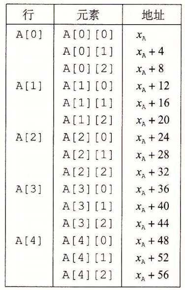

# 程序机器级表示之 x64 位汇编之三

## 一、数组分配和访问

C 语言中的数组是一种将标量数据聚集成更大数据类型的方式。C 语言的一个特点就是可以产生指向数组中元素的指针，并对这些指针进行运算。在机器代码中，这些指针会被翻译成地址计算。

### 1.基本原则

对于数据类型 T 和整型常数 N，声明如下：

```c{.line-numbers}
T A[N];
```

起始位置表示为 $x_{A}$。这个声明有两个效果。**首先，它在内存中分配一个 $L\times N$ 字节的连续区域**，这里 $L$ 是数据类型 $T$ 的大小 (单位为字节)。**其次它引入了标识符 A，可以用 A 来作为指向数组开头的指针**，这个指针的值就是 $x_{A}$。可以用 $0 \sim N-1$ 的整数索引来访问该数组元素。数组元素 $i$ 会被存放在地址为 $x_{A} + L \times i$ 的地方。

作为示例，下面是一些数组的声明：

```c{.line-numbers}
char   A[12];
char   *B[8];
int    C[6];
double *D[5]; 
```

这些声明会产生带下列参数的数组：

<div align="center">
    
</div>

x86-64 的内存引用指令可以用来简化数组访问。例如，假设 E 是一个 int 型的数组，而我们想计算 E[i]，在此，E 的地址存放在寄存器 %rdx 中，而 i 存放在寄存器 %rcx 中。然后，指令:

```armasm{.line-numbers}
movl  (%rdx,%rcx,4), %eax
```

会执行地址计算 $x_{E}+4i$，读这个内存位置的值，并且将结果存放在寄存器 %eax 中。

### 2.指针运算

**<font color="red">C 语言允许对指针进行运算，而计算出来的值会根据该指针引用的数据类型的大小进行伸缩</font>**。也就是说，如果 $p$ 是一个指向类型为 $T$ 的数据的指针，$p$ 的值为 $x_{p}$，那么表达式 $p+i$ 的值为 $x_{p}+L·i$，这里 $L$ 是数据类型 $T$ 的大小。

单操作数操作符 '&' 和 '*' 可以产生指针和间接引用指针。**也就是对于一个表示某个对象的表达式 Expr，** **`&Expr`** **是给出该对象地址的一个指针。对于一个表示地址的表达式 AExpr**，**`*AExpr`** **给出该地址处的值**。因此，表达式 Expr 与 **`*&Expr`** 是等价的。可以对数组和指针应用数组下标操作。数组引用 **`A[i]`** 等同于表达式 **`*(A+i)`**。它计算第 i 个数组元素的地址，然后访问这个内存位置。

假设整型数组 $E$ 的起始地址和整数索引 $i$ 分别存放在寄存器 %rdx 和 %rcx 中。下面是一些与 $E$ 有关的表达式，数据结果存放在寄存器 %eax 中，指针结果存放在寄存器 %rax 中。

<div align="center">
    
</div>

在这些例子中，可以看到返回数组值的操作类型为 int，因此涉及 4 字节操作 (例如 movl) 和寄存器 (例如 %eax)。那些返回指针的操作类型为 int*，因此涉及 8 字节操作 (例如 leaq) 和寄存器 (例如 %rax)。**<font color="red">最后一个例子表明可以计算同一个数据结构中的两个指针之差，结果的数据类型为 long，值等于两个地址之差除以该数据类型的大小</font>**。

### 3.嵌套的数组

当我们创建数组的数组时，数组分配和引用的一般原则也是成立的，比如：

```c{.line-numbers}
int  A[5][3];
```

等价于下面的声明：

```c{.line-numbers}
typedef int row3_t[3];
row3_t A[5];
```

数据类型 row3_t 被定义为一个 3 个整数的数组。数组 A 包含 5 个这样的元素，每个元素需要 12 个字节来存储 3 个整数。整个数组的大小就是 4 × 5 × 3=60 字节。

数组 A 还可以被看成一个 5 行 3 列的二维数组，用 A[0][0] 到 A[4][2] 来引用。数组元素在内存中按照"行优先"的顺序排列，意味着第 0 行的所有元素，可以写作 A[0]，后面跟着第 1 行的所有元素(A[1])，以此类推，如下图所示。

<div align="center">
    
</div>

**这种排列顺序是嵌套声明的结果。将 A 看作一个有 5 个元素的数组，每个元素都是 3 个 int 的数组**，首先是 A[0]，然后是 A[1]，以此类推。要访问多维数组的元素，编译器会以数组起始为基地址，(可能需要经过伸缩的) 偏移量为索引，产生计算期望的元素的偏移量，通常对于一个声明如下的数组：

```c{.line-numbers}
T D[R][C];
```

它的数组元素 $D[i][j]$ 的内存地址为：$\scriptsize{\&D[i][j]=x_{D}+L\cdot(C\cdot i+j)}$，其中，L 是数据类型 T 以字节为单位的大小，作为一个示例，考虑前面定义的 5 × 3 的整型数组 A。假设 $x_{A}$、$i$ 和 $j$ 分别在寄存器 %rdi、%rsi 和 %rdx 中。然后，可以用下面的代码将数组元素 $A[i][j]$ 复制到寄存器 %eax 中。

```armasm{.line-numbers}
;A in %rdi, i in %rsi, and j in %rdx
leaq  (%rsi,%rsi,2), %rax   ;3i
leaq  (%rdi,%rax,4), %rax   ;xA+12i
movl  (%rax,%rdx,4), %eax   ;M[xA+12i+4j]
```

### 4.定长数组

C 语言编译器能够优化定长多维数组上的操作代码。这里我们展示优化等级设置为 -O1 时 GCC 采用的一些优化。假设我们用如下方式将数据类型 fix_matrix 声明为 16 × 16 的整型数组:

```c{.line-numbers}
#define N  16
typedef int fix_matrix[N][N];
```

下面的 C 代码计算矩阵 A 的行 $i$ 和矩阵 B 的列 $k$ 的内积：

```c{.line-numbers}
int fix_prod_ele(fix_matrix A, fix_matrix B, long i, long k) {
    long j;
    int result = 0;

    for(j=0; j<N; j++)
        result += A[i][j] * B[j][k];

    return result;
}
```

下面是优化过的 C 代码 fix_prod_ele_opt，它去掉了整数索引 j，**<font color="red">并把所有的数组引用都转换成了指针间接引用</font>**，其中包括 (1) 生成一个指针，命名为 Aptr，指向 A 的行 i 中连续的元素；(2) 生成一个指针，命名为 Bptr，指向 B 的列 k 中连续的元素；(3) 生成一个指针，命名为 Bend，当需要终止该循环时，它会等于 Bptr 的值。

Aptr 的初始值是 A 的行 i 的第一个元素的地址，**由表达式 `&A[i][0]` 给出**。Bptr 的初始值是 B 的列 k 的第一个元素的地址，**由表达式 `&B[0][k]` 给出**。Bend 的值是 B 的列 j 的第 N+1 个元素的地址，由表达式 **`&B[N][k]`** 给出。

```c{.line-numbers}
int fix_prod_ele_opt(fix_matrix A, fix_matrix B, long i, long k) {
    int *Aptr = &A[i][0];
    int *Bptr = &B[0][k];
    int *Bend = &B[N][k];
    int result = 0;

    do {
        result += *Aptr * *Bptr;
        Aptr++;
        Bptr += N;
    } while(Bptr != Bend);
    return result;
}
```

下面给出的为 fix_prod_ele 使用 gcc 编译器产生的汇编代码，我们看到 4 个寄存器的使用为：%rdi 保存 Aptr 指针，%rax 保存 Bptr 指针，%rsi 保存 Bend 指针，%ecx 保存 result。

```armasm{.line-numbers}
;A in %rdi, B in %rsi, i in %rdx, k in %rcx
fix_prod_ele:
.LFB0:
	.cfi_startproc
	endbr64
	salq	$6, %rdx                ;64 * i    
	addq	%rdx, %rdi              ;Aptr = xA + 64i
	leaq	(%rsi,%rcx,4), %rax     ;Bptr = xB + 4k
	leaq	1024(%rax), %rsi        ;Bend = xB + 4k + 1024
	movl	$0, %ecx                ;result
.L2:
	movl	(%rdi), %edx
	imull	(%rax), %edx
	addl	%edx, %ecx
	addq	$4, %rdi
	addq	$64, %rax
	cmpq	%rsi, %rax
	jne	.L2
	movl	%ecx, %eax
	ret
```

### 5.变长数组

历史上，C 语言只支持大小在编译时就能确定的多维数组 (对第一维可能有些例外)。程序员需要变长数组时不得不用 malloc 或 calloc 这样的函数为这些数组分配存储空间，而且不得不显式地编码，用行优先索引将多维数组映射到一维数组。**<font color="red">ISO C99 引入了一种功能，允许数组的维度是表达式，在数组被分配的时候才计算出来</font>**。

在变长数组的 C 版本中，我们可以将一个数组声明如下：

```c{.line-numbers}
int A[expr1][expr2];
```

它可以作为一个局部变量，也可以作为一个函数的参数，然后在遇到这个声明的时候，通过对表达式 expr1 和 expr2 求值来确定数组的维度。因此，例如要访问 $n\times n$ 数组的元素 $i$，$j$，我们可以写一个如下的函数:

```c{.line-numbers}
int var_ele(long n, int A[n][n], long i, long j) {
    return A[i][j];
}
```

**参数 n 必须在参数 A[n][n] 之前，这样函数就可以在遇到这个数组的时候计算出数组的维度**。

GCC 为这个引用函数产生的代码如下所示：

```armasm{.line-numbers}
;n in %rdi, A in %rsi, i in %rdx, j in %rcx
var_ele:
	endbr64
	imulq	%rdx, %rdi              ;n*i
	leaq	(%rdi,%rcx), %rax       ;n*i + j
	movl	(%rsi,%rax,4), %eax     ;A + 4*n*i + 4*j
	ret
```

下面给出的原始 C 代码计算出两个 $n\times n$ 矩阵 A 的第 $i$ 行和矩阵 B 的第 $j$ 列的内积：

```c{.line-numbers}
int var_prod_ele(long n, int A[n][n], int B[n][n], long i, long k) {
    long j;
    int result = 0;

    for (j=0; j<n; j++)
        result += A[i][j] * B[j][k];

    return result;
}
```

下面是优化过的 C 代码，下面的代码保留了循环变量 $j$，用以判定循环是否结束和作为到 A 的行 i 的元素组成的数组的索引。

```c{.line-numbers}
int var_prod_ele_opt(long n, int A[n][n], int B[n][n], long i, long k) {
    int *Arow = A[i];
    int *Bptr = &B[0][k];
    int result = 0;
    long j;

    for(j = 0; j < n; j++) {
        result += Arow[j] * *Bptr;
        Bptr += n;
    }

    return result;
}
```

下面汇编代码和既使用了伸缩过的值 4n（寄存器 %r9）来增加 Bptr，也使用了 n 的值（寄存器 %rdi）来检查循环边界。汇编代码中，Arow 指针保存在 %r10 中，Bptr 指针的值保存在 %rcx 中，result 保存在 %esi 中。汇编代码的逻辑与 **`var_prod_ele_opt`** 一样。可以看到，如果允许使用优化，GCC 能够识别出程序访问多维数组的元素的步长，然后生成的代码会避免直接使用等式 $\bold{\scriptsize{\&D[i][j]=x_{D}+L\cdot(C\cdot i+j)}}$ 会导致的乘法。这些优化都可以显著提高程序性能。

比如下面的汇编，在第一次计算出 Bptr 的步长 $4n$ 之后，每次循环过程中，直接将 Bptr 与步长相加即可，而不会使用上述等式中的乘法来计算。

```armasm{.line-numbers}
;n in %rdi, A in %rsi, B in %rdx, i in %rcx, k in %r8
var_prod_ele:
.LFB0:
	.cfi_startproc
	endbr64
	testq	%rdi, %rdi              ;n 是否为 0
	jle	.L4
	imulq	%rdi, %rcx              ;n*i
	leaq	(%rsi,%rcx,4), %r10     ;Arow -> A + 4*n*i
	leaq	0(,%rdi,4), %r9         ;4*n
	leaq	(%rdx,%r8,4), %rcx      ;Bptr -> B + 4*k
	movl	$0, %esi                ;result
	movl	$0, %eax                ;j
.L3:
	movl	(%r10,%rax,4), %edx     ;Arow + 4*j
	imull	(%rcx), %edx            ;Arow[j] * *Bptr
	addl	%edx, %esi              
	addq	$1, %rax                ;j = j + 1
	addq	%r9, %rcx               ;Bptr += 4*n
	cmpq	%rax, %rdi              
	jne	.L3
.L1:
	movl	%esi, %eax
	ret
.L4:
	movl	$0, %esi
	jmp	.L1
```

## 二、异质的数据结构

C 语言提供了两种将不同类型的对象组合到一起创建数据类型的机制: 结构 (structure)，用关键字 struct 来声明，将多个对象集合到一个单位中；联合(union)，用关键字 union 来声明，允许用几种不同的类型来引用一个对象。

### 1.结构

C 语言的 struct 声明创建一个数据类型，将可能不同类型的对象聚合到一个对象中。用名字来引用结构的各个组成部分。**<font color="red">类似于数组的实现，结构的所有组成部分都存放在内存中一段连续的区域内，而指向结构的指针就是结构第一个字节的地址</font>**。编译器维护关于每个结构类型的信息，指示每个字段(field) 的字节偏移。它以这些偏移作为内存引用指令中的位移，从而产生对结构元素的引用。

例如，一个图形程序可能要用结构体来表示一个长方形：

```c{.line-numbers}
struct rect {
    long llx;
    long lly;
    unsigned long width;
    unsigned long height;
    unsigned color;
};
```

另外，我们可以在一条语句中既声明变量又初始化它的手段：

```c{.line-numbers}
struct rect r = {0, 0, 10, 20, 0xFF00FF};
```

将指向结构的指针从一个地方传递到另一个地方，而不是复制它们，这是很常见的。例如，下面的函数计算长方形的面积，这里传递给函数的就是一个指向长方形 struct 的指针:

```c{.line-numbers}
long area(struct rect *rp) {
    return (*rp).width * (*rp).height;
}
```

表达式 **`(*rp).width`** 间接引用了这个指针，并且选取所得结构的 width 字段。**<font color="red">这里必须要用括号，因为编译器会将表达式 **`*rp.width`** 解释为 **`*(rp.width)`**，而这是非法的</font>**。间接引用和字段选取结合起来使用非常常见，以至于 C 语言提供了一种替代的表示法 ->。即 **`rp->width`** 等价于表达式 **`(*rp).width`**。

下面是一个结构声明：

```c{.line-numbers}
struct rect {
    int i;
    int j;
    int a[2];
    int *p;
};
```

这个结构包括 4 个字段: 两个 4 字节 int、一个由两个类型为 int 的元素组成的数组和一个 8 字节整型指针，总共是 24 个字节:

<div align="center">
    
</div>

为了访问结构的字段，编译器产生的代码要将结构的地址加上适当的偏移。例如，假设 **`struct rec*`** 类型的变量 r 放在寄存器 %rdi 中。那么下面的代码将元素 **`r->i`** 复制到元素 **`r->j`**:

```armasm{.line-numbers}
;registers: r in %rdi
movl   (%rdi), %eax     ;get r->i
movl   %eax,  4(%rdi)   ;store in r->j
```

因为字段 i 的偏移量为 0，所以这个字段的地址就是 r 的值。为了存储到字段 j，代码要将 r 的地址加上偏移量 4。要产生一个指向结构内部对象的指针，我们只需将结构的地址加上该字段的偏移量。例如，只用加上偏移量 8+4×1=12，就可以得到指针 **`&(r->a[1])`**。对于在寄存器 %rdi 中的指针 r 和在寄存器 %rsi 中的长整数变量 i，我们可以用一条指令产生指针 **`&(r->a[i])`** 的值：

```armasm{.line-numbers}
;registers: r in %rdi, i in %rsi
leaq  8(%rdi, %rsi, 4), %rax
```

最后一个例子：

```c{.line-numbers}
r->p = &r->a[r->i + r->j];
```

上述 c 语句对应的汇编代码如下所示：

```armasm{.line-numbers}
;registers: r in %rdi
movl  4(%rdi), %eax             ; get r->j
addl  (%rdi),  %eax             ; add r->i
cltq
leaq  8(%rdi,%rax,4), %rax
movq  %rax,  16(%rdi)
```

### 2.联合

联合提供了一种方式，能够规避 C 语言的类型系统，允许以多种类型来引用一个对象。**联合声明的语法与结构的语法一样，只是联合是用不同的字段来引用相同的内存块**。

考虑下面的声明：

```c{.line-numbers}
struct S3 {
    char c;
    int i[2];
    double v;
};

union U3 {
    char c;
    int i[2];
    double v;
}
```

在一台 x86-64 Linux 机器上编译时，字段的偏移量、数据类型 S3 和 U3 的完整大小如下:

<div align="center">
    
</div>

对于类型 **`union U3*`** 的指针 p，p->c、p->i[0] 和 p->v 引用的都是数据结构的起始位置。**<font color="red">还可以观察到，一个联合（union）的总的大小等于它最大字段的大小</font>**。联合的一种应用情况是，**我们事先知道对一个数据结构中的两个不同字段的使用是互斥的，那么将这两个字段声明为联合的一部分，而不是结构的一部分，会减小分配空间的总量**。

例如，假设我们想实现一个二叉树的数据结构，每个叶子节点都有两个 double 类型的数据值，而每个内部节点都有指向两个孩子节点的指针，但是没有数据。如果声明如下：

```c{.line-numbers}
struct node_s {
    struct node_s *left;
    struct node_s *right;
    double data[2];
};
```

那么每个 node_s 节点都需要 32 个字节的存储空间，每种类型的节点都要浪费一半的字节。相反如果我们声明如下一个节点：

```c{.line-numbers}
union node_u {
    struct {
        union node_u *lef;
        union node_u *right;
    } internal;
    double data[2];
};
```

或者如下声明一个节点：

```c{.line-numbers}
union node_u {
    union node_u *left;
    union node_u *right;
    double data[2];
};
```

那么每个 node_u 节点就只需要 16 个字节。如果 n 是一个指针，指向 **`union node u*`** 类型的节点，我们用 **`n->data[0]`** 和 **`n->data[1]`** 来引用叶子节点的数据，而用 **`n->internal.left`** 和 **`n-> internal.right`** 来引用内部节点的孩子。

不过如果这样编码，就没有办法来确定一个给定的节点到底是叶子节点，还是内部节点。通常的方法是引入一个枚举类型，定义这个联合中可能的不同选择，然后再创建一个结构，包含一个标签字段和这个联合，如下所示：

```c{.line-numbers}
typedef enum {N_LEAF, N_INTERNAL} nodetype_t;

struct node_t {
    nodetype_t type;
    union {
        struct {
            struct node_t *left;
            struct node_t *right;
        } internal;
        double data[2];
    } info;
};
```

这个结构总共需要 24 个字节：type 是 4 个字节，**`info.internal.left`** 和 **`info.internal.right`** 各要 8 个字节，或者是 info.data 要 16 个字节。在字段 type 和联合的元素之间需要 4 个字节的填充，所以整个结构大小为 4+4+16=24。在这种情况中，相对于给代码造成的麻烦，使用联合带来的节省是很小的。对于有较多字段的数据结构，这样的节省会更加吸引人。

联合还可以用来访问不同数据类型的位模式。例如，假设我们使用简单的强制类型转换将一个 double 类型的值 d 转换为 unsigned long 类型的值 u:

```c{.line-numbers}
unsigned long u = (unsigned long) d;
```

值 u 会是 d 的整数表示。**除了 d 的值为 0.0 的情况以外，u 的位表示会与 d 的很不一样**。再看下面这段代码，从一个 double 产生一个 unsigned long 类型的值:

```c{.line-numbers}
unsigned long double2bits(double d) {
    union {
        double d;
        unsigned long u;
    } temp;
    temp.d = d;
    return temp.u;
}
```

在这段代码中，**<font color="red">我们以一种数据类型来存储联合中的参数，又以另一种数据类型来访问它。结果会是 u 具有和 d 一样的位表示</font>**，包括符号位字段、指数和尾数。u 的数值与 d 的数值没有任何关系，除了 d 等于 0.0 的情况。

假设我们写了一个过程，它以两个 4 字节的 unsigned 的位模式，创建一个 8 字节的 double：

```c{.line-numbers}
double uu2double(unsigned word0, unsigned word1) {
    union {
        double d;
        unsigned u[2];
    } temp;

    temp.u[0] = word0;
    temp.u[1] = word1;
    return temp.d;
}
```

在 x86-64 这样的小端法机器上，参数 word0 是 d 的低位 4 个字节，而 word1 是高位 4 个字节。在大端法机器上，这两个参数的角色刚好相反。

### 3.数据对齐

现代计算机中内存空间都是按照 byte 划分的，从理论上讲似乎对任何类型的变量的访问可以从任何地址开始，但实际情况是在访问特定变量的时候经常在特定的内存地址访问，这就需要各类型数据按照一定的规则在空间上排列，而不是顺序的一个接一个的排放，这就是对齐。

例如，假设一个处理器总是从内存中取 8 个字节，则地址必须为 8 的倍数。如果我们能保证将所有的 double 类型数据的地址对齐成 8 的倍数，那么就可以用一个内存操作来读或者写值了。**<font color="blue">否则，我们可能需要执行两次内存访问，因为对象可能被分放在两个 8 字节内存块中</font>**。

通常，我们写程序的时候，不需要考虑对齐问题。编译器会替我们选择适合目标平台的对齐策略。当然，我们也可以通知给编译器传递预编译指令而改变对指定数据的对齐方法。**<font color="blue">对齐的总体原则是任何 K 字节的基本对象的地址必须是 K 的倍数</font>**。

由于各个平台和编译器的不同，现在以本人使用的 gcc version 11.4.0 编译器为例子，来讨论编译器对struct数据结构中的各成员如何进行对齐的。假设结构体如下定义：

```c{.line-numbers}
struct A {
    int a;
    char b;
    short c;
}
```

结构体 A 中包含了 4 字节长度的 int 一个，1 字节长度的 char 一个和 2 字节长度的 short 型数据一个。所以 A 用到的空间应该是 7 字节。但是因为编译器要对数据成员在空间上进行对齐。所以使用 **`sizeof(strcut A)`** 值为 8。现在把该结构体调整成员变量的顺序。

```c{.line-numbers}
struct B {
    char b;
    int a;
    short c;
};
```

这时候同样是总共 7 个字节的变量，但是 **`sizeof(struct B)`** 的值却是 12。下面我们使用预编译指令 **`#pragma pack (value)`** 来告诉编译器，使用我们指定的对齐值来取代缺省的。

```c{.line-numbers}
#progma pack (2) /*指定按 2 字节对齐*/
struct C {
    char b;
    int a;
    short c;
};
#progma pack () /*取消指定对齐，恢复缺省对齐*/
```

此时 **`sizeof(struct C)`** 值是 8。接下来修改对齐值为 1：

```c{.line-numbers}
#progma pack (1) /*指定按 1 字节对齐*/
struct D {
    char b;
    int a;
    short c;
};
#progma pack () /*取消指定对齐，恢复缺省对齐*/
```

此时 **`sizeof(struct C)`** 值是 7。

对于 char 型数据，其自身对齐值为 1，对于 short 型为 2，对于 int,float,double 类型，其自身对齐值为 4，单位字节。这里面有四个概念：

- **数据类型自身的对齐值：就是上面交代的基本数据类型的自身对齐值**；
- **指定对齐值：** **`#pragma pack (value)`** **时的指定对齐值 value**；
- **结构体或者类的自身对齐值：其成员中自身对齐值最大的那个值**；
- **数据成员、结构体和类的有效对齐值：自身对齐值和指定对齐值中较小的那个值**；

确保每种数据类型都是按照指定方式来组织和分配，即每种类型的对象都满足它的对齐限制，就可保证实施对齐。编译器在汇编代码中放入命令，指明全局数据所需的对齐，比如 **`.align 8`**。

**<font color="red">有效对齐值 N 是最终用来决定数据存放地址方式的值，最重要。有效对齐 N，就是表示 "对齐在 N 上"，也就是说该数据的"存放起始地址%N=0"</font>**. 而数据结构中的数据变量都是按定义的先后顺序来排放的。第一个数据变量的起始地址就是数据结构的起始地址。结构体的成员变量要对齐排放，**<font color="blue">结构体本身也要根据自身的有效对齐值圆整 (就是结构体成员变量占用总长度需要是对结构体有效对齐值的整数倍)</font>**。这样就不难理解上面的几个例子的值了。

**`struct B`** 例子分析：

```c{.line-numbers}
struct B {
    char b;
    int a;
    short c;
};
```

假设 B 从地址空间 0x0000 开始排放。该例子中没有定义指定对齐值，在 x86-64 位环境下，该值默认为 8。第一个成员变量 b 的自身对齐值是 1，比指定或者默认对齐值 8 小，所以其有效对齐值为 1，所以其存放地址 0x0000 符合 0x0000%1=0。

第二个成员变量 a，其自身对齐值为 4，所以有效对齐值也为 4，所以只能存放在起始地址为 0x0004 到 0x0007 这四个连续的字节空间中，复核 0x0004%4=0, 且紧靠第一个变量。第三个变量 c, 自身对齐值为 2，所以有效对齐值也是 2，可以存放在 0x0008 到 0x0009 这两个字节空间中，符合 0x0008%2=0。所以从 0x0000 到 0x0009 存 放的都是 B 内容。再看数据结构 B 的自身对齐值为其变量中最大对齐值（这里是 b）所以就是 4，所以结构体的有效对齐值也是 4。

根据结构体圆整的要求， 0x0009 到 0x0000=10 字节，(10＋2)％4＝0。所以 0x0000A 到 0x000B 也为结构体 B 所占用。故 B 从 0x0000 到 0x000B 共有 12 个字节，**`sizeof(struct B)=12`**。

**`struct C`** 例子分析：

```c{.line-numbers}
#pragma pack (2) /*指定按 2 字节对齐*/
struct C {
    char b;
    int a;
    short c;
};
#pragma pack () /*取消指定对齐，恢复缺省对齐*/
```

第一个变量 b 的自身对齐值为 1，指定对齐值为 2，所以，其有效对齐值为 1，假设 C 从 0x0000 开始，那么 b 存放在 0x0000，符合 0x0000%1= 0。

第二个变量 a 自身对齐值为 4，指定对齐值为 2，所以有效对齐值为 2，所以顺序存放在 0x0002、0x0003、0x0004、0x0005 四个连续字节中，符合 0x0002%2=0。

第三个变量 c 的自身对齐值为 2，所以有效对齐值为 2，顺序存放在 0x0006、0x0007 中，符合 0x0006%2=0。所以从 0x0000 到 0x00007 共八字节存放的是 C 的变量。而结构体 C 的自身对齐值为 4，所以 C 的有效对齐值为 2。又 8%2=0，C 只占用 0x0000 到 0x0007 的八个字节。所以 **`sizeof(struct C)=8`**。

## 三、在机器级程序中将控制与数据结合起来

### 1.理解指针


### 2.支持变长栈帧


