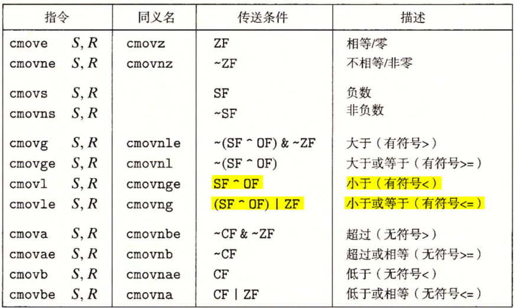

# 程序机器级表示之 x64 汇编之二

## 五、控制

机器代码提供两种基本的低级机制来实现有条件的行为：测试数据值，然后根据测试的结果来改变控制流或者数据流。

### 1.条件码

#### 1.1 条件码介绍

除了整数寄存器，CPU 还维护着一组单个位的条件码 (condition code) 寄存器，它们描述了最近的算术或逻辑操作的属性。可以检测这些寄存器来执行条件分支指令：

- CF：进位标志。最近的操作使最高位产生了进位。可用来检查无符号操作的溢出。
- ZF：零标志。最近的操作得出的结果为 0。
- SF：符号标志。最近的操作得到的结果为负数。
- OF：溢出标志。最近的操作导致一个补码溢出——正溢出或负溢出。

比如说，假设我们用一条 add 指令完成等价于 C 表达式 t=a+b 的功能，这里变量 a、b 和 t 都是整型的。然后，根据下面的 C 表达式来设置条件码：

- CF：**`(unsigned) t <(unsigned) a`** 无符号溢出，这里举个例子，比如 b 为 99，a 为 45，那么 a+b 溢出后的结果为 44，小于 a 原始的值。再比如 b 为 60，a 为 45，那么 a+b 溢出后的结果为 5，也小于 a 原始的值。
- ZF：（t == 0）零
- SF：（t < 0） 负数，SF 用于指示算术或逻辑运算结果的符号。当运算结果为负数时，SF 被置为 1；当结果为非负数（即正数或零）时，SF 被置为 0。 SF 的值通常与运算结果的最高有效位（最高位）相同。
- OF：**`(a<0 == b<0) && (t<0 != a<0)`** 有符号数溢出，即异号数相加，必然不溢出，同号有符号数相加，若结果与它们符号不同，则必定溢出。

leaq 指令不改变任何条件码，因为它是用来进行地址计算的。除此之外，程序机器级表示之 x64 位汇编之一中表 4.1 列出的所有指令都会设置条件码。对于逻辑操作，例如 XOR，进位标志和溢出标志会设置成 0。对于移位操作，SAL 和 SHL 指令左侧最后一个被移出的位会进入 CF 标志位，而溢出标志 OF 设置为 0。

<div align="center">
    <div align="center" style="color: red; font-size:13px; font-weight:bold">表 5.1 比较和测试指令表</div>
    
</div>

除此之外，还有两类指令 (有 8、16、32 和 64 位形式)，它们只设置条件码而不改变任何其他寄存器; 如表 5.1 所示。**<font color="blue">CMP 指令根据两个操作数之差来设置条件码。除了只设置条件码而不更新目的寄存器之外，CMP 指令与 SUB 指令的行为是一样的</font>**。如果两个操作数相等，这些指令会将零标志设置为 1，而其他的标志可以用来确定两个操作数之间的大小关系。TEST 指令的行为与 AND 指令一样，除了它们只设置条件码而不改变目的寄存器的值。TEST 一个典型的用法就是使用 **`TEST %rax, %rax`** 指令来检查 %rax 是正数、负数还是零。

#### 1.2 OF 标志位介绍

**（1）加法判断**

异号数相加，必然不溢出，OF=0，十进制：两有符号数相加，结果溢出，则 OF=1，否则 OF=0。**<font color="red">二进制：同号有符号数相加，若结果与它们符号不同，则 OF=1，否则 OF=0</font>**。

**（2）减法判断**

同号数相减，必不溢出。十进制：若两有符号数相减，结果溢出，则 OF=1，否则 OF=0。**<font color="red">二进制：异号有符号数相减，结果与被减数符号不同，则 OF=1，否则 OF=0</font>**。

#### 1.3 CF 标志位介绍

**（1）加法判断**

十进制：两无符号数相加，结果溢出，则 CF=1，否则 CF=0。**<font color="red">二进制：无符号数的最高位进位为 1 时，CF=1，否则 CF=0</font>**。

**（2）减法判断**

十进制：两无符号数相减，结果溢出，则 CF=1，否则 CF=0。简化判断：被减数小于减数字，如 6-9，溢出。**<font color="red">二进制：两无符号数字相减，最高位发生借位，则 CF=1，否则 CF=0</font>**。

总的来说，OF（Overflow Flag，溢出标志位）表示有符号数之间加减运算的溢出标志，CF（Carry Flag，进位/借位标志位）表示无符号数之间加减运算的溢出标志。整数的加减运算没有本质上的不同，都是二进制数字间进行加减运算，二进制数的加减运算会导致 OF 和 CF 变化。**虽然说 OF 是与有符号数有关，但无符号数进行运算时，OF 也会被改变，但此时 OF 无意义。同理，有符号数运算时，CF 也会相应发生变化，我们也不关心 CF 的变化**。

### 2.跳转指令

条件码通常不会直接读取，常用的使用方法有三种: 

1. 可以根据条件码的某种组合，将一个字节设置为 0 或者 1，表 5.3 中的 SET 指令根据条件码的某种组合，将一个字节设置为 0 或者 1；
2. 可以条件跳转到程序的某个其他的部分；
3. 可以有条件地传送数据；

正常执行的情况下，指令按照它们出现的顺序一条一条地执行。跳转 (jump) 指令会导致执行切换到程序中一个全新的位置。在汇编代码中，这些跳转的目的地通常用一个标号（label）指明。在产生目标代码文件时，汇编器会确定所有带标号指令的地址，并将跳转目标 (目的指令的地址) 编码为跳转指令的一部分。

jmp 指令是无条件跳转。它可以是直接跳转，即跳转目标是作为指令的一部分编码的；也可以是间接跳转，即跳转目标是从寄存器或内存位置中读出的。汇编语言中，直接跳转是给出一个标号作为跳转目标的。**<font color="red">间接跳转的写法是 '*' 后面跟一个操作数指示符，使用内存操作数格式中的一种（比如 $Imm(r_{b}, r_{i}, s)$）</font>**。举个例子：

```armasm{.line-numbers}
;用寄存器 %rax 中的值作为跳转目标
jmp *%rax
;用寄存器 %rax 中的值作为读地址，从内存中读取跳转目标
jmp *(%rax)
```

<div align="center">
    <div align="center" style="color: red; font-size:13px; font-weight:bold">表 5.2 JMP 跳转指令表</div>
    
</div>

假设有 %rdi 寄存器中保存值 a，%rsi 寄存器中保存值 b，现在执行 **`cmp %rsi, %rdi`** 指令。

如前所示，如果两无符号数字相减，最高位发生借位则 CF=1。因此如果两个无符号数 a < b，那么使用 **`cmp %rsi, %rdi`** 指令的后果就是最高位产生借位，CF=1，此时 **`jb`** 指令就会执行跳转操作。相反，如果两个无符号数 a >= b，那么使用 **`cmp %rsi, %rdi`** 指令肯定不会产生借位，CF=0，此时 **`jae`** 指令会执行跳转。

SF^OF 为真的话，表示有符号数的小于关系。这是因为如果 SF^OF 为真，SF=1 且 OF=0，比如 -7-2、7-9、-6-(-1) 都是最终计算结果为负数，但是没有溢出，此时肯定是 a < b；或者 SF=0 且 OF=1，而因为同号数相减，必不溢出，而异号有符号数相减，结果与被减数符号不同则说明溢出。**<font color="red">这种情况只可能是负数-正数（如果正数-负数，则溢出的结果肯定为负数，SF=1），溢出后最后计算结果为正数，因此 SF=0，但是 OF=1，因此还是 a < b</font>**。故 SF^OF 为真的话，此时 **`jl`** 指令就会跳转执行。

表 5.2 中所示的其他跳转指令都是有条件的——它们根据条件码的某种组合，或者跳转，或者继续执行代码序列中下一条指令。

在汇编代码中，跳转目标用符号标号书写。汇编器，以及后来的链接器，会产生跳转目标的适当编码。跳转指令有几种不同的编码，但是最常用都是 PC 相对的 (PC-relative)。**<font color="red">也就是它们会将目标指令的地址与紧跟在跳转指令后面那条指令的地址之间的差作为编码</font>**。这些地址偏移量可以编码为 1、2 或 4 个字节。**第二种编码方法是给出 "绝对" 地址，用 4 个字节直接指定目标。汇编器和链接器会选择适当的跳转目的编码**。

```armasm{.line-numbers}
    movq    %rdi,  %rax
    jmp     .L2
.L3:
    sarq    %rax
.L2:
    testq   %rax, %rax
    jg      .L3
    rep;ret
```

汇编器产生的 ".o" 格式的反汇编版本如下：

```armasm{.line-numbers}
0:  48 89 f8        mov   %rdi, %rax
3:  eb 03           jmp   8<loop+0x8>       
5:  48 d1 f8        sar   %rax          ;L3
8:  48 85 c0        test  %rax, %rax    ;L2
b:  7f f8           jg    5<loop+0x5>
d:  f3 c3           repz retq
```

右边反汇编器产生的注释中，**`jmp .L2`** 指令中跳转指令的跳转目标（L2）指明为 0x8，但是后面的指令 **`sarq %rax`** 的起始地址为 0x05，因此这两者之差 0x03 应该作为 jmp 指令的编码。类似地第二个跳转指令 **`jg .L3`** 中跳转目标（L3）指明为 0x05，该指令后面指令的起始地址为 0x0d，因此两者之差等于 0xF8 作为 jmp 指令的编码。

>这些例子说明，**当执行 PC 相对寻址时，程序计数器的值是跳转指令后面的那条指令的地址，而不是跳转指令本身的地址**。这种惯例可以追溯到早期的实现，当时的处理器会将更新程序计数器作为执行一条指令的第一步。

下面是链接后的程序反汇编版本：

```armasm{.line-numbers}
4004d0:  48 89 f8        mov   %rdi, %rax
4004d3:  eb 03           jmp   4004d8<loop+0x8>       
4004d5:  48 d1 f8        sar   %rax          ;L3
4004d8:  48 85 c0        test  %rax, %rax    ;L2
4004db:  7f f8           jg    4004d5<loop+0x5>
4004dd:  f3 c3           repz retq 
```

这些指令被重定位到不同的地址，但是第 2 行和第 5 行中跳转目标的编码并没有变。**通过使用与 PC 相对的跳转目标编码，指令编码很简洁 (只需要 2 个字节)，而且目标代码可以不做改变就移到内存中不同的位置**。

### 3.访问条件码

表 5.2 中的一整类指令是 SET 指令，这些指令的后缀表示不同的条件而不是操作数大小。一条 SET 指令的目的操作数是低位单字节寄存器，或是一个字节的内存位置，指令会将这个字节设置成 0 或者 1。

<div align="center">
    <div align="center" style="color: red; font-size:13px; font-weight:bold">表 5.3 SET 指令表</div>
    
</div>

>同 C 语言不同，机器代码不会将每个程序值都和一个数据类型联系起来。**相反，大多数情况下，机器代码对于有符号和无符号两种情况都使用一样的指令，这是因为许多算术运算对无符号和补码算术都有一样的位级行为**。有些情况需要用不同的指令来处理有符号和无符号操作，例如使用不同版本的右移、除法和乘法指令，以及不同的条件码组合。

### 4.用条件控制来实现条件分支

将条件表达式语句从 C 语言翻译成机器代码，最常用的方式就是结合有条件和无条件跳转。下面是计算两数绝对值之差的 C 函数：

```c{.line-numbers}
long lt_cnt = 0;
long ge_cnt = 0;

long absdiff_se(long x, long y) {
	long result;
	if (x < y) {
	    lt_cnt++;
	    result = y -x;
	} else {
	    ge_cnt++;
	    result = x - y;
	}
	return result;
}
```

下面是上述 C 代码经过 gcc 编译产生的汇编代码，使用 **`cmp %rsi, %rdi`** 和 **`jge  .L2`** 指令来实现控制转移。

```armasm{.line-numbers}
 absdiff_se:
.LFB0:
    cmpq	%rsi, %rdi
    jge	.L2
    addq	$1, lt_cnt(%rip)
    movq	%rsi, %rax
    subq	%rdi, %rax
    ret
.L2:
    addq	$1, ge_cnt(%rip)
    movq	%rdi, %rax
    subq	%rsi, %rax
    ret
```

C 语言中的 if-else 语句的通用形式模版如下：

```c{.line-numbers}
if (test-expr)
    then-statement
else
    else-statement
```

这里 test-expr 是一个整数表达式，它的取值为 0（解释为"假"）或者为非 0 (解释为"真")。两个分支语句中 (thenstatement 或 else-statement) 只会执行一个。对于这种通用形式，汇编实现通常会使用下面这种形式，这里我们用 C 语法来描述控制流：

```c{.line-numbers}
    t = test-expr
    if (!t)
        goto false;
    then-statemnet  
    goto done;
false:
    else-statement
done:
```

也就是汇编器为 then-statement 和 else-statement 产生各自的代码块。它会插入条件和无条件分支，以保证能执行正确的代码块。

### 5.用条件传送来实现条件分支

实现条件操作的传统方法是通过使用控制的条件转移。当条件满足时，程序沿着一条执行路径执行，而当条件不满足时，就走另一条路径。这种机制简单而通用，但是在现代处理器上，它可能会非常低效。

一种替代的策略是使用数据的条件转移。**<font color="red">这种方法计算一个条件操作的两种结果，然后再根据条件是否满足从中选取一个</font>**。如果可行，就可以用一条简单的条件传送指令来实现它，条件传送指令更符合现代处理器的性能特性。

下面同样是一个计算两数之差的绝对值的 C 语言函数，

```c{.line-numbers}
long absdiff(long x, long y) {
    long result;
    if (x < y)
        result = y -x;
    else
        result = x - y;
    return result;
}
```

使用 **`gcc test.c -O1 -S`** 编译上述程序得到的汇编代码如下所示，此汇编代码既计算了 y-x 的大小，保存在 %rdx 寄存器中，也计算了 x-y 的大小，保存在 %rax 寄存器中。最后使用 **`cmpq    %rsi, %rdi`** 和 **`cmovl  %rdx, %rax`** 指令，当 x < y 时，就把 %rdx（y-x）赋值给 %rax；当 x >= y 时。就直接返回 %rax（x-y）。

```armasm{.line-numbers}
;x in %rdi, y in %rsi
absdiff:
.LFB0:
.cfi_startproc
    endbr64
    movq    %rsi, %rdx
    subq    %rdi, %rdx  ;%rdx=y-x
    movq    %rdi, %rax
    subq    %rsi, %rax  ;%rax=x-y
    cmpq    %rsi, %rdi  ;如果 x < y
    cmovl   %rdx, %rax
    ret
```

处理器通过使用流水线 (pipelining) 来获得高性能，在流水线中，一条指令的处理要经过一系列的阶段，每个阶段执行所需操作的一小部分 (例如，从内存取指令、确定指令类型、从内存读数据、执行算术运算、向内存写数据，以及更新程序计数器)。

这种方法通过重叠连续指令的步骤来获得高性能，例如在取一条指令的同时，执行它前面一条指令的算术运算。**要做到这一点，要求能够事先确定要执行的指令序列，这样才能保持流水线中充满了待执行的指令**。当机器遇到条件跳转 (也称为"分支") 时，只有当分支条件求值完成之后，才能决定分支往哪边走。

处理器采用非常精密的分支预测逻辑来猜测每条跳转指令是否会执行。只要它的猜测还比较可靠 (现代微处理器设计试图达到 90% 以上的成功率)，指令流水线中就会充满着指令。另一方面，错误预测一个跳转，要求处理器丢掉它为该跳转指令后所有指令已做的工作，然后再开始用从正确位置处起始的指令去填充流水线。正如我们会看到的，这样一个错误预测会招致很严重的惩罚，浪费大约 15~30 个时钟周期，导致程序性能严重下降。

假设预测错误的概率是 $p$，如果没有预测错误，执行代码的时间是 $\scriptsize{T_{OK}}$，而预测错误的处罚是 $\scriptsize{T_{MP}}$。那么作为 $p$ 的一个函数，执行代码的平均时间是 $\scriptsize{T_{avg}(p)=(1-p)T_{OK}+p(T_{OK}+T_{MP})=T_{OK}+pT_{MP}}$。如果已知 $\scriptsize{T_{OK}}$ 和 $\scriptsize{T_{ran}}$（当 $p=0.5$ 时的平均时间），要确定 $\scriptsize{T_{MP}}$。将参数代入等式，我们有 $\scriptsize{T_{ran}=T_{avg}(0.5)=T_{OK}+0.5T_{MP}}$。因此对于 $\scriptsize{T_{OK}=8}$ 和 $\scriptsize{T_{ran}=17.5}$，我们有 $\scriptsize{T_{MP}=19}$。

另一方面，无论测试的数据是什么，编译出来使用条件传送的代码所需的时间都是大约 8 个时钟周期。控制流不依赖于数据，这使得处理器更容易保持流水线是满的。

<div align="center">
    <div align="center" style="color: red; font-size:13px; font-weight:bold">表 5.4 条件传送指令表</div>
    
</div>

上表中列出了 x86-64 中的条件传送指令，每条指令有 2 个操作数：源寄存器或者内存地址 S，和目的寄存器 R。这些指令的结果取决于条件码的值。**<font color="red">源值可以从内存或者源寄存器中读取，但是只有在指定的条件满足时，才会被复制到目的寄存器中</font>**。

源和目的的值可以是 16 位、32 位或 64 位长。**不支持单字节的条件传送**，无条件指令的操作数的长度显式地编码在指令名中 (例如 movw 和 movl)，汇编器可以从目标寄存器的名字推断出条件传送指令的操作数长度，所以对所有的操作数长度，都可以使用同一个指令的名字。

**<font color="red">同条件跳转不同，处理器无需预测测试的结果就可以执行条件传送</font>**。处理器只是读源值 (可能是从内存中)，检查条件码，然后要么更新目的寄存器，要么保持不变。

考虑下面的条件表达式和赋值的形式：

```armasm{.line-numbers}
v = test-expr ? then-expr : else-expr;
```

用条件控制转移标准方法来编译这个表达式会得到如下形式：

```c{.line-numbers}
    if (!test-expr)
        goto false;
    v = then-expr;
    goto done;
false:
    v = else-expr;
done:
```

这段代码包含两个代码序列：一个对 then-expr 求值，另一个对 else-expr 求值。条件跳转和无条件跳转结合起来使用是为了保证只有一个序列执行。

**基于条件传送的代码，会对 then-expr 和 else-expr 都求值**，最终值的选择基于对 test-expr 的求值。可以用下面的抽象代码描述：

```c{.line-numbers}
v = then-expr;
ve = else-expr;
t = test-expr;
if (!t)
    v = ve;
```

