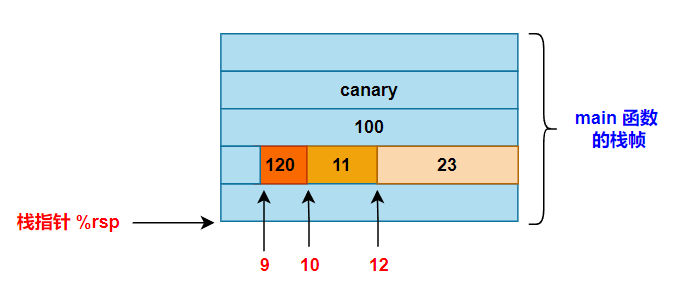
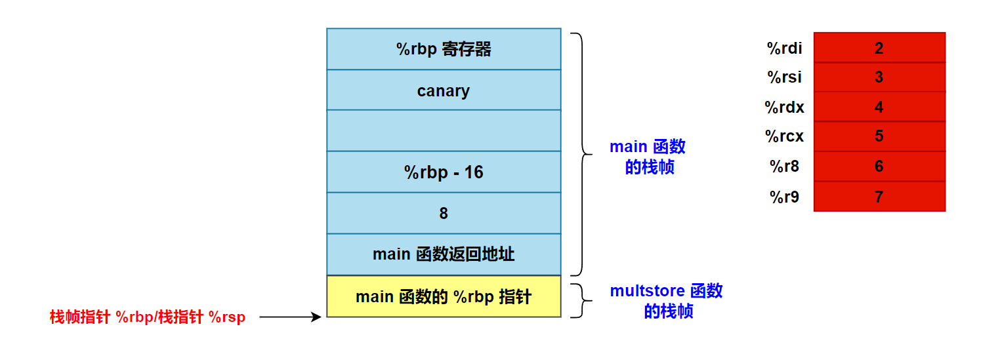

# 程序的机器级表示之函数调用

### 1.调用约定

A calling convention governs how functions on a particular architecture and operating system interact. This includes rules about includes **<font color="red">how function arguments are placed, where return values go, what registers functions may use, how they may allocate local variables<</font>**, and so forth. Calling conventions ensure that functions compiled by different compilers can interoperate, and they ensure that operating systems can run code from different programming languages and compilers. Some aspects of a calling convention are derived from the instruction set itself, but some are conventional, meaning decided upon by people (for instance, at a convention).

Calling conventions constrain both callers and callees. A caller is a function that calls another function; a callee is a function that was called. **<font color="red">The currently-executing function is a callee, but not a caller</font>**.

根据不同的计算机架构和操作系统，产生了不同的调用规定，常见的调用规定如下：

- cdecl (C declaration)：是 32 位平台常见的一种约定，GCC、Clang、Visual Studio 的 C 编译器都默认使用这种调用约定。
- stdcall：它是用于 32 位 Windows 上的一种调用约定。
- Microsoft x64：微软提出的基于 x86_64 架构的 Windows 系统上的一种调用约定。
- System V AMD64：是基于 x86_64 架构 Linux 系统上广泛使用的一种调用约定。

For concreteness, we learn the **x86-64 calling conventions** for Linux. These conventions are shared by many OSes, including MacOS (but not Windows), and are officially called the "System V AMD64 ABI."

假设函数 P 调用函数 Q，并且 Q 执行完后返回到 P 为例，System V AMD64 ABI 具体约定如下内容：

- 传递控制。在进入过程 Q 的时候，程序计数器必须被设置为 Q 的代码的起始地址，然后在返回时，要把程序计数器设置为 P 中调用 Q 后面那条指令的地址。
- 传递数据。P 必须能够向 Q 提供一个或多个参数，Q 必须能够向 P 返回一个值。
- 分配和释放内存。在开始时，Q 可能需要为局部变量分配空间，而在返回前，又必须释放这些存储空间。

### 2.参数传递

#### 2.1 参数传递介绍

One set of calling convention rules governs how function arguments and return values are passed. **<font color="red">On x86-64 Linux, the first six function arguments（整形参数或者指针）are passed in registers %rdi, %rsi, %rdx, %rcx, %r8, and %r9, respectively. The seventh and subsequent arguments are passed on the stack, about which more below，在传递超过 6 个参数时，剩余函数参数从右向左依次压入栈中，如下所示，函数参数中最靠右第 n 个参数最新被压入栈中，而第 7 个参数最后被压入栈中</font>**. %rax 用来保存函数的第一个返回值，%rbx 用来保存函数第二个返回值。gcc 会根据参数在参数列表中的顺序为它们分配寄存器。可以通过 64 位寄存器适当的部分访问小于 64 位的参数。例如如果第一个参数是 32 位的，那么可以用 %edi 来访问它。

The full rules of passing function arguments are more complex than this. You can read them in the AMD64 ABI, section 3.2.3, but they’re quite detailed. Some highlights:

- A structure argument that fits in a single machine word (64 bits/8 bytes) is passed in a single register.例如 **`struct small { char s1, s2; }`**；
- A structure that fits in two to four machine words (16–32 bytes) is passed **in sequential registers**, as if it were multiple arguments. 例如：**`struct medium { long a1, a2; }`**；
- A structure that’s larger than four machine words is always passed on the stack. 例如 **`struct large { long a, b, c, d, e, f, g; }`**；
- Floating point arguments are generally passed in special registers, the “SSE registers,” that we don’t discuss further.
- If the return value takes more than eight bytes, then the caller reserves space for the return value, and passes the address of that space as the first argument of the function. The callee will fill in that space when it returns.

<div align="center">
    <div align="center" style="color: blue; font-size:13px; font-weight:bold">函数栈帧布局示意图</div>
    
</div>

函数栈帧布局示意图如上所示，函数栈帧从高地址往低地址方向增长，System V ABI 使用两个寄存器访问函数栈帧：帧指针 %rbp 和栈指针 %rsp。 帧指针 %rbp 指向当前函数栈帧基址(栈底)，栈指针 %rsp 指向当前函数栈帧栈顶。将栈指针减小一个适当的量可以为没有指定初始值的数据在栈上分配空间，类似地可以通过增加栈指针来释放空间。一般说来，帧指针 %rbp 用来存取函数栈帧上的数据，例如传递进来的函数参数，或者函数的本地局部变量。**System V ABI 要求要求函数栈帧 16 字节对齐，这要求函数栈帧的大小应该是 16 的倍数**。

为了提高空间和时间效率，x86-64 过程只分配自己所需要的栈帧部分。例如，许多过程有 6 个或者更少的参数，那么所有的参数都可以通过寄存器传递。因此，上图中画出的某些栈帧部分可以省略。实际上，许多函数甚至根本不需要栈帧。**<font color="red">当所有的局部变量都可以保存在寄存器中，而且该函数不会调用任何其他函数 (有时称之为叶子过程，此时把过程调用看做树结构) 时，就可以这样处理</font>**。比如下面这个简单函数：

```c{.line-numbers}
// gcc test1.c -Og -S
long test2(long a, long b, long c)	/* 叶子函数 */
{
	return a*b + c;
}

int main(int argc, char const *argv[])
{
	return test2(1, 2, 3);
}
```

上面的函数代码经过汇编之后的代码如下所示，可以看出，main 函数与 test2 函数中所有的局部变量都可以保存在寄存器中，所以 main 和 test 函数都没有栈帧结构。

```armasm{.line-numbers}
test2:
.LFB0:
	.cfi_startproc
	endbr64
	imulq	%rsi, %rdi
	leaq	(%rdi,%rdx), %rax
	ret
main:
.LFB1:
	.cfi_startproc
	endbr64
	movl	$3, %edx
	movl	$2, %esi
	movl	$1, %edi
	call	test2
	ret
```

#### 2.2 示例

有如下代码：

```c{.line-numbers}
// gcc procprob.c -Og -S
// 在 UBUNTU 上使用 GCC 编译器 -Og 命令编译得到的汇编代码中无 push %rbp 这一条语句。但是在使用 -O0 命令编译得到的汇编代码中，就有 push %rbp 这一条语句。
void proc(long a1, long* a1p,
		  int a2,  int*  a2p,
		  short a3,short*a3p,
		  char  a4,char* a4p) {
		  *a1p += a1;
		  *a2p += a2;
		  *a3p += a3;
		  *a4p += a4;
}

int main() {
	long a1 = 100;
	int a2 = 23;
	short a3 = 11;
	char a4 = 'x';
	
	proc(a1,&a1,a2,&a2,a3,&a3,a4,&a4);
}
```

使用 **`gcc procprob.c -Og -S`** 编译之后的汇编代码如下所示：

```armasm{.line-numbers}
proc:
.LFB0:
	endbr64
	movq	16(%rsp), %rax
	addq	%rdi, (%rsi)
	addl	%edx, (%rcx)
	addw	%r8w, (%r9)
	movl	8(%rsp), %edx
	addb	%dl, (%rax)
	ret
main:
.LFB1:
	endbr64
	subq	$40, %rsp
	movq	%fs:40, %rax
	movq	%rax, 24(%rsp)
	xorl	%eax, %eax
	movq	$100, 16(%rsp)
	movl	$23, 12(%rsp)
	movw	$11, 10(%rsp)
	movb	$120, 9(%rsp)
	leaq	12(%rsp), %rcx
	leaq	16(%rsp), %rsi
	leaq	9(%rsp), %rax
	pushq	%rax
	pushq	$120
	leaq	26(%rsp), %r9
	movl	$11, %r8d
	movl	$23, %edx
	movl	$100, %edi
	call	proc
	addq	$16, %rsp
	movq	24(%rsp), %rax
	subq	%fs:40, %rax
	jne	.L5
	movl	$0, %eax
	addq	$40, %rsp
	ret
.L5:
	.cfi_restore_state
	call	__stack_chk_fail@PLT
```

在 main 函数中，首先将 %rsp 的值减去 40，在 main 函数栈帧中划分空间保存局部变量，并且从 %fs:40 中读取 canary 保存到栈帧中。接着在 18-21 行将 main 函数的 4 个局部变量（a1、a2、a3、a4）依次保存到栈帧中，如下所示。

<div align="center">
	
</div>

后续在第 22-30 行将函数 proc 的前 6 个参数保存到 **`%rdi, %rsi, %rdx, %rcx, %r8, %r9`** 这 6 个寄存器中，同时将第 7 个（a4）和第 8 个参数（&a4）压入栈中，做好调用 proc 函数的准备。接着执行 **`call proc`** 指令，将 main 函数的返回地址也压入栈中。此时 main 函数的栈帧示意图如下所示：

<div align="center">
	
</div>

接着控制转入 proc 函数执行，因为 proc 函数比较简单，所以 proc 函数没有栈帧。在这段代码中，我们可以看到根据操作数的大小，使用了 ADD 指令的不同版本：a1(long) 使用 addq，a2(int) 使用 addl，a3(short) 使用 addw，而 a4(char) 使用 addb。

### 3.栈

#### 3.1 栈介绍

The stack is named after a data structure, which was sort of named after pancakes. Stack data structures support at least three operations: push adds a new element to the "top" of the stack; pop removes the top element, showing whatever was underneath; and top accesses the top element. Note what’s missing: the data structure does not allow access to elements other than the top. (Which is sort of how stacks of pancakes work.) This restriction can speed up stack implementations.

Like a stack data structure, the stack memory segment is only accessed from the top. The currently running function accesses its local variables; the function’s caller, grand-caller, great-grand-caller, and so forth are dormant until the currently running function returns.

栈一般从高地址往低地址生长，每个函数都在栈空间中对应一个栈帧。关于栈帧有两个重要的指针——栈基址指针 %rbp 和栈顶指针 %rsp。其中，除了在函数的开头（prologue）和结尾（epilogue），**%rbp 指针一般是固定不变的，通常以它为基准来寻址参数和局部变量**，例如将第一个参数放入栈中的汇编代码可以是 **`movq %rdi, -8(%rbp)`**。

This is built in to the architecture by the operation of instructions like pushq, popq, call, and ret. A push instruction pushes a value onto the stack. This both modifies the stack pointer (making it smaller) and modifies the stack segment (by moving data there). For instance, the instruction pushq X means:

```armasm{.line-numbers}
subq $8, %rsp
movq X, (%rsp)
```

And popq X undoes the effect of pushq X. It means:

```armasm{.line-numbers}
movq (%rsp), X
addq $8, %rsp
```

X can be a register or a memory reference.

**<font color="red">The portion of the stack reserved for a function is called that function’s stack frame</font>**. Stack frames are aligned: **<font color="red">x86-64 requires that each stack frame be a multiple of 16 bytes, and when a callq instruction begins execution, the %rsp register must be 16-byte aligned.</font>** This means that every function’s entry %rsp address will be 8 bytes off a multiple of 16. 下面详细解释一下。

**System V AMD64 调用约定要求栈必须按 16 字节对齐，也就是说，在调用 call 指令之前(the end of the input argument area)，%rsp 指针必须是 16 的倍数**（对应 16 进制是最后 1 位是 0）。按 16 字节对齐的原因是，现代 x86_64 计算机引入了 SSE 和 AVX 指令，这些指令支持 SIMD，能极大提升处理速度。但是这些指令要求必须从 16 字节的整数倍的地址处取数据，为了顾及这些指令，才有了上述对齐要求。

上面这段文档第二句为什么又说是 %rsp + 8 必须是 16 的倍数呢？实际上，它说的 %rsp 是执行完 call 指令之后的 %rsp，执行 call 指令会导致栈中压入一个 8 个字节的返回地址。原来 %rsp 是按 16 字节对齐的，压入 8 字节地址后，显然是 %rsp + 8 才是 16 的倍数。此外，在该调用约定下，函数的起始地址始终是按 8 字节对齐的（misaligned by 8 bytes），即起始地址是 8 的倍数。

在有些时候，局部数据必须存储在内存中，而不能使用寄存器，常见的情况包括：

- 寄存器不足够存放所有的本地数据；
- 对某一个局部变量使用地址运算符 '&'，因此必须能够为它产生一个地址；
- 某些局部变量是数组或结构，因此必须能够通过数组或结构引用被访问到；

**<font color="red">一般来说过程通过减小栈指针在栈上分配空间</font>**。分配的结果作为栈帧的一部分，标号为"局部变量"。

#### 3.2 CALL 指令

在汇编语言中，我们可以使用 call 命令来调用一个函数，例如：

```armasm{.line-numbers}
call add
```

其中，add 是一个标签，它表示 add 函数的起始地址（即 add 函数第一条指令的地址）。上面的指令会调用 add 函数，具体来说该指令完成了以下两步操作：

- 将当前指令寄存器的内容压入栈中，**<font color="red">指令寄存器中存放 **`call add`** 后的下一条指令的地址，也就是返回地址</font>**；
- 跳转到 add 函数对应的地址开始执行；

所以说，**`call add`** 就相当于：

```armasm{.line-numbers}
push %rip
jmp add
```

call 指令有一个目标，即指明被调用过程起始的指令地址。同跳转一样，调用可以是直接的，也可以是间接的。在汇编代码中，直接调用的目标是一个标号，而间接调用的目标是 * 后面跟一个操作数指示符，**`call *<操作数>`**，**`<操作数>`** 可以是一个寄存器或内存地址。比如 **`call *%eax`** 指令中目标函数的地址存储在 %eax 寄存器中；**`call *(%ebx)`** 指令中目标函数的地址存储在 %ebx 指向的内存位置中。

#### 3.3 RET 指令

该指令负责从一个函数返回，完成的功能如下：

- 弹出当前栈顶的地址到指令寄存器，**这个地址就是之前 call 指令压入的返回地址**；
- 然后跳转到上述返回地址执行；

>这些指令在程序 OBJDUMP 产生的反汇编输出中被称为 callq 和 retq。添加的后缀 q 只是为了强调这些是 x86-64 版本的调用和返回，而不是 IA32 的。在 x86-64 汇编代码中，这两种版本可以互换。

### 4.返回地址以及 entry、exit 序列

The steps required to call a function are sometimes called the entry sequence and the steps required to return are called the exit sequence. Both caller and callee have responsibilities in each sequence. 以下假设调用函数为 P，被调用函数为 Q.

P 为了调用 Q, 需要执行如下任务进行准备：

- 调用函数 P 将传递给被调用函数 Q 的前 6 个参数保存到相应的寄存器中（%rdi, %rsi, %rdx, %rcx, %r8, and %r9）
- If the callee takes more than six arguments, or if some of its arguments are large, the caller must store the surplus arguments on its stack frame. **<font color="blue">It stores these in increasing order, so that the 7th argument has a smaller address than the 8th argument, and so forth</font>**. The 7th argument must be stored at (%rsp) (that is, the top of the stack) when the caller executes its callq instruction.
- The caller saves any caller-saved registers.
- The caller executes **`callq FUNCTION`**. This has an effect like **`pushq $NEXT_INSTRUCTION_ADDR; jmp FUNCTION`** (or, equivalently, **`subq $8, %rsp; movq $NEXT_INSTRUCTION, (%rsp); jmp FUNCTION`**), where **`NEXT_INSTRUCTION`** is the address of the instruction immediately following callq.

被调用函数 Q 执行如下 enter 序列：

- 被调用函数 Q 执行 **`pushq  %rbp; movq  %rsp, %rbp;`** 序列，使得栈帧指针 %rbp 指向当前正在执行的函数 Q 的栈帧；
- 将 callee-saved 寄存器压入栈中保存，函数 Q 返回之前会从栈中弹出恢复；
- **<font color="red">执行 **`sub %rsp, N`**，为函数 Q 的参数与局部变量划分空间</font>**；

被调用函数 Q 执行如下 exit 序列：

- The callee places its return value in %rax.
- **<font color="red">被调用函数 Q 执行 leave 指令，等价于 **`movq %rbp, %rsp; popq %rbp;`** 指令，使得 %rbp 指向上一个函数（即调用函数 P）的栈帧基地址</font>**. 其实严格来说，这里需要分 2 种情况讨论，被调用函数 Q 为叶子函数/不为叶子函数。
- 被调用函数 Q 执行 retq 指令，将返回地址弹出到 %rip 寄存器，使得程序转回到调用函数 P 执行。
- The caller then cleans up any space it prepared for arguments and restores caller-saved registers if necessary.

Particularly simple callees don’t need to do much more than return, but most callees will perform more tasks, such as allocating space for local variables and calling functions themselves.

当被调用函数 Q 执行 exit 序列时，需要执行 leave 指令恢复 %rsp 与 %rbp 指令，此时分两种情况，callee 是调用链中的最后一个函数 以及 callee 不是调用链中的最后一个函数。

**(1) 如果 Q 是调用链中的最后一个函数**

如果 Q 是调用链中的最后一个函数 (叶子函数，也就是它没再调用其他函数了)，那么 Q 不会也没必要修改 %rsp 指针，此时 Q 可以使用 Red Zone 来保存函数调用中的局部变量，%rsp 指针的值不会发生变化。正因为 Q 没修改 %rsp 指针，所以其恢复 %rbp，%rsp 的代码如下：

```armasm{.line-numbers}
popq %rbp
ret
```

**因为 Q 没修改 %rsp 指针，所以 %rsp 和 %rbp 指向同一个地址，该地址存放的是 P 的 %rbp**，所以 popq 就是将之前栈中保存的 P 的 %rbp 再次设置到 %rbp 中，并且 %rsp 减去 8 个字节。减去 8 个字节后的 %rsp 指向的地址存放的是返回地址，因此调用 ret 指令可以返回到 P 函数，并且 %rsp 再减去 8。

**（2）如果 Q 不是调用链中的最后一个函数**

如果 Q 不是调用链中的最后一个函数，那么它恢复 %rbp, %rsp 的代码如下：

```armasm{.line-numbers}
leave 
retq
```

leave 指令是步骤 1 的逆操作，它将 %rbp 的值复制到 %rsp，然后恢复 P 的 %rbp 的值到 %rbp 中，同时 %rsp 减去 8 个字节。然后，ret 指令的操作和 (1) 一样。

### 5.Caller-saved 寄存器和 Callee-saved 寄存器

寄存器是唯一被所有过程共享的资源，虽然在给定时刻只有一个是活动的，我们仍然必须确保当一个过程 (调用者) 调用另一个过程 (被调用者) 时，被调用者不会覆盖调用者稍后会使用的寄存器值。为此，x86-64 采用了一组统一的寄存器使用惯例，所有的过程 (包括程序库) 都必须遵循。

根据惯例，**<font color="blue">寄存器 %rbx、%rbp 和 %r12~%r15 被划分为被调用者保存寄存器。当过程 P 调用过程 Q 时，Q 必须保存这些寄存器的值，保证它们的值在 Q 返回到 P 时与 Q 被调用时是一样的</font>**。过程 Q 保存一个寄存器的值不变，要么就是根本不去改变它，要么就是把原始值压入栈中，改变寄存器的值，然后在返回前从栈中弹出旧值。压入寄存器的值会在栈帧中创建标号为 "保存的寄存器" 的一部分，如上图中所示。有了这条惯例，P 的代码就能安全地把值存在被调用者保存寄存器中 (当然，要先把之前的值保存到栈上)，调用 Q，然后继续使用寄存器中的值，不用担心值被破坏。

**<font color="red">所有其他的寄存器，除了栈指针 %rsp，都分类为调用者保存寄存器</font>**。这就意味着任何函数都能修改它们。可以这样来理解 "调用者保存" 这个名字: 过程 P 在某个此类寄存器中有局部数据，然后调用过程 Q。因为 Q 可以随意修改这个寄存器，所以在调用之前首先保存好这个数据是 P (调用者) 的责任。

>Callers can simply use callee-saved registers across function calls; in this sense they behave like C++ local variables. Caller-saved registers behave differently: if a caller wants to preserve the value of a caller-saved register across a function call, the caller must explicitly save it before the callq and restore it when the function resumes.

### 6.栈基指针（栈帧指针）

The %rbp register is called the base pointer (and sometimes the frame pointer). For simple functions, **an optimizing compiler generally treats this like any other callee-saved general-purpose register**. However, for more complex functions, %rbp is used in a specific pattern that facilitates debugging.

- The first instruction executed on function entry is pushq %rbp. This saves the caller’s value for %rbp into the callee’s stack. (Since %rbp is callee-saved, the callee must save it.)
- The second instruction is **`movq %rsp, %rbp`**. This saves the current stack pointer in %rbp.

>**<font color="red">This adjusted value of %rbp is the callee’s "frame pointer". The callee will not change this value until it returns</font>**. The frame pointer provides a stable reference point for local variables and caller arguments.
>**<font color="red">Note, also, that the value stored at (%rbp) is the caller’s %rbp</font>**, and the value stored at 8(%rbp) is the return address. This information can be used to trace backwards through callers’ stack frames by functions such as debuggers.

The function ends with **`movq %rbp, %rsp; popq %rbp; retq`**, or, equivalently, **`leave; retq`**. This sequence restores the caller’s %rbp and entry %rsp before returning.

### 7.Red Zone

引用 System V AMD64 ABI 标准中的一段话：

>The 128-byte area beyond the location pointed to by %rsp is considered to be reserved and shall not be modified by signal or interrupt handlers. Therefore, functions may use this area for temporary data that is not needed across function calls. In particular, leaf functions may use this area for their entire stack frame, rather than adjusting the stack pointer in the prologue and epilogue. This area is known as the red zone.

简单点说，这个红色区域（red zone）就是一个优化。因为这个区域不会被信号或者中断侵占，**函数可以在不移动栈指针的情况下使用它存取一些临时数**据——于是两个移动 rsp 的指令就被节省下来了。然而，标准只说了不会被信号和终端处理程序侵占，red zone 还是会被接下来的函数调用使用的，这也是为什么大多数情况下都是叶子函数（不会再调用别的函数）使用这种优化。下面为一个例子：

```c{.line-numbers}
/*test.c*/
// gcc test.c -O0 -S
/* 叶子函数 */
long test2(long a, long b, long c) {
	return a*b + c;
}

long test1(long a, long b)  {
	return test2(b, a, 3);
}

int main(int argc, char const *argv[])  {
	return test1(1, 2);
}
```

在使用 **`gcc test.c -O0 -S`** 命令编译之后，得到的 test1 和 test2 函数汇编代码如下所示：

```armasm{.line-numbers}
test2:
.LFB0:
	pushq	%rbp
	movq	%rsp, %rbp
	movq	%rdi, -8(%rbp)
	movq	%rsi, -16(%rbp)
	movq	%rdx, -24(%rbp)
	movq	-8(%rbp), %rax
	imulq	-16(%rbp), %rax
	movq	%rax, %rdx
	movq	-24(%rbp), %rax
	addq	%rdx, %rax
	popq	%rbp
	ret

test1:
.LFB1:
	endbr64
	pushq	%rbp
	movq	%rsp, %rbp
	subq	$16, %rsp
	movq	%rdi, -8(%rbp)
	movq	%rsi, -16(%rbp)
	movq	-8(%rbp), %rcx
	movq	-16(%rbp), %rax
	movl	$3, %edx
	movq	%rcx, %rsi
	movq	%rax, %rdi
	call	test2
	leave
	ret
```

**<font color="red">可以看到 test1 移动了栈顶指针来获取栈帧空间</font>**，即 **`sub $xxx, %rsp + leaveq`** 的组合。**<font color="red">但是 test2 并没有移动栈顶指针，因此也没有调用 leave 指令恢复 %rsp</font>**，而是直接使用 %rbp/%rsp（此时它们两个相等，由于是叶子也不用考虑内存对齐的问题）存放要使用的数据。栈帧布局如下：

<div align="center">
	
</div>

>其实很多时候，我们发现 rbp 指针并没有使用，而仅仅使用 rsp 指针就可以定位，并且 DWARF（Debugging With Attributed Record Formats）调试信息格式支持处理无基址指针的方法（CFI）。这就是一些编译器开始在高级优化中省略基址指针了，这样做可以缩减程序执行的 "预处理代码"（prologue）和 "后处理代码"（epilogue），节省出来一个通用寄存器供程序使用（在 x86 架构有限的通用寄存器资源条件下非常有用）。在 x86 gcc 下默认保留 rbp 指针，但是也提供了-fomit-frame-pointer 优化参数选项，对于是否推荐使用这个选项，争议比较大。
>**<font color="red">总之，通过使用 %rsp 索引栈帧的方法避免了传统的 %rbp 使用方法，这项技术节约掉了 "预处理代码"（prologue）和"后处理代码"（epilogue）中的两条指令，而且也空出来一个通用寄存器供给程序使用</font>**。

### 8.实例分析

```c{.line-numbers}
// gcc -O0 -S test.c
long mult2(long a, long b) {
   long s = a * b;
   return s;
}

void multstore(long x, long y, long a, long b, long c, long d, long e, long* dest) {
   long t = mult2(x, y);
   *dest = t;
   a = 1;
   b = 2;
   c = 3;
   d = a + 4;
   e = b + 5;
}

int main() {
   long d;
   multstore(2, 3, 4, 5, 6, 7, 8, &d);
   d = d + 2;
   return 0;
} 
```

main.c 的程序如上所示，经过 gcc 编译后（**`gcc -O0 -S test.c`**，得到的汇编代码（只有 main 和 mulstore 函数）如下所示。

```armasm{.line-numbers}
mult2:
.LFB0:
	endbr64
	pushq	%rbp
	movq	%rsp, %rbp
	movq	%rdi, -24(%rbp)
	movq	%rsi, -32(%rbp)
	movq	-24(%rbp), %rax
	imulq	-32(%rbp), %rax
	movq	%rax, -8(%rbp)
	movq	-8(%rbp), %rax
	popq	%rbp
	ret
```

```armasm{.line-numbers}
multstore:
.LFB1:
	endbr64
	pushq	%rbp
	movq	%rsp, %rbp
	subq	$64, %rsp
	movq	%rdi, -24(%rbp)
	movq	%rsi, -32(%rbp)
	movq	%rdx, -40(%rbp)
	movq	%rcx, -48(%rbp)
	movq	%r8, -56(%rbp)
	movq	%r9, -64(%rbp)
	movq	-32(%rbp), %rdx
	movq	-24(%rbp), %rax
	movq	%rdx, %rsi
	movq	%rax, %rdi
	call	mult2
	movq	%rax, -8(%rbp)
	movq	24(%rbp), %rax
	movq	-8(%rbp), %rdx
	movq	%rdx, (%rax)
	movq	$1, -40(%rbp)
	movq	$2, -48(%rbp)
	movq	$3, -56(%rbp)
	movq	-40(%rbp), %rax
	addq	$4, %rax
	movq	%rax, -64(%rbp)
	movq	-48(%rbp), %rax
	addq	$5, %rax
	movq	%rax, 16(%rbp)
	nop
	leave
	ret
main:
.LFB2:
	endbr64
	pushq	%rbp
	movq	%rsp, %rbp
	subq	$16, %rsp
	movq	%fs:40, %rax
	movq	%rax, -8(%rbp)
	xorl	%eax, %eax
	leaq	-16(%rbp), %rax
	pushq	%rax
	pushq	$8
	movl	$7, %r9d
	movl	$6, %r8d
	movl	$5, %ecx
	movl	$4, %edx
	movl	$3, %esi
	movl	$2, %edi
	call	multstore
	addq	$16, %rsp
	movq	-16(%rbp), %rax
	addq	$2, %rax
	movq	%rax, -16(%rbp)
	movl	$0, %eax
	movq	-8(%rbp), %rdx
	subq	%fs:40, %rdx
	je	.L6
	call	__stack_chk_fail@PLT
.L6:
	leave
	ret
```

首先分析 main 函数，在第 41~42 行，将 canary word 从 **`%fs:40`** 中读出，并且保存到当前 main 函数的栈帧中（%rbp - 8）。**<font color="red">当开启 canary 保护时，程序在运行时会在返回地址之前插入验证信息，当函数返回时会对插入的数据进行验证，看与之前是否相同，以此来判断是否产生了栈溢出</font>**。在函数基本执行完时，程序会把 **`%fs:40`** 中的 canary 值和之前放在栈上的 canary 进行比较，如果发生栈溢出覆盖到了栈中的 canary 而导致 canary 发生了改变则跳到函数 ___stack_chk_fail 直接终止程序。

stack canary 并不能检测到所有的栈溢出问题，只有在满足：攻击者不知当前插入当函数栈中 canary 的值 (无 infoleak)；攻击者只能顺序的覆盖栈中数据，无法跳过 canary 覆盖数据这两个前提条件时才能检测到栈溢出，故其并非一种理论上安全的防御方式，也只能针对顺序覆盖的栈溢出提供一定的缓解。

接下来的 3 条指令分别保存函数 multstore 的参数到寄存器中，根据 System V AMD64 调用约定，6 个以内的参数被依次保存到 **`%rdi, %rsi, %rdx, %rcx, %r8, %r9`** 这 6 个寄存器中，多余的参数保存到栈中。因此 **`multstore(2, 3, 4, 5, 6, 7, 8, &d);`** 函数调用中 2、3、4、5、6、7 这 6 个参数保存到寄存器中，8 和 &d 保存到栈中，然后再保存 **`call multstore`** 指令的下一条指令地址到栈中，接着跳转到 multstore 函数去执行。此时栈帧的示意图如下所示：

<div align="center">
	
</div>

接着进入 mulstore 函数中，执行完 **`pushq  %rbp; movq  %rsp, %rbp;`** 指令后，栈帧示意图如下所示：

<div align="center">
	
</div>

下面解释上述程序的第 6~21 行，首先执行 **`subq	$64, %rsp`** 指令，腾出空间保存 mulstore 函数的局部变量，首先第 7~12 行将保存在寄存器中的前 6 个参数保存到 mulstore 函数的栈帧中，随后将 x 和 y 的值保存到 %rdi 和 %rsi 寄存器中，然后调用 mult2 函数，将计算的结果（x*y）保存到 %rax 寄存器中，**<font color="red">并且将计算结果保存到 %rbp-8 处（注意这里的 %rbp 指的是 main 函数的 %rbp 寄存器）</font>**，即保存到 dest 指针位置。此时函数的栈帧如下所示：

<div align="center">
	
</div>

随后在 mulstore 函数汇编代码的第 22~30 行，将 mulstore 函数中的第 3~6 个参数 a,b,c,d 的新值保存到 mulstore 的栈帧中，并且将计算出来的 e 的新值保存到 main 函数的栈帧中。此时函数的栈帧如下所示：

<div align="center">
	
</div>

接着 mulstore 执行 leave 和 ret 指令，执行完成后的函数栈帧如下所示，mulstore 的函数栈帧消失，完全变回 main 函数的栈帧状态。

<div align="center">
	
</div>

接下来继续执行 main 函数的 53~59 行，其中第 53 行 main 函数回收之前分配的用于给 mulstore 函数传递参数的空间，然后将保存在 %rbp-16 的 d 变量的值加 2 并回写到 %rbp-16 地址处。最后判断保存在 %rbp-8 地址处的 canary 变量是否发生变化，如果没有就正常结束，否则说明发生了栈溢出，跳转到 __stack_chk_fail@PLT 地址处执行。

>其实从上述 mult2 函数的汇编代码中也可以看出，mul2 函数是叶子函数，不再调用其它函数，因此其汇编代码中没有 **`subq $N, %rsp`** 指令，mult2 直接使用 Red Zone 区域来存储函数局部临时变量，因此在函数退出之前，也没有 leave 指令，恢复 %rsp 寄存器的过程（%rbp 寄存器的恢复是通过 **`popq %rbp`** 指令来实现的）。

