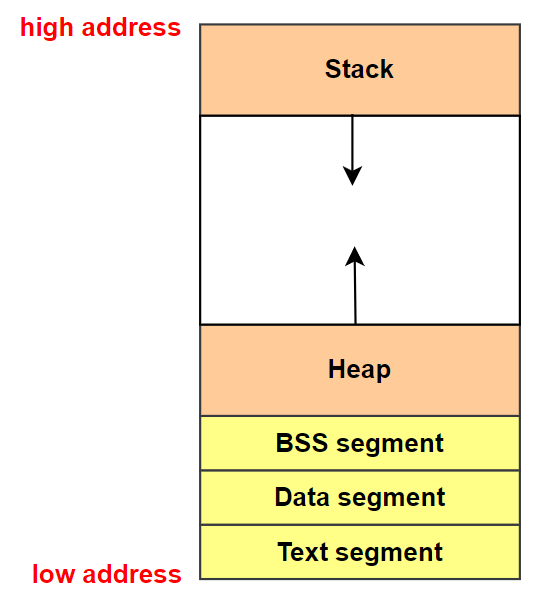

# 缓冲区溢出攻击之一

## 一、Program Memory Layout

To fully understand how buffer overflow attacks work, we need to understand how the data memory is arranged inside a process. When a program runs, it needs memory space to store data. **<font color="red">For a typical C program, its memory is divided into five segments</font>**, each with its own purpose. 下图表示一个进程内存布局的 5 个部分：

<div align="center">
    
</div>

- Text segment: stores the executable code of the program. **This block of memory is usually read-only**.
- Data segment: **stores static/global variables <font color="red">that are initialized</font> by the programmer**. For example, the variable a defined in static int a = 3 will be stored in the Data segment.
- BSS segment: **<font color="blue">stores uninitialized static/global variables</font>**. This segment will be filled with zeros by the operating system, so all the uninitialized variables are initialized with zeros. For example, the variable b defined in static int b will be stored in the BSS segment, and it is initialized with zero.
- Heap: **<font color="red">The heap is used to provide space for dynamic memory allocation</font>**. This area is managed by malloc, calloc, realloc, free, etc.
- Stack: The stack is used for storing local variables defined inside functions, as well as storing data related to function calls, such as return address, arguments, etc. We will provide more details about this segment later on.

下面给出一个示例程序，并且标注出每一个变量属于上面哪个部分：

```c{.line-numbers}
// in data segment
int x = 100;
int main() {
    int a = 2;       // in stack
    float b = 2.5;   // in stack
    static int y;    // in BSS

    // allocate memory on heap
    // ptr 指针变量保存在栈上
    int* ptr = (int*) malloc(2*sizeof(int));
    // in heap
    ptr[0] = 5;
    // in heap
    ptr[1] = 6;

    free(ptr);
    return 1;
}
```

## 二、Stack and Function Invocation

**<font color="red">Buffer overflow can happen on both stack and heap</font>**. The ways to exploit them are quite different. In this chapter, we focus on the stack-based buffer overflow. To understand how it works, we need to have an in-depth understanding of how stack works and what information is stored on the stack.

