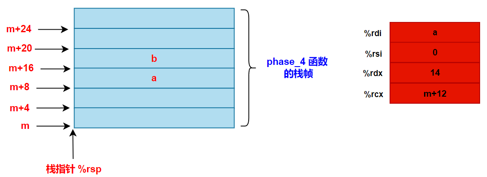

# 程序的机器级表示之 bomb lab

## 一、PHASE_1

首先使用 **`objdump -d bomb`** 反汇编 bomb 这个二进制文件，得到如下的汇编代码。

phase_1:

```armasm{.line-numbers}
0000000000400ee0 <phase_1>:
  400ee0:	48 83 ec 08          	sub    $0x8,%rsp
  400ee4:	be 00 24 40 00       	mov    $0x402400,%esi
  400ee9:	e8 4a 04 00 00       	call   401338 <strings_not_equal>
  400eee:	85 c0                	test   %eax,%eax
  400ef0:	74 05                	je     400ef7 <phase_1+0x17>
  400ef2:	e8 43 05 00 00       	call   40143a <explode_bomb>
  400ef7:	48 83 c4 08          	add    $0x8,%rsp
  400efb:	c3                   	ret 

0000000000401338 <strings_not_equal>:
  401338:	41 54                	push   %r12
  40133a:	55                   	push   %rbp
  40133b:	53                   	push   %rbx
  40133c:	48 89 fb             	mov    %rdi,%rbx
  40133f:	48 89 f5             	mov    %rsi,%rbp
  401342:	e8 d4 ff ff ff       	call   40131b <string_length>
  401347:	41 89 c4             	mov    %eax,%r12d
  40134a:	48 89 ef             	mov    %rbp,%rdi
  40134d:	e8 c9 ff ff ff       	call   40131b <string_length>
  401352:	ba 01 00 00 00       	mov    $0x1,%edx
  401357:	41 39 c4             	cmp    %eax,%r12d
  40135a:	75 3f                	jne    40139b <strings_not_equal+0x63>
  40135c:	0f b6 03             	movzbl (%rbx),%eax
  40135f:	84 c0                	test   %al,%al
  401361:	74 25                	je     401388 <strings_not_equal+0x50>
  401363:	3a 45 00             	cmp    0x0(%rbp),%al
  401366:	74 0a                	je     401372 <strings_not_equal+0x3a>
  401368:	eb 25                	jmp    40138f <strings_not_equal+0x57>
  40136a:	3a 45 00             	cmp    0x0(%rbp),%al
  40136d:	0f 1f 00             	nopl   (%rax)
  401370:	75 24                	jne    401396 <strings_not_equal+0x5e>
  401372:	48 83 c3 01          	add    $0x1,%rbx
  401376:	48 83 c5 01          	add    $0x1,%rbp
  40137a:	0f b6 03             	movzbl (%rbx),%eax
  40137d:	84 c0                	test   %al,%al
  40137f:	75 e9                	jne    40136a <strings_not_equal+0x32>
  401381:	ba 00 00 00 00       	mov    $0x0,%edx
  401386:	eb 13                	jmp    40139b <strings_not_equal+0x63>
  401388:	ba 00 00 00 00       	mov    $0x0,%edx
  40138d:	eb 0c                	jmp    40139b <strings_not_equal+0x63>
  40138f:	ba 01 00 00 00       	mov    $0x1,%edx
  401394:	eb 05                	jmp    40139b <strings_not_equal+0x63>
  401396:	ba 01 00 00 00       	mov    $0x1,%edx
  40139b:	89 d0                	mov    %edx,%eax
  40139d:	5b                   	pop    %rbx
  40139e:	5d                   	pop    %rbp
  40139f:	41 5c                	pop    %r12
  4013a1:	c3                   	ret

000000000040131b <string_length>:
  40131b:	80 3f 00             	cmpb   $0x0,(%rdi)
  40131e:	74 12                	je     401332 <string_length+0x17>
  401320:	48 89 fa             	mov    %rdi,%rdx
  401323:	48 83 c2 01          	add    $0x1,%rdx
  401327:	89 d0                	mov    %edx,%eax
  401329:	29 f8                	sub    %edi,%eax
  40132b:	80 3a 00             	cmpb   $0x0,(%rdx)
  40132e:	75 f3                	jne    401323 <string_length+0x8>
  401330:	f3 c3                	repz ret 
  401332:	b8 00 00 00 00       	mov    $0x0,%eax
  401337:	c3                   	ret  
```

根据 bomb.c 文件中的代码，首先从终端中读入一个字符串，然后再传入 phase_1() 函数中作为参数，如果 phase_1 函数执行顺利没有爆炸，那么就会继续往下执行 phase_defused 函数，炸弹解除。

```c{.line-numbers}
/* Hmm...  Six phases must be more secure than one phase! */
/* Get input                   */
input = read_line();             
/* Run the phase               */
phase_1(input);                  
/* Drat!  They figured it out! */
phase_defused();                 
```

传入 phase_1() 函数中的字符串指针参数保存在 %rdi 寄存器中，在第 3~4 行将另外一个地址 **`0x402400`** 赋值给寄存器 %esi，然后调用 strings_not_equal 函数。我们使用 gdb 调试器中 x/s 打印在 **`0x402400`** 地址处的字符串得到：

```c{.line-numbers}
(gdb) x/s 0x402400
0x402400:   "Border relations with Canada have never been better."
(gdb) 
```

在 **`strings_not_equal`** 函数中，将用户输入的字符串指针保存到 %rbx 中，将 **`0x402400`** 地址保存到 %rbp 中，接着调用 string_length 函数。string_length 函数循环计算 %rdi 所指向字符串的长度，使用 **`cmpb  $0x0, (%rdx)`** 比较字符串是否到达结尾，最后将计算的长度结果保存在 %rax 中返回。

**`strings_not_equal`** 函数首先调用 string_length 计算用户输入字符串的长度，并且保存到 %r12d 中，接下来同样调用 string_length 函数计算 **`0x402400`** 地址处的字符串长度，并将其（%rax）和 %r12d 中的用户字符串长度相比，如果不相等就返回 1（保存在 %rax 中）给 phase_1 函数。phase_1 的第 5~7 行检测如果 %eax 如果不为 0，就会执行 explode_bomb 函数，引爆炸弹。如果检测 %eax 为 0，phase_1 函数就正常返回。 

如果用户输入的字符串长度和 **`0x402400`** 地址处的字符串长度相同，**`strings_not_equal`** 函数的第 24~37 行就循环比较这两个字符串中的字符，如果有字符不相等，就将 %eax 寄存器的值设置为 1，然后返回 phase_1 函数，炸弹爆炸。如果循环遍历下来，所有的字符都相等，以至于碰到字符串的 '\0' 结尾（第 36 行指令 **`test %al,%al`**），因此就会将 %eax 赋值为 0，并返回 phase_2 函数，然后 phase_2 函数顺利结束。

**`strings_not_equal`** 函数接收两个参数，**`%rdi`** 保存用户输入字符串的指针，**`%rsi`** 保存 **`0x402400`** 地址处的特定字符串，接着判断这两个字符串的长度是否相等，如果不相等，直接在 %rax 中保存 1，并返回。如果两个字符串的长度相等，就循环比较两个字符串中的字符，如果有字符不相等，就在 %rax 中保存 1 并返回，否则在 %rax 中保存 0 并返回。

因此，根据 phase_1 函数与 strings_not_equal 函数的流程，我们只需要输入和 **`0x402400`** 地址处相同的流程，就可以解除炸弹。我们在 psol.txt 文件中输入该字符串：

<div align="center">
  
</div>

然后 bomb 程序的运行结果如下所示：

<div align="center">
  
</div>

## 二、PHASE_2

首先使用 **`objdump -d bomb`** 反汇编 bomb 这个二进制文件，得到如下的汇编代码。

```armasm{.line-numbers}
0000000000400efc <phase_2>:
  400efc:	55                   	push   %rbp
  400efd:	53                   	push   %rbx
  400efe:	48 83 ec 28          	sub    $0x28,%rsp
  400f02:	48 89 e6             	mov    %rsp,%rsi
  400f05:	e8 52 05 00 00       	call   40145c <read_six_numbers>
  400f0a:	83 3c 24 01          	cmpl   $0x1,(%rsp)
  400f0e:	74 20                	je     400f30 <phase_2+0x34>
  400f10:	e8 25 05 00 00       	call   40143a <explode_bomb>
  400f15:	eb 19                	jmp    400f30 <phase_2+0x34>
  400f17:	8b 43 fc             	mov    -0x4(%rbx),%eax
  400f1a:	01 c0                	add    %eax,%eax
  400f1c:	39 03                	cmp    %eax,(%rbx)
  400f1e:	74 05                	je     400f25 <phase_2+0x29>
  400f20:	e8 15 05 00 00       	call   40143a <explode_bomb>
  400f25:	48 83 c3 04          	add    $0x4,%rbx
  400f29:	48 39 eb             	cmp    %rbp,%rbx
  400f2c:	75 e9                	jne    400f17 <phase_2+0x1b>
  400f2e:	eb 0c                	jmp    400f3c <phase_2+0x40>
  400f30:	48 8d 5c 24 04       	lea    0x4(%rsp),%rbx
  400f35:	48 8d 6c 24 18       	lea    0x18(%rsp),%rbp
  400f3a:	eb db                	jmp    400f17 <phase_2+0x1b>
  400f3c:	48 83 c4 28          	add    $0x28,%rsp
  400f40:	5b                   	pop    %rbx
  400f41:	5d                   	pop    %rbp
  400f42:	c3                   	ret 

000000000040145c <read_six_numbers>:
  40145c:	48 83 ec 18          	sub    $0x18,%rsp
  401460:	48 89 f2             	mov    %rsi,%rdx
  401463:	48 8d 4e 04          	lea    0x4(%rsi),%rcx
  401467:	48 8d 46 14          	lea    0x14(%rsi),%rax
  40146b:	48 89 44 24 08       	mov    %rax,0x8(%rsp)
  401470:	48 8d 46 10          	lea    0x10(%rsi),%rax
  401474:	48 89 04 24          	mov    %rax,(%rsp)
  401478:	4c 8d 4e 0c          	lea    0xc(%rsi),%r9
  40147c:	4c 8d 46 08          	lea    0x8(%rsi),%r8
  401480:	be c3 25 40 00       	mov    $0x4025c3,%esi
  401485:	b8 00 00 00 00       	mov    $0x0,%eax
  40148a:	e8 61 f7 ff ff       	call   400bf0 <__isoc99_sscanf@plt>
  40148f:	83 f8 05             	cmp    $0x5,%eax
  401492:	7f 05                	jg     401499 <read_six_numbers+0x3d>
  401494:	e8 a1 ff ff ff       	call   40143a <explode_bomb>
  401499:	48 83 c4 18          	add    $0x18,%rsp
  40149d:	c3                   	ret  
```

在 phase_2 函数中，首先将 %rsp 的值减去 40，为本函数栈帧中的局部变量划分存储空间，接下来将 %rsp 的值（假设为 m）赋值给 %rsi，此 %rsi 中的值在 read_six_numbers 函数中用作 phase_2 函数的基准地址。然后调用 read_six_numbers 函数，同样将 %rsp 减去 24 为本函数栈帧中的局部变量分配内存。然后在 30~39 行都是在为调用 sscanf 函数做准备。

__isoc99_sscanf@plt 是一个指向 sscanf 函数的 PLT（Procedure Linkage Table）入口点的符号引用。sscanf 函数是 C 语言标准库中的一个函数，用于从输入流中按照指定格式读取数据。@plt 表示这是一个通过动态链接的程序跳转表（Procedure Linkage Table）来调用的函数。

在 x86-64 架构中，函数参数通常是通过寄存器传递的。对于 sscanf 函数，它的参数如下：

- %rdi：第一个参数，通常是文件描述符或指针类型。对于 sscanf，这是指向输入字符串的指针。
- %rsi：第二个参数，指向格式化字符串的指针。
- %rdx：第三个参数，如果有的话，指向第一个要填充的变量的地址。
- **<font color="red">更多的参数会继续使用后续的寄存器 %rcx, %r8, 和 %r9。如果参数超过六个，那么它们将会通过栈传递</font>**。

在 x86-64 架构中，**<font color="blue">返回值会被放在 %rax 寄存器中。sscanf 返回成功匹配和赋值的项数，如果没有任何匹配，则返回零</font>**。如果输入结束前格式化字符串就被耗尽了，也返回零。如果遇到任何读取错误（如读取一个整数但输入不是有效的整数），则返回负数。在执行完上述代码的 30~39 行后，调用 sscanf 函数前的栈帧和寄存器状态如下所示：

<div align="center">
  
</div>

在寄存器 %rdx、%rcx、%r8、%r9 以及 read_six_numbers 函数的栈帧（参数 7、8）中保存了 6 个 phase_2 函数栈帧中的地址，%rdi 保存了用户输入的字符串地址，而 %rsi 中 0x4025c3 地址处保存着如下格式化字符串：

```c{.line-numbers}
(gdb) x/s 0x4025c3
0x4025c3:	"%d %d %d %d %d %d"
```

因此调用 sscanf 函数，相当于从用户输入的字符串中读出 6 个整数，保存在上图中 m、m+4、m+8、...、m+24 地址处。最后比较 %eax 的值是否比 5 的值大，如果大的话，说明读取 6 个数据成功，否则炸弹爆炸。

随后在 phase_2 函数中，检测位于地址 m 处的数值是否为 1，如果不为 1 则爆炸，否则跳转到 0x400f30 处，并且将 %rbx 的值设置为 m+4，将 %rbp 的值设置为 m+24。接下来就是从 m+4 地址开始，不断循环检测当前地址 N 处的整数是否为前一个地址 N-4 处整数的 2 倍。不满足此要求，炸弹就会爆炸。因此我们输入的字符串应该为：**`1 2 4 8 16 32`**。结果如下所示：

<div align="center">
  
</div>

## 三、PHASE_3

首先使用 **`objdump -d bomb`** 反汇编 bomb 这个二进制文件，得到如下汇编代码：

```armasm{.line-numbers}
0000000000400f43 <phase_3>:
  400f43:	48 83 ec 18          	sub    $0x18,%rsp
  400f47:	48 8d 4c 24 0c       	lea    0xc(%rsp),%rcx
  400f4c:	48 8d 54 24 08       	lea    0x8(%rsp),%rdx
  400f51:	be cf 25 40 00       	mov    $0x4025cf,%esi
  400f56:	b8 00 00 00 00       	mov    $0x0,%eax
  400f5b:	e8 90 fc ff ff       	call   400bf0 <__isoc99_sscanf@plt>
  400f60:	83 f8 01             	cmp    $0x1,%eax
  400f63:	7f 05                	jg     400f6a <phase_3+0x27>
  400f65:	e8 d0 04 00 00       	call   40143a <explode_bomb>
  400f6a:	83 7c 24 08 07       	cmpl   $0x7,0x8(%rsp)
  400f6f:	77 3c                	ja     400fad <phase_3+0x6a>
  400f71:	8b 44 24 08          	mov    0x8(%rsp),%eax
  400f75:	ff 24 c5 70 24 40 00 	jmp    *0x402470(,%rax,8)
  400f7c:	b8 cf 00 00 00       	mov    $0xcf,%eax
  400f81:	eb 3b                	jmp    400fbe <phase_3+0x7b>
  400f83:	b8 c3 02 00 00       	mov    $0x2c3,%eax
  400f88:	eb 34                	jmp    400fbe <phase_3+0x7b>
  400f8a:	b8 00 01 00 00       	mov    $0x100,%eax
  400f8f:	eb 2d                	jmp    400fbe <phase_3+0x7b>
  400f91:	b8 85 01 00 00       	mov    $0x185,%eax
  400f96:	eb 26                	jmp    400fbe <phase_3+0x7b>
  400f98:	b8 ce 00 00 00       	mov    $0xce,%eax
  400f9d:	eb 1f                	jmp    400fbe <phase_3+0x7b>
  400f9f:	b8 aa 02 00 00       	mov    $0x2aa,%eax
  400fa4:	eb 18                	jmp    400fbe <phase_3+0x7b>
  400fa6:	b8 47 01 00 00       	mov    $0x147,%eax
  400fab:	eb 11                	jmp    400fbe <phase_3+0x7b>
  400fad:	e8 88 04 00 00       	call   40143a <explode_bomb>
  400fb2:	b8 00 00 00 00       	mov    $0x0,%eax
  400fb7:	eb 05                	jmp    400fbe <phase_3+0x7b>
  400fb9:	b8 37 01 00 00       	mov    $0x137,%eax
  400fbe:	3b 44 24 0c          	cmp    0xc(%rsp),%eax
  400fc2:	74 05                	je     400fc9 <phase_3+0x86>
  400fc4:	e8 71 04 00 00       	call   40143a <explode_bomb>
  400fc9:	48 83 c4 18          	add    $0x18,%rsp
  400fcd:	c3                   	ret 
```

在 phase_3 函数中，首先将 %rsp 寄存器的值减去 24 为 phase_3 函数的局部变量划分存储空间，假设此时 %rsp 寄存器的值为 m。然后在 3~6 行为调用 sscanf 函数做准备，首先将地址 m+8 和 m+12 分别保存到 %rcx 和 %rdx 寄存器中，%rdi 指向用户输入的字符串，%rsi 指向 0x4025cf 的格式化字符串，具体值如下所示：

```c{.line-numbers}
(gdb) x/s 0x4025cf
0x4025cf:   "%d %d"
```

接下来调用 sscanf，从用户输入的字符串中读取 2 个整数值到地址 m+8（假设为 a），m+12（假设为 b）中，此时 phase_3 函数的栈帧如下所示：

<div align="center">
  
</div>

在读取整数 a 和 b 之后，首先比较 a 和 7 的大小，如果 a>7，那么炸弹就直接爆炸。所以我们输入的 a 必须要小于等于 7。接着将 a 值保存到 %eax 寄存器中，接下来使用 **`jmp  *0x402470(,%rax,8)`** 指令进行间接跳转。使用 gdb 查看从 0x402470 地址开始的 10 个 8 字节数据如下所示：

<div align="center">
  
</div>

可以看出，从 0x402470 开始的 8 个四字地址组成了一个数组，**<font color="red">因此 **`jmp  *0x402470(,%rax,8)`** 指令将 %rax 中保存的 a 其实是作为一个数组索引，0x402470 作为一个基地址**，**`0x402470+a*8`** **就可以确定保存间接跳转的地址的地址</font>**。我们将第 2 个值（相应的 %rax 值为 1）代入分析。如果跳转到 0x400fb9 地址，首先将 311 保存到 %eax 中，然后将 m+12 处的 b 与 %eax 进行比较，如果不相等，炸等就会爆炸，反之程序正常返回，炸弹解除。因此我们应该输入 **`1 311`**，最后的结果如下所示：

<div align="center">
  
</div>

## 四、PHASE_4

首先使用 **`objdump -d bomb`** 反汇编这个二进制文件，得到如下汇编代码：

```armasm{.line-numbers}
000000000040100c <phase_4>:
  40100c:	48 83 ec 18          	sub    $0x18,%rsp
  401010:	48 8d 4c 24 0c       	lea    0xc(%rsp),%rcx
  401015:	48 8d 54 24 08       	lea    0x8(%rsp),%rdx
  40101a:	be cf 25 40 00       	mov    $0x4025cf,%esi
  40101f:	b8 00 00 00 00       	mov    $0x0,%eax
  401024:	e8 c7 fb ff ff       	call   400bf0 <__isoc99_sscanf@plt>
  401029:	83 f8 02             	cmp    $0x2,%eax
  40102c:	75 07                	jne    401035 <phase_4+0x29>
  40102e:	83 7c 24 08 0e       	cmpl   $0xe,0x8(%rsp)
  401033:	76 05                	jbe    40103a <phase_4+0x2e>
  401035:	e8 00 04 00 00       	call   40143a <explode_bomb>
  40103a:	ba 0e 00 00 00       	mov    $0xe,%edx
  40103f:	be 00 00 00 00       	mov    $0x0,%esi
  401044:	8b 7c 24 08          	mov    0x8(%rsp),%edi
  401048:	e8 81 ff ff ff       	call   400fce <func4>
  40104d:	85 c0                	test   %eax,%eax
  40104f:	75 07                	jne    401058 <phase_4+0x4c>
  401051:	83 7c 24 0c 00       	cmpl   $0x0,0xc(%rsp)
  401056:	74 05                	je     40105d <phase_4+0x51>
  401058:	e8 dd 03 00 00       	call   40143a <explode_bomb>
  40105d:	48 83 c4 18          	add    $0x18,%rsp
  401061:	c3                   	ret

0000000000400fce <func4>:
  400fce:	48 83 ec 08          	sub    $0x8,%rsp
  400fd2:	89 d0                	mov    %edx,%eax
  400fd4:	29 f0                	sub    %esi,%eax
  400fd6:	89 c1                	mov    %eax,%ecx
  400fd8:	c1 e9 1f             	shr    $0x1f,%ecx
  400fdb:	01 c8                	add    %ecx,%eax
  400fdd:	d1 f8                	sar    %eax
  400fdf:	8d 0c 30             	lea    (%rax,%rsi,1),%ecx
  400fe2:	39 f9                	cmp    %edi,%ecx
  400fe4:	7e 0c                	jle    400ff2 <func4+0x24>
  400fe6:	8d 51 ff             	lea    -0x1(%rcx),%edx
  400fe9:	e8 e0 ff ff ff       	call   400fce <func4>
  400fee:	01 c0                	add    %eax,%eax
  400ff0:	eb 15                	jmp    401007 <func4+0x39>
  400ff2:	b8 00 00 00 00       	mov    $0x0,%eax
  400ff7:	39 f9                	cmp    %edi,%ecx
  400ff9:	7d 0c                	jge    401007 <func4+0x39>
  400ffb:	8d 71 01             	lea    0x1(%rcx),%esi
  400ffe:	e8 cb ff ff ff       	call   400fce <func4>
  401003:	8d 44 00 01          	lea    0x1(%rax,%rax,1),%eax
  401007:	48 83 c4 08          	add    $0x8,%rsp
  40100b:	c3                   	ret  
```

在 phase_4 函数的 3~6 行为调用 sscanf 函数做准备，比如将函数参数保存到相应的寄存器中，同样 %rsi 寄存器中保存格式化字符串 **`%d %d`**，%rdi 保存用户输入字符串的地址，%rdx 和 %rcx 保存读取的整数值（假设分别为 a 和 b）所保存的地址。在执行完 3~6 行代码之后，phase_4 函数栈帧的布局如下所示，接着调用 sscanf 函数，如果读取成功的个数不等于 2，那么炸弹直接爆炸。

<div align="center">
  
</div>

在正常读取 2 个整数（a 和 b）之后，将 a 的值与 14 进行比较，如果 $a\leq14$，就跳转到 0x40103a 地址处继续执行，否则炸弹爆炸。在 13~15 行，将 %edx 的值设置为 14，将 %esi 寄存器的值设置为 0，将 %edi 寄存器的值设置为 a，为调用 func4 函数做准备，此时 phase_4 函数的栈帧布局如下所示：

<div align="center">
  
</div>

在我们的分析进入 func4 函数之前，首先给出 func4 的函数伪代码如下所示：

```c{.line-numbers}
// 返回值为 eax
// 初始值：edi=a，esi=0，edx=14
int func4 ( int edi, int esi, int edx )
{   
      // 对应第 27~28 行
      eax = edx - esi;
      // 对应第 29~32 行
      eax = (eax + (eax >> 31)) >> 1;
      // 对应第 33 行
      ecx = eax + esi;  
      if(edi < ecx) 
          // 对应第 36~38 行
          return  2 * func4(edi, esi, ecx - 1); 
      else if (edi > ecx)
          // 对应第 43~45 行
          return  2 * func4(edi, ecx + 1, edx) + 1;
      else
          return  0;
}
```

当进入 func4 函数后，首先将 %edx 的值赋值给 %eax，然后第 27 行的 **`sub %esi,%eax`** 指令将 %eax 的值减去 %esi。接下来将 %eax 寄存器的值赋值给 %ecx，然后 **`shr  $0x1f,%ecx`** 指令将 %ecx 中的值向右移动 31 位。接着执行 **`add %ecx,%eax`** 指令，然后执行 **`sar  %eax`** 将 %eax 中的值除以 2，最后将 %eax 和 %esi 相加的结果重新赋值给 %ecx。

然后将 %ecx 和 a 的值进行比较：

- 如果 **`a<%ecx`**，就将 %ecx 寄存器的值减一并赋值给 %edx，其他寄存器（%rdi、%rsi）参数保持不变，然后调用 func4 函数递归执行；
- 如果 **`a>=%ecx`** 就跳转到 **`0x400ff2`** 地址处继续执行，将 %eax 赋值为 0，接着继续将 %ecx 和 a 的值进行比较；
  - 如果 **`a>%ecx`**，那么就将 %rcx 的值加 1 并赋值给 %rsi，其他寄存器（%rdi、%rdx）参数保持不变，然后调用 func4 继续递归执行。
  - 如果 **`a=%ecx`**（**<font color="red">因为先前已经判断 **`a>=%ecx`**，所以 a 不太可能小于 %ecx</font>**），就跳转到 **`0x401007`** 地址，然后返回 0（先前已经将 %eax 设置为 0）到 phase_4 函数；

在 phase_4 函数中，首先使用 **`test %eax,%eax`** 指令判断 func4 函数的返回值是否为 0，如果不为 0，那么炸弹爆炸。最后如果 b 的值不为 0，那么炸弹也爆炸，因此 b 的值必须等于 0。

由于如果 func4 返回的值不为 0，会导致炸弹爆炸，因此在 func4 函数中，不能递归调用 **`2 * func4(edi, ecx + 1, edx) + 1;`** 语句，因为这会导致 func4 函数最终返回给 phase_4 函数的值必定不为 0，最终导致炸弹爆炸，因此只能递归调用 **`return  2 * func4(edi, esi, ecx - 1);`**。

因此根据 func4 函数的伪代码以及上述分析，a 的值只能为 7/3/1/0 中的一个，我们输入 **`1 0`**，最终的结果如下所示：

<div align="center">
  
</div>

## 五、PHASE_5

首先使用 **`objdump -d bomb`** 反汇编这个二进制文件，得到如下汇编代码：

```armasm{.line-numbers}
0000000000401062 <phase_5>:
  401062:	53                   	push   %rbx
  401063:	48 83 ec 20          	sub    $0x20,%rsp
  401067:	48 89 fb             	mov    %rdi,%rbx
  40106a:	64 48 8b 04 25 28 00 	mov    %fs:0x28,%rax
  401071:	00 00
  401073:	48 89 44 24 18       	mov    %rax,0x18(%rsp)
  401078:	31 c0                	xor    %eax,%eax
  40107a:	e8 9c 02 00 00       	call   40131b <string_length>
  40107f:	83 f8 06             	cmp    $0x6,%eax
  401082:	74 4e                	je     4010d2 <phase_5+0x70>
  401084:	e8 b1 03 00 00       	call   40143a <explode_bomb>
  401089:	eb 47                	jmp    4010d2 <phase_5+0x70>
  40108b:	0f b6 0c 03          	movzbl (%rbx,%rax,1),%ecx
  40108f:	88 0c 24             	mov    %cl,(%rsp)
  401092:	48 8b 14 24          	mov    (%rsp),%rdx
  401096:	83 e2 0f             	and    $0xf,%edx
  401099:	0f b6 92 b0 24 40 00 	movzbl 0x4024b0(%rdx),%edx
  4010a0:	88 54 04 10          	mov    %dl,0x10(%rsp,%rax,1)
  4010a4:	48 83 c0 01          	add    $0x1,%rax
  4010a8:	48 83 f8 06          	cmp    $0x6,%rax
  4010ac:	75 dd                	jne    40108b <phase_5+0x29>
  4010ae:	c6 44 24 16 00       	movb   $0x0,0x16(%rsp)
  4010b3:	be 5e 24 40 00       	mov    $0x40245e,%esi
  4010b8:	48 8d 7c 24 10       	lea    0x10(%rsp),%rdi
  4010bd:	e8 76 02 00 00       	call   401338 <strings_not_equal>
  4010c2:	85 c0                	test   %eax,%eax
  4010c4:	74 13                	je     4010d9 <phase_5+0x77>
  4010c6:	e8 6f 03 00 00       	call   40143a <explode_bomb>
  4010cb:	0f 1f 44 00 00       	nopl   0x0(%rax,%rax,1)
  4010d0:	eb 07                	jmp    4010d9 <phase_5+0x77>
  4010d2:	b8 00 00 00 00       	mov    $0x0,%eax
  4010d7:	eb b2                	jmp    40108b <phase_5+0x29>
  4010d9:	48 8b 44 24 18       	mov    0x18(%rsp),%rax
  4010de:	64 48 33 04 25 28 00 	xor    %fs:0x28,%rax
  4010e5:	00 00 
  4010e7:	74 05                	je     4010ee <phase_5+0x8c>
  4010e9:	e8 42 fa ff ff       	call   400b30 <__stack_chk_fail@plt>
  4010ee:	48 83 c4 20          	add    $0x20,%rsp
  4010f2:	5b                   	pop    %rbx
  4010f3:	c3                   	ret
```

phase_5 函数中，首先将 %rbx 寄存器保存到栈中，然后将 %rsp 的值减去 32 从而为局部变量划分存储空间。接着在 5~8 行从 **`%fs:0x28`** 中读取 canary 保存到 %rsp+24 的地址处。接着调用 **`string_length`** 函数，计算用户输入的字符串长度，并且将结果保存在 %rax 寄存器中。如果用户输入字符串的长度不为 6，那么炸弹就爆炸；如果为 6 就将 %eax 寄存器清零，并跳转到 0x40108b 地址处继续执行。

接下来，在第 14~29 行的代码是一个循环，%eax 在跳转前已经被清空了，从第 19~20 两行可以看出，%rax 是循环的计数变量，在每次循环后加一，直到等于 6 时跳出循环。先看第一轮循环，**`movzbl (%rbx,%rax,1),%ecx`** 指令中的 %rbx 中存放着我们输入的字符串的地址，此时 %rax=0x0，因此 %ecx 就存放着字符串的第一个字符，设六个字符分别为 **`ch[0],ch[1],ch[2],ch[3],ch[4],ch[5]`**，则每轮循环到这里，**`%ecx=ch[(%rax)]`**。

```armasm{.line-numbers}
  40108f:	88 0c 24             	mov    %cl,(%rsp)
  401092:	48 8b 14 24          	mov    (%rsp),%rdx
  401096:	83 e2 0f             	and    $0xf,%edx
```

上面前 2 行将 %ecx 的低 8 位保存到 %rdx 寄存器中，并且第 3 行的 AND 操作只读取 %ecx 的最低 4 位保存到寄存器 %ecx 中。

第 18 行指令 **`movzbl 0x4024b0(%rdx),%edx`** 给了一个内存地址，我们先查看一下：

```c{.line-numbers}
(gdb) x/s 0x4024b0
0x4024b0 <array.3449>:	"maduiersnfotvbylSo you think you can stop the bomb with ctrl-c, do you?"
```

第 18 行指令 **`movzbl 0x4024b0(%rdx),%edx`** 将 %edx 的值修改为 **`0x4024b0+%rdx`** 地址处的值，这里 %rdx 寄存器起到了索引的作用。后面就是将第 18 行得到的字符（保存在 %edx 寄存器中）传入栈中保存，%rax 同样作为栈的索引，第一个字符就储存在 %rsp+16 地址处。上面 6 次循环完成之后，phase_5 函数的栈帧如下所示：

<div align="center">
  
</div>

上述循环的伪代码如下所示：

```c{.line-numbers}
string s = "maduiersnfotvbyl"
for(int rax = 0; rax < 6; rax++)
{
    ecx = ch[rax];     // 取输入字符串的第 rax 个字符
    edx = ecx & 0xf;   // 取第 rax 个字符 ASCII 码的最低四位
    edx = s[edx];      // 取给定内存中字符串的第 edx 个字符
    rsp[16+rax] = edx; // edx -> 栈
}
```

接下来，将 %rsp+16 处的字符串与 0x40245e 地址处的字符串进行比较，0x40245e 地址处的字符串如下所示：

```c{.line-numbers}
(gdb) x/s 0x40245e
0x40245e:	"flyers"
```

接下来就是调用 strings_not_equal 函数，判断栈上的六个字符与这 6 个字符是否相等，不相等的话，炸弹就会爆炸。**`strings_not_equal`** 函数接收两个参数，**`%rdi`** 保存用户输入字符串的指针，**`%rsi`** 保存 **`0x402400`** 地址处的特定字符串，接着判断这两个字符串的长度是否相等，如果不相等，直接在 %rax 中保存 1，并返回。如果两个字符串的长度相等，就循环比较两个字符串中的字符，如果有字符不相等，就在 %rax 中保存 1 并返回，否则在 %rax 中保存 0 并返回。

由于最后返回的字符应该是 flyers。而这 6 个字符是怎么得来的呢？**<font color="red">这是通过取我们输入六个字符的 ASCII 码的低四位作为索引值，查找 maduiersnfotvbyl 里的字符组成的</font>**。maduiersnfotvbyl 中 f 为第 9 位，l 为第 15 位，y 第 14 位，e 第 5 位，r 第 6 位，s 第 7 位。也就是说，我们需要输入 6 个字符，使它们 ASCII 码低四位分别是：**`1001, 1111, 1110, 0101, 0110, 0111`**。

我们可以使用 0100 0000（64）与上述 6 个字符的 ASCII 码低 4 位进行 OR 操作，得到的结果就是：IONEFG。输入此字符串，得到的结果如下所示：

<div align="center">
  
</div>

## 六、PHASE_6

首先使用 **`objdump -d bomb`** 反汇编这个二进制文件，得到如下汇编代码：

```armasm{.line-numbers}
00000000004010f4 <phase_6>:
  4010f4:	41 56                	push   %r14
  4010f6:	41 55                	push   %r13
  4010f8:	41 54                	push   %r12
  4010fa:	55                   	push   %rbp
  4010fb:	53                   	push   %rbx
  4010fc:	48 83 ec 50          	sub    $0x50,%rsp
  401100:	49 89 e5             	mov    %rsp,%r13
  401103:	48 89 e6             	mov    %rsp,%rsi
  401106:	e8 51 03 00 00       	call   40145c <read_six_numbers>
  40110b:	49 89 e6             	mov    %rsp,%r14
  40110e:	41 bc 00 00 00 00    	mov    $0x0,%r12d
  401114:	4c 89 ed             	mov    %r13,%rbp
  401117:	41 8b 45 00          	mov    0x0(%r13),%eax
  40111b:	83 e8 01             	sub    $0x1,%eax
  40111e:	83 f8 05             	cmp    $0x5,%eax
  401121:	76 05                	jbe    401128 <phase_6+0x34>
  401123:	e8 12 03 00 00       	call   40143a <explode_bomb>
  401128:	41 83 c4 01          	add    $0x1,%r12d
  40112c:	41 83 fc 06          	cmp    $0x6,%r12d
  401130:	74 21                	je     401153 <phase_6+0x5f>
  401132:	44 89 e3             	mov    %r12d,%ebx
  401135:	48 63 c3             	movslq %ebx,%rax
  401138:	8b 04 84             	mov    (%rsp,%rax,4),%eax
  40113b:	39 45 00             	cmp    %eax,0x0(%rbp)
  40113e:	75 05                	jne    401145 <phase_6+0x51>
  401140:	e8 f5 02 00 00       	call   40143a <explode_bomb>
  401145:	83 c3 01             	add    $0x1,%ebx
  401148:	83 fb 05             	cmp    $0x5,%ebx
  40114b:	7e e8                	jle    401135 <phase_6+0x41>
  40114d:	49 83 c5 04          	add    $0x4,%r13
  401151:	eb c1                	jmp    401114 <phase_6+0x20>
  401153:	48 8d 74 24 18       	lea    0x18(%rsp),%rsi
  401158:	4c 89 f0             	mov    %r14,%rax
  40115b:	b9 07 00 00 00       	mov    $0x7,%ecx
  401160:	89 ca                	mov    %ecx,%edx
  401162:	2b 10                	sub    (%rax),%edx
  401164:	89 10                	mov    %edx,(%rax)
  401166:	48 83 c0 04          	add    $0x4,%rax
  40116a:	48 39 f0             	cmp    %rsi,%rax
  40116d:	75 f1                	jne    401160 <phase_6+0x6c>
  40116f:	be 00 00 00 00       	mov    $0x0,%esi
  401174:	eb 21                	jmp    401197 <phase_6+0xa3>
  401176:	48 8b 52 08          	mov    0x8(%rdx),%rdx
  40117a:	83 c0 01             	add    $0x1,%eax
  40117d:	39 c8                	cmp    %ecx,%eax
  40117f:	75 f5                	jne    401176 <phase_6+0x82>
  401181:	eb 05                	jmp    401188 <phase_6+0x94>
  401183:	ba d0 32 60 00       	mov    $0x6032d0,%edx
  401188:	48 89 54 74 20       	mov    %rdx,0x20(%rsp,%rsi,2)
  40118d:	48 83 c6 04          	add    $0x4,%rsi
  401191:	48 83 fe 18          	cmp    $0x18,%rsi
  401195:	74 14                	je     4011ab <phase_6+0xb7>
  401197:	8b 0c 34             	mov    (%rsp,%rsi,1),%ecx
  40119a:	83 f9 01             	cmp    $0x1,%ecx
  40119d:	7e e4                	jle    401183 <phase_6+0x8f>
  40119f:	b8 01 00 00 00       	mov    $0x1,%eax
  4011a4:	ba d0 32 60 00       	mov    $0x6032d0,%edx
  4011a9:	eb cb                	jmp    401176 <phase_6+0x82>
  4011ab:	48 8b 5c 24 20       	mov    0x20(%rsp),%rbx
  4011b0:	48 8d 44 24 28       	lea    0x28(%rsp),%rax
  4011b5:	48 8d 74 24 50       	lea    0x50(%rsp),%rsi
  4011ba:	48 89 d9             	mov    %rbx,%rcx
  4011bd:	48 8b 10             	mov    (%rax),%rdx
  4011c0:	48 89 51 08          	mov    %rdx,0x8(%rcx)
  4011c4:	48 83 c0 08          	add    $0x8,%rax
  4011c8:	48 39 f0             	cmp    %rsi,%rax
  4011cb:	74 05                	je     4011d2 <phase_6+0xde>
  4011cd:	48 89 d1             	mov    %rdx,%rcx
  4011d0:	eb eb                	jmp    4011bd <phase_6+0xc9>
  4011d2:	48 c7 42 08 00 00 00 	movq   $0x0,0x8(%rdx)
  4011d9:	00 
  4011da:	bd 05 00 00 00       	mov    $0x5,%ebp
  4011df:	48 8b 43 08          	mov    0x8(%rbx),%rax
  4011e3:	8b 00                	mov    (%rax),%eax
  4011e5:	39 03                	cmp    %eax,(%rbx)
  4011e7:	7d 05                	jge    4011ee <phase_6+0xfa>
  4011e9:	e8 4c 02 00 00       	call   40143a <explode_bomb>
  4011ee:	48 8b 5b 08          	mov    0x8(%rbx),%rbx
  4011f2:	83 ed 01             	sub    $0x1,%ebp
  4011f5:	75 e8                	jne    4011df <phase_6+0xeb>
  4011f7:	48 83 c4 50          	add    $0x50,%rsp
  4011fb:	5b                   	pop    %rbx
  4011fc:	5d                   	pop    %rbp
  4011fd:	41 5c                	pop    %r12
  4011ff:	41 5d                	pop    %r13
  401201:	41 5e                	pop    %r14
  401203:	c3                   	ret 

000000000040145c <read_six_numbers>:
  40145c:	48 83 ec 18          	sub    $0x18,%rsp
  401460:	48 89 f2             	mov    %rsi,%rdx
  401463:	48 8d 4e 04          	lea    0x4(%rsi),%rcx
  401467:	48 8d 46 14          	lea    0x14(%rsi),%rax
  40146b:	48 89 44 24 08       	mov    %rax,0x8(%rsp)
  401470:	48 8d 46 10          	lea    0x10(%rsi),%rax
  401474:	48 89 04 24          	mov    %rax,(%rsp)
  401478:	4c 8d 4e 0c          	lea    0xc(%rsi),%r9
  40147c:	4c 8d 46 08          	lea    0x8(%rsi),%r8
  401480:	be c3 25 40 00       	mov    $0x4025c3,%esi
  401485:	b8 00 00 00 00       	mov    $0x0,%eax
  40148a:	e8 61 f7 ff ff       	call   400bf0 <__isoc99_sscanf@plt>
  40148f:	83 f8 05             	cmp    $0x5,%eax
  401492:	7f 05                	jg     401499 <read_six_numbers+0x3d>
  401494:	e8 a1 ff ff ff       	call   40143a <explode_bomb>
  401499:	48 83 c4 18          	add    $0x18,%rsp
  40149d:	c3                   	ret 
```

### 1.Part 1

首先分析如下部分代码，首先保存被调用者保存寄存器（callee-saved registers）的值，即 %rbx、%rbp 和 %r12~%r15 寄存器。然后将 %rsp 减去 80 从而为 phase_6 函数的局部变量划分存储空间，接着调用 read_six_numbers 函数，读取 6 个整数到栈帧中。

```armasm{.line-numbers}
00000000004010f4 <phase_6>:
  4010f4:	41 56                	push   %r14
  4010f6:	41 55                	push   %r13
  4010f8:	41 54                	push   %r12
  4010fa:	55                   	push   %rbp
  4010fb:	53                   	push   %rbx
  4010fc:	48 83 ec 50          	sub    $0x50,%rsp
  401100:	49 89 e5             	mov    %rsp,%r13
  401103:	48 89 e6             	mov    %rsp,%rsi
  401106:	e8 51 03 00 00       	call   40145c <read_six_numbers>
```

在调用完 read_six_numbers 函数后，phase_6 函数的栈帧结构如下所示：

<div align="center">
  <div align="center" style="color: red; font-size:13px; font-weight:bold">phase_6 函数栈帧布局</div>
  
</div>

### 2.Part 2

接下来分析下面的代码：

```armasm{.line-numbers}
  40110b:	49 89 e6             	mov    %rsp,%r14
  40110e:	41 bc 00 00 00 00    	mov    $0x0,%r12d
  401114:	4c 89 ed             	mov    %r13,%rbp
  401117:	41 8b 45 00          	mov    0x0(%r13),%eax
  40111b:	83 e8 01             	sub    $0x1,%eax
  40111e:	83 f8 05             	cmp    $0x5,%eax
  401121:	76 05                	jbe    401128 <phase_6+0x34>
  401123:	e8 12 03 00 00       	call   40143a <explode_bomb>
  401128:	41 83 c4 01          	add    $0x1,%r12d
  40112c:	41 83 fc 06          	cmp    $0x6,%r12d
  401130:	74 21                	je     401153 <phase_6+0x5f>
  401132:	44 89 e3             	mov    %r12d,%ebx
  401135:	48 63 c3             	movslq %ebx,%rax
  401138:	8b 04 84             	mov    (%rsp,%rax,4),%eax
  40113b:	39 45 00             	cmp    %eax,0x0(%rbp)
  40113e:	75 05                	jne    401145 <phase_6+0x51>
  401140:	e8 f5 02 00 00       	call   40143a <explode_bomb>
  401145:	83 c3 01             	add    $0x1,%ebx
  401148:	83 fb 05             	cmp    $0x5,%ebx
  40114b:	7e e8                	jle    401135 <phase_6+0x41>
  40114d:	49 83 c5 04          	add    $0x4,%r13
  401151:	eb c1                	jmp    401114 <phase_6+0x20>
```

Part2 的伪代码如下所示，**<font color="red">上述汇编代码包含了 2 个嵌套循环，外层循环用来检验是否所有的 6 个数都小于等于 6，内层循环用来检验这 6 个数是否是互不相同的</font>**。**`mov $0x0,%r12d`** 和 **`je 401153 <phase_6+0x5f>`** 这 2 个指令指定了 %r12d 寄存器作为控制外层循环的变量，在大循环中，每次循环将将 %r13 加 4，之后回到第 3 行，%r13 赋给了 %rbp。在第 12~20 行是嵌套的内循环，在第一次循环中，将 b,c,d,e,f 和 a 进行比较，如果出现相等的数字，炸弹就会爆炸；第二次循环，就会将 c,d,e,f 和 b 进行比较，同样出现相等的数字炸弹就会爆炸。

```c{.line-numbers}
// num 数组：m:a，m+4:b，m+8:c，m+12:d，m+16:e，m+20:f
r14 = 0;
r13 = m;
r12d = 0;
while(1){           
    rbp = r13;
    if(num[r13] - 1 > 5)    
        goto bomb;
    r12d++;         
    if(r12d == 6)
        break;
    for(ebx = r12d; ebx <= 5; ebx++){ 
        if(num[m + ebx * 4] == num[rbp])
            goto bomb;
    }
    r13 = r13 + 4;
}
```

### 3.Part 3

```armasm{.line-numbers}
  401153:	48 8d 74 24 18       	lea    0x18(%rsp),%rsi
  401158:	4c 89 f0             	mov    %r14,%rax
  40115b:	b9 07 00 00 00       	mov    $0x7,%ecx
  401160:	89 ca                	mov    %ecx,%edx
  401162:	2b 10                	sub    (%rax),%edx
  401164:	89 10                	mov    %edx,(%rax)
  401166:	48 83 c0 04          	add    $0x4,%rax
  40116a:	48 39 f0             	cmp    %rsi,%rax
  40116d:	75 f1                	jne    401160 <phase_6+0x6c>
```

接下来分析 Part 3 的代码，此代码也是一个循环，其伪代码如下所示。也就是遍历 phase_6 函数栈帧布局中的 **`a,b,c,d,e,f`** 这 6 个数，然后将每一个数 N 计算出 7-N 的值，然后写回到栈帧对应的地址。

```c{.line-numbers}
rsi = m + 24;
for(rax = m; rax != rsi; rax = rax + 4)
{
    num[rax] = 7 - num[rax];
}
```

上述循环执行之后，phase_6 函数的栈帧布局示意图如下所示：

<div align="center">
  
</div>

### 4.Part 4

```armasm{.line-numbers}
  40116f:	be 00 00 00 00       	mov    $0x0,%esi
  401174:	eb 21                	jmp    401197 <phase_6+0xa3>
  401176:	48 8b 52 08          	mov    0x8(%rdx),%rdx
  40117a:	83 c0 01             	add    $0x1,%eax
  40117d:	39 c8                	cmp    %ecx,%eax
  40117f:	75 f5                	jne    401176 <phase_6+0x82>
  401181:	eb 05                	jmp    401188 <phase_6+0x94>
  401183:	ba d0 32 60 00       	mov    $0x6032d0,%edx
  401188:	48 89 54 74 20       	mov    %rdx,0x20(%rsp,%rsi,2)
  40118d:	48 83 c6 04          	add    $0x4,%rsi
  401191:	48 83 fe 18          	cmp    $0x18,%rsi
  401195:	74 14                	je     4011ab <phase_6+0xb7>
  401197:	8b 0c 34             	mov    (%rsp,%rsi,1),%ecx
  40119a:	83 f9 01             	cmp    $0x1,%ecx
  40119d:	7e e4                	jle    401183 <phase_6+0x8f>
  40119f:	b8 01 00 00 00       	mov    $0x1,%eax
  4011a4:	ba d0 32 60 00       	mov    $0x6032d0,%edx
  4011a9:	eb cb                	jmp    401176 <phase_6+0x82>
```

第 4 部分的代码如上所示，其对应的伪代码如下所示：

```c{.line-numbers}
// ecx = n[i]
rdx = &node[1]; //17行
for(eax = 1; eax != ecx; eax ++){
    rdx = rdx -> next;  //第3行
}
```

上面第 4 部分代码执行完毕之后，phase_6 函数的栈帧布局如下所示：

<div align="center">
  
</div>

**<font color="red">第 4 部分的代码实际上通过我们输入的六个数字分别作为索引对链表进行重排</font>**，比如我们输入的数字为 2,5,1,3,6,4，通过前面几个部分的代码运算之后，phase_6 栈帧中对应的数字为 5,2,6,4,1,3，因此以这些数据作为索引来对内存中的链表节点进行重排，并且把重排后的链表节点地址保存到 **`%rsp+32~%rsp+72`** 范围的函数栈帧中。以 5,2,6,4,1,3 这 6 个数据为例，最终会将 &node5、&node2、&node6、&node4、&node1、&node3 的地址分别写入到 m+32、m+40、...、m+72 的地址处。

以 5,2,6,4,1,3 这串数字为例，在 13~15 行将 %ecx 设置为 5，然后将循环变量 %eax 设置为 1，将 %rdx 设置为地址 0x6032d0，使用 gdb 查看一下这个地址。

<div align="center">
  
</div>

可以很清晰的看到，这是一个包含 6 个节点的链表，每个 node 节点的结构如下，前 2 个 int 类型的数据各占 4 个字节，最后一个指针占用 8 个字节，共占用 16 个字节。

```c{.line-numbers}
// node[i]->next = node[i+1],...以此类推
struct node{
    int val;
    int number;
    struct node* next;
}
```

在设置好循环变量 %eax、指针 %edx 以及 %ecx 后，在 3~6 行的循环中，第一轮循环将 8(%rdx) 的值 **`0x006032e0`** 赋值给 %rdx，也就是将 node1 节点的 next 指针值（也是 node2 节点的起始地址）赋值给 %rdx。由于 %ecx 为 5，到最后循环结束时，%rdx 的值为 **`0x00603310`**。然后就将 %rdx 保存到栈帧中 %rsp+32 地址处。后面进行下一个循环。

### 5.Part 5

```armasm{.line-numbers}
  4011ab:	48 8b 5c 24 20       	mov    0x20(%rsp),%rbx
  4011b0:	48 8d 44 24 28       	lea    0x28(%rsp),%rax
  4011b5:	48 8d 74 24 50       	lea    0x50(%rsp),%rsi
  4011ba:	48 89 d9             	mov    %rbx,%rcx
  4011bd:	48 8b 10             	mov    (%rax),%rdx
  4011c0:	48 89 51 08          	mov    %rdx,0x8(%rcx)
  4011c4:	48 83 c0 08          	add    $0x8,%rax
  4011c8:	48 39 f0             	cmp    %rsi,%rax
  4011cb:	74 05                	je     4011d2 <phase_6+0xde>
  4011cd:	48 89 d1             	mov    %rdx,%rcx
  4011d0:	eb eb                	jmp    4011bd <phase_6+0xc9>
  4011d2:	48 c7 42 08 00 00 00 	movq   $0x0,0x8(%rdx)
  4011d9:	00 
```

上述 Part 5 代码也是一个循环，其伪代码如下所示，还是以上面的 5,2,6,4,1,3 数据为例，在 phase_6 函数栈帧中 m+32~m+72 空间范围内，依次保存着 &node5、&node2、&node6、&node4、&node1、&node3，上述代码将 node2 的地址保存到 node5 的 next 指针中，node6 的地址保存到 node2 的 next 指针中，依次类推，并且将最后一个节点的 next 指针设置为空指针。**<font color="red">总的来说，就是按栈内链表结点的位置顺序重排单链表</font>**。

```c{.line-numbers}
for(int i = 0, j = 1; j <= 5; i++, j++){
    node[n[i]].next = node[n[j]];
}
```

### 6.Part 6

```armasm{.line-numbers}
  4011da:	bd 05 00 00 00       	mov    $0x5,%ebp
  4011df:	48 8b 43 08          	mov    0x8(%rbx),%rax
  4011e3:	8b 00                	mov    (%rax),%eax
  4011e5:	39 03                	cmp    %eax,(%rbx)
  4011e7:	7d 05                	jge    4011ee <phase_6+0xfa>
  4011e9:	e8 4c 02 00 00       	call   40143a <explode_bomb>
  4011ee:	48 8b 5b 08          	mov    0x8(%rbx),%rbx
  4011f2:	83 ed 01             	sub    $0x1,%ebp
  4011f5:	75 e8                	jne    4011df <phase_6+0xeb>
  4011f7:	48 83 c4 50          	add    $0x50,%rsp
  4011fb:	5b                   	pop    %rbx
  4011fc:	5d                   	pop    %rbp
  4011fd:	41 5c                	pop    %r12
  4011ff:	41 5d                	pop    %r13
  401201:	41 5e                	pop    %r14
  401203:	c3                   	ret 
```

上述代码的第 2~9 行是一个循环，首先 %rbx 指向 node5，%eax 指向 node2，并且如果 node5.val < node2.val，炸弹就会爆炸，**<font color="red">因此可知链表中 node 节点的 val 值应该是递减的</font>**。先将 node[i].value 排下序：node[3]>node[4]>node[5]>node[6]>node[1]>node[2]，因此 7-a=3、7-b=4、7-c=5、7-d=6、7-e=1、7-f=2，最终用户输入的 6 个整数应该为 **`4 3 2 1 6 5`**。结果如下所示：

<div align="center">
  
</div>