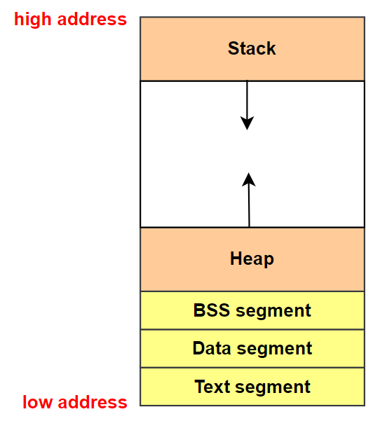
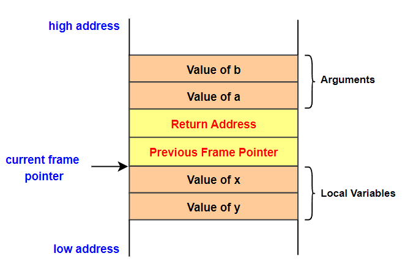
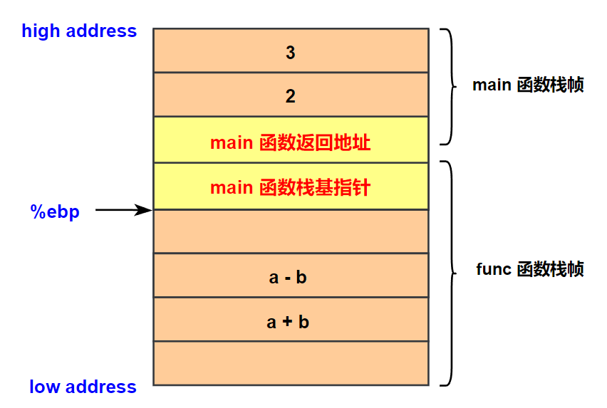
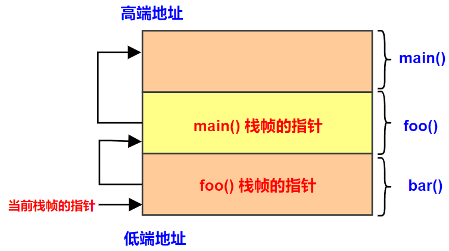
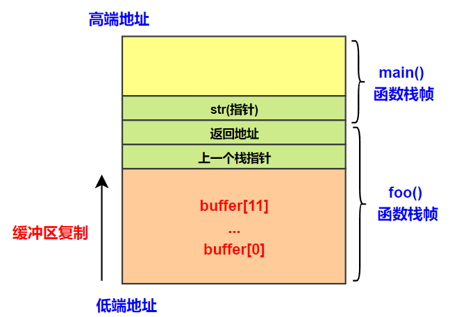
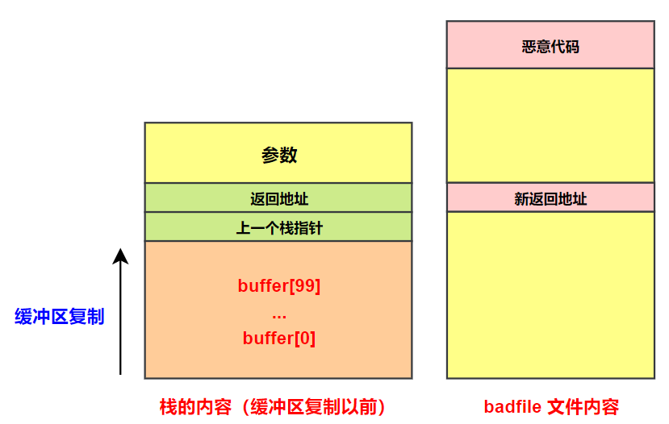
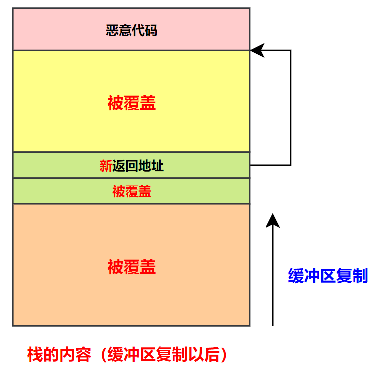
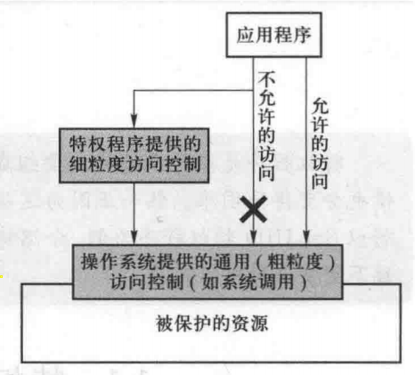

# 缓冲区溢出攻击之一

## 一、程序的内存布局

To fully understand how buffer overflow attacks work, we need to understand how the data memory is arranged inside a process. When a program runs, it needs memory space to store data. **<font color="red">For a typical C program, its memory is divided into five segments</font>**, each with its own purpose. 下图表示一个进程内存布局的 5 个部分：

<div align="center">
    
</div>

- Text segment: stores the executable code of the program. **This block of memory is usually read-only**.
- Data segment: **stores static/global variables <font color="red">that are initialized</font> by the programmer**. For example, the variable a defined in static int a = 3 will be stored in the Data segment.
- BSS segment: **<font color="blue">stores uninitialized static/global variables</font>**. This segment will be filled with zeros by the operating system, so all the uninitialized variables are initialized with zeros. For example, the variable b defined in static int b will be stored in the BSS segment, and it is initialized with zero.
- Heap: **<font color="red">The heap is used to provide space for dynamic memory allocation</font>**. This area is managed by malloc, calloc, realloc, free, etc.
- Stack: The stack is used for storing local variables defined inside functions, as well as storing data related to function calls, such as return address, arguments, etc. We will provide more details about this segment later on.

下面给出一个示例程序，并且标注出每一个变量属于上面哪个部分：

```c{.line-numbers}
// in data segment
int x = 100;
int main() {
    int a = 2;       // in stack
    float b = 2.5;   // in stack
    static int y;    // in BSS

    // allocate memory on heap
    // ptr 指针变量保存在栈上
    int* ptr = (int*) malloc(2*sizeof(int));
    // in heap
    ptr[0] = 5;
    // in heap
    ptr[1] = 6;

    free(ptr);
    return 1;
}
```

## 二、栈与函数调用

**<font color="red">Buffer overflow can happen on both stack and heap</font>**. The ways to exploit them are quite different. In this chapter, we focus on the stack-based buffer overflow. To understand how it works, we need to have an in-depth understanding of how stack works and what information is stored on the stack.

<div align="center">
	<div align="center" style="color: red; font-size:13px; font-weight:bold">图 2.1 函数栈帧布局示意图</div>
    
</div>

### 1.Stack Memory Layout

Whenever a function is called, some space is allocated for it on the stack for the execution of the function. Consider the following sample code for function func (), which has two integer arguments (a and b) and two integer local variables (x and y).

```c{.line-numbers}
int func(int a, int b) {
	int x,y;
	x = a + b;
	y = a - b;
	return x + y;
}

int main() {
	int res = func(2,3);
	return 1;
}
```

When func () is called, a block of memory space will be allocated on the top of the stack, and it is called stack frame. 函数栈帧的布局如上图所示. A stack frame has four important regions:

- **<font color="red">Arguments: This region stores the values for the arguments that are passed to the function</font>**. In our case, func() has two integer arguments. When this function is called, e.g., func (5, 8), the values of the arguments will be pushed into the stack, forming the beginning of the stack frame. **<font color="red">It should be noted that the arguments are pushed in the reverse order</font>**.
- Return Address: When the function finishes and hits its return instruction, it needs to know where to return to, i.e., the return address needs to be stored somewhere. **_Before jumping to the entrance of the function, the computer pushes the address of the next instruction-the instruction placed right after the function invocation instruction-into the top of the stack_**, which is the "return address" region in the stack frame.
- Previous Frame Pointer: The next item pushed into the stack frame by the program is the frame pointer for the previous frame.
- Local Variables: The next region is for storing the function's local variables. The actual layout for this region, **<font color="red">such as the order of the local variables, the actual size of the region, etc., is up to compilers</font>**. Some compilers may randomize the order of the local variables, or give extra space for this region [Bryant and O'Hallaron, 2015]. Programmers should not assume any particular order or size for this region.

注意，对于 x86-64 位机器来说，函数参数中的前 6 个参数是通过寄存器 %rdi、%rsi、%rdx、%rcx、%r8、%r9 来传递，后续更多的参数是通过栈来传递。**<font color="red">但是对于 x86-32 位机器来说，参数从右往左依次压入栈中，调用完毕，由调用者负责将这些压入的参数清理掉，返回值置于 %eax 中</font>**。比如函数 int func(int arg1, int arg2, int arg3)，使用 c 的默认调用约定，那么参数 3 先压入栈，参数 1 最后压入栈，栈的生长方向是向低地址方向生长，所以参数 3 的地址最大。

以前面给出的 C 代码为例，使用 **`gcc -O0 -S -m32 test.c`** 命令将 C 代码编译成 32 位汇编指令，会得到如下的代码：

```armasm{.line-numbers}
func:
	pushl	%ebp
	movl	%esp, %ebp
	subl	$16, %esp
	call	__x86.get_pc_thunk.ax
	addl	$_GLOBAL_OFFSET_TABLE_, %eax
	movl	8(%ebp), %edx
	movl	12(%ebp), %eax
	addl	%edx, %eax
	movl	%eax, -8(%ebp)
	movl	8(%ebp), %eax
	subl	12(%ebp), %eax
	movl	%eax, -4(%ebp)
	movl	-8(%ebp), %edx
	movl	-4(%ebp), %eax
	addl	%edx, %eax
	leave
	ret

main:
	pushl	%ebp
	movl	%esp, %ebp
	subl	$16, %esp
	call	__x86.get_pc_thunk.ax
	addl	$_GLOBAL_OFFSET_TABLE_, %eax
	pushl	$3
	pushl	$2
	call	func
	addl	$8, %esp
	movl	%eax, -4(%ebp)
	movl	$1, %eax
	leave
	ret
```

从上述代码可以看出，main 首先保存函数调用链上之前一个函数的 %ebp 寄存器，然后将 %esp 寄存器减去 16，为 main 函数的局部变量划分存储空间。接着将 func 函数的 2 个参数从右到左依次压入栈中，从这里就可以看出 32 位函数调用约定与 64 位的不同之处，32 位是将所有参数都压入到栈中。**并且 main 函数在调用完 func 之后，又将 %esp 寄存器的值加 8，主动将压入栈中的函数进行了清理**。

在 func 函数中，也是首先保存 main 函数的 %ebp 寄存器，再将 %esp 寄存器减去 16，为 func 函数局部变量划分存储空间，func 函数的栈帧如下所示。在 func 函数中，利用 %ebp 寄存器作为基准，**`%ebp+8`** 获取函数第一个参数 a，**`%ebp+12`** 获取函数第二个参数 b，然后分别计算 a+b 和 a-b，并分别保存到 func 函数栈帧的 **`%ebp-4`** 和 **`%ebp-8`** 这两个位置。

<div align="center">
    <div align="center" style="color: red; font-size:13px; font-weight:bold">图 2.2  func 函数栈帧布局示意图</div>
    
</div>

### 2.Frame Pointer

Inside func (), we need to access the arguments and local variables. The only way to do that is to know their memory addresses. **<font color="red">Unfortunately, the addresses cannot be determined during the compilation time, because compilers cannot predict the run-time status of the stack</font>**（比如在函数栈帧中存在变长数组的，导致栈帧的具体大小在编译时无法确定），and will not be able to know where the stack frame will be. To solve this problem, a special register is introduced in the CPU. It is called frame pointer. **This register points to a fixed location in the stack frame, so the address of each argument and local variable can be calculated using this register and an offset**.

下面以前一节的 C 语言程序为例来进行讲述，正如图 2.1 所示，在 x86 架构中，帧指针寄存器 %ebp 总是指向前一个帧指针保存的地址。对于 32 位体系结构而言，返回地址以及帧指针各占据 4 个字节，因此变量 a 和 b 的实际地址分别是 **`%ebp+8`** 和 **`%ebp+12`**。

```c{.line-numbers}
movl	8(%ebp), %edx
movl	12(%ebp), %eax
addl	%edx, %eax
movl	%eax, -8(%ebp)
```

值得注意的是，变量 **`x=a+b`** 实际上被分配到比帧指针 %ebp 低 8 字节的地址（即 %ebp-8）而非之前示意图 2.1 中显示的位置。**正如之前提到的，局部变量的实际内存布局是取决于编译器的**。

>现在可以解释为什么 a 和 b 是以逆序压入栈中的（即为什么 a 是第一个函数参数，但是 a 却是在 b 之后压入函数栈的）。实际上，从偏移值的角度来看，顺序并不是反的。由于栈是从高端地址向低端地址增长的，如果先压入参数 a，a 的偏移值将会高于 b，这反倒会在阅读汇编语言代码时感觉顺序反了。

通常会在一个函数内调用另一个函数。当进入被调用函数前，程序会在栈顶为被调用函数分配一个栈帧。当程序从被调用函数返回时，该栈帧占据的内存空间将会被释放。如下图所示，main() 函数调用了 foo() 函数，而 foo() 函数又调用了 bar() 函数。

<div align="center">
	
</div>

**<font color="red">CPU 中仅存在一个帧指针寄存器，它总是指向当前函数的栈帧</font>**。当进入 bar() 函数之前，帧指针指向 foo() 函数的栈帧，当程序跳转到 bar() 函数时，帧指针将指向 bar() 函数的栈帧。如果不记得进入 bar() 函数之前帧指针指向的地址，那么一旦从 bar() 函数返回，将无从知晓 foo() 函数的栈帧在什么位置。

为了解决这个问题，**在进入被调用函数之前，调用者的帧指针的值（称作前栈指针）将会被存储到被调用函数栈帧中的一个固定位置（在返回地址的下面）**。当被调用函数返回时，这个位置中存放的值会被用于设置帧指针寄存器，从而使帧指针重新指向调用者的栈帧。

## 三、栈的缓冲区溢出攻击

内存复制在程序中是很常见的，因为程序往往需要把数据从一个地方 (源地址) 复制到另一个地方 (目的地)。很多人也许会认为，缓冲区溢出能够造成的唯一破坏就是损毁缓冲区以外的数据，从而使程序崩溃，然而，令人惊讶的是，如此看似不那么严重的错误却能让程序执行攻击者的恶意指令。如果程序以某些特殊权限运行，那么攻击者将会获得这些权限。

### 1.将数据复制到缓冲区

C 语言中有很多函数可以用于复制数据，包括 strcpy()、strcat()、memcpy() 等。这里以 strcpy() 函数为例进行介绍。**这个函数用于复制字符串，遇到字符 '\0' 时将停止复制**。举例来说：

```c{.line-numbers}
#include <stdio.h>
#include <string.h>

void main() {
	char src[40] = "Hello world \0 Extra String";
	char dest[40];

	strcpy(src, dest);
}
```

当运行以上代码时，可以发现 strcpy() 函数只复制了字符串的部分内容 "Hello world" 到 dest 中，这是因为当执行复制操作时，strcpy() 函数遇到了字符 '\0'。**假如没有字符串中间的 0，复制行为将在字符串末尾结束。字符串的末尾以一个 0 表示，这并不会显示在代码中，而是由编译器自行在字符串末尾添加**。

### 2.缓冲区溢出

```c{.line-numbers}
#include <string.h>

void foo(char* str) {
	char buffer[12];

	/* the following statement will cause buffer overflow */
	strcpy(buffer, str);
}

int main() {
	char *str = "This is definitely longer than 12";
	foo(str);

	return 1;
}
```

上述 foo 函数的栈布局如下所示，foo() 函数中的局部数组 buffer 拥有 12 字节的内存。foo() 函数使用 strcpy() 函数从 str 复制字符串到 buffer 数组，strcpy() 函数将在遇到 0 (数值 0，'\0') 时停止执行。**由于原字符串长于 12 字节，strcpy() 函数将覆盖 buffer 区域以外的部分内存**。这就是所谓的缓冲区溢出。

<div align="center">
	<div align="center" style="color: red; font-size:13px; font-weight:bold">图 3.1  foo 函数栈帧布局示意图</div>
	
</div>

值得注意的是，**<font color="red">虽然栈由高端地址向低端地址生长，缓冲区中的数据依然是从低端地址向高端地址生长，即从 `buffer[0]` 到 `buffer[11]` 在栈上的地址分布从低端地址到高端地址</font>**。因此，当复制数据到 buffer 时，要复制的数据从 **`buffer[0]`** 的位置开始，直到 **`buffer[11]`** 结束。如果仍有未复制完的数据，strcpy() 函数将继续复制数据到 buffer 数组以上的区域，如 **`buffer[12]`**、**`buffer[13]`**，以此类推。

正如图 3.1 所展现的那样，buffer 数组之上的区域包含一些关键数据，如返回地址和前帧指针。返回地址决定了函数返回时程序将会跳转至何处执行。如果缓冲区溢出修改了返回地址，当函数返回时，它将跳转到一个新的地址。

### 3.利用缓冲区溢出漏洞

```c{.line-numbers}
/* This program has a buffer overflow vulnerability. */
#include <stdlib.h>
#include <stdio.h>
#include <string.h>

int foo(char* str) {
	char buffer[100];

	/* the following statement has a buffer overflow problem. */
	strcpy(buffer, str);

	return 1;
}

int main(int argc, char **argv) {
	char str[400];
	FILE* badfile;

	badfile = fopen("badfile", "r");
	fread(str, sizeof(char), 300, badfile);
	foo(str);

	printf("returned properly\n");
	return 1;
}
```

上面的程序从 badfile 中读取 300 字节的数据到 str 数组中，然后把它们复制到长度为 100 个字节的 buffer 中。现在的问题是，应当在 badfile 文件中放入什么样的数据，才能使程序发生缓冲区溢出并运行指定的代码。

**首先，需要把恶意代码放入运行程序的内存**。这个可以简单地把恶意代码放到 badfile 中，当程序读取该文件时，恶意代码即可被载入 str 数组; **<font color="red">当程序将 str 中的内容复制到目标缓冲区时，恶意代码就可被存入栈中</font>**。如图 3.2 所示，恶意代码被放到 badfile 文件的末尾。

<div align="center">
	<div align="center" style="color: red; font-size:13px; font-weight:bold">图 3.2  函数栈帧布局和 badfile 文件内容示意图</div>
	
</div>

下一步，需要迫使程序跳转到内存中的恶意代码。为了达到这个目的，**可以利用代码中的缓冲区溢出问题修改返回地址**。如果知道恶意代码存放的地址，就能够简单地使用这个地址来覆盖返回地址所在的内存区域。这样，当 foo() 函数返回时，程序就会跳转到恶意代码存放的地址。将图 3.2 中 badfile 的内容读入到栈中之后的布局如图 3.3 所示。

<div align="center">
	<div align="center" style="color: red; font-size:13px; font-weight:bold">图 3.3  函数栈帧布局（缓冲区复制之后）</div>
	
</div>

## 四、Set-UID 机制

### 1.特权程序存在的必要性

#### 1.1 ll 命令输出的结果

在 Linux 操作系统中，**`ll`** 通常是 **`ls -l`** 的别名，用于以长格式（详细信息）列出目录内容。以下是 **`ll`** 命令输出结果的详细解析：

```shell{.line-numbers}
drwxr-xr-x 2 user group 4096 Jun 12 10:00 Documents
-rw-r--r-- 1 user group  220 Jun 12 09:30 example.txt
```

上述第 1 个字符表示文件类型，**d 表示目录（Directory），- 表示普通文件（File），l 表示符号链接（Symbolic Link），b/c 分别表示块设备/字符设备，s 表示套接字（Socket），p 表示管道（Pipe）**。

后续的 9 个字符分为 3 组，分别表示：**`所有者权限 | 组权限 | 其他用户权限`**，在每组权限中，r 表示读权限，w 表示写权限，x 表示执行权限。比如 **`rwxr-xr--`** 表示文件所有者拥有读、写、执行权限，文件所属组拥有读、执行权限，其他用户只有读权限。

再接着第 2 列的数字字符表示链接数，对于 **<font color="red">目录</font>** 表示子目录数，数量至少为 2；对于 **<font color="red">文件</font>** 表示硬链接数，通常为 1。

第 3 列和第 4 列分表表示文件所有者和所属组，第 5 列表示文件的大小。

#### 1.2 密码困境

在 Linux 系统中，用户的密码存储在 /etc/shadow (这个文件被称为影子文件) 中。如果用户需要修改密码，修改后的新密码会存储到该文件中。影子文件的访问属性表明，只有 root 用户才可以修改该文件，其他普通用户没有权限修改。影子文件的访问属性如下所示:

```shell{.line-numbers}
-rw-r-----  1  root  shadow  1443  May  23  12:33  /etc/shadow
```

为了让用户修改密码，这个文件需要被修改，但普通用户没有权限修改该文件。一种简单的解决办法是修改影子文件的访问权限，使得所有人都可以修改该文件。但这不是一个安全的解决方法。因为如果普通用户可以修改影子文件，他们就可以修改其他用户的密码，从而登录他人账户。因此对影子文件的修改操作必须是受限的。

另外一种解决方法是提供一种支持密码修改功能的细粒度访问控制机制。操作系统可以实现这样的访问控制机制，**该访问控制机制允许非 root 用户只修改/etc/shadow 文件中包含他们自己密码的字段，而不能改动其他域或他人的记录**。

然而多数操作系统中的访问控制机制只能在文件级别进行控制，例如可以决定用户是否能够访问某个文件，但缺乏足够的粒度来限制文件的哪个部分可以被访问。细化访问控制的粒度虽然可以解决这一问题，但同时也会显著增加操作系统的复杂性。

因此多数操作系统选择了一种更加简化的两层访问控制，如图 4.1 所示。**<font color="red">该模型允许制定简单的访问控制规则，如读、写和执行的权限</font>**。其他更具体、更复杂以及与应用相关的访问控制规则无法用该简单的访问控制模型来表达。**<font color="red">为了实现这些访问控制规则，操作系统通常依赖于以特权程序形式存在的扩展程序</font>**。

<div align="center">
	<div align="center" style="color: blue; font-size:13px; font-weight:bold">图 4.1 访问控制的两层设计</div>
	
</div>

例如，基于 UNIX 的操作系统只允许 root 用户修改影子文件，不允许普通用户修改该文件。因此为了允许用户修改自己的密码 (存储在影子文件中)，UNIX 实现了一个扩展程序，即一个名为 passwd 的特权程序，使用该特权程序帮助用户修改影子文件。

可以从另一个角度来理解以上这种解决方式。由于缺乏细粒度控制，操作系统通常会"过度保护"。例如，完全禁止非 root 用户修改影子文件。这个规则过于严格，因为用户应当被允许修改他们自己的密码，而修改密码又需要修改影子文件。为了支持由特定的需求而产生的这些"例外"，**操作系统会在它的保护壳上"打开一个缺口"，并允许用户穿过这个缺口，按照一定的步骤对影子文件做出修改**。打开这个缺口以及后续的步骤，通常是以一个程序的形式实现的。

然而这些程序并不是普通程序。它们具有普通用户所不具备的额外特权。在影子文件这个例子中，当 passwd 程序被调用时，它帮助用户修改影子文件。**如果用户想直接修改影子文件而不使用 passwd 程序，该操作将无法执行成功**。类似于 passwd 这样的程序称为"特权程序"。任何具有额外特权的程序都可以被认为是特权程序。

#### 1.3 不同类型的特权程序

特权程序有两种常见的存在方式：守护进程和 Set-UID 程序，守护进程是在后台运行的计算机程序。特权程序的另一种实现方式是使用 Set-UID 机制。该机制在 UNIX 操作系统中被广泛使用。**它采用一个比特位来标记程序，告诉操作系统这是一个特殊的程序，在运行时需要区别对待**。

### 2.Set-UID 机制

在一个典型的计算机系统中，用户需要使用超级用户的权限来完成诸如修改密码这样的操作，一种方式是请求超级用户来完成这样的操作，但这样超级用户会应接不暇。像超人一样，超级用户也想将任务分配给其他人，但却不想简单地将超级用户的权限授予普通用户。因为那样的话，有些普通用户可能会借助超级用户的权限胡作非为。**<font color="red">一种解决方法是超级用户运行一个后台进程来响应所有修改密码的请求</font>**。这就是使用守护进程来实现特权程序的方法，该方法已经被许多系统采用了。

除了守护进程，UNIX 系统还使用了另一种实现特权操作的方法。这种方式和超人的办法很像，叫作 Set-UID 程序。**<font color="blue">采用这种方式，特权操作是直接由普通用户来完成的，但当他们运行 Set-UID 程序时，进程会得到超级用户赋予的特权</font>**，因而可以完成特权操作。不过，**<font color="blue">进程的行为是被严格限制的，它只能执行程序中指定的操作，而不能执行其他操作</font>**。这一类程序就像超人服中内置芯片的预置程序一样。

**Set-UID 程序和其他 UNIX 程序的唯一区别是它有一个特别的标记位：Set-UID 比特位**。使用这个比特位的目的是告诉操作系统，当运行这个程序时，应该和没有该比特位的程序区别对待。这里的区别在于这些进程的用户 ID。

在 UNIX 系统中，一个进程有三个用户 ID(uid): 真实用户 ID、有效用户 ID 和保留用户 ID：

- 真实用户 ID 表明了进程的真正拥有者，即运行该进程的用户。就是我们当前以哪个用户登录了，我们运行的程序的实际用户 ID 就是这个用户的 ID。
- 有效用户 ID 是在访问控制中使用的 ID，这个 ID 表示该程序的所有者。一般情况下是实际用户 ID，**<font color="red">如果可执行文件具有了 SUID 权限，那么它的有效用户 ID 就是可执行文件的拥有者</font>**。
- 保留用户 ID：保存的设置用户 ID 就是有效用户 ID 的一个副本，与 SUID 权限有关。

对于非 Set-UID 程序来说，当它被一个用户 ID 为 5000 的用户执行时，进程的真实用户 ID 和有效用户 ID 都是 5000。如果该用户执行一个 Set-UID 程序，真实用户 ID 仍是 5000，**而有效用户 ID 则取决于该程序的所有者。如果该程序的所有者是 root，那么其有效用户 ID 将为 0**，因为访问控制中使用的是有效用户 ID。也就是说，即便该进程是由普通用户执行的，它也拥有 root 用户的权限。

可以用 /bin/id 命令来查看一个运行进程的用户 ID。首先将该程序复制到当前目录并重命名为 myid，然后将它的拥有者改成 root (使用 chown 命令)。**先不设置它的 Set-UID 比特，这样即便该程序的拥有者是 root，它仍然是一个非特权程序**。

```c{.line-numbers}
monica@xvm:~/csapp/chapter3$ cp /bin/id ./myid
monica@xvm:~/csapp/chapter3$ sudo chown root myid

monica@xvm:~/csapp/chapter3$ ./myid
用户id=1000(monica) 组id=1000(monica) 组=1000(monica)

monica@xvm:~/csapp/chapter3$ ll ./myid
-rwxr-xr-x 1 root monica 39424  1月 31 14:09 ./myid*
```

现在用 **`chmod 4755 myid`** 命令设置该程序的 Set-UID 比特 (4775 中的数字 4 设置了 Set-UID 比特)。chmod 是 Linux 下设置文件权限的命令，后面的数字表示不同用户或用户组的权限。**<font color="red">一般是 3 个数字，第 1 个数字表示文件所有者的权限；第 2 个数字表示与文件所有者同属一个用户组的其他用户的权限；第 3 个数字表示其它用户组的权限</font>**。4 表示读权限（r），2 表示写权限（w），1 表示执行权限（x）。

再次运行程序，这次显示了不同的结果，程序还打印出了有效用户 ID(euid)，它的值是 0，因此该进程拥有 root 权限。

```c{.line-numbers}
monica@xvm:~/csapp/chapter3$ sudo chmod 4755 myid
monica@xvm:~/csapp/chapter3$ ll ./myid
-rwsr-xr-x 1 root monica 39424  1月 31 14:09 ./myid*

monica@xvm:~/csapp/chapter3$ ./myid
用户id=1000(monica) 组id=1000(monica) 有效用户id=0(root) 组=1000(monica)
```

### 3.一个 Set-UID 程序例子

这里用 /bin/cat 程序来说明 Set-UID 程序是如何工作的。cat 程序可以将文件内容打印出来。将 /bin/cat 程序复制到用户主目录 (用户 ID 是 seed) 中，将其重命名为 mycat。同样使用 chown 命令改变它的所属权，使得它的拥有者是 root 用户，然后运行该程序来查看影子文件的内容。

结果如下所示，尝试失败了，**<font color="red">因为此时虽然 mycat 进程的所有者都是 root，但是没有设置其 Set-UID 比特，mycat 仍然是一个非特权程序</font>**。在 mycat 运行时，仍然是以一个普通用户的权限来运行的。

```c{.line-numbers}
monica@xvm:~/csapp/chapter3$ cp /bin/cat ./mycat
monica@xvm:~/csapp/chapter3$ sudo chown root mycat

monica@xvm:~/csapp/chapter3$ ls -l ./mycat 
-rwxr-xr-x 1 root monica 35280  1月 31 20:13 ./mycat

monica@xvm:~/csapp/chapter3$ ./mycat /etc/shadow
./mycat: /etc/shadow: 权限不够
```

下面做一个小的改动，设置该程序的 Set-UID 比特，然后再次运行 mycat 程序来查看影子文件的内容。这次成功显示了影子文件的内容。**<font color="red">当设置 Set-UID 比特时，运行程序的进程具有文件所有者 root 权限，因为该程序的所有者是 root</font>**。

```c{.line-numbers}
monica@xvm:~/csapp/chapter3$ sudo chmod 4755 mycat
monica@xvm:~/csapp/chapter3$ ./mycat /etc/shadow
root:!:25620:0:99999:4:::
```

接下来将文件的所有者改回 seed，同时设置 Set-UID 比特，做完这些设置之后，读取影子文件的操作会失败。**这是因为，虽然程序仍然是一个 Set-UID 程序，但它的所有者只是普通用户，并没有访问影子文件的权限**。

>在实验中要注意的是，需要再次运行 chmod 命令来设置 Set-UID 比特，因为 chown 命令会自动清空 Set-UID 比特。

```c{.line-numbers}
monica@xvm:~/csapp/chapter3$ sudo chown monica mycat
monica@xvm:~/csapp/chapter3$ chmod 4755 mycat 
monica@xvm:~/csapp/chapter3$ ./mycat /etc/shadow
./mycat: /etc/shadow: 权限不够
```

### 4.Set-UID 机制的安全性

从原理上来说，Set-UID 机制是安全的。因为即便 Set-UID 程序允许普通用户提升权限，但这和直接赋予普通用户权限还是不同的。**<font color="red">在直接赋予权限的情况下，普通用户获得权限后可以执行任何操作。而在使用 Set-UID 程序的情况下，普通用户只能执行 Set-UID 程序中已经定义好的操作</font>**。也就是说，用户的行为是受限的。

但是，并非所有的程序变成 Set-UID 特权程序后都是安全的。例如，将 /bin/sh 程序变成 Set-UID 程序就不是一个安全的做法，因为该程序可以执行用户任意指定的命令，这使得它的行为是不受限制的。类似地，将 vi 程序变成 Set-UID 程序也不是一个安全的做法。虽然 vi 程序只是一个文本编辑器，但它却允许用户在编辑器内执行任意外部命令，因此它的行为也是不受限制的。

### 5.setuid 函数解析

#### 5.1 setuid 函数声明和返回值

下面是 setuid 函数的声明和返回值：

```c{.line-numbers}
#include <sys/types.h>
#include <unistd.h>

int setuid(uid_t uid);

// RETURN VALUE
// On  success,  zero  is returned.  On error, -1 is returned, and errno is set appropriately.
```

关于 setuid 函数的功能，APUE 上介绍如下：

- 若进程具有超级用户特权，则 setuid 函数将实际用户 ID、有效用户 ID，以及保存的设置用户 ID 设置为参数 uid；
- 若进程没有超级用户特权，**<font color="red">但是 uid 等于实际用户 ID 或保存的设置用户ID，则 setuid 只将有效用户 ID 设置为 uid。不改变实际用户 ID 和保存的设置用户 ID</font>**；
- 如果上面两个条件都不满足，则 errno 设置为 EPERM，并返回出错；

>在这里假定 **`_POSIX_SAVED_IDS`** 为真。如果没有提供这种功能，则上面所说的关于保存的设置用户 ID 部分都无效。

#### 5.2 setuid 函数举例

首先说明一下，在例子中一共用到了 3 个用户，root（id=0）、monica（id=1000）、apache（id=1001）。

```c{.line-numbers}
// 用户名:密码占位符:用户ID:组ID:用户描述:主目录:登录Shell
monica@xvm:~/csapp/chapter3$ cat /etc/passwd
root:x:0:0:root:/root:/bin/bash
monica:x:1000:1000:monica,,,:/home/monica:/bin/bash
apache:x:1001:1001::/home/apache:/bin/sh
```

首先讲第一点，如果进程具有超级用户特权，那么这三个 UID 都被设置成了 uid（setuid 函数的参数）的值。比如下面这段代码：

```c{.line-numbers}
#include<sys/types.h>
#include<unistd.h>
#include<stdio.h>
int main(int argc,char *argv[])
{
	uid_t ruid,euid,suid;
	//这三个uid分别是实际用户ID，有效用户ID，保存的设置用户ID
	getresuid(&ruid,&euid,&suid);
	printf("real:%d\teffective:%d\tset-user-id:%d\n",ruid,euid,suid);

	setuid(500);
	getresuid(&ruid,&euid,&suid);
	printf("real:%d\teffective:%d\tset-user-id:%d\n",ruid,euid,suid);
 
	return 0;
}
```

最开始用 root 用户来运行这个程序，那么刚开始这个进程的有效用户 ID 为 0，然后这个进程中调用 **`setuid(500)`**，这三个 UID 的值都会被设置成 500（在程序中通过 getresuid 函数来获取进程的三个 UID 的值），运行结果如下所示：

```shell{.line-numbers}
monica@xvm:~/csapp/chapter3$ sudo ./main
real:0	effective:0	set-user-id:0
real:500	effective:500	set-user-id:500

monica@xvm:~/csapp/chapter3$ whoami
monica

monica@xvm:~/csapp/chapter3$ sudo whoami
root
```

接下来我们再来讨论第二种情况，**<font color="red">如果函数的参数 uid 等于进程的实际用户 ID 或者保存的设置用户 ID，那么就将有效用户 ID 设置为 uid，其他的两个（实际用户 ID 和保存的设置用户 ID）保持不变</font>**。比如下面这个程序：

```c{.line-numbers}
#include<sys/types.h>
#include<unistd.h>
#include<stdio.h>
void err_exit(char *fmt,...);
int main(int argc,char *argv[])
{
    uid_t ruid,euid,suid;
 
    printf("Before:\n");
    if(-1 == getresuid(&ruid,&euid,&suid))
    	err_exit("[getresuid]: ");
    printf("real:%d\teffective:%d\tset-user:%d\n",ruid,euid,suid);

    setuid(1000);
    printf("After:\n");
    if(-1 == getresuid(&ruid,&euid,&suid))
    	err_exit("[getresuid]: ");
    printf("real:%d\teffective:%d\tset-user:%d\n",ruid,euid,suid);
 
    return 0;
}
```

我们使用 **`gcc main.c -o main`** 命令将上述 c 代码变成二进制可执行文件，我让它的拥有者变成了 apache(UID=1001)，并且给它加上了 SUID 权限，如下所示。此时 main 文件的实际用户 ID（实际上就是当前系统的登陆用户）为 monica（UID=1000）；有效用户 ID（main 二进制文件的实际所有者）为 1001（即 apache 用户）；保留用户 ID 也为 1001。

```c{.line-numbers}
monica@xvm:~/csapp/chapter3$ sudo chown apache main
monica@xvm:~/csapp/chapter3$ sudo chmod 4755 main
```

然后用 monica 用户来运行这个程序，并且在这个程序中调用 setuid 函数，传入的参数 1000 等于实际用户 ID，**最终应该只有有效用户 ID 受到影响，而保存的设置用户 ID 保持不变**。运行结果如下所示：

```c{.line-numbers}
monica@xvm:~/csapp/chapter3$ ./main 
real:1000	effective:1001	set-user-id:1001
real:1000	effective:1000	set-user-id:1001
```

现在验证最后一点，如果 setuid 函数的参数的 uid 的值即不等于实际用户 ID，也不等于保存的设置用户 ID，而且这个进程的有效用户 ID 也不是 0（非特权进程）。那么这个程序就会出错，并将 errno 设置为 EPERM。比如下面这个程序：

```c{.line-numbers}
#include<sys/types.h>
#include<unistd.h>
#include<stdio.h>
#include<string.h>
#include<errno.h>
int main(int argc,char *argv[])
{
    uid_t ruid,euid,suid;
 
    getresuid(&ruid,&euid,&suid);
    printf("real:%d\teffective:%d\tset-user:%d\n",ruid,euid,suid);
 
    if(-1 == setuid(100)) {
    	printf("%s\n",strerror(errno));
    	if(errno == EPERM) {
            printf("Error number is EPERM!\n");
        }
    } else {
    	getresuid(&ruid,&euid,&suid);
        printf("real:%d\teffective:%d\tset-user:%d\n",ruid,euid,suid);
    }
 
    return 0;
}
```

现在以 monica 用户（UID=1000）运行这个程序，那么这个程序的三个用户 ID 都为 1000，然后在这个程序中，调用 **`setuid(100)`**。于是程序就会报错，并将 errno 设置为 EPERM，如下所示：

```c{.line-numbers}
monica@xvm:~/csapp/chapter3$ ./main
real:1000	effective:1000	set-user:1000
Operation not permitted
Error number is EPERM!
```