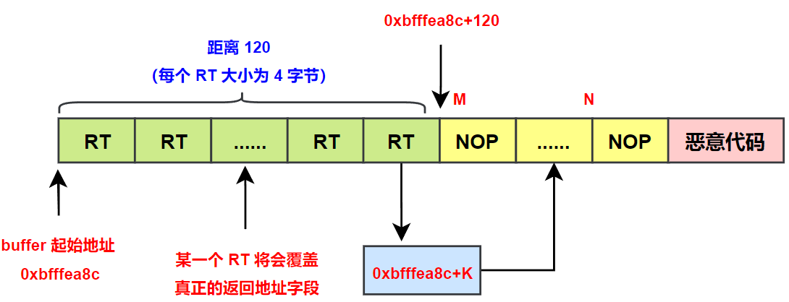
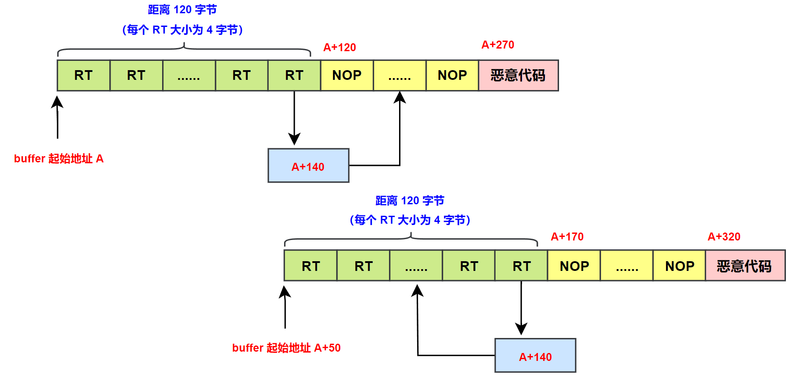
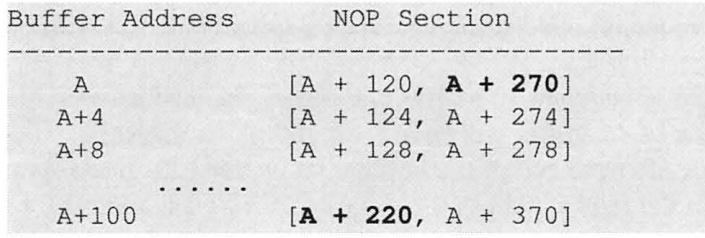
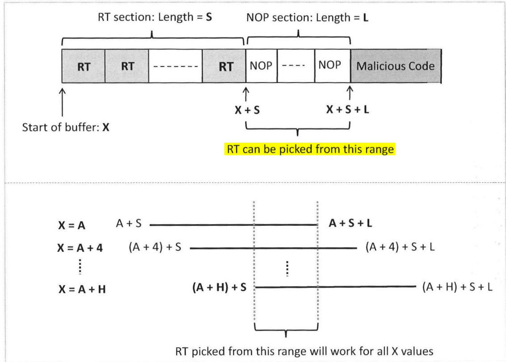
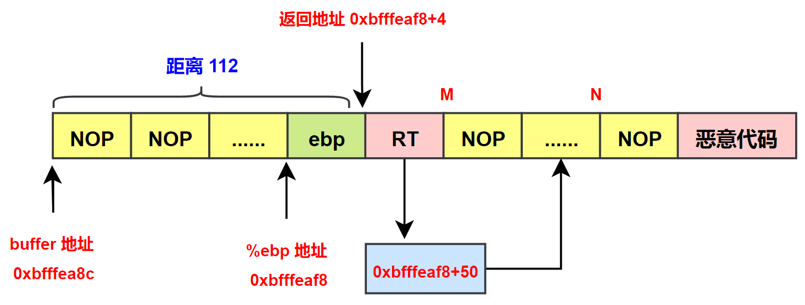
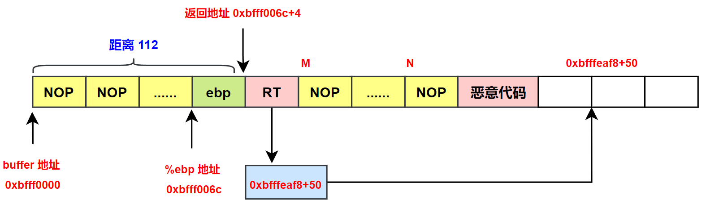
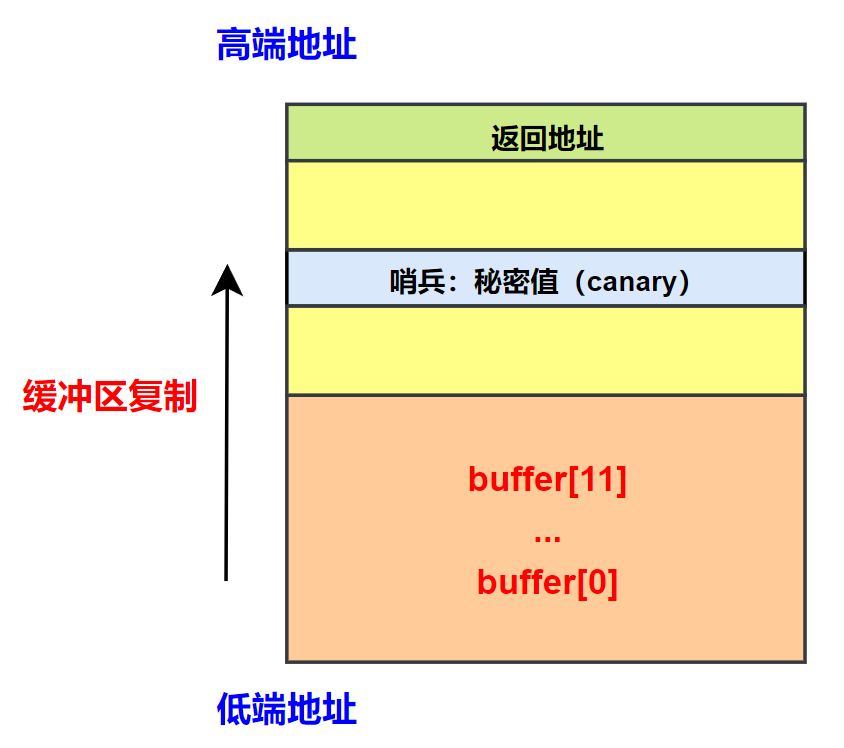

# 缓冲区溢出攻击之三

## 八、地址和 buffer 大小未知时进行攻击

In the previous section, we show how to conduct attacks when the buffer address and size are known to us. In real-world situations, we may not be able to know their exact values. This is especially true for attacks against remote servers, because unlike what we did in the previous section, we will not be able to debug the target program.

### 1.知道 buffer 的大小范围

**<font color="red">There are two critical pieces of information for buffer overflow attacks: the buffer's address and size.</font> 其中 buffer 的 size 主要用于确定 badfile 文件中返回地址字段到 buffer 起始地址的偏移量，而 address 则用于确定恶意代码的跳转地址**. Let us first assume that we do know the address of the buffer is A = 0xbfffea8c (this assumption will be lifted later), but we do not know exactly what the buffer size is; we only know it is in a range, from 10 to 100. Obviously, we can use the brute force approach, trying all the values between 10 to 100. The question is whether we can do it with only one try. In real-world situations, brute-force attacks can easily trigger alarms, so the less we try the better.

The buffer size decides where the return address is（return address 字段到 buffer 起始地址的偏移量）.Without knowing the actual buffer size,we do not know which area in the input string (i.e., the badfile) should be used to hold the return address. Guessing is an approach, **but there is a better solution: instead of putting the return address in one location, we put it in all the possible locations, so it does not matter which one is the actual location**. This technique is called spraying, i.e., we spray the buffer with the return address.

<div align="center">
    
</div>

Since the range of the buffer size is between 10 to 100, the actual distance between the return address field and the beginning of the buffer will be at most 100 plus some small value (compilers may add additional space after the end of the buffer); let us use 120. If we spray the first 120 bytes of the buffer with the return address RT (four bytes for each address), we guarantee that one of them will overwrite the actual return address field. 上图表示了此时 badfile 文件的构成。

We do need to decide the value for RT. From the figure, we can see that the first NOP instruction will be at address A + 120. Since we assume that A is known to us (its vale is 0xbfffea8c), we have **`A + 120 = 0xbfffea8c + 120 = 0xbfffeb04`**, We can use this address for RT. Actually, because of the NOPs, any address between this value and the starting of the malicious code can be used. 以上图为例，RT 的具体值为 0xbfffea8c+K，其中 $\scriptsize{M\leq{K\leq{N}}}$。

### 2.知道 buffer 地址的范围

Let us lift the assumption on the buffer address; assume that we do not know the exact value of the buffer address, but we know its range is between A and A+100 (A is known). **Our assumption on the buffer size is still the same, i.e., we know its range is between 10 to 100**. We would like to construct one payload, so regardless of what the buffer address is, as long as it is within the specified range, our payload can successfully exploit the vulnerability. **<font color="red">也就是现在假设 buffer 大小范围为 [10,100]，buffer 的起始地址范围为 [A,A+100]</font>**。

对于 buffer 大小不确定的问题，前面我们已经使用 spraying technique 技术解决，即针对 buffer 大小范围为 [10,100] 的情况，我们将 badfile 文件中前 120 个字节均填充 RT 返回地址。当现在 buffer 的起始地址 A 发生变化时，使用此种技术创建的 badfile 文件依然是有效的。**或者以说，当 buffer 大小范围为 `[X, Y]` 时，总是可以使用 spraying technique 技术将 badfile 文件的起始 H（$\scriptsize{H\gt{Y}}$）个字节设置为 RT 来解决这个问题**。

接下来需要解决当 buffer 起始地址 A 发生变化时，如何确定 RT 值的问题。如下是一个示例，包含 2 个 badfile 文件结构的示例，每个 badfile 文件结构由 3 部分组成：绿色的 RT Section（120 字节）、黄色的 NOP Section（150 字节）、红色的恶意代码（30 字节）。当 buffer 的起始地址为 A 时，设置 RT 的值为 A+140，这样就可以跳转到 NOP Section 从而执行恶意代码；当 buffer 的起始地址为 A+50 时，此时 RT 的值 A+140 可能就指向 RT Section，这样就无法跳转到恶意代码继续执行。

<div align="center">
	
</div>

因此，**<font color="red">我们的目标就是找到一个 RT 值，当 buffer 的起始地址为 `[A,A+100]` 范围内的任一值时，都可以正常跳转到恶意代码部分继续执行</font>**。 

We still use the spraying technique to construct the first 120 bytes of the buffer, and we put 150 bytes of NOP afterward, followed by the malicious code. Therefore, if the buffer's address is X, the NOP section will be in the range of [X + 120, X + 270]. The question is that we do not know X, and hence we do not know the exact range for the NOP section. Since X is in the range of [A, A + 100], let us enumerate all the possible values for X, and see where their NOP sections are:

<div align="center">
	
</div>

因此要找到适用于所有可能 buffer 地址的 RT 值，其值必须位于所有 NOP 段的交集中。该范围为 **`[A+220,A+270]`**。也就是说，该范围内的任何地址都可以用作返回地址 RT。

### 3.通用的解决方案

Assume that the buffer address is within the range of **`[A,A+H]`**（**将前面的 `[A,A+100]` 泛化成了 `[A,A+H]`**）, the first S bytes of the buffer are used for the spraying purpose (the RT section), and the next L bytes of the buffer are filled with the NOP instruction (the NOP section). Let us find out what values we can use for the return address RT. 这里没有说明 buffer 的大小范围，这是因为如前所述，**<font color="red">不管 buffer 大小范围为 `[X, Y]` 时，总是可以使用 spraying technique 技术将 badfile 文件的起始 S（$\scriptsize{S\gt{Y}}$）个字节设置为 RT 来解决这个问题</font>**。

<div align="center">
	
</div>

- 当 buffer 的实际起始地址 X 为 A 时，NOP Section 的范围为 **`[A+S, A+S+L]`**，RT 可以从这个范围中进行取值；
- 当 buffer 的实际起始地址 X 为 A+4 时，NOP Section 的范围为 **`[(A+4)+S, (A+4)+S+L]`**，RT 可以从这个范围中进行取值；
- 当 buffer 的实际起始地址 X 为 A+H 时，NOP Section 的范围为 **`[(A+H)+S, (A+H)+S+L]`**，RT 可以从这个范围中进行取值；

If we want to find an RT value that works for all the possible buffer addresses, it must be in the conjunction of all the ranges for X = A, A+4, ... , A+H. From Figure above, **we can see that the conjunction is **`[A+H+S, A+S+L)`**. Any number in this range can be used for the return address RT**.

Some readers may immediately find out that if H is larger than L, the lower bound of the above range is larger than the upper bound, so the range is impossible, and no value for RT can satisfy all the buffer addresses. **<font color="red">Intuitively speaking, if the range of the buffer address is too large, but the space for us to put NOP instructions is too small, we will not be able to find a solution</font>**. To have at least one solution, the relationship $\scriptsize{H\lt{L}}$ must hold.

Since L is decided by the payload size, which depends on how many bytes the vulnerable program can take from us, we will not be able to arbitrarily increase L to satisfy the inequality.

## 九、防御措施

### 1.地址随机化

为了成功实施缓冲区溢出攻击，**<font color="red">攻击者需要使漏洞程序 "返回/跳转" 到他们注入的代码，因此他们首先需要猜测注入代码在什么地址</font>**，猜测成功率取决于攻击者对栈的位置的预测能力。操作系统以前总是把栈放在固定位置，这给攻击者提供了很大的便利。

栈的起始地址固定是否必要? 答案是否定的。对于存储在栈中的所有数据而言，它们的地址并非固定写在二进制代码中，而是基于帧指针 %ebp 和栈指针 %esp 计算得到的。换言之，数据的地址是通过这两个寄存器以及偏移值来表示的，而不是栈的起始地址。因此，即使把栈放在另一个地址，只要 %ebp 和 %esp 被正确设置，程序也能正常运行。

#### 1.1 Linux 中的地址随机化

运行一个程序之前，操作系统需要把该程序加载入系统，这是由操作系统的加载程序完成的。**<font color="red">在加载阶段，加载器为程序准备堆栈内存。因此，地址随机化通常在加载器中实现</font>**。在 Linux 系统中，ELF 是一种通用的二进制文件格式，对于这种类型的二进制程序，地址随机化在 ELF 加载器上实现。ASLR 会在每次程序执行时随机化关键内存区域的地址布局，包括：

- 栈（Stack）：栈的起始位置会被随机化；
- 堆（Heap）：堆的起始位置也会被随机化；
- 共享库（Shared Libraries）：动态链接库（如 .dll 文件）在内存中的加载地址会随机化；
- 程序代码段：程序的代码执行区（通常是 .text 段）位置同样会被随机化；

为了理解地址随机化，下面编写了一个程序，程序中包含 2 个缓冲区，一个在栈上分配，另外一个在堆上分配：

```c{.line-numbers}
#include <stdio.h>
#include <stdlib.h>

void main() {
    char x[12];
    char* y = malloc(sizeof(char)*12);

    printf("Address of buffer x (on stack): 0x%p\n", x);
    printf("Address of buffer y (on heap): 0x%p\n", y);
}
```

我们使用 **`gcc test.c -no-pie`** 命令编译上述代码文件，可以通过设置一个内核变量 **`kernel.randomize_va_space`** 告知加载器我们想要使用的地址随机化类型。当这个内核变量被设置为 0 时，地址随机化将被关闭，每次运行代码都得到相同的 x、y 地址。当将它改为 1 时（保守随机化），栈缓冲区的地址发生改变，而堆仍然保持相同地址，这是因为该类型并不随机化堆的内存。**当将这个值改为 2 时，堆和栈都会做随机化处理**。

>Modern Linux kernels have ASLR enabled by default with the specific value 2.
>Normally you might expect a value of 0 (disabled), or 1 (enabled). In the case of the **`randomize_va_space`** setting, this is true as well. When setting the value to 1, address space is randomized. This includes the positions of the stack itself, virtual dynamic shared object (VDSO) page, and shared memory regions. Setting the option to value 2 will be similar to 1, and add data segments and heap as well. For most systems, this setting is the default and the most secure setting.

```shell{.line-numbers}
# 当 randomize_va_space=0 时，栈和堆的起始位置都保持不变
monica@mxvm:~/csapp/chapter3$ sudo sysctl -w kernel.randomize_va_space=0
kernel.randomize_va_space = 0
monica@xvm:~/csapp/chapter3$ ./a.out 
Address of buffer x (on stack): 0x0x7fffffffdf3c
Address of buffer y (on heap): 0x0x4052a0
monica@xvm:~/csapp/chapter3$ ./a.out 
Address of buffer x (on stack): 0x0x7fffffffdf3c
Address of buffer y (on heap): 0x0x4052a0

# 当 randomize_va_space=1 时，堆的起始位置保持不变，栈的起始位置发生变化
monica@mxvm:~/csapp/chapter3$ sudo sysctl -w kernel.randomize_va_space=1
kernel.randomize_va_space = 1
monica@xvm:~/csapp/chapter3$ ./a.out 
Address of buffer x (on stack): 0x0x7ffecdde069c
Address of buffer y (on heap): 0x0x4052a0
monica@xvm:~/csapp/chapter3$ ./a.out 
Address of buffer x (on stack): 0x0x7ffd08aa490c
Address of buffer y (on heap): 0x0x4052a0

# 当 randomize_va_space=2 时，堆和栈的起始位置均发生变化
monica@xvm:~/csapp/chapter3$ sudo sysctl -w kernel.randomize_va_space=2
kernel.randomize_va_space = 2
monica@xvm:~/csapp/chapter3$ ./a.out 
Address of buffer x (on stack): 0x0x7ffc2642ed8c
Address of buffer y (on heap): 0x0x224212a0
monica@xvm:~/csapp/chapter3$ ./a.out 
Address of buffer x (on stack): 0x0x7ffea0e483dc
Address of buffer y (on heap): 0x0x22bc2a0
```

#### 1.2 地址随机化的有效性

衡量地址空间随机程度的一种方式是熵。如果一个内存空间区域拥有 n 比特 (bit) 熵，这表明此系统上该区域的基地址有 $2^n$ 种等可能的位置。熵取决于在内核中实施的 ASLR 类型。例如在 32 位 Linux 操作系统中，**当使用静态 ASLR (即除了程序映像以外的内存区域都被随机化)，栈的可用熵为 19 bit，也就是栈的起始地址有 $2^{19}$ 种可能，堆为 13 bit**。

实现 ASLR 时，当随机化的可用熵不够大时，攻击者可以采用暴力破解攻击。为了抵御暴力破解，有些 ASLR 的实现，如 grsecurity，在程序崩溃次数达到一定数量后，在一段时间内会禁止该程序再次被执行。

如上所述，在 32 位 Linux 操作系统中，栈只有 19 bit 的熵，意味着栈的基地址只有 $2^{19}=524, 288$ 种可能性。这个数字并不算大，它能被轻易地暴力破解。为了证实这一点，编写下面的脚本来重复地发起缓冲区溢出攻击（即重复执行 stack 二进制程序），希望碰巧猜中栈的内存地址。在运行脚本之前，需要设置 **`kernel.randomize_va_space`** 为 2，从而完全打开内存地址随机化。

```shell{.line-numbers}
SECONDS=0
value=0

while [1]
    do
    value=$(( $value + 1))
    duration=$SECONDS
    min=$(($duration / 60))
    sec=$(($duration % 60))
    echo "$min minutes and $sec seconds elapsed."
    echo "The program has been running $value times so far."
    ./stack
done
```

在本实验中，运行上面的脚本 19 分钟（12518 次尝试）之后，在 badfile 文件中放入的地址恰好正确，恶意代码得到执行。

```shell{.line-numbers}
...
19 minutes and 14 seconds elapsed.
The program has been running 12516 times so far.
...:line 12: 31695 Segmentation fault (core dumped) ./stack
19 minutes and 14 seconds elapsed.
The program has been running 12517 times so far.
...:line 12: 31697 Segmentation fault (core dumped) ./stack
19 minutes and 14 seconds elapsed.
The program has been running 12518 times so far.
#
```

在上面的攻击中，已经把恶意代码置入 badfile 中，但是由于地址随机化，该文件中放入的地址可能是错误的。从前面的 exploit.py 文件可以看出，**放在返回地址中的跳转地址（跳转到恶意代码）是固定的 `0xbfffeaf8 + 100`（下图中的 50 也可以）**。

下面图（a）和图（b）分别是跳转地址命中和未命中的情形，由于跳转地址固定，因此在栈随机化时，当 buffer 地址在 **`0xbfffea8c`** 左右小幅波动时，跳转地址即可命中，即 $\scriptsize{M\leq{RT\leq{N}}}$，如图（a）所示；但是当 buffer 的地址变化较大时， 跳转地址很可能无法命中，即 $\scriptsize{RT\lt{M}}$ 或者 $\scriptsize{RT\gt{N}}$，如图（b）所示。

<div align="center">
    <div align="center" style="color: black; font-size:13px; font-weight:bold">图 (a)  返回地址命中</div>
    <br/>
    <div align="center" style="color: black; font-size:13px; font-weight:bold">图 (b)  返回地址未命中</div>
    
</div>

对于 64 位的 Linux 操作系统，上述攻击将会困难很多。

### 2.StackGuard

基于栈的缓冲区溢出攻击需要修改返回地址，如果能够在函数返回前检测到返回地址是否被修改，就能抵御攻击。这个思想有多种实现方法。一种方法是将返回地址备份到其他地方 (不在栈中的某个地方)，这样一来，备份值在缓冲区溢出时不会被修改，然后使用这个备份值来检查返回地址是否被修改。该方法的一个代表性实现是 Stackshield。**<font color="red">另一种方法是在返回地址和缓冲区之间设置一个哨兵，用这个哨兵来检测返回地址是否被修改</font>**。该方法的一个代表性实现是StackGuard。StackGuard 已被 gcc 编译器实现了。

#### 2.1 观察到的现象和解决方法提出

StackGuard 的关键点是，当缓冲区溢出攻击修改返回地址时，所有处于缓冲区和返回地址之间的内存值也会被修改。这是由于内存复制函数 (如 strcpy() 和 memcpy()) 都是将数据复制到连续内存中，只修改这之间的部分内存是不可能的。

<div align="center">
    
</div>

基于上述思想，可以在缓冲区到返回地址之间放置一个不可预测的值 (称为哨兵)。**在函数返回之前，检查这个值是否被修改。如果值被修改，则返回地址有很大可能也被修改了**。因此，检测返回地址是否被覆盖的问题变成了检测哨兵值是否被覆盖。

这两个问题看起来相同，但实则不然。**<font color="red">对于返回地址，因为不知道没改过的值是什么，所以不知道它是否被修改</font>**。对于哨兵值，因为它是人为设置的，所以很容易知道它是否被修改。

#### 2.2 在函数中手动添加代码

对于下面的 foo 函数，我们可以在缓冲区到返回地址之间放置一个哨兵值。可以在函数开头定义一个局部变量实现此功能。需要注意的是，在实际情况下，局部变量放置在栈中的方式和顺序取决于编译器，因此并不能保证源代码中最早定义的变量会被分配到更加靠近返回地址的地方。但在这里，我们忽略掉这种情况。

```c{.line-numbers}
void foo(char* str) {
    char buffer[12];
    strcpy(buffer, str);

    return;
}
```

使用一个秘密数 secret 来初始化 guard。这个秘密数来自 main() 函数中生成的一个随机数，程序的每一次运行都产生不同的随机数，因此它是不可预测的。当缓冲区溢出导致返回地址被修改时，guard 的值也一定会改变。既能修改返回地址又不影响 guard 值的唯一方法是用 guard 原来的值覆盖它。假如秘密数是随机的，并且拥有足够大的范围，准确猜测 guard 的值将是十分困难的。

秘密数 secret 不能存放在栈中，否则它也可能被重写。堆、数据段以及 BSS 段都可以用来存放秘密数。需要注意的是，秘密数永远不能固定写在代码中，否则它将不再是秘密。即使有意地把代码弄乱来隐藏秘密，对于攻击者来说，从代码中找到秘密数的值只是时间问题。下面是修改后的 foo 函数：

```c{.line-numbers}
// 未初始化的全局变量保存在 BSS 段内
int secret;

void foo(char* str) {
    int guard;
    guard = secret;

    char buffer[12];
    strcpy(buffer, str);

    if (guard == secret)
        return;
    else 
        exit(1);
}
```

在函数返回之前，要检查局部变量 guard 是否与全局变量 secret 相同。

#### 2.3 gcc 中的 StackGuard 实现

```c{.line-numbers}
#include <stdio.h>
#include <stdlib.h>
#include <string.h>

void foo(char *str) {
	char buffer[12];
	
	/*buffer overflow vulnerability*/
	strcpy(buffer, str);
}

int main(int argc, char *argv[]) {
	foo(argv[1]);
	
	printf("returned properly\n\n");
	return 0;
}
```

以不同长度的参数运行上述代码，在第一次执行中，使用一个短参数，程序返回正常。在第二次执行中，使用大于缓冲区大小的参数，StackGuard 检测到缓冲区溢出，并且输出 "stack smashing detected"。

```shell{.line-numbers}
monica@xvm:~/csapp/chapter3$ gcc abi.c -o abi
monica@xvm:~/csapp/chapter3$ ./abi hello
returned properly

monica@xvm:~/csapp/chapter3$ ./abi hello00000000000000000000
*** stack smashing detected ***: terminated
已放弃

```

接下来使用 **`gcc -S abi.c`** 编译 abi.c 文件， 得到如下的汇编代码：

```armasm{.line-numbers}
foo:
.LFB6:
	endbr64
	pushq	%rbp
	movq	%rsp, %rbp
	.cfi_def_cfa_register 6
	subq	$48, %rsp
	movq	%rdi, -40(%rbp)
	movq	%fs:40, %rax
	movq	%rax, -8(%rbp)
	xorl	%eax, %eax
	movq	-40(%rbp), %rdx
	leaq	-20(%rbp), %rax
	movq	%rdx, %rsi
	movq	%rax, %rdi
	call	strcpy@PLT
	nop
	movq	-8(%rbp), %rax
	subq	%fs:40, %rax
	je	.L2
	call	__stack_chk_fail@PLT
.L2:
	leave
	ret
```

在 StackGuard 中，哨兵又被称为 canary，下面这个代码片段就是用来设置哨兵：

```armasm{.line-numbers}
	movq	%fs:40, %rax
	movq	%rax, -8(%rbp)
	xorl	%eax, %eax
```

上面的代码首先从 %fs 段寄存器指向的内存中偏移 40 的地址处获取一个值 (%fs 寄存器指向栈外的一个内存区域)。这个值被复制到 %rax 中，然后进一步被复制到 **`%rbp-8 `** 的位置。从这段汇编代码中可以看出，StackGuard 使用的随机秘密数被保存在 **`%fs:40`** 中，canary 被保存在栈中 **`%rbp-8`** 的位置。

下面的代码片段在返回之前检查 canary 的值是否发生变化，如果没有变化，则 foo 函数正常退出；否则调用 **`__stack_chk_fail@PLT`**，打印一条错误信息并且终止程序。

```armasm{.line-numbers}
	movq	-8(%rbp), %rax
	subq	%fs:40, %rax
	je	.L2
	call	__stack_chk_fail@PLT
.L2:
	leave
	ret
```

确保 canary 的属性。正如之前所讨论，对于 StackGuard 方案，存放在 canary 中的秘密数（或者说随机数）需要满足两个条件：

- 它需要是随机的；
- 它的备份不能保存在栈中；

第一个属性通过使用/dev/urandom 初始化 canary 来确保。第二个属性通过保存 canary 的备份到 %fs:40 中来确保。在 Linux 中，%fs 寄存器指向的内存段是一个特殊的区域，不同于栈、堆、BSS 段、数据段和代码段。更重要的是，%fs 段与栈物理隔离，因此堆栈的缓冲区溢出不会影响 %fs 段中的任何数据。

**<font color="red">在 32 位 x86 体系结构中，gcc 把 canary 的值保存在 %gs 段偏离 20 的位置</font>**，如下所示：

```armasm{.line-numbers}
movl	%gs:20, %edx
movl	%edx, -12(%ebp)
xorl	%edx, %edx
```

**<font color="red">在 64 位 x86 体系结构中，gcc 把 canary 的值保存在 %fs 段偏离 40 的位置</font>**，如下所示：

```armasm{.line-numbers}
movq	%fs:40, %rax
movq	%rax, -8(%rbp)
xorl	%eax, %eax
```