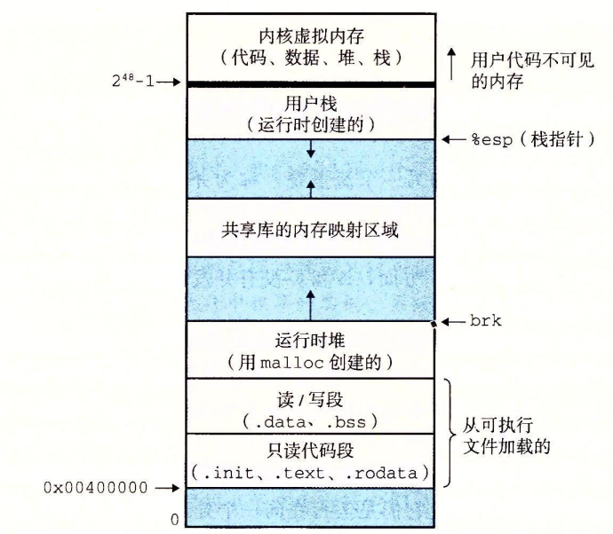

# 虚拟内存

## 1.虚拟内存介绍

在传统的操作系统中，多个进程会共享 CPU 和主存资源，但是共享主存可能会带来一些问题：

- 如果太多的进程需要太多的内存，**当其中一个进程 A 加载所需要的内存超过了可用的物理内存**，那么进程 A 就无法运行。传统的操作系统中，需要将一个程序完全加载到内存中才能运行
- 如果某个进程 A 不小心写了另外一个进程 B 使用的内存，那么进程 B 可能会失败的莫名奇妙。

现代操作系统提供了一种对主存的抽象概念，叫做虚拟内存（VM）。虚拟内存是**硬件异常、硬件地址翻译（MMU）、主存、磁盘文件（包括 Swap 交换区）和内核软件**的完美交互，它为每个进程提供了一个大的、一致的和私有的地址空间。通过一个很清晰的机制，虚拟内存提供了三个重要的能力：

- 它将**主存看成是一个存储在磁盘上的地址空间的高速缓存**，在主存中只保存活动区域，并根据需要在磁盘和主存之间来回传送数据，通过这种方式，它高效地使用了主存。**如果程序访问的地址存在于内存中，可以看成是缓存命中**；否则产生一个缺页中断，将页面从磁盘写入到内存中。
- 它为每个进程提供了一致的地址空间，从而简化了内存管理
- 它保护了每个进程的地址空间不被其他进程破坏

## 2.物理和虚拟寻址

计算机系统的主存被组织成一个由 **_M_** 个连续的字节大小的单元组成的数组。每字节都有一个唯一的**物理地址（Physical Address, PA）**。CPU 访问内存最自然的方式就是使用物理地址。我们把这种方式称为物理寻址（physical addressing）。

    

上图是一个物理寻址的示例，CPU 执行一个数据加载指令时，使用一个真实的物理地址 4，加载从地址 4 开始的 4 个字节，并返回给 CPU。不过，**现代处理器使用的是一种称为 虚拟寻址（virtual addressing）的寻址形式**。

    

上图是一个虚拟寻址的示例，CPU 同样执行一个数据加载 load 指令，使用一个虚拟地址（VA） 4100，它被转换成物理地址（PA） 4，然后返回数据字给 CPU 处理器。

使用虚拟寻址，CPU 通过生成一个虚拟地址 (Virtual Address，VA) 来访问主存，这个虚拟地址在被送到内存之前先转换成适当的物理地址。**将一个虚拟地址转换为物理地址的任务叫做地址翻译 (address translation)**。CPU 芯片上叫做内存管理单元（Memory Management Unit，MMU）的专用硬件，利用存放在**主存中的查询表 (即页表)来动态翻译**虚拟地址，该表的内容由操作系统管理。

> 地址空间（address space）是一个非负整数地址的有序集合，地址空间的概念是很重要的，因为它**清楚地区分了数据对象（字节）和它们的属性（地址）**（地址是字节数据的一个属性）。一旦认识到了这种区别，那么我们就可以将其推广，**允许每个数据对象有多个独立的地址，其中每个地址都选自一个不同的地址空间**。这就是虚拟内存的基本思想。主存中的每字节都有一个选自虚拟地址空间的虚拟地址和一个选自物理地址空间的物理地址。

## 3.虚拟内存作为缓存工具

概念上而言，虚拟内存被组织为一个由存放在磁盘上的 **_N_** 个连续的字节大小的单元组成的数组。每字节都有一个唯一的虚拟地址，作为到数组的索引。磁盘上数组的内容被缓存在主存中。和存储器层次结构中其他缓存一样，磁盘（较低层）上的数据被分割成块，这些块作为磁盘和主存（较高层）之间的传输单元。**VM 系统通过将虚拟内存分割为称为虚拟页（Virtual Page，VP）的大小固定的块来处理这个问题。每个虚拟页的大小为 $P = 2^p$ 字节**。类似地，物理内存被分割为物理页（Physical Page，PP），大小也为 $P$ 字节（物理页也被称为页帧 (page frame)）。

在任意时刻，虚拟页面的集合都分为三个不相交的子集：

- 未分配的：VM 系统还未分配（或者创建）的页。未分配的块没有任何数据和它们相关联。
- 缓存的：当前已缓存在物理内存中的已分配页。
- 未缓存的：未缓存在物理内存中的已分配页。

    

### 3.1 DRAM 缓存的组织结构

我们接下来将使用术语 SRAM 缓存来表示位于 CPU 和主存之间的 L1、L2 和 L3 高速缓存，并且用术语 DRAM 缓存来表示虚拟内存系统的缓存，它在主存中缓存虚拟页。

在存储层次结构中，DRAM 缓存的位置（位于 SRAM 和磁盘之间）对它的组织结构有很大的影响。回想一下，DRAM 比 SRAM 要慢大约 10 倍，而磁盘要比 DRAM 慢大约 100000 多倍。**因此，DRAM 缓存中的不命中比起 SRAM 缓存中的不命中要昂贵得多，这是因为 DRAM 缓存不命中要由磁盘来服务**，而 SRAM 缓存不命中通常是由基于 DRAM 的主存来服务的。而且，从磁盘的一个扇区读取第一个字节的时间开销比起读这个扇区中连续的字节要慢大约 100000 倍，**即从磁盘中分散多次读取多个小字节的时间要远多于从磁盘连续读取相同数目字节所耗费的时间**。**归根到底，DRAM 缓存的组织结构设计完全是由巨大的不命中开销驱动的**，基本的设计思想如下所示：

- 因为大的不命中处罚和访问第一个字节的开销，虚拟页往往很大，通常是 4KB~2MB。
- 由于大的不命中处罚，DRAM 缓存是全相联的，即任何虚拟页都可以放置在任何的物理页中（**全相联映射的 Cache 的利用率高，块冲突率低**）。
- 不命中时的替换策略也很重要，因为替换错了虚拟页的处罚也非常之高（需要从磁盘写入数据到内存中）。因此，与硬件对 SRAM 缓存相比，操作系统对 DRAM 缓存使用了更复杂精密的替换算法。

### 3.2 Cache 映射方式

**Cache 的容量很小，它保存的内容只是主存内容的一个子集**，且 Cache 与主存的数据交换是以块为单位的。**为了把信息放到 Cache 中，必须应用某种函数把主存地址定位到 Cache 中，这称为地址映射**。在数据按这种映射关系装入 Cache 后，CPU 执行程序时，会将程序中的主存地址变换成 Cache 地址，这个变换过程叫做地址变换。

Cache 的地址映射方式有直接映射、全相联映射和组相联映射。假设某台计算机主存容量为 1MB，被分为 2048 块，每块 512B；Cache 容量为 8KB，被分为 16 块，每块也是 512B。下面以此为例介绍三种基本的地址映射方法。

#### 3.2.1 直接映射

直接映射的 Cache 组织如下图所示。主存中的一个块只能映射到 Cache 的某一特定块中去。例如，主存的第 0 块、第 16 块、……、第 2032 块，只能映射到 Cache 的第 0 块；而主存的第 1 块、第 17 块、……、第 2033 块，只能映射到 Cache 的第 1 块。

    

直接映射是最简单的地址映射方式，它的硬件简单，成本低，地址变换速度快，**而且不涉及替换算法问题**。但是这种方式不够灵活，**Cache 的存储空间得不到充分利用**，每个主存块只有一个固定位置可存放，**容易产生冲突**，使 Cache 效率下降，因此只适合大容量 Cache 采用。例如，如果一个程序需要重复引用主存中第 0 块与第 16 块，最好将主存第 0 块与第 16 块同时复制到 Cache 中，**但由于它们都只能复制到 Cache 的第 0 块中去，即使 Cache 中别的存储空间空着也不能占用**，因此这两个块会不断地交替装入 Cache 中，导致命中率降低。

#### 3.2.2 全相联映射

下图是全相联映射的 Cache 组织，**主存中任何一块都可以映射到 Cache 中任何一块上去**。

    

全相联映射方式比较灵活，主存的各块可以映射到 Cache 的任一块中，**Cache 的利用率高，块冲突概率低**，只要淘汰 Cache 中的某一块，即可调入主存的任一块。但是，由于 Cache 比较电路的设计和实现比较困难，这种方式只适合于小容量 Cache 采用。

#### 3.2.3 组相联映射

**组相联映射实际上是直接映射和全相联映射的折中方案**，其组织结构如下图所示。主存和 Cache 都分组，主存中一个组内的块数与 Cache 中的分组数相同，**组间采用直接映射，组内采用全相联映射**。也就是说，主存块存放到哪个组是固定的，至于存到该组哪一块则是灵活的。例如，主存分为 256 组，每组 8 块，Cache 分为 8 组，每组 2 块。

    

主存中的各块与 Cache 的组号之间有固定的映射关系，但可自由映射到对应 Cache 组中的任何一块。例如，主存中的第0块、第8块……均映射于 Cache 的第0组，但可映射到 Cache 第0组中的第0块或第1块；主存的第1块、第9块……均映射于 Cache 的第1组，但可映射到 Cache 第1组中的第2块或第3块。

常采用的组相联结构 Cache，每组内有 2、4、8、16 块，**称为 2 路、4 路、8 路、16 路组相联 Cache**。组相联结构 Cache 是前两种方法的折中方案，适度兼顾二者的优点，尽量避免二者的缺点，因而得到普遍采用。

### 3.3 页表

同任何缓存一样，**虚拟内存系统必须有某种方法来判定一个虚拟页是否缓存在 DRAM 中的某个地方**。如果是，系统还必须确定这个虚拟页存放在哪个物理页中。如果不命中，系统必须判断这个虚拟页存放在磁盘的哪个位置，在物理内存中选择一个牺牲页，并将虚拟页从磁盘复制到DRAM中，替换这个牺牲页。

这些功能是由软硬件联合提供的，包括操作系统软件、MMU（内存管理单元）中的地址翻译硬件和一个**存放在物理内存中**叫做页表 (page table) 的数据结构，页表将虚拟页映射到物理页。每次地址翻译硬件将一个虚拟地址转换为物理地址时，都会读取页表。操作系统负责维护页表的内容，**以及在磁盘与 DRAM 之间来回传送页（物理页的换入和换出）**。

    

上图展示了一个页表的基本组织结构，页表就是一个页表条目（Page Table Entry, PTE）的数组。我们将假设每个 PTE 是由一个有效位（valid bit）和一个 n 位地址字段组成的。**有效位表明了该虚拟页当前是否被缓存在 DRAM 中**。

- 如果设置了有效位，那么地址字段就表示 **_DRAM_** 中相应的物理页的起始位置，这个物理页中缓存了该虚拟页。
- 如果没有设置有效位，那么一个空地址表示这个虚拟页还未被分配。
- 如果没有设置有效位，并且地址不为空，则这个地址就指向该虚拟页在磁盘上的起始位置。

在上图中，VP3 和 VP6 已经被分配了，或者说已经和磁盘上的数据建立了联系，但是还未被缓存到物理内存 DRAM 中。

### 3.4 页命中

当 CPU 想要读包含在 VP2 中的虚拟内存的一个字时，地址翻译硬件**将虚拟地址作为一个索引**来定位 PTE2，并从内存中读取它。因为设置了有效位，那么地址翻译硬件就知道 VP2 是缓存在内存中的。所以它使用 PTE 中的物理内存地址（该地址指向 PP1 中缓存页的起始位置），构造出这个字的物理地址。

    

### 3.5 缺页

在虚拟内存中，**DRAM 缓存不命中称为缺页（page fault）**，下图为在缺页之前页表的状态。CPU 引用了 VP3 中的一个字，VP3并未缓存在 DRAM 中。地址翻译硬件从内存中读取 PTE3，从有效位推断出 VP3 未被缓存，并且触发一个缺页异常。**缺页异常调用内核中的缺页异常处理程序，该程序会选择一个牺牲页，在此例中就是存放在 PP3 中的 VP4**。如果 VP4 已经被修改了，那么内核就会将它复制回磁盘。

    

接下来，内核从磁盘复制 VP3 到内存中的 PP3，更新 PTE3，随后返回。当异常处理程序返回时，**它会重新启动导致缺页的指令，该指令会把导致缺页的虚拟地址重发送到地址翻译硬件**。但是现在，VP3 已经缓存在主存中了，那么页命中也能由地址翻译硬件正常处理了。下图为进行缺页处理之后的页表状态：

    

在虚拟内存中，在磁盘和内存之间传送页的活动叫做交换（swapping）或者页面调度（paging）。页从磁盘换入（或者页面调入）DRAM 和从 DRAM 换出（或者页面调出）磁盘。一直等待，直到最后时刻，**也就是当有不命中发生时，才换入页面的这种策略称为按需页面调度（demand paging）**。所有现代系统都使用的是按需页面调度的方式。

### 3.6 分配页面

下图展示了当操作系统分配一个新的虚拟内存页时对页表的影响，例如，调用 malloc 的结果。在这个示例中，**VP5 的分配过程是在磁盘上创建空间并更新 PTE5**，使它指向磁盘上这个新创建的页面。

    

### 3.7 又是局部性救了我们

大部分人在了解了虚拟内存的概念之后，第一印象通常是它的效率应该非常低，**因为不命中处罚很大，页面调度（换入和换出）可能会破坏程序性能**。但是由于程序的局部性，虚拟内存工作的相当好。

尽管在整个运行过程中程序引用的不同页面的总数可能超出物理内存总的大小，但是**局部性原则保证了在任意时刻，程序将趋向于在一个较小的活动页面 (active page) 集合上工作，这个集合叫做工作集 (working set) 或者常驻集合 (resident set)**。在初始开销，也就是将工作集页面调度到内存中之后，接下来对这个工作集的引用将导致命中，而不会产生额外的磁盘流量。只要我们的程序有好的时间局部性，虚拟内存系统就能工作得相当好。

但是，当然不是所有的程序都能展现良好的时间局部性。如果工作集的大小超出了物理内存的大小，那么程序将产生一种不幸的状态，叫做抖动 (thrashing)，这时页面将不断地换进换出。因此如果一个程序性能慢得像爬一样，那么聪明的程序员会考虑是不是发生了抖动。

## 4.虚拟内存作为内存管理的工具

在前面一节，我们看到虚拟内存是如何提供一种机制，利用 **_DRAM_** 缓存来自通常更大的虚拟地址空间的页面。下面介绍虚拟内存如何对内存来进行管理。

到目前为止，我们都假设有一个单独的页表，将一个虚拟地址空间映射到物理地址空间。实际上，**操作系统为每个进程提供了一个独立的页表，因而也就是一个独立的虚拟地址空间**。下图展示了基本思想。在这个示例中，进程 i 的页表将 VP1 映射到 PP2，VP2 映射到 PP7。相似地，进程 j 的页表将 VP1 映射到 PP7，VP2 映射到 PP10。**注意，多个虚拟页面可以映射到同一个共享物理页面上**。

    

按需页面调度（只有虚拟页面缓存不命中才会从磁盘换入页面到物理内存中）和独立的虚拟地址空间的结合，对系统中内存的使用和管理造成了深远的影响。特别地，VM 简化了链接和加载、代码和数据共享，以及应用程序的内存分配。

### 4.1 简化链接

简化链接。**独立的地址空间允许每个进程的内存映像使用相同的基本格式**，而不管代码和数据实际存放在物理内存的何处。例如，像我们在下图看到的，一个给定的 Linux 系统上的每个进程都使用类似的内存格式。

    

对于 64 位地址空间，代码段总是从虚拟地址 0x400000 开始。数据段跟在代码段之后，中间有一段符合要求的对齐空白。栈占据用户进程地址空间最高的部分，并向下生长。这样的一致性极大地简化了链接器的设计和实现，**允许链接器生成完全链接的可执行文件，这些可执行文件是独立于物理内存中代码和数据的最终位置的**。

### 4.2 简化加载

简化加载。虚拟内存还使得容易向内存中加载可执行文件和共享对象文件。要把目标文件中 .text 和 .data 节加载到一个新创建的进程中，Linux 加载器为代码和数据段分配虚拟页，把它们标记为无效的（即未被缓存到物理内存中），将页表条目指向目标文件中适当的位置。有趣的是，**加载器从不从磁盘到内存实际复制任何数据**。

在每个页初次被引用时，**要么是 CPU 取指令时引用的，要么是一条正在执行的指令引用一个内存位置时引用的，虚拟内存系统会按照需要自动地调入数据页**。

将一组连续的虚拟页映射到任意一个文件中的任意位置的表示法称作内存映射（memory mapping）。Linux 提供一个称为 mmap 的系统调用，允许应用程序自己做内存映射。

### 4.3 简化共享

简化共享。独立地址空间为操作系统提供了一个管理用户进程和操作系统自身之间共享的一致机制。一般而言，每个进程都有自己私有的代码、数据、堆以及栈区域，是不和其他进程共享的。在这种情况中，操作系统创建页表，将相应的虚拟页映射到不连续的物理页面。

然而，在一些情况中，还是需要进程来共享代码和数据。例如，每个进程必须调用相同的操作系统内核代码，而每个 C 程序都会调用 C 标准库中的程序，比如 printf。**操作系统通过将不同进程中适当的虚拟页面映射到相同的物理页面**，从而安排多个进程共享这部分代码的一个副本，而不是在每个进程中都包括单独的内核和 C 标准库的副本。

## 5.虚拟内存作为内存保护的工具

现代内存系统对内存进行如下保护：

- 不应该允许一个用户进程修改它的只读代码段。
- 不应该允许它读或修改任何内核中的代码和数据结构。
- 不应该允许它读或者写其他进程的私有内存。
- 不允许它修改任何与其他进程共享的虚拟页面，除非所有的共享者都显式地允许它这么做（通过调用明确的进程间通信系统调用）
  
就像我们所看到的，提供独立的地址空间使得区分不同进程的私有内存变得容易。但是，地址翻译机制可以以一种自然的方式扩展到提供更好的访问控制。因为每次 **_CPU_** 生成一个地址时，地址翻译硬件都会读一个 **_PTE_**，**所以通过在 PTE 上添加一些额外的许可位来控制对一个虚拟页面内容的访问十分简单**。下图展示了大致的思想：

    

在这个示例中，每个 PTE 中已经添加了三个许可位。SUP 位表示进程是否必须运行在内核(超级用户)模式下才能访问该页。运行在内核模式中的进程可以访问任何页面，但是运行在用户模式中的进程只允许访问那些 SUP 为 0 的页面。READ 位和 WRITE 位控制对页面的读和写访问。例如，如果进程 i 运行在用户模式下，那么它有读 VP0 和读写 VP1 的权限。然而，不允许它访问 VP2。

如果一条指令违反了这些许可条件，那么 CPU 就触发一个一般保护故障，称为 "段错误（segmentation fault）"。

## 6.地址翻译

下图展示了 MMU 如何利用页表来实现这种映射。CPU 中的一个控制寄存器，页表基址寄存器（Page Table Base Register，PTBR）指向当前页表。n 位的虚拟地址包含两个部分：一个 p 位的虚拟页面偏移（Virtual Page Offset，VPO）和一个（n一p）位的虚拟页号（Virtual Page Number，VPN）。

MMU 利用 VPN 来选择适当的 PTE，**然后将页表条目 PTE 中的物理页号（Physical Page Number, PPN）和虚拟地址中的 VPO 串联起来，就得到相应的物理地址**。注意，因为物理和虚拟页面都是 $P$ 字节的，所以物理页面偏移（Physical Page Offset, PPO）和 VPO 是相同的。

### 6.1 当页面命中时，CPU 硬件的执行步骤

- 第 1 步：处理器生成一个虚拟地址 VA，并把它传送给 MMU。
- 第 2 步：MMU 生成 PTE 地址，并从高速缓存/主存请求得到它。
- 第 3 步：高速缓存/主存向 MMU 返回 PTE。
- 第 4 步：MMU 构造物理地址（物理页号 + 虚拟页面偏移量），并把它传送给高速缓存/主存。
- 第 5 步：高速缓存/主存返回所请求的数据字给处理器。

    

### 6.2 当页面不命中时，CPU 硬件的执行步骤

页面命中完全是由硬件来处理的，与之不同的是，处理缺页要求硬件和操作系统内核协作完成，如下图所示：

- 第 1 步到第 3 步：和上一小节中的第 1 步到第 3 步相同。
- 第 4 步：PTE 中的有效位是零，所以 MMU 触发了一次异常，传递 CPU 中的控制到操作系统内核中的缺页异常处理程序。
- 第 5 步：缺页处理程序使用页面替换算法**确定出物理内存中的牺牲页**，如果这个页面已经被修改了，则把它换出到磁盘。
- 第 6 步：缺页处理程序页面调人新的页面，并更新内存中的 PTE。
- 第 7 步：**进程重新执行导致缺页的指令**，CPU 将引起缺页的虚拟地址重新发送给 MMU。因为虚拟页面现在缓存在物理内存中，所以就会命中。

    

### 6.3 结合高速缓存和虚拟内存

下图展示了一个物理寻址的高速缓存如何和虚拟内存结合起来。主要的思路是地址翻译发生在高速缓存查找之前。注意，页表条目（PTE）可以缓存在 L1 Cache 中，就像其他的数据字一样。

> 在同时使用虚拟内存和 SRAM 高速缓存（L1、L2、L3 缓存）的系统中，一般使用物理地址来访问 SRAM 缓存，这是因为使用物理寻址，**多个进程同时在高速缓存中有存储块和共享来自相同虚拟页面的块成为很简单的事情**。而且，高速缓存无需处理保护问题，因为访问权限的检查是地址翻译过程的一部分。

    

### 6.4 利用 TLB 加速地址翻译

正如我们看到的，每次 CPU 产生一个虚拟地址，MMU 就必须查阅一个 PTE，以便将虚拟地址翻译为物理地址。在最糟糕的情况下，这会要求从内存多取一次数据，代价是几十到几百个周期。**所以，MMU 中会包括一个关于 PTE 的小缓存**，称为 Translation Lookaside Buffer, TLB。

下图展示了当 TLB 命中时（通常情况）所包括的步骤，当 TLB 命中时，所有的地址翻译步骤都是在芯片上的 MMU 中执行的，因此非常快：

- 第1步：CPU 产生一个虚拟地址。
- 第 2 步和第 3 步：MMU 从 TLB 中取出相应的 PTE。
- 第 4 步：MMU 将这个虚拟地址翻译成一个物理地址，并且将它发送到高速缓存/主存。
- 第 5 步：高速缓存/主存将所请求的数据字返回给 CPU。

    

当 TLB 不命中时，MMU 必须从 L1 缓存中取出相应的 PTE，如下图所示。新取出的 PTE 存放在 TLB 中，可能会覆盖一个已经存在的条目。

### 6.5 多级页表

到目前为止，我们一直假设系统中进程只用一个单独的页表来进行地址翻译。但是**如果我们有一个 32 位的地址空间、4KB 的页面和一个 4 字节的 PTE**，那么即使应用所实际使用的只是虚拟地址空间中很小的一部分，也总是需要一个 4MB 的页表驻留在内存中。

用来压缩页表的常用方式是使用层次结构的页表，如下图所示，**一级页表中的每个 PTE 负责映射虚拟地址空间中一个 4MB 的片（chunk）**，这里每一片都是由 1024 个连续的虚拟内存页面组成的。比如，PTE0 映射第一片，PTE1 映射接下来的一片，以此类推。假设地址空间是 4GB，1024 个一级 PTE 已经足够覆盖整个空间了。

    

**如果片 i 中的每个页面都未被分配，那么一级 PTEi 就为空**。例如，上图中，片 2～7 是未被分配的。然而，**如果在片 i 中至少有一个页是分配了的，那么一级 PTEi 就指向一个二级页表的基址**。例如，在上图中，片 0、1 和 8 的所有或者部分已被分配，所以它们的一级 PTE 就指向二级页表。

**二级页表中的每个 PTE 都负责映射一个 4KB 的虚拟内存页面**，就像我们查看只有一级的页表一样。注意，使用 4 字节的 PTE，每个一级和二级页表都是 4KB 字节，这刚好和一个页面的大小是一样的。

这种方法从两个方面减少了内存要求：

- **如果一级页表中的一个 PTE 是空的，那么相应的二级页表就根本不会存在**。这代表着一种巨大的潜在节约，因为对于一个典型的程序，4GB 的虚拟地址空间的大部分都会是未分配的。
- **只有一级页表才需要总是在主存中**；虚拟内存系统可以在需要时创建、页面调入或调出二级页表，这就减少了主存的压力；只有最经常使用的二级页表才需要缓存在主存中。

下图描述了使用 k 级页表层次结构的地址翻译。虚拟地址被划分成为 k 个 VPN 和 1 个 VPO。每个 VPNi 都是一个到第 i 级页表的索引。第 j 级页表中的每个 PTE，都指向第 j + 1 级的某个页表的基址。**第 k 级页表中的每个 PTE 包含某个物理页面的 PPN**，或者一个磁盘块的地址。为了构造物理地址，在能够确定 PPN 之前，MMU 必须访问 k 个 PTE。

    

### 6.6 地址翻译总结

现在，我们通过一个具体的端到端的地址翻译示例，来综合一下上述内容（TLB 缓存，地址翻译，**_SRAM_** 缓存），这个示例运行在有一个 TLB 缓存和 L1 d-cache SRAM 缓存1的小系统上。为了保证可管理性，我们做出如下假设：

1. 内存是按字节寻址的
2. 内存访问是针对 1 字节的字的（不是 4 字节的字）
3. 虚拟地址是 14 位长的（n = 14）
4. 物理地址是 12 位长的（m = 12）
5. 页面大小是 64 字节（P = 64）。
6. TLB 是四路组相联的，总共有 16 个条目。
7. L1 d-cache 是物理寻址、直接映射的，行大小为 4 字节，而总共有 16 个组。

下图展示了虚拟地址和物理地址的格式。因为每个页面是 $2^8=64$ 字节，**所以虚拟地址和物理地址的低 6 位分别作为 VPO 和 PPO**。虚拟地址的高 8 位作为 VPN。物理地址的高 6 位作为 PPN。

    

TLB 是利用 VPN 的位进行虚拟寻址的。因为 TLB 有 4 个组，所以 **VPN 的低 2 位就作为组索引**（TLBI）。VPN 中剩下的高 6 位作为标记（TLBT），用来**区别可能映射到同一个 TLB 组的不同的 VPN**。TLB 的结构如下所示，TLB 采用思路组相连。

    

另外，页表采用单级页表设计，这里只显示完整页表（$2^8=256$ 个页表 PTE 条目）的前 16 个条目，单级页表的结构如下所示：

    

最后，L1、L2、L3 cache 都采用物理地址中的字段来进行寻址，因为每个块都是 4 字节，所以物理地址的低 2 位作为块偏移（$CO$）。因为有 16 组，所以接下来的 4 位 就用来表示组索引（$CI$）。剩下的 6 位作为标记（$CT$）（用来验证缓存是否命中）。

    

接下来，我们模拟 CPU 加载 0x03d4 （虚拟地址）处的字节数据，VA 地址被送入到 MMU 中进行翻译，开始时，MMU 从虚拟地址中抽取出 VPN（0x0F），并且检查 TLB，看它是否缓存有对应的 PTE 副本（**TLB 缓存页表项**）。TLB 从 VPN 中抽取出 TLB 组索引（0x03）和 TLB 标记（0x3），组 0x03 的第二个条目有效匹配，所以命中，然后将缓存的 PPN（0x0d）返回给 MMU。虚拟地址 VA 的结构如下所示：

    

接下来，MMU 将来自 TLB 的 PPN（0x0d）和来自虚拟地址的 VPO（0x14）连接起来，这样就形成了物理地址 0x354：

    

然后 MMU 将物理地址 PA 发送给 L1 d-cache，缓存从物理地址中抽取出缓存块偏移 $CO$、缓存组索引 $CI$ 以及缓存标志 $CT$。根据前面的 L1 d-cache 结构，第 0x05 组中的标志 0x0d 与 $CT$ 相同，因此读出块偏移 $CO$（0x0）处的数据（也就是第一个块中的数据） 36 返回给 CPU。

## 7.Intel Core i7/Linux 内存系统

### 7.1 Intel Core i7 内存结构

最后我们研究一个运行 Linux 的 Intel Core i7。虽然底层的 Haswell 微体系结构允许完全的64 位虚拟和物理地址空间，**而现在的 Core i7 实现支持 48 位（256TB）虚拟地址空间和 52 位（4PB）物理地址空间**，还有一个兼容模式，支持 32 位（4GB）虚拟和物理地址空间。

下图给出了 Core i7 内存系统的重要部分。处理器封装（processor package）包括四个核、一个大的所有核共享的 L3 高速缓存，以及一个 DDR3 内存控制器。每个核包含一个层次结构的 TLB、一个层次结构的数据和指令高速缓存，以及一组快速的点到点链路。**TLB 是虚拟寻址的，是四路组相联的**。L1、L2 和 L3 高速缓存是物理寻址的，块大小为 64 字节。**L1 和 L2 是 8 路组相联的，而 L3 是 16 路组相联的**。**页大小可以在启动时被配置为 4KB 或 4MB。Linux 使用的是4KB 的页**。

Core i7 的内存系统结构如下所示：

    

Core i7 的地址翻译流程如下所示：

    

下图介绍了 Core i7 MMU 如何使用四级的页表来将虚拟地址翻译成物理地址。36 位 VPN 被划分成四个 9 位的片，**每个片被用作到一个页表的偏移量**。CR3 寄存器包含 L1 页表的物理地址。VPN1 提供到一个 L1 PTE 的偏移量，**这个 PTE 包含 L2 页表的基地址**。VPN2 提供到一个 L2 PTE 的偏移量，以此类推。

    

### 7.2 Linux 虚拟内存系统

