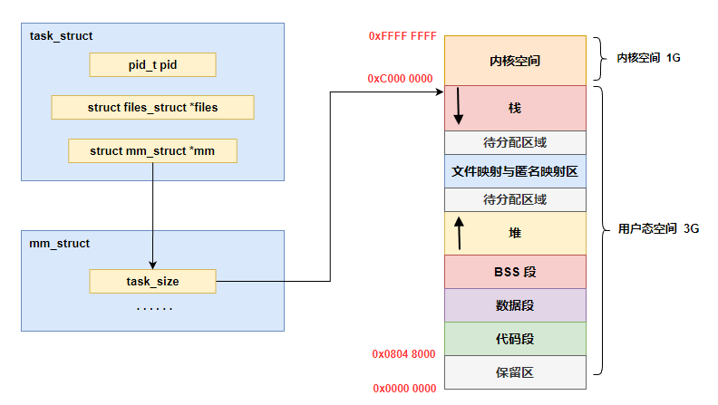
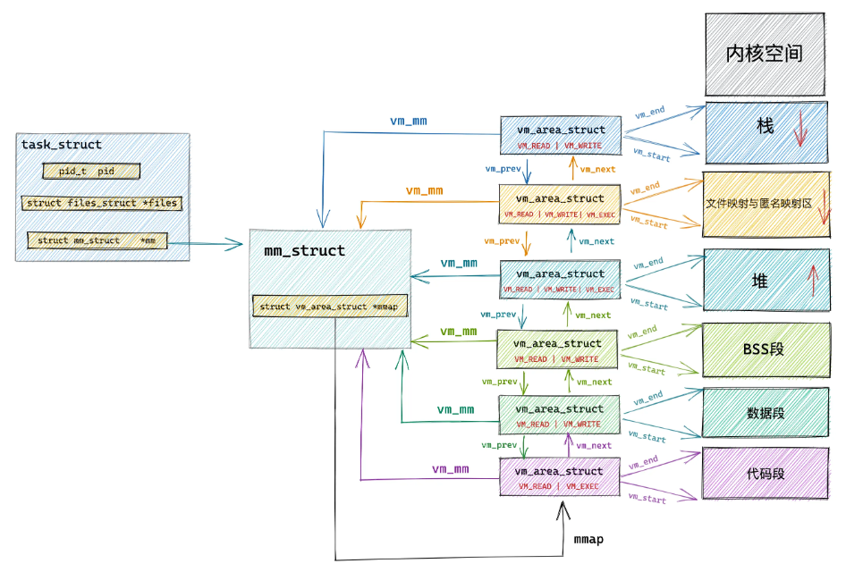
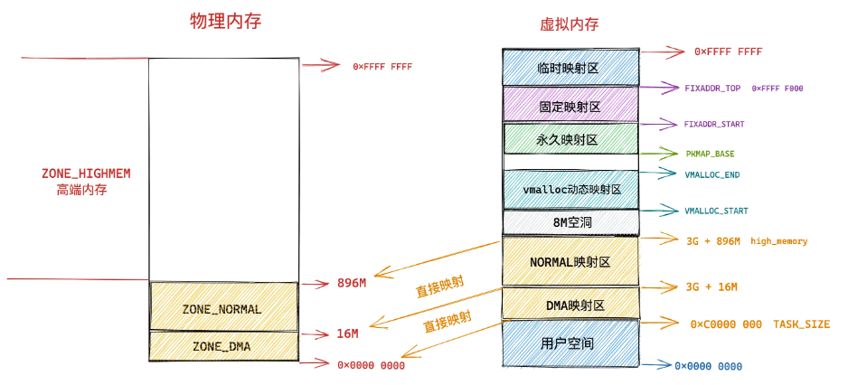

# Linux 虚拟内存

## 一、进程虚拟内存空间

为了防止多进程运行时造成的内存地址冲突，内核引入了虚拟内存地址，为每个进程提供了一个独立的虚拟内存空间，使得进程以为自己独占全部内存资源。

> 本小节只讨论进程用户虚拟内存空间的布局，把内核态的虚拟内存空间当做一个黑盒。

首先一个进程运行起来是为了执行我们交代给进程的工作，执行这些工作的步骤我们通过程序代码事先编写好，然后**编译成二进制文件存放在磁盘中**，CPU 会执行二进制文件中的机器码来驱动进程的运行。所以在进程运行之前，这些存放在二进制文件中的机器码需要被加载进内存中，而用于存放这些机器码的虚拟内存空间叫做代码段。

在程序运行起来之后，需要操作变量，在程序代码中我们通常会定义大量的全局变量和静态变量，这些全局变量在程序编译之后也会存储在二进制文件中，在程序运行之前，这些全局变量也需要被加载进内存中供程序访问。所以在虚拟内存空间中也需要一段区域来存储这些全局变量。**函数中定义的局部变量保存在栈中，而使用 malloc 动态分配内存空间的变量保存在堆中**。

- 那些在代码中被我们指定了初始值的全局变量和静态变量在虚拟内存空间中的存储区域我们叫做数据段。
- 那些没有指定初始值的**全局变量和静态变量**在虚拟内存空间中的存储区域我们叫做 BSS 段。这些未初始化的全局变量被加载进内存之后会被初始化为 0 值。

上面介绍的这些全局变量和静态变量都是在编译期间就确定的，但是我们程序在运行期间往往需要动态的申请内存，所以在虚拟内存空间中也需要一块区域来存放这些动态申请的内存，这块区域就叫做堆。

除此之外，我们的程序在运行过程中还需要**依赖动态链接库**，这些动态链接库以 .so 文件的形式存放在磁盘中，比如 C 程序中的 glibc，里边对系统调用进行了封装。glibc 库里提供的用于**动态申请堆内存的 malloc 函数就是对系统调用 _sbrk_ 和 _mmap_ 的封装**。这些动态链接库也有自己的对应的代码段，数据段，BSS 段，也需要一起被加载进内存中。

还有用于内存文件映射的系统调用 mmap，会将文件与内存进行映射，那么映射的这块内存（虚拟内存）也需要在虚拟地址空间中有一块区域存储。

这些动态链接库中的代码段，数据段，BSS 段，以及通过 mmap 系统调用映射的共享内存区，**在虚拟内存空间的存储区域叫做文件映射与匿名映射区**。

最后我们在程序运行的时候总该要调用各种函数吧，那么调用函数过程中使用到的局部变量和函数参数也需要一块内存区域来保存。这一块区域在虚拟内存空间中叫做栈。

现在进程的虚拟内存空间所包含的主要区域，我就为大家介绍完了，我们看到内核根据进程运行的过程中所需要不同种类的数据而为其开辟了对应的地址空间。分别为：

- 用于存放进程程序二进制文件中的机器指令的**代码段**。
- 用于存放程序二进制文件中定义的全局变量和静态变量的**数据段和 BSS 段**。
- 用于在程序运行过程中动态申请内存的**堆**。
- 用于存放动态链接库以及内存映射区域的**文件映射与匿名映射区**。
- 用于存放函数调用过程中的**局部变量和函数参数的栈**。

进程的虚拟地址空间大致可以表示如下所示：

<div align="center">
    
</div>

## 二、Linux 进程虚拟地址空间

### 1.32 位机器上进程虚拟内存空间分布

在 32 位机器上，指针的寻址范围为 $2^{32}$，所能表达的虚拟内存空间为 4 GB。所以在 32 位机器上进程的虚拟内存地址范围为：$0x0000 0000$ $-$ $0xFFFF FFFF$。

其中用户态虚拟内存空间为 3 GB，虚拟内存地址范围为：$0x0000 0000 - 0xC000 000$。内核态虚拟内存空间为 1 GB，虚拟内存地址范围为：$0xC000 000 - 0xFFFF FFFF$。

<div align="center">
    
</div>

但是用户态虚拟内存空间中的代码段并不是从 $0x0000$ $0000$ 地址开始的，而是从 $0x0804$ $8000$ 地址开始。

$0x0000$ $0000$ 到 $0x0804$ $8000$ 这段虚拟内存地址是一段不可访问的保留区，**因为在大多数操作系统中，数值比较小的地址通常被认为不是一个合法的地址**，这块小地址是不允许访问的。比如在 C 语言中我们通常会将一些无效的指针设置为 NULL，指向这块不允许访问的地址。

保留区的上边就是代码段和数据段，它们是从程序的二进制文件中直接加载进内存中的，BSS 段中的数据也存在于二进制文件中，因为内核知道这些数据是没有初值的，所以在二进制文件中只会记录 BSS 段的大小，在加载进内存时会生成一段 0 填充的内存空间。

紧挨着 BSS 段的上边就是我们经常使用到的堆空间，从图中的箭头我们可以知道在堆空间中地址的增长方向是从低地址到高地址增长。

**内核中使用 start_brk 标识堆的起始位置，brk 标识堆当前的结束位置**。当堆申请新的内存空间时，只需要将 brk 指针增加对应的大小，回收地址时减少对应的大小即可。比如当我们通过 malloc 向内核申请很小的一块内存时（128K 之内），就是通过改变 brk 位置实现的。

堆空间的上边是一段待分配区域，用于扩展堆空间的使用。接下来就来到了文件映射与匿名映射区域。进程运行时所依赖的动态链接库中的代码段，数据段，BSS 段就加载在这里。还有我们调用 mmap 映射出来的一段虚拟内存空间也保存在这个区域。注意：**在文件映射与匿名映射区的地址增长方向是从高地址向低地址增长**。

接下来用户态虚拟内存空间的最后一块区域就是栈空间了，在这里会保存函数运行过程所需要的局部变量以及函数参数等函数调用信息。**栈空间中的地址增长方向是从高地址向低地址增长**。每次进程申请新的栈地址时，其地址值是在减少的。

**在内核中使用 _start_stack_ 标识栈的起始位置，RSP 寄存器中保存栈顶指针 _stack pointer_，RBP 寄存器中保存的是栈基地址**。

在栈空间的下边也有一段待分配区域用于扩展栈空间，在栈空间的上边就是内核空间了，进程虽然可以看到这段内核空间地址，但是就是不能访问。

### 2.64 位机器上进程虚拟内存空间分布

之前介绍的 32 位虚拟内存空间布局和本小节即将要介绍的 64 位虚拟内存空间布局都可以通过 cat /proc/pid/maps 或者 pmap pid 来查看某个进程的实际虚拟内存布局。

我们知道在 32 位机器上，指针的寻址范围为 $2^{32}$，所能表达的虚拟内存空间为 4 GB。那么我们理所应当的会认为在 64 位机器上，指针的寻址范围为 $2^{64}$，所能表达的虚拟内存空间为 16 EB 。虚拟内存地址范围为：$0x0000$ $0000$ $0000$ $0000$ $0000$ - $0xFFFF$ $FFFF$ $FFFF$ $FFFF$。

事实上在目前的 64 位系统下只使用了 48 位来描述虚拟内存空间，寻址范围为 $2^{48}$，所能表达的虚拟内存空间为 256TB。其中低 128T 表示用户态虚拟内存空间，虚拟内存地址范围为：$0x0000$ $0000$ $0000$ $0000$ — $0x0000$ $7FFF$ $FFFF$ $FFFF$。

高 128TB 表示内核态虚拟内存空间，虚拟内存地址范围为：$0xFFFF$ $8000$ $0000$ $0000$ — $0xFFFF$ $FFFF$ $FFFF$ $FFFF$。这样一来就在用户态虚拟内存空间与内核态虚拟内存空间之间形成了一段 $0x0000$ $7FFF$ $FFFF$ $FFFF$ — $0xFFFF$ $8000$ $0000$ $0000$ 的地址空洞，我们把这个空洞叫做 canonical address 空洞。

<div align="center">
    
</div>

> **x86-64 address spaces**
> The x86-64 architecture is 64-bit: registers (and addresses) are 64 bits wide. However, virtual addresses on current x86-64 processors **only have 48 meaningful bits**. This means that not all 64-bit patterns correspond to meaningful virtual addresses.
> 
> Bit patterns that are valid addresses are called **canonical addresses**. The x86-64 architecture divides canonical addresses into two groups, low and high. Low canonical addresses range from 0x0000'0000'0000'0000 to 0x0000'7FFF'FFFF'FFFF. High canonical addresses range from 0xFFFF'8000'0000'0000 to 0xFFFF'FFFF'FFFF'FFFF. 

在理解了 canonical address 这个概念之后，我们再来看下 64 位 Linux 系统下的真实虚拟内存空间布局情况：

<div align="center">
    
</div>

从上图中我们可以看出 64 位系统中的虚拟内存布局和 32 位系统中的虚拟内存布局大体上是差不多的。主要不同的地方有三点：

- canonical address 空洞：在这段范围内的虚拟内存地址是不合法的；
- 在代码段跟数据段的中间**还有一段不可以读写的保护段**，它的作用是**防止程序在读写数据段的时候越界访问到代码段**，这个保护段可以让越界访问行为直接崩溃，防止它继续往下运行；
- 用户态虚拟内存空间与内核态虚拟内存空间分别占用 128T，其中低 128T 分配给用户态虚拟内存空间，高 128T 分配给内核态虚拟内存空间；

## 三、进程虚拟内存空间的管理

无论是在 32 位机器上还是在 64 位机器上，进程虚拟内存空间的核心区域分布的相对位置是不变的，它们都包含下图所示的这几个核心内存区域，只是在不同机器上的绝对位置分布有所不同。

<div align="center">
    
</div>

首先我们讲解进程在内核中的描述符 **task_struct** 结构。

```c{.line-numbers}
struct task_struct {
        // 进程id
        pid_t pid;
        // 用于标识线程所属的进程 pid
        pid_t tgid;
        // 进程打开的文件信息
        struct files_struct *files;
        // 内存描述符表示进程虚拟地址空间
        struct mm_struct *mm;

        .......... 省略 .......
}
```

在进程描述符 **task_struct** 结构中，有一个专门描述进程虚拟地址空间的内存描述符 **mm_struct** 结构，这个结构体中包含了前面介绍的进程虚拟内存空间的全部信息。每个进程都有唯一的 **mm_struct** 结构体，**也就是前边提到的每个进程的虚拟地址空间都是独立，互不干扰的**。

当我们调用 fork() 函数创建进程的时候，表示进程地址空间的 **mm_struct** 结构会随着进程描述符 **task_struct** 的创建而创建。

```c{.line-numbers}
long _do_fork(unsigned long clone_flags, unsigned long stack_start,
          unsigned long stack_size, int __user *parent_tidptr,
          int __user *child_tidptr, unsigned long tls) {
        ......... 省略 ..........
    struct pid *pid;
    struct task_struct *p;

        ......... 省略 ..........
    // 为进程创建 task_struct 结构，用父进程的资源填充 task_struct 信息
    p = copy_process(clone_flags, stack_start, stack_size, child_tidptr, NULL, trace, tls, NUMA_NO_NODE);

         ......... 省略 ..........
}
```

随后会在 copy_process 函数中创建 task_struct 结构，并拷贝父进程的相关资源到新进程的 task_struct 结构里，其中就包括拷贝父进程的虚拟内存空间 mm_struct 结构。**这里可以看出子进程在新创建出来之后它的虚拟内存空间是和父进程的虚拟内存空间一模一样的，直接拷贝过来**。

```c{.line-numbers}
static __latent_entropy struct task_struct *copy_process(unsigned long clone_flags,
        unsigned long stack_start, unsigned long stack_size, int __user *child_tidptr,
        struct pid *pid, int trace, unsigned long tls, int node) {

    struct task_struct *p;
    // 创建 task_struct 结构
    p = dup_task_struct(current, node);

    ....... 初始化子进程 ...........

    ....... 开始继承拷贝父进程资源  .......      
    // 继承父进程打开的文件描述符
    retval = copy_files(clone_flags, p);
    // 继承父进程所属的文件系统
    retval = copy_fs(clone_flags, p);
    // 继承父进程注册的信号以及信号处理函数
    retval = copy_sighand(clone_flags, p);
    retval = copy_signal(clone_flags, p);
    // 继承父进程的虚拟内存空间
    retval = copy_mm(clone_flags, p);
    // 继承父进程的 namespaces
    retval = copy_namespaces(clone_flags, p);
    // 继承父进程的 IO 信息
    retval = copy_io(clone_flags, p);

    ...........省略.........
    // 分配 CPU
    retval = sched_fork(clone_flags, p);
    // 分配 pid
    pid = alloc_pid(p->nsproxy->pid_ns_for_children);

    ...........省略.........
}
```

这里我们重点关注 **copy_mm** 函数，正是在这里完成了子进程虚拟内存空间 **mm_struct** 结构的的创建以及初始化。

```c{.line-numbers}
static int copy_mm(unsigned long clone_flags, struct task_struct *tsk) {

    // 子进程虚拟内存空间 mm，父进程虚拟内存空间 oldmm
    struct mm_struct *mm, *oldmm;
    int retval;

    ...... 省略 ......

    tsk->mm = NULL;
    tsk->active_mm = NULL;
    // 获取父进程虚拟内存空间
    oldmm = current->mm;
    if (!oldmm)
        return 0;

    ...... 省略 ......
    // 通过 vfork 或者 clone 系统调用创建出的子进程（线程）和父进程共享虚拟内存空间
    if (clone_flags & CLONE_VM) {
        // 增加父进程虚拟地址空间的引用计数
        mmget(oldmm);
        // 直接将父进程的虚拟内存空间赋值给子进程（线程）
        // 线程共享其所属进程的虚拟内存空间
        mm = oldmm;
        goto good_mm;
    }

    retval = -ENOMEM;
    // 如果是 fork 系统调用创建出的子进程，则将父进程的虚拟内存空间以及相关页表拷贝到子进程中的 mm_struct 结构中。子进程的虚拟内存空间相当于复制了父进程的虚拟内存空间，但是由于页表也进行了复制，
    // 因此父子进程的虚拟内存区域被映射到相同的物理内存，不过子进程执行写时复制，最大限度地节省内存
    mm = dup_mm(tsk);
    if (!mm)
        goto fail_nomem;

good_mm:
    // 将拷贝出来的父进程虚拟内存空间 mm_struct 赋值给子进程
    tsk->mm = mm;
    tsk->active_mm = mm;
    return 0;

    ...... 省略 ......
}
```

copy_mm 函数首先会将父进程的虚拟内存空间 current->mm 赋值给指针 oldmm。然后通过 dup_mm 函数将父进程的虚拟内存空间以及相关页表拷贝到子进程的 mm_struct 结构中。最后将拷贝出来的 mm_struct 赋值给子进程的 task_struct 结构。

> 通过 fork() 函数创建出的子进程，**它的虚拟内存空间以及相关页表相当于父进程虚拟内存空间的一份拷贝**，直接从父进程中拷贝到子进程中。

而当我们通过 vfork 或者 clone 系统调用创建出的子进程，首先会设置 CLONE_VM 标识，这样来到 copy_mm 函数中就会进入 if (clone_flags & CLONE_VM) 条件中，在这个分支中会将父进程的虚拟内存空间以及相关页表直接赋值给子进程。**这样一来父进程和子进程的虚拟内存空间就变成共享的了。也就是说父子进程之间使用的虚拟内存空间是一样的，并不是一份拷贝**。

子进程共享了父进程的虚拟内存空间，**这样子进程就变成了我们熟悉的线程，是否共享地址空间几乎是进程和线程之间的本质区别**。Linux 内核并不区别对待它们，线程对于内核来说仅仅是一个共享特定资源的进程而已。

内核线程和用户态线程的区别就是内核线程没有相关的内存描述符 mm_struct，内核线程对应的 task_struct 结构中的 mm 域指向 Null，所以内核线程之间调度是不涉及地址空间切换的。

当一个内核线程被调度时，它会发现自己的虚拟地址空间为 NULL，虽然它不会访问用户态的内存，但是它会访问内核内存，聪明的内核会将调度之前的上一个用户态进程的虚拟内存空间 mm_struct 直接赋值给内核线程，因为内核线程不会访问用户空间的内存，它仅仅只会访问内核空间的内存，所以直接复用上一个用户态进程的虚拟地址空间就可以避免为内核线程分配 mm_struct 和相关页表的开销，以及避免内核线程之间调度时地址空间的切换开销。

> 父进程与子进程的区别，进程与线程的区别，以及内核线程与用户态线程的区别其实都是围绕着这个 mm_struct 展开的。

### 1.内核如何划分用户态和内核态虚拟内存空间

进程的虚拟内存空间分为两个部分：一部分是用户态虚拟内存空间，另一部分是内核态虚拟内存空间。如下所示：

<div align="center">
    
</div>

那么用户态的地址空间和内核态的地址空间在内核中是如何被划分的呢？这就用到了进程的内存描述符 **`mm_struct`** 结构体中的 **`task_size`** 变量，**`task_size`** 定义了用户态地址空间与内核态地址空间之间的分界线。

```c{.line-numbers}
struct mm_struct {
    unsigned long task_size;    /* size of task vm space */
}
```

我们知道在 32 位系统中用户态虚拟内存空间为 3 GB，虚拟内存地址范围为：$0x0000$ $0000$ — $0xC000$ $0000$。内核态虚拟内存空间为 1 GB，虚拟内存地址范围为：$0xC000$ $0000$ — $0xFFFF$ $FFFF$。

<div align="center">
    
</div>

32 位系统中用户地址空间和内核地址空间的分界线在 $0xC000$ $0000$ 地址处，那么自然进程的 **`mm_struct`** 结构中的 **`task_size`** 为 $0xC000$ $0000$。我们来看下内核在 `/arch/x86/include/asm/page_32_types.h` 文件中关于 **`TASK_SIZE`** 的定义。

```c{.line-numbers}
/*
 * User space process size: 3GB (default).
 */
#define TASK_SIZE        __PAGE_OFFSET
```

如下图所示：**`__PAGE_OFFSET`** 的值在 32 位系统下为 $0xC000$ $0000$：

<div align="center">
    
</div>

而在 64 位系统中，只使用了其中的低 48 位来表示虚拟内存地址。其中用户态虚拟内存空间为低 128 T，虚拟内存地址范围为：$0x0000$ $0000$ $0000$ $0000$ - $0x0000$ $7FFF$ $FFFF$ $FFFF$。内核态虚拟内存空间为高 128 T，虚拟内存地址范围为：$0xFFFF$ $8000$ $0000$ $0000$ - $0xFFFF$ $FFFF$ $FFFF$ $FFFF$。

<div align="center">
    
</div>

我们来看下内核在 /arch/x86/include/asm/page_64_types.h 文件中关于 **`TASK_SIZE`** 的定义：

```c{.line-numbers}
#define TASK_SIZE        (test_thread_flag(TIF_ADDR32) ? IA32_PAGE_OFFSET : TASK_SIZE_MAX)
#define TASK_SIZE_MAX        task_size_max()
#define task_size_max()        ((_AC(1,UL) << __VIRTUAL_MASK_SHIFT) - PAGE_SIZE)
#define __VIRTUAL_MASK_SHIFT    47
```

我们来看下在 64 位系统中内核如何来计算 TASK_SIZE，在 task_size_max() 的计算逻辑中 1 左移 47 位得到的地址是 $0x0000$ $8000$ $0000$ $0000$，然后减去一个 **`PAGE_SIZE`** （默认为 4K），就是 $0x0000$ $7FFF$ $FFFF$ $F000$，共 128T。所以在 64 位系统中的 **`TASK_SIZE`** 为 $0x0000$ $7FFF$ $FFFF$ $F000$。

**`PAGE_SIZE`** 定义在 /arch/x86/include/asm/page_types.h文件中：

```c{.line-numbers}
/* PAGE_SHIFT determines the page size */
#define PAGE_SHIFT        12
#define PAGE_SIZE        (_AC(1,UL) << PAGE_SHIFT)
```

**`TASK_SIZE`** 其实表示用户空间可以访问的最高地址宏 **`TASK_SIZE_MAX`**，可以看到可以访问的最高用户空间地址为 最高虚拟地址 (**`1<<__VIRTUAL_MASK_SHIFT`**) 减去一个 page, 该预留的 page 主要是为了防止内核和用户空间相互溢出而预留的一个保护页，**`__VIRTUAL_MASK_SHIF`** 为虚拟地址的最高位，与具体的 cpu 框架有关系。最高虚拟地址用户空间为 $0x00007FFFFFFFF000$。

由上述地址空间分布可知，在不同的程序之前，其实每个程序大部分地址空间都是固定的除了堆和栈与程序有关，这样就会造成一个很严重的安全问题。一个黑客很容易从固定空间映射中猜出每个程序的空间分布进而很容易获取到程序充的关键信息。为了增加整个系统安全行，内核开发出了地址空间分布随机化（ASLR）功能，即每台机器的空间分布并不完全一样，从而增加系统安全性。

### 2.内核如何布局进程虚拟内存空间

接下来为大家介绍下内核是如何划分进程虚拟内存空间中的这些内存区域的，内核中采用了一个叫做内存描述符的 **`mm_struct`** 结构体来表示进程虚拟内存空间的全部信息。

<div align="center">
    
</div>

下面就是 **`mm_struct`** 的结构体信息：

```c{.line-numbers}
struct mm_struct {
    unsigned long task_size;    /* size of task vm space */
    unsigned long start_code, end_code, start_data, end_data;
    unsigned long start_brk, brk, start_stack;
    unsigned long arg_start, arg_end, env_start, env_end;
    unsigned long mmap_base;  /* base of mmap area */
    unsigned long total_vm;    /* Total pages mapped */
    unsigned long locked_vm;  /* Pages that have PG_mlocked set */
    unsigned long pinned_vm;  /* Refcount permanently increased */
    unsigned long data_vm;    /* VM_WRITE & ~VM_SHARED & ~VM_STACK */
    unsigned long exec_vm;    /* VM_EXEC & ~VM_WRITE & ~VM_STACK */
    unsigned long stack_vm;    /* VM_STACK */

    ...... 省略 ........
}
```

内核中用 mm_struct 结构体中的上述属性来定义上图中虚拟内存空间里的不同内存区域。

- **`start_code`** 和 **`end_code`** 定义代码段的起始和结束位置，程序编译后的二进制文件中的机器码被加载进内存之后就存放在这里。
- **`start_data`** 和 **`end_data`** 定义数据段的起始和结束位置，二进制文件中存放的全局变量和静态变量被加载进内存中就存放在这里。
- BSS 段：用于存放未被初始化的全局变量和静态变量，这些变量在加载进内存时会生成一段 0 填充的内存区域（BSS 段），BSS 段的大小是固定的。
- 堆：在堆中内存地址的增长方向是由低地址向高地址增长，**`start_brk`** 定义堆的起始位置，**`brk`** 定义堆当前的结束位置。

接下来就是内存映射区，在内存映射区内存地址的增长方向是**由高地址向低地址增长**，**`mmap_base`** 定义内存映射区的起始地址。进程运行时所依赖的动态链接库中的代码段，数据段，**`BSS`** 段以及我们调用 mmap 映射出来的一段虚拟内存空间就保存在这个区域。

**`start_stack`** 是栈的起始位置在 RBP 寄存器中存储，栈的结束位置也就是栈顶指针 stack pointer 在 RSP 寄存器中存储。在栈中内存地址的增长方向也是由高地址向低地址增长。**`arg_start`** 和 **`arg_end`** 是参数列表的位置，**`env_start`** 和 **`env_end`** 是环境变量的位置。它们都位于栈中的最高地址处。

<div align="center">
    
</div>

在 **`mm_struct`** 结构体中除了上述用于划分虚拟内存区域的变量之外，还定义了一些虚拟内存与物理内存映射内容相关的统计变量，操作系统会把物理内存划分成一页一页的区域来进行管理，所以物理内存到虚拟内存之间的映射也是按照页为单位进行的。

**`mm_struct`** 结构体中的 **`total_vm`** 表示在进程虚拟内存空间中总共与物理内存映射的页的总数。

当内存吃紧的时候，有些页可以换出到硬盘上，而有些页因为比较重要，不能换出。**`locked_vm`** 就是被锁定不能换出的内存页总数，**`pinned_vm`** 表示既不能换出，也不能移动的内存页总数。

**`data_vm`** 表示数据段中映射的内存页数目，**`exec_vm`** 是代码段中存放可执行文件的内存页数目，**`stack_vm`** 是栈中所映射的内存页数目，这些变量均是表示进程**虚拟内存空间中的虚拟内存使用情况**。

### 3.内核如何管理虚拟内存区域

在之前的介绍中，内核是通过一个 **`mm_struct`** 结构的内存描述符来表示进程的虚拟内存空间的，并通过 **`task_size`** 域来划分用户态虚拟内存空间和内核态虚拟内存空间。本小节中，我将为大家介绍一个新的结构体 **vm_area_struct**，正是这个结构体描述了这些虚拟内存区域 VMA（virtual memory area）。

```c{.line-numbers}
struct vm_area_struct {

    unsigned long vm_start;      /* Our start address within vm_mm. */
    unsigned long vm_end;        /* The first byte after our end address
                                    within vm_mm. */
    /*
     * Access permissions of this VMA.
     */
    pgprot_t vm_page_prot;
    unsigned long vm_flags;    

    struct anon_vma *anon_vma;    /* Serialized by page_table_lock */
    struct file * vm_file;        /* File we map to (can be NULL). */
    unsigned long vm_pgoff;      /* Offset (within vm_file) in PAGE_SIZE units */    
    void * vm_private_data;        /* was vm_pte (shared mem) */
    /* Function pointers to deal with this struct. */
    const struct vm_operations_struct *vm_ops;
}
```

每个 **`vm_area_struct`** 结构对应于虚拟内存空间中的唯一虚拟内存区域 VMA，**`vm_start`** 指向了这块虚拟内存区域的起始地址（最低地址），**`vm_start`** 本身包含在这块虚拟内存区域内。vm_end 指向了这块虚拟内存区域的结束地址（最高地址），而 **`vm_end`** 本身包含在这块虚拟内存区域之外，所以 **`vm_area_struct`** 结构描述的是 [vm_start，vm_end) 这样一段左闭右开的虚拟内存区域。如下所示：

<div align="center">
    
</div>

### 4.定义虚拟内存区域的访问权限和行为规范

**`vm_page_prot`** 和 **`vm_flags`** 都是用来标记 **`vm_area_struct`** 结构表示的这块虚拟内存区域的访问权限和行为规范。

内核会将整块物理内存划分为一页一页大小的区域，以页为单位来管理这些物理内存，每页大小默认 4K。而虚拟内存最终也是要和物理内存一一映射起来的，所以在虚拟内存空间中也有虚拟页的概念与之对应，**虚拟内存中的虚拟页映射到物理内存中的物理页**。无论是在虚拟内存空间中还是在物理内存中，内核管理内存的最小单位都是页。

**`vm_page_prot`** 偏向于定义底层内存管理架构中**页这一级别的访问控制权限**，它可以直接应用在底层页表中，它是一个具体的概念。

虚拟内存区域 **`VMA`** 由许多的虚拟页 (page) 组成，每个虚拟页需要经过页表的转换才能找到对应的物理页面。页表中关于内存页的访问权限就是由 **`vm_page_prot`** 决定的。

**`vm_flags`** 则偏向于定于整个虚拟内存区域的访问权限以及行为规范。描述的是虚拟内存区域中的整体信息，而不是虚拟内存区域中具体的某个独立页面。它是一个抽象的概念。可以通过 `vma->vm_page_prot = vm_get_page_prot(vma->vm_flags)` 实现到具体页面访问权限 **`vm_page_prot`** 的转换。

以下是一些常用到的 **`vm_flags`** 选项：

- **`VM_READ`**: 可读
- **`VM_WRITE`**: 可写
- **`VM_EXEC`**: 可执行
- **`VM_SHARD`**: 可多进程之间共享
- **`VM_IO`**: 可映射至设备 I/O 空间
- **`VM_RESERVED`**: 内存区域不可被换出

**`VM_READ`**，**`VM_WRITE`**，**`VM_EXEC`** 定义了虚拟内存区域是否可以被读取，写入，执行等权限。

比如代码段这块内存区域的权限是可读，可执行，但是不可写。数据段具有可读可写的权限但是不可执行。堆则具有可读可写，可执行的权限（**Java 中的字节码存储在堆中，所以需要可执行权限**），栈一般是可读可写的权限。而文件映射与匿名映射区存放了共享链接库，所以也需要可执行的权限。

- **`VM_SHARD`** 用于指定这块虚拟内存区域映射的物理内存是否可以在多进程之间共享，以便完成进程间通讯。设置这个值即为 **`mmap`** 的共享映射，不设置的话则为私有映射。
- **`VM_IO`** 的设置表示**这块虚拟内存区域可以映射至设备 I/O 空间中**。通常在设备驱动程序执行 **`mmap`** 进行 I/O 空间映射时才会被设置。
- **`VM_RESERVED`** 的设置表示在内存紧张的时候，这块虚拟内存区域非常重要，不能被换出到磁盘中。
- **`VM_SEQ_READ`** 的设置用来暗示内核，应用程序对**这块虚拟内存区域的读取是会采用顺序读的方式进行**，内核会根据实际情况决定预读后续的内存页数，以便加快下次顺序访问速度。
- **`VM_RAND_READ`** 的设置会暗示内核，应用程序会对这块虚拟内存区域进行随机读取，内核则会根据实际情况减少预读的内存页数甚至停止预读。

### 5.关联内存映射中的映射关系

**`anon_vma`**，**`vm_file`**，**`vm_pgoff`** 这三个属性分别和虚拟内存映射相关，**虚拟内存区域可以映射到物理内存上，也可以映射到文件中**，映射到物理内存上我们称之为匿名映射，映射到文件中我们称之为文件映射。

当我们调用 **`malloc`** 申请内存时，如果申请的是小块内存（低于 128K）则会使用 do_brk() 系统调用通过调整堆中的 brk 指针大小来增加或者回收堆内存。

如果申请的是比较大块的内存（超过 128K）时，则会调用 **`mmap`** 在上图虚拟内存空间中的文件映射与匿名映射区创建出一块 VMA 内存区域（这里是匿名映射）。这块匿名映射区域就用 **`struct anon_vma`** 结构表示。

当调用 **`mmap`** 进行文件映射时，**`vm_file`** 属性就用来关联被映射的文件。这样一来虚拟内存区域就与映射文件关联了起来。**`vm_pgoff`** 则表示映射进虚拟内存中的文件内容，在文件中的偏移。

> 当然在匿名映射中，**`vm_area_struct`** 结构中的 **`vm_file`** 就为 null，**`vm_pgoff`** 也就没有了意义。

### 6.针对虚拟内存区域的相关操作

**`struct vm_area_struct`** 结构中还有一个 **`vm_ops`** 用来指向针对虚拟内存区域 **`VMA`** 的相关操作的函数指针。

```c{.line-numbers}
struct vm_operations_struct {
    void (*open)(struct vm_area_struct * area);
    void (*close)(struct vm_area_struct * area);
    vm_fault_t (*fault)(struct vm_fault *vmf);
    vm_fault_t (*page_mkwrite)(struct vm_fault *vmf);

    ..... 省略 .......
}
```

- 当指定的虚拟内存区域被加入到进程虚拟内存空间中时，**`open`** 函数会被调用
- 当虚拟内存区域 **`VMA`** 从进程虚拟内存空间中被删除时，**`close`** 函数会被调用
- 当进程访问虚拟内存时，访问的页面不在物理内存中，**可能是未分配物理内存也可能是被置换到磁盘中**，这时就会产生缺页异常，**`fault`** 函数就会被调用。
- 当一个只读的页面将要变为可写时，**`page_mkwrite`** 函数会被调用。

**`struct vm_operations_struct`** 结构中定义的都是对虚拟内存区域 **`VMA`** 的相关操作函数指针。

### 7.虚拟内存区域在内核中是如何被组织的

接下来讲解内核中虚拟内存区域是如何进行组织的，**`VMA`** 的结构如下所示：

```c{.line-numbers}
struct vm_area_struct {

    struct vm_area_struct *vm_next, *vm_prev;
    struct rb_node vm_rb;
    struct list_head anon_vma_chain; 
    struct mm_struct *vm_mm;    /* The address space we belong to. */
    
    unsigned long vm_start;     /* Our start address within vm_mm. */
    unsigned long vm_end;       /* The first byte after our end address within vm_mm. */
    /*
     * Access permissions of this VMA.
     */
    pgprot_t vm_page_prot;
    unsigned long vm_flags; 

    struct anon_vma *anon_vma;  /* Serialized by page_table_lock */
    struct file * vm_file;      /* File we map to (can be NULL). */
    unsigned long vm_pgoff;     /* Offset (within vm_file) in PAGE_SIZE units */ 
    void * vm_private_data;     /* was vm_pte (shared mem) */

    /* Function pointers to deal with this struct. */
    const struct vm_operations_struct *vm_ops;
}
```

在内核中其实是通过一个 **`struct vm_area_struct`** 结构的双向链表将虚拟内存空间中的这些虚拟内存区域 **`VMA`** 串联起来的。

**`vm_area_struct`** 结构中的 **`vm_next`**，**`vm_prev`** 指针分别指向 **`VMA`** 节点所在双向链表中的后继节点和前驱节点，内核中的这个 **`VMA`** 双向链表是有顺序的，所有 **`VMA`** 节点按照低地址到高地址的增长方向排序。

双向链表中的最后一个 **`VMA`** 节点的 **`vm_next`** 指针指向 **`NULL`**，双向链表的头指针存储在内存描述符 **`struct mm_struct`** 结构中的 **`mmap`** 中，正是这个 **`mmap`** 串联起了整个虚拟内存空间中的虚拟内存区域。

```c{.line-numbers}
struct mm_struct {
    struct vm_area_struct *mmap;        /* list of VMAs */
}
```

在每个虚拟内存区域 **`VMA`** 中又通过 **`struct vm_area_struct`** 中的 **`vm_mm`** 指针指向了所属的虚拟内存空间 **`mm_struct`**。

<div align="center">
    
</div>

我们可以通过 **`cat /proc/pid/maps`** 或者 **`pmap pid`** 查看进程的虚拟内存空间布局以及其中包含的所有内存区域。这两个命令背后的实现原理就是通过遍历内核中的这个 **`vm_area_struct`** 双向链表获取的。

内核中关于这些虚拟内存区域的操作除了遍历之外还有许多需要**根据特定虚拟内存地址在虚拟内存空间中查找特定的虚拟内存区域**。尤其在进程虚拟内存空间中包含的内存区域 **`VMA`** 比较多的情况下，使用红黑树查找特定虚拟内存区域的时间复杂度是 O(logN) ，可以显著减少查找所需的时间。

所以在内核中，同样的内存区域 ***`vm_area_struct`*** 会有两种组织形式，一种是双向链表用于高效的遍历，另一种就是红黑树用于高效的查找。

每个 **`VMA`** 区域都是红黑树中的一个节点，通过 **`struct vm_area_struct`** 结构中的 **`vm_rb`** 将自己连接到红黑树中。而红黑树中的根节点存储在内存描述符 **`struct mm_struct`** 中的 **`mm_rb`** 中：

```c{.line-numbers}
struct mm_struct {
     struct rb_root mm_rb;
}
```

<div align="center">
    
</div>

### 8.程序编译后的二进制文件如何映射到虚拟内存空间中

现在我们来讨论，进程的虚拟内存空间 **`mm_struct`** 以及这些虚拟内存区域 **`vm_area_struct`** 是如何被创建并初始化的。

程序代码编译之后会生成一个 **`ELF`** 格式的二进制文件，这个二进制文件中包含了程序运行时所需要的元信息，比如程序的机器码，程序中的全局变量以及静态变量等。这个 **`ELF`** 格式的二进制文件中的布局和我们前边讲的虚拟内存空间中的布局类似，**也是一段一段的，每一段包含了不同的元数据**。

> 磁盘文件中的段我们叫做 **`Section`**，内存中的段我们叫做 **`Segment`**，也就是内存区域。

磁盘文件中的这些 **`Section`** 会在进程运行之前加载到内存中并映射到内存中的 **`Segment`**。通常是多个 **`Section`** 映射到一个 **`Segment`**。

比如磁盘文件中的 **`.text，.rodata`** 等一些只读的 **`Section`**，会被映射到内存的一个只读可执行的 **`Segment`** 里（代码段）。而 .data，.bss 等一些可读写的 **`Section`**，则会被映射到内存的一个具有读写权限的 **`Segment`** 里（数据段，BSS 段）。

那么这些 **`ELF`** 格式的二进制文件中的 **`Section`** 是如何加载并映射进虚拟内存空间的呢？

内核中完成这个映射过程的函数是 **`load_elf_binary`**，这个函数的作用很大，加载内核的是它，启动第一个用户态进程 **`init`** 的是它，**`fork`** 完了以后，调用 **`exec`** 运行一个二进制程序的也是它。当 **`exec`** 运行一个二进制程序的时候，除了解析 **`ELF`** 的格式之外，另外一个重要的事情就是建立上述提到的内存映射。

```c{.line-numbers}
static int load_elf_binary(struct linux_binprm *bprm)
{
      ...... 省略 ........
  // 设置虚拟内存空间中的内存映射区域起始地址 mmap_base
  setup_new_exec(bprm);

     ...... 省略 ........
  // 创建并初始化栈对应的 vm_area_struct 结构。
  // 设置 mm->start_stack 就是栈的起始地址也就是栈底，并将 mm->arg_start 是指向栈底的。
  retval = setup_arg_pages(bprm, randomize_stack_top(STACK_TOP),
         executable_stack);

     ...... 省略 ........
  // 将二进制文件中的代码部分映射到虚拟内存空间中
  error = elf_map(bprm->file, load_bias + vaddr, elf_ppnt,
        elf_prot, elf_flags, total_size);

     ...... 省略 ........
 // 创建并初始化堆对应的的 vm_area_struct 结构
 // 设置 current->mm->start_brk = current->mm->brk，设置堆的起始地址 start_brk，结束地址 brk。 起初两者相等表示堆是空的
  retval = set_brk(elf_bss, elf_brk, bss_prot);

     ...... 省略 ........
  // 将进程依赖的动态链接库 .so 文件映射到虚拟内存空间中的内存映射区域
  elf_entry = load_elf_interp(&loc->interp_elf_ex,
              interpreter,
              &interp_map_addr,
              load_bias, interp_elf_phdata);

     ...... 省略 ........
  // 初始化内存描述符 mm_struct
  current->mm->end_code = end_code;
  current->mm->start_code = start_code;
  current->mm->start_data = start_data;
  current->mm->end_data = end_data;
  current->mm->start_stack = bprm->p;

     ...... 省略 ........
}
```

## 四、内核虚拟内存空间

内核态虚拟内存空间是所有进程共享的，**不同进程进入内核态之后看到的虚拟内存空间全部是一样的**。

什么意思呢？比如进程 a，进程 b，进程 c 分别在各自的用户态虚拟内存空间中访问虚拟地址 x。由于进程之间的用户态虚拟内存空间是相互隔离相互独立的，虽然在进程 a，进程 b，进程 c 访问的都是虚拟地址 x，但是看到的内容却是不一样的（背后可能映射到不同的物理内存中）。

但是当进程 a，进程 b，进程 c 进入到内核态之后情况就不一样了，**由于内核虚拟内存空间是各个进程共享的，所以它们在内核空间中看到的内容全部是一样的**，比如进程 a，进程 b，进程 c 在内核态都去访问虚拟地址 y。这时它们看到的物理内存内容就是一样的了。

> 这里我和大家澄清一个经常被误解的概念：由于内核会涉及到物理内存的管理，所以很多人会想当然地认为只要进入了内核态就开始使用物理地址了，这就大错特错了，进程进入内核态之后使用的仍然是虚拟内存地址，只不过在内核中使用的虚拟内存地址被限制在了内核态虚拟内存空间范围中。

### 1.32 位体系内核虚拟内存空间布局

内核在 **`/arch/x86/include/asm/page_32_types.h`** 文件中通过 **`TASK_SIZE`** 将进程虚拟内存空间和内核虚拟内存空间分割开来。

```c{.line-numbers}
/*
 * User space process size: 3GB (default).
 */
#define TASK_SIZE       __PAGE_OFFSET
```

> **`__PAGE_OFFSET`** 的值在 32 位系统下为 0xC000 0000

<div align="center">
    
</div>

在 32 位体系结构下进程用户态虚拟内存空间为 3 GB，虚拟内存地址范围为：$0x0000$ $0000$ - $0xC000$ $0000$。内核态虚拟内存空间为 1 GB，虚拟内存地址范围为：$0xC000$ $0000$ - $0xFFFF$ $FFFF$。

### 2.直接映射区

在总共大小 **`1G`** 的内核虚拟内存空间中，**位于最前边有一块 `896M` 大小的区域，我们称之为直接映射区或者线性映射区，地址范围为 `3G -- 3G + 896M`**。之所以这块 **`896M`** 大小的区域称为直接映射区或者线性映射区，是因为这块连续的虚拟内存地址会映射到 **`0 -- 896M`** 这块连续的物理内存上。

也就是说 **`3G -- 3G + 896M`** 这块 896M 大小的虚拟内存会直接映射到 **`0 -- 896M`** 这块 **`896M`** 大小的物理内存上，这块区域中的虚拟内存地址直接减去 0xC000 0000 (3G) 就得到了物理内存地址。所以我们称这块区域为直接映射区。

> 为了方便为大家解释，我们假设现在机器上的物理内存为 4G 大小

<div align="center">
    
</div>

> 虽然这块区域中的虚拟地址是直接映射到物理地址上，但是内核在访问这段区域的时候还是走的虚拟内存地址，内核也会为这块空间建立映射页表。

在这段 **`896M`** 大小的物理内存中，前 **`1M`** 已经在系统启动的时候被系统占用，**`1M` 之后的物理内存存放的是内核代码段，数据段，`BSS` 段**（这些信息起初存放在 **`ELF`** 格式的二进制文件中，在系统启动的时候被加载进内存）。

当我们使用 fork 系统调用创建进程的时候，内核会创建一系列进程相关的描述符，比如之前提到的进程的核心数据结构 **`task_struct`**，进程的内存空间描述符 **`mm_struct`**，以及虚拟内存区域描述符 **`vm_area_struct`** 等。

这些进程相关的数据结构也会存放在物理内存前 **`896M`** 的这段区域中，当然也会被直接映射至内核态虚拟内存空间中的 **`3G -- 3G + 896M`** 这段直接映射区域中。

当进程被创建完毕之后，在内核运行的过程中，会涉及内核栈的分配，内核会为每个进程分配一个固定大小的内核栈（一般是两个页大小，依赖具体的体系结构），**每个进程的整个调用链必须放在自己的内核栈中，内核栈也是分配在直接映射区**。

与进程用户空间中的栈不同的是，内核栈容量小而且是固定的，用户空间中的栈容量大而且可以动态扩展。**内核栈的溢出危害非常巨大，它会直接悄无声息的覆盖相邻内存区域中的数据，破坏数据**。通过以上内容的介绍我们了解到内核虚拟内存空间最前边的这段 **`896M`** 大小的直接映射区如何与物理内存进行映射关联，并且清楚了直接映射区主要用来存放哪些内容。

我们都知道内核对物理内存的管理都是以页为最小单位来管理的，每页默认 4K 大小，理想状况下任何种类的数据页都可以存放在任何页框中，没有什么限制。比如：存放内核数据，用户数据，缓冲磁盘数据等。

但是实际的计算机体系结构受到硬件方面的限制制约，间接导致限制了页框的使用方式。比如在 x86 体系结构下，**`ISA`** 总线的 **`DMA`**（直接内存存取）控制器，只能对内存的前 16M 进行寻址，这就导致了 **`ISA`** 设备不能在整个 32 位地址空间中执行 **`DMA`**，只能使用物理内存的前 **`16M`** 进行 **`DMA`** 操作。

因此直接映射区的前 **`16M`** 专门让内核用来为 **`DMA`** 分配内存，这块 **`16M`** 大小的内存区域我们称之为 **`ZONE_DMA`**。因此直接映射区的前 16M 专门让内核用来为 **`DMA`** 分配内存，这块 16M 大小的内存区域我们称之为 **`ZONE_DMA`**。用于 DMA 的内存必须从 **`ZONE_DMA`** 区域中分配。

而直接映射区中剩下的部分也就是从 16M 到 896M（不包含 896M）这段区域，我们称之为 **`ZONE_NORMAL`**。从字面意义上我们可以了解到，这块区域包含的就是正常的页框（使用没有任何限制）。

<div align="center">
    
</div>

### 3.ZONE_HIGHMEM 高端内存

而物理内存 **`896M`** 以上的区域被内核划分为 **`ZONE_HIGHMEM`** 区域，我们称之为高端内存。本例中我们的物理内存假设为 4G，高端内存区域为 4G - 896M = 3200M，那么这块 3200M 大小的 **`ZONE_HIGHMEM`** 区域该如何映射到内核虚拟内存空间中呢？

由于内核虚拟内存空间中的前 896M 虚拟内存已经被直接映射区所占用，而在 32 体系结构下内核虚拟内存空间总共也就 1G 的大小，这样一来内核剩余可用的虚拟内存空间就变为了 1G - 896M = 128M。

显然物理内存中 3200M 大小的 **`ZONE_HIGHMEM`** 区域无法继续通过直接映射的方式映射到这 128M 大小的虚拟内存空间中。

这样一来物理内存中的 **`ZONE_HIGHMEM`** 区域就只能采用动态映射的方式映射到 128M 大小的内核虚拟内存空间中，也就是说只能动态的一部分一部分的分批映射，先映射正在使用的这部分，使用完毕解除映射，接着映射其他部分。

知道了 **`ZONE_HIGHMEM`** 区域的映射原理，我们接着往下看这 128M 大小的内核虚拟内存空间究竟是如何布局的？

内核虚拟内存空间中的 3G + 896M 这块地址在内核中定义为 high_memory，high_memory 往上有一段 8M 大小的内存空洞。空洞范围为：high_memory 到 **`VMALLOC_START`** 。

**`VMALLOC_START`** 定义在内核源码 /arch/x86/include/asm/pgtable_32_areas.h 文件中：

```c{.line-numbers}
#define VMALLOC_OFFSET	(8 * 1024 * 1024)
#define VMALLOC_START	((unsigned long)high_memory + VMALLOC_OFFSET)
```

<div align="center">
    
</div>

### 4.vmalloc 动态映射区

接下来 **`VMALLOC_START`** 到 **`VMALLOC_END`** 之间的这块区域成为动态映射区。采用动态映射的方式映射物理内存中的高端内存。

```c{.line-numbers}
#ifdef CONFIG_HIGHMEM
#define VMALLOC_END	(PKMAP_BASE - 2 * PAGE_SIZE)
#else
#define VMALLOC_END	(LDT_BASE_ADDR - 2 * PAGE_SIZE)
#endif
```

<div align="center">
    
</div>

和用户态进程使用 **`malloc`** 申请内存一样，在这块动态映射区内核是使用 **`vmalloc`** 进行内存分配。由于之前介绍的动态映射的原因，**vmalloc 分配的内存在虚拟内存上是连续的，但是物理内存是不连续的**。通过页表来建立物理内存与虚拟内存之间的映射关系，从而可以将不连续的物理内存映射到连续的虚拟内存上。

### 5.永久映射区

<div align="center">
    
</div>

而在 **`PKMAP_BASE`** 到 **`FIXADDR_START`** 之间的这段空间称为永久映射区。在内核的这段虚拟地址空间中允许建立与物理高端内存的长期映射关系。比如内核通过 **`alloc_pages()`** 函数在物理内存的高端内存中申请获取到的物理内存页，这些物理内存页可以通过调用 **`kmap`** 映射到永久映射区中。

### 6.固定映射区

内核虚拟内存空间中的下一个区域为固定映射区，区域范围为：**`FIXADDR_START`** 到 **`FIXADDR_TOP`**。**`FIXADDR_START`** 和 **`FIXADDR_TOP`** 定义在内核源码 **`/arch/x86/include/asm/fixmap.h`** 文件中：

```c{.line-numbers}
#define FIXADDR_START (FIXADDR_TOP - FIXADDR_SIZE)

extern unsigned long __FIXADDR_TOP; // 0xFFFF F000
#define FIXADDR_TOP ((unsigned long)__FIXADDR_TOP)
```

在内核虚拟内存空间的直接映射区中，直接映射区中的虚拟内存地址与物理内存前 **`896M`** 的空间的映射关系都是预设好的，一比一映射。

在固定映射区中的虚拟内存地址可以自由映射到物理内存的高端地址上，但是与动态映射区以及永久映射区不同的是，在固定映射区中虚拟地址是固定的，而被映射的物理地址是可以改变的。也就是说，有些虚拟地址在编译的时候就固定下来了，是在内核启动过程中被确定的，而这些虚拟地址对应的物理地址不是固定的。

那为什么会有固定映射这个概念呢 ? 比如：在内核的启动过程中，有些模块需要使用虚拟内存并映射到指定的物理地址上，**而且这些模块也没有办法等待完整的内存管理模块初始化之后再进行地址映射**。因此，内核固定分配了一些虚拟地址，这些地址有固定的用途，使用该地址的模块在初始化的时候，将这些固定分配的虚拟地址映射到指定的物理地址上去。

### 7.临时映射区

在内核虚拟内存空间中的最后一块区域为临时映射区，在下图中的第四步，内核会调用 **`iov_iter_copy_from_user_atomic`** 函数将用户空间缓冲区 **`DirectByteBuffer`** 中的待写入数据拷贝到 **`page cache`** 中。

但是内核又不能直接进行拷贝，因为此时从 **`page cache`** 中**取出的缓存页 page 是物理地址，而在内核中是不能够直接操作物理地址的，只能操作虚拟地址**。

那怎么办呢？所以就需要使用 **`kmap_atomic`** 将缓存页临时映射到内核空间的一段虚拟地址上，这段虚拟地址就位于内核虚拟内存空间中的临时映射区上，然后将用户空间缓存区 **`DirectByteBuffer`** 中的待写入数据通过这段映射的虚拟地址拷贝到 **`page cache`** 中的相应缓存页中。这时文件的写入操作就已经完成了。

由于是临时映射，所以在拷贝完成之后，调用 **`kunmap_atomic`** 将这段映射再解除掉。

```c{.line-numbers}
size_t iov_iter_copy_from_user_atomic(struct page *page, struct iov_iter *i, unsigned long offset, size_t bytes) {
  // 将缓存页临时映射到内核虚拟地址空间的临时映射区中
  char *kaddr = kmap_atomic(page), 
  *p = kaddr + offset;
  // 将用户缓存区 DirectByteBuffer 中的待写入数据拷贝到文件缓存页中
  iterate_all_kinds(i, bytes, v,
    copyin((p += v.iov_len) - v.iov_len, v.iov_base, v.iov_len),
    memcpy_from_page((p += v.bv_len) - v.bv_len, v.bv_page,
         v.bv_offset, v.bv_len),
    memcpy((p += v.iov_len) - v.iov_len, v.iov_base, v.iov_len)
  )
  // 解除内核虚拟地址空间与缓存页之间的临时映射，这里映射只是为了临时拷贝数据用
  kunmap_atomic(kaddr);
  return bytes;
}
```

整个内核虚拟地址空间的布局如下所示：

<div align="center">
    
</div>