# 虚拟内存详解

## 一、虚拟内存概述

操作系统给每个进程提供一个物理内存抽象，称为地址空间（address space），这个地址空间是运行程序看到的系统中的内存。同时为了实现这个抽象，操作系统使用虚拟内存技术在单一的物理内存上为每个运行的进程（所有进程共享内存）构建一个私有的、很大的地址空间抽象。

内存虚拟化有如下三个目标：

- 透明（transparency）：操作系统实现虚拟内存的方式，应该让运行的程序看不见。因此，**程序不应该感知到内存被虚拟化的事实**，相反，程序的行为就好像它拥有自己的私有物理内存。
- 效率（efficiency）：操作系统应该追求虚拟化尽可能高效，包括**时间上（即不会使程序运行得更慢）和空间上（即不需要太多额外的内存来支持虚拟化）**。
- 保护（protection）：当一个进程执行加载、存储或指令提取时，它不应该以任何方式访问或影响任何其他进程或操作系统本身的内存内容（即在它的地址空间之外的任何内容）。

> 隔离原则：隔离是建立可靠系统的关键原则。如果两个实体相互隔离，**这意味着一个实体的失败不会影响另一个实体**。操作系统力求让进程彼此隔离，从而防止相互造成伤害。

这里需要注意一下，作为**用户级的程序员，可以看到的任何地址都是虚拟地址**。只有操作系统，知道这些指令和数据所在的物理内存的位置。所以如果你在一个程序中打印出一个地址，那就是一个虚拟的地址。虚拟地址只是提供地址如何在内存中分布的假象，只有操作系统（和硬件）才知道物理地址。

这里有一个小程序，打印出 main() 函数（代码所在地方）的地址，由 malloc() 返回的堆空间分配的值，以及栈上一个整数的地址：

```c{.line-numbers}
#include <stdio.h> 
#include <stdlib.h> 

int main(int argc, char *argv[]) { 
    printf("location of code : %p\n", (void *) main); 
    printf("location of heap : %p\n", (void *) malloc(1)); 
    int x = 3; 
    printf("location of stack : %p\n", (void *) &x); 
    return x; 
} 
```

上述程序的输出结果如下所示：

```shell
location of code : 0x1095afe50 
location of heap : 0x1096008c0 
location of stack : 0x7fff691aea64
```

从这里，可以看到代码段在地址空间开头（地址值最小），然后是堆，而栈在这个大型虚拟地址空间的另一端，所有这些地址都是虚拟的。

## 二、虚拟内存尝试之一：基址寄存器与界限寄存器

为了实现对内存的虚拟化，我们会使用一种通用技术，叫做基于硬件的地址转换（hardware-based address translation），简称地址转换。利用地址转换，硬件对每次内存访问进行处理（即指令获取、数据读取或写入），将指令中的虚拟（virtual）地址转换为数据实际存储的物理（physical）地址。因此，在每次内存引用时，硬件都会进行地址转换，**将应用程序的内存引用重定位到内存中实际的位置**。

为了实现地址转换，除了硬件还需要操作系统的配合，OS 在关键时刻设置好硬件（比如基址寄存器与界限寄存器），同时 OS 还需要管理物理内存，记录被占用和空闲的内存位置。通过硬件与 OS 的结合，给每个进程提供了一种假象：每个程序都拥有私有内存，数据和代码都存放在其中。

我们对内存虚拟化的第一次尝试有如下假设：

- 用户的地址空间必须连续地放在物理内存中
- 用户地址空间小于物理内存的大小
- 每个地址空间的大小一样

基于如上假设，**我们使用基址（base）和界限寄存器（bound）来实现内存虚拟化**，每个 CPU 都有这两个硬件寄存器。这组基址和界限寄存器，让我们能够将地址空间放在物理内存的任何位置（**基址寄存器**），同时又能确保进程只能访问自己的地址空间（**界限寄存器**）。

采用这种方式，在编写和编译程序时假设地址空间从零开始。但是，当程序真正执行时，OS 会决定其在物理内存中的实际加载地址，并将起始地址记录在基址寄存器中。通过这种方式，一个进程产生的所有内存引用通过如下公式转换成物理地址：

$physical$ $address$ = $virtual$ $address$ + $base$

即进程中使用的内存引用都是虚拟地址（virtual address），**硬件接下来将虚拟地址加上基址寄存器中的内容，得到物理地址（physical address）**，再发给内存系统。同时，界限寄存器提供了内存访问保护。这种基址寄存器配合界限寄存器的硬件结构是芯片中的（每个 CPU 一对）。有时我们将 CPU 的**这个负责地址转换的部分统称为内存管理单元（Memory Management Unit，MMU）**。

OS 在上述内存虚拟化的过程中会起到四种作用：

- 在进程创建时，为进程的地址空间找到内存空间。即检索物理内存的数据结构（空闲列表），为新地址空间找到位置，并将其标记为已用；
- 在进程终止时，OS 回收它的所有内存，给其他进程或者操作系统使用。在进程终止时，OS 会将这些内存放回到空闲列表，并根据需要清除相关的数据结构；
- 在切换进程时，操作系统必须保存和恢复基础和界限寄存器；

## 三、虚拟内存尝试之二：分段

上面的简单动态重定位技术存在如下两个效率低下的问题：

- 在进程地址空间中栈区和堆区 size 比较小，**导致栈和堆之间这块内存区域中大量的空间被浪费**。这些空间并没有被进程使用，但却依然占据了实际物理内存，造成了浪费。
- 如果剩余物理内存无法提供连续区域来放置完整的地址空间，进程便无法运行。因为在上面我们假设："**用户的地址空间必须连续地放在物理内存中**"

所以使用一种泛化的基址/界限机制，在 MMU 种引入多个基址/界限寄存器对，给地址空间中每个逻辑段（segment）一对。在内存分段中，假设程序是由若干个逻辑分段组成的，如可由**代码分段、数据分段、栈段、堆段**组成。不同的段是有不同的属性的，所以就用分段（segmentation）的形式把这些段分离出来。

分段机制下的虚拟地址由两部分组成，**段选择因子**和**段内偏移量**。

<div align="center">
    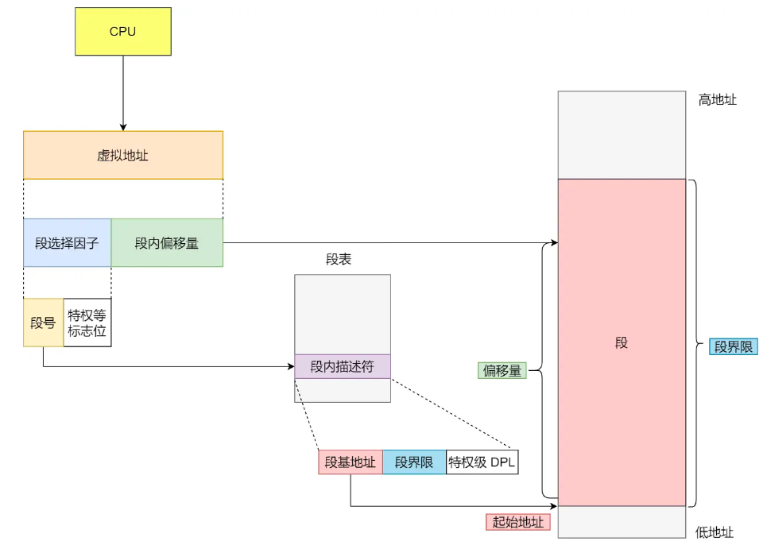
</div>

段选择因子和段内偏移量：

- 段选择子就保存在段寄存器里面。段选择子里面最重要的是段号，用作段表的索引。段表里面保存的是这个段的基地址、段的界限和特权等级等。
- 虚拟地址中的段内偏移量应该位于 0 和段界限之间，如果段内偏移量是合法的，就将段基地址加上段内偏移量得到物理内存地址。

在上面，知道了虚拟地址是通过段表与物理地址进行映射的，分段机制会把程序的虚拟地址分成 4 个段，每个段在段表中有一个项，在这一项找到段的基地址，再加上偏移量，于是就能找到物理内存中的地址，如下图：

<div align="center">
    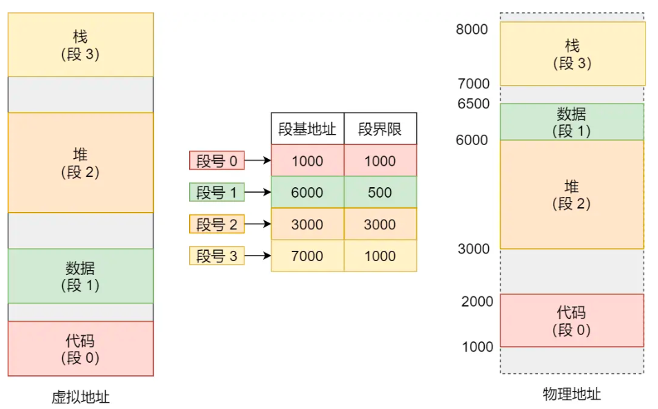
</div>

如果要访问段 3 中偏移量 500 的虚拟地址，我们可以计算出物理地址为，段 3 基地址 7000 + 偏移量 500 = 7500。如果当程序访问的是非法地址（比如地址越界），硬件会发现该地址越界，因此陷入操作系统，**很可能导致终止出错进程。这被称为段错误（segmentation fault）和段异常（segmentation violation）**。

通过分段机制，很容易在地址空间之间共享内存段。为了支持共享，需要一些额外的硬件支持，这就是保护位（protection bit）。在段表中为每个段增加了几个位，标识程序是否能够读、写该段，或执行其中的代码。**通过将代码段标记为只读，同样的代码可以被多个进程共享，而不用担心破坏隔离**。

分段的办法很好，解决了地址转换问题的，同时只有已用的虚拟内存才在物理内存中分配空间，节省了大量内存，因此可以容纳巨大的地址空间。

但它也有一些不足之处：

- 第一个就是**内存碎片**的问题。
- 第二个就是**内存交换的效率低**的问题。

对于第一个问题，新的地址空间被创建时，操作系统需要在物理内存中为它的段找到空间。之前，我们假设所有的地址空间大小相同，物理内存可以被认为是一些槽块，进程可以放进去。现在，每个进程都有一些段，每个段的大小也可能不同。

一般会遇到的问题是，物理内存很快充满了许多空闲空间的小洞，因而很难分配给新的段。这种问题被称为外部碎片（external fragmentation），如下图左边所示：

<div align="center">
    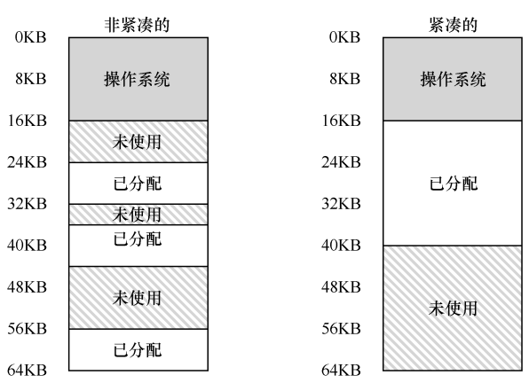
</div>

> 内存分段管理可以做到段根据实际需求分配内存，所以有多少需求就分配多大的段，所以不会出现内部内存碎片。

该问题的一种解决方案是紧凑（compact）物理内存，重新安排原有的段。这样做，操作系统得到了足够大的连续空闲空间，能让新的内存分配请求成功。但是，内存紧凑成本很高，因为拷贝段是内存密集型的，**一般会占用大量的处理器时间**。

## 四、虚拟内存尝试之三：分页

要解决上述分段产生的问题，可以使用内存分页技术，分页是把**整个虚拟和物理内存空间切成一段段固定尺寸的大小**。这样一个连续并且尺寸固定的内存空间，我们叫页（Page）。**在 Linux 下，每一页的大小为 4KB**（具体为什么划分成 4KB 是因为因为大的不命中处罚和访问第一个字节的开销）。

虚拟地址与物理地址之间通过页表来映射，如下图：

<div align="center">
    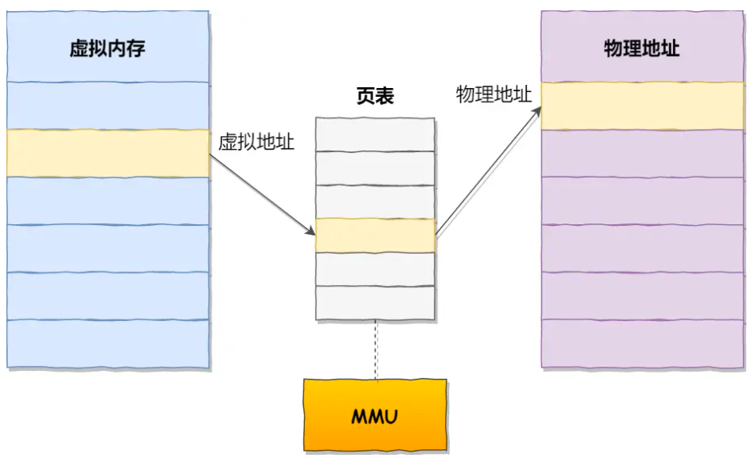
</div>

**页表是存储在内存里的**，内存管理单元（MMU）就做将虚拟内存地址转换成物理地址的工作。而当进程访问的虚拟地址在页表中查不到时，系统会产生一个缺页异常，进入系统内核空间分配物理内存、更新进程页表，最后再返回用户空间，恢复进程的运行，重新执行造成缺页的指令。

分页解决了分段存在的两个问题，即内存碎片和内存交换效率低。内存分页由于内存空间都是预先划分好的，也就不会像内存分段一样，在段与段之间会产生间隙非常小的内存，这正是分段会产生外部内存碎片的原因。而采用了分页，页与页之间是紧密排列的，所以不会有外部碎片。

但是，因为内存分页机制分配内存的最小单位是一页，即使程序不足一页大小，我们最少只能分配一个页，所以页内会出现内存浪费，所以针对内存分页机制会有内部内存碎片的现象。

如果内存空间不够，操作系统会把其他正在运行的进程中的「最近没被使用」的内存页面给释放掉，也就是暂时写在硬盘上，称为换出（Swap Out）。一旦需要的时候，再加载进来，称为换入（Swap In）。所以，一次性写入磁盘的也只有少数的一个页或者几个页，不会花太多时间，内存交换的效率就相对比较高。

<div align="center">
    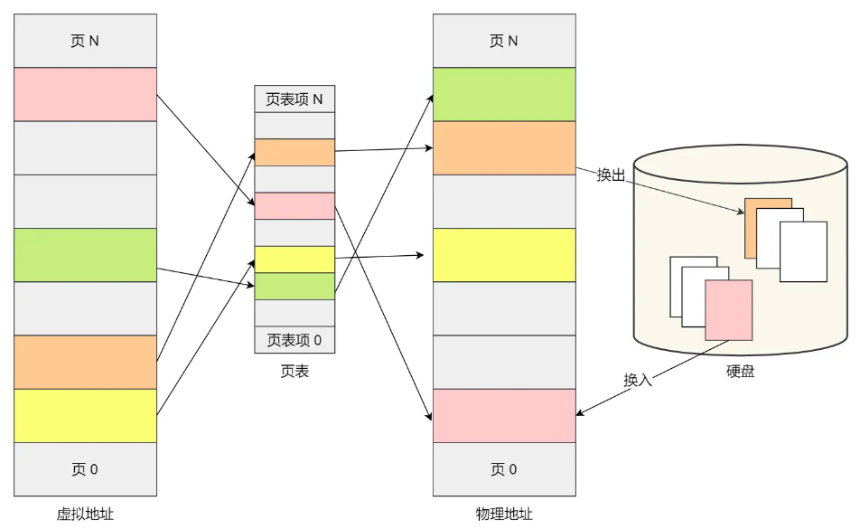
</div>

更进一步地，分页的方式使得我们在加载程序的时候，**不再需要一次性都把程序加载到物理内存中**。我们完全可以在进行虚拟内存和物理内存的页之间的映射之后，并不真的把页加载到物理内存里，**而是只有在程序运行中，需要用到对应虚拟内存页里面的指令和数据时，再加载到物理内存里面去**。

在分页机制下，虚拟地址分为两部分，页号和页内偏移。页号作为页表的索引，页表包含物理页每页所在物理内存的基地址，这个基地址与页内偏移的组合就形成了物理内存地址，见下图。

<div align="center">
    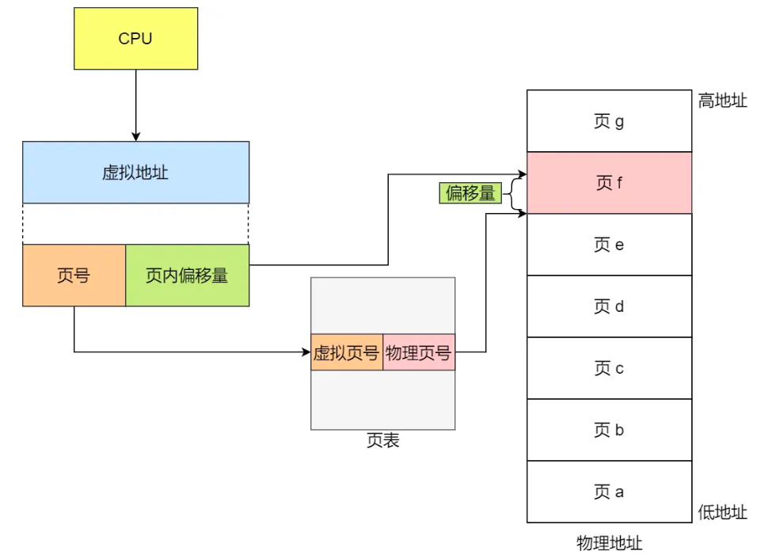
</div>

实际上，上述页表项（PTE）实际上只是一个相对简化的版本，实际上还有许多不同的位信息：

- **有效位（valid bit）**：通常用于指示特定地址转换是否有效。例如，当一个程序开始运行时，它的代码和堆在其地址空间的一端，栈在另一端。所有未使用的中间空间都将被标记为无效（invalid），通过简单地将地址空间中所有未使用的页面标记为无效，我们不再需要为这些页面分配物理帧；
- **保护位（protection bit）**：表明页是否可以读取、写入或执行；
- **存在位（present bit）**：表示该页是在物理存储器还是在磁盘上（即它已被换出，swapped out）。交换空间允许操作系统将很少使用的页面移到磁盘，从而释放物理内存；
- **脏位（dirty bit）**：也很常见，表明页面被带入内存后是否被修改过；
- **参考位（reference bit，也被称为访问位，accessed bit）**：有时用于追踪页是否被访问，也用于确定哪些页很受欢迎，因此应该保留在内存中（用于页面替换算法，选择哪一个页面被释放）。

下面是一个 x86 架构的示例页表项，它包含一个存在位（P），确定是否允许写入该页面的读/写位（R/W），确定用户模式进程是否可以访问该页面的用户/超级用户位（U/S），有几位（PWT、PCD、PAT 和 G）确定硬件缓存如何为这些页面工作，一个访问位（A）和一个脏位（D），最后是页帧号（PFN）本身：

<div align="center">
    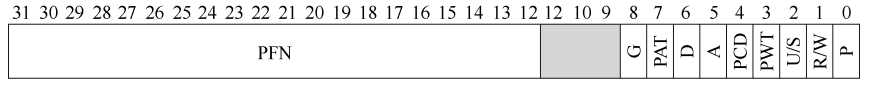
</div>

结一下，对于一个内存地址转换，其实就是这样三个步骤：

- 把虚拟内存地址，切分成页号和偏移量；
- 根据页号，从页表里面，查询对应的物理页号；
- 直接拿物理页号，加上前面的偏移量，就得到了物理内存地址；

但是使用上述简单的内存分页会存在两个问题：

- 页表占用的内存空间可能很大；
- 分页可能很慢；

对于一个 32 位的地址空间，带有 4KB 的页。这个虚拟地址分成 20 位的 VPN 和 12 位的偏移量，一个 20 位的 VPN 意味着，操作系统必须为每个进程管理 $2^{20}$ 个地址转换（大约一百万）。假设每个页表格条目（PTE）需要 4 个字节，每个页表就需要 4MB 内存。如果 OS 中正在运行 100 个进程，那么页表就需要 400MB。

对于第二个问题，假如进程引用一个虚拟地址，内存分页需要我们执行一个额外的内存引用，以便首先从页表中获取地址转换，**额外的内存引用开销很大，在这种情况下，可能会使进程减慢两倍或更多**。

对于第二个问题，我们使用 TLB 缓存来解决。

## 五、虚拟内存尝试之四：快速地址转换

使用内存分页技术，在进行虚拟地址转换时，分页逻辑上需要一次额外的内存访问，增加了程序运行的耗时。程序是有局部性的，即在一段时间内，整个程序的执行仅限于程序中的某一部分。

相应地，执行所访问的存储空间也局限于某个内存区域。我们就可以利用这一特性，把最常访问的几个页表项存储到访问速度更快的硬件，于是计算机科学家们，就在 CPU 芯片中，加入了一个专门存放程序最常访问的页表项的 Cache，这个 Cache 就是 **_TLB（Translation Lookaside Buffer）_**，通常称为页表缓存、转址旁路缓存、快表等。

### 1.TLB 算法的流程

硬件算法的大体流程如下：首先从虚拟地址中提取页号（VPN），然后检查 TLB 是否有该 VPN 的转换映射。如果有，我们有了 TLB 命中（TLB hit），这意味着 TLB 有该页的转换映射。接下来我们就可以从相关的 TLB 项中取出页帧号（PFN），与原来虚拟地址中的偏移量组合形成期望的物理地址（PA），并访问内存。

<div align="center">
    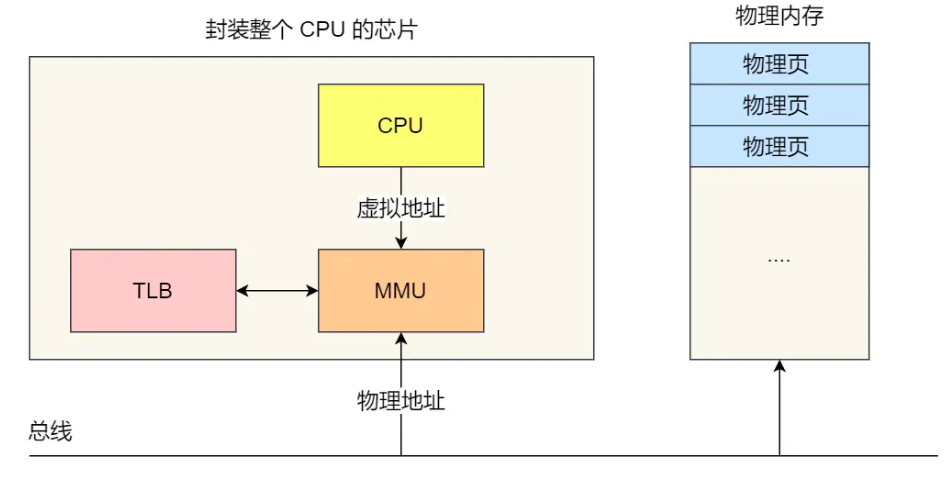
</div>

如果 CPU 没有在 TLB 中找到转换映射（TLB 未命中），硬件访问页表来寻找转换映射，并用该转换映射更新 TLB。上述系列操作开销较大，主要是因为访问页表需要额外的内存引用。最后，当 TLB 更新成功后，**系统会重新尝试该指令，这时 TLB 中有了这个转换映射**，内存引用得到很快处理。

### 2.谁来处理 TLB 未命中

在早期的操作系统重，使用硬件来处理 TLB 未命中，硬件必须知道页表在内存中的确切位置（通过页表基址寄存器，page-table base register），以及页表的确切格式。发生未命中时，硬件会“遍历”页表，找到正确的页表项，取出想要的转换映射，用它更新 TLB，并重试该指令。在 x86 架构中，页表的基址由 CR3 寄存器指出，x86-64 使用 4 级页表，因此 CR3 指出的是第一级页表的基址。

在现代的系统中，一般使用软件来处理 TLB 未命中。发生 TLB 未命中时，硬件系统会抛出一个异常，将特权级提升至内核模式，跳转至陷阱处理程序（trap handler），然后查找页表中的转换映射，**然后用特别的"特权"指令更新 TLB**，并从陷阱返回。此时，**硬件会重试该指令（导致 TLB 命中）**。

对于软件管理的 TLB 未命中程序，有两点需要注意，第一点是这里从陷阱返回的指令和从系统调用返回的指令不同，因为从函数调用返回后，会继续执行此次调用之后的语句。而从 TLB 未命中陷阱返回后，硬件必须从导致陷阱的指令继续执行。

第二点是在运行 TLB 未命中处理代码时，操作系统需要格外小心避免引起 TLB 未命中的无限递归（所谓运行 TLB 未命中处理代码（handler）引发的无限递归，就是 handler 中的代码指令也没有缓存在 TLB 中，继续引发 TLB 未命中处理代码，然后不断这样循环）。

有很多解决方案，例如，**可以在 TLB 中保留一些项，记录永久有效的地址转换**，并将其中一些永久地址转换槽块留给处理代码本身，这些被监听的（wired）地址转换总是会命中 TLB。

### 3.TLB 表项的内容

TLB 缓存是全相联的（fully associative），基本上，这就意味着一条地址映射可能存在 TLB 中的任意位置，硬件会并行地查找 TLB，找到期望的转换映射。一条 TLB 项内容可能像下面这样：

```shell
VPN ｜ PFN ｜ 其他位
```

除此之外，TLB 表项通常有一个有效位（valid bit），用来标识该项是不是有效地转换映射。通常还有一些保护（protection）位，用来标识该页是否有访问权限。还有其他一些位，包括地址空间标识符（address-space identifier）、脏位（dirty bit）等。

> TLB 的有效位 != 页表的有效位，在页表中，如果一个页表项（PTE）被标记为无效，就意味着该页并没有被进程申请使用，正常运行的程序不应该访问该地址。TLB 的有效位不同，只是**指出 TLB 项是不是有效的地址映射**。例如，系统启动时，**所有的 TLB 项通常被初始化为无效状态，因为还没有地址转换映射被缓存在这里**。一旦启用虚拟内存，当程序开始运行，访问自己的虚拟地址，TLB 就会慢慢地被填满，因此有效的项很快会充满 TLB。
> TLB 有效位在系统上下文切换时起到了很重要的作用。通过将所有 TLB 项设置为无效，系统可以确保将要运行的进程不会错误地使用前一个进程的虚拟到物理地址转换映射。

下图是简化过的 MIPS R4000 系统中的 TLB 表项：

<div align="center">
    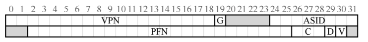
</div>

MIPS R4000 支持 32 位的地址空间，页大小为 4KB，由于用户地址空间只占一半（剩下留给内核），所以只需要 19 位的 VPN 号码。VPN 转换成最大 24 位的物理帧号（PFN），因此可以支持最多有 64GB 物理内存。

1. 全局位（Global，G）：用来指示这个页是不是所有进程全局共享，如果全局位置为 1，会忽略 ASID 位；
2. ASID：OS 用来区分属于不同进程的 TLB 缓存项；
3. 脏位（dirty）：表示该页是否被写入新数据；
4. 有效位（valid）：TLB 缓存的该地址映射是否有效；
5. VPN：19 位的 VPN 号码，虚拟页面号；
6. PFN：24 位的 PFN 号码，物理页帧号；

### 4.上下文切换时对 TLB 处理

**TLB 中包含的虚拟到物理的地址映射只对当前进程有效**，对其他进程是没有意义的。所以在发生进程切换时，硬件/OS 必须确保即将运行的进程不要误读了之前进程的地址映射。

这个问题有两种可能得解决方案，第一种解决方案是在上下文切换时，简单地清空（flush）TLB（清空操作就是把 TLB 表项的有效位置为 0），这样在新进程运行前 TLB 就变成了空的。

如果是软件管理的 TLB，那么发生上下文切换时，需要通过一条显式（特权）指令来完成清空操作；如果是硬件管理的 TLB，在上下文切换时，基址寄存器（PTBR）的值会被改变，这时需要清空 TLB 缓存（也是把有效位设置为 0）。

为了减少这种开销，一些系统增加了硬件支持，实现跨上下文切换的 TLB 共享。比如有的系统在 TLB 中添加了一个地址空间标识符（Address Space Identifier，ASID）。可以把 ASID 看作是进程标识符（Process Identifier，PID），但通常比 PID 位数少（PID 一般 32 位，ASID 一般是 8 位）。

## 六、虚拟内存尝试之五：多级页表

要解决上面页表过大的问题，就需要采用一种叫作多级页表（Multi-Level Page Table）的解决方案。

在前面我们知道了，对于单页表的实现方式，在 32 位和页大小 4KB 的环境下，一个进程的页表需要装下 100 多万个「页表项」，并且每个页表项是占用 4 字节大小的，**于是相当于每个页表需占用 4MB 大小的空间**。

我们把这个 100 多万个「页表项」的单级页表再分页，将页表（一级页表，或者叫做页目录）分为 1024 个页表（二级页表），每个表（二级页表）中包含 1024 个「页表项」，形成二级分页。如下图所示：

<div align="center">
    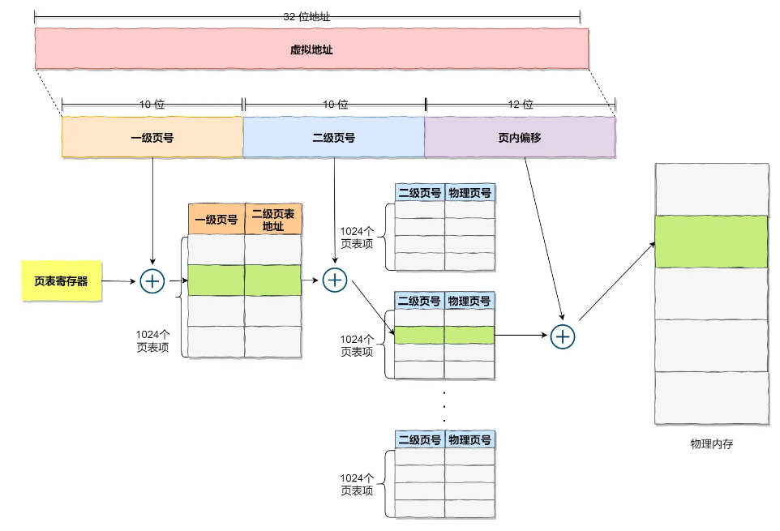
</div>

> 你可能会问，分了二级表，映射 4GB 地址空间就需要 4KB（一级页表）+ 4MB（二级页表）的内存，这样占用空间不是更大了吗？

当然如果 4GB 的虚拟地址全部都要在页表中占用页表项（即使部分虚拟地址没有被使用），二级分页确实使得页表占用空间确实是更大了，但是，我们往往不会这么做。

因为多级页表会去掉页表中的所有无效区域（对应的虚拟地址空间中没有被进程使用的区域），而不是将它们全部保留在内存中，即不会为这些区域分配页表项。多级页表将线性页表变成了类似树的东西。

多级页表的基本思想很简单。首先，**将页表分成页大小（比如 4KB）的单元**。然后，**如果整页的页表项（PTE）无效，就完全不分配该页的页表**。为了追踪页表的页是否有效，使用了名为页目录（page directory）的新结构。页目录因此可以告知 OS 页表的页在哪里，或者页表的整个页不包含有效页。

<div align="center">
    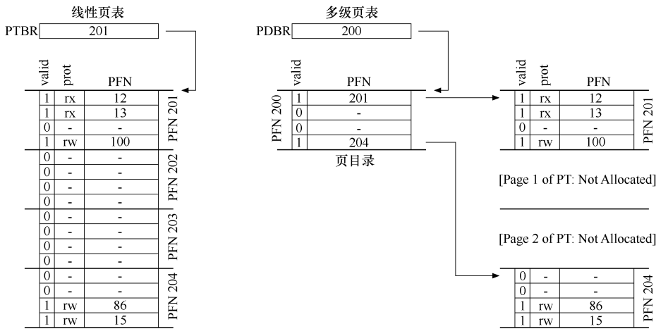
</div>

上图的左边是经典的线性页表。即使地址空间的大部分中间区域无效，我们仍然需要为这些区域分配页表空间（即页表的中间两页）。右侧是一个多级页表。页目录仅将页表的两页标记为有效（第一个和最后一个）；因此，页表的这两页就驻留在内存中。

页目录由**多个页目录项（Page Directory Entries, PDE）组成**，PDE 至少拥有有效位（valid bit）和页帧号（Page Frame Number, PFN），这个有效位的含义是：如果 PDE 项是有效的，则意味着该项指向的页表（通过 PFN）中至少有一页是有效的，**即在该 PDE 所指向的页中，至少一个 PTE，其有效位被设置为 1**。如果 PDE 项无效（即等于零），则 PDE 的其余部分没有定义。 多级页表非常支持稀疏的地址空间。

其次，如果仔细构建，页表的每个部分都可以整齐地放入一页中，举例来说，就是上图中，每一个页目录指向的二级页表都具有我们所划分的一个页大小，可以放入到物理内存的一页中。这样我们通过增加页目录这一中间层，**就可以将每个页目录指向的一个页表保存在物理内存的任意位置**。同时，页目录本身也可以被设计成一个页大小，放入到任意物理页面中。操作系统可以在需要分配或增长页表时简单地获取下一个空闲页。

而一个简单的（非分页）线性页表，仅是按 VPN 索引的 PTE 数组。**用这样的结构，整个线性页表必须连续驻留在物理内存中**。但是，多级页表在 TLB 未命中时，需要从内存加载多次，才能从页表中获取正确的地址转换信息。

下面我们举例一个实际的多级页表，假设我们有一个 30 位的虚拟地址空间和一个小的（512 字节）页。因此我们的虚拟地址有一个 21 位的虚拟页号和一个 9 位偏移量。**我们构建多级页表的目标：使页表的每一部分都能放入一个页**。但是，如果页目录太大了，那么它也需要被拆分，形成多级页目录，使得每一级的页目录都能放入到一个物理页中。

鉴于页大小为 512 字节，并且假设 PTE 大小为 4 字节，可以在单个页上放入 128 个 PTE。当我们索引页表时，我们需要 VPN 的最低有效位 7 位作为索引，高 14 位作为页目录的索引。那么一共有 $2^{14} = 16384 = 128 * 128 $ 个页，因此需要为树再增加一个中间层。

<div align="center">
    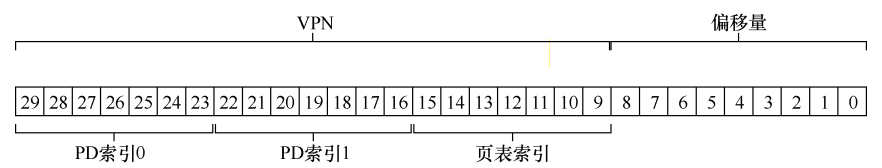
</div>

在现实的操作系统中，64-bit 的操作系统使用了四级分页：

- 全局页目录项 PGD（Page Global Directory）；
- 上层页目录项 PUD（Page Upper Directory）；
- 中间页目录项 PMD（Page Middle Directory）；
- 页表项 PTE（Page Table Entry）；

<div align="center">
    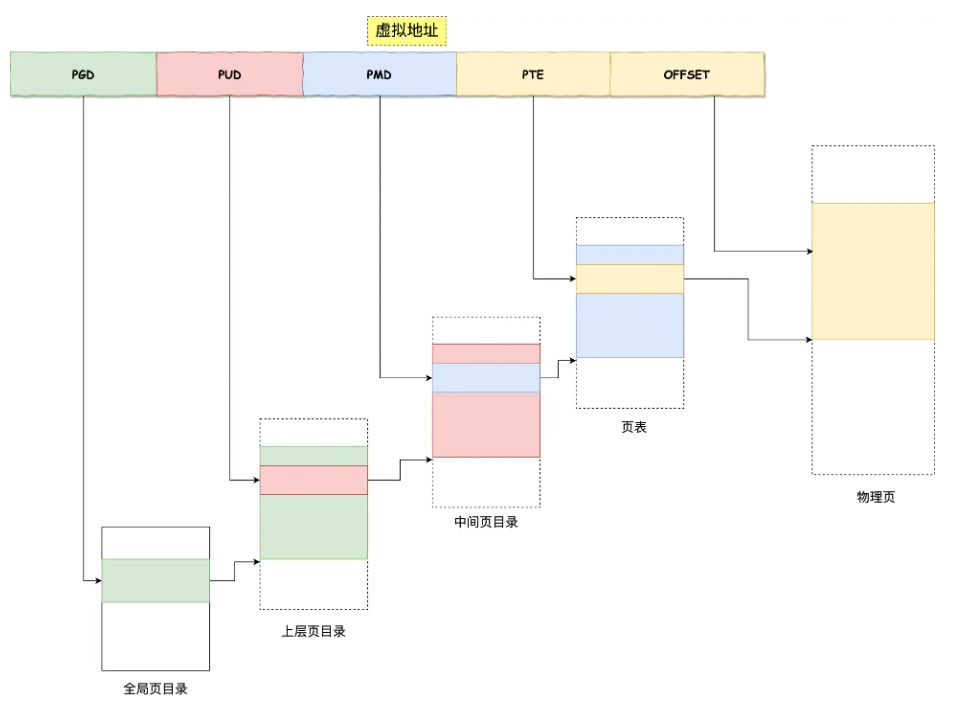
</div>

在任何复杂的多级页表访问发生之前，硬件首先检查 TLB。在命中时，物理地址直接形成。只有在 TLB 未命中时，硬件才需要执行完整的多级查找。在这条路径上，可以看到传统的两级页表的成本：两次额外的内存访问来查找有效的转换映射。

到目前为止，我们一直假设页表位于内核拥有的物理内存中。即使我们有很多技巧来减小页表的大小，但是它仍然有可能是太大而无法一次装入内存。因此，一些系统将这样的页表放入内核虚拟内存（kernel virtual memory），从而允许系统在内存压力较大时，将这些页表中的一部分交换（swap）到磁盘。

## 七、虚拟内存尝试之六：交换空间

### 1.交换空间简介

到目前为止，我们一直假定地址空间非常小，能放入物理内存。现在我们将放松这些大的假设，并假设我们需要支持许多同时运行的巨大地址空间（地址空间远大于物理内存的大小）。

很显然系统不能将所有进程需要的所有虚拟页同时放在内存中。所以我们需要在硬盘上开辟一部分空间用于物理页的移入和移出。在操作系统中，一般这样的空间称为交换空间（swap space），因为我们将内存中的页交换到其中，并在需要的时候又交换回去。因此，我们会假设操作系统能够以页大小为单元读取或者写入交换空间。

交换空间的大小是非常重要的，它决定了系统在某一时刻能够使用的最大内存页数。虚拟内存系统使用交换空间技术（swap space），让系统假装内存比实际的物理内存更大。

### 2.存在位

现假设有一个硬件管理 TLB 的系统，正在运行的进程生成虚拟内存引用，在这种情况下，虚拟地址通过硬件转换成物理地址的流程如下。

硬件首先从虚拟地址获得 VPN，检查 TLB 是否匹配（TLB 命中），如果命中，则获得最终的物理地址并从内存中取回。这希望是常见情形，因为它很快（不需要额外的内存访问）。

如果在 TLB 中找不到 VPN（即 TLB 未命中），则硬件在内存中查找页表（使用页表基址寄存器），并使用 VPN 作为索引查找该页的页表项（PTE）。如果页有效且存在于物理内存中，则硬件从 PTE 中获得 PFN，将其插入 TLB，并重试该指令，这次产生 TLB 命中。

但是在新增交换空间并允许物理页交换到磁盘上时，必须添加更多的机制，当硬件在 PTE 中查找时，可能发现页不在物理内存中。硬件判断是否在内存中的方法，是通过页表项中的一条新信息，即存在位（present bit）。

如果存在位设置为 1，则表示该页存在于物理内存中，并且所有内容都如上所述进行。如果存在位设置为零，则页不在内存中，而在硬盘上。访问不在物理内存中的页，这种行为通常被称为页错误（page fault）。在处理页错误时，操作系统需要将该页交换到内存中，而物理页在磁盘上的地址一般保存在页表的 PFN 位。

当硬盘 I/O 完成时，操作系统会更新页表，将此页标记为存在，更新页表项（PTE）的 PFN 字段以记录新获取页的内存位置，并重试指令。下一次重新访问 TLB 还是未命中，然而这次因为页在内存中，因此会将页表中的地址更新到 TLB 中（也可以在处理页错误时更新 TLB 以避免此步骤）。最后的重试操作会在 TLB 中找到转换映射，从已转换的内存物理地址，获取所需的数据或指令。

### 3.交换何时真正发生

到目前为止，我们一直描述的是操作系统会等到内存已经完全满了以后才会执行交换流程，然后才替换（踢出）一个页为其他页腾出空间。正如你想象的那样，这有点不切实际。因为操作系统可以更主动地预留一小部分空闲内存。

为了保证有少量的空闲内存，大多数操作系统会设置高水位线（High Watermark，HW）和低水位线（Low Watermark，LW），来帮助决定何时从内存中清除页。原理是这样：当操作系统发现有少于 LW 个页可用时，后台负责释放内存的线程会开始运行，直到有 HW 个可用的物理页。这个后台线程有时称为页守护进程（page daemon），它然后会进入休眠状态。

为了配合后台的分页线程，物理页从磁盘交换到内存之前，需要先简单检查是否有空闲页，而不是直接执行替换。如果没有空闲页，会通知后台分页线程按需要释放页。当线程释放一定数目的页时，它会重新唤醒原来的线程，然后就可以把需要的页交换进内存，继续它的工作。

经过上述虚拟内存系统的六个尝试，现在将虚拟地址转换成物理地址的完整过程如下：

<div align="center">
    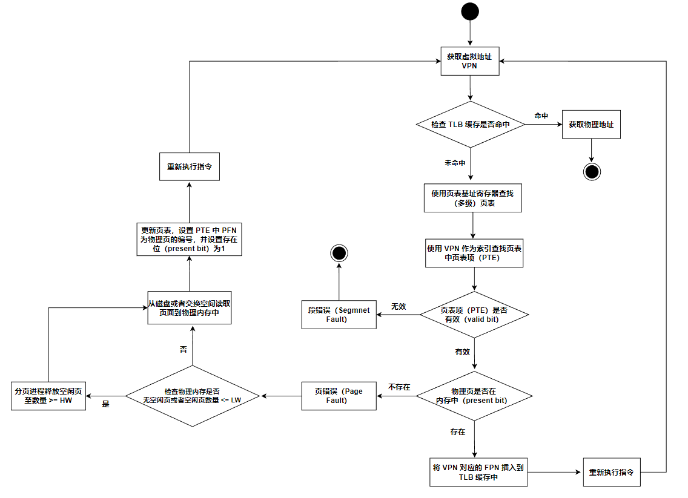
</div>