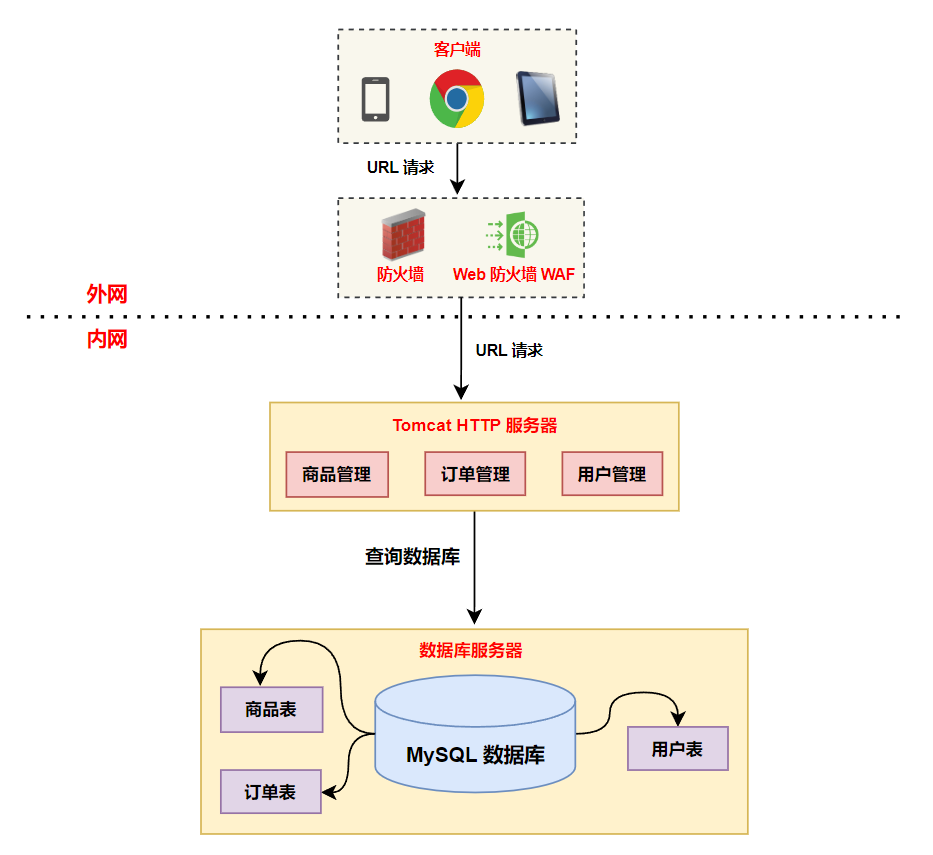
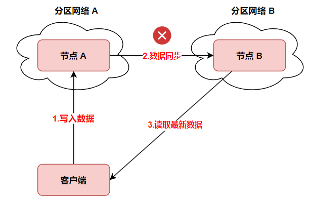

网站技术架构演讲：主要讲解一些网站技术的演变，穿插一些技术知识科普，最后附带一个主题，从浏览器输入网址到返回页面，这整个过程发生了什么

技术架构的演进，本质是不断解决规模、效率与成本的平衡问题。每一次输入 URL 后的秒级响应，背后是无数工程师对细节的极致追求。——章文嵩博士

大纲：

# 一、大型网站及其技术架构演变：

## 1.单体架构

- 古老技术：LAMP（Linux+Apache+MySQL+PHP）、Struts2、Hibernate、JSP、Servlet、JQuery 等
- 新技术：SpringMVC、SpringBoot、SpringCloud、Tomcat、MyBatis、React/Vue/Angular 等

我们基本上会选择一个开源的 Server 作为容器，比如说 Tomcat；直接使用 Spring（容器）+SpringMVC（Web 框架）+MyBatis（ORM 框架） 等开源框架来构建我们的应用；选择一个开源的关系型数据库（MySQL）来存储数据；后端程序通过 JDBC 进行数据库的连接和操作，这样，一个最基础的环境就可以工作了。

大部分在学校接触网站开发的同学都是从这样的做法开始的，目前大部分平台级的应用（支付宝、微信），在最开始的时候都是单体架构。下面架构图中的商品管理、订单管理、用户管理都是在一个 JVM 中，或者说所有的代码都是在一个项目中，开发人员可以在自己的 PC 机上随时开发、调试、测试整个系统的功能，实时感知系统的全貌。当需要快速验证某一个系统或者商业模式时，目前就可以使用单体架构。

<div align="center">
  
</div>

以上只是单机服务器的架构图，下面是浏览器发送 HTTP 请求到服务器做出响应，最终返回请求的 HTML 页面的过程：

<div align="center">
  
</div>

从上图中可以看出，用户在浏览器的地址栏中输入网址，或者点击某个按钮、图标、动画、图片等，就会发送一个 HTTP 请求给后端服务器，在这个 HTTP 请求中包含了向服务器请求的文件路径（/jobs/list），Tomcat 解析这个 HTTP 请求并生成一个 Request 请求对象和 Response 响应对象，并传递给 Controller，每个 Controller 和路径名（/jobs/list）一一对应，如果 HTTP 中向服务器请求的文件路径是 /jobs/resume/create，那么就会传递给另外一个 Controller。Controller 会向 MySQL 查询数据，获取所有的职位列表，并保存到 response 对象中，最后组装成 HTTP 响应返回给浏览器展示出来。

以上就是浏览器发出的一个 HTTP 请求被服务器处理并返回对应的 HTTP 响应给浏览器，并最终展示给用户的流程。

<div align="center">
  
</div>
<div align="center">
  
</div>

单体架构的缺点：

- 单体架构的系统存在严重的代码耦合问题，首先修改一处代码，可能会影响很多代码无法正常使用运行；其次，单体架构中不稳定的功能模块崩溃之后会直接影响到其他功能模块；
- 单体架构的系统功能模块变更对部署影响更大，当任一一个功能模块发生变化时，整个系统需要重新编译，打包以及部署；
- 单体架构的扩展性受限；

## 2.单机负载警告，数据库与应用分离

随着网站业务的发展，会出现两个问题。第一个问题，由于应用程序与数据库都是放在一台服务器中，随着用户数量越来越多，上传的数据越来越大，可能非常庞大，一台服务器的硬盘可能存储不了，所以这时必须将应用和数据库进行分离，分别部署在两台服务器上，数据库部署在另外一台或者多台机器上可以方便进行横向扩展。

应用服务器（或者说 Web 服务器）对外提供提供应用服务，以及进行业务逻辑计算，一般会绑定一个公网 IP 地址；而数据库服务器则用来部署数据库，MySQL、Oracle、SQL Server 等。

<div align="center">
  
</div>

对于应用/Web 服务器来说，由于需要进行大量的业务逻辑处理，所以需要更快更强的 CPU。
对于数据库服务器来说，首先需要大量的高速存储介质 SSD，其次需要大内存配置。

这里以 MySQL 为例，MySQL 数据库是基于磁盘存储的，并将其中的数据按照页的方式进行管理，因此可以将其视为磁盘的数据库系统。而由于磁盘和 CPU 速度之间巨大的差异，所以基于磁盘的数据库系统通常采用缓冲池技术（InnoDB Buffer Pool）来提高数据库的整体性能。缓冲池就是一块内存区域，通过内存的速度来弥补磁盘速度较慢对数据性能的影响。

在处理客户端的请求时，当需要访问某个页的数据时，InnoDB 存储引擎就会把完整的数据全部加载到缓冲池中，也就是说即使我们只需要访问一个页的一条记录，那也需要先把整个页的数据加载到内存中。下一次再读取相同的页时，首先判断该页是否在缓冲池中，若在缓冲池中，称为缓冲池被命中，否则从磁盘上将页加载到内存中。

将整个页加载到内存中后就可以进行读写访问了，对页进行修改之后再以一定的频率刷新到磁盘上。这里需要注意的是，页从缓冲池刷新回磁盘的操作并不是在每次页发送更改时，而是通过一种称之为 Checkpoint 的机制来刷新会磁盘。

## 3.使用缓存改善性能

### 3.1 分布式缓存

但是随着用户数量的增多，网站的相应速度又开始变慢，可能是访问数据库的操作太多，导致数据连接竞争变得激烈。此时需要引入高并发三剑客（缓存、分库分表、消息队列）之一，缓存。

缓存的定义：存储在计算机上的一个原始数据复制集，以便于访问。网站访问特点遵循二八定律：80% 的业务访问集中在 20% 的数据上。淘宝买家浏览的商品集中在少部分成交数多、评价良好的商品上，特别是在电商节（比如双十一、618等）中，某些关键词衣服、化妆品、电子产品等搜索频率非常高，可以将这些关键词对应的商品详情、静态图片等资源保存到内存缓存中；当某些热点事件发生时，百度搜索关键词集中在少部分热门词汇上。所以我们可以把这一小部分访问频率及其高的数据缓存在内存中，就可以减少数据库的访问压力，提高整个网站的数据访问速度。

缓存可以分为本地缓存、网络缓存（Web 代理缓存、边缘缓存）、服务端缓存（数据库缓存、平台级缓存、应用级缓存）。这里首先介绍应用级缓存，这里是 NoSQL（非关系型数据库）的主场，不论是 Redis 还是 MongoDB，以及 Memcached 都可以作为应用级缓存的重要技术。而当并发请求数量较多时，不太可能通过单机的方式来扛住高并发请求的压力，所以这里使用的一般是分布式缓存（Redis 集群）。

在下面的架构图中，我们使用了两种缓存。

第一种是网页的静态资源缓存，这里的静态资源包括网页中的图片、音视频等多媒体数据、js、CSS 等。为了提高网站的响应速度，减轻程序服务器（Tomcat，Jboss 等）的负载，对于静态资源，如图片、js、css 等文件，可以在反向代理服务器中进行缓存，这样浏览器在请求一个静态资源时，代理服务器就可以直接处理，而不用将请求转发给后端服务器。加快了网站的响应速度。对于用户请求的动态文件，如 servlet、jsp，则转发给 Tomcat，Jboss 服务器处理，这就是动静分离。即动态文件与静态文件的分离。通常将静态资源放到 nginx 中，动态资源转发到 tomcat 服务器中。

第二种是使用 redis 集群做了一个分布式缓存系统，热点数据保存到 redis 内存中，如果分布式缓存命中，则直接返回相应的数据，不再需要将请求继续发送到 Tomcat 服务器，并且继续查询 MySQL 数据库。当缓存没有命中时，则需要继续去查询数据库，并且将数据写回到 redis 缓存中，方面下次查询。

<div align="center">
  
</div>

但是引入分布式缓存之后，也增加了整个系统的复杂度和维护难度，分布式缓存存在如下问题：

- 缓存数据一致性：如果用户对数据库中的数据进行了更新，那么数据库和缓存中的数据就变得不一致了；（双写、失效模式）
- 缓存穿透：指查询一个一定不存在的数据，由于缓存是不命中，将去查询数据库。利用不存在的数据恶意查询，进行攻击，数据库瞬时压力增大，最终导致崩溃；（短暂过期时间）
- 缓存雪崩：我们设置缓存时 key 采用了相同的过期时间，导致缓存在某一时刻同时失效，请求全部转发到 DB，DB 瞬时压力过重崩溃；（缓存过期时间加上一定随机值）
- 缓存击穿：对于一些设置了过期时间的 key，如果这些 key 可能会在某些时间点被超高并发地访问，是一种非常“热点”的数据。如果这个 key 在大量请求同时进来前正好失效，那么所有对这个 key 的数据查询都落到 db，我们称为缓存击穿；（使用分布式锁，redis、zookeeper 实现）

对于前期数字化指挥平台，也采用了类似的 redis 单机缓存，在此平台中，如果用户访问了待办、已办等数据，系统就会自动将待办、已办数据写入到 redis 缓存中，并且设置过期时间为 1 天。

### 3.2 CDN（内容分发网络）

内容分发网络（Content Delivery Network，简称 CDN）是建立并覆盖在承载网之上，由分布在不同区域的边缘节点服务器群组成的分布式网络。CDN 应用广泛，支持多种行业、多种场景内容加速，例如：图片小文件、大文件下载、视音频点播、直播流媒体、全站加速、安全加速。

以下就是京东物流在中国的布局，有 8 个大型物流枢纽以及 43 座亚洲一号大型物流园区，以京东自营 B2C 模式为例，供应商的货品生产出来之后，往往会被前置存储到京东物流在全国运营的 43 座 “亚洲一号” 大型智能物流园区和约 1400 个仓库中，大幅缩短物品配送距离，实现“当日达”或“次日达”的时效承诺。本地仓的商品选品基于京东大数据分析，优先上架当地热销商品，确保库存与需求的精准匹配。

<div align="center">
  
</div>

为什么使用 CDN 技术呢？某部电视剧非常火爆，在某视频 APP 实现了 500 万用户同时在线观看。如果大家观看的是 1080p 清晰度的视频（理论上需要 4Mbps 带宽），那么，累计需要的流量带宽是 5，000，000 × 4Mbps=20，000，000Mbps=20Tbps，约等于一个中小城市的整个互联网带宽。 

对于优酷、爱奇艺这样的互联网视频内容提供商来说，这无疑是非常巨大的流量压力。我们普通计算机的网卡，是 1Gbps 的带宽。如果优酷有一台超级服务器，那么，这台超级服务器就需要 2 万块网卡，而且必须百分之百跑满速度，才能够实现这 500 万用户的流畅观看。对于一些实力不够的服务商，或者突发流量陡增的情况，就会造成拥塞，从而导致卡顿和延时。有这么一个说法：当用户打开一个页面，等待超过 4 秒，他就会关闭这个页面。也就是说，这个用户就会流失。

虽然网络传输在理论上接近光速，但是在实际中，网络请求会经过非常多的网关、交换机、节点服务器等，所以你会发现在东北访问深圳的服务器有几百毫秒的延迟，访问国外的网站更慢。CDN 将内容推送到网络边缘，大量的用户访问被分散在网络边缘，不再构成网站出口、互联互通点的资源挤占，也不再需要跨越长距离 IP 路由，即减少了源服务器的资源占用，大大提升了用户访问的响应时间，从而使用户能以最快的速度，从最接近用户户的地方获得所需的信息，彻底解决网络拥塞，提高响应速度。

CDN 就是采用更多的缓存服务器（CDN 边缘节点），布放在用户访问相对集中的地区或网络中。当用户访问网站时，利用全局负载技术，将用户的访问指向距离最近的缓存服器上，由缓存服务器响应用户请求。加速了网站的访问——用户与内容之间的物理距离缩短，用户的等待时间也得以缩短。CDN 是从传统 IT 行业发展起来的一项服务。但是，对于通信行业来说，CDN 也有非常大的商业价值。

互联网服务提供商采用 CDN，是以存储换时延。花钱购置 CDN 服务器或云计算服务，以此换取更好的用户体验。通信运营商也追捧 CDN，但它们的目的，是以存储换带宽——通过服务“下沉”，减轻上层骨干网络的流量压力，避免硬件扩容，降低网络建设成本。这个很好理解啊，如果大量的业务流量数据在骨干网跑来跑去，骨干网肯定吃不消，要拼命扩容。如果这些业务流量数据在底层就被解决了，那么，骨干网的带宽压力自然就减轻了。

腾讯云内容分发网络在中国境内拥有 2000+ 个加速节点，境内总储备带宽 110Tbps+。境内加速节点均为腾讯高规格、高安全性自建机房，享受运营商高质量网络，节点覆盖境内所有省份、自治区、直辖市。下图就是腾讯云 CDN 在中国境内的节点示意图。淘宝的图片访问，有 98% 的流量都走了 CDN 缓存。只有 2% 会回源到源站，节省了大量的服务器资源。

<div align="center">
  
</div>

每个云厂商的 CDN 需要有一套自己的 DNS 系统，比如域名 www.baidu.com 在经过标准域名解析系统进行解析之后，转换成的 IP 地址指向百度北京机房。因此 wwww.baidu.com 通过自定义的域名解析系统，将其解析到离用户最近的边缘节点。CDN 的具体工作过程如下所示：

<div align="center">
  
</div>

为了更清晰地说明 CDN 的工作原理，下面以客户端发起对 www.example.com/index.html 的 HTTP 请求为例进行说明：

1. 用户发起对 www.example.com/index.html 的 HTTP 请求，首先需要通过本地 DNS 通过【迭代解析】的方式获取域名 www.example.com 的 IP 地址；
2. 如果本地 DNS 的缓存中没有该域名的记录，则向根 DNS 发送 DNS 查询报文；
3. 根 DNS 发现域名的前缀为 com，则给出负责解析 com 的顶级 DNS 的 IP 地址；
4. 本地 DNS 向顶级 DNS 发送 DNS 查询报文；
5. 顶级 DNS 发现域名的前缀为 example.com，在本地记录中查找负责该前缀的权威 DNS 的 IP 地址并进行回复；
6. 本地 DNS 向权威 DNS 发送 DNS 查询报文；
7. 权威 DNS 查找到一条 NAME 字段为 example.com 的 CNAME 记录，该记录的 Value 字段为 example.cdn.com；并且还找到另一条 NAME 字段为 example.cdn.com 的 A 记录，该记录的 Value 字段为 GSLB 的 IP 地址；
8. 本地 DNS 向 GSLB 发送 DNS 查询报文；
9. GSLB 根据 **<font color="red">本地 DNS 的 IP 地址</font>** 判断用户的大致位置为成都，筛选出位于成都且综合考量最优的 SLB 的 IP 地址填入 DNS 回应报文，作为 DNS 查询的最终结果；
10. 本地 DNS 回复客户端的 DNS 请求，将上一步的 SLB 的 IP 地址作为最终结果回复给客户端；
11. 客户端根据 IP 地址向 SLB 发送 HTTP 请求 www.example.com/index.html；
12. SLB 综合考虑缓存服务器集群中各个节点的资源限制条件、健康度、负载情况等因素，筛选出最优的缓存节点后回应客户端的 HTTP 请求 (状态码为 302，重定向地址为最优缓存节点的 IP 地址)；
13. 客户端接收到 SLB 的 HTTP 回复后，重定向到该缓存节点上；
14. 缓存节点判断请求的资源是否存在、过期，将缓存的资源直接回复给客户端，否则到源站进行数据更新再回复；

下面介绍一下 DNS 的记录类型：

在 DNS 系统中，最常见的资源记录方式是 Internet 类记录，该记录由包含 4 个字段的数据构成：Name、Value、Type、TTL。其中 Name 和 Value 可以理解为一对键值对，但是其具体含义取决于 Type 的类型，TTL 记录了该条记录应当从缓存中删除的时间。在资源记录的类型中中，最为常见且重要的类型 Type 主要有:

- A 记录 (Address)：A 记录用于描述目标域名到 IP 地址的映射关系，将目标域名与 A 记录的 Name 字段进行匹配，将成功匹配的记录的 Value 字段的内容 (IP 地址) 输出到 DNS 回应报文中。
- CNAME 记录：CNAME 记录用于描述目的域名和别名的对应关系，如果说 A 记录可以将目标域名转换为对应主机的 IP 地址，那么 CNAME 记录则可以将一个域名 (别名) 转换为另一个域名，如果多条 CNAME 记录指向同一个域名，则可以将多个不同的域名的请求指向同一台服务器主机。并且，CNAME 记录通常还对应了一条 A 记录，用于提供被转换的域名的 IP 地址。

>CDN 的域名加速需要用到 CNAME 记录，在阿里云控制台配置完成 CDN 加速后，您会得到一个加速后的域名，称之为 CNAME 域名（该域名一定是\*.\*http://kunlun.com），用户需要将自己的域名作 CNAME 指向这个*.*http://kunlun.com 的域名后，域名解析的工作就正式转向阿里云，该域名所有的请求都将转向阿里云 CDN 的节点。

```
记录类型      域名                             记录值 
CNAME       example.com                       www.example.com.w.kunlunsl.com
A           www.example.com.w.kunlunsl.com    10.10.10.10 
```

<div align="center">
  
</div>

CDN 使用类型包括大文件下载（大于 20M 文件下载，比如应用商店、游戏下载等）、网站加速、视频点播；

## 4.数据库读写分离

### 4.1 读写分离

1. 在业务复杂的系统中，有这么一个情景，有一句 sql 语句需要锁表，导致暂时不能使用读的服务，那么就很影响运行中的业务，使用主从复制，让主库负责写，从库负责读，这样即使主库出现了锁表的情景，通过读从库也可以保证业务的正常运作；
2. 做数据的热备；
3. 架构的扩展。业务量越来越大，I/O 访问频率过高，单机无法满足，此时做多库的存储，降低磁盘 I/O 访问的频率，提高单个机器的 I/O 性能；

MySOL 主从复制是指数据可以从一个 MySOL 数据库服务器主节点复制到一个或多个从节点。MySQL 默认采用异步复制方式，这样从节点不用一直访问主服务器来更新自己的数据，数据的更新可以在远程连接上进行，从节点可以复制主数据库中的所有数据库或者特定的数据库，或者特定的表。主从复制的过程如下所示：

<div align="center">
  
</div>

主从复制的基本过程如下:

- master（主数据库）将用户对数据库更新的操作以二进制格式保存到 binlog 日志文件中；
- slave（从数据库）上面的 I/O 进程连接上 master，并请求从指定日志文件的指定位置（或者从最开始的日志）之后的日志内容；
- master 接收到来自 slave 的 I/O 进程的请求后，通过负责复制的 I/O 进程根据请求信息读取制定日志指定位置之后的日志信息，返回给 slave 的 I/O 进程。返回信息中除了日志所包含的信息之外，还包括本次返回的信息已经到 master 端的 binlog 文件的名称以及 binlog 的位置；
- slave 的 I/O 进程接收到信息后，将接收到的日志内容依次添加到 slave 端的 relay-log 文件的最末端，并将读取到的 master 端的 binlog 的文件名和位置记录到 master-info 文件中，以便在下一次读取的时候能够清楚的告诉 master 我需要从某个 binlog 的哪个位置开始往后的日志内容，请发给我；
- slave 的 sql 进程检测到 relay-log 中新增加了内容后，会马上解析 relay-log 的内容成为在 master 端真实执行时候的那些可执行的内容，并在自身执行；

MySQL 的读写分离是指只在主服务器上写，在从服务器上读，主数据库处理事务性操作，从数据库处理 SELECT 查询，进行读操作时。实现方式是在应用和数据库之间增加代理层，代理层接收应用对数据库的请求，根据不同请求类型转发到不同的实例，在实现读写分离的同时可以实现负载均衡。

<div align="center">
  
</div>

### 4.2 分库分表

Apache ShardingSphere 是一套开源的分布式数据库中间件解决方案组成的生态圈，它由 Sharding-JDBC、Sharding-Proxy 这 2 款相互独立，却又能够混合部署配合使用的产品组成。它们均提供标准化的数据分片、分布式事务和数据库治理功能。ShardingSphere 定位为**关系型数据库中间件**，旨在充分合理地在分布式的场景下利用关系型数据库的计算和存储能力，而并非实现一个全新的关系型数据库。

#### 4.2.1 什么叫做分库分表

数据库，应该是一个应用当中最为核心的价值所在，也是开发过程中必须熟练掌握的工具。之前我们就学习过很多对 MySQL 的调优。但是随着现在互联网应用越来越大，多会频繁的成为整个应用的性能瓶颈。我们经常使用的 MySQL 数据库，也就不断面临数据量太大、数据访问太频繁、数据读写速度太快等一系列的问题。要提升数据库的性能，最直接的思路，当然是对数据库本身进行优化。例如对 MySQL 进行调优，优化 SQL 逻辑，优化索引结构，直接优化 MySQL 的源码，加磁盘，加内存。这种思路叫做 scale up 升级，纵向扩展，但是单节点机器性能毕竟是有天花板的。按照现在主流的思路，更倾向于去做 scale out，也就是横向扩展，即让尽量多的集群去做简单的事情，而不是让一台高性能机器去做所有的事情。

- 数据量和业务量快速增长，会带来性能瓶颈、服务宕机等很多问题。
- 单点部署的数据库无法保证服务高可用。
- 单点部署的数据库无法进行水平扩展，难以应对业务爆发式的增长。

那么自然就需要换另外一种思路了。我们可以像微服务架构一样,来维护数据库的服务。把数据库从单体服务升级到数据库集群，这样才能真正全方位解放数据库的性能瓶并且能够通过水平扩展的方式，灵活提升数据库的存储能力。这也就是我们常说的分库分表。通过分库分表可以给数据库带来很大的好处:

- 提高系统性能：分库分表可以将大型数据库分成多个小型数据库，每个小型数据库只需要处理部分数据，因此可以提高数据库的并发处理能力和查询性能。
- 提高系统可用性：分库分表可以将数据复制到多个数据库中，以提高数据的可用性和可靠性。如果一个数据库崩溃了，其他数据库可以接管其工作，以保持系统的正常运
- 提高系统可扩展性：分库分表可以使系统更容易扩展。当数据量增加时，只需要增加更多的数据库和表，而不是替换整个数据库，因此系统的可扩展性更高。
- 降低系统成本：分库分表可以使系统更加高效，因此可以降低系统的运营成本。此外分库分表可以使用更便宜的硬件和存储设备，因为每个小型数据库和表需要的资源

<div align="center">
  
</div>

分库分表有 2 种方式：垂直分片和水平分片。通常我们所讲的分库分表，主要指的是水平分片，因为这样才能减少数据量，从根本上解决数据量过大带来的存储和查询问题，但是，这并不意味着垂直分片方案就不重要。

- 按照业务划分的维度，将不同的表拆分到不同的库当中。这样可以减少每个数据库的数据量以及客户端的连接数，提高查询效率，这种方案称为垂直分库。当单个数据库的访问 QPS 达到 6K~7K，就需要进行分库，否则数据库会挂掉，将数据访问分散到多个数据库实例中，提高整体的并发处理能力。
- 按照数据分布的维度，将原本存在同一张表当中的数据，拆分到多张子表当中。每个子表只存储一部分数据。这样可以减少每一张表的数据量，提升查询效率。这种方案称为水平分表。

#### 4.2.2 分库分表挑战

分库分表，也称为 Sharding。其实我觉得，Sharding 应该比中文的分库分表更为贴切，他表示将数据拆分到不同的数据片中。由于数据往往是一个应用的基础，随着数据服务拆分到多个数据分片，应用层面也需要面临很多新的问题。比如分库分表需要解决的问题：

- 主键避重问题：在分库分表环境中，由于表中数据同时存在不同数据库中，某个分区数据库生成的 ID 就无法保证全局唯一。因此需要单独设计全局主键，以避免跨库主键重复问题；
- 数据迁移问题：当数据库集群需要进行扩缩容时，集群中的数据也需要随着服务进行迁移。如何在不影响业务稳定性的情况下进行数据迁移也是数据库集群化后需要考虑的问题。
- 分布式事务问题：原本单机数据库有很好的事务机制能够帮我们保证数据一致性。但是分库分表后，**由于数据分布在不同库甚至不同服务器**，不可避免会带来分布式事务问题；
- SQL 路由问题：数据被拆分到多个分散的数据库服务当中，每个数据库服务只能保存一部分的数据。这时，**<font color="red">在执行 SQL 语句检索数据时，如何快速定位到目标数据所在的数据库服务</font>**，语句转到对应的数据库服务中执行，也是提升检索效率必须要考虑的问题，所以如果分片规则设计的比较复杂，会较大影响数据检索效率；
- 跨节点查询，归并问题：跨节点进行查询时，每个分散的数据库中只能查出一部分的数据，这时要对整体结果进行归并时，就会变得非常复杂。比如常见的 limit、order by等操作；
- 高可用：将单个数据库拆分成多个不同的数据库之后，可能需要给每个拆分后的数据库挂一个主从，来保证高可用性；

在实际项目中，遇到的问题还会更多。从这里可以看出，Sharding 其实是一个很复杂的问题，往往很难通过项目定制的方式整体解决。因此，大部分情况下，都是通过第三方的服务来解决 Sharding 的问题。**比如像 TiDB、ClickHouse、Hadoop 这一类的 NewSQL 产品，大部分情况下是将数据问题整体封装到一起，从而提供 Sharding 方案**。但是这些产品毕竟太重了。更灵活的方式还是使用传统数据库，通过软件层面来解决多个数据库之间的数据问题。这也诞生了很多的产品，比如早前的 MyCat，还有后面我们要学习的 ShardingSphere 等。

另外，关于何时要开始考虑分库分表呢? 当然是数据太大了，数据库服务器压力太大了就要进行分库分表。但是这其实是没有一个具体的标准的，需要根据项目情况进行灵活设计。业界目前唯一比较值得参考的详细标准，是阿里公开的开发手册中提到的，**<font color="red">建议预估三年内，单表数据超过 500W（相当保守），或者单表数据大小超过 2G，就需要考虑分库分表</font>**（此时 SQL 查询的性能会明显下降）。

分库分表的应用：

(1) 在数据库设计时候考虑垂直分库和垂直分表；
(2) 随着数据库数据量增加，不要马上考虑做水平切分，首先考虑缓存处理，读写分离，使用索引，SQL 语句优化等等方式，如果这些方式不能根本解决问题了，再考虑做水平分库和水平分表；

#### 4.2.3 核心概念

Sharding-JDBC 是轻量级的 java 框架，是增强版本的 JDBC 驱动，主要目的是简化分库分表之后的数据操作。ShardingSphere 核心概念如下所示：

<div align="center">
  
</div>

- 虚拟库：ShardingSphere 的核心就是提供一个具备分库分表功能的虚拟库，他是一个 ShardingSphereRatasource 实例。应用程序只需要像操作单数据源一样访问这个
ShardingSphereRatasource 即可。示例中，MyBatis 框架并没有特殊指定 DataSource，就是使用的 ShardingSphere 的 DataSource 数据源。
- 真实库: **实际保存数据的数据库**。这些数据库都被包含在 ShardingSphereDatasource 实例当中，由 ShardingSphere 决定未来需要使用哪个真实库。示例中，m0 和 m1 就是两个真实库。
- 逻辑表: 应用程序直接操作的逻辑表。示例中操作的 course 表就是一个逻辑表，并不需要在数据库中真实存在。
- 真实表: 实际保存数据的表。这些真实表与逻辑表表名不需要一致，但是需要有相同的表结构，可以分布在不同的真实库中。应用可以维护一个逻辑表与真实表的对应关系,
所有的真实表默认也会映射成为 ShardingSphere 的虚拟表。示例中 course_1 和 course_2 就是真实表。
- 分布式主键生成算法: **给逻辑表生成唯一主键**。主键生成算法在数据库设计中非常重要，尤其是在分布式系统中。在传统的单机数据库中，可以使用自增主键，比如 MySQL 的 AUTO_INCREMENT，这样简单方便，还能保证主键的唯一性和递增性。**但在分布式系统中，尤其是分库分表的情况下，如果每个数据库实例都使用自增主键，可能会导致主键冲突的问题**。因为不同的数据库实例可能会生成相同的主键，尤其是在数据迁移或者扩容的时候，这个问题会更加明显。比如，假设有两个分片数据库 A 和 B，都使用自增主键。当 A 生成的主键是 1、2、3，而 B 生成的主键也是 1、2、3，那么在合并数据的时候就会出现主键重复的情况。这显然是不可接受的，因为主键的唯一性是数据库的基石。所以，这时候就需要一种分布式主键生成算法，能够在分布式环境下生成全局唯一的主键，避免不同分片之间的主键冲突。
- 分片策略: 表示逻辑表要如何分配到真实库和真实表当中，分为分库策略和分表策略两个部分。分片策略由分片键和分片算法组成。分片键是进行数据水平拆分的关键字段。
- 分片算法：表示根据分片键如何寻找对应的真实库和真实表。示例当中对 cid 主键字段取模，就是一种简单的分片算法。如果 ShardingSphere 匹配不到合适的分片策略，那就只能进行全分片路由，这是效率最差的一种实现方式。

使用读写分离/主从复制以及分库分表之后的架构图如下所示：

<div align="center">
  
</div>

## 5.使用 web 服务器集群来改善网站的并发处理能力

### 5.1 正向代理和反向代理

正向代理的大致结构如下图所示，我们常说的代理也就是只正向代理，正向代理的过程，它隐藏了真实的请求客户端，服务端不知道真实的客户端是谁，客户端请求的服务都被代理服务器代替来请求，某些科学上网工具扮演的就是典型的正向代理角色。用浏览器访问 www.google.com 时，被残忍的 block，于是你可以在国外搭建一台代理服务器，让代理帮我去请求 google.com，代理把请求返回的相应结构再返回给我。

<div align="center">
  
</div>

反向代理的结构图如下所示，大家都有过这样的经历，拨打 10086 客服电话，可能一个地区的 10086 客服有几个或者几十个，你永远都不需要关心在电话那头的是哪一个，叫什么，男的，还是女的，漂亮的还是帅气的，你都不关心，你关心的是你的问题能不能得到专业的解答，你只需要拨通了 10086 的总机号码，电话那头总会有人会回答你，只是有时慢有时快而已。那么这里的 10086 总机号码就是我们说的反向代理。客户不知道真正提供服务人的是谁。

反向代理隐藏了真实的服务端，当我们请求 ww.baidu.com 的时候，就像拨打 10086 一样，背后可能有成千上万台服务器为我们服务，但具体是哪一台，你不知道，也不需要知道，你只需要知道反向代理服务器是谁就好了，ww.baidu.com 就是我们的反向代理服务器，反向代理服务器会帮我们把请求转发到真实的服务器那里去。Nginx 就是性能非常好的反向代理服务器，用来做负载均衡。

<div align="center">
  
</div>

访问淘宝，你输入 www.taobao.com，实际是访问阿里的反向代理（如 Nginx），它把请求分给后端的几百台服务器，再把结果拼起来返回给你。公司内网：反向代理可以把外网的请求转发到内网的财务系统，但外部黑客不知道财务系统的真实 IP，提高安全性。（需要扩充）

### 5.2 服务器集群高可用

规避单点是高可用的架构设置的基本考量。当使用分库分表以及读写分离减轻了数据库的压力之后，单台 Tomcat 的 HTTP 服务器成为了整个系统的瓶颈，而且当单机出现故障时，系统整体会变得不可用。

使用集群是网站解决高并发、海量数据问题的常用手段。当一台服务器的处理能力、存储空间不足时，不要企图去换更强大的服务器，对大型网站而言，不管多么强大的服务器，都满足不了网站持续增长的业务需求。这种情况下，更恰当的做法是使用服务器集群分担原有服务器的访问及存储压力。

我们可以同时部署多台 Web 服务器，然后使用 Nginx 作为反向代理设备，它使用一定的负载均衡算法选择其中一台 Web 服务器将请求转发给它。

#### 5.2.1 Nginx 作为反向代理服务器

负载均衡算法有很多种，其中比较常用的负载均衡算法如下所示：

- **<font color="red">轮询法</font>**：轮询法是挨个轮询服务器处理，也可以设置权重。如果没有配置权重的话，每个请求按时间顺序逐一分配到不同的服务器处理。如果配置权重的话，权重越高的服务器被访问的次数就越多。未加权重的轮询算法适合于服务器性能相近的集群，其中每个服务器承载相同的负载。加权轮询算法适合于服务器性能不等的集群，权重的存在可以使请求分配更加合理化；
- **<font color="red">哈希法</font>**：将请求的参数信息通过哈希函数转换成一个哈希值，然后根据哈希值来决定请求被哪一台服务器处理。在服务器数量不变的情况下，相同参数的请求总是发到同一台服务器处理，比如同个 IP 的请求、同一个用户的请求；
- **<font color="red">一致性哈希法</font>**：和哈希法类似，一致性 Hash 法也可以让相同参数的请求总是发到同一台服务器处理。不过，它解决了哈希法存在的一些问题。**常规哈希法在服务器数量变化时，哈希值会重新落在不同的服务器上，这明显违背了使用哈希法的本意**。而一致性哈希法的核心思想是将数据和节点都映射到一个哈希环上，然后根据哈希值的顺序来确定数据属于哪个节点。当服务器增加或删除时，只影响该服务器的哈希，而不会导致整个服务集群的哈希键值重新分布；

<div align="center">
  
</div>

#### 5.2.2 Nginx+Keepalived 反向代理服务器高可用

虽然使用 Web 服务器集群解决了单点服务器的系统瓶颈，并且使用 Nginx 作为反向代理服务器，起到了隐藏服务器集群的真实 IP 地址以及负载均衡的作用。

但是此时 Nginx 服务器反而又成为了整个系统的单点瓶颈，当 Nginx 反向代理服务器出现故障时，无法再进行负载均衡选择某一个 Web 服务器对外提供服务。因此可以使用 Keepalived+Nginx 作为 Nginx 反向代理服务器的高可用解决方案。

Keepalived 是一个基于 VRRP 协议来实现的 Nginx 服务高可用方案，可以利用其来避免单点故障。现在反向代理服务至少会有 2 台 Nginx 服务器运行 Keepalived，一台为主服务器（MASTER），一台为备份服务器（BACKUP），但是对外表现为一个 VIP（即虚拟 IP，附在主机网卡上，对主机网卡进行虚拟，此 IP 仍然是占用了此网段的某个 IP）。

Keepalived 通过 Healthchecking 子进程检测 Nginx 服务器的状态，如果有一台 Nginx 服务器死机或工作出现故障，Keepalived 将检测到，并将有故障的 Nginx 服务器从系统中剔除。此时备份服务器就会接管虚拟 IP（此时称为 VIP 的"漂移"），而访问虚拟 IP 即访问了备份服务器，由备份服务器继续提供服务，从而保证了系统的高可用性。
        
当发生故障的 Nginx 服务器工作正常后，Keepalived 自动将 Nginx 服务器加入到服务器群中，这些工作全部自动完成，不需要人工干涉，需要人工做的只是修复故障的 Nginx 服务器。

<div align="center">
  
</div>

>主机 A: ip 地址:ipA ；mac 地址:macA 
>备机 B：ip 地址:ipB ；mac 地址:macB
>虚拟 ip 地址:vip
>Keepalived 分别安装在主机 A 和备机 B 上，双方启动以后，主机 A 就会向局域网内发送 arp 响应包，该 arp 响应包的 ip 地址被设为 vip，mac 地址被设为 macA，所有接收的此报文的电脑就会将这个对应关系写入自己的 ARP 缓存表中，下次访问 vip 时，就会根据对应的 mac 地址访问到主机 A 当备机 B 监听到主机 A 挂了的时候，就会向局域网内发送 arp 响应包，并将 arp 响应包的 ip 地址设为 vip，mac 地址设为 macB，所有接收的此报文的电脑就会将这个对应关系写入自己的 ARP 缓存表中，下次访问 vip 时，就会根据对应的 mac 地址访问到备机 B 这样就实现了高可用主机 A 和备机 B 之间通过 VRRP 协议实现监听和选举。

#### 5.2.3 Nginx+Keepalived 反向代理服务器集群

使用 Keepalived+Nginx 解决了 Nginx 代理服务器高可用的问题，但是上述主备 Nginx 服务器中只会有一个在工作，另外一个 Nginx 总是在 standby 状态，浪费了硬件资源。并且单个 Nginx 服务器的连接数也是有上限的，只能承载 1w-5w 左右的连接数。

所以使用 DNS 轮询以及 Nginx+Keepalived 反向代理服务器集群，实现了 Nginx 反向代理服务器的横向扩展。DNS 会使用轮询或者随机或者就近访问之类的规则，将其中某个 VIP 返回给客户端，这样理论上就可以支持无限的连接数。

<div align="center">
  
</div>

到此为止，系统进入了可以横向缩放的大型网站阶段，当网站流量增加时，应对的解决方案就是不断增加 Web 服务器、数据库服务器、缓存服务器、Nginx 反向代理服务器即可。

### 5.3 CAP 理论和 BASE 理论

CAP 是分布式系统设计中最基础和核心的理论，具体代表的内容如下所示：

- C 代表 Consistency，一致性（强一致性），是指所有节点在同一时刻的数据是相同的，即更新操作执行结束并响应用户完成后，所有节点存储的数据会保持相同；
- A 代表 Availability，可用性，足指系统捉供的服务一直处于可用状态，对于用户的请求可即时响应——但不保证获取的数据是最新的；
- P 代表 Partition Tolerance，分区容错性，是指在分布式系统遇到网络分区的情况下，仍然可以响应用户的请求。网络分区是指因为网络故障导致网络不连通，不同节点分布在不同的子网络中，各个子网络内网络正常。**<font color="red">以实际效果来说，系统如果不能在时效内达成数据一致性，就意味着出现了分区的情况</font>**；

C、A、P 只能同时满足两个目标，而由于在分布式系统中，P 是必须要保留的（因为分布式系统总是可能因为网络会发生分区现象，这时系统还是应该可以继续对外提供服务），所以要在 C 和 A 之间进行取舍。假如要保证服务的可用性，就选择 AP 模型，而要保证一致性的话，就选择 CP 模型。

只有在网络波动和分区发生了之后，才需要在 C 和 A 之间进行取舍；在没有出现网络波动和分区的情况下，我们无需为了 P 而舍弃 A 或 C。但是大部分时间网络分区是不会发生的，所以 CAP 理论用于指导系统在设计时需要衡量的因素，而非是绝对的选择。

>在2002年，麻省理工学院（MIT）的赛斯·吉尔伯特和南希·林奇发表了布鲁尔猜想的证明，使 CAP 成为一个定理。

- 对于金融系统（CP）：转账必须保证金额准确（一致性），宁愿暂时拒绝交易（牺牲可用性），也不能让账户金额出错。
- 社交平台（AP）：点赞或评论可以容忍短暂不一致（比如你看到 100 赞，朋友看到 99 赞），但必须让你随时能操作（优先可用性）。

<div align="center">
  
</div>

客户端 client 从任何节点 A 和 B 都可以读取数据，都能读取到最新写入的数据，说明 A 和 B 的数据是一致的，并且 A 和 B 也都是可用的。

<div align="center">
  
</div>

如果网络出现故障导致节点 A 和 B 出现分区。所谓网络分区就是由于网络不通导致节点 A 和 B 被隔离在不同的网络子集中，此时就要涉及到 CP、AP 的选择了。假设客户端向节点 A 写入新的数据，但是 A 和 B 之间出现网络故障，那么 A 和 B 节点出现了分区现象，导致 A 和 B 之间的数据出现不一致。

- 选择 AP，节点 A 或者 B 所在的分区网络节点都可以提供服务，但是无法保证一致性（A 和 B 之间无法同步数据）；
- 选择 CP，节点 A 或者 B 都无法提供服务（牺牲了可用性），但是保证了一致性，客户端不会出现读取到不一致数据的情况；

Base 理论的核心思想是最终一致性，即使无法做到强一致性(Strong Consistency)，但每个应用都可以根据自身的业务特点，采用适当的方式来使系统达到最终一致性(Eventual Consistency)。

- Basically Available(基本可用)
- Soft State(软状态)
- Eventually Consistent(最终一致性)

(1) 基本可用

基本可用比较好理解，就是不追求 CAP 中的「任何时候，读写都是成功的」，而是系统能够基本运行，一直提供服务。基本可用强调了分布式系统在出现不可预知故障的时候，允许损失部分可用性，相比正常的系统，可能是响应时间延长，或者是服务被降级。

举个例子，在双十一秒杀活动中，如果抢购人数太多超过了系统的 QPS 峰值，可能会排队或者提示限流，这就是通过合理的手段保护系统的稳定性，保证主要的服务（商品交易服务）的正常，保证基本可用。

（2）软状态

软状态可以对应 ACID 事务中的原子性，在 ACID 的事务中，实现的是强制一致性，要么全做要么不做，所有用户看到的数据一致。其中的原子性（Atomicity）更求多个节点的数据副本都是一致的，强调数据的一致性。

原子性可以理解为一种“硬状态”，软状态则足允许系统中的数据存在中间状态（数据不一致的中间状态），并认为该状态不影响系统的整体可用性，即允许系统在多个不同节点的数据副本存在数据延时。

（3）最终一致性

数据不可能一直是软状态，必须在一个时间期限之后达到各个节点的一致性，在期限过后，应当保证所有副本保持数据一致性，也就是达到数据的最终一致性。在系统设计中，最终一致性实现的时间取决于网络延时、系统负载、不同的存储选型、不同数据复制方案设计等因素。


