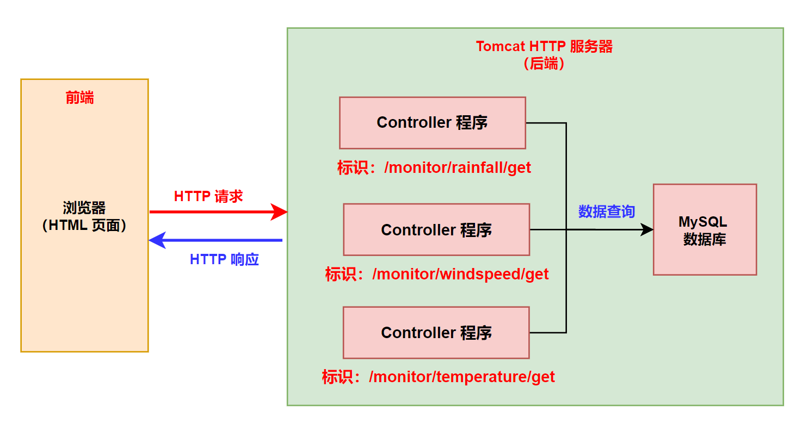
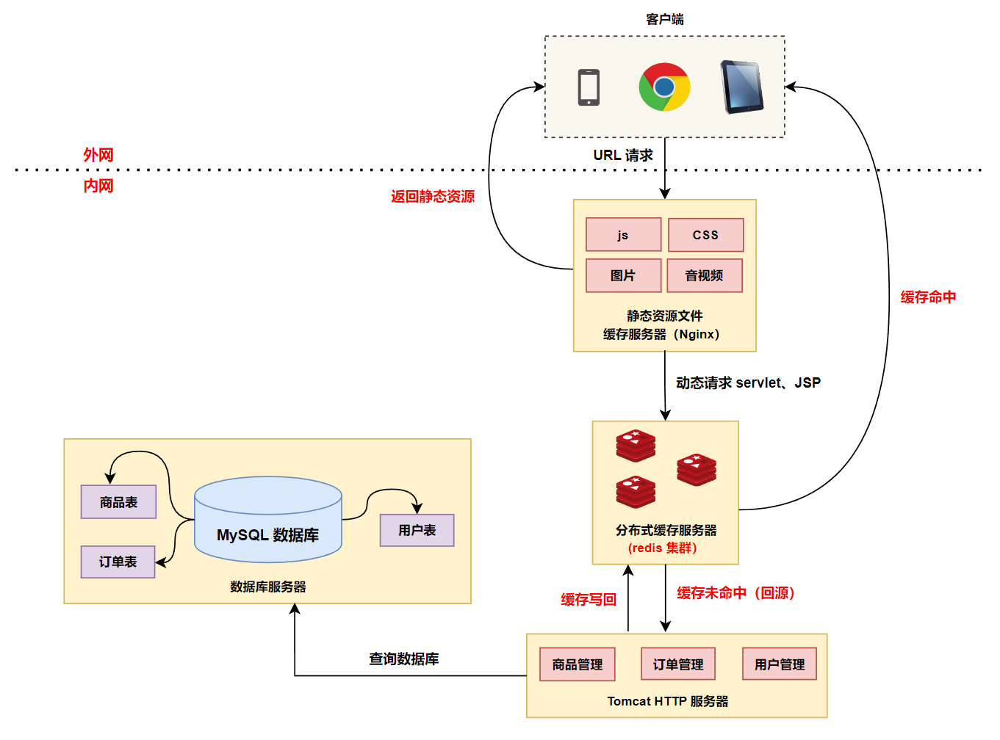
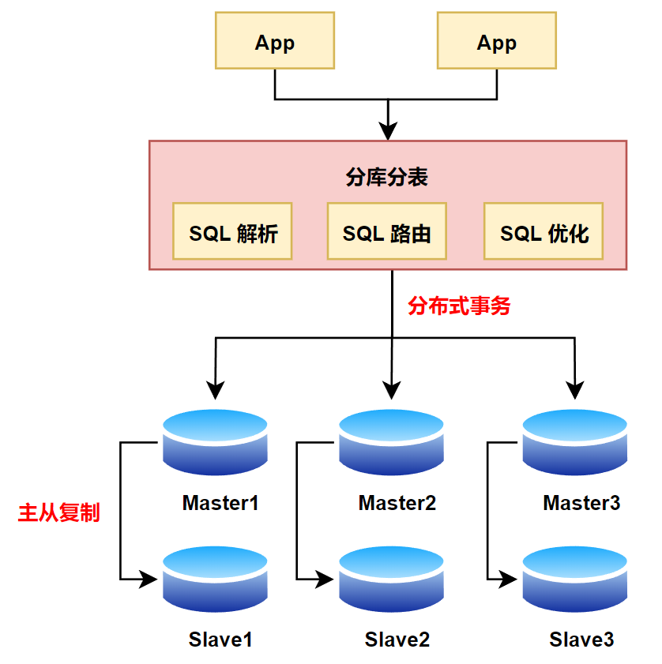
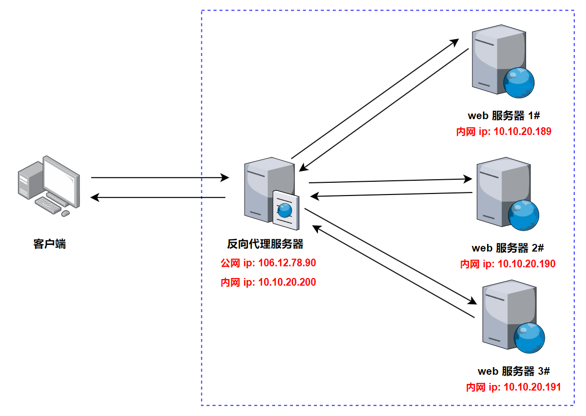

技术架构的演进，本质是不断解决规模、效率与成本的平衡问题。每一次输入 URL 后的秒级响应，背后是无数工程师对细节的极致追求。——章文嵩博士

# 一、大型网站及其技术架构演变：

## 0.前言—当你访问淘宝时，发生了什么？

比如说，马上要到 618 了，于是想给你的家人买一件毛衣，你打开了 www.taobao.com，这时你的浏览器首先查询 DNS 服务器，将 www.taobao.com 转换成 IP 地址。不过你首先会发现，在不同的地区或者不同的网络( 电信、联通、移动) 下，转换后的 IP 地址很可能是不一样的，这首先涉及到负载均衡的第一步，通过 DNS 解析域名时，将你的访问分配到不同的入口，同时尽可能保证你所访问的入口是所有入口中可能较快的一个。

DNS 的功能核心功能是将域名（如 www.taobao.com）转换为服务器 IP 地址（如 123.45.67.89），传统 DNS 解析，不判断访问者来源，会随机选择其中一个 IP 地址返回给访问者。而智能 DNS 解析，会判断访问者的来源（不同的运营商以及地域），为不同的访问者智能返回不同的 IP 地址，使访问者在访问网站时获取指定的 IP 地址，能够减少解析时延，并提升网站访问速度。

例如域名 www.cloud-example.com，有三台服务器，分别是联通 IP，移动 IP 和电信 IP，DNS 解析配置如下：

- 将域名指向联通 IP 地址 （192.x.x.1）
- 将域名指向移动 IP 地址 （192.x.x.2）
- 将域名指向电信 IP 地址 （192.x.x.3）

传统 DNS 解析不判断访问者的来源，会将 192.x.x.1、192.x.x.2、192.x.x.3 三个地址全部返回给访问者的 LocalDNS，由访问者的 LocalDNS 通过随机或者优选的方式将其中一个 IP 地址返回给访问者，传统 DNS 解析有可能会造成访问者跨网访问。

智能 DNS 解析则将域名 www.cloud-example.com 被解析到 3 个 IP 地址，分别是联通 IP，移动 IP 和电信 IP，DNS 解析配置如下：

- 解析请求来源配置 **默认 指向联通 IP 地址** （192.x.x.1）
- 解析请求来源配置 中国移动 指向移动 IP 地址 （192.x.x.2）
- 解析请求来源配置 中国电信 指向电信 IP 地址 （192.x.x.3）

云解析会判断访问者的来源：

- 为来源于中国移动运营商的访问者返回 192.x.x.2 的解析地址；
- 为来源于中国电信运营商的访问者返回 192.x.x.3 的解析地址；
- 为其他来源的访问者返回 192.x.x.1 的解析地址。

智能 DNS 地域解析，如果域名 test.cloud-example.com 被解析到 3 个 IP 地址，分别位于浙江、广东、北京，在 解析请求来源 选择时，按如下配置：

- **默认**：在记录值中输入浙江的 IP 地址（192.168.0.7）
- **中国地区-华南**：在记录值中输入广东的 IP 地址（192.168.0.8）
- **中国地区-华北**：在记录值中输入北京的 IP 地址（192.168.0.9）

实现效果如下：

- 访问者来源不属于华南和华北地区，云解析 DNS 返回 192.168.0.7
- 访问者如果来源于华南地区，云解析 DNS 返回 192.168.0.8
- 访问者如果来源于华北地区，云解析 DNS 返回 192.168.0.9

用户在 Web 浏览器中输入 example.com， 向本地域名服务器发起查询请求。此时，LocalDNS 将本次请求发送到二级节点，通过二级节点向云解析 DNS 发起请求。**<font color="red">此时云解析 DNS 会根据 LocalDNS 二级节点的地理位置返回具体的细分线路解析结果</font>**。

<div align="center">
  
</div>

你通过这个入口成功地访问了 www.taobao.com 实际的入口 IP 地址，这时产生了一个 PV（Page View），页面访问量。每日每个网站的总 PV 量是形容一个网站规模的重要指标（可以理解为访问人次）。同时作为一个独立的用户，你这次访问淘宝网的所有页面均算作一个 UV (Unique Visitor，用户访问，可以理解为人数)。而 12306.cn 的日 PV 量最高峰在 10 亿个左右，而 UV 量却远小于淘宝网十余倍，这其中的原因相信大家都知道，因为有很多爬虫程序在不停的抢票。（2012 年数据）。

因为同一时刻访问 www.taobao.com 的人数过于巨大，所以，即便是生成淘宝首页页面的服务器，也不可能仅有一台，仅用于生成 www.taobao.com 首页的服务器就有成千上万台，那么你的一次访问时生成页面给你看的任务，便会通过相应负载均衡算法被分配给其中某一台服务器完成。这个过程要保证公正、公平、平均 (即这成百上千台服务器每台负担的用户数要差不多)，这一很复杂的过程由几个系统配合完成，解决方案有 Nginx+Keepalived、LVS 等。

经过一系列复杂的逻辑运算和数据处理，用于展示的淘宝网首页的 HTML 内容便成功生成了。对 Web 前端稍微有点常识的人都应该知道，浏览器下一步会加载页面中用到的 CSS、JS (JavaScript)、图片等样式、脚本和资源文件。**<font color="red">在 2020 年双十一时，根据阿里云官方数据，订单创建峰值 TPS 为 58.3 万，QPS 峰值达到上百万</font>**。很显然，这些流量不能全部集中到一起，这时需要使用 CDN 技术，淘宝在全国各地建立了数十个甚至上百个 CDN 节点，利用一些手段保证你访问的( 这里主要指 JS、CSS、图片等) 站点是离你最近的 CDN 节点，这样便保证了大流量的分散已及在各地访问的加速。

另外，淘宝上拥有海量的宝贝图片等静态文件，这些文件的总容量也达到了数 PB (1PB=1024TB=1048576GB)，为了快速存取这些文件，**<font color="red">淘宝开发了分布式文件系统 TFS (TaoBao File System) 来处理这类问题</font>**。

经常网购的亲们会发现，当你买过一个宝贝之后，即便是商家多次修改了宝贝详情页，你仍然能够通过“已买到的宝贝”查看当时的快照。这是为了防止商家对在商品详情中承诺过的东西赖账不认。显然对于每年数十亿甚至上百亿笔交易的商品详情快照进行保存和快速调用不是一件简单的事情。这其中又涉及数套系统的共同协作，**<font color="red">其中较为重要的是 Tair (淘宝自行研发的分布式 KV 缓存方案)</font>**。

接下来，无论你是否真的进行了交易，你的这些访问行为都会如实地被系统记录下来，即你的浏览数据、交易数据以及很多其他数据都会被记录到日志中，用于后续的业务逻辑和数据分析。这些日志或者说历史数据达到了几百甚至更多的 PB，如此巨大的数据保存在阿里巴巴的数据仓库中——由基于 Hadoop 的 3000 台服务器组成。

说了这么多，其实也只是叙述了淘宝上正在运行的成千上万个系统中的寥寥几个。即便是你仅仅访问一次淘宝的首页，所涉及的技术和系统规模都是你完全无法想象的，是淘宝上万名顶级的工程师们的心血结晶，其中甚至包括长江学者、国家科学技术最高奖得主等众多牛人。同样，百度、腾讯等的业务系统也绝不比淘宝简单。你需要知道的是，你每天使用的互联网产品看似简单易用，背后却凝聚着难以想象的智慧与劳动。

## 1.单体架构

任何网站的发展都不是一蹴而就的，通常是在什么阶段采用什么技术。在发展的过程中，网站会遇到各种各样的问题，正是这些原因才推动着技术的进步和发展，即使是淘宝这种巨型网站也是从使用一台服务器开始，到采用几十万台以上的服务器。

淘宝最开始是从美国人买的一个拍卖网站，系统的名字叫做 PHPAuction，然后买的是最高版本的，而且对方提供的源代码，功能比较多，花了 2000 美元。此时网站的技术架构为 LAMP（Linux+Apache+MySQL+Php），即 Linux 作为操作系统，Apache/Tomcat 作为 HTTP 服务器，MySQL 作为数据库，Php 作为开发语言。我们基本上会选择一个开源的 Server 作为容器，比如说 Tomcat/Apache；直接使用 Spring（容器）+SpringMVC（Web 框架）+MyBatis（ORM 框架） 等开源框架来构建我们的应用；选择一个开源的关系型数据库（MySQL）来存储数据；后端程序通过 JDBC 进行数据库的连接和操作，这样一个最基础的环境就可以工作了。

当时整个淘宝的开发团队只有 3 个开发工程师，1 个 UI 工程师，3 个运营，1 个经理。然后整个淘宝系统是在 2003 年 5 月 10 日上线。整体系统架构如下所示：

<div align="center">
  
</div>

>淘宝和支付宝这两个今天阿里系的重量级产品，名字都是由淘宝最初开发团队中一个运营（名字叫阿珂）取的。

这大概就是 20 年前的网站开发技术，相比于今天各种云原生以及微服务组件和框架来说，可以说是烧火棍和主战坦克的区别。

- 古老技术：LAMP（Linux+Apache+MySQL+PHP）、Struts2、Hibernate、JSP、Servlet、JQuery、CSS、JavaScript 等；
- 新技术和框架：SpringMVC、SpringBoot、SpringCloud、Tomcat、MyBatis、React/Vue/Angular 等；

以下分别是互联网数字档案馆中 2003 年的新浪网和淘宝网的页面，非常非常的简陋：

<div align="center">
  <div align="center" style="color: #F14; font-size:13px; font-weight:bold">早期淘宝网页面</div>
  
</div>
</p>
<div align="center">
  <div align="center" style="color: #F14; font-size:13px; font-weight:bold">早期新浪网页面</div>
  
</div>

大部分在学校接触网站开发的同学都是从这样的做法开始的，目前平台级的应用（支付宝、微信），在最开始的时候都是单体架构。上面架构图中的商品管理、订单管理、用户管理都是在一个 JVM 中，或者说所有的代码都是在一个项目中，开发人员可以在自己的 PC 机上随时开发、调试、测试整个系统的功能，实时感知系统的全貌。当需要快速验证某一个系统或者商业模式时，目前就可以使用单体架构。

单体架构的缺点：

- 单体架构的系统存在严重的代码耦合问题，首先修改一处代码，可能会影响很多代码无法正常使用运行；其次，单体架构中不稳定的功能模块崩溃之后会直接影响到其他功能模块；
- 单体架构的系统功能模块变更对部署影响更大，当任一一个功能模块发生变化时，整个系统需要重新编译，打包以及部署；
- 单体架构的扩展性受限；

### 1.1 前端、后端、接口

前端是我们在网页或移动应用程序中看到的页面，它由 HTML 和 CSS 编写而成，让我们看到漂亮的页面，并进行一些简单的校验，例如确保必填字段不为空。后端则实现了页面上的业务逻辑和功能，例如淘宝的购物功能。当在页面上进行下单操作时，后端会负责扣除余额。**<font color="red">只需要记住：前端负责让页面看起来漂亮，后端负责实现网页的功能</font>**。

除了网页之外，对于安卓/iOS 上的 APP（雅水移动），或者是微信小程序，或者是 Windows/Mac 上的软件（比如 WPS），都是同一个道理，都会区分前端和后端。在这里，**<font color="red">前端就是在你的手机或者电脑上运行的那个软件，后端则是在服务器上运行的那个软件</font>**。

对于网页端、安卓/IOS、微信小程序等不同客户端上的相同功能，在后端服务器上共用一套代码，后端程序根据 User-Agent 中的信息来区分请求来自网页还是移动端 APP。

```c{.line-numbers}
Windows10 / Chrome 136.0.0.0：user-agent Mozilla/5.0 (Windows NT 10.0; Win64; x64) AppleWebKit/537.36 (KHTML, like Gecko) Chrome/136.0.0.0 Safari/537.36
Android / Edge 42.0.2.3819：Mozilla/5.0 (Linux; Android 7.1.1; OPPO R9sk) AppleWebKit/537.36 (KHTML, like Gecko) Chrome/73.0.3683.90 Mobile Safari/537.36 EdgA/42.0.2.3819
Iphone 6s：Mozilla/5.0 (iPhone 6s; CPU iPhone OS 11_4_1 like Mac OS X) AppleWebKit/604.3.5 (KHTML, like Gecko) Version/11.0 MQQBrowser/8.3.0 Mobile/15B87 Safari/604.1 MttCustomUA/2 QBWebViewType/1 WKType/1
iPad：Mozilla/5.0 (iPad; U; CPU OS 3_2 like Mac OS X; en-us) AppleWebKit/531.21.10 (KHTML, like Gecko) Version/4.0.4 Mobile/7B334b Safari/531.21.10
```

而前后端之间的通信就依赖接口，接口是一种通信机制，用于在前端和后端之间交换信息。可以将其想象为两个人之间在对话。当前端需要某些信息或执行某些任务时，它会通过一个接口向后端发送请求。这个请求就像是一个问题，告诉后端需要做什么。后端则会根据请求执行相应的操作，并将结果返回给前端。这个结果就像是答案，告诉前端完成了什么任务或提供了哪些信息。

这里以前期工程数字化指挥平台提供的气象监测接口为例：

- 雨量计监测数据获取接口地址：https://mdgzhpt.ylhdc.com.cn/api/monitor/rainfall/get，真正的接口为：/monitor/rainfall/get
- 风速仪监测数据获取接口地址：https://mdgzhpt.ylhdc.com.cn/api/monitor/windspeed/get，真正的接口为：/monitor/windspeed/get
- 温度监测数据接口地址：https://mdgzhpt.ylhdc.com.cn/api/monitor/temperature/get，真正的接口为：/monitor/temperature/get

在后端服务器中，上面 3 个接口分别有 3 个对应的 Controller 程序，不同接口的 HTTP 请求就被分发到不同的 Controller 程序中处理，最后查询数据库获取到数据之后，保存到 HTTP 响应报文中，返回给浏览器解析并展示。

<div align="center">
  
</div>

### 1.2 Linux 操作系统

上述所有的软件，包括 Tomcat、MySQL 数据库都是运行在服务器的 Linux 操作系统之上，目前服务器操作系统最常用的就是 Linux，下面介绍一下 Linux 操作系统的历史。

Linux 操作系统的历史最早要追溯到 Multics 操作系统，Multics（MULTiplexed Information and Computing Service）是一个早期的分时操作系统，1964 年由美国国防部委托贝尔实验室、麻省理工学院和美国通用电气公司共同研发，其目的是实现连接 1000 部终端机，支持 300 个用户同时在线。但是在当时的技术条件下，研发这样的通用操作系统存在了太多难以解决的技术难题。以至于研发进度极为缓慢，直至 1969 年，MULTICS 依然难以问世。随后贝尔实验室退出了研发队伍，而美国国防部也决定裁撤 MULTICS 项目，通用公司随即退出。

虽然 Multics 操作系统的研发失败了，但是其分时多任务系统、分层文件系统（树形目录结构）、虚拟内存、基于 Ring 的安全模型（后面成为了 Intel x86 CPU 的 Ring0-3）等设计理念和技术对后来的操作系统产生了深远影响。

<div align="center">
  
</div>

贝尔实验室退出之后，开发项目组中的一个人叫做肯・汤普森（Ken Thompson），之前在 Multics 上开发了一款名叫 "星际旅行（Space Travel）" 的游戏。退出 Multics 项目后，肯・汤普森就没办法继续玩这个游戏了。于是，他突发奇想，打算在一台空闲的 PDP-7（DEC 公司生产的一种小型计算机，性能很低）上，开发一个简单操作系统，运行这个游戏。1969 年 8 月，肯・汤普森趁着妻子回家探亲，用了 1 个月的时间，使用汇编语言，写出了一个简版的 Multics 系统（包括一组内核程序，一些内核工具程序，以及一个小的文件系统）。这个操作系统就是未来 Unix 操作系统的雏形。

后面肯・汤普森（Ken Thompson）和丹尼斯・里奇（Dennis Ritchie，C 语言之父）使用 C 语言对这个操作系统进行了重写，Unix 操作系统正式诞生。

>丹尼斯・里奇是 C 语言之父，他发明了计算机行业的钢筋混凝土。因为开发了 Unix 和 C 语言肯・汤普森（Ken Thompson）和丹尼斯・里奇（Dennis Ritchie）共同获得了 1983 年的图灵奖。

<div align="center">
  <div align="center" style="color: #F14; font-size:13px; font-weight:bold">Ken Thompson（左）和 Dennis Ritchie（右）</div>
  
</div>

但是随着 AT&T 公司将 Unix 源代码私有化。Unix 开始走向了商业闭源之路，且 Unix 发行版相当昂贵。这个时候荷兰的一个大学教授塔雷鲍姆，他在大学为了教学操作系统，但苦于学生买不起太贵的 Unix 发行版，于是自己写了一个兼容 Unix 标准操作系统（主要是兼容 POSIX 标准），叫做 Minix。只要买了下面这本书《操作系统设计与实现》就可以免费邮寄一份 Minix 源代码。Minix 为了方便教学，保持代码的简洁，塔雷鲍姆拒绝向里面添加太多复杂的功能。

<div align="center">
  
</div>

后来，芬兰赫尔辛基大学的一个研究生林纳斯·托瓦兹（Linus Torvalds），花了一个暑假看完了上面《操作系统设计与实现》这本书，然后基于 Minix 操作系统自己编写了一个操作系统，以自己的名字命名，并且根据当时操作系统命名的惯例，加上后缀 ix，就是现在的 Linux 操作系统。 

<div align="center">
  
</div>

Linux 的内核基本上只有一种来源，那就是由 Linus 主持开发和维护的内核版本。但是有很多公司在发行 Linux 操作系统不同的发行版 (distribution)，如 Red Hat、Ubuntu 等等。虽然不同的发行版本中所采用的内核在版本上有所不同，但其来源基本一致。各发行版的不同之处一般表现在安装程序、安装界面、软件包的多少、软件包的安装和管理方式等方面，在特殊情况下也有对内核代码稍作修改的(如汉化)。不同的发行版由不同的发行商提供服务。不同的发行商对自己所发行版本的定位也有不同，各厂商所能提供的售后服务、技术支持也各不相同。由此可见，原则上全世界只有一个 Linux，所谓某某 Linux 只是它的一种发行版本或修订版本。

对于大多数用户，由发行商提供的这些发行版起着十分重要的作用。让用户自行配置和生成整个系统是相当困难的，因为那样用户不但要自己下载内核源程序，自己编译安装，还要从不同的 FTP 站点下载各种自由软件添加到自己的系统中，还要为系统加入各种有用的工具，等等。而所有这些工作都是很费时费力的事情。Linux 的发行厂商正是看到了这一点，替用户做了这些工作，在内核之上集成了大量的应用软件。并且，为了安装软件，发行厂商同时还提供了用于软件安装的工具性软件。

<div align="center">
  
</div>

Linux 操作系统最开始只是 Linus Torvalds 自己编写的一个玩具操作系统项目，随后 GNU 开始支持 Linux，Linux 成为了 GNU 的官方操作系统，所以现在叫 GNU/Linux。根据 IDC 的数据显示，截止到 2022 年在全球服务器操作系统市场中，Linux 占据超过 80% 的市场份额，Windows 市场份额在 19% 左右，Unix 仅占 0.1% 左右市场份额。世界上 500 个最快的超级计算机已 100％ 运行 Linux 发行版或变种。Linux 操作系统最开始由 Linus 编写，但是其后续的发展，离不开全世界硬件厂商、软件厂商以及无数开源开发者的支持和贡献。在 github 上，Linux 操作系统的贡献者显示为无穷。

<div align="center">
  
</div>

## 2.单机负载警告，数据库与应用分离

随着网站业务的发展，会出现两个问题。第一个问题，由于应用程序与数据库都是放在一台服务器中，随着用户数量越来越多，上传的数据越来越大，最后可能非常庞大，一台服务器的硬盘可能存储不了，**<font color="red">所以这时必须将 web 应用和数据库进行分离，分别部署在两台服务器上</font>**，数据库部署在另外一台或者多台机器上可以方便进行横向扩展。

应用服务器（或者说 Web 服务器）对外提供提供应用服务，以及进行业务逻辑计算，一般会绑定一个公网 IP 地址；而数据库服务器则用来部署数据库，MySQL、Oracle、SqlServer 等。

<div align="center">
  
</div>

- 对于应用/Web 服务器来说，由于需要进行大量的业务逻辑处理，所以需要更快更强的 CPU。
- 对于数据库服务器来说，首先需要大量的高速存储介质 SSD，其次需要大内存配置。

### 2.1 内网和外网

IP 地址就是给互联网上的每一台主机 (或路由器) 的每一个接口分配一个在全世界范围内是唯一的 32 位的标识符。IP 地址现在由互联网名字和数字分配机构 ICANN (Internet Corporation for Assigned Names and Numbers) 进行分配。以下是 ICANN 的官网截图：

<div align="center">
  
</div>

ICANN 不负责向个人或组织分配 IP 地址，ICANN 只负责根据 IETF 的指示向五个地区互联网注册管理机构 (RIR) 分配 IP 地址。然后，RIR 将 IP 地址分配给互联网服务提供商，再由互联网服务提供商将地址分配给网络和个人用户。其中 IETF 互联网工程任务组（英语：Internet Engineering Task Force，缩写：IETF）是一个开放的标准组织，负责开发和推广自愿互联网标准，TCP/IP 协议族（TCP/IP）的标准就是由 IETF 开发和推广的。

区域互联网注册机构（Regional Internet Registry，RIR），是管理世界上某特定地区 Internet 资源的组织。Internet 资源包括 IP 地址（包含 IPv4 和 IPv6）和使用在 BGP 路由中的自治系统号（Autonomous System number）。中国属于亚太网络信息中心。

单播的 IP 地址被划分为以下三类：

- A 类 IP 地址范围为：1.0.0.1 ~ 126.255.255.254
- B 类 IP 地址范围为：128.0.0.1 ~ 191.255.255.254
- C 类 IP 地址范围为：192.0.0.1 ~ 223.255.255.254

RFC 1918 指明了一些专用地址 (private address)。这些地址只能用于一个机构的内部通信，而不能用于和互联网上的主机通信。在互联网中的所有路由器，**<font color="red">对目的地址是专用地址的数据报一律不进行转发</font>**。

- A 类中的专用地址范围为：10.0.0.0 ~ 10.255.255.255
- B 类中的专用地址范围为：172.16.0.0 ~ 172.31.255.255
- C 类中的专用地址范围为：192.168.0.0 ~ 192.168.255.255

考虑到互联网并不安全，一个机构内也并不需要把所有的主机接入到外部的互联网，因为大部分情况下，很多主机主要还是和本机构内的其他主机进行通信，例如在大型公司、政府机构中，有很多用于营业和管理的计算机。显然这些计算机并不都需要和互联网相连，对于这些仅在机构内部使用的计算机就可以由公司自行分配其专用 IP 地址。这些拥有专用 IP 地址设备所组成的网络就称为专网/私网/内网，而由拥有公网 IP 地址设备所组成的网络就称为公网/外网。

公司科数部分配给孟底沟建设管理局的专网 IP 地址范围为 10.186.176.0/24~10.186.191.0/24，一共大概 4096 个 IP 地址。

>**<font color="red">专用 IP 地址段可被不同内网重复使用，缓解 IPv4 地址枯竭问题。专网 IP 设备要访问互联网就必须通过 NAT 映射。</font>**

### 2.2 端口号

IP 地址是主机网络接口在网络中的标识，但是“两台计算机之间进行通信”这个说法不太清楚，真正通信的实体是主机中的进程，是这台主机中的一个进程在和另外一个主机中的一个进程进行通信。因此通信的真正端点并不是主机，而是主机中的进程。所以 IP 地址用来找到对方的主机在哪里，而端口号则用来在主机中找到对应的进程。

<div align="center">
  
</div>

IANA（互联网数字分配机构）规定端口号 0~1023 保留给 TCP/IP 中最重要的程序使用，用户程序不能使用，具体分配可以在 www.iana.org 网站上查询：

- **`FTP`** 端口号：21
- **`TELNET`** 端口号：23
- **`HTTP`** 端口号：80
- **`HTTPS`** 端口号：443
- **`DNS`** 端口号：53

## 3.使用缓存改善性能

### 3.1 分布式缓存

但是随着用户数量的增多，网站的相应速度又开始变慢，可能是访问数据库的操作太多，导致数据库连接竞争变得激烈。**<font color="red">此时需要引入高并发三剑客（缓存、分库分表、消息队列）之一的缓存</font>**。缓存热门商品信息或热门商品的 html 页面等。通过缓存能把绝大多数请求在读写数据库前拦截掉，大大降低数据库压力。

举例说明什么叫做缓存，比如在孟底沟办公室，如果有同事提出请求需要拿药，每次都由启群响应负责去仓库中取药品再拿给同事。但是有些常用药品（治疗感冒，拉肚子）需要的人很多，可能每天都有人要拿，启群每次都需要去仓库中取药品，费时费力。于是启群想了一个办法，她去仓库中把 **<font color="red">最常用</font>** 的药品 **<font color="red">少量</font>** 拿了一些 **<font color="red">放到办公室的箱子中</font>**，后面有同事需要常用药品时，启群直接从这个箱子中取就可以。但如果有同事 **<font color="red">需要一些不常用的药品</font>**（如治疗高血压），启群可能还是要去仓库中取药品，但是这种需求可能只占30%，所以启群想的这个办法还是非常有效率的。

这里面最重要的几个概念分别是：最常用、少量，也就是办公室药箱空间有限，不可能将仓库中所有的药品都搬到药箱中，因此只能选取少量药品。而因为数量限制，且为了提高命中率，就必须将最常用的药品放到药箱中。

<div align="center">
  
</div>

网站访问特点遵循二八定律：80% 的业务访问集中在 20% 的数据上。

当某些热点事件发生时，百度/微博搜索关键词集中在少部分热门词汇上。因此新浪微博使用多级缓存策略，热门微博和明星用户的微博缓存在所有的微博服务器上，在线用户的微博和近期微博缓存在分布式缓存集群中，对于微博操作中最常见的“刷微博”操作，几乎全部都是缓存访问操作，可以获得很好的系统性能。

举例来说，淘宝网还有很多文件需要存储,最主要的就是图片、商品描述、交易快照，一个商品要包含几张图片和一长串的描述信息，而每一张图片都要生成几张规格不同的缩略图。淘宝买家浏览的商品集中在少部分成交数多、评价良好的商品上，特别是在电商节（比如双十一、618等）中，某些关键词衣服、化妆品、电子产品等搜索频率非常高。因此淘宝网的商品照片，尤其是热门商品图片的访问流量是非常大的。在淘宝网整体流量中，图片的访问流量要占到 90% 以上，而且这些图片平均大小为 17.45KB, 小于 8KB 的图片占整体图片数量的 61%, 占整体系统容量的 11%。文件比较小、并发量高、读操作远大于写操作、访问随机、没有文件修改的操作、要求存储成本低。

**<font color="red">所以我们可以把这一小部分访问频率极其高的数据缓存在内存中，就可以减少数据库的访问压力，提高整个网站的数据访问速度</font>**。

在下面的架构图中，我们使用了两种缓存。

第一种是网页的静态资源缓存，这里的静态资源包括网页中的图片、音视频等多媒体数据、js、CSS 等。为了提高网站的响应速度，减轻程序服务器（Tomcat）的负载，对于静态资源，如图片、js、css 等文件，可以在 Nginx 反向代理服务器中进行缓存，这样浏览器在请求一个静态资源时，代理服务器就可以直接处理，而不用将请求转发给后端服务器，加快了网站的响应速度。对于用户请求的动态文件，如 servlet、jsp，则转发给 **Tomcat** 服务器处理，这就是动静分离。即动态文件与静态文件的分离。通常将静态资源放到 nginx 中，动态资源转发到 Tomcat 服务器中。

第二种是使用 redis 集群做了一个分布式缓存系统，热点数据保存到 redis 内存中，如果分布式缓存命中，则直接返回相应的数据，不再需要将请求继续发送到 Tomcat 服务器，并且继续查询 MySQL 数据库。当缓存没有命中时，则需要继续去查询数据库，并且将数据写回到 redis 缓存中，方面下次查询。

<div align="center">
  
</div>

>随着小红书业务体量迅速上涨，缓存系统（Redis）规模也在不断扩张，目前整体 QPS 高达 2 亿 +，内存 300TB+。

但是引入分布式缓存之后，也增加了整个系统的复杂度和维护难度，分布式缓存存在如下问题：

- 缓存数据一致性：如果用户对数据库中的数据进行了更新，那么数据库和缓存中的数据就变得不一致了；（双写：既往数据库中写数据，也往缓存中写数据；失效模式：缓存中数据设置失效时间 ）
- 缓存穿透：指查询一个一定不存在的数据，由于缓存肯定不命中，将去查询数据库。利用不存在的数据恶意查询，进行攻击，数据库瞬时压力增大，最终导致崩溃；（缓存空对象）
- 缓存雪崩：我们设置缓存时 key 采用了相同的过期时间，导致缓存在某一时刻同时失效，请求全部转发到 DB，DB 瞬时压力过重崩溃；（缓存过期时间加上一定随机值）
- 缓存击穿：对于一些设置了过期时间的 key，如果这些 key 可能会在某些时间点被超高并发地访问，是一种非常“热点”的数据。如果这个 key 在大量请求同时进来前正好失效，那么所有对这个 key 的数据查询都落到 db，我们称为缓存击穿；（使用分布式锁，redis、zookeeper 实现）

对于前期数字化指挥平台，也采用了类似的 redis 单机缓存，在此平台中，如果用户访问了待办、已办等数据，系统就会自动将待办、已办数据写入到 redis 缓存中，并且设置过期时间为 1 天。

### 3.2 CDN（内容分发网络）

内容分发网络（Content Delivery Network，简称 CDN）是建立并覆盖在承载网之上，由分布在不同区域的边缘节点服务器群组成的分布式网络。CDN 应用广泛，支持多种行业、多种场景内容加速，例如：图片小文件、大文件下载、视音频点播、直播流媒体、全站加速、安全加速。现在主流的云服务厂商，如阿里云、腾讯云、华为云均提供 CDN 应用。

以下就是京东物流在中国的布局，有 8 个大型物流枢纽以及 43 座亚洲一号大型物流园区，以京东自营 B2C 模式为例，供应商的货品生产出来之后，往往会被前置存储到京东物流在全国运营的 43 座 “亚洲一号” 大型智能物流园区和约 1400 个仓库中。

<div align="center">
  
</div>

这样做有以下几个好处：

- 比如一部手机是在上海的工厂生产的，用户从成都或者北京下单，每次都需要从上海发货，物流时间太长。但是有了本地仓之后，手机等货品可以前置存储到京东物流在全国各地的仓库中。**<font color="red">大幅缩短物品配送距离，实现“当日达”或“次日达”的时效承诺</font>**。
- 在双十一、618 等购物节之前，本地仓的商品选品基于京东大数据分析，**<font color="red">优先存储预估热销的商品，确保库存与需求的精准匹配</font>**。**<font color="red">实现了物流压力的分散化，避免物流核心枢纽的过载</font>**，如果所有的商品/货物都从原产地（比如上海）发货，在大促期间，巨大的物流压力可能拖垮或者击穿当地物流系统，甚至使得系统瘫痪。
- 减少跨省干线运输车辆密集往返，降低高速公路、铁路枢纽的拥堵。

CDN 技术和京东本地仓物流有类似的好处：

- **<font color="red">减少延迟，提高访问速度</font>**：虽然网络传输在理论上接近光速，但是在实际中，网络请求会经过非常多的网关、交换机、节点服务器等，所以你会发现在东北访问深圳的服务器有几百毫秒的延迟，访问国外的网站更慢。CDN 就是采用更多的缓存服务器（CDN 边缘节点），布放在用户访问相对集中的地区或网络中。当用户访问网站时，利用全局负载技术，将用户的访问指向距离最近的缓存服器上/CDN 边缘节点，由缓存服务器响应用户请求。这样不再需要跨越长距离 IP 路由，从而使用户能以最快的速度，从最接近用户的地方获得所需的信息，彻底解决网络拥塞，提高响应速度。
- **<font color="red">预缓存热门资源，避免源站过载</font>**：可以提前将热门资源（比如热门电视剧、电影、视频等资源）缓存到 CDN 边缘节点中，避免源站过载。
- **<font color="red">降低通信骨干网的压力</font>**：互联网服务提供商采用 CDN，是以存储换时延。通信运营商也追捧 CDN，但它们的目的，是以存储换带宽——通过服务“下沉”，减轻上层骨干网络的流量压力，避免硬件扩容，降低网络建设成本。即将 70% 以上的视频、下载类流量收敛在城域网层面，避免高频次业务流量向骨干网汇聚。

>这个很好理解啊，如果大量的业务流量数据在骨干网跑来跑去，骨干网肯定吃不消，要拼命扩容。如果这些业务流量数据在底层就被解决了，那么，骨干网的带宽压力自然就减轻了。

腾讯云内容分发网络 CDN 在中国境内拥有 2000+ 个加速节点，境内总储备带宽 110Tbps+。境内加速节点均为腾讯高规格、高安全性自建机房，享受运营商高质量网络，节点覆盖境内所有省份、自治区、直辖市。下图就是腾讯云 CDN 在中国境内的节点示意图。

>**淘宝的图片访问，有 98% 的流量都走了 CDN 缓存。只有 2% 会回源到源站，节省了大量的服务器资源。**

<div align="center">
  
</div>

CDN 访问的大概流程如下所示：

<div align="center">
  
</div>

每个云厂商的 CDN 需要有一套自己的 DNS 系统，比如域名 www.baidu.com 在经过标准域名解析系统进行解析之后，转换成的 IP 地址指向百度北京机房。因此 wwww.baidu.com 通过自定义的域名解析系统，将其解析到离用户最近的边缘节点。CDN 的具体工作过程如下所示：

<div align="center">
  
</div>

为了更清晰地说明 CDN 的工作原理，下面以客户端发起对 www.example.com/index.html 的 HTTP 请求为例进行说明：

1. 用户发起对 www.example.com/index.html 的 HTTP 请求，首先需要通过本地 DNS 通过【迭代解析】的方式获取域名 www.example.com 的 IP 地址；
2. 如果本地 DNS 的缓存中没有该域名的记录，则向根 DNS 发送 DNS 查询报文；
3. 根 DNS 发现域名的前缀为 com，则给出负责解析 com 的顶级 DNS 的 IP 地址；
4. 本地 DNS 向顶级 DNS 发送 DNS 查询报文；
5. 顶级 DNS 发现域名的前缀为 example.com，在本地记录中查找负责该前缀的权威 DNS 的 IP 地址并进行回复；
6. 本地 DNS 向权威 DNS 发送 DNS 查询报文；
7. 权威 DNS 查找到一条 NAME 字段为 example.com 的 CNAME 记录，该记录的 Value 字段为 example.cdn.com；并且还找到另一条 NAME 字段为 example.cdn.com 的 A 记录，该记录的 Value 字段为 GSLB 的 IP 地址；
8. 本地 DNS 向 GSLB 发送 DNS 查询报文；
9. GSLB 根据 **<font color="red">本地 DNS 的 IP 地址</font>** 判断用户的大致位置为成都，筛选出位于成都且综合考量最优的 SLB 的 IP 地址填入 DNS 回应报文，作为 DNS 查询的最终结果；
10. 本地 DNS 回复客户端的 DNS 请求，将上一步的 SLB 的 IP 地址作为最终结果回复给客户端；
11. 客户端根据 IP 地址向 SLB 发送 HTTP 请求 www.example.com/index.html；
12. SLB 综合考虑缓存服务器集群中各个节点的资源限制条件、健康度、负载情况等因素，筛选出最优的缓存节点后回应客户端的 HTTP 请求 (状态码为 302，重定向地址为最优缓存节点的 IP 地址)；
13. 客户端接收到 SLB 的 HTTP 回复后，重定向到该缓存节点上；
14. 缓存节点判断请求的资源是否存在、过期，将缓存的资源直接回复给客户端，否则到源站进行数据更新再回复；

下面介绍一下 DNS 的记录类型：

在 DNS 系统中，最常见的资源记录方式是 Internet 类记录，该记录由包含 4 个字段的数据构成：Name、Value、Type、TTL。其中 Name 和 Value 可以理解为一对键值对，但是其具体含义取决于 Type 的类型，TTL 记录了该条记录应当从缓存中删除的时间。在资源记录的类型中中，最为常见且重要的类型 Type 主要有:

- A 记录 (Address)：A 记录用于描述目标域名到 IP 地址的映射关系，将目标域名与 A 记录的 Name 字段进行匹配，将成功匹配的记录的 Value 字段的内容 (IP 地址) 输出到 DNS 回应报文中。
- CNAME 记录：CNAME 记录用于描述目的域名和别名的对应关系，如果说 A 记录可以将目标域名转换为对应主机的 IP 地址，那么 CNAME 记录则可以将一个域名 (别名) 转换为另一个域名，如果多条 CNAME 记录指向同一个域名，则可以将多个不同的域名的请求指向同一台服务器主机。并且，CNAME 记录通常还对应了一条 A 记录，用于提供被转换的域名的 IP 地址。

>CDN 的域名加速需要用到 CNAME 记录，在阿里云控制台配置完成 CDN 加速后，您会得到一个加速后的域名，称之为 CNAME 域名（该域名一定是\*.\*http://kunlun.com），用户需要将自己的域名作 CNAME 指向这个*.*http://kunlun.com 的域名后，域名解析的工作就正式转向阿里云，该域名所有的请求都将转向阿里云 CDN 的节点。

```
记录类型      域名                             记录值 
CNAME       example.com                       www.example.com.w.kunlunsl.com
A           www.example.com.w.kunlunsl.com    10.10.10.10 
```

<div align="center">
  
</div>

CDN 使用类型包括大文件下载（大于 20M 文件下载，比如应用商店、游戏下载等）、网站加速、视频点播；

>阿里云 CDN 在全球拥有 3200+ 节点。中国内地拥有 2300+ 节点，覆盖 31 个省级区域，大量节点位于省会等一线城市；海外、中国香港、中国澳门和中国台湾拥有 900+ 节点，覆盖 70 多个国家和地区。全网带宽输出能力达 180 Tbps。广泛布局的高性能节点，可显著提升信息传递效率。**<font color="red">双十一期间，凭借中国内地加速节点、智能弹性调度系统及安全防护能力，完美支持过亿 QPS 峰值</font>**，保障全球数亿买家快速浏览高清图片和视频，实现流畅下单，抵挡住了双十一流量洪峰。

## 4.数据库读写分离

数据库，应该是一个应用当中最为核心的价值所在，也是开发过程中必须熟练掌握的工具。在增加了分布式缓存，且缓存命中率较高时，随着访问请求数量的继续增加，剩下未命中的请求的绝对数量也很多，导致数据库的压力增大。要提升数据库的性能，最直接的思路，当然是对数据库本身进行优化。例如对 MySQL 进行调优，优化 SQL 逻辑，优化索引结构，直接优化 MySQL 的源码，加磁盘，加内存。这种思路叫做 scale up 升级，纵向扩展，但是单节点机器性能毕竟是有天花板的。按照现在主流的思路，更倾向于去做 scale out，也就是横向扩展，即让尽量多的集群去做简单的事情，而不是让一台高性能机器去做所有的事情。

- 数据量和业务量快速增长，会带来性能瓶颈、服务宕机等很多问题。
- 单点部署的数据库无法保证服务高可用。
- 单点部署的数据库无法进行水平扩展，难以应对业务爆发式的增长。

这里我们需要引入高并发三剑客的第二个，读写分离与分库分表。

### 4.1 读写分离

为什么要进行读写分离，个人觉得还是业务发展到一定的规模，驱动技术架构的改革，读写分离可以减轻单台服务器的压力，**<font color="red">将读请求和写请求分流到不同的服务器，分摊单台服务的负载，提高可用性，提高读请求的性能</font>**。

在业务复杂的系统中，有这么一个情景，有一句 sql 语句需要锁表，导致暂时不能使用整个数据库的读服务，那么就很影响运行中的其他业务，现在部署多台 MySQL 数据库，其中主库负责写，从库负责读，这样即使主库出现了锁表的情景，通过读从库也可以保证业务的正常运作。同时部署了多台 MySQL 数据库，当其中一台数据库宕机之后，其他数据库也能对外提供服务。

下图是一个基础的 Mysql 的主从架构，1 主 3 从，共 4 个节点。这种架构是客户端主动做的负载均衡，也就是说由客户端来选择数据库进行读写。MySQL 的读写分离是指只在主服务器上写，在从服务器上读，主数据库处理事务性操作，从数据库处理 SELECT 查询，进行读操作时。实现方式是在应用和数据库之间增加代理层，代理层接收应用对数据库的请求，根据不同请求类型转发到不同的实例，在实现读写分离的同时可以实现负载均衡。

虽然 MySQL 的主库和从库之间存在主从复制，也就是将一个 MySQL 主节点的数据复制到一个或者多个从节点（最终一致性而不是强一致性）。但是由于主从之间存在延迟，当主库上一个事务更新完成后马上发起读请求，如果选择读从库的话，很有可能读到这个事务更新之前的状态，我们把这种读请求叫做过期读，即读取到的数据不是最新的。

<div align="center">
  
</div>

因此读写分离适用于业务层容忍短暂数据不一致的情况，不适用于需要保证数据强一致性的场景，比如在金融转账领域，对方转账一笔钱到我的账户中，然后我立即查询余额，此时这个查询账户余额的读操作必须走主库，否则如果我的读操作走了从库，而 MySQL 主从之间的数据还没有同步，我发现我账户上还是没有收到钱，这时就会引起一系列的纠纷。

>比如访问淘宝网的时候，大部分时候都是从数据库中读取商品图片、描述图片和各种规格不同的缩略图。

### 4.2 主从复制

MySOL 主从复制是指数据可以从一个 MySOL 数据库服务器主节点复制到一个或多个从节点。MySQL 默认采用异步复制方式，这样从节点不用一直访问主服务器来更新自己的数据，数据的更新可以在远程连接上进行，从节点可以复制主数据库中的所有数据库或者特定的数据库，或者特定的表。主从复制的过程如下所示：

<div align="center">
  
</div>

主从复制的基本过程如下:

- master（主数据库）将用户对数据库更新的操作以二进制格式保存到 binlog 日志文件中；
- slave（从数据库）上面的 I/O 进程连接上 master，并请求从指定日志文件的指定位置（或者从最开始的日志）之后的日志内容；
- master 接收到来自 slave 的 I/O 进程的请求后，通过负责复制的 I/O 进程根据请求信息读取制定日志指定位置之后的日志信息，返回给 slave 的 I/O 进程。返回信息中除了日志所包含的信息之外，还包括本次返回的信息已经到 master 端的 binlog 文件的名称以及 binlog 的位置；
- slave 的 I/O 进程接收到信息后，将接收到的日志内容依次添加到 slave 端的 relay-log 文件的最末端，并将读取到的 master 端的 binlog 的文件名和位置记录到 master-info 文件中，以便在下一次读取的时候能够清楚的告诉 master 我需要从某个 binlog 的哪个位置开始往后的日志内容，请发给我；
- slave 的 sql 进程检测到 relay-log 中新增加了内容后，会马上解析 relay-log 的内容成为在 master 端真实执行时候的那些可执行的内容，并在自身执行；

### 4.3 分库分表

Apache ShardingSphere 是一套开源的分布式数据库中间件解决方案组成的生态圈，它由 Sharding-JDBC、Sharding-Proxy 这 2 款相互独立，却又能够混合部署配合使用的产品组成。它们均提供标准化的数据分片、分布式事务和数据库治理功能。ShardingSphere 定位为**关系型数据库中间件**，旨在充分合理地在分布式的场景下利用关系型数据库的计算和存储能力，而并非实现一个全新的关系型数据库。

#### 4.3.1 什么叫做分库分表

分库分表，也称为 Sharding。Sharding 比中文的分库分表更为贴切，他表示将数据拆分到不同的数据片中。分库分表有 2 种方式：垂直分片和水平分片，通常我们所讲的分库分表，主要指的是水平分片，因为这样才能减少数据量，从根本上解决数据量过大带来的存储和查询问题，但是这并不意味着垂直分片方案就不重要。

- **<font color="red">垂直分片</font>**：在数据库设计时候考虑垂直分库和垂直分表，按照业务划分的维度，将不同的表拆分到不同的库当中。这样可以减少每个数据库的数据量以及客户端的连接数，提高查询效率，这种方案称为垂直分库。当单个数据库的访问 QPS 达到 6K~7K，就需要进行分库，否则数据库会挂掉，将数据访问分散到多个数据库实例中，提高整体的并发处理能力；
- **<font color="red">水平分片</font>**：将原本存在同一张表当中的数据，拆分到多张子表当中。每个子表只存储一部分数据。这样可以减少每一张表的数据量，提升查询效率。这种方案称为水平分表/水平分片。另外，关于何时要开始考虑水平分片呢? 当然是数据太大了，数据库服务器压力太大了就要进行分库分表。但是这其实是没有一个具体的标准的，需要根据项目情况进行灵活设计。业界目前唯一比较值得参考的详细标准，是阿里公开的开发手册中提到的，**<font color="red">建议预估三年内，单表数据超过 500W（相当保守），或者单表数据大小超过 2G，就需要考虑分库分表</font>**（此时 SQL 查询的性能会明显下降）。随着数据库数据量增加，不要马上考虑做水平切分，首先考虑缓存处理，读写分离，使用索引，SQL 语句优化等等方式，如果这些方式不能根本解决问题了，再考虑做水平分库和水平分表；

<div align="center">
  
</div>

使用分库分表将数据库从单体服务升级到数据库集群，这样能真正全方位解放数据库的性能瓶并且能够通过水平扩展的方式，灵活提升数据库的存储能力。通过分库分表可以给数据库带来很大的好处:

- 提高系统性能：分库分表可以将大型数据库分成多个小型数据库，每个小型数据库只需要处理部分数据，因此可以提高数据库的并发处理能力和查询性能。
- 提高系统可用性：分库分表可以将数据复制到多个数据库中，以提高数据的可用性和可靠性。如果一个数据库崩溃了，其他数据库可以接管其工作，以保持系统的正常运
- 提高系统可扩展性：分库分表可以使系统更容易扩展。当数据量增加时，只需要增加更多的数据库和表，而不是替换整个数据库，因此系统的可扩展性更高。
- 降低系统成本：分库分表可以使系统更加高效，因此可以降低系统的运营成本。此外分库分表可以使用更便宜的硬件和存储设备，因为每个小型数据库和表需要的资源

#### 4.3.2 分库分表挑战

由于数据往往是一个应用的基础，随着数据服务拆分到多个数据分片，应用层面也需要面临很多新的问题。比如分库分表需要解决的问题：

- 主键避重问题：在分库分表环境中，由于表中数据同时存在不同数据库中，某个分区数据库生成的 ID 就无法保证全局唯一。因此需要单独设计全局主键，以避免跨库主键重复问题；
- 数据迁移问题：当数据库集群需要进行扩缩容时，集群中的数据也需要随着服务进行迁移。如何在不影响业务稳定性的情况下进行数据迁移也是数据库集群化后需要考虑的问题。
- 分布式事务问题：原本单机数据库有很好的事务机制能够帮我们保证数据一致性。但是分库分表后，**由于数据分布在不同库甚至不同服务器**，不可避免会带来分布式事务问题；
- SQL 路由问题：数据被拆分到多个分散的数据库服务当中，每个数据库服务只能保存一部分的数据。这时，**<font color="red">在执行 SQL 语句检索数据时，如何快速定位到目标数据所在的数据库服务</font>**，语句转到对应的数据库服务中执行，也是提升检索效率必须要考虑的问题，所以如果分片规则设计的比较复杂，会较大影响数据检索效率；
- 跨节点查询，归并问题：跨节点进行查询时，每个分散的数据库中只能查出一部分的数据，这时要对整体结果进行归并时，就会变得非常复杂。比如常见的 limit、order by等操作；
- 高可用：将单个数据库拆分成多个不同的数据库之后，可能需要给每个拆分后的数据库挂一个主从，来保证高可用性；

<div align="center">
  
</div>

在实际项目中，遇到的问题还会更多。从这里可以看出，Sharding 其实是一个很复杂的问题，往往很难通过项目定制的方式整体解决。因此，大部分情况下，都是通过第三方的服务来解决 Sharding 的问题。**比如像 TiDB、ClickHouse、Hadoop 这一类的 NewSQL 产品，大部分情况下是将数据问题整体封装到一起，从而提供 Sharding 方案**。但是这些产品毕竟太重了。更灵活的方式还是使用传统数据库，通过软件层面来解决多个数据库之间的数据问题。这也诞生了很多的产品，比如早前的 MyCat，还有后面我们要学习的 ShardingSphere 等。

#### 4.3.3 核心概念

Sharding-JDBC 是轻量级的 java 框架，是增强版本的 JDBC 驱动，主要目的是简化分库分表之后的数据操作。ShardingSphere 核心概念如下所示：

<div align="center">
  
</div>

- 虚拟库：ShardingSphere 的核心就是提供一个具备分库分表功能的虚拟库，他是一个 ShardingSphereRatasource 实例。应用程序只需要像操作单数据源一样访问这个
ShardingSphereRatasource 即可。示例中，MyBatis 框架并没有特殊指定 DataSource，就是使用的 ShardingSphere 的 DataSource 数据源。
- 真实库: **实际保存数据的数据库**。这些数据库都被包含在 ShardingSphereDatasource 实例当中，由 ShardingSphere 决定未来需要使用哪个真实库。示例中，m0 和 m1 就是两个真实库。
- 逻辑表: 应用程序直接操作的逻辑表。示例中操作的 course 表就是一个逻辑表，并不需要在数据库中真实存在。
- 真实表: 实际保存数据的表。这些真实表与逻辑表表名不需要一致，但是需要有相同的表结构，可以分布在不同的真实库中。应用可以维护一个逻辑表与真实表的对应关系,
所有的真实表默认也会映射成为 ShardingSphere 的虚拟表。示例中 course_1 和 course_2 就是真实表。
- 分布式主键生成算法: **给逻辑表生成唯一主键**。主键生成算法在数据库设计中非常重要，尤其是在分布式系统中。在传统的单机数据库中，可以使用自增主键，比如 MySQL 的 AUTO_INCREMENT，这样简单方便，还能保证主键的唯一性和递增性。**但在分布式系统中，尤其是分库分表的情况下，如果每个数据库实例都使用自增主键，可能会导致主键冲突的问题**。因为不同的数据库实例可能会生成相同的主键，尤其是在数据迁移或者扩容的时候，这个问题会更加明显。比如，假设有两个分片数据库 A 和 B，都使用自增主键。当 A 生成的主键是 1、2、3，而 B 生成的主键也是 1、2、3，那么在合并数据的时候就会出现主键重复的情况。这显然是不可接受的，因为主键的唯一性是数据库的基石。所以，这时候就需要一种分布式主键生成算法，能够在分布式环境下生成全局唯一的主键，避免不同分片之间的主键冲突。
- 分片策略: 表示逻辑表要如何分配到真实库和真实表当中，分为分库策略和分表策略两个部分。分片策略由分片键和分片算法组成。分片键是进行数据水平拆分的关键字段。
- 分片算法：表示根据分片键如何寻找对应的真实库和真实表。示例当中对 cid 主键字段取模，就是一种简单的分片算法。如果 ShardingSphere 匹配不到合适的分片策略，那就只能进行全分片路由，这是效率最差的一种实现方式。

使用读写分离/主从复制以及分库分表之后的架构图如下所示：

<div align="center">
  
</div>

### 4.4 去 IOE 化

不得不提到从 2008 年开始阿里提出的去 IOE 化运动。2008 年，王坚从微软亚洲研究院常务副院长的位置上离职后，于当年 9 月加入了阿里巴巴集团担任首席架构师一职，负责集团技术架构以及基础技术平台建设。加入阿里没多久后，王坚就提出了“去 IOE”的想法，即摆脱过去 IT 系统中对 IBM 小型机、Oracle 数据库以及 EMC 存储的过度依赖。这里主要介绍为什么阿里会想要去除 Oracle 数据库：

<div align="center">
  
</div>

- 随着淘宝、支付宝和阿里巴巴 B2B 注册用户数量激增，此时淘宝的 PV 量已经达到百亿，即使采用冷热隔离的方式也解决不了大容量数据且大并发的难题，淘宝启用了全世界最大的 Oracle RAC 集群，即使这样每天早上 08:00—09:30 之间 CPU 保持 98% 的使用率，LOAD 也超高，这个时候 Oracle 集群也满足不了淘宝的需求；
- 现在很多企业将原来用数据库完成的逻辑从存储层迁移到应用逻辑层，让数据存储和业务逻辑逐渐解耦。数据库仅仅只是作为数据存储，这就使得很多很复杂的数据库操作（比如连表查询，外键，存储过程，触发器）没有必要了，这就使得 MySQL 比较薄弱的存储引擎弱点不再凸显；
- 美国棱镜门事件之后，考虑到国内数据安全，数据自主可控和国产化替代已经成为现实要求；

因此 2013 年 7 月，淘宝广告系统使用的 Oracle 数据库下线，也是整个淘宝最后一个 Oracle 数据库。2014 年，蚂蚁金服自研的 OceanBase 替换了支付宝交易系统中的 Oracle 数据库。2015 年，OceanBase 替换了支付宝支付系统中的 Oracle 数据库。2016 年，OceanBase 替换了支付宝最核心的账务系统中的 Oracle 数据库。2017 年，蚂蚁金服全面去 IOE。除此之外，淘宝自行研发了 TFS（Tabao File System，TFS）分布式文件系统，主要用于存储淘宝网站上的小型图片文件，Tair 分布式缓存系统等。

在 2019 年之前，国产数据库起步较晚，在信息、人才、技术、成本等多重困境之下，很多企业采用 “拿来主义” 的方式，在开源软件基础上或者从厂商购买源代码的方式进行封装和开发，从 “表面” 上缩短差距，造成一种技术 “平齐” 甚至赶超的 “虚假繁荣”。这种方式虽然起点比较高，起步比较快，但产品架构几乎不可能调整，想掌握核心技术更是难上加难。

以国内最受欢迎的 MySQL 为例，从授权协议看，MySQL 拥有两种授权协议，一种是 GPL 授权协议：任何采用 MySQL 源代码，并且进行修改的衍生产品，其代码必须开源，不允许修改后和衍生的代码作为闭源商业软件进行发布和销售。另外一种是商业授权协议，允许修改开源代码进行商用，但需要购买商业授权，本质上与使用 Oracle 没有区别。而事实上，国内很多“拿”了 MySQL 的产品并没有遵循 GPL 协议。他们在 MySQL 产品基础之上进行封装处理，把业务数据映射到某个封装协议的净荷（Payload）中，然后填充对应协议的包头（Header），形成封装协议的数据包，并完成速率适配。

使用 PostgreSQL 的情况也大抵如此。之前 PostgreSQL 在国内掀起了一波热潮，越来越多厂商基于 PostgreSQL 进行封装，以 PostgreSQL 为代表的开源数据库信创生态正在完善。这本质上和使用 MySQL 的“拿来主义”没有差别，甚至可能更糟。

但是目前，伴随中国数据库领域的快速技术进步，国内数据库生态蓬勃发展，并不断涌现出极具创新力的产品，推动了数据库应用的遍地开花。首先体现中国数据库技术和自主创新能力快速进步的就是三大数据库顶级会议 VLDB、SIGMOD、ICDE 上中国论文的发文数量。下面是 SIGMOD 2022 年会议论文盘点，中国贡献了 48 篇，占比 29%。

<div align="center">
  
</div>

下面是 VLDB 2022 会议论文的盘点，VLDB 2022 会议中共有 336 篇国内外论文入选，其中中国贡献 115 篇，占比超过 1/3。

<div align="center">
  
</div>

截止到 2022 年 12 月底，目前开源数据库的部分列表如下所示：

<div align="center">
  
</div>

<div align="center">
  
</div>

**<font color="red">2022 年 9 月底国资委下发 79 号文，全面指导并要求国央企落实信息化系统的信创国产化改造，要求央企、国企、地方国企全面落实信创国产化。要求到 2027 年央企国企 100% 完成信创替代</font>**，替换范围涵盖芯片、基础软件、操作系统、中间件等领域。目前国产化信创推进最快的就是金融相关领域，在这些当中， 数据库的国产化新创改造最为突出。

目前国产化替代加速，国产数据库迎来政策红利和巨大机遇。从国内市场竞争格局来看，华为、阿里、达梦数据库、人大金仓等国产数据库供应商占据的市场份额越来越大。从企业发展来看，一方面，达梦数据库、人大金仓、南大通用深耕数据库研发，其产品稳定性有一定保证。另一方面，腾讯、阿里、京东以其雄厚的资本力量和自身海量数据处理的需求，迅速崛起，成为国产数据库的中坚力量之一。

其中，**<font color="red">达梦、人大金仓、神州通用、南大通用一起，形成独立数据库厂商“四小龙”</font>**；蚂蚁的 OceanBase、阿里的 PolarDB、腾讯的 TDSQL、华为的 GaussDB，则作为新一代数据库的代表，两大势力构成了目前国产数据库的实力版图，向以 Oracle 为代表的旧势力发起了持续性的挑战。未来孟底沟新建的智能系统或平台数据库选型为达梦、人大金仓、神州通用、南大通用这 4 种国产数据库。

>2022 年 10 月 24 日，南大通用宣布完成数亿元新一轮融资。本轮融资由君联资本领投，**国投创合**、耀途资本、宇信科技集团、信一创科技、宇狮南数、苏国发、相城金控联合投资。国投创合基金管理有限公司是国投集团旗下专业的引导基金及产业基金管理机构，直接管理规模超过400亿元，专注于战略性新兴产业领域的股权投资、创业投资及基金投资。

到目前为止，各家数据库增势强劲。OceanBase 对外公开服务客户 400 多家，头部金融机构里已有 1/4 家机构采用了 OceanBase 的国产自研数据库产品。腾讯云 TDSQL 服务了包括中国人民银行在内的 6 家国有银行。独立数据库厂商达梦的招股书披露，软件产品使用授权业务收入由 2019 年度的 2.08 亿元增长至 2021 年度的 6.42 亿元，复合增长率达到 75.52%。

目前主流的国产数据库如下所示：

- 华为 openGauss：开源关系型数据库；
- 华为 GaussDB：AI-Native 分布式数据库；
- 腾讯云 TDSQL：分布式数据库；
- 阿里云 AnalyticDB：分析型数据库；
- 阿里云 PolarDB：关系型分布式云原生数据库；
- 京东云 StarDB 5.0：基于 Share Nothing 架构构建的分布式数据库, 原生分布式自治数据；
- 蚂蚁集团 Oceanbase：原生分布式关系数据库；
- **<font color="red">达梦数据库</font>**：通用关系型数据库；
- **<font color="red">人大金仓 KingBaseES</font>**：关系型数据库；
- **<font color="red">南大通用 GBase</font>**：数据库系列产品；
- **<font color="red">神州通用数据库</font>**：基于华为 openGauss 为基础的企业级关系型数据库；
- PingCAP TiDB：分布式关系型数据库；

## 5.使用 web 服务器集群来改善网站的并发处理能力

### 5.1 服务器集群高可用

规避单点是高可用的架构设置的基本考量。当使用分库分表以及读写分离减轻了数据库的压力之后，单台 Tomcat 的 HTTP 服务器成为了整个系统的瓶颈，而且当单机出现故障时，系统整体会变得不可用。

使用集群是网站解决高并发、海量数据问题的常用手段。当一台服务器的处理能力、存储空间不足时，不要企图去换更强大的服务器，对大型网站而言，不管多么强大的服务器，都满足不了网站持续增长的业务需求。这种情况下，更恰当的做法是使用服务器集群分担原有服务器的访问及存储压力。

我们可以同时部署多台 Web 服务器，然后使用 Nginx 作为反向代理设备，它使用一定的负载均衡算法选择其中一台 Web 服务器将请求转发给它。

### 5.2 正向代理和反向代理

正向代理的大致结构如下图所示，我们常说的代理也就是只正向代理，正向代理的过程，它隐藏了真实的请求客户端，服务端不知道真实的客户端是谁，客户端请求的服务都被代理服务器代替来请求，某些科学上网工具扮演的就是典型的正向代理角色。用浏览器访问 www.google.com 时，被残忍的 block，于是你可以在国外搭建一台代理服务器，让代理帮我去请求 google.com，代理把请求返回的相应结构再返回给我。

<div align="center">
  
</div>

反向代理的结构图如下所示，反向代理类似于 EPC 总承包模式，EPC 指的是设计（Engineering）、采购（Procurement）、施工（Construction）。EPC 总承包企业受业主委托，按照合同约定对工程建设项目的设计、采购、施工、试运行等实行全过程的承包。通常公司在总价合同条件下，对其所承包工程的质量、安全、费用和进度进行负责。这里 EPC 总承包商作为业主和分包商之间的中间层，处理所有请求和协调工作，业主提出需求，只需对接 EPC 总承包商，无需对接（屏蔽/隐藏）后端的设计院、施工单位或者设备供应商。

<div align="center">
  
</div>

反向代理也很类似，它隐藏了真实的服务端，业主给 EPC 总承包商提出需求，然后总承包商根据需求，将建筑设计任务分发给设计院设计，将施工任务动态分配给若干个施工单位。当我们请求 www.baidu.com 的时候，背后可能有成千上万台服务器为我们服务，但具体是哪一台，我们不知道，也不需要知道，我们只需要知道反向代理服务器是谁就好了，www.baidu.com 就是我们的反向代理服务器，反向代理服务器会帮我们把请求转发到真实的服务器那里去。Nginx 就是性能非常好的反向代理服务器，用来做负载均衡。

<div align="center">
  
</div>

当我们访问 portal.ylhdc.com.cn 这个域名时，本地电脑会检查浏览器缓存中有没有这个域名对应的解析过的 IP 地址，如果缓存中有，这个解析过程就结束。比如在 Chrome 浏览器中输入 **`chrome://net-internals/#dns`**，chrome 对每个域名会默认缓存 60s。以下就是我 chrome 浏览器缓存的雅砻江门户 **`portal.ylhdc.com.cn`** 域名对应的 IP 地址 10.185.101.120，这个地址是公司总部机房入口的 H3C 负载均衡设备。这样隐藏了公司内网系统中各个服务器的真实 IP 地址，提高安全性。

<div align="center">
  
</div>

>这里 H3C 的负载均衡设备是工作在第 4 层，使用基于硬件加速的芯片实现 TCP/UDP 报文的高速转发，仅解析 IP 和端口信息，不处理应用层数据。前面所说的 Nginx 负载均衡工作在第 7 层，基于 HTTP/HTTPS 协议进行转发。

### 5.3 Nginx 作为反向代理服务器

负载均衡算法有很多种，其中比较常用的负载均衡算法如下所示：

- **<font color="red">轮询法</font>**：轮询法是挨个轮询服务器处理，也可以设置权重。如果没有配置权重的话，每个请求按时间顺序逐一分配到不同的服务器处理。如果配置权重的话，权重越高的服务器被访问的次数就越多。未加权重的轮询算法适合于服务器性能相近的集群，其中每个服务器承载相同的负载。加权轮询算法适合于服务器性能不等的集群，权重的存在可以使请求分配更加合理化；
- **<font color="red">哈希法</font>**：将请求的参数信息通过哈希函数转换成一个哈希值，然后根据哈希值来决定请求被哪一台服务器处理。在服务器数量不变的情况下，相同参数的请求总是发到同一台服务器处理，比如同个 IP 的请求、同一个用户的请求；
- **<font color="red">一致性哈希法</font>**：和哈希法类似，一致性 Hash 法也可以让相同参数的请求总是发到同一台服务器处理。不过，它解决了哈希法存在的一些问题。**常规哈希法在服务器数量变化时，哈希值会重新落在不同的服务器上，这明显违背了使用哈希法的本意**。而一致性哈希法的核心思想是将数据和节点都映射到一个哈希环上，然后根据哈希值的顺序来确定数据属于哪个节点。当服务器增加或删除时，只影响该服务器的哈希，而不会导致整个服务集群的哈希键值重新分布；

<div align="center">
  
</div>

### 5.4 Nginx+Keepalived 反向代理服务器高可用

虽然使用 Web 服务器集群解决了单点服务器的系统瓶颈，并且使用 Nginx 作为反向代理服务器，起到了隐藏服务器集群的真实 IP 地址以及负载均衡的作用。

但是此时 Nginx 服务器反而又成为了整个系统的单点瓶颈，当 Nginx 反向代理服务器出现故障时，无法再进行负载均衡选择某一个 Web 服务器对外提供服务。因此可以使用 Keepalived+Nginx 作为 Nginx 反向代理服务器的高可用解决方案。

Keepalived 是一个基于 VRRP 协议来实现的 Nginx 服务高可用方案，可以利用其来避免单点故障。现在反向代理服务至少会有 2 台 Nginx 服务器运行 Keepalived，一台为主服务器（MASTER），一台为备份服务器（BACKUP），但是对外表现为一个 VIP（即虚拟 IP，附在主机网卡上，对主机网卡进行虚拟，此 IP 仍然是占用了此网段的某个 IP）。

Keepalived 通过 Healthchecking 子进程检测 Nginx 服务器的状态，如果有一台 Nginx 服务器死机或工作出现故障，Keepalived 将检测到，并将有故障的 Nginx 服务器从系统中剔除。此时备份服务器就会接管虚拟 IP（此时称为 VIP 的"漂移"），而访问虚拟 IP 即访问了备份服务器，由备份服务器继续提供服务，从而保证了系统的高可用性。
        
当发生故障的 Nginx 服务器工作正常后，Keepalived 自动将 Nginx 服务器加入到服务器群中，这些工作全部自动完成，不需要人工干涉，需要人工做的只是修复故障的 Nginx 服务器。

<div align="center">
  
</div>

>主机 A: ip 地址:ipA ；mac 地址:macA 
>备机 B：ip 地址:ipB ；mac 地址:macB
>虚拟 ip 地址:vip
>Keepalived 分别安装在主机 A 和备机 B 上，双方启动以后，主机 A 就会向局域网内发送 arp 响应包，该 arp 响应包的 ip 地址被设为 vip，mac 地址被设为 macA，所有接收的此报文的电脑就会将这个对应关系写入自己的 ARP 缓存表中，下次访问 vip 时，就会根据对应的 mac 地址访问到主机 A 当备机 B 监听到主机 A 挂了的时候，就会向局域网内发送 arp 响应包，并将 arp 响应包的 ip 地址设为 vip，mac 地址设为 macB，所有接收的此报文的电脑就会将这个对应关系写入自己的 ARP 缓存表中，下次访问 vip 时，就会根据对应的 mac 地址访问到备机 B 这样就实现了高可用主机 A 和备机 B 之间通过 VRRP 协议实现监听和选举。

### 5.5 Nginx+Keepalived 反向代理服务器集群

使用 Keepalived+Nginx 解决了 Nginx 代理服务器高可用的问题，但是上述主备 Nginx 服务器中只会有一个在工作，另外一个 Nginx 总是在 standby 状态，浪费了硬件资源。并且单个 Nginx 服务器的连接数也是有上限的，只能承载 1w-5w 左右的连接数。

所以使用 DNS 轮询以及 Nginx+Keepalived 反向代理服务器集群，实现了 Nginx 反向代理服务器的横向扩展。DNS 会使用轮询或者随机或者就近访问之类的规则，将其中某个 VIP 返回给客户端，这样理论上就可以支持无限的连接数。

<div align="center">
  
</div>

到此为止，系统进入了可以横向缩放的大型网站阶段，当网站流量增加时，应对的解决方案就是不断增加 Web 服务器、数据库服务器、缓存服务器、Nginx 反向代理服务器即可。

### 5.6 DNS 

用户与互联网上某台主机通信时，必须要知道对方的 IP 地址，然而用户很难记住长达 32 位的二进制主机地址。但在应用层为了便于用户记忆各种网络应用，连接在互联网上的主机不仅有 IP 地址，而且还有便于用户记忆的主机名字，域名系统 DNS 能够把互联网上的主机名字转换为 IP 地址。

从理论上来讲，整个互联网可以只使用一台域名服务器，记录互联网上所有主机域名到 IP 地址的映射，便可以实现 DNS 功能。但是互联网非常大，域名到 IP 的映射非常多，同时单个域名服务器容易产生单点故障，进而影响整个互联网服务。因此域名采用层次树状的命名办法。

截止到 2012 年，现有的顶级域名（Top Level Domain，TLD）可以分为以下 3 类：

- 国家顶级域名（ccTLD）：cn 表示中国、us 表示美国、uk 表示英国等；
- 通用顶级域名（gTLD）：com (公司企业)，net (网络服务机构)，org (非营利性组织)，int (国际组织)，edu (美国专用的教育机构)，gov (美国的政府部门)，mil (美国的军事部门)；
- 基础结构域名：arpa

域名的结构如下所示：

<div align="center">
  
</div>

以上分别是雅砻江e学堂系统、雅砻江 OA 系统、雅砻江电力生产系统、四川省发改委的域名。

>DNS 使用任播技术，多个节点共享同一 IP 地址，数据包被路由到拓扑上最近的节点。使用普通单播 IP 地址，但同一地址被分配给多个节点，但是依赖 BGP 路由协议动态选择最优路径。

<div align="center">
  
</div>

DNS 的解析过程如下所示。

**1.本地浏览器缓存**

本地电脑会检查浏览器缓存中有没有这个域名对应的解析过的 IP 地址，如果缓存中有，这个解析过程就结束。比如在 Chrome 浏览器中输入 **`chrome://net-internals/#dns`**，chrome 对每个域名会默认缓存 60s。以下就是我 chrome 浏览器缓存的雅砻江门户 **`portal.ylhdc.com.cn`** 域名对应的 IP 地址 10.185.101.120，这个地址是公司总部机房入口的 H3C 负载均衡设备。

<div align="center">
  
</div>

>这里 H3C 的负载均衡设备是工作在第 4 层，使用基于硬件加速的芯片实现 TCP/UDP 报文的高速转发，仅解析 IP 和端口信息，不处理应用层数据。前面所说的 Nginx 负载均衡工作在第 7 层，基于 HTTP/HTTPS 协议进行转发。

**2.本地 hosts 文件**

如果浏览器缓存中没有数据，浏览器会查找操作系统缓存中是否有这个域名对应的 DNS 解析结果。其实操作系统也有一个域名解析的过程，在 windows 中可以通过配置 **`C:\Windows\System32\drivers\etc\hosts`** 文件来设置域名到 IP 地址的映射。

<div align="center">
  
</div>

**3.本地 DNS 服务器解析**

前两个过程无法解析时，就要用到我们网络配置中的 "DNS 服务器地址" 了。操作系统会把这个域名发送给这个本地 DNS 服务器。每个完整的内网通常都会配置本地 DNS 服务器，例如用户是在学校或工作单位接入互联网，那么用户的本地 DNS 服务器肯定在学校或工作单位里面。它们一般都会缓存域名解析结果。我电脑的 IP 地址和本地 DNS 服务器的地址都是从 DHCP 自动分配的，其中本地 DNS 服务器的 IP 地址是 10.185.16.163，这就是部署在总部机房的 DNS 服务器。

<div align="center">
  
</div>

**4.根服务器解析**

如果本地 DNS 服务器仍然没有命中，就直接到根 DNS 服务器请求解析。根 DNS 服务器返回给本地 DNS 域名服务器一个顶级 DNS 服务器地址，它是国际顶级域名服务器，如 .com、.cn、.org 等。

**5.顶级域名服务器**

接受请求的顶级 DNS 服务器查找并返回此域名对应的 Name Server 域名服务器的地址，这个 Name Server 服务器就是我要访问的网站域名提供商的服务器，其实该域名的解析任务就是由域名提供商的服务器来完成。 

**6. Name Server 服务器**

Name Server 服务器会查询存储的域名和 IP 的映射关系表，再把查询出来的域名和 IP 地址等等信息返回给用户。

一个普遍的误解是，世界上只有 13 台根服务器。实际上根服务器有许多，但只有 13 个 IP 地址用于查询不同的根服务器网络。在 Internet 面世之初，这 13 个 IP 地址的每一个都只有一台服务器，其中大多数位于美国。至今，全球已经拥有 1089 个根域名服务器节点，由 12 个组织负责运营。

在我国，一共有 26 个根域名服务器节点，分别为：西宁市 L；贵阳市 K；郑州市 L；武汉市 L；北京市 I、L、J、K、F；上海市 L；杭州市 F；香港特别行政区 A、I、H、F、F、E、J；澳门特别行政区 E、F；台北市 I、E、F、F、K、L。这些节点都是平等的，没有主次之分，所谓 13 台根域名服务器也就失去了它原来的意义。

<div align="center">
  
</div>

## 6.微服务化

以下是道孚抽水蓄能电站智能建设规划设计报告中的一段话，其中的重点是：**<font color="red">道孚抽水蓄能电站智能平台上的所有业务都将借鉴微服务架构的思想</font>**。所以这里详细介绍一下微服务架构。

<div align="center">
  
</div>

为了解释单体架构和微服务架构的区别，我以孟底沟水电站办公室的业务为例，进行讲解。单体架构类似于在孟底沟水电站最开始的开拓期，办公室只配备了 1-2 名综合管理人员，统筹负责处理如党建、行政、综合管理、收发文、后勤、人事等职能板块，这就类似于单体架构，所有的服务或者说功能模块都部署在一个服务器上，对外提供服务。

<div align="center">
  
</div>

但是后期随着业务工作量的快速膨胀，一个人负责所有的工作已经不太现实，并且分工不明确，权责划分不清晰，可能会产生很多推诿扯皮的现象，严重降低工作效率。这时我们需要按照专业和类型将办公室的业务划分为不同的工作单元，并且对每一个划分后的工作单元建立起标准化的规章制度和工作流程，然后将不同专业的工作分别交给不同的人单独负责，实现组织效能与工作质量的协同提升。

下图即孟底沟办公室目前的业务职能架构图，这个架构图和微服务的功能模块架构图相似，在层次上都分为 2 层，第一层是信息综合人事、行政党建宣传、后勤资产档案这 3 个组的组长，第二层就是具体负责某一项工作的员工，比如信息化、综合、人事等。划分为 2 层并设置组长的目的是因为有些工作需要组内不同组员的配合共同完成，比如封闭区智能管控系统建设就涉及到封闭区综合管理以及信息化两个工作。

<div align="center">
  
</div>

下图是网站商城业务的单体架构图，部署多个服务器，同时在每一个服务器上部署全部商城业务，包括订单、商品、用户、物流、支付、促销等，如果这其中某个服务，比如用户服务崩溃宕机，会使得服务器中其他功能模块均无法正常使用，同时所有功能模块的代码耦合在一起，不方便进行功能扩展和维护。

<div align="center">
  
</div>

下面是对整个网站的业务进行了梳理，然后 **<font color="red">基于业务、复用性、DDD、数据模型拆分成不同的微服务</font>**，然后分别部署在不同的物理服务器上，每个微服务由不同的开发团队进行开发、部署、维护和扩展，每一个微服务团队也叫做 two-pizza 团队，也就是两个披萨饼可以喂饱，大概 5~6 人。完全拆分后各个服务可以采用异构的技术。比如数据分析服务可以使用数据仓库作为持久化层，以便于高效地做一些统计计算；商品服务和促销服务访问频率比较大，因此加入了缓存机制等。并且每个微服务的业务数据相互独立，禁止跨库访问，使得服务之间可以解耦，并且实现数据自治。

<div align="center">
  
</div>

无论是水电站建设还是软件系统开发，当规模复杂度和变化速度超过单点人力（或单机资源）的承载极限时，拆分与专业化将成为必然选择。这种演进并非否定早期设计的合理性，而是通过模块化、标准化、自动化应对规模化挑战。

微服务化的主要思想：**<font color="red">将系统拆分成很多小应用（微服务），微服务可以部署在不同的服务器上，也可以部署在相同的服务器不同的容器上</font>**。当应用的故障不会影响到其他应用，单应用的负载也不会影响到其他应用。

单体架构的缺陷：

- 有单点问题，如果一个服务器单体中某个服务宕机，那么导致整个服务器上的所有服务功能都无法使用；
- 所有业务的功能模块都聚集在一起，代码高度耦合，所有功能模块（如用户管理、订单处理、支付系统）集中在单一代码库中，应用边界模糊，功能归属混乱；
- 必须统一使用同一编程语言、框架和数据库，无法针对不同模块选择最优技术（如用 Python 做数据分析，用 Go 写高并发接口）；

微服务架构的特征：

- 易于开发和维护：一个微服务只会关注一个特定的业务功能，所以它业务清晰、代码量较少。开发和维护单个微服务相对简单。而整个应用是由若干个微服务构建而成的，所以整个应用也会被维持在一个可控状态；
- 相互协作：每个服务运行在其独立的进程中，服务和服务间采用轻量级的通信机制互相沟通（通常是基于 HTTP 协议的 RESTful API，HTTP + JSON）；
- 局部修改容易部署：单体应用只要有修改，就得重新部署整个应用，微服务解决了这样的问题。 一般来说，对某个微服务进行修改，只需要重新部署这个服务即可；
- 技术栈不受限：在微服务架构中，可以结合项目业务及团队的特点，合理地选择技术栈。例如某些服务可使用关系型数据库 MySQL；某些微服务有图形计算的需求，可以使用 Neo4j；甚至可根据需要，部分微服务使用 Java 开发，部分微服务使用 Node.js 开发。

>阿里巴巴集团微服务实例个数大概在上百万级别，美团微服务实例个数大概在 30w 左右，拉钩网微服务实例个数大概在 400 个左右。

虽然从管理与逻辑上更符合业务需要，但微服务架构也带来了诸多急需解决的核心问题。其中最重要的就是使用微服务构建的是一个分布式系统，而网络通信延迟、多节点数据一致性、节点容错、配置文件管理、负载均衡、服务发现等问题会给微服务系统的稳定性、可用性带来巨大的挑战。不过随着 2015 年开始微服务架构的广泛应用，以下问题都有了比较成熟的解决方案。

<div align="center">
  
</div>

<div align="center">
  
</div>

目前微服务的解决方案共有 2 代实现：

- Spring Cloud Netflix 是 Spring Cloud 的第一代主要实现，主要由 Eureka（注册中心）、Ribbon（负载均衡）、Feign（远程调用）、Hystrix（熔断降级） 等组件组成。
  - Spring Cloud 2020.0.0 版本彻底删除掉了 Netflix（除 Eureka 外）的所有组件；
  - 基于 Spring Cloud 编程模型实现的微服务框架，是最早期的微服务框架。Netflix 宣布大多数组件停止维护；
- Spring Cloud Alibaba 是 Spring Cloud 的第二代实现，主要由 Nacos（注册中心、配置中心）、Sentinel（限流、熔断、降级）、Seata（分布式事务） 、Dubbo（远程调用）等组件组成。 
  - Alibaba 提供的基于 Spring Cloud 编程模型实现的微服务框架，其所有组件都来自于阿里巴巴微服务技术
  - 无论是解决方案完整性、技术成熟度、社区还是文档资料等都对国内开发者非常友好

Spring Cloud Alibaba 是阿里巴巴结合自身丰富的微服务实践而推出的微服务开发的一站式解决方案，是 Spring Cloud 第二代实现的主要组成部分。吸收了 Spring Cloud Netflix 微服务框架的核心架构思想，并进行了高性能改进。自 Spring Cloud Netflix 进入停更维护后，Spring Cloud Alibaba 逐渐代替它成为主流的微服务框架。同时 Spring Cloud Alibaba 也是国内首个进入 Spring 社区的开源项目。2018 年 7 月，Spring Cloud Alibaba 正式开源，并进入 Spring Cloud 孵化器中孵化；2019 年 7 月，Spring Cloud 官方宣布 Spring Cloud Alibaba 毕业。

>Spring Cloud Alibaba 中的微服务组件，比如 Nacos、Sentinel、Seata、Dubbo 等都进行了开源，供开发者免费研究和使用。为什么阿里会这么做呢？因为这些免费开源出来的组件，阿里对其功能都进行了不同程度的削弱，如果需要使用功能更加强大的版本，那么就必须去阿里云微服务引擎 MSE 中付费使用专业版或者开发版。**<font color="red">所以开源的主要目的还是为阿里云进行引流</font>**。

- 如何发现新服务节点以及检查服务节点的状态？
  - 服务注册和发现中心，Eureka、Nacos、Zookeeper 等开源解决方案
- 如何发现服务及负载均衡如何实现？
  - 服务注册和发现中心，Eureka、Nacos、Zookeeper 等开源解决方案，实现客户端负载均衡
- 服务间如何进行消息通信？
  - 远程过程调用框架，Dubbo、OpenFeign 等解决方案
- 如何对使用者暴露服务 API？
  - API 网关，Spring Cloud Gateway，Kong
- 如何集中管理众多服务节点的配置文件？
  - 分布式配置中心，Nacos、Apollo 
- 如何收集服务节点的日志并统一管理？
  - ELK，即 Elasticsearch、Logstash、Kibana 组合方案
- 如何实现服务间调用链路追踪？
  - 分布式链路追踪组件，SkyWalking
- 如何对系统进行链路保护，避免微服务雪崩？
  - 流量控制组件，Sentinel、Hystrix
- 如何实现微服务之间的解耦以及异步通信？
  - 消息队列，RocketMQ、RabbitMQ、Kafaka 等

在新浪微博的早期架构中，微博发布使用同步推模式，用户发表微博后系统会立即将这条微博插入到数据库所有粉丝的订阅列表中，当用户量比较大时，特别是明星用户发布微博时，会引起大量的数据库写操作，超出数据库负载，系统性能急剧下降，用户响应延迟加剧。后来新浪微博改用异步推拉结合的模式，**<font color="red">用户发表微博后系统将微博写入消息队列后立即返回</font>**，用户响应迅速，消息队列消费者任务将微博推送给所有当前在线粉丝的订阅列表中，**<font color="red">非在线用户登录后再根据关注列表拉取微博订阅列表</font>**。

将先前的架构图中的单体架构进行服务拆分，并且使用上述开源的组件和解决方案之后，系统的整体架构图如下所示：

<div align="center">
  
</div>

将前面所述的 Nginx 负载均衡服务器和静态资源服务器添加，并且划分外网、DMZ 区、内网之后，整体系统的架构图变为如下所示：

<div align="center">
  
</div>