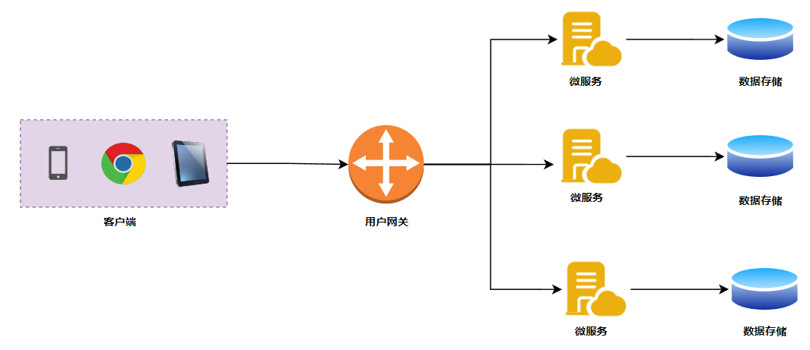
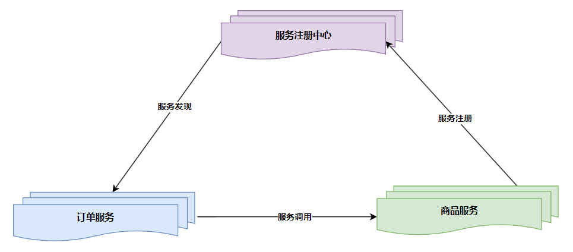
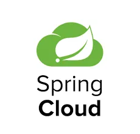
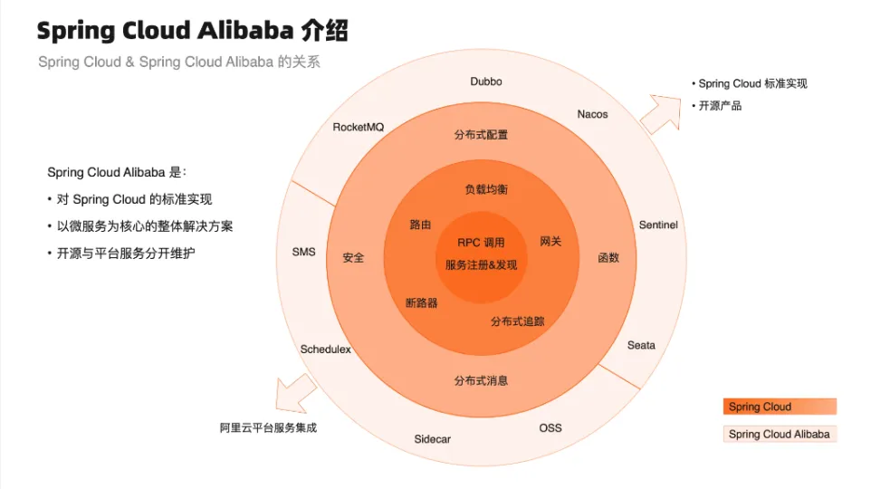
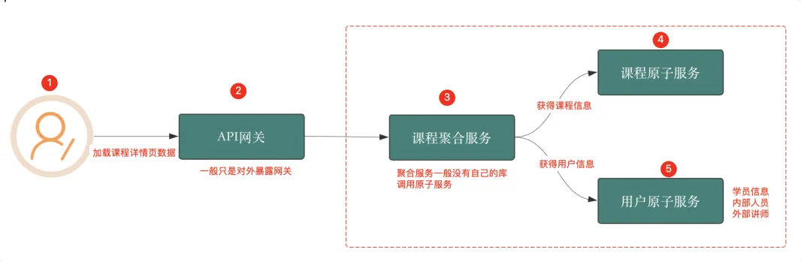
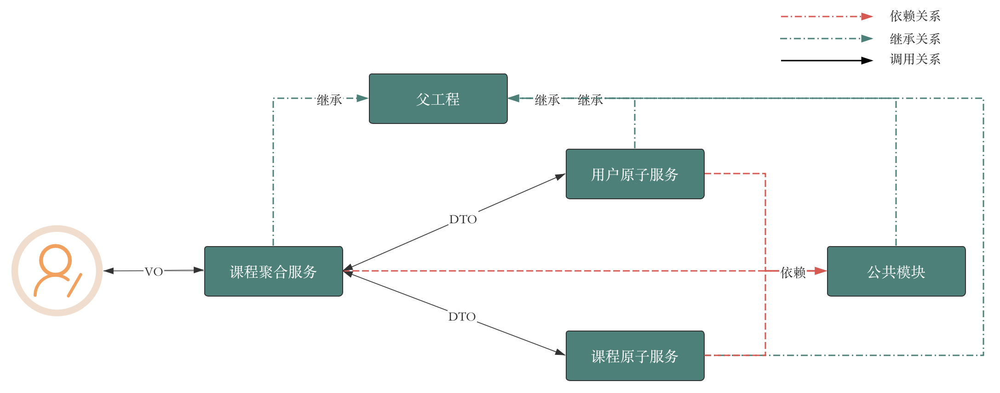
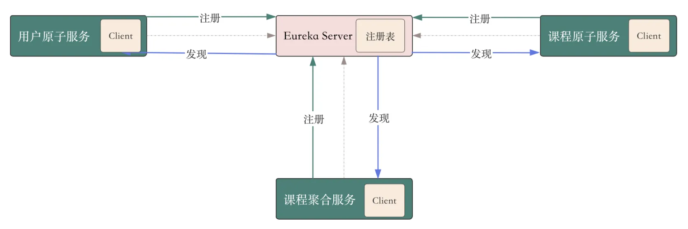
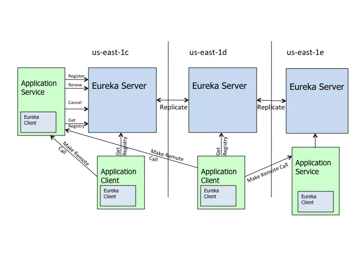
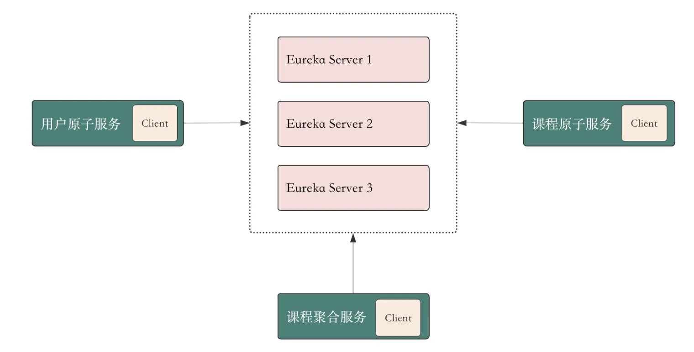

# 1.微服务技术体系

## 1.1 微服务架构应该包含哪些组件

相对于单体式架构的粗暴，微服务架构将应用打散，形成多个微服务进行独立开发、测试、部署和运维。

<div align="center">
    
</div>

虽然从管理与逻辑上更符合业务需要，但微服务架构也带来了多急需解决的核心问题：

- 如何发现新服务节点以及检查服务节点的状态?
- 如何发现服务及负载均衡如何实观?
- 服务间如何进行消息通信?
- 如何对使用者暴露服务 API?
- 如何集中管理众多服务节点的配置文件?
- 如何收集服务节点的日志并统一管理?
- 如何实现服务间调用链路追踪?
- 如何对系统进行链路保护，避免微服务雪?

可以发现，上述这些问题并不是针对某种语言或某种技术的，任何软件厂商要构建微服务架构就必须面对这些问题，要么独立开发要么将已有多种按术整合形成整体解决方案。好在经过多年沉淀，业内已经有了标准答案，下图清晰的说明微服务架构需要的标准组件。

下面我来介绍每种组件的职责。

### 1.1.1 注册/发现中心（Service Registry）

<div align="center">
    
</div>

在微服务架构中，任何服务都需要将自己的元数据（描述自身的数据，服务名称、IP、端口号以及自定义的配置信息等）向注册中心进行注册，服务注册中心组件维护了所有服务的元数据。服务发现就是根据一定的策略，周期性地将服务注册中心中维护的元数据拉取到本地。

注册中心是微服务架构最核心的组件。它起到新服务节点的注册与状态维护的作用，通过注册中心解决了上述问题 1，微服务节点在启动时会将自身的服务名称、IP、端口等信息在注册中心中进行登记，注册中心会定时检查该节点的运行状态。

注册中心通常会 **<font color="red">采用心跳机制最大程度保证其持有的服务节点列表都是可用的</font>**。

### 1.1.2 负载均衡（Load Balance）

负载均衡器解决了问题 2。通常在微服务彼此调用时并不是直接通过 IP、端口直接访问，而是首先通过服务名在注册中心查询该服务拥有哪些可用节点，然后注册中心将可用节点列表返回给服务调用者，这个过程称为服务发现。因服务高可用的要求，服务调用者会接收到多个可用节点，必须要从中进行选择，**<font color="red">因此在服务调用者一端必须内置负载均衡器，通过负载均衡策略选择适合的节点发起实质的通信请求</font>**。

### 1.1.3 服务通信（Communication）

服务通信组件解决了问题 3。在微服务定义中阐述服务间通信采用轻量级协议，通常是 HTTP RESTful 风格。但因 RESTful 风格过于灵后，必须加以约束，通常在应用时对其进行上层封装，例如在 Spring Cloud 中就提供了 Feign 和 RestTemplage 两种技术屏蔽底层实现 RESTful 通信细节，所有开发者是基于封装后统一的 SDK 进行开发，这有利于团队问协作。

### 1.1.4 API 服务网关（API Gateway）

服务网关解决问题 4。对于最终用户来说，微服务的通信与各种实现细节应该是透明的，用户只需关注他要使用的 API 接口即可。因此微服务架构引入服务网关控制用户的访问权限。**<font color="red">服务网关是外部环境访问内部微服务的唯一途径，在这个基础上还可以扩展出其他功能</font>**，例如：用户认证与授权、容错限流、动态路由、A/B测试、灰度发布等。

### 1.1.5 配置中心（Config Management）

配置中心解决问题 5。微服务架构下，微服务节点都包含自己的各种配置文件，如JDBC地址、自定义配置、环境配置等。要知道互联网公司微服务节点可能是成千上万个，如果这些配置信息分散存储在节点上，如发生配置变更就必须逐个调整，这必将给运维人员带来巨大的工作量。配置中心便因此而生，**<font color="red">通过部署配置中心服务器，将原本分散的配置文件从应用中剥离，集中转存到配置中心</font>**。一般配置中心会提供 UI 界面，可以方便快捷的实现大规模集群的配置调整。

### 1.1.6 集中式日志管理（Centralized Logging）

集中式日志解决问题 6。因为微服务架构默认将应用日志分散保存在每一个微服务节点上，当系统进行用户行为分析、数据统计时必须收集所有节点日志数据。那如何有效收集所有节点的运行日志，并对其进行分析汇总呢？业内常见的方案有 ELK、EFK，通过搭建独立的日志收集系统，定时抓取增量日志形成有效的统计报表，为决策提供数据支撑。

### 1.1.7 分布式链路追踪（Distributed Tracing）

分布式追踪解决问题 7。一个复杂的业务流程可能需要连续调用多个微服务，**<font color="red">我们需要记录一个完整业务逻辑涉及的每一个微服务的运行状态，再通过可视化链路图展现</font>**，帮助软件工程师在系统出错时分析解决问题。

### 1.1.8 服务保护（Service Protection）

服务限流、熔断、降级。服务保护解决问题 8。在服务间通信过程中，如果某个微服务出现响应高延迟可能会导致线程池满载，严重时会引起系统崩溃。这里就需要引入服务保护组件实现高延迟服务的快速降级，避免系统崩溃。

以上是在微服务架构过程中派生的新问题以及对应的解决方案，这些组件是微服务架构设计时必须考虑的事情。

# 2.开发高可用的微服务项目

## 2.1 SpringCloud 微服务体系

<div align="center">
    
</div>

Spring Cloud 是什么？

- 第一层意思 Spring Cloud 是一套微服务构建的规范；
- 第二层意思 Spring Cloud 是一套微服务解决方案，是一堆开发微服务组件的集合，框架，解决方案；

Spring Cloud 提供以微服务为核心的分布式系统构建标准。**<font color="red">所以 Spring Cloud 其实是一套规范，是一套用于构建微服务架构的规范，而不是一个可以拿来即用的框架</font>**（所谓规范就是应该有哪些功能组件，每个组件应该提供什么样的功能，组件之间如何配合）。

Spring Cloud 是分布式微服务架构的一站式解决方案，它提供了一套简单易用的编程模型（组件集），使我们能在 Spring Boot 的基础上轻松地实现微服务系统的构建。Spring Cloud 本身并不是一个开箱即用的框架，它是一套微服务规范，共有两代实现（通过时间进行衡量）。

- Spring Cloud Netflix 是 Spring Cloud 的第一代主要实现，主要由 Eureka（注册中心）、Ribbon（负载均衡）、Feign（远程调用）、Hystrix（熔断降级） 等组件组成。 
  - Spring Cloud 2020.0.0 版本彻底删除掉了Netflix（除Eureka外）的所有组件
  - 基于 Spring Cloud 编程模型实现的微服务框架，是最早期的微服务框架。Netflix 宣布大多数组件停止维护。
- **<font color="red">Spring Cloud Alibaba 是 Spring Cloud 的第二代实现</font>**，主要由 Nacos（注册中心、配置中心）、Sentinel（限流、熔断、降级）、Seata（分布式事务） 等组件组成。 
  - Alibaba 提供的基于 Spring Cloud 编程模型实现的微服务框架，其所有组件都来自于阿里巴巴微服务技术
  - 无论是解决方案完整性、技术成熟度、社区还是文档资料等都对国内开发者非常友好

## 2.2 SpringCloud Alibaba

<div align="center">
    
</div>

Spring Cloud Alibaba 是阿里巴巴结合自身丰富的微服务实践而推出的微服务开发的一站式解决方案，是 Spring Cloud 第二代实现的主要组成部分。吸收了 Spring Cloud Netflix 微服务框架的核心架构思想，并进行了高性能改进。自 Spring Cloud Netflix 进入停更维护后，Spring Cloud Alibaba 逐渐代替它成为主流的微服务框架。

同时 Spring Cloud Alibaba 也是国内首个进入 Spring 社区的开源项目。2018 年 7 月，Spring Cloud Alibaba 正式开源，并进入 Spring Cloud 孵化器中孵化；2019 年 7 月，Spring Cloud 官方宣布 Spring Cloud Alibaba 毕业。

## 2.3 SpringCloud Alibaba 版本介绍

预发布版本的后缀从 . 改为 -，例如：2020.0.0-M1（M1 表示里程碑版本 1）和 2020.0.0-RC2（RC2 表示候选发布版本 2）。

预发布版本（Pre-release Version）是指在正式版本发布之前发布的多个过渡性版本，目的是让开发者和用户提前体验和测试新功能，并提供反馈。这些版本通常包括 Milestone 版本、Release Candidate 版本和 Snapshot 版本。

1. Mile stone ( 里程碑) 版本
- 定义：标志着一个开发阶段的完成，包含了一系列新功能和改进。虽然功能基本完整，但可能还有未解决的 bug 和不稳定的地方。
- 命名：使用 -M 后缀，如 2022.0.0-M1 表示第一个里程碑版本。
- 用途：主要用于功能测试和集成测试，收集早期反馈。
2. Release Candidate ( 候选发布) 版本 
- 定义：接近正式发布的版本，包含所有计划的功能和大部分 bug 修复。通常作为最终版本的候选版本，等待进一步测试和最后的确认。
- 命名：使用 -RC 后缀，如 2022.0.0-RC1 表示第一个候选发布版本。
- 用途：用于最后的测试阶段，确保没有严重问题后再进行正式发布。
3. Snapshot ( 快照) 版本 
- 定义：表示当前开发状态的版本，常用于持续集成和每日构建。包含最新的代码改动和未完成的特性。
- 命名：使用 -SNAPSHOT 后缀，如 2022.0.0-SNAPSHOT。
- 用途：仅用于开发和测试，不用于生产环境。

## 2.4 基础案例准备

### 2.4.1 案例说明

<div align="center">
    
</div>

用户发起请求的流程和经过的节点如下所示：

<div align="center">
    
</div>

在微服务架构中，服务本身也是分层的，**<font color="red">原子服务直接与数据库进行交互，每个原子服务都有自己的库（MySQL、MongoDB、Redis、ES），原子服务是聚合服务进行调用</font>**。原子服务之间不进行调用，更不能反向调用聚合服务。

1. API网关 (API Gateway)

- 请求路由：API 网关负责将客户端请求路由到相应的微服务。
- 安全管理：它处理认证、授权等安全性问题。
- 负载均衡：分发请求到多个微服务实例上，实现负载均衡。
- 流量控制：可以进行限流、熔断等流量管理。
- 协议转换：能够在不同的协议之间进行转换，例如从 HTTP 到 gRPC 等。这是因为用户请求一般都使用 HTTP 协议，但是微服务内部各个服务之间一般使用 RPC 协议进行通信，比如 gRPC、Dubbo 协议。
- 聚合响应：在某些情况下，它可以从多个微服务聚合响应数据，并返回给客户端。

2. 聚合服务 (Aggregation Service)

- 数据聚合：从多个原子服务中获取数据，进行整合后返回给调用者，**聚合服务没有自己的库**。
- 业务逻辑处理：可以在一个聚合服务中实现跨多个原子服务的复杂业务逻辑。
- 简化接口：对外暴露一个简化的接口，隐藏内部多个原子服务的复杂性。
- 降低客户端复杂性：客户端不需要处理多个服务的调用和数据整合，聚合服务替其完成。

3. 原子服务 (Atomic Service)

- 单一职责：原子服务通常是围绕某一个具体的业务能力或数据实体进行封装，遵循单一职责原则。
- 可重用性：由于职责单一，原子服务更容易在不同的业务场景下重用。
- 灵活性：可以根据业务需求独立扩展或修改，不需要影响其他服务。

总结：
- API 网关：主要处理请求路由、安全管理和流量控制等功能，是客户端与微服务之间的中介。
- 聚合服务：负责从多个原子服务中获取数据并进行整合，提供给客户端一个简化的接口。
- 原子服务：实现具体的业务功能和数据操作，遵循单一职责原则，独立部署和扩展。

### 2.4.2 数据库准备

**`course_db`** 数据库 - 课程表：

```sql{.line-numbers}
CREATE TABLE course (
  course_id INT AUTO_INCREMENT PRIMARY KEY,       -- 课程ID，主键
  course_name VARCHAR(255) NOT NULL,              -- 课程名称
  price DECIMAL(10, 2) NOT NULL,                  -- 定价
  actual_price DECIMAL(10, 2) NOT NULL,           -- 实际售价
  instructor_id INT NOT NULL,                     -- 讲师ID
  purchase_count INT DEFAULT 0,                   -- 购买人数
  duration INT NOT NULL,                          -- 课程时长（以分钟为单位）
  description TEXT,                               -- 课程介绍
  learner_count INT DEFAULT 0,                    -- 学习人数
  favorite_count INT DEFAULT 0,                   -- 课程收藏人数
  created_at TIMESTAMP DEFAULT CURRENT_TIMESTAMP, -- 创建时间
  updated_at TIMESTAMP DEFAULT CURRENT_TIMESTAMP ON UPDATE CURRENT_TIMESTAMP -- 更新时间
);
```

**`user_db`** 数据库 - 讲师表：

```sql{.line-numbers}
CREATE TABLE instructor (
  instructor_id INT AUTO_INCREMENT PRIMARY KEY,   -- 讲师ID，主键
  instructor_name VARCHAR(255) NOT NULL,          -- 讲师名称
  position VARCHAR(255),                          -- 职位
  sort_order INT DEFAULT 0,                       -- 排序
  bio TEXT,                                       -- 简介
  created_at TIMESTAMP DEFAULT CURRENT_TIMESTAMP, -- 创建时间
  updated_at TIMESTAMP DEFAULT CURRENT_TIMESTAMP ON UPDATE CURRENT_TIMESTAMP -- 更新时间
);
```

基础数据：

```c{.line-numbers}
-- 插入课程数据
INSERT INTO course (course_name, price, actual_price, instructor_id, purchase_count, duration, description, learner_count,favorite_count)
VALUES
('微服务架构设计与实战进阶课', 499, 99.99, 1, 150, 1200, '这是一门聚焦微服务解决方案的课程，包括服务项目开发、服务治理、容错治理和大厂经验分享', 300, 50),
('大学生校招/实习求职规划综合指导课', 299, 99.9, 2, 200, 1800, '从校园到职场，一站式导航你的职业旅程一一掌握求职秘籍，开启你的职业巅峰之路！', 450, 75),
('Apache Pulsar在招聘平台中的应用场景', 249, 199, 3, 180, 1500, '关于Apache Pulsar，你想要的都在这里！', 350, 60);

-- 插入讲师数据
INSERT INTO instructor (instructor_name, position, sort_order, bio)
VALUES
('大师兄', '架构驿站站长', 1, '北京交大毕业，2012年入行，先后在广联达、美团、拉勾网等企业工作。'),
('Wendy', 'HR招聘专家', 2, '字节跳动HR招聘专家 专注于研发和算法岗位的招聘方向，拥有十年左右的工作经验。'),
('大司马', '联合创始人', 3, '现就职于北京西欧外企，任北京区技术负责人。');
```

## 2.5 搭建基础工程

### 2.5.1 项目工程结构

<div align="center">
    
</div>

Alibaba开发手册 - 分层领域模型规约：

- DO（Data Object）：此对象与数据库表结构一一对应，通过 DAO 层向上传输数据源对，**<font color="red">DO 对象只能由原子服务操作，不能对外进行暴露</font>**；
- DTO（Data Transfer Object）：数据传输对象，Service 或 Manager 向外传输的对象，**<font color="red">课程原子服务以及用户原子服务返回给聚合服务的就是 DTO 对象</font>**；
- BO（Business Object）：业务对象，可以由 Service 层输出的封装业务逻辑的对象；
- Query：数据查询对象，各层接收上层的查询请求。注意超过 2 个参数的查询封装，禁止使用 Map 类来传输；
- VO（View Object）：显示层对象，通常是 Web 向模板渲染引擎层传输的对象，因此课程聚合服务返回给用户的就是 VO 对象； 

```xml{.line-numbers}
architecture-station 父工程
├── architecture-station-common 公共模块
│   └── src
│       └── main
│           └── java
│               └── com
│                   └── sa
│                       └── common
│                           ├── dto
│                           └── util
├── architecture-station-course-service 课程原子服务
│   └── src
│       └── main
│           └── java
│               └── com
│                   └── sa
│                       └── course
│                           ├── controller
│                           ├── service
│                           ├── mapper
│                           └── dataobject
├── architecture-station-user-service 用户原子服务
│   └── src
│       └── main
│           └── java
│               └── com
│                   └── sa
│                       └── user
│                           ├── controller
│                           ├── service
│                           ├── mapper
│                           └── dataobject
└── architecture-station-course-aggregation-service 课程聚合服务
  └── src
      └── main
          └── java
              └── com
                  └── sa
                      └── aggregation
                          ├── controller
                          ├── service
                          └── vo
```

### 2.5.2 课程原子服务

```java{.line-numbers}
package com.sa.course.controller;

import com.sa.common.dto.CourseDTO;
import com.sa.course.dataobject.Course;
import com.sa.course.msmapper.MsCourseMapper;
import com.sa.course.service.CourseService;
import lombok.RequiredArgsConstructor;
import org.springframework.http.ResponseEntity;
import org.springframework.web.bind.annotation.*;

/**
 * @author Architecture Station
 * @version 1.0
 */
@RestController
@RequiredArgsConstructor
@RequestMapping(value = "/api/courses")
public class CourseController {

    private final CourseService courseService;
    private final MsCourseMapper msCourseMapper;

    // http://localhost:9000/api/courses/courseId
    @GetMapping("/{courseId}")
    public ResponseEntity<CourseDTO> getCourse(@PathVariable Long courseId ){
        Course course = courseService.getById(courseId);
        if(course == null){
            return ResponseEntity.notFound().build();
        }
        CourseDTO courseDTO = msCourseMapper.toDTO(course);
        return ResponseEntity.ok(courseDTO);
    }

}

package com.sa.course.msmapper;

import com.sa.common.dto.CourseDTO;
import com.sa.course.dataobject.Course;
import org.mapstruct.Mapper;

/**
 * @author Architecture Station
 * @version 1.0
 */
@Mapper(componentModel = "spring")
public interface MsCourseMapper {

    CourseDTO toDTO(Course course);
    Course toDO(CourseDTO courseDTO);

}
```

### 2.5.3 用户原子服务

```java{.line-numbers}
package com.sa.user.controller;

import com.sa.common.dto.InstructorDTO;
import com.sa.user.dataobject.Instructor;
import com.sa.user.msmapper.MsInstructorMapper;
import com.sa.user.service.InstructorService;
import lombok.RequiredArgsConstructor;
import org.springframework.http.ResponseEntity;
import org.springframework.web.bind.annotation.*;

/**
 * @author Architecture Station
 * @version 1.0
 */
@RestController
@RequiredArgsConstructor
@RequestMapping(value = "/api/instructors")
public class InstructorController {

    private final InstructorService instructorService;
    private final MsInstructorMapper msInstructorMapper;

    @GetMapping("/{instructorId}")
    public ResponseEntity<InstructorDTO> getInstructorById(@PathVariable Integer instructorId) {
        Instructor instructor = instructorService.getById(instructorId);
        if(instructor==null){
            return ResponseEntity.notFound().build();
        }
        return ResponseEntity.ok(msInstructorMapper.toDTO(instructor));
    }
}

package com.sa.user.msmapper;

import com.sa.common.dto.CourseDTO;
import com.sa.common.dto.InstructorDTO;
import com.sa.user.dataobject.Instructor;
import org.mapstruct.Mapper;

/**
 * @author Architecture Station
 * @version 1.0
 */
@Mapper(componentModel = "spring")
public interface MsInstructorMapper {
    InstructorDTO toDTO(Instructor instructor);
    Instructor toDO(InstructorDTO instructorDTO);
}
```

### 2.5.4 课程聚合服务

```java{.line-numbers}
package com.sa.course.aggregation.controller;

import com.sa.common.dto.CourseDTO;
import com.sa.common.dto.InstructorDTO;
import com.sa.course.aggregation.msmapper.MsCourseDetailMapper;
import com.sa.course.aggregation.vo.CourseDetailVO;
import lombok.RequiredArgsConstructor;
import lombok.extern.slf4j.Slf4j;
import org.springframework.http.ResponseEntity;
import org.springframework.web.bind.annotation.GetMapping;
import org.springframework.web.bind.annotation.PathVariable;
import org.springframework.web.bind.annotation.RequestMapping;
import org.springframework.web.bind.annotation.RestController;
import org.springframework.web.client.RestTemplate;

/**
 * @author Architecture Station
 * @version 1.0
 */
@RestController
@RequestMapping(value = "/api/courses")
@RequiredArgsConstructor
@Slf4j
public class CourseAggregationController {

    private final RestTemplate restTemplate;
    private final MsCourseDetailMapper msCourseDetailMapper;

    // 定义访问课程原子服务的地址
    private static final String COURSE_SERVICE_URL = "http://127.0.0.1:9000/api/courses/";
    // 定义访问用户原子服务的地址
    private static final String USER_SERVICE_URL = "http://127.0.0.1:8000/api/instructors/";

    @GetMapping("/{courseId}")
    public ResponseEntity<CourseDetailVO> getCourseDetail(@PathVariable Integer courseId) {
        // 调用课程服务获取课程信息
        ResponseEntity<CourseDTO> courseResponseEntity = restTemplate.getForEntity(COURSE_SERVICE_URL + courseId, CourseDTO.class);
        // 判断课程信息是否为空
        if (!courseResponseEntity.getStatusCode().is2xxSuccessful() || courseResponseEntity.getBody() == null) {
            return ResponseEntity.notFound().build();
        }
        CourseDTO courseDTO = courseResponseEntity.getBody();
        // 调用用户服务获取讲师信息
        ResponseEntity<InstructorDTO> instructorResponseEntity = restTemplate.getForEntity(USER_SERVICE_URL + courseDTO.getInstructorId(), InstructorDTO.class);
        InstructorDTO instructorDTO = null;
        if (instructorResponseEntity.getStatusCode().is2xxSuccessful() && instructorResponseEntity.getBody() != null) {
            instructorDTO = instructorResponseEntity.getBody();
        }else {
            log.error("获取讲师信息失败,失败的讲师ID：{}",courseDTO.getInstructorId());
        }
        return ResponseEntity.ok(msCourseDetailMapper.toCourseDetailVO(courseDTO,instructorDTO));
    }

}

package com.sa.course.aggregation.msmapper;

import com.sa.common.dto.CourseDTO;
import com.sa.common.dto.InstructorDTO;
import com.sa.course.aggregation.vo.CourseDetailVO;
import org.mapstruct.Mapper;
import org.mapstruct.Mapping;
import org.mapstruct.Mappings;

/**
 * @author Architecture Station
 * @version 1.0
 */
@Mapper(componentModel = "spring")
public interface MsCourseDetailMapper {

    /**
     * 在每个DTO中都有一个讲师ID，所以需要指定将哪个DTO中的讲师ID赋值给CourseDetailVO中的讲师ID
     * @param courseDTO
     * @param instructorDTO
     * @return
     */

    @Mapping(source = "instructorDTO.instructorId", target = "instructorId")
    @Mapping(source = "courseDTO.createdAt",target = "createdAt")
    @Mapping(source = "courseDTO.updatedAt",target = "updatedAt")
    CourseDetailVO toCourseDetailVO(CourseDTO courseDTO, InstructorDTO instructorDTO);

}
```

# 3.服务注册中心

## 3.1 注册中心工作原理

### 3.1.1 服务注册

服务注册是指一个微服务在启动时向一个服务注册中心（例如，Eureka、Consul、Nacos 等）报告它自己的地址和端口等信息，以便其他服务可以找到它。

主要步骤：

1. **微服务启动**：当微服务实例启动时，会向服务注册中心发送一个注册请求。
2. **发送实例信息**：注册请求包含该微服务实例的具体信息，包括 IP 地址、端口、元数据（如服务名、版本等）。
3. **注册中心记录**：服务注册中心接收到请求后，将该微服务实例的信息记录在其服务注册表中。
4. **确认注册**：服务注册中心通常会返回一个确认信息，告知微服务实例注册成功。

作用：

- **集中管理**：服务注册中心集中管理所有微服务实例的信息。
- **动态变化**：服务可以动态加入或退出系统，服务注册中心能实时更新服务信息。

（2）服务发现

服务发现是指一个微服务在需要调用其他微服务时，通过服务注册中心查找获取目标服务实例的地址和端口等信息的过程。主要步骤：

1. 服务查询：当一个微服务需要调用另一个微服务时，它会向服务注册中心发送一个查询请求。
2. 服务注册中心查找：服务注册中心根据请求中的服务名查找对应的服务实例信息。
3. 返回实例信息：服务注册中心将符合条件的服务实例地址列表返回给请求的微服务。
4. 调用目标服务：请求的微服务根据返回的实例信息，选择一个可用的服务实例进行调用。
 
作用：

- 负载均衡：通过服务发现，调用方可以获取多个服务实例的信息，并实现负载均衡。
- 故障转移：如果某个服务实例不可用，服务发现可以通过获取其他实例的信息来实现故障转移。

（3）客户端缓存和周期性刷新

虽然服务发现本身是按需执行的，但为了提高性能和减少对服务注册中心的压力，有些服务发现机制会引入缓存和周期性刷新的概念：

1. 客户端缓存： 
   - 客户端在第一次发现服务实例后，可以将实例信息保存在本地缓存中；
   - **<font color="red">后续的调用可以直接使用缓存的信息，而不必每次都查询服务注册中心</font>**；
2. 周期性刷新： 
   - 为了保持缓存中的实例信息的最新状态，客户端会周期性地刷新缓存；
   - 这种刷新通常是通过定期向服务注册中心发送请求来获取最新的实例列表；
   - 刷新的周期可以根据具体需求配置，例如每隔 30 秒或 1 分钟刷新一次；

（4）续约

续约（心跳机制）是指在微服务注册之后，**<font color="red">微服务实例需要定期向服务注册中心发送心跳消息，以表明它仍然处于正常运行状态</font>**。

主要步骤：

1. 定期发送心跳：微服务实例定期（例如，每 30 秒）向服务注册中心发送心跳消息。
2. 续约成功：服务注册中心接收到心跳消息后，更新该微服务实例的租约（Lease）信息，表示该实例仍然存活。
3. 失效检测：如果服务注册中心在一定时间内（例如，90 秒）未收到某个微服务实例的心跳消息，则认为该实例已失效，从注册表中移除该实例信息。

作用：

- 健康检查：通过续约机制，服务注册中心能够实时监控各个微服务实例的健康状态。
- 动态更新：**当某个微服务实例失效时，服务注册中心能及时更新服务注册表，通知其他微服务避免调用失效实例**。

### 3.1.2 注册中心对比

1.Spring Cloud Netflix Eureka

- 适合中小规模的微服务架构。 
- 延迟：注册和发现的延迟较低，但自我保护机制在网络分区时可能会延迟服务下线。 
- AP（可用性和分区容忍性）：Eureka 在设计上倾向于可用性和分区容忍性，在网络分区情况下会选择可用性。**<font color="red">因为 Eureka 为 AP 高可用的，所以集群中每个节点都是 peer，平等的，没有主从之分（无 master/slave）</font>**。
- Eureka 可以很容易地部署在容器化环境（如 Docker 和 Kubernetes）中，官方和社区提供了大量的支持文档和示例。 
- 学习成本相对较低：对于熟悉 Spring Cloud 的开发者来说，Eureka 的学习成本较低，配置和使用相对简单。 
- 与 Spring Cloud 生态系统高度集成，非常适合 Spring Boot 和 Spring Cloud 项目。 

适用场景

- 中小规模微服务架构。
- 对一致性要求不高的应用。
- 快速开发和部署的场景。

2.Spring Cloud Alibaba Nacos

- 吞吐量：适合中大型规模的微服务架构，支持高并发的注册、发现和配置管理请求。 
- 延迟：延迟较低，能够快速响应服务的注册和发现。 
- 支持 AP/CP 切换 
- 容器化支持良好：Nacos 提供了官方的 Docker 镜像和 Helm Chart，方便在 Kubernetes 中部署和管理。 
- 学习成本中等：文档和示例丰富，社区支持较好，但初始配置较复杂。 
- 阿里巴巴技术栈：与 Spring Cloud Alibaba 无缝集成。 

适用场景

- 需要一站式解决方案的项目。
- 使用阿里巴巴技术栈的生态系统。
- 对一致性和可用性有较高要求的应用。

3.Etcd

- 吞吐量：适合高并发、高吞吐量的注册和发现请求。 
- 延迟：延迟较低，非常适合实时性要求高的应用。 
- CP（一致性和分区容忍性）：Etcd 在设计上强调一致性，适合需要强一致性的场景。 
- 容器化支持良好：Etcd 提供了官方的 Docker 镜像，Kubernetes 使用 Etcd 作为其数据存储后端，集成度高。 
- 学习成本较高：要求对分布式系统有较深的理解，配置和运维较复杂。 
适用技术栈
- Kubernetes：Etcd 是 Kubernetes 的默认数据存储，适合容器编排系统。
- 多技术栈支持：适用于 Go、Python、Java 等多种语言。

适用场景

- 高一致性、高可用性的场景。
- 需要分布式协调服务的项目。
- Kubernetes 及其生态系统。

## 3.2 Eureka 应用实战

### 3.2.1 项目结构

本项目的逻辑结构图如下所示：

<div align="center">
    
</div>

```yaml{.line-numbers}
architecture-station 父工程
├── architecture-station-common 公共模块
│   └── src
│       └── main
│           └── java
│               └── com
│                   └── sa
│                       └── common
│                           ├── dto
│                           └── util
├── architecture-station-course-service 课程原子服务
│   └── src
│       └── main
│           └── java
│               └── com
│                   └── sa
│                       └── course
│                           ├── controller
│                           ├── service
│                           ├── mapper
│                           └── dataobject
├── architecture-station-user-service 用户原子服务
│   └── src
│       └── main
│           └── java
│               └── com
│                   └── sa
│                       └── user
│                           ├── controller
│                           ├── service
│                           ├── mapper
│                           └── dataobject
├── architecture-station-course-aggregation-service 课程聚合服务
│   └── src
│       └── main
│           └── java
│               └── com
│                   └── sa
│                       └── aggregation
│                           ├── controller
│                           ├── service
│                           └── vo
└── architecture-station-eureka-server 服务注册中心
  └── src
      └── main
          └── java
              └── com
                  └── sa
                      └── eureka
                          └── server
                              └── EurekaServerApplication.java
```

### 3.2.2 搭建 Eureka Server

（1）在父工程中引入微服务依赖

```xml{.line-numbers}
<?xml version="1.0" encoding="UTF-8"?>
<project xmlns="http://maven.apache.org/POM/4.0.0"
  xmlns:xsi="http://www.w3.org/2001/XMLSchema-instance"
  xsi:schemaLocation="http://maven.apache.org/POM/4.0.0 http://maven.apache.org/xsd/maven-4.0.0.xsd">

  <!-- 继承Spring Boot的父POM -->
  <!-- 该父POM提供了一整套建立Spring Boot应用所需的默认配置 -->
  <parent>
    <groupId>org.springframework.boot</groupId>
    <artifactId>spring-boot-starter-parent</artifactId>
    <version>3.2.1</version>
    <relativePath/>
  </parent>
  <modules>
    <module>architecture-station-course-service</module>
    <module>architecture-station-user-service</module>
    <module>architecture-station-common</module>
    <module>architecture-station-course-aggregation-service</module>
    <module>architecture-station-eureka-server</module>
  </modules>


  <!-- 项目基础信息 -->
  <modelVersion>4.0.0</modelVersion>
  <groupId>com.sa</groupId> <!-- 你的组织或公司的域名反向，确保唯一性 -->
  <artifactId>architecture-station</artifactId><!-- 项目名称 -->
  <version>1.0-SNAPSHOT</version> <!-- 项目版本 -->
  <packaging>pom</packaging><!-- 打包方式为POM，说明此处是一个聚合（或父）项目 -->

  <properties>
    <lombok.version>1.18.30</lombok.version> <!-- Lombok库版本 -->
    <junit.jupiter.version>5.8.2</junit.jupiter.version> <!-- JUnit Jupiter版本 -->
    <mybatis.plus.version>3.5.6</mybatis.plus.version> <!-- MyBatis Plus版本 -->
    <mybatis.boot.version>3.0.2</mybatis.boot.version> <!-- 具体用途未明，建议核对 -->
    <mysql.version>8.0.33</mysql.version> <!-- MySQL驱动版本 -->
    <maven.compiler.source>21</maven.compiler.source> <!-- 源码编译Java版本 -->
    <maven.compiler.target>21</maven.compiler.target> <!-- 目标编译Java版本 -->
    <maven.compiler.plugin.version>3.8.1</maven.compiler.plugin.version> <!-- Maven编译插件版本 -->
    <!-- DO/DTO/VO/BO 统一转换工具 -->
    <org.mapstruct.version>1.5.5.Final</org.mapstruct.version> <!-- MapStruct版本 -->

    <!--引入微服务相关的版本-->
    <spring-cloud.version>2023.0.1</spring-cloud.version>
    <spring-cloud-alibaba.version>2023.0.1.0</spring-cloud-alibaba.version>
  </properties>

  <!-- 依赖管理：在此处定义的依赖版本信息可被子模块继承 -->
  <dependencyManagement>
    <dependencies>
      <dependency>
        <groupId>org.springframework.cloud</groupId>
        <artifactId>spring-cloud-dependencies</artifactId>
        <version>${spring-cloud.version}</version>
        <type>pom</type>
        <scope>import</scope>
      </dependency>
      <dependency>
        <groupId>com.alibaba.cloud</groupId>
        <artifactId>spring-cloud-alibaba-dependencies</artifactId>
        <version>${spring-cloud-alibaba.version}</version>
        <type>pom</type>
        <scope>import</scope>
      </dependency>
      <!-- MyBatis Plus Spring Boot Starter的依赖定义 -->

      <dependency>
        <groupId>com.baomidou</groupId>
        <artifactId>mybatis-plus-spring-boot3-starter</artifactId>
        <version>${mybatis.plus.version}</version>
           </dependency>
           <!-- MySQL驱动依赖定义 -->
           <dependency>
               <groupId>com.mysql</groupId>
               <artifactId>mysql-connector-j</artifactId>
               <version>${mysql.version}</version>
           </dependency>
           <!-- Lombok依赖定义，作为编译时注解处理器 -->
           <dependency>
               <groupId>org.projectlombok</groupId>
               <artifactId>lombok</artifactId>
               <version>${lombok.version}</version>
               <scope>provided</scope>
           </dependency>
           <!-- MapStruct的依赖定义，用于对象映射 -->
           <dependency>
               <groupId>org.mapstruct</groupId>
               <artifactId>mapstruct</artifactId>
               <version>${org.mapstruct.version}</version>
           </dependency>
           <!-- MapStruct的注解处理器，用于编译时处理MapStruct的注解 -->
           <dependency>
               <groupId>org.mapstruct</groupId>
               <artifactId>mapstruct-processor</artifactId>
               <version>${org.mapstruct.version}</version>
           </dependency>
       </dependencies>
   </dependencyManagement>

   <!-- 定义Maven仓库 -->
   <!-- 添加阿里云的Maven仓库，加速依赖下载 -->
   <repositories>
       <repository>
           <id>aliyun-public</id>
           <name>Aliyun Public Repository</name>
           <url>https://maven.aliyun.com/repository/public</url>
       </repository>
   </repositories>

   <!-- 定义插件仓库 -->
   <!-- 与上面的Maven仓库配置相似，用于插件下载 -->
   <pluginRepositories>
       <pluginRepository>
           <id>aliyun-public</id>
           <name>Aliyun Public Repository</name>
           <url>https://maven.aliyun.com/repository/public</url>
       </pluginRepository>
   </pluginRepositories>

   <!-- 构建配置 -->
   <!-- 配置Maven编译插件，指定Java版本和注解处理器 -->
   <build>
       <plugins>
           <plugin>
               <groupId>org.apache.maven.plugins</groupId>
               <artifactId>maven-compiler-plugin</artifactId>
               <version>${maven.compiler.plugin.version}</version>
               <configuration>
                   <source>${maven.compiler.source}</source>
                   <target>${maven.compiler.target}</target>
                   <!-- 指定注解处理器 -->
                   <annotationProcessorPaths>
                       <path>
                           <groupId>org.projectlombok</groupId>
                           <artifactId>lombok</artifactId>
                           <version>${lombok.version}</version>
                       </path>
                       <path>
                           <groupId>org.mapstruct</groupId>
                           <artifactId>mapstruct-processor</artifactId>
                           <version>${org.mapstruct.version}</version>
                       </path>
                   </annotationProcessorPaths>
               </configuration>
           </plugin>
       </plugins>
   </build>

</project>
```

Eureka Server 的配置文件 application.yaml 如下所示：

```yaml{.line-numbers}
server:
  port: 8761
spring:
  application:
    name: eureka-server # 应用名称
eureka:
  instance:
    hostname: localhost  # 设置 Eureka Server 的主机名或 IP 地址。在生产环境中，这应该是一个可解析的域名或静态 IP 地址。
    lease-renewal-interval-in-seconds: 30  # 客户端向 Eureka Server 发送心跳的间隔时间，默认值为 30 秒。心跳用于告知 Eureka Server 该实例仍然活跃。
    lease-expiration-duration-in-seconds: 90  # 服务实例在 Eureka Server 过期的时间，默认值为 90 秒。如果 Eureka Server 在这个时间内没有收到实例的心跳，就会认为该实例不可用。

  client:
    register-with-eureka: true  # 指示 Eureka Server 是否需要向自身注册。通常在单节点 Eureka Server 中设置为 false，在集群环境中可以设置为 true。
    fetch-registry: false  # 指示 Eureka Server 是否需要从其他 Eureka Server 节点获取注册表信息。在单节点 Eureka Server 中通常设置为 false，在集群环境中可以设置为 true。

  server:
    enable-self-preservation: true  # 启用自我保护模式，防止大规模服务实例被剔除。自我保护模式下，Eureka Server 会在检测到网络分区或大规模实例丢失时，停止剔除实例。
    eviction-interval-timer-in-ms: 60000  # 配置 Eureka Server 检查租约过期的时间间隔，单位为毫秒。这个配置指定了 Eureka Server 多久检查一次实例租约的过期情况。
    defaultZone: http://${eureka.instance.hostname}:${server.port}/eureka/  # 配置 Eureka Server 的默认服务 URL。客户端将使用这个 URL 进行服务注册和发现。在单节点设置中，这通常指向自身。
    shutDownEnabled: true  # 启用服务关闭时的优雅关闭。设置为 true 时，当 Eureka Server 关闭时，会通知所有注册的实例，以便它们可以执行适当的清理操作。
```

register-with-eureka 是一个用于控制 Eureka Server 自身是否作为客户端注册到其他 Eureka Server 的配置选项。这一选项在构建 Eureka Server 高可用集群时尤为重要。**<font color="red">构建 Eureka Server 集群时，各个节点需相互注册，以同步服务注册表信息</font>**。如果将此选项设置为 false，Eureka Server 将不作为客户端注册到其他节点，通常用于单节点模式（非集群）。

fetch-registry 是一个用于控制 Eureka Client 是否从 Eureka Server 主动获取服务注册表信息的配置选项，该配置直接影响客户端能否发现其他服务的位置信息。

### 3.2.3 将服务集成到注册中心

（1）客户端添加依赖

```xml{.line-numbers}
<dependency>
    <groupId>org.springframework.cloud</groupId>
    <artifactId>spring-cloud-starter-netflix-eureka-client</artifactId>
</dependency>
```

（2）添加客户端配置

```yaml{.line-numbers}
eureka:
  client:
    serviceUrl:
      defaultZone: http://localhost:8761/eureka/ # eureka server 的路径
  instance:
    instance-id: ${spring.cloud.client.ip-address}:${spring.application.name}:${server.port}:@project.version@ # 实例 ID
    lease-renewal-interval-in-seconds: 30 # 心跳间隔
    lease-expiration-duration-in-seconds: 90 # 实例过期时间
    prefer-ip-address: true # 应优先使用服务器的 IP 地址, 默认是 false
```

（3）启动类

```java{.line-numbers}
@SpringBootApplication
@MapperScan("com.sa.course.mapper")
@EnableDiscoveryClient // 开启服务注册发现
public class CourseApplication {

    public static void main(String[] args) {
        SpringApplication.run(CourseApplication.class,args);
    }
}
```

### 3.2.4 通过 Eureka 完成调用

<div align="center">
    
</div>

EurekaClient 是 Netflix Eureka 服务发现系统中的一个关键组件，用于与 Eureka Server 进行交互。EurekaClient 主要职责包括服务注册、服务发现以及与 Eureka Server 的心跳通信。以下是其主要功能的详细介绍：

1. 服务注册：EurekaClient 可以将自身的服务实例信息（如 IP 地址、端口号、状态等）注册到 Eureka Server。这样，其他服务可以通过 Eureka Server 发现并调用该服务；
2. 服务发现：EurekaClient 允许从 Eureka Server 获取注册的服务实例信息。**它提供了多种方式来获取 InstanceInfo 对象，这些对象包含了服务实例的详细信息**。通过这些信息，服务可以发现并调用彼此；
3. 健康检查：EurekaClient 支持健康检查机制。它允许注册和访问健康检查处理器，以确保服务实例的健康状态。健康检查处理器会定期检测服务实例的健康状况，并将结果报告给 Eureka Server；
4. 本地客户端数据：EurekaClient 还可以提供关于本地客户端的数据，例如已知的区域、自己的可用区（AZ）等。这些数据有助于服务在多区域和多可用区环境中进行部署和发现；

EurekaClient 的 API 契约：

- 获取服务实例信息：**<font color="red">EurekaClient 提供了多种方法来获取 InstanceInfo 对象</font>**。这些方法支持通过服务名称、实例 ID 等多种方式来查询服务实例信息；
- 获取本地客户端数据：EurekaClient 能够提供关于本地客户端的各种数据，例如已知的区域、自身的可用区等。这些数据对于理解和管理多区域、多可用区的服务部署非常重要；
- 注册和访问健康检查处理器：EurekaClient 支持注册自定义的健康检查处理器，**<font color="red">以便定期评估服务实例的健康状况</font>**。它还提供了访问这些处理器的能力，以便在需要时进行健康检查的管理和配置；

从 Eureka Server 获取服务实例信息发起远程调用的代码如下所示：

```java{.line-numbers}
package com.sa.course.aggregation.controller;

import com.netflix.appinfo.InstanceInfo;
import com.netflix.discovery.EurekaClient;
import com.sa.common.dto.CourseDTO;
import com.sa.common.dto.InstructorDTO;
import com.sa.course.aggregation.msmapper.MsCourseDetailMapper;
import com.sa.course.aggregation.vo.CourseDetailVO;
import lombok.RequiredArgsConstructor;
import lombok.extern.slf4j.Slf4j;
import org.springframework.http.ResponseEntity;
import org.springframework.web.bind.annotation.GetMapping;
import org.springframework.web.bind.annotation.PathVariable;
import org.springframework.web.bind.annotation.RequestMapping;
import org.springframework.web.bind.annotation.RestController;
import org.springframework.web.client.RestTemplate;

import java.util.List;

/**
 * @author Architecture Station
 * @version 1.0
 */
@RestController
@RequestMapping(value = "/api/courses")
@RequiredArgsConstructor
@Slf4j
public class CourseAggregationController {

    private final RestTemplate restTemplate;
    private final MsCourseDetailMapper msCourseDetailMapper;
    private final EurekaClient eurekaClient;


    @GetMapping("/{courseId}")
    public ResponseEntity<CourseDetailVO> getCourseDetail(@PathVariable Integer courseId) {
        // 通过eurekaClient获得课程原子服务的实例信息
        // virtualHostName: course-service，服务的名称
        // secure：是否使用安全的协议 默认是http
        InstanceInfo courseInstanceInfo = eurekaClient.getNextServerFromEureka("course-service", false);
        // http://ip:port/api/courses/id
        String courseServiceUrl = "http://"+courseInstanceInfo.getHostName() + ":" + courseInstanceInfo.getPort() + "/api/courses/";

        // 调用课程服务获取课程信息
        ResponseEntity<CourseDTO> courseResponseEntity = restTemplate.getForEntity(courseServiceUrl + courseId, CourseDTO.class);
        // 判断课程信息是否为空
        if (!courseResponseEntity.getStatusCode().is2xxSuccessful() || courseResponseEntity.getBody() == null) {
            return ResponseEntity.notFound().build();
        }
        CourseDTO courseDTO = courseResponseEntity.getBody();

        InstanceInfo userInstanceInfo = eurekaClient.getNextServerFromEureka("user-service", false);
        String userServiceUrl = "http://"+userInstanceInfo.getHostName() + ":" + userInstanceInfo.getPort() + "/api/instructors/";
        // 调用用户服务获取讲师信息
        ResponseEntity<InstructorDTO> instructorResponseEntity = restTemplate.getForEntity(userServiceUrl + courseDTO.getInstructorId(), InstructorDTO.class);
        InstructorDTO instructorDTO = null;
        if (instructorResponseEntity.getStatusCode().is2xxSuccessful() && instructorResponseEntity.getBody() != null) {
            instructorDTO = instructorResponseEntity.getBody();
        }else {
            log.error("获取讲师信息失败,失败的讲师ID：{}",courseDTO.getInstructorId());
        }
        return ResponseEntity.ok(msCourseDetailMapper.toCourseDetailVO(courseDTO,instructorDTO));
    }
}
```

## 3.3 Eureka 实战进阶

### 3.3.1 Eureka 自我保护机制

**<font color="red">自我保护机制是 Eureka 在检测到大量客户端实例在短时间内失联时，暂时停止从注册表中删除这些实例的功能</font>**。目的是防止网络分区或临时故障导致服务实例被错误地移除，从而提高系统的可用性和容错性。

当 Eureka Server 在一个时间窗口内（默认为 15 分钟）接收到的心跳数量低于预期值（即注册实例总数的 85%）时，自我保护机制会被触发。

Eureka Server 自我保护机制启动时的行为：

- 不会从注册表中移除失联的服务实例；
- **继续向客户端提供当前注册表中已有的服务信息**；

Eureka Server 的自我保护机制配置方式如下所示：

```yaml{.line-numbers}
eureka:
  server:
    enable-self-preservation: true  # 启用自我保护机制,默认启用
    renewal-percent-threshold: 0.85  # 设置触发阈值（默认85%）
```

Eureka Server 自我保护机制的优点：

- 提高可用性：自我保护机制在网络分区或瞬时故障时，防止系统大规模地从注册表中移除服务实例，从而保持服务的稳定性； 
- 容错能力增强：在云环境中，网络抖动和节点故障是常见现象，自我保护机制帮助系统在这些情况下更好地容错； 
- 运维提示：自我保护机制触发时，会在日志中记录详细信息，提示运维人员注意系统状态，有助于及时发现并解决潜在问题；

Eureka Server 自我保护机制的缺点：

- 服务实例"僵尸化"：**当自我保护机制启用时，真正失效的服务实例可能不会被及时移除，导致客户端获取到不可用的服务实例**； 
- 恢复时间延长：自我保护机制可能会延长系统恢复正常状态的时间，因为需要手动干预来清理失效的服务实例；
- 监控复杂性增加：需要更复杂的监控和报警系统，以确保在自我保护机制启用时，能够正确识别和处理真正的故障实例；

Eureka Server 自我保护机制的退出条件：

1. 心跳恢复正常：当 Eureka Server 在连续多个检查周期内（由 **`evictionIntervalTimerInMs`** 定义）收到的心跳数量恢复到超过 **`renewalPercentThreshold`** 设定的比例时，自我保护机制会退出。
2. 实例重新注册：丢失心跳的实例重新发送心跳或注册到 Eureka Server，会逐步帮助 Eureka Server 恢复到正常状态。

### 3.3.2 Eureka 高可用架构方案

<div align="center">
    
</div>

大型的微服务架构：

- 在每个数据中心都部署了一个 Eureka Server 集群，不同中心的 Eureka Server 集群相互注册，每个区域的 Eureka Server 集群都会有所有服务的元数据，**<font color="red">不同数据中心的服务节点实例是可以相互调用的</font>**；
- Eureka Server 之间也是可以相互进行注册的，根据默认配置，每隔 30 秒去拉取对方的注册表；

中小型微服务架构：

- 最好针对 Eureka Server 部署一个集群，**<font color="red">至少要部署两台（最好部署 3 台 Eureka Server 服务节点）</font>**，没有主从的概念，每个节点都是平等（Peer）的，基于 AP 模式进行设计，任何时候都要保持高可用性； 
- 这两台 Eureka Server 要相互进行注册；
- **<font color="red">微服务架构中的每个服务节点都需要向两台 Eureka Server 进行注册</font>**；

### 3.3.3 Eureka 常规高可用方案

（1）方案架构

通常建议至少部署 3 个实例，以确保在一个实例故障时仍然能够提供服务：

<div align="center">
    
</div>

- Eureka Server 实例需要相互注册，以形成一个对等体（peer-to-peer）的集群；
- Eureka Server 之间相互注册；
- 每个 Eureka Client 向每个 Eureka Server 进行注册；

（2）Eureka Server 相互注册

假设有三个 Eureka Server 实例：eureka1、eureka2、eureka3。**`register-with-eureka`** 设置为 true，表明部署一个集群 Eureka Server 自身也作为客户端注册到其他 Eureka Server 上。

```yaml{.line-numbers}
server:
  port: 8761

eureka:
  instance:
    hostname: eureka1.architecture-station.com
  client:
    register-with-eureka: true
    fetch-registry: true
    service-url: # 向每一个 Eureka Server 进行注册，中间通过逗号隔开
      defaultZone: http://eureka2.architecture-station.com:8762/eureka/,http://eureka3.architecture-station.com:8763/eureka/
```

```yaml{.line-numbers}
server:
  port: 8762

eureka:
  instance:
    hostname: eureka2.architecture-station.com
  client:
    register-with-eureka: true
    fetch-registry: true
    service-url:
      defaultZone: http://eureka1.architecture-station.com:8761/eureka/,http://eureka3.architecture-station.com:8763/eureka/
```

```yaml{.line-numbers}
server:
  port: 8763

eureka:
  instance:
    hostname: eureka3.architecture-station.com
  client:
    register-with-eureka: true
    fetch-registry: true
    service-url:
      defaultZone: http://eureka1.architecture-station.com:8761/eureka/,http://eureka2.architecture-station.com:8762/eureka/
```

配置客户端应用程序如下所示，向所有的 3 个 Eureka Server 节点注册本微服务实例的相关信息。

```yaml{.line-numbers}
eureka:
  client:
    service-url:
      defaultZone: http://eureka1.architecture-station.com:8761/eureka/,http://eureka2.architecture-station.com:8762/eureka/,http://eureka3.architecture-station.com:8763/eureka/
```

