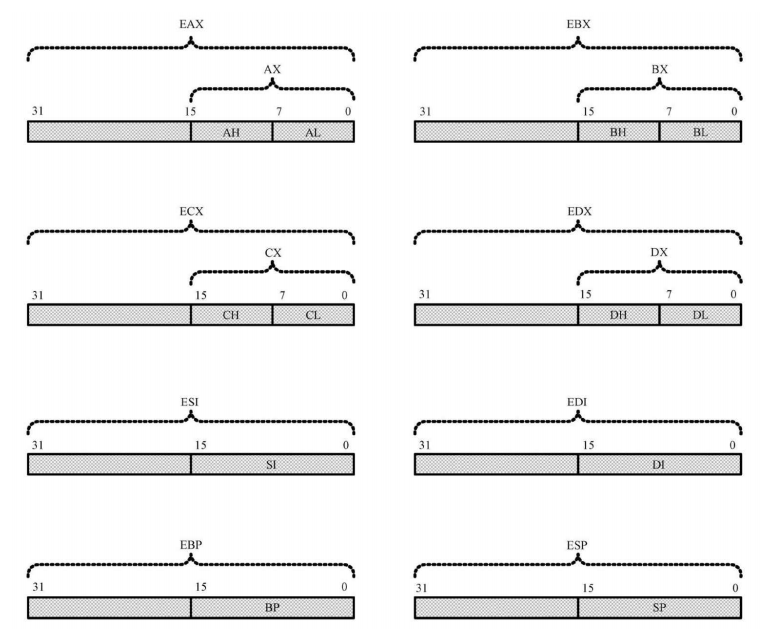
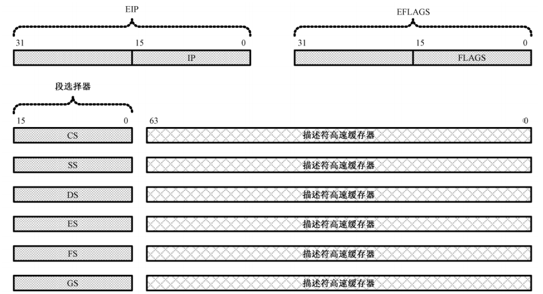

# 内存管理

## 一、IA-32 架构的基本执行环境

所谓处理器架构是指一整套的硬件结构，以及与之相适应的工作状态，决定了处理器的应用环境和工作模式，也决定了软件开发人员如何在这种模式下解决实际问题。**<font color="red">Intel 32 位处理器架构简称 IA-32 (Intel Architecture，32-bit)</font>**，是以 1978 年的 8086 处理器为基础发展起来的。8086 有 20 根地址线，可以寻址 1MB 内存。但是，它内部的寄存器是 16 位的，无法在程序中访问整个 1MB 内存。所以，它也是第一款支持内存分段模型的处理器，8086 处理器只有一种工作模式，即实模式。

32 位的处理器有 32 根地址线，数据线的数量是 32 根或者 64 根。因此，它可以访问 $2^{32}$，即 4GB 的内存，而且每次可以读写连续的 4 字节或者 8 字节，这称为双字 (Double Word) 或者 4 字 (Quad Word) 访问。

### 1.寄存器的扩展

在 16 位处理器内，有 8 个通用寄存器 AX、BX、CX、DX、SI、DI、BP 和 SP，其中，前 4 个还可以拆分成两个独立的 8 位寄存器来用，即 AH、AL、BH、BL、CH、CL、DH 和 DL。如下图所示，32 位处理器在 16 位处理器的基础上，扩展了这 8 个通用寄存器的长度，使之达到 32 位。

<div align="center">
    
</div>

为了在汇编语言程序中使用经过扩展 (Extend) 的寄存器，需要给它们命名，它们的名字分别是 EAX、EBX、ECX、EDX、ESI、EDI、ESP 和 EBP。**可以在程序中使用这些寄存器，即使是在实模式下**:

```armasm{.line-numbers}
mov eax, 0xf0000005
mov ecx, eax
add edx, ecx
```

但是，就像以上指令所示的那样，**<font color="red">指令的源操作数和目的操作数必须具有相同的长度</font>**，个别特殊用途的指令除外。因此，像这样的搭配是不允许的，在程序编译时，编译器会报告错误:

```armasm{.line-numbers}
mov eax, cx    ;错误的汇编语言指令
```

如果目的操作数是 32 位寄存器，源操作数是立即数，那么立即数被视为 32 位的：

```armasm{.line-numbers}
mov eax, 0xf5    ;EAX <- 0x0000_00f5
```

**32 位通用寄存器的高 16 位是不可独立使用的**，但低 16 位保持同 16 位处理器的兼容性。因此，在任何时候它们都可以照往常一样使用:

```armasm{.line-numbers}
mov ah, 0x02
mov al, 0x03
add ax, si
```

**可以在 32 位处理器上运行 16 位处理器上的软件**。但是，它并不是 16 位处理器的简单增强。事实上，32 位处理器有自己的 32 位工作模式，一般来说 32 位模式特指 32 位保护模式。在这种模式下，可以完全、充分地发挥处理器的性能，即处理器可以使用它全部的 32 根地址线，能够访问 4GB 内存。

如下图所示，在 32 位模式下，为了生成 32 位物理地址，处理器需要使用 32 位的指令指针寄存器 EIP。但是当它工作在 16 位模式下时，依然使用 16 位的 IP。和往常一样，即使是在 32 位模式下，EIP 寄存器也只由处理器内部使用，程序中是无法直接访问的。对 IP 和 EIP 的修改通常是用某些指令隐式进行的，这些指令包括 JMP、CALL、RET 和 IRET 等等。

<div align="center">
    
</div>

另外，在 16 位处理器中，标志寄存器 FLAGS 是 16 位的，在 32 位处理器中，扩展到了 32 位，低 16 位和原先保持一致。在 32 位模式下，对内存的访问从理论上来说不再需要分段，因为它有 32 根地址线，可以自由访问任何一个内存位置。**但是，IA-32 架构的处理器是基于分段模型的**，因此，32 位处理器依然需要以段为单位访问内存，即使它工作在 32 位模式下。

不过，它也提供了一种变通的方案，**即只分一个段，段的基地址是 0x00000000，段的长度 (大小) 是 4GB。在这种情况下，可以视为不分段，即平坦模型 (Flat Mode)**。

每个程序都有属于自己的内存空间。在 16 位模式下，一个程序可以自由地访问（甚至是修改）不属于它的内存位置。这当然是不安全的，但却没有任何机制来限制这种行为。**<font color="red">在 32 位模式下，处理器要求在加载程序时，先定义并安装该程序所拥有的段，然后允许使用这些段</font>**。定义段时，除了基地址(起始地址)外，还附加了段界限、特权级别、类型等属性。当程序访问一个段时，处理器将用固件实施各种检查工作，以防止对内存的违规访问。

如上图所示，在 32 位模式下，传统的段寄存器，如 CS、SS、DS、ES，**保存的不再是 16 位段基地址，而是段的选择子**。因此，它的新名字叫做段选择器。